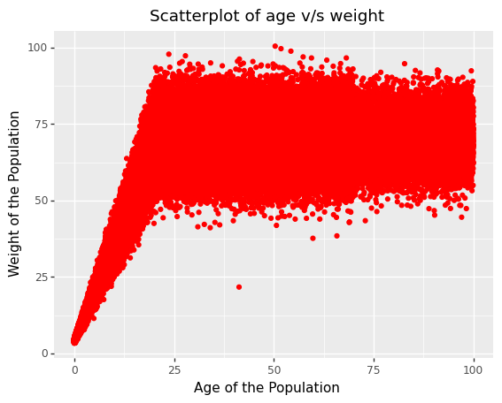

# Exercise1

Question.  Write a function temp_tester that takes a definition of normal body temperature and returns a function that returns True if its argument is within 1 degree of normal temperature and False if not.


```python
##Creating a function to assess whether a given body temperature is normal or not in terms of True or False. 

def temp_tester(temp):

  def inner_function(x):
    if x <= temp + 1 and x >= temp -1:
      return True
    else:
      return False
     
  return inner_function
```


```python
##Normal Body Temperature Values in ℃

human_tester = temp_tester(37) 
chicken_tester = temp_tester(41.1)
```

Test the function:  
chicken_tester(42) # True -- i.e. not a fever for a chicken  
human_tester(42)   # False -- this would be a severe fever for a human  
chicken_tester(43) # False  
human_tester(35)   # False -- too low  
human_tester(98.6) # False -- normal in degrees F but our reference temp was in degrees C  


```python
## Testing the function

print(chicken_tester(42))
print(human_tester(42))
print(chicken_tester(43))
print(human_tester(35))  
print(human_tester(98.6))
```

    True
    False
    False
    False
    False


# Exercise 2

Question. Download the sqlite3 database from hw1-population.db.
Examine data. What columns does it have? (2 points) How many rows (think: people) does it have? (2 points)

Examine the distribution of the ages in the dataset. In particular, be sure to have your code report the mean, standard deviation, minimum, maximum. (2 points) Plot a histogram of the distribution with an appropriate number of bins for the size of the dataset (describe in your readme the role of the number of bins). (3 points) Comment on any outliers or patterns you notice in the distribution of ages. (1 point)

Repeat the above for the distribution of weights. (3 points)

Make a scatterplot of the weights vs the ages. (3 points) Describe the general relationship between the two variables (3 points). You should notice at least one outlier that does not follow the general relationship. What is the name of the person? (3 points) Be sure to explain your process for identifying the person whose values don't follow the usual relationship in the readme. (3 points)

_Below is the code to load the dataset._


```python
## Importing the ibraries pandas and sqlite3 and loading the dataset. 

import pandas as pd
import sqlite3
with sqlite3.connect("/Users/mahimakaur/Downloads/hw1-population.db") as db:
    data = pd.read_sql_query("SELECT * FROM population", db)
```


```python
##Overview of the dataset

data
```


<div>
<style scoped>
    .dataframe tbody tr th:only-of-type {
        vertical-align: middle;
    }

    .dataframe tbody tr th {
        vertical-align: top;
    }

    .dataframe thead th {
        text-align: right;
    }
</style>
<table border="1" class="dataframe">
  <thead>
    <tr style="text-align: right;">
      <th></th>
      <th>name</th>
      <th>age</th>
      <th>weight</th>
      <th>eyecolor</th>
    </tr>
  </thead>
  <tbody>
    <tr>
      <th>0</th>
      <td>Edna Phelps</td>
      <td>88.895690</td>
      <td>67.122450</td>
      <td>brown</td>
    </tr>
    <tr>
      <th>1</th>
      <td>Cara Yasso</td>
      <td>9.274597</td>
      <td>29.251244</td>
      <td>brown</td>
    </tr>
    <tr>
      <th>2</th>
      <td>Gail Rave</td>
      <td>18.345613</td>
      <td>55.347903</td>
      <td>brown</td>
    </tr>
    <tr>
      <th>3</th>
      <td>Richard Adams</td>
      <td>16.367545</td>
      <td>70.352184</td>
      <td>brown</td>
    </tr>
    <tr>
      <th>4</th>
      <td>Krista Slater</td>
      <td>49.971604</td>
      <td>70.563859</td>
      <td>brown</td>
    </tr>
    <tr>
      <th>...</th>
      <td>...</td>
      <td>...</td>
      <td>...</td>
      <td>...</td>
    </tr>
    <tr>
      <th>152356</th>
      <td>John Fowler</td>
      <td>23.930833</td>
      <td>71.532569</td>
      <td>blue</td>
    </tr>
    <tr>
      <th>152357</th>
      <td>Diana Shuffler</td>
      <td>21.884819</td>
      <td>67.936753</td>
      <td>brown</td>
    </tr>
    <tr>
      <th>152358</th>
      <td>Kevin Cuningham</td>
      <td>87.705907</td>
      <td>60.074646</td>
      <td>brown</td>
    </tr>
    <tr>
      <th>152359</th>
      <td>James Libengood</td>
      <td>21.727666</td>
      <td>81.774985</td>
      <td>brown</td>
    </tr>
    <tr>
      <th>152360</th>
      <td>Cathleen Ballance</td>
      <td>10.062236</td>
      <td>34.327767</td>
      <td>brown</td>
    </tr>
  </tbody>
</table>
<p>152361 rows × 4 columns</p>
</div>


**Part1**: Examine data. What columns does it have? How many rows does it have?

_Below is the code to find the columns and number of rows in the dataset._


```python
data.info()

print("The columns in the data include:", ", ".join(list(data.columns)))
print("There are", data['name'].count(), "rows in the data.")
```

    <class 'pandas.core.frame.DataFrame'>
    RangeIndex: 152361 entries, 0 to 152360
    Data columns (total 4 columns):
     #   Column    Non-Null Count   Dtype  
    ---  ------    --------------   -----  
     0   name      152361 non-null  object 
     1   age       152361 non-null  float64
     2   weight    152361 non-null  float64
     3   eyecolor  152361 non-null  object 
    dtypes: float64(2), object(2)
    memory usage: 4.6+ MB
    The columns in the data include: name, age, weight, eyecolor
    There are 152361 rows in the data.


**Response**: The dataset has four columns namely : _name_, _age_, _weight_, _eyecolor_. There are _152361_ rows (people) in the dataset.

**Part2**: Examine the distribution of the ages in the dataset. In particular, be sure to have your code report the mean, standard deviation, minimum, maximum. Plot a histogram of the distribution with an appropriate number of bins for the size of the dataset (describe in your readme the role of the number of bins). Comment on any outliers or patterns you notice in the distribution of ages.

*Below is the code to examine the distribution of age in the dataset.*


```python
##To examine the distribution of the age in the dataset.

data['age'].describe()
```


    count    152361.000000
    mean         39.510528
    std          24.152760
    min           0.000748
    25%          19.296458
    50%          38.468955
    75%          57.623245
    max          99.991547
    Name: age, dtype: float64


_Below is the code for Age distribution._


```python
## import libraries matplotlib and numpy

import matplotlib.pyplot as plt
import numpy as np

age = data['age'] #Creating a variable age

## Calculating bins for the histogram using Freedman–Diaconis rule:

q1 = age.quantile(0.25)
q3 = age.quantile(0.75)
iqr = q3 - q1
bin_width = (2 * iqr) / (len(age) ** (1 / 3))
bin_count = int(np.ceil((age.max() - age.min()) / bin_width))
print("Freedman–Diaconis number of bins:", bin_count)

##Histogram of the Age Distribution 

plt.hist(age, bins=bin_count);
plt.ylabel('Frequency')
plt.xlabel('Age')
plt.title('Age Distribution of the Population')
```

    Freedman–Diaconis number of bins: 70


    Text(0.5, 1.0, 'Age Distribution of the Population')


    

    


```python
## Calculating bins for the histogram using Sturges rule:

SR_bin_count = int(np.ceil(np.log2(len(age))) + 1)
print("Sturges Rule number of bins:", SR_bin_count)

##Plot 

plt.hist(age, bins = SR_bin_count);
plt.ylabel('Frequency')
plt.xlabel('Age')
plt.title('Age Distribution of the Population')
```

    Sturges Rule number of bins: 19


    Text(0.5, 1.0, 'Age Distribution of the Population')


    

    


**Response:** The mean age is 39.5 years, and the maximum age included in the dataset is 99 years. It is important to have appropriate number of bins as if we take less bins, the histogram doesn't portray the data accurately. If large number of bins are used, the graph does not give a sense of the distribution of the dataset.I have calculated the width of bins using Freedman–Diaconis rule. Freedman-Diaconis rule not only considers the sample size but also considers the spread of the sample. Another method through which the bin size can be calculated is Sturge’s rule. 
Sturges rule takes into account the size of the data to decide on the number of bins. 

From the graph it seems that the age distribution is skewed right. 

**Part3**: Repeat the above for the distribution of weights.  

_Below is the code to examine the age distribution._


```python
##To examine the distribution of the weight in the dataset.

data['weight'].describe()
```


    count    152361.000000
    mean         60.884134
    std          18.411824
    min           3.382084
    25%          58.300135
    50%          68.000000
    75%          71.529860
    max         100.435793
    Name: weight, dtype: float64


_Below is the code to plot histogram to depict the distribution of weights._


```python
##To depict the distribution of weight 

weight = data['weight'] #Creating a variable weight 

## Calculating bins for the histogram using Freedman–Diaconis rule:

q1 = weight.quantile(0.25)
q3 = weight.quantile(0.75)
iqr = q3 - q1
bin_width = (2 * iqr) / (len(weight) ** (1 / 3))
bin_count_weight = int(np.ceil((weight.max() - weight.min()) / bin_width))
print("Freedman–Diaconis number of bins:", bin_count_weight)

## Histogram

plt.hist(weight, bins= bin_count_weight);
plt.ylabel('Frequency')
plt.xlabel('Weight')
plt.title('Weight Distribution of the Population')
```

    Freedman–Diaconis number of bins: 196


    Text(0.5, 1.0, 'Weight Distribution of the Population')


    

    


```python
## Calculating bins for the histogram using Sturge's rule:

SR_bin_count_weight = int(np.ceil(np.log2(len(weight))) + 1)
print("Sturges Rule number of bins:", SR_bin_count_weight)

## Histogram depicting the weight distribution 

plt.hist(weight, bins= SR_bin_count_weight);
plt.ylabel('Frequency')
plt.xlabel('Weight')
plt.title('Weight Distribution of the Population')
```

    Sturges Rule number of bins: 19


    Text(0.5, 1.0, 'Weight Distribution of the Population')


    

    


**Response**: The mean weight of the population is 60.88kgs and the max weight is 100 kgs. From the histogram distribution of weight it can be inferred that most of the people in the dataset, weighed in the range of 65-75 kg and then there is a decline in the count. The graph is skewed-left. 

**Part4**: Make a scatterplot of the weights vs the ages. (3 points) Describe the general relationship between the two variables (3 points). You should notice at least one outlier that does not follow the general relationship. What is the name of the person? (3 points) Be sure to explain your process for identifying the person whose values don't follow the usual relationship in the readme. (3 points)

_Below is the code to plot the scatterplot between age v/s weight._


```python
##Importing library

from plotnine import *  

(ggplot(data, 
       aes(x = 'age', y = 'weight')) 
    + geom_point(color = "red")
    + labs(x = 'Age of the Population',
           y = 'Weight of the Population')
    + ggtitle('Scatterplot of age v/s weight'))
```


    

    


    <ggplot: (8775671177177)>


_Below is the code to identify the outier that does not follow the general relationship._


```python
outlier_age = data.loc[data['age']>30]
outlier_weight = outlier_age.loc[data['weight']<25]
outlier_name = "".join(outlier_weight['name'])
print("The name of the person who does not follow the general age v/s weight relationship is", '\033[1m' + outlier_name,".")

```

    The name of the person who does not follow the general age v/s weight relationship is Anthony Freeman .


**Response**: From the graph it can be observed that as the age of the person increases the weight also increases. The relationship between both the variables is linear. But, after the age of around 20 years, the relationship between the age and weight is stable. 

The person who does not follow the general age v/s weight relationship is Anthony Freeman. Identification of the outlier was made using the scatterplot. In the scatterplot, we can see one point, i.e., between 25-50 years, having a weight less than 25kgs, which is as an outlier. So, to accurately identify the name, I created a data variable _outlier_age_ of individuals older than 30 years. Then, I narrowed down the dataset to include individuals with weight less than 25kgs. From the dataset's dataframe the name of the individual was identified. 

## Exercise 3

Download historical data for COVID-19 cases by state from The New York Times's GitHub at https://raw.githubusercontent.com/nytimes/covid-19-data/master/us-states.csv. (The full repository including licensing terms is at github.com/nytimes/covid-19-data). As this is an ongoing public health crisis, include in your readme the date you downloaded the data (2 points). Since you are using data from an external source, be sure to credit The New York Times as your data source in your readme as well (2 points).

The data was downloaded on September 13, 2022 at 10:50 AM. 

Citation : The New York Times. (2021). Coronavirus (Covid-19) Data in the United States. Retrieved [September 13, 2022] , from https://github.com/nytimes/covid-19-data."

_Below is the code to load the datset_


```python
## Importing the libraries and loading the dataset 

import pandas as pd
import seaborn as sns
from datetime import datetime 
import matplotlib.pyplot as plt
import numpy as np
import warnings
warnings.filterwarnings("ignore")


data = pd.read_csv("/Users/mahimakaur/Desktop/us-states.csv")
```


```python
data ##To view how to the dataframe looks like
```


<div>
<style scoped>
    .dataframe tbody tr th:only-of-type {
        vertical-align: middle;
    }

    .dataframe tbody tr th {
        vertical-align: top;
    }

    .dataframe thead th {
        text-align: right;
    }
</style>
<table border="1" class="dataframe">
  <thead>
    <tr style="text-align: right;">
      <th></th>
      <th>date</th>
      <th>state</th>
      <th>fips</th>
      <th>cases</th>
      <th>deaths</th>
    </tr>
  </thead>
  <tbody>
    <tr>
      <th>0</th>
      <td>2020-01-21</td>
      <td>Washington</td>
      <td>53</td>
      <td>1</td>
      <td>0</td>
    </tr>
    <tr>
      <th>1</th>
      <td>2020-01-22</td>
      <td>Washington</td>
      <td>53</td>
      <td>1</td>
      <td>0</td>
    </tr>
    <tr>
      <th>2</th>
      <td>2020-01-23</td>
      <td>Washington</td>
      <td>53</td>
      <td>1</td>
      <td>0</td>
    </tr>
    <tr>
      <th>3</th>
      <td>2020-01-24</td>
      <td>Illinois</td>
      <td>17</td>
      <td>1</td>
      <td>0</td>
    </tr>
    <tr>
      <th>4</th>
      <td>2020-01-24</td>
      <td>Washington</td>
      <td>53</td>
      <td>1</td>
      <td>0</td>
    </tr>
    <tr>
      <th>...</th>
      <td>...</td>
      <td>...</td>
      <td>...</td>
      <td>...</td>
      <td>...</td>
    </tr>
    <tr>
      <th>51185</th>
      <td>2022-09-12</td>
      <td>Virginia</td>
      <td>51</td>
      <td>2062984</td>
      <td>21610</td>
    </tr>
    <tr>
      <th>51186</th>
      <td>2022-09-12</td>
      <td>Washington</td>
      <td>53</td>
      <td>1796343</td>
      <td>14195</td>
    </tr>
    <tr>
      <th>51187</th>
      <td>2022-09-12</td>
      <td>West Virginia</td>
      <td>54</td>
      <td>592324</td>
      <td>7334</td>
    </tr>
    <tr>
      <th>51188</th>
      <td>2022-09-12</td>
      <td>Wisconsin</td>
      <td>55</td>
      <td>1846100</td>
      <td>15138</td>
    </tr>
    <tr>
      <th>51189</th>
      <td>2022-09-12</td>
      <td>Wyoming</td>
      <td>56</td>
      <td>175290</td>
      <td>1884</td>
    </tr>
  </tbody>
</table>
<p>51190 rows × 5 columns</p>
</div>


**Part1**: Make a function that takes a list of state names and plots their new cases vs date using overlaid line graphs, one for each selected state. (Note: the data file shows running totals, so you'll have to process it to get new case counts.) Be sure to provide a way to tell which line corresponds to what state (one possibility: using colors and a legend). If your approach has any specific limitations, explain them in your readme. (4 points)

_Below is the code for the function that takes a list of state names and plots their new cases vs date using overlaid line graph._


```python
## Changing the dates format 

data['date']= pd.to_datetime(data['date'],format='%Y-%m-%d')

## Creating a Function to plot the graph

def state_plot(states):
## using matplotlib.pyplot and seaborn to draw the overlaid line graphs, one for each selected state.
    plt.figure(figsize = (15,15))
    for state in states:
        data1 = data[data['state'] == state]
        data1['newcases'] = data1['cases'].diff()  ##Calculating new case counts from the running totals
        plt.plot(data1['date'], data1['newcases'], label = state)
    plt.legend(loc = 'upper left')
    plt.title('New Cases per Day per State', loc = 'center', weight='bold')
    plt.xlabel('Date', weight='bold')
    plt.ylabel('Daily New Infections', weight='bold')
    plt.show()
    sns.set()
    sns.set_style('whitegrid')
```

**Part2**: Test the above function and provide examples of it in use. (4 points)


```python
## Testing the above function 

states =  ['Alabama', 'Alaska', 'Arizona', 'Arkansas']
state_plot(states)
```


    

    


**About the graph**: In the graph, the x-axis indicates the dates, y-axis indicates the daily new cases tested positive for COVID-19 infection of each selected state. Colors of lines indicate different states.

**Part3**: Make a function that takes the name of a state and returns the date of its highest number of new cases. (4 points)

_Below is the function that takes the name of a state and returns the date of its highest number of new cases._


```python
## Creating a function that takes the name of a state and returns the date of its highest number of new cases. 

def max_case_date(state):
    data1 = data[data['state'] == state]
    data1['newcases'] = data1['cases'].diff() 
    max_case = data1['newcases'].max()
    date = data1[data1['newcases'] == max_case]['date']
    return (date.iloc[0].date())

print(max_case_date('California'))
print(max_case_date('Arizona'))
```

    2022-01-10
    2022-01-22


**Part4**: Make a function that takes the names of two states and reports which one had its highest number of daily new cases first and how many days separate that one's peak from the other one's peak. (5 points)

_Below is the function that takes the names of two states and reports which one had its highest number of daily new cases first and how many days separate that one's peak from the other one's peak._


```python
## Creating the function that takes the names of two states and reports which one had its highest number of daily 
## new casesfirst and how many days separate that one's peak from the other one's peak

def peak(state1,state2):
    date1 = (max_case_date(state1))
    date2 = (max_case_date(state2))
    if date1 > date2:
        print(state2,'had highest number of daily new cases first by', abs((date1 - date2).days), 'days', 'than', state1,'.')
    elif date1 < date2:
         print(state1,'had highest number of daily new cases first by',abs((date2 - date1).days), 'days', 'than', state2,'.')
    else:
        print(State1, "and", State2, "have highest number of cases on the same day.")
            
```

**Part5**:Test the above function and provide examples of it in use. (4 points)

_Below is the code to test the above function._


```python
## Testing the above function with examples. 

peak('California', 'Arizona')
peak('New York', 'Arizona')
peak('Connecticut', 'New York')
peak('Alabama', 'Arizona')
```

    California had highest number of daily new cases first by 12 days than Arizona .
    New York had highest number of daily new cases first by 14 days than Arizona .
    New York had highest number of daily new cases first by 2 days than Connecticut .
    Arizona had highest number of daily new cases first by 7 days than Alabama .


## Excerise 4

Question: Download the MeSH data desc2022.xml from https://nlmpubs.nlm.nih.gov/projects/mesh/MESH_FILES/xmlmesh/ (Links to an external site.) (A guide to MeSH XML is available at: https://www.nlm.nih.gov/mesh/xmlmesh.html (Links to an external site.)) You'll probably want to look at a snippet of the file to get a sense of how it's written.


```python
## importing element tree under the alias of ET 
import xml.etree.ElementTree as ET
```


```python
# Passing the path of the xml document to enable the parsing process

tree = ET.parse('/Users/mahimakaur/Desktop/desc2022.xml')
tree
```


    <xml.etree.ElementTree.ElementTree at 0x7fb3ec8ab280>


```python
root = tree.getroot()
root
```


    <Element 'DescriptorRecordSet' at 0x7fb3ebc62450>


**Part1**: Write Python code that reads the XML and reports: the DescriptorName associated with DescriptorUI D007154 (the text of the name is nested inside a String tag). 


```python
## the below function reads the XML file and reports the DescriptorName associated with it's unqiue DescriptorUI

def DescriptorName(DescriptorUI):
    lst = []
    i = -1
    while True:
        i += 1
        try:
            lst.append(root[i][0].text)
        except:
            break
    length = len(lst)
    for i in range(length):
        if(root[i][0].text == DescriptorUI):
            parent_index = i
    return root[parent_index][1].find("String").text
```


```python
##Testing the function 

DescriptorName("D007154")
```


    'Immune System Diseases'


**Part2**: Write Python code that reads the XML and reports: the DescriptorUI (MeSH Unique ID) associated with DescriptorName "Nervous System Diseases".


```python
## the below function reads the XML file and reports the DescriptorUI which starts with D0 associated with the DescriptorName 

def DescriptorUI(DescriptorName):
    lst = []
    i = -1
    while True:
        i += 1
        try:
            lst.append(root[i][1].find("String").text)
        except:
            break
    length = len(lst)
    for i in range(length):
        if(root[i][1].find("String").text == DescriptorName):
            parent_index = i
            break
    return root[parent_index][0].text
```


```python
## Testing the function

Descriptor_UI = DescriptorUI("Nervous System Diseases")
print(Descriptor_UI)
```

    D009422


**Part3**: Write Python code that reads the XML and reports: The DescriptorNames of items in the MeSH hierarchy that are descendants of both "Nervous System Diseases" and D007154. (That is, each item is a subtype of both, as defined by its TreeNumber(s).)


```python
## the below function finds the treeNumber associated with the respective DescriptorName or DescriptorUI

def treenumber(ui_or_name):
    if not 'D0' in ui_or_name:  
        ui_or_name = DescriptorUI(ui_or_name) ##Using the previous function
    for descendants in root:
        if descendants[0].text == ui_or_name:
            for concept in descendants.iter('TreeNumberList'): #the iter method, which will search for matches among an element's children, grandchildren, and so on
                return concept[0].text
    return 'not found in the XML Records'

## the below function finds the descendants of the given DescriptorNames of items in the MeSH hierarchy

def descendants_of_DescriptorNames(name1, name2): 

    name1Tree1 = treenumber(name1) 
    name2Tree2 = treenumber(name2) 
    
    Descedants_Name = []

    for descendants in root:
        for concept in descendants.iter('TreeNumberList'): #the iter method, which will search for matches among an element's children, grandchildren, and so on
            for treeNumber in concept:   
                if name1Tree1 in treeNumber.text:
                    for treeNumber in concept:
                        if name2Tree2 in treeNumber.text:
                             Descedants_Name.append(descendants[1][0].text)
    Descedants_Name = set(Descedants_Name) ## to remove the duplicates 
    return  Descedants_Name
```


```python
##Testing the function 

print(descendants_of_DescriptorNames('Nervous System Diseases', 'D007154'))
```

    {'AIDS Dementia Complex', 'Multiple Sclerosis, Chronic Progressive', 'Kernicterus', 'Giant Cell Arteritis', 'Diffuse Cerebral Sclerosis of Schilder', 'Anti-N-Methyl-D-Aspartate Receptor Encephalitis', 'Lupus Vasculitis, Central Nervous System', 'Lambert-Eaton Myasthenic Syndrome', 'Nervous System Autoimmune Disease, Experimental', 'Demyelinating Autoimmune Diseases, CNS', 'Multiple Sclerosis', 'Guillain-Barre Syndrome', 'Myasthenia Gravis', 'Myasthenia Gravis, Autoimmune, Experimental', 'Encephalomyelitis, Autoimmune, Experimental', 'Encephalomyelitis, Acute Disseminated', 'Neuromyelitis Optica', 'Autoimmune Hypophysitis', 'Leukoencephalitis, Acute Hemorrhagic', 'Autoimmune Diseases of the Nervous System', 'Ataxia Telangiectasia', 'Polyradiculoneuropathy, Chronic Inflammatory Demyelinating', 'AIDS Arteritis, Central Nervous System', 'Microscopic Polyangiitis', 'Miller Fisher Syndrome', 'Mevalonate Kinase Deficiency', 'Vasculitis, Central Nervous System', 'Polyradiculoneuropathy', 'Uveomeningoencephalitic Syndrome', 'Neuritis, Autoimmune, Experimental', 'Myasthenia Gravis, Neonatal', 'Multiple Sclerosis, Relapsing-Remitting', 'Myelitis, Transverse', 'Stiff-Person Syndrome', 'POEMS Syndrome'}


**Part4**: Explain briefly in terms of biology/medicine what the above search has found. 

**Response**: Tree numbers consist of letters and numbers, the first of which is an uppercase letter representing a category, and the rest are made up of numbers. One or more tree numbers can describe each MeSH heading to reflect its hierarchy in the tree structure and relationships with other MeSH headings. Every three digits represent a hierarchy in the tree structure. The highest level of the MeSH tree structure consists of 16 broad categories. A MeSH term can be part of one or more hierarchies. To illustrate, we will consider the disease 'POEMS syndrome,' a rare blood disorder that damages your nerves and affects other body parts. That means it is an immune system disorder and a disease affecting the nervous system. Therefore, it is MeSh term under two hierarchies: Nervous System Diseases and Immune System Diseases. When using MeSH terms in Pubmed, it searches for the subject heading and any subject headings underneath that term in the MeSH tree. This process leads to expanding the search results and including all the available resources. For example, if you were searching for Nervous System Diseases, you'll also see information about Neuromuscular Diseases(it will consist of more diseases), Peripheral Nervous System Diseases, Polyneuropathies, etc. 

In short, the function gave us all the diseases classified under the hierarchy/category of Nervous System Disease and Immune System Disorder.
