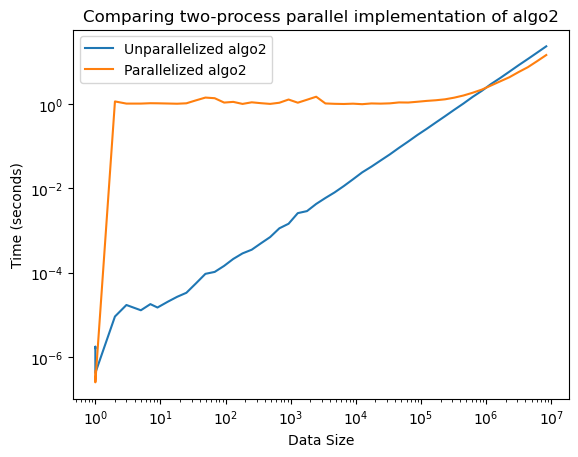

# BIS 634 01 (FA22): Computational Methods for Informatics : Assignment2

## Exercise 1

Your friend says to you, "you have to help me! I'm supposed to present in lab meeting in less than an hour, and I haven't been able to get the simplest thing to work!" After you help them calm down, they explain: through a collaboration with a fitness app, they have a 4GB file of high-precision weights of exactly 500 million people throughout the world. Even with 8GB of RAM, they get a MemoryError when trying to load the file in and find the average weight. They show you their code which worked fine when they tested it on a small number of weights:
with open('weights.txt') as f:
    weights = []
    for line in f:
        weights.append(float(line))
print("average =", sum(weights) / len(weights))
Aha! You exclaim.

Explain what went wrong (5 points). Suggest a way of storing all the data in memory that would work (5 points), and suggest a strategy for calculating the average that would not require storing all the data in memory (5 points).

Remember, your friend has to present soon, so keep your answers concise but thorough. Assume your friend is reasonably computer literate and is not using a vastly outdated computer or installation of Python. (i.e. don't blame 32 bit systems.)

### Response

**What went wrong?** <br>
 - Loading a large dataset directly into memory and performing computations on it and saving intermediate results of those computations can quickly fill up the memory. 

**Suggest a way of storing all the data in memory that would work.** <br>

 - Method 1: Instead of using list to store the data, we can use array to store the data. Compared to array, list saves the address of the data(pointer), i.e., for each data in the dataset, the list need to store 1 data and 1 pointer, resulting in storage increase and cpu consumption. <br>
 - Method 2: Use "read in chunks" method: we can divide the large file into several small files for processing. After processing each small file, release this part of memory.

**Strategy for calculating the average that would not require storing all the data in memory.**<br> 

 - Generator functions come in very handy if this is your problem. Many popular python libraries like Keras and TensorFlow have specific functions and classes for generators. <br>
 - Pay special attention to any large or nested loops, along with any time you are loading large datasets into your program in one fell swoop.In these cases, the best practice is often to break the work into batches, allowing the memory to be freed in between calls.<br>
 - Instead of using list to store all the data, we can define a variable sum (total weight) and a variable count to count the number of data. For each 'for loop', each line of data is added into variable sum, and the variable count increase by one and then the average can be calculated by sum divide by count(sum/count).

## Exercise2

In this exercise, we'll use a bloom filter to identify a correct word from a single-character typo. This is computationally the same problem as mapping a gene with a single nucleotide permutation to multiple reference genomes (this would be too many possibilities to keep all in memory, hence the use of a bloom filter). We'll talk about sequence alignment later in the course, which is a different but related problem.

Download the list of English words from https://github.com/dwyl/english-words/blob/master/words.txt

This list may be read in one-at-a-time for processing via e.g.
with open('words.txt') as f:
    for line in f:
        word = line.strip()
        # do something with the word here

Implement a Bloom Filter "from scratch" using a bitarray (6 points):
import bitarray
data = bitarray.bitarray(size)with the following three hash functions
from hashlib import sha3_256, sha256, blake2b

def my_hash(s):
    return int(sha256(s.lower().encode()).hexdigest(), 16) % size

def my_hash2(s):
    return int(blake2b(s.lower().encode()).hexdigest(), 16) % size

def my_hash3(s):
    return int(sha3_256(s.lower().encode()).hexdigest(), 16) % size
and store the words in the bloom filter (2 points).

These hash functions all return integers in [0, size), where size is some integer specified elsewhere.

Write a function that suggests spelling corrections using the bloom filter as follows: Try all possible single letter substitutions and see which ones are identified by the filter as possibly words. This algorithm will always find the intended word for this data set, and possibly other words as well. (8 points)

Plot the effect of the size of the filter together with the choice of just the first, the first two, or all three of the above hash functions on the number of words misidentified from typos.jsonDownload typos.json as correct and the number of "good suggestions". (4 points) typos.json consists of a list of lists of [typed_word, correct_word] pairs; exactly half of the entries are spelled correctly. For this exercise, consider a list of spelling suggestions good if there are no more than three suggestions and one of them is the word that was wanted.

Approximately how many bits is necessary for this approach to give good suggestions (as defined above) 90% of the time when using each of 1, 2, or 3 hash functions as above? (5 points)

### Response

#### Importing libraries 


```python
import bitarray
from hashlib import sha3_256, sha256, blake2b
import json
import bitarray
from tqdm import tqdm 
import string
import numpy as np
import matplotlib.pyplot as plt
```


```python
## Loading the word file 

with open('/Users/mahimakaur/Desktop/words.txt') as f:
    for line in f:
        word = line.strip()
```

#### Implement a Bloom Filter "from scratch" using a bitarray


```python
class BloomFilter(object):
    
    def __init__(self, size):

        self.bit_array = bitarray.bitarray(size)
        self.hashsize = size
        self.bit_array.setall(0)
       
    def add_one(self, words):
        hash1 = int(self.my_hash(words, self.hashsize))
        self.bit_array[hash1] = True
            
    def add_two(self, words):
    
        hash1 = int(self.my_hash(words, self.hashsize))
        hash2 = int(self.my_hash2(words, self.hashsize))
        self.bit_array[hash1] = True
        self.bit_array[hash2] = True
    
    def add_three(self, words):

        hash1 = int(self.my_hash(words, self.hashsize))
        hash2 = int(self.my_hash2(words, self.hashsize))
        hash3 = int(self.my_hash3(words, self.hashsize))
        self.bit_array[hash1] = True
        self.bit_array[hash2] = True
        self.bit_array[hash3] = True
            
    def check_one_hash(self, test_word):
        hash1 = int(self.my_hash(test_word, self.hashsize))
        if self.bit_array[hash1] == False:
            return False
        else:
            return True
    
    def check_two_hash(self, test_word):
        hash1 = int(self.my_hash(test_word, self.hashsize))
        hash2 = int(self.my_hash2(test_word, self.hashsize))
        if (self.bit_array[hash1] == False) or (self.bit_array[hash2] == False):
            return False
        else:
            return True
    
    def check_three_hash(self, test_word):
        hash1 = int(self.my_hash(test_word, self.hashsize))
        hash2 = int(self.my_hash2(test_word, self.hashsize))
        hash3 = int(self.my_hash3(test_word, self.hashsize))
        if (self.bit_array[hash1] == False) or (self.bit_array[hash2] == False) or (self.bit_array[hash3] == False):
            return False
        else:
            return True
    
    def my_hash(self, s, size):
        return int(sha256(s.lower().encode()).hexdigest(), 16) % size

    def my_hash2(self, s, size):
        return int(blake2b(s.lower().encode()).hexdigest(), 16) % size

    def my_hash3(self, s, size):
        return int(sha3_256(s.lower().encode()).hexdigest(), 16) % size

def replace(s, position, character):
    return s[:position] + character + s[position+1:]
```


```python
# creating a bloom filter
n = int(1e7)
blf = BloomFilter(n)
```

#### Checking the BloomFilter Function with a short example


```python
word_absent = ['bluff','cheater','hate','war','humanity',
                'racism','hurt','nuke','gloomy','facebook',
                'geeksforgeeks','twitter']

word_present = ['abound','abounds','abundance','abundant','accessible',
                    'bloom','blossom','bolster','bonny','bonus','bonuses',
                    'coherent','cohesive','colorful','comely','comfort',
                    'gems','generosity','generous','generously','genial']

# word not added
testing_words = word_absent + word_present[:4]

for item in word_present:
        blf.add_one(item)


for word in testing_words:
        if blf.check_one_hash(word):
            if word in word_absent:
                print("'{}' is a false positive!".format(word))
            else:
                print("'{}' is probably present!".format(word))
        else:
            print("'{}' is definitely not present!".format(word))
```

    'bluff' is definitely not present!
    'cheater' is definitely not present!
    'hate' is definitely not present!
    'war' is definitely not present!
    'humanity' is definitely not present!
    'racism' is definitely not present!
    'hurt' is definitely not present!
    'nuke' is definitely not present!
    'gloomy' is definitely not present!
    'facebook' is definitely not present!
    'geeksforgeeks' is definitely not present!
    'twitter' is definitely not present!
    'abound' is probably present!
    'abounds' is probably present!
    'abundance' is probably present!
    'abundant' is probably present!


#### Deciding the Number of HashCounts and Creating the Function to add the words 


```python
def hashnumber():
    return(hashcount)

def addingword(hashcount):
    if hashcount == "1":
        with open('/Users/mahimakaur/Desktop/words.txt') as f:
            for line in f:
                word = line.strip()
                blf.add_one(word)
    elif hashcount == "2":
        with open('/Users/mahimakaur/Desktop/words.txt') as f:
            for line in f:
                word = line.strip()
                blf.add_two(word)   
    elif hashcount == "3":
         with open('/Users/mahimakaur/Desktop/words.txt') as f:
            for line in f:
                word = line.strip()
                blf.add_three(word) 
```

#### Function to suggest spelling corrections 


```python
def suggestions(test_word):
    suggest = []
    alphabet = ['a','b','c','d','e','f','g','h','i','j','k','l','m','n','o','p',
                'q','r','s','t','u','v','w','x','y','z']
    result = check_spelling(test_word, hashcount)
    if  result == False:
        for i in range(len(test_word)):
            for a in alphabet:
                suggest_word = replace(test_word, i, a)
                suggest.append(suggest_word)
    return(suggest)


def correct_suggestion(suggestions, hashcount):
    correct_suggest = []
    if hashcount == "1":
        for n in suggestions:
            suggestresult = blf.check_one_hash(n)
            if suggestresult != False:
                correct_suggest.append(n)
    elif hashcount == "2":
        for n in suggestions:
            suggestresult = blf.check_two_hash(n)
            if suggestresult != False:
                correct_suggest.append(n)
    elif hashcount == "3":
        for n in suggestions:
            suggestresult = blf.check_three_hash(n)
            if suggestresult != False:
                correct_suggest.append(n)
    return(correct_suggest)
```

#### An example to Check the Word


```python
hashcount = hashnumber() ## hashcount could be 1, 2, 3
```


```python
hashcount = "3" #for the example I have taken 3 hashcount
```


```python
addingword(hashcount) ##adding words to the hash
```


```python
test_word = "floeer" #testing the word floeer 
```


```python
## Creating a function to check the spelling

def check_spelling(test_word, hashcount):
    if hashcount == "1":
        result = blf.check_one_hash(test_word)
        return result
    elif hashcount == "2":
        result = blf.check_two_hash(test_word)
        return result
    elif hashcount == "3":
        result = blf.check_three_hash(test_word)
        return result
```


```python
## Checking the spelling and good suggestions for the correct spelling

check_spelling(test_word, hashcount)
if check_spelling(test_word, hashcount) == False:
    suggestionlist = suggestions(test_word)
    correct_suggestionlist = correct_suggestion(suggestionlist, hashcount)
    print(correct_suggestionlist)
```

    ['floter', 'flower']


#### Downloading the typos.json file. The file consists of a list of lists of [typed_word, correct_word] pairs; exactly half of the entries are spelled correctly.


```python
with open('/Users/mahimakaur/Desktop/typos.json', 'r') as f:
    file = f.read()
    text = json.loads(file)
```


```python
# to find the lenth of the typos.json file

print(len(text))
```

    50000


#### Functions for Good Suggestions and Misidentified Words 


```python
def goodsuggestion(text, hashcount):
    correction = 0
    misidentified = 0
    good_suggestion = 0
    for i in range(len(text)):
        if text[i][0] == text[i][1]:
            correction += 1
        elif text[i][0] != text[i][1]:
            if check_spelling(text[i][0], hashcount) != False:
                misidentified += 1
            else:
                suggestion = suggestions(text[i][0])
                good = correct_suggestion(suggestion, hashcount)
                for n in good:
                    if (len(good) <= 3) and (n == text[i][1]):
                        good_suggestion += 1
    return correction, misidentified, good_suggestion
```


```python
## Defining the BloomFilter Size

blffiltersize = np.logspace(0, 9, num=20, dtype=int)
```

#### Function to use one hash function 


```python
suggestionlist1 = []
misidentified1 = []
correction1 = []
for n in range(len(blffiltersize)):
    blf = BloomFilter(int(blffiltersize[n]))
    addingword("1")
    response1 = goodsuggestion(text, "1")
    misidentified1.append(response1[1])
    suggestionlist1.append(response1[2])
    correction1.append(response1[0])

goodsuggestionaccuracy1 = []
misidentifiedaccuracy1 =[]

for i in range(len(misidentified1)):
    goodsuggestionaccuracy= (suggestionlist1[i] / 25000)*100
    misidentifiedaccuracy = (misidentified1[i] / 25000)*100
    goodsuggestionaccuracy1.append(goodsuggestionaccuracy)
    misidentifiedaccuracy1.append(misidentifiedaccuracy)
```

#### Function to use two hash function 


```python
suggestionlist2 = []
misidentified2 = []
correction2 = []
for n in range(len(blffiltersize)):
    blf = BloomFilter(int(blffiltersize[n]))
    addingword("2")
    response2 = goodsuggestion(text, "2")
    misidentified2.append(response2[1])
    suggestionlist2.append(response2[2])
    correction2.append(response2[0])

goodsuggestionaccuracy2 = []
misidentifiedaccuracy2 =[]

for i in range(len(misidentified2)):
    goodsuggestionaccuracy = (suggestionlist2[i] / 25000)*100
    misidentifiedaccuracy = (misidentified2[i] / 25000)*100
    goodsuggestionaccuracy2.append(goodsuggestionaccuracy)
    misidentifiedaccuracy2.append(misidentifiedaccuracy)
```

#### Function to use three hash function 


```python
suggestionlist3 = []
misidentified3 = []
correction3 = []
for n in range(len(blffiltersize)):
    blf = BloomFilter(int(blffiltersize[n]))
    addingword("3")
    response3 = goodsuggestion(text, "3")
    misidentified3.append(response3[1])
    suggestionlist3.append(response3[2])
    correction3.append(response3[0])

goodsuggestionaccuracy3 = []
misidentifiedaccuracy3 =[]

for i in range(len(misidentified3)):
    goodsuggestionaccuracy = (suggestionlist3[i] / 25000)*100
    misidentifiedaccuracy = (misidentified3[i] / 25000)*100
    goodsuggestionaccuracy3.append(goodsuggestionaccuracy)
    misidentifiedaccuracy3.append(misidentifiedaccuracy)
```

#### Plotting the effect of the size of the Filter 


```python
## Graph to show the effect size of the filter 

fig = plt.figure(figsize =(7,7))
plt.xscale('log')
plt.plot(blffiltersize, goodsuggestionaccuracy1, label="Good Suggestions %, 1 hash")
plt.plot(blffiltersize, goodsuggestionaccuracy2, label="Good Suggestions %, 2 hashes")
plt.plot(blffiltersize, goodsuggestionaccuracy3, label="Good Suggestions %, 3 hashes")
plt.plot(blffiltersize, misidentifiedaccuracy1, label="Misidentified %, 1 hash")
plt.plot(blffiltersize, misidentifiedaccuracy2, label="Misidentified %, 2 hashes")
plt.plot(blffiltersize, misidentifiedaccuracy3, label="Misidentified %, 3 hashes")
plt.xlabel('Bloom Filter Size')
plt.ylabel("Bloom Filter Accuracy")
plt.title("Plot to see the effect of the size of the Filter when using each of 1, 2, or 3 hash functions", fontweight = "bold")
plt.legend(loc="center left")
plt.show()
```


    

    


#### Approximately how many bits is necessary for this approach to give good suggestions (as defined above) 90% of the time when using each of 1, 2, or 3 hash functions as above? 
 - About 7 Bits are necessary for this approach to give suggestions 90% of the time when using each of 1, 2, or 3 hash functions.

## Exercise 3

Starting from the following framework of a Tree:
class Tree:
    def __init__(self):
        self._value = None 
        self.left = None 
        self.right = None 
Extend the above into a binary search tree.  In particular, provide an add method that inserts a single numeric value at a time according to the rules for a binary search tree (10 points).

When this is done, you should be able to construct the tree from slides 3 via:
my_tree = Tree()
 for item in [55, 62, 37, 49, 71, 14, 17]:
     my_tree.add(item)
Add the following __contains__ method. This method will allow you to use the in operator; e.g. after this change, 55 in my_tree should be True in the above example, whereas 42 in my_tree would be False. Test this. (5 points). 
def __contains__(self, item):
  if self._value == item:
    return True
  elif self.left and item < self._value:
    return item in self.left
  elif self.right and item > self._value:
    return item in self.right
  else:
    return False
__contains__ is an example of what's known as a magic method; such methods allow new data structures you might create to work like built-in data types. For more on magic methods, search the web, or start with this page.

Using various sizes n of trees (populated with random data) and sufficiently many calls to in (each individual call should be very fast, so you may have to run many repeated tests), demonstrate that in is executing in O(log n) times; on a log-log plot, for sufficiently large n, the graph of time required for checking if a number is in the tree as a function of n should be almost horizontal. (5 points).

This speed is not free. Provide supporting evidence that the time to setup the tree is O(n log n) by timing it for various sized ns and showing that the runtime lies between a curve that is O(n) and one that is O(n**2). (5 points)

## Response


```python
##importing libraries 

from tqdm import tqdm #to visualize small progress bar for the process completion 
import random
import time
import statistics
import matplotlib.pyplot as plt
```

### Extending the Binary Tree

 - Self is used to access all the instances defined within a class, including its methods and attributes.
 - The insert method compares the value of the node to the parent node and decides whether to add it as a left node or right node.If the node is greater than the parent node, it is inserted as a right node; otherwise,it’s inserted left.
 - PrintTree class is used to print the tree.
 - Contains allows to use the in operator.


```python
class Tree:
    def __init__(self, _value = None):
        self._value = _value
        self.left = None
        self.right = None
        
# Recursive function to insert a key into a Binary Search Tree

    def add(self, _value):
        if (self._value == None):
            self._value = _value
        else:
            if self._value == _value:
                self._value = _value
## if the given key is more than the root node,recur for the right subtree
            elif self._value < _value:
                if (self.right == None):
                    self.right = Tree(_value)
                else:
                    self.right.add(_value)
## otherwise, recur for the left subtree
            else:
                if (self.left == None):
                    self.left = Tree(_value)
                else:
                    self.left.add(_value)
                    

# Print the tree

    def PrintTree(self): 
        if self.left:
            self.left.PrintTree()
        print(self._value),
        if self.right:
            self.right.PrintTree()
            
    def __contains__(self, item): 
        if self._value == item:
            return True
        elif self.left and item < self._value:
            return item in self.left
        elif self.right and item > self._value:
            return item in self.right
        else:
            return False
```


```python
my_tree = Tree()
for item in [55, 62, 37, 49, 71, 14, 17]:
    my_tree.add(item)
```


```python
my_tree.PrintTree()
```

    14
    17
    37
    49
    55
    62
    71


### Testing whether the given number is in the tree or not.


```python
print(f'my_tree.contains(55) = 'f'{55 in my_tree}')
print(f'my_tree.contains(42) = 'f'{42 in my_tree}')
```

    my_tree.contains(55) = True
    my_tree.contains(42) = False


### Graph of time required for checking if a number is in the tree as a function of n


```python
def tree_time(n):
    duration = []
    data_random = [] #contain random n values to be added to the tree
    random_in_data = []
   
    for i in range(n):
        num = random.randint(1,1000)
        data_random.append(num)

    for i in range(1000):
        num = random.randint(1,1000)
        random_in_data.append(num)
        
    count = 0
  
    while(count <= 10):
        my_tree = Tree()
        for num in data_random:
            my_tree.add(num)
        start = time.perf_counter()
        for num in random_in_data:
            num in my_tree
        end = time.perf_counter()
        duration.append(end - start)
        count = count + 1
    return statistics.median(duration)
```

#### Finding the run time of the tree


```python
numbers = range(1, 1000) #continuous number in the range 1 to 1000
time_run = [tree_time(int(n)) for n in tqdm(numbers)]
starting_pt = time_run[0]
x = []
x2 = []
for n in tqdm(numbers):
    x.append(starting_pt * (n))
for n in tqdm(numbers):
    x2.append(starting_pt * (n**2))
```

    100%|█████████████████████████████████████████| 999/999 [00:36<00:00, 27.09it/s]
    100%|████████████████████████████████████| 999/999 [00:00<00:00, 3007975.37it/s]
    100%|████████████████████████████████████| 999/999 [00:00<00:00, 1575821.62it/s]


#### Visualizing the time required for checking if a number is in the tree as a function of n


```python
numbers = list(numbers)
fig = plt.figure(figsize =(5,5))
plt.loglog(numbers, time_run, 'r--', numbers, x,"g--")
plt.xlabel("Size of the Tree")
plt.ylabel("Time(seconds)")
plt.title("Time required for checking if a number is in the tree as a function of n", fontweight="bold")
plt.legend(["Time(seconds)", "x"])
plt.show
```


    <function matplotlib.pyplot.show(close=None, block=None)>


    

    


#### Time to setup the tree 


```python
def tree_setup_time(n):
    duration1 = []
    random_num = []
    for i in range(n):
        num = random.randint(1,1000)
        random_num.append(num)

    count = 0
    while(count <= 100):
        start = time.perf_counter()
        my_tree = Tree(random_num[0])
        for num in random_num[1:]:
            my_tree.add(num)
        end = time.perf_counter()
        duration1.append(end - start)
        count = count + 1
    return statistics.median(duration1)
```


```python
## Checking the runtime for random tree size values

ns = range(1, 1000)
setup_run_time = [tree_setup_time(int(n)) for n in tqdm(ns)]
start_pt = setup_run_time[0]
x = []
x2 = []
for n in tqdm(ns):
    x.append(start_pt * (n))
for n in tqdm(ns):
    x2.append(start_pt * (n**2))
```

    100%|█████████████████████████████████████████| 999/999 [02:14<00:00,  7.41it/s]
    100%|████████████████████████████████████| 999/999 [00:00<00:00, 3056243.40it/s]
    100%|████████████████████████████████████| 999/999 [00:00<00:00, 1722198.81it/s]


```python
##Plotting the curve graph 

ns = list(ns)
plt.plot(ns, setup_run_time)
plt.loglog(ns, x , "r--", ns, x2, "g--")
plt.xlabel("Size of the Tree")
plt.ylabel("Time(seconds)")
plt.legend(["Time(seconds)","x","x2"])
plt.title("Plot showing that the runtime lies between a curve that is O(n) and one that is O(n**2)")
plt.show()
```


    

    


## Exercise 4

#### Consider the following two algorithms:
def alg1(data):
  data = list(data)
  changes = True
  while changes:
    changes = False
    for i in range(len(data) - 1):
      if data[i + 1] < data[i]:
        data[i], data[i + 1] = data[i + 1], data[i]
        changes = True
  return data
#### and
def alg2(data):
  if len(data) <= 1:
    return data
  else:
    split = len(data) // 2
    left = iter(alg2(data[:split]))
    right = iter(alg2(data[split:]))
    result = []
    # note: this takes the top items off the left and right piles
    left_top = next(left)
    right_top = next(right)
    while True:
      if left_top < right_top:
        result.append(left_top)
        try:
          left_top = next(left)
        except StopIteration:
          # nothing remains on the left; add the right + return
          return result + [right_top] + list(right)
      else:
        result.append(right_top)
        try:
          right_top = next(right)
        except StopIteration:
          # nothing remains on the right; add the left + return
          return result + [left_top] + list(left)
They both take lists of numbers and return a list of numbers. In particular, for the same input, they return the same output; that is, they solve the same data processing problem but they do it in very different ways. Let's explore the implications and how they interact with different data sets.

By trying a few tests, hypothesize what operation these functions perform on the list of values. (Include your tests in your readme file. (3 points)

Explain in your own words how (at a high level... don't go line by line, but provide an intuitive explanation) each of these functions is able to complete the task. (2 points each; 4 points total)

Time the performance (use time.perf_counter) of alg1 and alg2 for various sizes of data n where the data comes from the function below, plot on a log-log graph as a function of n, and describe the apparent big-O scaling of each. (4 points). Note: Do not include the time spent generating the data in your timings; only measure the time of alg1 and alg2. Note: since you're plotting on a log axis, you'll want to pick n values that are evenly spaced on a log scale. numpy.logspace can help. (Let n get large but not so large that you can't run the code in a reasonable time.)
def data1(n, sigma=10, rho=28, beta=8/3, dt=0.01, x=1, y=1, z=1):
    import numpy
    state = numpy.array([x, y, z], dtype=float)
    result = []
    for _ in range(n):
        x, y, z = state
        state += dt * numpy.array([
            sigma * (y - x),
            x * (rho - z) - y,
            x * y - beta * z
        ])
        result.append(float(state[0] + 30))
    return result
Repeat the above but for data coming from the below.
def data2(n):
    return list(range(n))
Repeat the above but for data coming from the below. (4 points)
def data3(n):
    return list(range(n, 0, -1))
Repeat the above but for data coming from the below. (4 points)

Discuss how the scaling performance compares across the three data sets. (2 points) Which algorithm would you recommend to use for arbitrary data and why? (2 points)

Explain in words how to parallelize alg2; that is, where are there independent tasks whose results can be combined? (2 points)

Using the multiprocessing module, provide a two-process parallel implementation of alg2 (4 points), compare its performance on data from the data1 function for moderate n (3 points), and discuss your findings (3 points).

## Response


```python
from time import perf_counter
import matplotlib.pyplot as plt
import numpy as np
```

### Exploration of the implications of algorithms and how they interact with different data sets.

#### Algorithm 1 


```python
def alg1(data):
    data = list(data)
    changes = True
    while changes:
        changes = False
        for i in range(len(data) - 1):
            if data[i + 1] < data[i]:
                data[i], data[i + 1] = data[i + 1], data[i]
                changes = True
    return data
```


```python
Ex1 = [1,4,5,3,7,8,0]
print(alg1(Ex1))

Ex2 = [11,4,8,7,6,9]
print(alg1(Ex2))

Ex3 = [1,2,3,4,5]
print(alg1(Ex3))
```

    [0, 1, 3, 4, 5, 7, 8]
    [4, 6, 7, 8, 9, 11]
    [1, 2, 3, 4, 5]


#### Hypothesis : Alg1 is sorting the list values.

#### Algorithm 2 


```python
def alg2(data):
  if len(data) <= 1:
    return data
  else:
    split = len(data) // 2
    left = iter(alg2(data[:split]))
    right = iter(alg2(data[split:]))
    result = []
    # note: this takes the top items off the left and right piles
    left_top = next(left)
    right_top = next(right)
    while True:
      if left_top < right_top:
        result.append(left_top)
        try:
          left_top = next(left)
        except StopIteration:
          # nothing remains on the left; add the right + return
          return result + [right_top] + list(right)
      else:
        result.append(right_top)
        try:
          right_top = next(right)
        except StopIteration:
          # nothing remains on the right; add the left + return
          return result + [left_top] + list(left)
```


```python
Ex1 = [1,4,5,3,7,8,0]
print(alg2(Ex1))

Ex2 = [11,4,8,7,6,9]
print(alg2(Ex2))

Ex3 = [1,2,3,4,5]
print(alg2(Ex3))
```

    [0, 1, 3, 4, 5, 7, 8]
    [4, 6, 7, 8, 9, 11]
    [1, 2, 3, 4, 5]


#### Hypothesis : Alg2 is sorting the list values.¶

#### Explain in your own words how (at a high level... don't go line by line, but provide an intuitive explanation) each of these functions is able to complete the task. 
#### Algorithm 1 
 - It swaps interchanges the elements if the element on the left is lesser than the one on the right. After every iteration, the highest element of the list comes to the right and this continues until the list is completely sorted.
 - Such sorting is called Bubble sort.
 - It is one of the simplest sorting algorithms. 
 - Process : The two adjacent elements of a list are checked and swapped if they are in wrong order and this process is repeated until we get a sorted list. 
 
#### Algorithm 2
 - The second algorithm is using MergeSort startegy to sort the values. 
 - Merge sort is a recursive algorithm that continually splits a list in half. If the list is empty or has one item, it is sorted by definition (the base case). If the list has more than one item, we split the list and recursively invoke a merge sort on both halves. 
 - Once the two halves are sorted, the fundamental operation, called a merge, is performed. Merging is the process of taking two smaller sorted lists and combining them together into a single, sorted,new list. 
 - To conclude, This functions divides the lists into 2 equal portions. It then compares which element of the 2 lists is smaller then append that element to the empty list called result which finally appears as the sorted list at the end of function.

#### Time the performance (use time.perf_counter) of alg1 and alg2 for various sizes of data n where the data comes from the function below, plot on a log-log graph as a function of n, and describe the apparent big-O scaling of each. 


```python
##Creating a variable storing various sizes of data n 

list_values = np.logspace(1, 4, num=50, endpoint=True, base=10.0, dtype=None, axis=0) 
print(list_values)
```

    [   10.            11.51395399    13.25711366    15.26417967
        17.57510625    20.23589648    23.29951811    26.82695795
        30.88843596    35.56480306    40.94915062    47.14866363
        54.28675439    62.50551925    71.9685673     82.86427729
        95.40954763   109.8541142    126.48552169   145.63484775
       167.68329368   193.06977289   222.29964825   255.95479227
       294.70517026   339.32217719   390.69399371   449.8432669
       517.94746792   596.36233166   686.648845     790.60432109
       910.29817799  1048.11313415  1206.79264064  1389.49549437
      1599.85871961  1842.06996933  2120.95088792  2442.05309455
      2811.76869797  3237.45754282  3727.59372031  4291.93426013
      4941.71336132  5689.86602902  6551.2855686   7543.12006335
      8685.11373751 10000.        ]


#### A. Data1


```python
## Function for Data1

def data1(n, sigma=10, rho=28, beta=8/3, dt=0.01, x=1, y=1, z=1):
    import numpy
    state = numpy.array([x, y, z], dtype=float)
    result = []
    for _ in range(n):
        x, y, z = state
        state += dt * numpy.array([
            sigma * (y - x),
            x * (rho - z) - y,
            x * y - beta * z
        ])
        result.append(float(state[0] + 30))
    return result
```

#### Testing Algorithm 1


```python
y_input1 = []
j = 0
for i in list_values:

    data = data1(int(i))
 
    # Start the stopwatch / counter
    t1_start = perf_counter()

    result = alg1(data)

    t1_stop = perf_counter()
    
    y_input1.append(t1_stop - t1_start)
    print(y_input1)
    j += 1

print(y_input1)
```

    [1.5458001143997535e-05]
    [1.5458001143997535e-05, 1.915999746415764e-06]
    [1.5458001143997535e-05, 1.915999746415764e-06, 1.624997821636498e-06]
    [1.5458001143997535e-05, 1.915999746415764e-06, 1.624997821636498e-06, 1.625001459615305e-06]
    [1.5458001143997535e-05, 1.915999746415764e-06, 1.624997821636498e-06, 1.625001459615305e-06, 1.791999238776043e-06]
    [1.5458001143997535e-05, 1.915999746415764e-06, 1.624997821636498e-06, 1.625001459615305e-06, 1.791999238776043e-06, 2.333999873371795e-06]
    [1.5458001143997535e-05, 1.915999746415764e-06, 1.624997821636498e-06, 1.625001459615305e-06, 1.791999238776043e-06, 2.333999873371795e-06, 2.167002094211057e-06]
    [1.5458001143997535e-05, 1.915999746415764e-06, 1.624997821636498e-06, 1.625001459615305e-06, 1.791999238776043e-06, 2.333999873371795e-06, 2.167002094211057e-06, 2.5419976736884564e-06]
    [1.5458001143997535e-05, 1.915999746415764e-06, 1.624997821636498e-06, 1.625001459615305e-06, 1.791999238776043e-06, 2.333999873371795e-06, 2.167002094211057e-06, 2.5419976736884564e-06, 2.91700052912347e-06]
    [1.5458001143997535e-05, 1.915999746415764e-06, 1.624997821636498e-06, 1.625001459615305e-06, 1.791999238776043e-06, 2.333999873371795e-06, 2.167002094211057e-06, 2.5419976736884564e-06, 2.91700052912347e-06, 2.91600008495152e-06]
    [1.5458001143997535e-05, 1.915999746415764e-06, 1.624997821636498e-06, 1.625001459615305e-06, 1.791999238776043e-06, 2.333999873371795e-06, 2.167002094211057e-06, 2.5419976736884564e-06, 2.91700052912347e-06, 2.91600008495152e-06, 2.4125001800712198e-05]
    [1.5458001143997535e-05, 1.915999746415764e-06, 1.624997821636498e-06, 1.625001459615305e-06, 1.791999238776043e-06, 2.333999873371795e-06, 2.167002094211057e-06, 2.5419976736884564e-06, 2.91700052912347e-06, 2.91600008495152e-06, 2.4125001800712198e-05, 0.00011908400119864382]
    [1.5458001143997535e-05, 1.915999746415764e-06, 1.624997821636498e-06, 1.625001459615305e-06, 1.791999238776043e-06, 2.333999873371795e-06, 2.167002094211057e-06, 2.5419976736884564e-06, 2.91700052912347e-06, 2.91600008495152e-06, 2.4125001800712198e-05, 0.00011908400119864382, 0.0002451250002195593]
    [1.5458001143997535e-05, 1.915999746415764e-06, 1.624997821636498e-06, 1.625001459615305e-06, 1.791999238776043e-06, 2.333999873371795e-06, 2.167002094211057e-06, 2.5419976736884564e-06, 2.91700052912347e-06, 2.91600008495152e-06, 2.4125001800712198e-05, 0.00011908400119864382, 0.0002451250002195593, 0.00036095800169277936]
    [1.5458001143997535e-05, 1.915999746415764e-06, 1.624997821636498e-06, 1.625001459615305e-06, 1.791999238776043e-06, 2.333999873371795e-06, 2.167002094211057e-06, 2.5419976736884564e-06, 2.91700052912347e-06, 2.91600008495152e-06, 2.4125001800712198e-05, 0.00011908400119864382, 0.0002451250002195593, 0.00036095800169277936, 0.0004419169999891892]
    [1.5458001143997535e-05, 1.915999746415764e-06, 1.624997821636498e-06, 1.625001459615305e-06, 1.791999238776043e-06, 2.333999873371795e-06, 2.167002094211057e-06, 2.5419976736884564e-06, 2.91700052912347e-06, 2.91600008495152e-06, 2.4125001800712198e-05, 0.00011908400119864382, 0.0002451250002195593, 0.00036095800169277936, 0.0004419169999891892, 0.0005654999986290932]
    [1.5458001143997535e-05, 1.915999746415764e-06, 1.624997821636498e-06, 1.625001459615305e-06, 1.791999238776043e-06, 2.333999873371795e-06, 2.167002094211057e-06, 2.5419976736884564e-06, 2.91700052912347e-06, 2.91600008495152e-06, 2.4125001800712198e-05, 0.00011908400119864382, 0.0002451250002195593, 0.00036095800169277936, 0.0004419169999891892, 0.0005654999986290932, 0.0006498339971585665]
    [1.5458001143997535e-05, 1.915999746415764e-06, 1.624997821636498e-06, 1.625001459615305e-06, 1.791999238776043e-06, 2.333999873371795e-06, 2.167002094211057e-06, 2.5419976736884564e-06, 2.91700052912347e-06, 2.91600008495152e-06, 2.4125001800712198e-05, 0.00011908400119864382, 0.0002451250002195593, 0.00036095800169277936, 0.0004419169999891892, 0.0005654999986290932, 0.0006498339971585665, 0.0012060839981131721]
    [1.5458001143997535e-05, 1.915999746415764e-06, 1.624997821636498e-06, 1.625001459615305e-06, 1.791999238776043e-06, 2.333999873371795e-06, 2.167002094211057e-06, 2.5419976736884564e-06, 2.91700052912347e-06, 2.91600008495152e-06, 2.4125001800712198e-05, 0.00011908400119864382, 0.0002451250002195593, 0.00036095800169277936, 0.0004419169999891892, 0.0005654999986290932, 0.0006498339971585665, 0.0012060839981131721, 0.0016818329968373291]
    [1.5458001143997535e-05, 1.915999746415764e-06, 1.624997821636498e-06, 1.625001459615305e-06, 1.791999238776043e-06, 2.333999873371795e-06, 2.167002094211057e-06, 2.5419976736884564e-06, 2.91700052912347e-06, 2.91600008495152e-06, 2.4125001800712198e-05, 0.00011908400119864382, 0.0002451250002195593, 0.00036095800169277936, 0.0004419169999891892, 0.0005654999986290932, 0.0006498339971585665, 0.0012060839981131721, 0.0016818329968373291, 0.002064500000415137]
    [1.5458001143997535e-05, 1.915999746415764e-06, 1.624997821636498e-06, 1.625001459615305e-06, 1.791999238776043e-06, 2.333999873371795e-06, 2.167002094211057e-06, 2.5419976736884564e-06, 2.91700052912347e-06, 2.91600008495152e-06, 2.4125001800712198e-05, 0.00011908400119864382, 0.0002451250002195593, 0.00036095800169277936, 0.0004419169999891892, 0.0005654999986290932, 0.0006498339971585665, 0.0012060839981131721, 0.0016818329968373291, 0.002064500000415137, 0.0025557500011927914]
    [1.5458001143997535e-05, 1.915999746415764e-06, 1.624997821636498e-06, 1.625001459615305e-06, 1.791999238776043e-06, 2.333999873371795e-06, 2.167002094211057e-06, 2.5419976736884564e-06, 2.91700052912347e-06, 2.91600008495152e-06, 2.4125001800712198e-05, 0.00011908400119864382, 0.0002451250002195593, 0.00036095800169277936, 0.0004419169999891892, 0.0005654999986290932, 0.0006498339971585665, 0.0012060839981131721, 0.0016818329968373291, 0.002064500000415137, 0.0025557500011927914, 0.002763500000583008]
    [1.5458001143997535e-05, 1.915999746415764e-06, 1.624997821636498e-06, 1.625001459615305e-06, 1.791999238776043e-06, 2.333999873371795e-06, 2.167002094211057e-06, 2.5419976736884564e-06, 2.91700052912347e-06, 2.91600008495152e-06, 2.4125001800712198e-05, 0.00011908400119864382, 0.0002451250002195593, 0.00036095800169277936, 0.0004419169999891892, 0.0005654999986290932, 0.0006498339971585665, 0.0012060839981131721, 0.0016818329968373291, 0.002064500000415137, 0.0025557500011927914, 0.002763500000583008, 0.004847500000323635]
    [1.5458001143997535e-05, 1.915999746415764e-06, 1.624997821636498e-06, 1.625001459615305e-06, 1.791999238776043e-06, 2.333999873371795e-06, 2.167002094211057e-06, 2.5419976736884564e-06, 2.91700052912347e-06, 2.91600008495152e-06, 2.4125001800712198e-05, 0.00011908400119864382, 0.0002451250002195593, 0.00036095800169277936, 0.0004419169999891892, 0.0005654999986290932, 0.0006498339971585665, 0.0012060839981131721, 0.0016818329968373291, 0.002064500000415137, 0.0025557500011927914, 0.002763500000583008, 0.004847500000323635, 0.006543458999658469]
    [1.5458001143997535e-05, 1.915999746415764e-06, 1.624997821636498e-06, 1.625001459615305e-06, 1.791999238776043e-06, 2.333999873371795e-06, 2.167002094211057e-06, 2.5419976736884564e-06, 2.91700052912347e-06, 2.91600008495152e-06, 2.4125001800712198e-05, 0.00011908400119864382, 0.0002451250002195593, 0.00036095800169277936, 0.0004419169999891892, 0.0005654999986290932, 0.0006498339971585665, 0.0012060839981131721, 0.0016818329968373291, 0.002064500000415137, 0.0025557500011927914, 0.002763500000583008, 0.004847500000323635, 0.006543458999658469, 0.007219084000098519]
    [1.5458001143997535e-05, 1.915999746415764e-06, 1.624997821636498e-06, 1.625001459615305e-06, 1.791999238776043e-06, 2.333999873371795e-06, 2.167002094211057e-06, 2.5419976736884564e-06, 2.91700052912347e-06, 2.91600008495152e-06, 2.4125001800712198e-05, 0.00011908400119864382, 0.0002451250002195593, 0.00036095800169277936, 0.0004419169999891892, 0.0005654999986290932, 0.0006498339971585665, 0.0012060839981131721, 0.0016818329968373291, 0.002064500000415137, 0.0025557500011927914, 0.002763500000583008, 0.004847500000323635, 0.006543458999658469, 0.007219084000098519, 0.007660541999939596]
    [1.5458001143997535e-05, 1.915999746415764e-06, 1.624997821636498e-06, 1.625001459615305e-06, 1.791999238776043e-06, 2.333999873371795e-06, 2.167002094211057e-06, 2.5419976736884564e-06, 2.91700052912347e-06, 2.91600008495152e-06, 2.4125001800712198e-05, 0.00011908400119864382, 0.0002451250002195593, 0.00036095800169277936, 0.0004419169999891892, 0.0005654999986290932, 0.0006498339971585665, 0.0012060839981131721, 0.0016818329968373291, 0.002064500000415137, 0.0025557500011927914, 0.002763500000583008, 0.004847500000323635, 0.006543458999658469, 0.007219084000098519, 0.007660541999939596, 0.009065750000445405]
    [1.5458001143997535e-05, 1.915999746415764e-06, 1.624997821636498e-06, 1.625001459615305e-06, 1.791999238776043e-06, 2.333999873371795e-06, 2.167002094211057e-06, 2.5419976736884564e-06, 2.91700052912347e-06, 2.91600008495152e-06, 2.4125001800712198e-05, 0.00011908400119864382, 0.0002451250002195593, 0.00036095800169277936, 0.0004419169999891892, 0.0005654999986290932, 0.0006498339971585665, 0.0012060839981131721, 0.0016818329968373291, 0.002064500000415137, 0.0025557500011927914, 0.002763500000583008, 0.004847500000323635, 0.006543458999658469, 0.007219084000098519, 0.007660541999939596, 0.009065750000445405, 0.011024040999473073]
    [1.5458001143997535e-05, 1.915999746415764e-06, 1.624997821636498e-06, 1.625001459615305e-06, 1.791999238776043e-06, 2.333999873371795e-06, 2.167002094211057e-06, 2.5419976736884564e-06, 2.91700052912347e-06, 2.91600008495152e-06, 2.4125001800712198e-05, 0.00011908400119864382, 0.0002451250002195593, 0.00036095800169277936, 0.0004419169999891892, 0.0005654999986290932, 0.0006498339971585665, 0.0012060839981131721, 0.0016818329968373291, 0.002064500000415137, 0.0025557500011927914, 0.002763500000583008, 0.004847500000323635, 0.006543458999658469, 0.007219084000098519, 0.007660541999939596, 0.009065750000445405, 0.011024040999473073, 0.013860333001503022]
    [1.5458001143997535e-05, 1.915999746415764e-06, 1.624997821636498e-06, 1.625001459615305e-06, 1.791999238776043e-06, 2.333999873371795e-06, 2.167002094211057e-06, 2.5419976736884564e-06, 2.91700052912347e-06, 2.91600008495152e-06, 2.4125001800712198e-05, 0.00011908400119864382, 0.0002451250002195593, 0.00036095800169277936, 0.0004419169999891892, 0.0005654999986290932, 0.0006498339971585665, 0.0012060839981131721, 0.0016818329968373291, 0.002064500000415137, 0.0025557500011927914, 0.002763500000583008, 0.004847500000323635, 0.006543458999658469, 0.007219084000098519, 0.007660541999939596, 0.009065750000445405, 0.011024040999473073, 0.013860333001503022, 0.02307233399915276]
    [1.5458001143997535e-05, 1.915999746415764e-06, 1.624997821636498e-06, 1.625001459615305e-06, 1.791999238776043e-06, 2.333999873371795e-06, 2.167002094211057e-06, 2.5419976736884564e-06, 2.91700052912347e-06, 2.91600008495152e-06, 2.4125001800712198e-05, 0.00011908400119864382, 0.0002451250002195593, 0.00036095800169277936, 0.0004419169999891892, 0.0005654999986290932, 0.0006498339971585665, 0.0012060839981131721, 0.0016818329968373291, 0.002064500000415137, 0.0025557500011927914, 0.002763500000583008, 0.004847500000323635, 0.006543458999658469, 0.007219084000098519, 0.007660541999939596, 0.009065750000445405, 0.011024040999473073, 0.013860333001503022, 0.02307233399915276, 0.03845591700155637]
    [1.5458001143997535e-05, 1.915999746415764e-06, 1.624997821636498e-06, 1.625001459615305e-06, 1.791999238776043e-06, 2.333999873371795e-06, 2.167002094211057e-06, 2.5419976736884564e-06, 2.91700052912347e-06, 2.91600008495152e-06, 2.4125001800712198e-05, 0.00011908400119864382, 0.0002451250002195593, 0.00036095800169277936, 0.0004419169999891892, 0.0005654999986290932, 0.0006498339971585665, 0.0012060839981131721, 0.0016818329968373291, 0.002064500000415137, 0.0025557500011927914, 0.002763500000583008, 0.004847500000323635, 0.006543458999658469, 0.007219084000098519, 0.007660541999939596, 0.009065750000445405, 0.011024040999473073, 0.013860333001503022, 0.02307233399915276, 0.03845591700155637, 0.057944208001572406]
    [1.5458001143997535e-05, 1.915999746415764e-06, 1.624997821636498e-06, 1.625001459615305e-06, 1.791999238776043e-06, 2.333999873371795e-06, 2.167002094211057e-06, 2.5419976736884564e-06, 2.91700052912347e-06, 2.91600008495152e-06, 2.4125001800712198e-05, 0.00011908400119864382, 0.0002451250002195593, 0.00036095800169277936, 0.0004419169999891892, 0.0005654999986290932, 0.0006498339971585665, 0.0012060839981131721, 0.0016818329968373291, 0.002064500000415137, 0.0025557500011927914, 0.002763500000583008, 0.004847500000323635, 0.006543458999658469, 0.007219084000098519, 0.007660541999939596, 0.009065750000445405, 0.011024040999473073, 0.013860333001503022, 0.02307233399915276, 0.03845591700155637, 0.057944208001572406, 0.07883316700099385]
    [1.5458001143997535e-05, 1.915999746415764e-06, 1.624997821636498e-06, 1.625001459615305e-06, 1.791999238776043e-06, 2.333999873371795e-06, 2.167002094211057e-06, 2.5419976736884564e-06, 2.91700052912347e-06, 2.91600008495152e-06, 2.4125001800712198e-05, 0.00011908400119864382, 0.0002451250002195593, 0.00036095800169277936, 0.0004419169999891892, 0.0005654999986290932, 0.0006498339971585665, 0.0012060839981131721, 0.0016818329968373291, 0.002064500000415137, 0.0025557500011927914, 0.002763500000583008, 0.004847500000323635, 0.006543458999658469, 0.007219084000098519, 0.007660541999939596, 0.009065750000445405, 0.011024040999473073, 0.013860333001503022, 0.02307233399915276, 0.03845591700155637, 0.057944208001572406, 0.07883316700099385, 0.09233783300078358]
    [1.5458001143997535e-05, 1.915999746415764e-06, 1.624997821636498e-06, 1.625001459615305e-06, 1.791999238776043e-06, 2.333999873371795e-06, 2.167002094211057e-06, 2.5419976736884564e-06, 2.91700052912347e-06, 2.91600008495152e-06, 2.4125001800712198e-05, 0.00011908400119864382, 0.0002451250002195593, 0.00036095800169277936, 0.0004419169999891892, 0.0005654999986290932, 0.0006498339971585665, 0.0012060839981131721, 0.0016818329968373291, 0.002064500000415137, 0.0025557500011927914, 0.002763500000583008, 0.004847500000323635, 0.006543458999658469, 0.007219084000098519, 0.007660541999939596, 0.009065750000445405, 0.011024040999473073, 0.013860333001503022, 0.02307233399915276, 0.03845591700155637, 0.057944208001572406, 0.07883316700099385, 0.09233783300078358, 0.1093890409974847]
    [1.5458001143997535e-05, 1.915999746415764e-06, 1.624997821636498e-06, 1.625001459615305e-06, 1.791999238776043e-06, 2.333999873371795e-06, 2.167002094211057e-06, 2.5419976736884564e-06, 2.91700052912347e-06, 2.91600008495152e-06, 2.4125001800712198e-05, 0.00011908400119864382, 0.0002451250002195593, 0.00036095800169277936, 0.0004419169999891892, 0.0005654999986290932, 0.0006498339971585665, 0.0012060839981131721, 0.0016818329968373291, 0.002064500000415137, 0.0025557500011927914, 0.002763500000583008, 0.004847500000323635, 0.006543458999658469, 0.007219084000098519, 0.007660541999939596, 0.009065750000445405, 0.011024040999473073, 0.013860333001503022, 0.02307233399915276, 0.03845591700155637, 0.057944208001572406, 0.07883316700099385, 0.09233783300078358, 0.1093890409974847, 0.20465883299766574]
    [1.5458001143997535e-05, 1.915999746415764e-06, 1.624997821636498e-06, 1.625001459615305e-06, 1.791999238776043e-06, 2.333999873371795e-06, 2.167002094211057e-06, 2.5419976736884564e-06, 2.91700052912347e-06, 2.91600008495152e-06, 2.4125001800712198e-05, 0.00011908400119864382, 0.0002451250002195593, 0.00036095800169277936, 0.0004419169999891892, 0.0005654999986290932, 0.0006498339971585665, 0.0012060839981131721, 0.0016818329968373291, 0.002064500000415137, 0.0025557500011927914, 0.002763500000583008, 0.004847500000323635, 0.006543458999658469, 0.007219084000098519, 0.007660541999939596, 0.009065750000445405, 0.011024040999473073, 0.013860333001503022, 0.02307233399915276, 0.03845591700155637, 0.057944208001572406, 0.07883316700099385, 0.09233783300078358, 0.1093890409974847, 0.20465883299766574, 0.2646316249993106]
    [1.5458001143997535e-05, 1.915999746415764e-06, 1.624997821636498e-06, 1.625001459615305e-06, 1.791999238776043e-06, 2.333999873371795e-06, 2.167002094211057e-06, 2.5419976736884564e-06, 2.91700052912347e-06, 2.91600008495152e-06, 2.4125001800712198e-05, 0.00011908400119864382, 0.0002451250002195593, 0.00036095800169277936, 0.0004419169999891892, 0.0005654999986290932, 0.0006498339971585665, 0.0012060839981131721, 0.0016818329968373291, 0.002064500000415137, 0.0025557500011927914, 0.002763500000583008, 0.004847500000323635, 0.006543458999658469, 0.007219084000098519, 0.007660541999939596, 0.009065750000445405, 0.011024040999473073, 0.013860333001503022, 0.02307233399915276, 0.03845591700155637, 0.057944208001572406, 0.07883316700099385, 0.09233783300078358, 0.1093890409974847, 0.20465883299766574, 0.2646316249993106, 0.30494308400011505]
    [1.5458001143997535e-05, 1.915999746415764e-06, 1.624997821636498e-06, 1.625001459615305e-06, 1.791999238776043e-06, 2.333999873371795e-06, 2.167002094211057e-06, 2.5419976736884564e-06, 2.91700052912347e-06, 2.91600008495152e-06, 2.4125001800712198e-05, 0.00011908400119864382, 0.0002451250002195593, 0.00036095800169277936, 0.0004419169999891892, 0.0005654999986290932, 0.0006498339971585665, 0.0012060839981131721, 0.0016818329968373291, 0.002064500000415137, 0.0025557500011927914, 0.002763500000583008, 0.004847500000323635, 0.006543458999658469, 0.007219084000098519, 0.007660541999939596, 0.009065750000445405, 0.011024040999473073, 0.013860333001503022, 0.02307233399915276, 0.03845591700155637, 0.057944208001572406, 0.07883316700099385, 0.09233783300078358, 0.1093890409974847, 0.20465883299766574, 0.2646316249993106, 0.30494308400011505, 0.4508248749989434]
    [1.5458001143997535e-05, 1.915999746415764e-06, 1.624997821636498e-06, 1.625001459615305e-06, 1.791999238776043e-06, 2.333999873371795e-06, 2.167002094211057e-06, 2.5419976736884564e-06, 2.91700052912347e-06, 2.91600008495152e-06, 2.4125001800712198e-05, 0.00011908400119864382, 0.0002451250002195593, 0.00036095800169277936, 0.0004419169999891892, 0.0005654999986290932, 0.0006498339971585665, 0.0012060839981131721, 0.0016818329968373291, 0.002064500000415137, 0.0025557500011927914, 0.002763500000583008, 0.004847500000323635, 0.006543458999658469, 0.007219084000098519, 0.007660541999939596, 0.009065750000445405, 0.011024040999473073, 0.013860333001503022, 0.02307233399915276, 0.03845591700155637, 0.057944208001572406, 0.07883316700099385, 0.09233783300078358, 0.1093890409974847, 0.20465883299766574, 0.2646316249993106, 0.30494308400011505, 0.4508248749989434, 0.5922944170015398]
    [1.5458001143997535e-05, 1.915999746415764e-06, 1.624997821636498e-06, 1.625001459615305e-06, 1.791999238776043e-06, 2.333999873371795e-06, 2.167002094211057e-06, 2.5419976736884564e-06, 2.91700052912347e-06, 2.91600008495152e-06, 2.4125001800712198e-05, 0.00011908400119864382, 0.0002451250002195593, 0.00036095800169277936, 0.0004419169999891892, 0.0005654999986290932, 0.0006498339971585665, 0.0012060839981131721, 0.0016818329968373291, 0.002064500000415137, 0.0025557500011927914, 0.002763500000583008, 0.004847500000323635, 0.006543458999658469, 0.007219084000098519, 0.007660541999939596, 0.009065750000445405, 0.011024040999473073, 0.013860333001503022, 0.02307233399915276, 0.03845591700155637, 0.057944208001572406, 0.07883316700099385, 0.09233783300078358, 0.1093890409974847, 0.20465883299766574, 0.2646316249993106, 0.30494308400011505, 0.4508248749989434, 0.5922944170015398, 0.8545343340010731]
    [1.5458001143997535e-05, 1.915999746415764e-06, 1.624997821636498e-06, 1.625001459615305e-06, 1.791999238776043e-06, 2.333999873371795e-06, 2.167002094211057e-06, 2.5419976736884564e-06, 2.91700052912347e-06, 2.91600008495152e-06, 2.4125001800712198e-05, 0.00011908400119864382, 0.0002451250002195593, 0.00036095800169277936, 0.0004419169999891892, 0.0005654999986290932, 0.0006498339971585665, 0.0012060839981131721, 0.0016818329968373291, 0.002064500000415137, 0.0025557500011927914, 0.002763500000583008, 0.004847500000323635, 0.006543458999658469, 0.007219084000098519, 0.007660541999939596, 0.009065750000445405, 0.011024040999473073, 0.013860333001503022, 0.02307233399915276, 0.03845591700155637, 0.057944208001572406, 0.07883316700099385, 0.09233783300078358, 0.1093890409974847, 0.20465883299766574, 0.2646316249993106, 0.30494308400011505, 0.4508248749989434, 0.5922944170015398, 0.8545343340010731, 1.147748874998797]
    [1.5458001143997535e-05, 1.915999746415764e-06, 1.624997821636498e-06, 1.625001459615305e-06, 1.791999238776043e-06, 2.333999873371795e-06, 2.167002094211057e-06, 2.5419976736884564e-06, 2.91700052912347e-06, 2.91600008495152e-06, 2.4125001800712198e-05, 0.00011908400119864382, 0.0002451250002195593, 0.00036095800169277936, 0.0004419169999891892, 0.0005654999986290932, 0.0006498339971585665, 0.0012060839981131721, 0.0016818329968373291, 0.002064500000415137, 0.0025557500011927914, 0.002763500000583008, 0.004847500000323635, 0.006543458999658469, 0.007219084000098519, 0.007660541999939596, 0.009065750000445405, 0.011024040999473073, 0.013860333001503022, 0.02307233399915276, 0.03845591700155637, 0.057944208001572406, 0.07883316700099385, 0.09233783300078358, 0.1093890409974847, 0.20465883299766574, 0.2646316249993106, 0.30494308400011505, 0.4508248749989434, 0.5922944170015398, 0.8545343340010731, 1.147748874998797, 1.5502140000025975]
    [1.5458001143997535e-05, 1.915999746415764e-06, 1.624997821636498e-06, 1.625001459615305e-06, 1.791999238776043e-06, 2.333999873371795e-06, 2.167002094211057e-06, 2.5419976736884564e-06, 2.91700052912347e-06, 2.91600008495152e-06, 2.4125001800712198e-05, 0.00011908400119864382, 0.0002451250002195593, 0.00036095800169277936, 0.0004419169999891892, 0.0005654999986290932, 0.0006498339971585665, 0.0012060839981131721, 0.0016818329968373291, 0.002064500000415137, 0.0025557500011927914, 0.002763500000583008, 0.004847500000323635, 0.006543458999658469, 0.007219084000098519, 0.007660541999939596, 0.009065750000445405, 0.011024040999473073, 0.013860333001503022, 0.02307233399915276, 0.03845591700155637, 0.057944208001572406, 0.07883316700099385, 0.09233783300078358, 0.1093890409974847, 0.20465883299766574, 0.2646316249993106, 0.30494308400011505, 0.4508248749989434, 0.5922944170015398, 0.8545343340010731, 1.147748874998797, 1.5502140000025975, 1.9758642089982459]
    [1.5458001143997535e-05, 1.915999746415764e-06, 1.624997821636498e-06, 1.625001459615305e-06, 1.791999238776043e-06, 2.333999873371795e-06, 2.167002094211057e-06, 2.5419976736884564e-06, 2.91700052912347e-06, 2.91600008495152e-06, 2.4125001800712198e-05, 0.00011908400119864382, 0.0002451250002195593, 0.00036095800169277936, 0.0004419169999891892, 0.0005654999986290932, 0.0006498339971585665, 0.0012060839981131721, 0.0016818329968373291, 0.002064500000415137, 0.0025557500011927914, 0.002763500000583008, 0.004847500000323635, 0.006543458999658469, 0.007219084000098519, 0.007660541999939596, 0.009065750000445405, 0.011024040999473073, 0.013860333001503022, 0.02307233399915276, 0.03845591700155637, 0.057944208001572406, 0.07883316700099385, 0.09233783300078358, 0.1093890409974847, 0.20465883299766574, 0.2646316249993106, 0.30494308400011505, 0.4508248749989434, 0.5922944170015398, 0.8545343340010731, 1.147748874998797, 1.5502140000025975, 1.9758642089982459, 2.712844875000883]
    [1.5458001143997535e-05, 1.915999746415764e-06, 1.624997821636498e-06, 1.625001459615305e-06, 1.791999238776043e-06, 2.333999873371795e-06, 2.167002094211057e-06, 2.5419976736884564e-06, 2.91700052912347e-06, 2.91600008495152e-06, 2.4125001800712198e-05, 0.00011908400119864382, 0.0002451250002195593, 0.00036095800169277936, 0.0004419169999891892, 0.0005654999986290932, 0.0006498339971585665, 0.0012060839981131721, 0.0016818329968373291, 0.002064500000415137, 0.0025557500011927914, 0.002763500000583008, 0.004847500000323635, 0.006543458999658469, 0.007219084000098519, 0.007660541999939596, 0.009065750000445405, 0.011024040999473073, 0.013860333001503022, 0.02307233399915276, 0.03845591700155637, 0.057944208001572406, 0.07883316700099385, 0.09233783300078358, 0.1093890409974847, 0.20465883299766574, 0.2646316249993106, 0.30494308400011505, 0.4508248749989434, 0.5922944170015398, 0.8545343340010731, 1.147748874998797, 1.5502140000025975, 1.9758642089982459, 2.712844875000883, 3.609153499997774]
    [1.5458001143997535e-05, 1.915999746415764e-06, 1.624997821636498e-06, 1.625001459615305e-06, 1.791999238776043e-06, 2.333999873371795e-06, 2.167002094211057e-06, 2.5419976736884564e-06, 2.91700052912347e-06, 2.91600008495152e-06, 2.4125001800712198e-05, 0.00011908400119864382, 0.0002451250002195593, 0.00036095800169277936, 0.0004419169999891892, 0.0005654999986290932, 0.0006498339971585665, 0.0012060839981131721, 0.0016818329968373291, 0.002064500000415137, 0.0025557500011927914, 0.002763500000583008, 0.004847500000323635, 0.006543458999658469, 0.007219084000098519, 0.007660541999939596, 0.009065750000445405, 0.011024040999473073, 0.013860333001503022, 0.02307233399915276, 0.03845591700155637, 0.057944208001572406, 0.07883316700099385, 0.09233783300078358, 0.1093890409974847, 0.20465883299766574, 0.2646316249993106, 0.30494308400011505, 0.4508248749989434, 0.5922944170015398, 0.8545343340010731, 1.147748874998797, 1.5502140000025975, 1.9758642089982459, 2.712844875000883, 3.609153499997774, 4.71669345799819]
    [1.5458001143997535e-05, 1.915999746415764e-06, 1.624997821636498e-06, 1.625001459615305e-06, 1.791999238776043e-06, 2.333999873371795e-06, 2.167002094211057e-06, 2.5419976736884564e-06, 2.91700052912347e-06, 2.91600008495152e-06, 2.4125001800712198e-05, 0.00011908400119864382, 0.0002451250002195593, 0.00036095800169277936, 0.0004419169999891892, 0.0005654999986290932, 0.0006498339971585665, 0.0012060839981131721, 0.0016818329968373291, 0.002064500000415137, 0.0025557500011927914, 0.002763500000583008, 0.004847500000323635, 0.006543458999658469, 0.007219084000098519, 0.007660541999939596, 0.009065750000445405, 0.011024040999473073, 0.013860333001503022, 0.02307233399915276, 0.03845591700155637, 0.057944208001572406, 0.07883316700099385, 0.09233783300078358, 0.1093890409974847, 0.20465883299766574, 0.2646316249993106, 0.30494308400011505, 0.4508248749989434, 0.5922944170015398, 0.8545343340010731, 1.147748874998797, 1.5502140000025975, 1.9758642089982459, 2.712844875000883, 3.609153499997774, 4.71669345799819, 6.438938250001229]
    [1.5458001143997535e-05, 1.915999746415764e-06, 1.624997821636498e-06, 1.625001459615305e-06, 1.791999238776043e-06, 2.333999873371795e-06, 2.167002094211057e-06, 2.5419976736884564e-06, 2.91700052912347e-06, 2.91600008495152e-06, 2.4125001800712198e-05, 0.00011908400119864382, 0.0002451250002195593, 0.00036095800169277936, 0.0004419169999891892, 0.0005654999986290932, 0.0006498339971585665, 0.0012060839981131721, 0.0016818329968373291, 0.002064500000415137, 0.0025557500011927914, 0.002763500000583008, 0.004847500000323635, 0.006543458999658469, 0.007219084000098519, 0.007660541999939596, 0.009065750000445405, 0.011024040999473073, 0.013860333001503022, 0.02307233399915276, 0.03845591700155637, 0.057944208001572406, 0.07883316700099385, 0.09233783300078358, 0.1093890409974847, 0.20465883299766574, 0.2646316249993106, 0.30494308400011505, 0.4508248749989434, 0.5922944170015398, 0.8545343340010731, 1.147748874998797, 1.5502140000025975, 1.9758642089982459, 2.712844875000883, 3.609153499997774, 4.71669345799819, 6.438938250001229, 8.20824866700059]
    [1.5458001143997535e-05, 1.915999746415764e-06, 1.624997821636498e-06, 1.625001459615305e-06, 1.791999238776043e-06, 2.333999873371795e-06, 2.167002094211057e-06, 2.5419976736884564e-06, 2.91700052912347e-06, 2.91600008495152e-06, 2.4125001800712198e-05, 0.00011908400119864382, 0.0002451250002195593, 0.00036095800169277936, 0.0004419169999891892, 0.0005654999986290932, 0.0006498339971585665, 0.0012060839981131721, 0.0016818329968373291, 0.002064500000415137, 0.0025557500011927914, 0.002763500000583008, 0.004847500000323635, 0.006543458999658469, 0.007219084000098519, 0.007660541999939596, 0.009065750000445405, 0.011024040999473073, 0.013860333001503022, 0.02307233399915276, 0.03845591700155637, 0.057944208001572406, 0.07883316700099385, 0.09233783300078358, 0.1093890409974847, 0.20465883299766574, 0.2646316249993106, 0.30494308400011505, 0.4508248749989434, 0.5922944170015398, 0.8545343340010731, 1.147748874998797, 1.5502140000025975, 1.9758642089982459, 2.712844875000883, 3.609153499997774, 4.71669345799819, 6.438938250001229, 8.20824866700059, 11.427508541997668]
    [1.5458001143997535e-05, 1.915999746415764e-06, 1.624997821636498e-06, 1.625001459615305e-06, 1.791999238776043e-06, 2.333999873371795e-06, 2.167002094211057e-06, 2.5419976736884564e-06, 2.91700052912347e-06, 2.91600008495152e-06, 2.4125001800712198e-05, 0.00011908400119864382, 0.0002451250002195593, 0.00036095800169277936, 0.0004419169999891892, 0.0005654999986290932, 0.0006498339971585665, 0.0012060839981131721, 0.0016818329968373291, 0.002064500000415137, 0.0025557500011927914, 0.002763500000583008, 0.004847500000323635, 0.006543458999658469, 0.007219084000098519, 0.007660541999939596, 0.009065750000445405, 0.011024040999473073, 0.013860333001503022, 0.02307233399915276, 0.03845591700155637, 0.057944208001572406, 0.07883316700099385, 0.09233783300078358, 0.1093890409974847, 0.20465883299766574, 0.2646316249993106, 0.30494308400011505, 0.4508248749989434, 0.5922944170015398, 0.8545343340010731, 1.147748874998797, 1.5502140000025975, 1.9758642089982459, 2.712844875000883, 3.609153499997774, 4.71669345799819, 6.438938250001229, 8.20824866700059, 11.427508541997668]


#### Testing Algorithm 2 


```python
y_input2 = []
j = 0
for i in list_values:

    data = data1(int(i))
 
    # Start the stopwatch / counter
    t1_start = perf_counter()

    result = alg2(data)

    t1_stop = perf_counter()
    
    y_input2.append(t1_stop - t1_start)
    print(y_input2)
    j += 1

print(y_input2)
```

    [7.35829999030102e-05]
    [7.35829999030102e-05, 2.4708999262657017e-05]
    [7.35829999030102e-05, 2.4708999262657017e-05, 1.5958001313265413e-05]
    [7.35829999030102e-05, 2.4708999262657017e-05, 1.5958001313265413e-05, 1.7916998331202194e-05]
    [7.35829999030102e-05, 2.4708999262657017e-05, 1.5958001313265413e-05, 1.7916998331202194e-05, 3.570800254237838e-05]
    [7.35829999030102e-05, 2.4708999262657017e-05, 1.5958001313265413e-05, 1.7916998331202194e-05, 3.570800254237838e-05, 2.391700036241673e-05]
    [7.35829999030102e-05, 2.4708999262657017e-05, 1.5958001313265413e-05, 1.7916998331202194e-05, 3.570800254237838e-05, 2.391700036241673e-05, 2.712499917834066e-05]
    [7.35829999030102e-05, 2.4708999262657017e-05, 1.5958001313265413e-05, 1.7916998331202194e-05, 3.570800254237838e-05, 2.391700036241673e-05, 2.712499917834066e-05, 3.0499999411404133e-05]
    [7.35829999030102e-05, 2.4708999262657017e-05, 1.5958001313265413e-05, 1.7916998331202194e-05, 3.570800254237838e-05, 2.391700036241673e-05, 2.712499917834066e-05, 3.0499999411404133e-05, 3.699999797390774e-05]
    [7.35829999030102e-05, 2.4708999262657017e-05, 1.5958001313265413e-05, 1.7916998331202194e-05, 3.570800254237838e-05, 2.391700036241673e-05, 2.712499917834066e-05, 3.0499999411404133e-05, 3.699999797390774e-05, 4.254200030118227e-05]
    [7.35829999030102e-05, 2.4708999262657017e-05, 1.5958001313265413e-05, 1.7916998331202194e-05, 3.570800254237838e-05, 2.391700036241673e-05, 2.712499917834066e-05, 3.0499999411404133e-05, 3.699999797390774e-05, 4.254200030118227e-05, 4.8999998398358e-05]
    [7.35829999030102e-05, 2.4708999262657017e-05, 1.5958001313265413e-05, 1.7916998331202194e-05, 3.570800254237838e-05, 2.391700036241673e-05, 2.712499917834066e-05, 3.0499999411404133e-05, 3.699999797390774e-05, 4.254200030118227e-05, 4.8999998398358e-05, 5.9333000535843894e-05]
    [7.35829999030102e-05, 2.4708999262657017e-05, 1.5958001313265413e-05, 1.7916998331202194e-05, 3.570800254237838e-05, 2.391700036241673e-05, 2.712499917834066e-05, 3.0499999411404133e-05, 3.699999797390774e-05, 4.254200030118227e-05, 4.8999998398358e-05, 5.9333000535843894e-05, 7.558300058008172e-05]
    [7.35829999030102e-05, 2.4708999262657017e-05, 1.5958001313265413e-05, 1.7916998331202194e-05, 3.570800254237838e-05, 2.391700036241673e-05, 2.712499917834066e-05, 3.0499999411404133e-05, 3.699999797390774e-05, 4.254200030118227e-05, 4.8999998398358e-05, 5.9333000535843894e-05, 7.558300058008172e-05, 9.28330009628553e-05]
    [7.35829999030102e-05, 2.4708999262657017e-05, 1.5958001313265413e-05, 1.7916998331202194e-05, 3.570800254237838e-05, 2.391700036241673e-05, 2.712499917834066e-05, 3.0499999411404133e-05, 3.699999797390774e-05, 4.254200030118227e-05, 4.8999998398358e-05, 5.9333000535843894e-05, 7.558300058008172e-05, 9.28330009628553e-05, 0.00010275000022375025]
    [7.35829999030102e-05, 2.4708999262657017e-05, 1.5958001313265413e-05, 1.7916998331202194e-05, 3.570800254237838e-05, 2.391700036241673e-05, 2.712499917834066e-05, 3.0499999411404133e-05, 3.699999797390774e-05, 4.254200030118227e-05, 4.8999998398358e-05, 5.9333000535843894e-05, 7.558300058008172e-05, 9.28330009628553e-05, 0.00010275000022375025, 0.00011766600073315203]
    [7.35829999030102e-05, 2.4708999262657017e-05, 1.5958001313265413e-05, 1.7916998331202194e-05, 3.570800254237838e-05, 2.391700036241673e-05, 2.712499917834066e-05, 3.0499999411404133e-05, 3.699999797390774e-05, 4.254200030118227e-05, 4.8999998398358e-05, 5.9333000535843894e-05, 7.558300058008172e-05, 9.28330009628553e-05, 0.00010275000022375025, 0.00011766600073315203, 0.00015124999845284037]
    [7.35829999030102e-05, 2.4708999262657017e-05, 1.5958001313265413e-05, 1.7916998331202194e-05, 3.570800254237838e-05, 2.391700036241673e-05, 2.712499917834066e-05, 3.0499999411404133e-05, 3.699999797390774e-05, 4.254200030118227e-05, 4.8999998398358e-05, 5.9333000535843894e-05, 7.558300058008172e-05, 9.28330009628553e-05, 0.00010275000022375025, 0.00011766600073315203, 0.00015124999845284037, 0.00015825000082259066]
    [7.35829999030102e-05, 2.4708999262657017e-05, 1.5958001313265413e-05, 1.7916998331202194e-05, 3.570800254237838e-05, 2.391700036241673e-05, 2.712499917834066e-05, 3.0499999411404133e-05, 3.699999797390774e-05, 4.254200030118227e-05, 4.8999998398358e-05, 5.9333000535843894e-05, 7.558300058008172e-05, 9.28330009628553e-05, 0.00010275000022375025, 0.00011766600073315203, 0.00015124999845284037, 0.00015825000082259066, 0.00018450000061420724]
    [7.35829999030102e-05, 2.4708999262657017e-05, 1.5958001313265413e-05, 1.7916998331202194e-05, 3.570800254237838e-05, 2.391700036241673e-05, 2.712499917834066e-05, 3.0499999411404133e-05, 3.699999797390774e-05, 4.254200030118227e-05, 4.8999998398358e-05, 5.9333000535843894e-05, 7.558300058008172e-05, 9.28330009628553e-05, 0.00010275000022375025, 0.00011766600073315203, 0.00015124999845284037, 0.00015825000082259066, 0.00018450000061420724, 0.0015818749998288695]
    [7.35829999030102e-05, 2.4708999262657017e-05, 1.5958001313265413e-05, 1.7916998331202194e-05, 3.570800254237838e-05, 2.391700036241673e-05, 2.712499917834066e-05, 3.0499999411404133e-05, 3.699999797390774e-05, 4.254200030118227e-05, 4.8999998398358e-05, 5.9333000535843894e-05, 7.558300058008172e-05, 9.28330009628553e-05, 0.00010275000022375025, 0.00011766600073315203, 0.00015124999845284037, 0.00015825000082259066, 0.00018450000061420724, 0.0015818749998288695, 0.0002687920023163315]
    [7.35829999030102e-05, 2.4708999262657017e-05, 1.5958001313265413e-05, 1.7916998331202194e-05, 3.570800254237838e-05, 2.391700036241673e-05, 2.712499917834066e-05, 3.0499999411404133e-05, 3.699999797390774e-05, 4.254200030118227e-05, 4.8999998398358e-05, 5.9333000535843894e-05, 7.558300058008172e-05, 9.28330009628553e-05, 0.00010275000022375025, 0.00011766600073315203, 0.00015124999845284037, 0.00015825000082259066, 0.00018450000061420724, 0.0015818749998288695, 0.0002687920023163315, 0.00028720900081680156]
    [7.35829999030102e-05, 2.4708999262657017e-05, 1.5958001313265413e-05, 1.7916998331202194e-05, 3.570800254237838e-05, 2.391700036241673e-05, 2.712499917834066e-05, 3.0499999411404133e-05, 3.699999797390774e-05, 4.254200030118227e-05, 4.8999998398358e-05, 5.9333000535843894e-05, 7.558300058008172e-05, 9.28330009628553e-05, 0.00010275000022375025, 0.00011766600073315203, 0.00015124999845284037, 0.00015825000082259066, 0.00018450000061420724, 0.0015818749998288695, 0.0002687920023163315, 0.00028720900081680156, 0.0003280829987488687]
    [7.35829999030102e-05, 2.4708999262657017e-05, 1.5958001313265413e-05, 1.7916998331202194e-05, 3.570800254237838e-05, 2.391700036241673e-05, 2.712499917834066e-05, 3.0499999411404133e-05, 3.699999797390774e-05, 4.254200030118227e-05, 4.8999998398358e-05, 5.9333000535843894e-05, 7.558300058008172e-05, 9.28330009628553e-05, 0.00010275000022375025, 0.00011766600073315203, 0.00015124999845284037, 0.00015825000082259066, 0.00018450000061420724, 0.0015818749998288695, 0.0002687920023163315, 0.00028720900081680156, 0.0003280829987488687, 0.000372416998288827]
    [7.35829999030102e-05, 2.4708999262657017e-05, 1.5958001313265413e-05, 1.7916998331202194e-05, 3.570800254237838e-05, 2.391700036241673e-05, 2.712499917834066e-05, 3.0499999411404133e-05, 3.699999797390774e-05, 4.254200030118227e-05, 4.8999998398358e-05, 5.9333000535843894e-05, 7.558300058008172e-05, 9.28330009628553e-05, 0.00010275000022375025, 0.00011766600073315203, 0.00015124999845284037, 0.00015825000082259066, 0.00018450000061420724, 0.0015818749998288695, 0.0002687920023163315, 0.00028720900081680156, 0.0003280829987488687, 0.000372416998288827, 0.0004907499969704077]
    [7.35829999030102e-05, 2.4708999262657017e-05, 1.5958001313265413e-05, 1.7916998331202194e-05, 3.570800254237838e-05, 2.391700036241673e-05, 2.712499917834066e-05, 3.0499999411404133e-05, 3.699999797390774e-05, 4.254200030118227e-05, 4.8999998398358e-05, 5.9333000535843894e-05, 7.558300058008172e-05, 9.28330009628553e-05, 0.00010275000022375025, 0.00011766600073315203, 0.00015124999845284037, 0.00015825000082259066, 0.00018450000061420724, 0.0015818749998288695, 0.0002687920023163315, 0.00028720900081680156, 0.0003280829987488687, 0.000372416998288827, 0.0004907499969704077, 0.0005211250027059577]
    [7.35829999030102e-05, 2.4708999262657017e-05, 1.5958001313265413e-05, 1.7916998331202194e-05, 3.570800254237838e-05, 2.391700036241673e-05, 2.712499917834066e-05, 3.0499999411404133e-05, 3.699999797390774e-05, 4.254200030118227e-05, 4.8999998398358e-05, 5.9333000535843894e-05, 7.558300058008172e-05, 9.28330009628553e-05, 0.00010275000022375025, 0.00011766600073315203, 0.00015124999845284037, 0.00015825000082259066, 0.00018450000061420724, 0.0015818749998288695, 0.0002687920023163315, 0.00028720900081680156, 0.0003280829987488687, 0.000372416998288827, 0.0004907499969704077, 0.0005211250027059577, 0.0005527079993044026]
    [7.35829999030102e-05, 2.4708999262657017e-05, 1.5958001313265413e-05, 1.7916998331202194e-05, 3.570800254237838e-05, 2.391700036241673e-05, 2.712499917834066e-05, 3.0499999411404133e-05, 3.699999797390774e-05, 4.254200030118227e-05, 4.8999998398358e-05, 5.9333000535843894e-05, 7.558300058008172e-05, 9.28330009628553e-05, 0.00010275000022375025, 0.00011766600073315203, 0.00015124999845284037, 0.00015825000082259066, 0.00018450000061420724, 0.0015818749998288695, 0.0002687920023163315, 0.00028720900081680156, 0.0003280829987488687, 0.000372416998288827, 0.0004907499969704077, 0.0005211250027059577, 0.0005527079993044026, 0.0006660830003966112]
    [7.35829999030102e-05, 2.4708999262657017e-05, 1.5958001313265413e-05, 1.7916998331202194e-05, 3.570800254237838e-05, 2.391700036241673e-05, 2.712499917834066e-05, 3.0499999411404133e-05, 3.699999797390774e-05, 4.254200030118227e-05, 4.8999998398358e-05, 5.9333000535843894e-05, 7.558300058008172e-05, 9.28330009628553e-05, 0.00010275000022375025, 0.00011766600073315203, 0.00015124999845284037, 0.00015825000082259066, 0.00018450000061420724, 0.0015818749998288695, 0.0002687920023163315, 0.00028720900081680156, 0.0003280829987488687, 0.000372416998288827, 0.0004907499969704077, 0.0005211250027059577, 0.0005527079993044026, 0.0006660830003966112, 0.0007543329993495718]
    [7.35829999030102e-05, 2.4708999262657017e-05, 1.5958001313265413e-05, 1.7916998331202194e-05, 3.570800254237838e-05, 2.391700036241673e-05, 2.712499917834066e-05, 3.0499999411404133e-05, 3.699999797390774e-05, 4.254200030118227e-05, 4.8999998398358e-05, 5.9333000535843894e-05, 7.558300058008172e-05, 9.28330009628553e-05, 0.00010275000022375025, 0.00011766600073315203, 0.00015124999845284037, 0.00015825000082259066, 0.00018450000061420724, 0.0015818749998288695, 0.0002687920023163315, 0.00028720900081680156, 0.0003280829987488687, 0.000372416998288827, 0.0004907499969704077, 0.0005211250027059577, 0.0005527079993044026, 0.0006660830003966112, 0.0007543329993495718, 0.0008839160000206903]
    [7.35829999030102e-05, 2.4708999262657017e-05, 1.5958001313265413e-05, 1.7916998331202194e-05, 3.570800254237838e-05, 2.391700036241673e-05, 2.712499917834066e-05, 3.0499999411404133e-05, 3.699999797390774e-05, 4.254200030118227e-05, 4.8999998398358e-05, 5.9333000535843894e-05, 7.558300058008172e-05, 9.28330009628553e-05, 0.00010275000022375025, 0.00011766600073315203, 0.00015124999845284037, 0.00015825000082259066, 0.00018450000061420724, 0.0015818749998288695, 0.0002687920023163315, 0.00028720900081680156, 0.0003280829987488687, 0.000372416998288827, 0.0004907499969704077, 0.0005211250027059577, 0.0005527079993044026, 0.0006660830003966112, 0.0007543329993495718, 0.0008839160000206903, 0.0010022499991464429]
    [7.35829999030102e-05, 2.4708999262657017e-05, 1.5958001313265413e-05, 1.7916998331202194e-05, 3.570800254237838e-05, 2.391700036241673e-05, 2.712499917834066e-05, 3.0499999411404133e-05, 3.699999797390774e-05, 4.254200030118227e-05, 4.8999998398358e-05, 5.9333000535843894e-05, 7.558300058008172e-05, 9.28330009628553e-05, 0.00010275000022375025, 0.00011766600073315203, 0.00015124999845284037, 0.00015825000082259066, 0.00018450000061420724, 0.0015818749998288695, 0.0002687920023163315, 0.00028720900081680156, 0.0003280829987488687, 0.000372416998288827, 0.0004907499969704077, 0.0005211250027059577, 0.0005527079993044026, 0.0006660830003966112, 0.0007543329993495718, 0.0008839160000206903, 0.0010022499991464429, 0.0012345420000201557]
    [7.35829999030102e-05, 2.4708999262657017e-05, 1.5958001313265413e-05, 1.7916998331202194e-05, 3.570800254237838e-05, 2.391700036241673e-05, 2.712499917834066e-05, 3.0499999411404133e-05, 3.699999797390774e-05, 4.254200030118227e-05, 4.8999998398358e-05, 5.9333000535843894e-05, 7.558300058008172e-05, 9.28330009628553e-05, 0.00010275000022375025, 0.00011766600073315203, 0.00015124999845284037, 0.00015825000082259066, 0.00018450000061420724, 0.0015818749998288695, 0.0002687920023163315, 0.00028720900081680156, 0.0003280829987488687, 0.000372416998288827, 0.0004907499969704077, 0.0005211250027059577, 0.0005527079993044026, 0.0006660830003966112, 0.0007543329993495718, 0.0008839160000206903, 0.0010022499991464429, 0.0012345420000201557, 0.0014656249986728653]
    [7.35829999030102e-05, 2.4708999262657017e-05, 1.5958001313265413e-05, 1.7916998331202194e-05, 3.570800254237838e-05, 2.391700036241673e-05, 2.712499917834066e-05, 3.0499999411404133e-05, 3.699999797390774e-05, 4.254200030118227e-05, 4.8999998398358e-05, 5.9333000535843894e-05, 7.558300058008172e-05, 9.28330009628553e-05, 0.00010275000022375025, 0.00011766600073315203, 0.00015124999845284037, 0.00015825000082259066, 0.00018450000061420724, 0.0015818749998288695, 0.0002687920023163315, 0.00028720900081680156, 0.0003280829987488687, 0.000372416998288827, 0.0004907499969704077, 0.0005211250027059577, 0.0005527079993044026, 0.0006660830003966112, 0.0007543329993495718, 0.0008839160000206903, 0.0010022499991464429, 0.0012345420000201557, 0.0014656249986728653, 0.0019654589996207505]
    [7.35829999030102e-05, 2.4708999262657017e-05, 1.5958001313265413e-05, 1.7916998331202194e-05, 3.570800254237838e-05, 2.391700036241673e-05, 2.712499917834066e-05, 3.0499999411404133e-05, 3.699999797390774e-05, 4.254200030118227e-05, 4.8999998398358e-05, 5.9333000535843894e-05, 7.558300058008172e-05, 9.28330009628553e-05, 0.00010275000022375025, 0.00011766600073315203, 0.00015124999845284037, 0.00015825000082259066, 0.00018450000061420724, 0.0015818749998288695, 0.0002687920023163315, 0.00028720900081680156, 0.0003280829987488687, 0.000372416998288827, 0.0004907499969704077, 0.0005211250027059577, 0.0005527079993044026, 0.0006660830003966112, 0.0007543329993495718, 0.0008839160000206903, 0.0010022499991464429, 0.0012345420000201557, 0.0014656249986728653, 0.0019654589996207505, 0.002029916999163106]
    [7.35829999030102e-05, 2.4708999262657017e-05, 1.5958001313265413e-05, 1.7916998331202194e-05, 3.570800254237838e-05, 2.391700036241673e-05, 2.712499917834066e-05, 3.0499999411404133e-05, 3.699999797390774e-05, 4.254200030118227e-05, 4.8999998398358e-05, 5.9333000535843894e-05, 7.558300058008172e-05, 9.28330009628553e-05, 0.00010275000022375025, 0.00011766600073315203, 0.00015124999845284037, 0.00015825000082259066, 0.00018450000061420724, 0.0015818749998288695, 0.0002687920023163315, 0.00028720900081680156, 0.0003280829987488687, 0.000372416998288827, 0.0004907499969704077, 0.0005211250027059577, 0.0005527079993044026, 0.0006660830003966112, 0.0007543329993495718, 0.0008839160000206903, 0.0010022499991464429, 0.0012345420000201557, 0.0014656249986728653, 0.0019654589996207505, 0.002029916999163106, 0.0022795419972680975]
    [7.35829999030102e-05, 2.4708999262657017e-05, 1.5958001313265413e-05, 1.7916998331202194e-05, 3.570800254237838e-05, 2.391700036241673e-05, 2.712499917834066e-05, 3.0499999411404133e-05, 3.699999797390774e-05, 4.254200030118227e-05, 4.8999998398358e-05, 5.9333000535843894e-05, 7.558300058008172e-05, 9.28330009628553e-05, 0.00010275000022375025, 0.00011766600073315203, 0.00015124999845284037, 0.00015825000082259066, 0.00018450000061420724, 0.0015818749998288695, 0.0002687920023163315, 0.00028720900081680156, 0.0003280829987488687, 0.000372416998288827, 0.0004907499969704077, 0.0005211250027059577, 0.0005527079993044026, 0.0006660830003966112, 0.0007543329993495718, 0.0008839160000206903, 0.0010022499991464429, 0.0012345420000201557, 0.0014656249986728653, 0.0019654589996207505, 0.002029916999163106, 0.0022795419972680975, 0.004178041002887767]
    [7.35829999030102e-05, 2.4708999262657017e-05, 1.5958001313265413e-05, 1.7916998331202194e-05, 3.570800254237838e-05, 2.391700036241673e-05, 2.712499917834066e-05, 3.0499999411404133e-05, 3.699999797390774e-05, 4.254200030118227e-05, 4.8999998398358e-05, 5.9333000535843894e-05, 7.558300058008172e-05, 9.28330009628553e-05, 0.00010275000022375025, 0.00011766600073315203, 0.00015124999845284037, 0.00015825000082259066, 0.00018450000061420724, 0.0015818749998288695, 0.0002687920023163315, 0.00028720900081680156, 0.0003280829987488687, 0.000372416998288827, 0.0004907499969704077, 0.0005211250027059577, 0.0005527079993044026, 0.0006660830003966112, 0.0007543329993495718, 0.0008839160000206903, 0.0010022499991464429, 0.0012345420000201557, 0.0014656249986728653, 0.0019654589996207505, 0.002029916999163106, 0.0022795419972680975, 0.004178041002887767, 0.0031275830006052274]
    [7.35829999030102e-05, 2.4708999262657017e-05, 1.5958001313265413e-05, 1.7916998331202194e-05, 3.570800254237838e-05, 2.391700036241673e-05, 2.712499917834066e-05, 3.0499999411404133e-05, 3.699999797390774e-05, 4.254200030118227e-05, 4.8999998398358e-05, 5.9333000535843894e-05, 7.558300058008172e-05, 9.28330009628553e-05, 0.00010275000022375025, 0.00011766600073315203, 0.00015124999845284037, 0.00015825000082259066, 0.00018450000061420724, 0.0015818749998288695, 0.0002687920023163315, 0.00028720900081680156, 0.0003280829987488687, 0.000372416998288827, 0.0004907499969704077, 0.0005211250027059577, 0.0005527079993044026, 0.0006660830003966112, 0.0007543329993495718, 0.0008839160000206903, 0.0010022499991464429, 0.0012345420000201557, 0.0014656249986728653, 0.0019654589996207505, 0.002029916999163106, 0.0022795419972680975, 0.004178041002887767, 0.0031275830006052274, 0.0036779999973077793]
    [7.35829999030102e-05, 2.4708999262657017e-05, 1.5958001313265413e-05, 1.7916998331202194e-05, 3.570800254237838e-05, 2.391700036241673e-05, 2.712499917834066e-05, 3.0499999411404133e-05, 3.699999797390774e-05, 4.254200030118227e-05, 4.8999998398358e-05, 5.9333000535843894e-05, 7.558300058008172e-05, 9.28330009628553e-05, 0.00010275000022375025, 0.00011766600073315203, 0.00015124999845284037, 0.00015825000082259066, 0.00018450000061420724, 0.0015818749998288695, 0.0002687920023163315, 0.00028720900081680156, 0.0003280829987488687, 0.000372416998288827, 0.0004907499969704077, 0.0005211250027059577, 0.0005527079993044026, 0.0006660830003966112, 0.0007543329993495718, 0.0008839160000206903, 0.0010022499991464429, 0.0012345420000201557, 0.0014656249986728653, 0.0019654589996207505, 0.002029916999163106, 0.0022795419972680975, 0.004178041002887767, 0.0031275830006052274, 0.0036779999973077793, 0.005030249998526415]
    [7.35829999030102e-05, 2.4708999262657017e-05, 1.5958001313265413e-05, 1.7916998331202194e-05, 3.570800254237838e-05, 2.391700036241673e-05, 2.712499917834066e-05, 3.0499999411404133e-05, 3.699999797390774e-05, 4.254200030118227e-05, 4.8999998398358e-05, 5.9333000535843894e-05, 7.558300058008172e-05, 9.28330009628553e-05, 0.00010275000022375025, 0.00011766600073315203, 0.00015124999845284037, 0.00015825000082259066, 0.00018450000061420724, 0.0015818749998288695, 0.0002687920023163315, 0.00028720900081680156, 0.0003280829987488687, 0.000372416998288827, 0.0004907499969704077, 0.0005211250027059577, 0.0005527079993044026, 0.0006660830003966112, 0.0007543329993495718, 0.0008839160000206903, 0.0010022499991464429, 0.0012345420000201557, 0.0014656249986728653, 0.0019654589996207505, 0.002029916999163106, 0.0022795419972680975, 0.004178041002887767, 0.0031275830006052274, 0.0036779999973077793, 0.005030249998526415, 0.004838124998059357]
    [7.35829999030102e-05, 2.4708999262657017e-05, 1.5958001313265413e-05, 1.7916998331202194e-05, 3.570800254237838e-05, 2.391700036241673e-05, 2.712499917834066e-05, 3.0499999411404133e-05, 3.699999797390774e-05, 4.254200030118227e-05, 4.8999998398358e-05, 5.9333000535843894e-05, 7.558300058008172e-05, 9.28330009628553e-05, 0.00010275000022375025, 0.00011766600073315203, 0.00015124999845284037, 0.00015825000082259066, 0.00018450000061420724, 0.0015818749998288695, 0.0002687920023163315, 0.00028720900081680156, 0.0003280829987488687, 0.000372416998288827, 0.0004907499969704077, 0.0005211250027059577, 0.0005527079993044026, 0.0006660830003966112, 0.0007543329993495718, 0.0008839160000206903, 0.0010022499991464429, 0.0012345420000201557, 0.0014656249986728653, 0.0019654589996207505, 0.002029916999163106, 0.0022795419972680975, 0.004178041002887767, 0.0031275830006052274, 0.0036779999973077793, 0.005030249998526415, 0.004838124998059357, 0.005553582999709761]
    [7.35829999030102e-05, 2.4708999262657017e-05, 1.5958001313265413e-05, 1.7916998331202194e-05, 3.570800254237838e-05, 2.391700036241673e-05, 2.712499917834066e-05, 3.0499999411404133e-05, 3.699999797390774e-05, 4.254200030118227e-05, 4.8999998398358e-05, 5.9333000535843894e-05, 7.558300058008172e-05, 9.28330009628553e-05, 0.00010275000022375025, 0.00011766600073315203, 0.00015124999845284037, 0.00015825000082259066, 0.00018450000061420724, 0.0015818749998288695, 0.0002687920023163315, 0.00028720900081680156, 0.0003280829987488687, 0.000372416998288827, 0.0004907499969704077, 0.0005211250027059577, 0.0005527079993044026, 0.0006660830003966112, 0.0007543329993495718, 0.0008839160000206903, 0.0010022499991464429, 0.0012345420000201557, 0.0014656249986728653, 0.0019654589996207505, 0.002029916999163106, 0.0022795419972680975, 0.004178041002887767, 0.0031275830006052274, 0.0036779999973077793, 0.005030249998526415, 0.004838124998059357, 0.005553582999709761, 0.006889667001814814]
    [7.35829999030102e-05, 2.4708999262657017e-05, 1.5958001313265413e-05, 1.7916998331202194e-05, 3.570800254237838e-05, 2.391700036241673e-05, 2.712499917834066e-05, 3.0499999411404133e-05, 3.699999797390774e-05, 4.254200030118227e-05, 4.8999998398358e-05, 5.9333000535843894e-05, 7.558300058008172e-05, 9.28330009628553e-05, 0.00010275000022375025, 0.00011766600073315203, 0.00015124999845284037, 0.00015825000082259066, 0.00018450000061420724, 0.0015818749998288695, 0.0002687920023163315, 0.00028720900081680156, 0.0003280829987488687, 0.000372416998288827, 0.0004907499969704077, 0.0005211250027059577, 0.0005527079993044026, 0.0006660830003966112, 0.0007543329993495718, 0.0008839160000206903, 0.0010022499991464429, 0.0012345420000201557, 0.0014656249986728653, 0.0019654589996207505, 0.002029916999163106, 0.0022795419972680975, 0.004178041002887767, 0.0031275830006052274, 0.0036779999973077793, 0.005030249998526415, 0.004838124998059357, 0.005553582999709761, 0.006889667001814814, 0.0072939169986057095]
    [7.35829999030102e-05, 2.4708999262657017e-05, 1.5958001313265413e-05, 1.7916998331202194e-05, 3.570800254237838e-05, 2.391700036241673e-05, 2.712499917834066e-05, 3.0499999411404133e-05, 3.699999797390774e-05, 4.254200030118227e-05, 4.8999998398358e-05, 5.9333000535843894e-05, 7.558300058008172e-05, 9.28330009628553e-05, 0.00010275000022375025, 0.00011766600073315203, 0.00015124999845284037, 0.00015825000082259066, 0.00018450000061420724, 0.0015818749998288695, 0.0002687920023163315, 0.00028720900081680156, 0.0003280829987488687, 0.000372416998288827, 0.0004907499969704077, 0.0005211250027059577, 0.0005527079993044026, 0.0006660830003966112, 0.0007543329993495718, 0.0008839160000206903, 0.0010022499991464429, 0.0012345420000201557, 0.0014656249986728653, 0.0019654589996207505, 0.002029916999163106, 0.0022795419972680975, 0.004178041002887767, 0.0031275830006052274, 0.0036779999973077793, 0.005030249998526415, 0.004838124998059357, 0.005553582999709761, 0.006889667001814814, 0.0072939169986057095, 0.008866915999533376]
    [7.35829999030102e-05, 2.4708999262657017e-05, 1.5958001313265413e-05, 1.7916998331202194e-05, 3.570800254237838e-05, 2.391700036241673e-05, 2.712499917834066e-05, 3.0499999411404133e-05, 3.699999797390774e-05, 4.254200030118227e-05, 4.8999998398358e-05, 5.9333000535843894e-05, 7.558300058008172e-05, 9.28330009628553e-05, 0.00010275000022375025, 0.00011766600073315203, 0.00015124999845284037, 0.00015825000082259066, 0.00018450000061420724, 0.0015818749998288695, 0.0002687920023163315, 0.00028720900081680156, 0.0003280829987488687, 0.000372416998288827, 0.0004907499969704077, 0.0005211250027059577, 0.0005527079993044026, 0.0006660830003966112, 0.0007543329993495718, 0.0008839160000206903, 0.0010022499991464429, 0.0012345420000201557, 0.0014656249986728653, 0.0019654589996207505, 0.002029916999163106, 0.0022795419972680975, 0.004178041002887767, 0.0031275830006052274, 0.0036779999973077793, 0.005030249998526415, 0.004838124998059357, 0.005553582999709761, 0.006889667001814814, 0.0072939169986057095, 0.008866915999533376, 0.010600749999866821]
    [7.35829999030102e-05, 2.4708999262657017e-05, 1.5958001313265413e-05, 1.7916998331202194e-05, 3.570800254237838e-05, 2.391700036241673e-05, 2.712499917834066e-05, 3.0499999411404133e-05, 3.699999797390774e-05, 4.254200030118227e-05, 4.8999998398358e-05, 5.9333000535843894e-05, 7.558300058008172e-05, 9.28330009628553e-05, 0.00010275000022375025, 0.00011766600073315203, 0.00015124999845284037, 0.00015825000082259066, 0.00018450000061420724, 0.0015818749998288695, 0.0002687920023163315, 0.00028720900081680156, 0.0003280829987488687, 0.000372416998288827, 0.0004907499969704077, 0.0005211250027059577, 0.0005527079993044026, 0.0006660830003966112, 0.0007543329993495718, 0.0008839160000206903, 0.0010022499991464429, 0.0012345420000201557, 0.0014656249986728653, 0.0019654589996207505, 0.002029916999163106, 0.0022795419972680975, 0.004178041002887767, 0.0031275830006052274, 0.0036779999973077793, 0.005030249998526415, 0.004838124998059357, 0.005553582999709761, 0.006889667001814814, 0.0072939169986057095, 0.008866915999533376, 0.010600749999866821, 0.012319292000029236]
    [7.35829999030102e-05, 2.4708999262657017e-05, 1.5958001313265413e-05, 1.7916998331202194e-05, 3.570800254237838e-05, 2.391700036241673e-05, 2.712499917834066e-05, 3.0499999411404133e-05, 3.699999797390774e-05, 4.254200030118227e-05, 4.8999998398358e-05, 5.9333000535843894e-05, 7.558300058008172e-05, 9.28330009628553e-05, 0.00010275000022375025, 0.00011766600073315203, 0.00015124999845284037, 0.00015825000082259066, 0.00018450000061420724, 0.0015818749998288695, 0.0002687920023163315, 0.00028720900081680156, 0.0003280829987488687, 0.000372416998288827, 0.0004907499969704077, 0.0005211250027059577, 0.0005527079993044026, 0.0006660830003966112, 0.0007543329993495718, 0.0008839160000206903, 0.0010022499991464429, 0.0012345420000201557, 0.0014656249986728653, 0.0019654589996207505, 0.002029916999163106, 0.0022795419972680975, 0.004178041002887767, 0.0031275830006052274, 0.0036779999973077793, 0.005030249998526415, 0.004838124998059357, 0.005553582999709761, 0.006889667001814814, 0.0072939169986057095, 0.008866915999533376, 0.010600749999866821, 0.012319292000029236, 0.013858958998753224]
    [7.35829999030102e-05, 2.4708999262657017e-05, 1.5958001313265413e-05, 1.7916998331202194e-05, 3.570800254237838e-05, 2.391700036241673e-05, 2.712499917834066e-05, 3.0499999411404133e-05, 3.699999797390774e-05, 4.254200030118227e-05, 4.8999998398358e-05, 5.9333000535843894e-05, 7.558300058008172e-05, 9.28330009628553e-05, 0.00010275000022375025, 0.00011766600073315203, 0.00015124999845284037, 0.00015825000082259066, 0.00018450000061420724, 0.0015818749998288695, 0.0002687920023163315, 0.00028720900081680156, 0.0003280829987488687, 0.000372416998288827, 0.0004907499969704077, 0.0005211250027059577, 0.0005527079993044026, 0.0006660830003966112, 0.0007543329993495718, 0.0008839160000206903, 0.0010022499991464429, 0.0012345420000201557, 0.0014656249986728653, 0.0019654589996207505, 0.002029916999163106, 0.0022795419972680975, 0.004178041002887767, 0.0031275830006052274, 0.0036779999973077793, 0.005030249998526415, 0.004838124998059357, 0.005553582999709761, 0.006889667001814814, 0.0072939169986057095, 0.008866915999533376, 0.010600749999866821, 0.012319292000029236, 0.013858958998753224, 0.015705207999417325]
    [7.35829999030102e-05, 2.4708999262657017e-05, 1.5958001313265413e-05, 1.7916998331202194e-05, 3.570800254237838e-05, 2.391700036241673e-05, 2.712499917834066e-05, 3.0499999411404133e-05, 3.699999797390774e-05, 4.254200030118227e-05, 4.8999998398358e-05, 5.9333000535843894e-05, 7.558300058008172e-05, 9.28330009628553e-05, 0.00010275000022375025, 0.00011766600073315203, 0.00015124999845284037, 0.00015825000082259066, 0.00018450000061420724, 0.0015818749998288695, 0.0002687920023163315, 0.00028720900081680156, 0.0003280829987488687, 0.000372416998288827, 0.0004907499969704077, 0.0005211250027059577, 0.0005527079993044026, 0.0006660830003966112, 0.0007543329993495718, 0.0008839160000206903, 0.0010022499991464429, 0.0012345420000201557, 0.0014656249986728653, 0.0019654589996207505, 0.002029916999163106, 0.0022795419972680975, 0.004178041002887767, 0.0031275830006052274, 0.0036779999973077793, 0.005030249998526415, 0.004838124998059357, 0.005553582999709761, 0.006889667001814814, 0.0072939169986057095, 0.008866915999533376, 0.010600749999866821, 0.012319292000029236, 0.013858958998753224, 0.015705207999417325, 0.018001500000536907]
    [7.35829999030102e-05, 2.4708999262657017e-05, 1.5958001313265413e-05, 1.7916998331202194e-05, 3.570800254237838e-05, 2.391700036241673e-05, 2.712499917834066e-05, 3.0499999411404133e-05, 3.699999797390774e-05, 4.254200030118227e-05, 4.8999998398358e-05, 5.9333000535843894e-05, 7.558300058008172e-05, 9.28330009628553e-05, 0.00010275000022375025, 0.00011766600073315203, 0.00015124999845284037, 0.00015825000082259066, 0.00018450000061420724, 0.0015818749998288695, 0.0002687920023163315, 0.00028720900081680156, 0.0003280829987488687, 0.000372416998288827, 0.0004907499969704077, 0.0005211250027059577, 0.0005527079993044026, 0.0006660830003966112, 0.0007543329993495718, 0.0008839160000206903, 0.0010022499991464429, 0.0012345420000201557, 0.0014656249986728653, 0.0019654589996207505, 0.002029916999163106, 0.0022795419972680975, 0.004178041002887767, 0.0031275830006052274, 0.0036779999973077793, 0.005030249998526415, 0.004838124998059357, 0.005553582999709761, 0.006889667001814814, 0.0072939169986057095, 0.008866915999533376, 0.010600749999866821, 0.012319292000029236, 0.013858958998753224, 0.015705207999417325, 0.018001500000536907]


#### B. Data2


```python
def data2(n):
    return list(range(n))
```

#### Testing for Algorithm 1 and Algorithm 2


```python
y_inputB = []
j = 0
for i in list_values:

    data = data2(int(i))
 
    # Start the stopwatch / counter
    t1_start = perf_counter()

    result = alg1(data)

    t1_stop = perf_counter()
    
    y_inputB.append(t1_stop - t1_start)
    print(y_inputB)
    j += 1

print(y_inputB)

y_inputC = []
j = 0
for i in list_values:

    data = data2(int(i))
 
    # Start the stopwatch / counter
    t1_start = perf_counter()

    result = alg2(data)

    t1_stop = perf_counter()
    
    y_inputC.append(t1_stop - t1_start)
    print(y_inputC)
    j += 1

print(y_inputC)
```

    [6.24999993306119e-05]
    [6.24999993306119e-05, 1.4170000213198364e-06]
    [6.24999993306119e-05, 1.4170000213198364e-06, 1.290998625336215e-06]
    [6.24999993306119e-05, 1.4170000213198364e-06, 1.290998625336215e-06, 1.5000005078036338e-06]
    [6.24999993306119e-05, 1.4170000213198364e-06, 1.290998625336215e-06, 1.5000005078036338e-06, 1.5840014384593815e-06]
    [6.24999993306119e-05, 1.4170000213198364e-06, 1.290998625336215e-06, 1.5000005078036338e-06, 1.5840014384593815e-06, 1.7499987734481692e-06]
    [6.24999993306119e-05, 1.4170000213198364e-06, 1.290998625336215e-06, 1.5000005078036338e-06, 1.5840014384593815e-06, 1.7499987734481692e-06, 2.0409970602486283e-06]
    [6.24999993306119e-05, 1.4170000213198364e-06, 1.290998625336215e-06, 1.5000005078036338e-06, 1.5840014384593815e-06, 1.7499987734481692e-06, 2.0409970602486283e-06, 2.125001628883183e-06]
    [6.24999993306119e-05, 1.4170000213198364e-06, 1.290998625336215e-06, 1.5000005078036338e-06, 1.5840014384593815e-06, 1.7499987734481692e-06, 2.0409970602486283e-06, 2.125001628883183e-06, 4.0000013541430235e-06]
    [6.24999993306119e-05, 1.4170000213198364e-06, 1.290998625336215e-06, 1.5000005078036338e-06, 1.5840014384593815e-06, 1.7499987734481692e-06, 2.0409970602486283e-06, 2.125001628883183e-06, 4.0000013541430235e-06, 3.2079988159239292e-06]
    [6.24999993306119e-05, 1.4170000213198364e-06, 1.290998625336215e-06, 1.5000005078036338e-06, 1.5840014384593815e-06, 1.7499987734481692e-06, 2.0409970602486283e-06, 2.125001628883183e-06, 4.0000013541430235e-06, 3.2079988159239292e-06, 3.0840019462630153e-06]
    [6.24999993306119e-05, 1.4170000213198364e-06, 1.290998625336215e-06, 1.5000005078036338e-06, 1.5840014384593815e-06, 1.7499987734481692e-06, 2.0409970602486283e-06, 2.125001628883183e-06, 4.0000013541430235e-06, 3.2079988159239292e-06, 3.0840019462630153e-06, 3.874996764352545e-06]
    [6.24999993306119e-05, 1.4170000213198364e-06, 1.290998625336215e-06, 1.5000005078036338e-06, 1.5840014384593815e-06, 1.7499987734481692e-06, 2.0409970602486283e-06, 2.125001628883183e-06, 4.0000013541430235e-06, 3.2079988159239292e-06, 3.0840019462630153e-06, 3.874996764352545e-06, 4.292000085115433e-06]
    [6.24999993306119e-05, 1.4170000213198364e-06, 1.290998625336215e-06, 1.5000005078036338e-06, 1.5840014384593815e-06, 1.7499987734481692e-06, 2.0409970602486283e-06, 2.125001628883183e-06, 4.0000013541430235e-06, 3.2079988159239292e-06, 3.0840019462630153e-06, 3.874996764352545e-06, 4.292000085115433e-06, 4.749999789055437e-06]
    [6.24999993306119e-05, 1.4170000213198364e-06, 1.290998625336215e-06, 1.5000005078036338e-06, 1.5840014384593815e-06, 1.7499987734481692e-06, 2.0409970602486283e-06, 2.125001628883183e-06, 4.0000013541430235e-06, 3.2079988159239292e-06, 3.0840019462630153e-06, 3.874996764352545e-06, 4.292000085115433e-06, 4.749999789055437e-06, 5.791000148747116e-06]
    [6.24999993306119e-05, 1.4170000213198364e-06, 1.290998625336215e-06, 1.5000005078036338e-06, 1.5840014384593815e-06, 1.7499987734481692e-06, 2.0409970602486283e-06, 2.125001628883183e-06, 4.0000013541430235e-06, 3.2079988159239292e-06, 3.0840019462630153e-06, 3.874996764352545e-06, 4.292000085115433e-06, 4.749999789055437e-06, 5.791000148747116e-06, 6.042002496542409e-06]
    [6.24999993306119e-05, 1.4170000213198364e-06, 1.290998625336215e-06, 1.5000005078036338e-06, 1.5840014384593815e-06, 1.7499987734481692e-06, 2.0409970602486283e-06, 2.125001628883183e-06, 4.0000013541430235e-06, 3.2079988159239292e-06, 3.0840019462630153e-06, 3.874996764352545e-06, 4.292000085115433e-06, 4.749999789055437e-06, 5.791000148747116e-06, 6.042002496542409e-06, 6.833000952610746e-06]
    [6.24999993306119e-05, 1.4170000213198364e-06, 1.290998625336215e-06, 1.5000005078036338e-06, 1.5840014384593815e-06, 1.7499987734481692e-06, 2.0409970602486283e-06, 2.125001628883183e-06, 4.0000013541430235e-06, 3.2079988159239292e-06, 3.0840019462630153e-06, 3.874996764352545e-06, 4.292000085115433e-06, 4.749999789055437e-06, 5.791000148747116e-06, 6.042002496542409e-06, 6.833000952610746e-06, 7.70800033933483e-06]
    [6.24999993306119e-05, 1.4170000213198364e-06, 1.290998625336215e-06, 1.5000005078036338e-06, 1.5840014384593815e-06, 1.7499987734481692e-06, 2.0409970602486283e-06, 2.125001628883183e-06, 4.0000013541430235e-06, 3.2079988159239292e-06, 3.0840019462630153e-06, 3.874996764352545e-06, 4.292000085115433e-06, 4.749999789055437e-06, 5.791000148747116e-06, 6.042002496542409e-06, 6.833000952610746e-06, 7.70800033933483e-06, 8.75000114319846e-06]
    [6.24999993306119e-05, 1.4170000213198364e-06, 1.290998625336215e-06, 1.5000005078036338e-06, 1.5840014384593815e-06, 1.7499987734481692e-06, 2.0409970602486283e-06, 2.125001628883183e-06, 4.0000013541430235e-06, 3.2079988159239292e-06, 3.0840019462630153e-06, 3.874996764352545e-06, 4.292000085115433e-06, 4.749999789055437e-06, 5.791000148747116e-06, 6.042002496542409e-06, 6.833000952610746e-06, 7.70800033933483e-06, 8.75000114319846e-06, 1.208300091093406e-05]
    [6.24999993306119e-05, 1.4170000213198364e-06, 1.290998625336215e-06, 1.5000005078036338e-06, 1.5840014384593815e-06, 1.7499987734481692e-06, 2.0409970602486283e-06, 2.125001628883183e-06, 4.0000013541430235e-06, 3.2079988159239292e-06, 3.0840019462630153e-06, 3.874996764352545e-06, 4.292000085115433e-06, 4.749999789055437e-06, 5.791000148747116e-06, 6.042002496542409e-06, 6.833000952610746e-06, 7.70800033933483e-06, 8.75000114319846e-06, 1.208300091093406e-05, 1.1291998816886917e-05]
    [6.24999993306119e-05, 1.4170000213198364e-06, 1.290998625336215e-06, 1.5000005078036338e-06, 1.5840014384593815e-06, 1.7499987734481692e-06, 2.0409970602486283e-06, 2.125001628883183e-06, 4.0000013541430235e-06, 3.2079988159239292e-06, 3.0840019462630153e-06, 3.874996764352545e-06, 4.292000085115433e-06, 4.749999789055437e-06, 5.791000148747116e-06, 6.042002496542409e-06, 6.833000952610746e-06, 7.70800033933483e-06, 8.75000114319846e-06, 1.208300091093406e-05, 1.1291998816886917e-05, 1.341600000159815e-05]
    [6.24999993306119e-05, 1.4170000213198364e-06, 1.290998625336215e-06, 1.5000005078036338e-06, 1.5840014384593815e-06, 1.7499987734481692e-06, 2.0409970602486283e-06, 2.125001628883183e-06, 4.0000013541430235e-06, 3.2079988159239292e-06, 3.0840019462630153e-06, 3.874996764352545e-06, 4.292000085115433e-06, 4.749999789055437e-06, 5.791000148747116e-06, 6.042002496542409e-06, 6.833000952610746e-06, 7.70800033933483e-06, 8.75000114319846e-06, 1.208300091093406e-05, 1.1291998816886917e-05, 1.341600000159815e-05, 1.5042001905385405e-05]
    [6.24999993306119e-05, 1.4170000213198364e-06, 1.290998625336215e-06, 1.5000005078036338e-06, 1.5840014384593815e-06, 1.7499987734481692e-06, 2.0409970602486283e-06, 2.125001628883183e-06, 4.0000013541430235e-06, 3.2079988159239292e-06, 3.0840019462630153e-06, 3.874996764352545e-06, 4.292000085115433e-06, 4.749999789055437e-06, 5.791000148747116e-06, 6.042002496542409e-06, 6.833000952610746e-06, 7.70800033933483e-06, 8.75000114319846e-06, 1.208300091093406e-05, 1.1291998816886917e-05, 1.341600000159815e-05, 1.5042001905385405e-05, 1.7207999917445704e-05]
    [6.24999993306119e-05, 1.4170000213198364e-06, 1.290998625336215e-06, 1.5000005078036338e-06, 1.5840014384593815e-06, 1.7499987734481692e-06, 2.0409970602486283e-06, 2.125001628883183e-06, 4.0000013541430235e-06, 3.2079988159239292e-06, 3.0840019462630153e-06, 3.874996764352545e-06, 4.292000085115433e-06, 4.749999789055437e-06, 5.791000148747116e-06, 6.042002496542409e-06, 6.833000952610746e-06, 7.70800033933483e-06, 8.75000114319846e-06, 1.208300091093406e-05, 1.1291998816886917e-05, 1.341600000159815e-05, 1.5042001905385405e-05, 1.7207999917445704e-05, 2.0832998416153714e-05]
    [6.24999993306119e-05, 1.4170000213198364e-06, 1.290998625336215e-06, 1.5000005078036338e-06, 1.5840014384593815e-06, 1.7499987734481692e-06, 2.0409970602486283e-06, 2.125001628883183e-06, 4.0000013541430235e-06, 3.2079988159239292e-06, 3.0840019462630153e-06, 3.874996764352545e-06, 4.292000085115433e-06, 4.749999789055437e-06, 5.791000148747116e-06, 6.042002496542409e-06, 6.833000952610746e-06, 7.70800033933483e-06, 8.75000114319846e-06, 1.208300091093406e-05, 1.1291998816886917e-05, 1.341600000159815e-05, 1.5042001905385405e-05, 1.7207999917445704e-05, 2.0832998416153714e-05, 2.5249999453080818e-05]
    [6.24999993306119e-05, 1.4170000213198364e-06, 1.290998625336215e-06, 1.5000005078036338e-06, 1.5840014384593815e-06, 1.7499987734481692e-06, 2.0409970602486283e-06, 2.125001628883183e-06, 4.0000013541430235e-06, 3.2079988159239292e-06, 3.0840019462630153e-06, 3.874996764352545e-06, 4.292000085115433e-06, 4.749999789055437e-06, 5.791000148747116e-06, 6.042002496542409e-06, 6.833000952610746e-06, 7.70800033933483e-06, 8.75000114319846e-06, 1.208300091093406e-05, 1.1291998816886917e-05, 1.341600000159815e-05, 1.5042001905385405e-05, 1.7207999917445704e-05, 2.0832998416153714e-05, 2.5249999453080818e-05, 2.89999989036005e-05]
    [6.24999993306119e-05, 1.4170000213198364e-06, 1.290998625336215e-06, 1.5000005078036338e-06, 1.5840014384593815e-06, 1.7499987734481692e-06, 2.0409970602486283e-06, 2.125001628883183e-06, 4.0000013541430235e-06, 3.2079988159239292e-06, 3.0840019462630153e-06, 3.874996764352545e-06, 4.292000085115433e-06, 4.749999789055437e-06, 5.791000148747116e-06, 6.042002496542409e-06, 6.833000952610746e-06, 7.70800033933483e-06, 8.75000114319846e-06, 1.208300091093406e-05, 1.1291998816886917e-05, 1.341600000159815e-05, 1.5042001905385405e-05, 1.7207999917445704e-05, 2.0832998416153714e-05, 2.5249999453080818e-05, 2.89999989036005e-05, 3.4084001526935026e-05]
    [6.24999993306119e-05, 1.4170000213198364e-06, 1.290998625336215e-06, 1.5000005078036338e-06, 1.5840014384593815e-06, 1.7499987734481692e-06, 2.0409970602486283e-06, 2.125001628883183e-06, 4.0000013541430235e-06, 3.2079988159239292e-06, 3.0840019462630153e-06, 3.874996764352545e-06, 4.292000085115433e-06, 4.749999789055437e-06, 5.791000148747116e-06, 6.042002496542409e-06, 6.833000952610746e-06, 7.70800033933483e-06, 8.75000114319846e-06, 1.208300091093406e-05, 1.1291998816886917e-05, 1.341600000159815e-05, 1.5042001905385405e-05, 1.7207999917445704e-05, 2.0832998416153714e-05, 2.5249999453080818e-05, 2.89999989036005e-05, 3.4084001526935026e-05, 4.012499994132668e-05]
    [6.24999993306119e-05, 1.4170000213198364e-06, 1.290998625336215e-06, 1.5000005078036338e-06, 1.5840014384593815e-06, 1.7499987734481692e-06, 2.0409970602486283e-06, 2.125001628883183e-06, 4.0000013541430235e-06, 3.2079988159239292e-06, 3.0840019462630153e-06, 3.874996764352545e-06, 4.292000085115433e-06, 4.749999789055437e-06, 5.791000148747116e-06, 6.042002496542409e-06, 6.833000952610746e-06, 7.70800033933483e-06, 8.75000114319846e-06, 1.208300091093406e-05, 1.1291998816886917e-05, 1.341600000159815e-05, 1.5042001905385405e-05, 1.7207999917445704e-05, 2.0832998416153714e-05, 2.5249999453080818e-05, 2.89999989036005e-05, 3.4084001526935026e-05, 4.012499994132668e-05, 4.637500023818575e-05]
    [6.24999993306119e-05, 1.4170000213198364e-06, 1.290998625336215e-06, 1.5000005078036338e-06, 1.5840014384593815e-06, 1.7499987734481692e-06, 2.0409970602486283e-06, 2.125001628883183e-06, 4.0000013541430235e-06, 3.2079988159239292e-06, 3.0840019462630153e-06, 3.874996764352545e-06, 4.292000085115433e-06, 4.749999789055437e-06, 5.791000148747116e-06, 6.042002496542409e-06, 6.833000952610746e-06, 7.70800033933483e-06, 8.75000114319846e-06, 1.208300091093406e-05, 1.1291998816886917e-05, 1.341600000159815e-05, 1.5042001905385405e-05, 1.7207999917445704e-05, 2.0832998416153714e-05, 2.5249999453080818e-05, 2.89999989036005e-05, 3.4084001526935026e-05, 4.012499994132668e-05, 4.637500023818575e-05, 5.412500104284845e-05]
    [6.24999993306119e-05, 1.4170000213198364e-06, 1.290998625336215e-06, 1.5000005078036338e-06, 1.5840014384593815e-06, 1.7499987734481692e-06, 2.0409970602486283e-06, 2.125001628883183e-06, 4.0000013541430235e-06, 3.2079988159239292e-06, 3.0840019462630153e-06, 3.874996764352545e-06, 4.292000085115433e-06, 4.749999789055437e-06, 5.791000148747116e-06, 6.042002496542409e-06, 6.833000952610746e-06, 7.70800033933483e-06, 8.75000114319846e-06, 1.208300091093406e-05, 1.1291998816886917e-05, 1.341600000159815e-05, 1.5042001905385405e-05, 1.7207999917445704e-05, 2.0832998416153714e-05, 2.5249999453080818e-05, 2.89999989036005e-05, 3.4084001526935026e-05, 4.012499994132668e-05, 4.637500023818575e-05, 5.412500104284845e-05, 6.354200013447553e-05]
    [6.24999993306119e-05, 1.4170000213198364e-06, 1.290998625336215e-06, 1.5000005078036338e-06, 1.5840014384593815e-06, 1.7499987734481692e-06, 2.0409970602486283e-06, 2.125001628883183e-06, 4.0000013541430235e-06, 3.2079988159239292e-06, 3.0840019462630153e-06, 3.874996764352545e-06, 4.292000085115433e-06, 4.749999789055437e-06, 5.791000148747116e-06, 6.042002496542409e-06, 6.833000952610746e-06, 7.70800033933483e-06, 8.75000114319846e-06, 1.208300091093406e-05, 1.1291998816886917e-05, 1.341600000159815e-05, 1.5042001905385405e-05, 1.7207999917445704e-05, 2.0832998416153714e-05, 2.5249999453080818e-05, 2.89999989036005e-05, 3.4084001526935026e-05, 4.012499994132668e-05, 4.637500023818575e-05, 5.412500104284845e-05, 6.354200013447553e-05, 7.704100062255748e-05]
    [6.24999993306119e-05, 1.4170000213198364e-06, 1.290998625336215e-06, 1.5000005078036338e-06, 1.5840014384593815e-06, 1.7499987734481692e-06, 2.0409970602486283e-06, 2.125001628883183e-06, 4.0000013541430235e-06, 3.2079988159239292e-06, 3.0840019462630153e-06, 3.874996764352545e-06, 4.292000085115433e-06, 4.749999789055437e-06, 5.791000148747116e-06, 6.042002496542409e-06, 6.833000952610746e-06, 7.70800033933483e-06, 8.75000114319846e-06, 1.208300091093406e-05, 1.1291998816886917e-05, 1.341600000159815e-05, 1.5042001905385405e-05, 1.7207999917445704e-05, 2.0832998416153714e-05, 2.5249999453080818e-05, 2.89999989036005e-05, 3.4084001526935026e-05, 4.012499994132668e-05, 4.637500023818575e-05, 5.412500104284845e-05, 6.354200013447553e-05, 7.704100062255748e-05, 9.145899821305647e-05]
    [6.24999993306119e-05, 1.4170000213198364e-06, 1.290998625336215e-06, 1.5000005078036338e-06, 1.5840014384593815e-06, 1.7499987734481692e-06, 2.0409970602486283e-06, 2.125001628883183e-06, 4.0000013541430235e-06, 3.2079988159239292e-06, 3.0840019462630153e-06, 3.874996764352545e-06, 4.292000085115433e-06, 4.749999789055437e-06, 5.791000148747116e-06, 6.042002496542409e-06, 6.833000952610746e-06, 7.70800033933483e-06, 8.75000114319846e-06, 1.208300091093406e-05, 1.1291998816886917e-05, 1.341600000159815e-05, 1.5042001905385405e-05, 1.7207999917445704e-05, 2.0832998416153714e-05, 2.5249999453080818e-05, 2.89999989036005e-05, 3.4084001526935026e-05, 4.012499994132668e-05, 4.637500023818575e-05, 5.412500104284845e-05, 6.354200013447553e-05, 7.704100062255748e-05, 9.145899821305647e-05, 0.00010295899846823886]
    [6.24999993306119e-05, 1.4170000213198364e-06, 1.290998625336215e-06, 1.5000005078036338e-06, 1.5840014384593815e-06, 1.7499987734481692e-06, 2.0409970602486283e-06, 2.125001628883183e-06, 4.0000013541430235e-06, 3.2079988159239292e-06, 3.0840019462630153e-06, 3.874996764352545e-06, 4.292000085115433e-06, 4.749999789055437e-06, 5.791000148747116e-06, 6.042002496542409e-06, 6.833000952610746e-06, 7.70800033933483e-06, 8.75000114319846e-06, 1.208300091093406e-05, 1.1291998816886917e-05, 1.341600000159815e-05, 1.5042001905385405e-05, 1.7207999917445704e-05, 2.0832998416153714e-05, 2.5249999453080818e-05, 2.89999989036005e-05, 3.4084001526935026e-05, 4.012499994132668e-05, 4.637500023818575e-05, 5.412500104284845e-05, 6.354200013447553e-05, 7.704100062255748e-05, 9.145899821305647e-05, 0.00010295899846823886, 0.00011812500088126399]
    [6.24999993306119e-05, 1.4170000213198364e-06, 1.290998625336215e-06, 1.5000005078036338e-06, 1.5840014384593815e-06, 1.7499987734481692e-06, 2.0409970602486283e-06, 2.125001628883183e-06, 4.0000013541430235e-06, 3.2079988159239292e-06, 3.0840019462630153e-06, 3.874996764352545e-06, 4.292000085115433e-06, 4.749999789055437e-06, 5.791000148747116e-06, 6.042002496542409e-06, 6.833000952610746e-06, 7.70800033933483e-06, 8.75000114319846e-06, 1.208300091093406e-05, 1.1291998816886917e-05, 1.341600000159815e-05, 1.5042001905385405e-05, 1.7207999917445704e-05, 2.0832998416153714e-05, 2.5249999453080818e-05, 2.89999989036005e-05, 3.4084001526935026e-05, 4.012499994132668e-05, 4.637500023818575e-05, 5.412500104284845e-05, 6.354200013447553e-05, 7.704100062255748e-05, 9.145899821305647e-05, 0.00010295899846823886, 0.00011812500088126399, 0.00013704199955100194]
    [6.24999993306119e-05, 1.4170000213198364e-06, 1.290998625336215e-06, 1.5000005078036338e-06, 1.5840014384593815e-06, 1.7499987734481692e-06, 2.0409970602486283e-06, 2.125001628883183e-06, 4.0000013541430235e-06, 3.2079988159239292e-06, 3.0840019462630153e-06, 3.874996764352545e-06, 4.292000085115433e-06, 4.749999789055437e-06, 5.791000148747116e-06, 6.042002496542409e-06, 6.833000952610746e-06, 7.70800033933483e-06, 8.75000114319846e-06, 1.208300091093406e-05, 1.1291998816886917e-05, 1.341600000159815e-05, 1.5042001905385405e-05, 1.7207999917445704e-05, 2.0832998416153714e-05, 2.5249999453080818e-05, 2.89999989036005e-05, 3.4084001526935026e-05, 4.012499994132668e-05, 4.637500023818575e-05, 5.412500104284845e-05, 6.354200013447553e-05, 7.704100062255748e-05, 9.145899821305647e-05, 0.00010295899846823886, 0.00011812500088126399, 0.00013704199955100194, 0.00015870900097070262]
    [6.24999993306119e-05, 1.4170000213198364e-06, 1.290998625336215e-06, 1.5000005078036338e-06, 1.5840014384593815e-06, 1.7499987734481692e-06, 2.0409970602486283e-06, 2.125001628883183e-06, 4.0000013541430235e-06, 3.2079988159239292e-06, 3.0840019462630153e-06, 3.874996764352545e-06, 4.292000085115433e-06, 4.749999789055437e-06, 5.791000148747116e-06, 6.042002496542409e-06, 6.833000952610746e-06, 7.70800033933483e-06, 8.75000114319846e-06, 1.208300091093406e-05, 1.1291998816886917e-05, 1.341600000159815e-05, 1.5042001905385405e-05, 1.7207999917445704e-05, 2.0832998416153714e-05, 2.5249999453080818e-05, 2.89999989036005e-05, 3.4084001526935026e-05, 4.012499994132668e-05, 4.637500023818575e-05, 5.412500104284845e-05, 6.354200013447553e-05, 7.704100062255748e-05, 9.145899821305647e-05, 0.00010295899846823886, 0.00011812500088126399, 0.00013704199955100194, 0.00015870900097070262, 0.00018612499843584374]
    [6.24999993306119e-05, 1.4170000213198364e-06, 1.290998625336215e-06, 1.5000005078036338e-06, 1.5840014384593815e-06, 1.7499987734481692e-06, 2.0409970602486283e-06, 2.125001628883183e-06, 4.0000013541430235e-06, 3.2079988159239292e-06, 3.0840019462630153e-06, 3.874996764352545e-06, 4.292000085115433e-06, 4.749999789055437e-06, 5.791000148747116e-06, 6.042002496542409e-06, 6.833000952610746e-06, 7.70800033933483e-06, 8.75000114319846e-06, 1.208300091093406e-05, 1.1291998816886917e-05, 1.341600000159815e-05, 1.5042001905385405e-05, 1.7207999917445704e-05, 2.0832998416153714e-05, 2.5249999453080818e-05, 2.89999989036005e-05, 3.4084001526935026e-05, 4.012499994132668e-05, 4.637500023818575e-05, 5.412500104284845e-05, 6.354200013447553e-05, 7.704100062255748e-05, 9.145899821305647e-05, 0.00010295899846823886, 0.00011812500088126399, 0.00013704199955100194, 0.00015870900097070262, 0.00018612499843584374, 0.00022358299975167029]
    [6.24999993306119e-05, 1.4170000213198364e-06, 1.290998625336215e-06, 1.5000005078036338e-06, 1.5840014384593815e-06, 1.7499987734481692e-06, 2.0409970602486283e-06, 2.125001628883183e-06, 4.0000013541430235e-06, 3.2079988159239292e-06, 3.0840019462630153e-06, 3.874996764352545e-06, 4.292000085115433e-06, 4.749999789055437e-06, 5.791000148747116e-06, 6.042002496542409e-06, 6.833000952610746e-06, 7.70800033933483e-06, 8.75000114319846e-06, 1.208300091093406e-05, 1.1291998816886917e-05, 1.341600000159815e-05, 1.5042001905385405e-05, 1.7207999917445704e-05, 2.0832998416153714e-05, 2.5249999453080818e-05, 2.89999989036005e-05, 3.4084001526935026e-05, 4.012499994132668e-05, 4.637500023818575e-05, 5.412500104284845e-05, 6.354200013447553e-05, 7.704100062255748e-05, 9.145899821305647e-05, 0.00010295899846823886, 0.00011812500088126399, 0.00013704199955100194, 0.00015870900097070262, 0.00018612499843584374, 0.00022358299975167029, 0.0002590000003692694]
    [6.24999993306119e-05, 1.4170000213198364e-06, 1.290998625336215e-06, 1.5000005078036338e-06, 1.5840014384593815e-06, 1.7499987734481692e-06, 2.0409970602486283e-06, 2.125001628883183e-06, 4.0000013541430235e-06, 3.2079988159239292e-06, 3.0840019462630153e-06, 3.874996764352545e-06, 4.292000085115433e-06, 4.749999789055437e-06, 5.791000148747116e-06, 6.042002496542409e-06, 6.833000952610746e-06, 7.70800033933483e-06, 8.75000114319846e-06, 1.208300091093406e-05, 1.1291998816886917e-05, 1.341600000159815e-05, 1.5042001905385405e-05, 1.7207999917445704e-05, 2.0832998416153714e-05, 2.5249999453080818e-05, 2.89999989036005e-05, 3.4084001526935026e-05, 4.012499994132668e-05, 4.637500023818575e-05, 5.412500104284845e-05, 6.354200013447553e-05, 7.704100062255748e-05, 9.145899821305647e-05, 0.00010295899846823886, 0.00011812500088126399, 0.00013704199955100194, 0.00015870900097070262, 0.00018612499843584374, 0.00022358299975167029, 0.0002590000003692694, 0.00028633300098590553]
    [6.24999993306119e-05, 1.4170000213198364e-06, 1.290998625336215e-06, 1.5000005078036338e-06, 1.5840014384593815e-06, 1.7499987734481692e-06, 2.0409970602486283e-06, 2.125001628883183e-06, 4.0000013541430235e-06, 3.2079988159239292e-06, 3.0840019462630153e-06, 3.874996764352545e-06, 4.292000085115433e-06, 4.749999789055437e-06, 5.791000148747116e-06, 6.042002496542409e-06, 6.833000952610746e-06, 7.70800033933483e-06, 8.75000114319846e-06, 1.208300091093406e-05, 1.1291998816886917e-05, 1.341600000159815e-05, 1.5042001905385405e-05, 1.7207999917445704e-05, 2.0832998416153714e-05, 2.5249999453080818e-05, 2.89999989036005e-05, 3.4084001526935026e-05, 4.012499994132668e-05, 4.637500023818575e-05, 5.412500104284845e-05, 6.354200013447553e-05, 7.704100062255748e-05, 9.145899821305647e-05, 0.00010295899846823886, 0.00011812500088126399, 0.00013704199955100194, 0.00015870900097070262, 0.00018612499843584374, 0.00022358299975167029, 0.0002590000003692694, 0.00028633300098590553, 0.00032845899841049686]
    [6.24999993306119e-05, 1.4170000213198364e-06, 1.290998625336215e-06, 1.5000005078036338e-06, 1.5840014384593815e-06, 1.7499987734481692e-06, 2.0409970602486283e-06, 2.125001628883183e-06, 4.0000013541430235e-06, 3.2079988159239292e-06, 3.0840019462630153e-06, 3.874996764352545e-06, 4.292000085115433e-06, 4.749999789055437e-06, 5.791000148747116e-06, 6.042002496542409e-06, 6.833000952610746e-06, 7.70800033933483e-06, 8.75000114319846e-06, 1.208300091093406e-05, 1.1291998816886917e-05, 1.341600000159815e-05, 1.5042001905385405e-05, 1.7207999917445704e-05, 2.0832998416153714e-05, 2.5249999453080818e-05, 2.89999989036005e-05, 3.4084001526935026e-05, 4.012499994132668e-05, 4.637500023818575e-05, 5.412500104284845e-05, 6.354200013447553e-05, 7.704100062255748e-05, 9.145899821305647e-05, 0.00010295899846823886, 0.00011812500088126399, 0.00013704199955100194, 0.00015870900097070262, 0.00018612499843584374, 0.00022358299975167029, 0.0002590000003692694, 0.00028633300098590553, 0.00032845899841049686, 0.00038750000021536835]
    [6.24999993306119e-05, 1.4170000213198364e-06, 1.290998625336215e-06, 1.5000005078036338e-06, 1.5840014384593815e-06, 1.7499987734481692e-06, 2.0409970602486283e-06, 2.125001628883183e-06, 4.0000013541430235e-06, 3.2079988159239292e-06, 3.0840019462630153e-06, 3.874996764352545e-06, 4.292000085115433e-06, 4.749999789055437e-06, 5.791000148747116e-06, 6.042002496542409e-06, 6.833000952610746e-06, 7.70800033933483e-06, 8.75000114319846e-06, 1.208300091093406e-05, 1.1291998816886917e-05, 1.341600000159815e-05, 1.5042001905385405e-05, 1.7207999917445704e-05, 2.0832998416153714e-05, 2.5249999453080818e-05, 2.89999989036005e-05, 3.4084001526935026e-05, 4.012499994132668e-05, 4.637500023818575e-05, 5.412500104284845e-05, 6.354200013447553e-05, 7.704100062255748e-05, 9.145899821305647e-05, 0.00010295899846823886, 0.00011812500088126399, 0.00013704199955100194, 0.00015870900097070262, 0.00018612499843584374, 0.00022358299975167029, 0.0002590000003692694, 0.00028633300098590553, 0.00032845899841049686, 0.00038750000021536835, 0.00044175000221002847]
    [6.24999993306119e-05, 1.4170000213198364e-06, 1.290998625336215e-06, 1.5000005078036338e-06, 1.5840014384593815e-06, 1.7499987734481692e-06, 2.0409970602486283e-06, 2.125001628883183e-06, 4.0000013541430235e-06, 3.2079988159239292e-06, 3.0840019462630153e-06, 3.874996764352545e-06, 4.292000085115433e-06, 4.749999789055437e-06, 5.791000148747116e-06, 6.042002496542409e-06, 6.833000952610746e-06, 7.70800033933483e-06, 8.75000114319846e-06, 1.208300091093406e-05, 1.1291998816886917e-05, 1.341600000159815e-05, 1.5042001905385405e-05, 1.7207999917445704e-05, 2.0832998416153714e-05, 2.5249999453080818e-05, 2.89999989036005e-05, 3.4084001526935026e-05, 4.012499994132668e-05, 4.637500023818575e-05, 5.412500104284845e-05, 6.354200013447553e-05, 7.704100062255748e-05, 9.145899821305647e-05, 0.00010295899846823886, 0.00011812500088126399, 0.00013704199955100194, 0.00015870900097070262, 0.00018612499843584374, 0.00022358299975167029, 0.0002590000003692694, 0.00028633300098590553, 0.00032845899841049686, 0.00038750000021536835, 0.00044175000221002847, 0.0005108330005896278]
    [6.24999993306119e-05, 1.4170000213198364e-06, 1.290998625336215e-06, 1.5000005078036338e-06, 1.5840014384593815e-06, 1.7499987734481692e-06, 2.0409970602486283e-06, 2.125001628883183e-06, 4.0000013541430235e-06, 3.2079988159239292e-06, 3.0840019462630153e-06, 3.874996764352545e-06, 4.292000085115433e-06, 4.749999789055437e-06, 5.791000148747116e-06, 6.042002496542409e-06, 6.833000952610746e-06, 7.70800033933483e-06, 8.75000114319846e-06, 1.208300091093406e-05, 1.1291998816886917e-05, 1.341600000159815e-05, 1.5042001905385405e-05, 1.7207999917445704e-05, 2.0832998416153714e-05, 2.5249999453080818e-05, 2.89999989036005e-05, 3.4084001526935026e-05, 4.012499994132668e-05, 4.637500023818575e-05, 5.412500104284845e-05, 6.354200013447553e-05, 7.704100062255748e-05, 9.145899821305647e-05, 0.00010295899846823886, 0.00011812500088126399, 0.00013704199955100194, 0.00015870900097070262, 0.00018612499843584374, 0.00022358299975167029, 0.0002590000003692694, 0.00028633300098590553, 0.00032845899841049686, 0.00038750000021536835, 0.00044175000221002847, 0.0005108330005896278, 0.0005635829984385055]
    [6.24999993306119e-05, 1.4170000213198364e-06, 1.290998625336215e-06, 1.5000005078036338e-06, 1.5840014384593815e-06, 1.7499987734481692e-06, 2.0409970602486283e-06, 2.125001628883183e-06, 4.0000013541430235e-06, 3.2079988159239292e-06, 3.0840019462630153e-06, 3.874996764352545e-06, 4.292000085115433e-06, 4.749999789055437e-06, 5.791000148747116e-06, 6.042002496542409e-06, 6.833000952610746e-06, 7.70800033933483e-06, 8.75000114319846e-06, 1.208300091093406e-05, 1.1291998816886917e-05, 1.341600000159815e-05, 1.5042001905385405e-05, 1.7207999917445704e-05, 2.0832998416153714e-05, 2.5249999453080818e-05, 2.89999989036005e-05, 3.4084001526935026e-05, 4.012499994132668e-05, 4.637500023818575e-05, 5.412500104284845e-05, 6.354200013447553e-05, 7.704100062255748e-05, 9.145899821305647e-05, 0.00010295899846823886, 0.00011812500088126399, 0.00013704199955100194, 0.00015870900097070262, 0.00018612499843584374, 0.00022358299975167029, 0.0002590000003692694, 0.00028633300098590553, 0.00032845899841049686, 0.00038750000021536835, 0.00044175000221002847, 0.0005108330005896278, 0.0005635829984385055, 0.0008709159992577042]
    [6.24999993306119e-05, 1.4170000213198364e-06, 1.290998625336215e-06, 1.5000005078036338e-06, 1.5840014384593815e-06, 1.7499987734481692e-06, 2.0409970602486283e-06, 2.125001628883183e-06, 4.0000013541430235e-06, 3.2079988159239292e-06, 3.0840019462630153e-06, 3.874996764352545e-06, 4.292000085115433e-06, 4.749999789055437e-06, 5.791000148747116e-06, 6.042002496542409e-06, 6.833000952610746e-06, 7.70800033933483e-06, 8.75000114319846e-06, 1.208300091093406e-05, 1.1291998816886917e-05, 1.341600000159815e-05, 1.5042001905385405e-05, 1.7207999917445704e-05, 2.0832998416153714e-05, 2.5249999453080818e-05, 2.89999989036005e-05, 3.4084001526935026e-05, 4.012499994132668e-05, 4.637500023818575e-05, 5.412500104284845e-05, 6.354200013447553e-05, 7.704100062255748e-05, 9.145899821305647e-05, 0.00010295899846823886, 0.00011812500088126399, 0.00013704199955100194, 0.00015870900097070262, 0.00018612499843584374, 0.00022358299975167029, 0.0002590000003692694, 0.00028633300098590553, 0.00032845899841049686, 0.00038750000021536835, 0.00044175000221002847, 0.0005108330005896278, 0.0005635829984385055, 0.0008709159992577042, 0.0007837080011086073]
    [6.24999993306119e-05, 1.4170000213198364e-06, 1.290998625336215e-06, 1.5000005078036338e-06, 1.5840014384593815e-06, 1.7499987734481692e-06, 2.0409970602486283e-06, 2.125001628883183e-06, 4.0000013541430235e-06, 3.2079988159239292e-06, 3.0840019462630153e-06, 3.874996764352545e-06, 4.292000085115433e-06, 4.749999789055437e-06, 5.791000148747116e-06, 6.042002496542409e-06, 6.833000952610746e-06, 7.70800033933483e-06, 8.75000114319846e-06, 1.208300091093406e-05, 1.1291998816886917e-05, 1.341600000159815e-05, 1.5042001905385405e-05, 1.7207999917445704e-05, 2.0832998416153714e-05, 2.5249999453080818e-05, 2.89999989036005e-05, 3.4084001526935026e-05, 4.012499994132668e-05, 4.637500023818575e-05, 5.412500104284845e-05, 6.354200013447553e-05, 7.704100062255748e-05, 9.145899821305647e-05, 0.00010295899846823886, 0.00011812500088126399, 0.00013704199955100194, 0.00015870900097070262, 0.00018612499843584374, 0.00022358299975167029, 0.0002590000003692694, 0.00028633300098590553, 0.00032845899841049686, 0.00038750000021536835, 0.00044175000221002847, 0.0005108330005896278, 0.0005635829984385055, 0.0008709159992577042, 0.0007837080011086073, 0.000861541000631405]
    [6.24999993306119e-05, 1.4170000213198364e-06, 1.290998625336215e-06, 1.5000005078036338e-06, 1.5840014384593815e-06, 1.7499987734481692e-06, 2.0409970602486283e-06, 2.125001628883183e-06, 4.0000013541430235e-06, 3.2079988159239292e-06, 3.0840019462630153e-06, 3.874996764352545e-06, 4.292000085115433e-06, 4.749999789055437e-06, 5.791000148747116e-06, 6.042002496542409e-06, 6.833000952610746e-06, 7.70800033933483e-06, 8.75000114319846e-06, 1.208300091093406e-05, 1.1291998816886917e-05, 1.341600000159815e-05, 1.5042001905385405e-05, 1.7207999917445704e-05, 2.0832998416153714e-05, 2.5249999453080818e-05, 2.89999989036005e-05, 3.4084001526935026e-05, 4.012499994132668e-05, 4.637500023818575e-05, 5.412500104284845e-05, 6.354200013447553e-05, 7.704100062255748e-05, 9.145899821305647e-05, 0.00010295899846823886, 0.00011812500088126399, 0.00013704199955100194, 0.00015870900097070262, 0.00018612499843584374, 0.00022358299975167029, 0.0002590000003692694, 0.00028633300098590553, 0.00032845899841049686, 0.00038750000021536835, 0.00044175000221002847, 0.0005108330005896278, 0.0005635829984385055, 0.0008709159992577042, 0.0007837080011086073, 0.000861541000631405]
    [7.670799823245034e-05]
    [7.670799823245034e-05, 1.0832998668774962e-05]
    [7.670799823245034e-05, 1.0832998668774962e-05, 1.2624997907551005e-05]
    [7.670799823245034e-05, 1.0832998668774962e-05, 1.2624997907551005e-05, 1.4833000022917986e-05]
    [7.670799823245034e-05, 1.0832998668774962e-05, 1.2624997907551005e-05, 1.4833000022917986e-05, 1.683399750618264e-05]
    [7.670799823245034e-05, 1.0832998668774962e-05, 1.2624997907551005e-05, 1.4833000022917986e-05, 1.683399750618264e-05, 2.0041999960085377e-05]
    [7.670799823245034e-05, 1.0832998668774962e-05, 1.2624997907551005e-05, 1.4833000022917986e-05, 1.683399750618264e-05, 2.0041999960085377e-05, 2.274999860674143e-05]
    [7.670799823245034e-05, 1.0832998668774962e-05, 1.2624997907551005e-05, 1.4833000022917986e-05, 1.683399750618264e-05, 2.0041999960085377e-05, 2.274999860674143e-05, 2.5625002308515832e-05]
    [7.670799823245034e-05, 1.0832998668774962e-05, 1.2624997907551005e-05, 1.4833000022917986e-05, 1.683399750618264e-05, 2.0041999960085377e-05, 2.274999860674143e-05, 2.5625002308515832e-05, 2.9999999242136255e-05]
    [7.670799823245034e-05, 1.0832998668774962e-05, 1.2624997907551005e-05, 1.4833000022917986e-05, 1.683399750618264e-05, 2.0041999960085377e-05, 2.274999860674143e-05, 2.5625002308515832e-05, 2.9999999242136255e-05, 4.658299803850241e-05]
    [7.670799823245034e-05, 1.0832998668774962e-05, 1.2624997907551005e-05, 1.4833000022917986e-05, 1.683399750618264e-05, 2.0041999960085377e-05, 2.274999860674143e-05, 2.5625002308515832e-05, 2.9999999242136255e-05, 4.658299803850241e-05, 4.116600030101836e-05]
    [7.670799823245034e-05, 1.0832998668774962e-05, 1.2624997907551005e-05, 1.4833000022917986e-05, 1.683399750618264e-05, 2.0041999960085377e-05, 2.274999860674143e-05, 2.5625002308515832e-05, 2.9999999242136255e-05, 4.658299803850241e-05, 4.116600030101836e-05, 4.870799966738559e-05]
    [7.670799823245034e-05, 1.0832998668774962e-05, 1.2624997907551005e-05, 1.4833000022917986e-05, 1.683399750618264e-05, 2.0041999960085377e-05, 2.274999860674143e-05, 2.5625002308515832e-05, 2.9999999242136255e-05, 4.658299803850241e-05, 4.116600030101836e-05, 4.870799966738559e-05, 5.783300002804026e-05]
    [7.670799823245034e-05, 1.0832998668774962e-05, 1.2624997907551005e-05, 1.4833000022917986e-05, 1.683399750618264e-05, 2.0041999960085377e-05, 2.274999860674143e-05, 2.5625002308515832e-05, 2.9999999242136255e-05, 4.658299803850241e-05, 4.116600030101836e-05, 4.870799966738559e-05, 5.783300002804026e-05, 7.033400106593035e-05]
    [7.670799823245034e-05, 1.0832998668774962e-05, 1.2624997907551005e-05, 1.4833000022917986e-05, 1.683399750618264e-05, 2.0041999960085377e-05, 2.274999860674143e-05, 2.5625002308515832e-05, 2.9999999242136255e-05, 4.658299803850241e-05, 4.116600030101836e-05, 4.870799966738559e-05, 5.783300002804026e-05, 7.033400106593035e-05, 7.895800081314519e-05]
    [7.670799823245034e-05, 1.0832998668774962e-05, 1.2624997907551005e-05, 1.4833000022917986e-05, 1.683399750618264e-05, 2.0041999960085377e-05, 2.274999860674143e-05, 2.5625002308515832e-05, 2.9999999242136255e-05, 4.658299803850241e-05, 4.116600030101836e-05, 4.870799966738559e-05, 5.783300002804026e-05, 7.033400106593035e-05, 7.895800081314519e-05, 9.47499975154642e-05]
    [7.670799823245034e-05, 1.0832998668774962e-05, 1.2624997907551005e-05, 1.4833000022917986e-05, 1.683399750618264e-05, 2.0041999960085377e-05, 2.274999860674143e-05, 2.5625002308515832e-05, 2.9999999242136255e-05, 4.658299803850241e-05, 4.116600030101836e-05, 4.870799966738559e-05, 5.783300002804026e-05, 7.033400106593035e-05, 7.895800081314519e-05, 9.47499975154642e-05, 0.00011279099999228492]
    [7.670799823245034e-05, 1.0832998668774962e-05, 1.2624997907551005e-05, 1.4833000022917986e-05, 1.683399750618264e-05, 2.0041999960085377e-05, 2.274999860674143e-05, 2.5625002308515832e-05, 2.9999999242136255e-05, 4.658299803850241e-05, 4.116600030101836e-05, 4.870799966738559e-05, 5.783300002804026e-05, 7.033400106593035e-05, 7.895800081314519e-05, 9.47499975154642e-05, 0.00011279099999228492, 0.00013295800090418197]
    [7.670799823245034e-05, 1.0832998668774962e-05, 1.2624997907551005e-05, 1.4833000022917986e-05, 1.683399750618264e-05, 2.0041999960085377e-05, 2.274999860674143e-05, 2.5625002308515832e-05, 2.9999999242136255e-05, 4.658299803850241e-05, 4.116600030101836e-05, 4.870799966738559e-05, 5.783300002804026e-05, 7.033400106593035e-05, 7.895800081314519e-05, 9.47499975154642e-05, 0.00011279099999228492, 0.00013295800090418197, 0.0001583339981152676]
    [7.670799823245034e-05, 1.0832998668774962e-05, 1.2624997907551005e-05, 1.4833000022917986e-05, 1.683399750618264e-05, 2.0041999960085377e-05, 2.274999860674143e-05, 2.5625002308515832e-05, 2.9999999242136255e-05, 4.658299803850241e-05, 4.116600030101836e-05, 4.870799966738559e-05, 5.783300002804026e-05, 7.033400106593035e-05, 7.895800081314519e-05, 9.47499975154642e-05, 0.00011279099999228492, 0.00013295800090418197, 0.0001583339981152676, 0.0001810829999158159]
    [7.670799823245034e-05, 1.0832998668774962e-05, 1.2624997907551005e-05, 1.4833000022917986e-05, 1.683399750618264e-05, 2.0041999960085377e-05, 2.274999860674143e-05, 2.5625002308515832e-05, 2.9999999242136255e-05, 4.658299803850241e-05, 4.116600030101836e-05, 4.870799966738559e-05, 5.783300002804026e-05, 7.033400106593035e-05, 7.895800081314519e-05, 9.47499975154642e-05, 0.00011279099999228492, 0.00013295800090418197, 0.0001583339981152676, 0.0001810829999158159, 0.00020570900232996792]
    [7.670799823245034e-05, 1.0832998668774962e-05, 1.2624997907551005e-05, 1.4833000022917986e-05, 1.683399750618264e-05, 2.0041999960085377e-05, 2.274999860674143e-05, 2.5625002308515832e-05, 2.9999999242136255e-05, 4.658299803850241e-05, 4.116600030101836e-05, 4.870799966738559e-05, 5.783300002804026e-05, 7.033400106593035e-05, 7.895800081314519e-05, 9.47499975154642e-05, 0.00011279099999228492, 0.00013295800090418197, 0.0001583339981152676, 0.0001810829999158159, 0.00020570900232996792, 0.0002352499977860134]
    [7.670799823245034e-05, 1.0832998668774962e-05, 1.2624997907551005e-05, 1.4833000022917986e-05, 1.683399750618264e-05, 2.0041999960085377e-05, 2.274999860674143e-05, 2.5625002308515832e-05, 2.9999999242136255e-05, 4.658299803850241e-05, 4.116600030101836e-05, 4.870799966738559e-05, 5.783300002804026e-05, 7.033400106593035e-05, 7.895800081314519e-05, 9.47499975154642e-05, 0.00011279099999228492, 0.00013295800090418197, 0.0001583339981152676, 0.0001810829999158159, 0.00020570900232996792, 0.0002352499977860134, 0.00027233299988438375]
    [7.670799823245034e-05, 1.0832998668774962e-05, 1.2624997907551005e-05, 1.4833000022917986e-05, 1.683399750618264e-05, 2.0041999960085377e-05, 2.274999860674143e-05, 2.5625002308515832e-05, 2.9999999242136255e-05, 4.658299803850241e-05, 4.116600030101836e-05, 4.870799966738559e-05, 5.783300002804026e-05, 7.033400106593035e-05, 7.895800081314519e-05, 9.47499975154642e-05, 0.00011279099999228492, 0.00013295800090418197, 0.0001583339981152676, 0.0001810829999158159, 0.00020570900232996792, 0.0002352499977860134, 0.00027233299988438375, 0.0003427499977988191]
    [7.670799823245034e-05, 1.0832998668774962e-05, 1.2624997907551005e-05, 1.4833000022917986e-05, 1.683399750618264e-05, 2.0041999960085377e-05, 2.274999860674143e-05, 2.5625002308515832e-05, 2.9999999242136255e-05, 4.658299803850241e-05, 4.116600030101836e-05, 4.870799966738559e-05, 5.783300002804026e-05, 7.033400106593035e-05, 7.895800081314519e-05, 9.47499975154642e-05, 0.00011279099999228492, 0.00013295800090418197, 0.0001583339981152676, 0.0001810829999158159, 0.00020570900232996792, 0.0002352499977860134, 0.00027233299988438375, 0.0003427499977988191, 0.0003766249974432867]
    [7.670799823245034e-05, 1.0832998668774962e-05, 1.2624997907551005e-05, 1.4833000022917986e-05, 1.683399750618264e-05, 2.0041999960085377e-05, 2.274999860674143e-05, 2.5625002308515832e-05, 2.9999999242136255e-05, 4.658299803850241e-05, 4.116600030101836e-05, 4.870799966738559e-05, 5.783300002804026e-05, 7.033400106593035e-05, 7.895800081314519e-05, 9.47499975154642e-05, 0.00011279099999228492, 0.00013295800090418197, 0.0001583339981152676, 0.0001810829999158159, 0.00020570900232996792, 0.0002352499977860134, 0.00027233299988438375, 0.0003427499977988191, 0.0003766249974432867, 0.0006178749972605146]
    [7.670799823245034e-05, 1.0832998668774962e-05, 1.2624997907551005e-05, 1.4833000022917986e-05, 1.683399750618264e-05, 2.0041999960085377e-05, 2.274999860674143e-05, 2.5625002308515832e-05, 2.9999999242136255e-05, 4.658299803850241e-05, 4.116600030101836e-05, 4.870799966738559e-05, 5.783300002804026e-05, 7.033400106593035e-05, 7.895800081314519e-05, 9.47499975154642e-05, 0.00011279099999228492, 0.00013295800090418197, 0.0001583339981152676, 0.0001810829999158159, 0.00020570900232996792, 0.0002352499977860134, 0.00027233299988438375, 0.0003427499977988191, 0.0003766249974432867, 0.0006178749972605146, 0.0005287500025588088]
    [7.670799823245034e-05, 1.0832998668774962e-05, 1.2624997907551005e-05, 1.4833000022917986e-05, 1.683399750618264e-05, 2.0041999960085377e-05, 2.274999860674143e-05, 2.5625002308515832e-05, 2.9999999242136255e-05, 4.658299803850241e-05, 4.116600030101836e-05, 4.870799966738559e-05, 5.783300002804026e-05, 7.033400106593035e-05, 7.895800081314519e-05, 9.47499975154642e-05, 0.00011279099999228492, 0.00013295800090418197, 0.0001583339981152676, 0.0001810829999158159, 0.00020570900232996792, 0.0002352499977860134, 0.00027233299988438375, 0.0003427499977988191, 0.0003766249974432867, 0.0006178749972605146, 0.0005287500025588088, 0.0005676250002579764]
    [7.670799823245034e-05, 1.0832998668774962e-05, 1.2624997907551005e-05, 1.4833000022917986e-05, 1.683399750618264e-05, 2.0041999960085377e-05, 2.274999860674143e-05, 2.5625002308515832e-05, 2.9999999242136255e-05, 4.658299803850241e-05, 4.116600030101836e-05, 4.870799966738559e-05, 5.783300002804026e-05, 7.033400106593035e-05, 7.895800081314519e-05, 9.47499975154642e-05, 0.00011279099999228492, 0.00013295800090418197, 0.0001583339981152676, 0.0001810829999158159, 0.00020570900232996792, 0.0002352499977860134, 0.00027233299988438375, 0.0003427499977988191, 0.0003766249974432867, 0.0006178749972605146, 0.0005287500025588088, 0.0005676250002579764, 0.0007127909993869253]
    [7.670799823245034e-05, 1.0832998668774962e-05, 1.2624997907551005e-05, 1.4833000022917986e-05, 1.683399750618264e-05, 2.0041999960085377e-05, 2.274999860674143e-05, 2.5625002308515832e-05, 2.9999999242136255e-05, 4.658299803850241e-05, 4.116600030101836e-05, 4.870799966738559e-05, 5.783300002804026e-05, 7.033400106593035e-05, 7.895800081314519e-05, 9.47499975154642e-05, 0.00011279099999228492, 0.00013295800090418197, 0.0001583339981152676, 0.0001810829999158159, 0.00020570900232996792, 0.0002352499977860134, 0.00027233299988438375, 0.0003427499977988191, 0.0003766249974432867, 0.0006178749972605146, 0.0005287500025588088, 0.0005676250002579764, 0.0007127909993869253, 0.0007819170023140032]
    [7.670799823245034e-05, 1.0832998668774962e-05, 1.2624997907551005e-05, 1.4833000022917986e-05, 1.683399750618264e-05, 2.0041999960085377e-05, 2.274999860674143e-05, 2.5625002308515832e-05, 2.9999999242136255e-05, 4.658299803850241e-05, 4.116600030101836e-05, 4.870799966738559e-05, 5.783300002804026e-05, 7.033400106593035e-05, 7.895800081314519e-05, 9.47499975154642e-05, 0.00011279099999228492, 0.00013295800090418197, 0.0001583339981152676, 0.0001810829999158159, 0.00020570900232996792, 0.0002352499977860134, 0.00027233299988438375, 0.0003427499977988191, 0.0003766249974432867, 0.0006178749972605146, 0.0005287500025588088, 0.0005676250002579764, 0.0007127909993869253, 0.0007819170023140032, 0.0010057079998659901]
    [7.670799823245034e-05, 1.0832998668774962e-05, 1.2624997907551005e-05, 1.4833000022917986e-05, 1.683399750618264e-05, 2.0041999960085377e-05, 2.274999860674143e-05, 2.5625002308515832e-05, 2.9999999242136255e-05, 4.658299803850241e-05, 4.116600030101836e-05, 4.870799966738559e-05, 5.783300002804026e-05, 7.033400106593035e-05, 7.895800081314519e-05, 9.47499975154642e-05, 0.00011279099999228492, 0.00013295800090418197, 0.0001583339981152676, 0.0001810829999158159, 0.00020570900232996792, 0.0002352499977860134, 0.00027233299988438375, 0.0003427499977988191, 0.0003766249974432867, 0.0006178749972605146, 0.0005287500025588088, 0.0005676250002579764, 0.0007127909993869253, 0.0007819170023140032, 0.0010057079998659901, 0.0010685420020308811]
    [7.670799823245034e-05, 1.0832998668774962e-05, 1.2624997907551005e-05, 1.4833000022917986e-05, 1.683399750618264e-05, 2.0041999960085377e-05, 2.274999860674143e-05, 2.5625002308515832e-05, 2.9999999242136255e-05, 4.658299803850241e-05, 4.116600030101836e-05, 4.870799966738559e-05, 5.783300002804026e-05, 7.033400106593035e-05, 7.895800081314519e-05, 9.47499975154642e-05, 0.00011279099999228492, 0.00013295800090418197, 0.0001583339981152676, 0.0001810829999158159, 0.00020570900232996792, 0.0002352499977860134, 0.00027233299988438375, 0.0003427499977988191, 0.0003766249974432867, 0.0006178749972605146, 0.0005287500025588088, 0.0005676250002579764, 0.0007127909993869253, 0.0007819170023140032, 0.0010057079998659901, 0.0010685420020308811, 0.0011992090003332123]
    [7.670799823245034e-05, 1.0832998668774962e-05, 1.2624997907551005e-05, 1.4833000022917986e-05, 1.683399750618264e-05, 2.0041999960085377e-05, 2.274999860674143e-05, 2.5625002308515832e-05, 2.9999999242136255e-05, 4.658299803850241e-05, 4.116600030101836e-05, 4.870799966738559e-05, 5.783300002804026e-05, 7.033400106593035e-05, 7.895800081314519e-05, 9.47499975154642e-05, 0.00011279099999228492, 0.00013295800090418197, 0.0001583339981152676, 0.0001810829999158159, 0.00020570900232996792, 0.0002352499977860134, 0.00027233299988438375, 0.0003427499977988191, 0.0003766249974432867, 0.0006178749972605146, 0.0005287500025588088, 0.0005676250002579764, 0.0007127909993869253, 0.0007819170023140032, 0.0010057079998659901, 0.0010685420020308811, 0.0011992090003332123, 0.0014937919986550696]
    [7.670799823245034e-05, 1.0832998668774962e-05, 1.2624997907551005e-05, 1.4833000022917986e-05, 1.683399750618264e-05, 2.0041999960085377e-05, 2.274999860674143e-05, 2.5625002308515832e-05, 2.9999999242136255e-05, 4.658299803850241e-05, 4.116600030101836e-05, 4.870799966738559e-05, 5.783300002804026e-05, 7.033400106593035e-05, 7.895800081314519e-05, 9.47499975154642e-05, 0.00011279099999228492, 0.00013295800090418197, 0.0001583339981152676, 0.0001810829999158159, 0.00020570900232996792, 0.0002352499977860134, 0.00027233299988438375, 0.0003427499977988191, 0.0003766249974432867, 0.0006178749972605146, 0.0005287500025588088, 0.0005676250002579764, 0.0007127909993869253, 0.0007819170023140032, 0.0010057079998659901, 0.0010685420020308811, 0.0011992090003332123, 0.0014937919986550696, 0.001643583000259241]
    [7.670799823245034e-05, 1.0832998668774962e-05, 1.2624997907551005e-05, 1.4833000022917986e-05, 1.683399750618264e-05, 2.0041999960085377e-05, 2.274999860674143e-05, 2.5625002308515832e-05, 2.9999999242136255e-05, 4.658299803850241e-05, 4.116600030101836e-05, 4.870799966738559e-05, 5.783300002804026e-05, 7.033400106593035e-05, 7.895800081314519e-05, 9.47499975154642e-05, 0.00011279099999228492, 0.00013295800090418197, 0.0001583339981152676, 0.0001810829999158159, 0.00020570900232996792, 0.0002352499977860134, 0.00027233299988438375, 0.0003427499977988191, 0.0003766249974432867, 0.0006178749972605146, 0.0005287500025588088, 0.0005676250002579764, 0.0007127909993869253, 0.0007819170023140032, 0.0010057079998659901, 0.0010685420020308811, 0.0011992090003332123, 0.0014937919986550696, 0.001643583000259241, 0.0017957919990294613]
    [7.670799823245034e-05, 1.0832998668774962e-05, 1.2624997907551005e-05, 1.4833000022917986e-05, 1.683399750618264e-05, 2.0041999960085377e-05, 2.274999860674143e-05, 2.5625002308515832e-05, 2.9999999242136255e-05, 4.658299803850241e-05, 4.116600030101836e-05, 4.870799966738559e-05, 5.783300002804026e-05, 7.033400106593035e-05, 7.895800081314519e-05, 9.47499975154642e-05, 0.00011279099999228492, 0.00013295800090418197, 0.0001583339981152676, 0.0001810829999158159, 0.00020570900232996792, 0.0002352499977860134, 0.00027233299988438375, 0.0003427499977988191, 0.0003766249974432867, 0.0006178749972605146, 0.0005287500025588088, 0.0005676250002579764, 0.0007127909993869253, 0.0007819170023140032, 0.0010057079998659901, 0.0010685420020308811, 0.0011992090003332123, 0.0014937919986550696, 0.001643583000259241, 0.0017957919990294613, 0.0022099169982539024]
    [7.670799823245034e-05, 1.0832998668774962e-05, 1.2624997907551005e-05, 1.4833000022917986e-05, 1.683399750618264e-05, 2.0041999960085377e-05, 2.274999860674143e-05, 2.5625002308515832e-05, 2.9999999242136255e-05, 4.658299803850241e-05, 4.116600030101836e-05, 4.870799966738559e-05, 5.783300002804026e-05, 7.033400106593035e-05, 7.895800081314519e-05, 9.47499975154642e-05, 0.00011279099999228492, 0.00013295800090418197, 0.0001583339981152676, 0.0001810829999158159, 0.00020570900232996792, 0.0002352499977860134, 0.00027233299988438375, 0.0003427499977988191, 0.0003766249974432867, 0.0006178749972605146, 0.0005287500025588088, 0.0005676250002579764, 0.0007127909993869253, 0.0007819170023140032, 0.0010057079998659901, 0.0010685420020308811, 0.0011992090003332123, 0.0014937919986550696, 0.001643583000259241, 0.0017957919990294613, 0.0022099169982539024, 0.002502833001926774]
    [7.670799823245034e-05, 1.0832998668774962e-05, 1.2624997907551005e-05, 1.4833000022917986e-05, 1.683399750618264e-05, 2.0041999960085377e-05, 2.274999860674143e-05, 2.5625002308515832e-05, 2.9999999242136255e-05, 4.658299803850241e-05, 4.116600030101836e-05, 4.870799966738559e-05, 5.783300002804026e-05, 7.033400106593035e-05, 7.895800081314519e-05, 9.47499975154642e-05, 0.00011279099999228492, 0.00013295800090418197, 0.0001583339981152676, 0.0001810829999158159, 0.00020570900232996792, 0.0002352499977860134, 0.00027233299988438375, 0.0003427499977988191, 0.0003766249974432867, 0.0006178749972605146, 0.0005287500025588088, 0.0005676250002579764, 0.0007127909993869253, 0.0007819170023140032, 0.0010057079998659901, 0.0010685420020308811, 0.0011992090003332123, 0.0014937919986550696, 0.001643583000259241, 0.0017957919990294613, 0.0022099169982539024, 0.002502833001926774, 0.0029249580002215225]
    [7.670799823245034e-05, 1.0832998668774962e-05, 1.2624997907551005e-05, 1.4833000022917986e-05, 1.683399750618264e-05, 2.0041999960085377e-05, 2.274999860674143e-05, 2.5625002308515832e-05, 2.9999999242136255e-05, 4.658299803850241e-05, 4.116600030101836e-05, 4.870799966738559e-05, 5.783300002804026e-05, 7.033400106593035e-05, 7.895800081314519e-05, 9.47499975154642e-05, 0.00011279099999228492, 0.00013295800090418197, 0.0001583339981152676, 0.0001810829999158159, 0.00020570900232996792, 0.0002352499977860134, 0.00027233299988438375, 0.0003427499977988191, 0.0003766249974432867, 0.0006178749972605146, 0.0005287500025588088, 0.0005676250002579764, 0.0007127909993869253, 0.0007819170023140032, 0.0010057079998659901, 0.0010685420020308811, 0.0011992090003332123, 0.0014937919986550696, 0.001643583000259241, 0.0017957919990294613, 0.0022099169982539024, 0.002502833001926774, 0.0029249580002215225, 0.0033832499975687824]
    [7.670799823245034e-05, 1.0832998668774962e-05, 1.2624997907551005e-05, 1.4833000022917986e-05, 1.683399750618264e-05, 2.0041999960085377e-05, 2.274999860674143e-05, 2.5625002308515832e-05, 2.9999999242136255e-05, 4.658299803850241e-05, 4.116600030101836e-05, 4.870799966738559e-05, 5.783300002804026e-05, 7.033400106593035e-05, 7.895800081314519e-05, 9.47499975154642e-05, 0.00011279099999228492, 0.00013295800090418197, 0.0001583339981152676, 0.0001810829999158159, 0.00020570900232996792, 0.0002352499977860134, 0.00027233299988438375, 0.0003427499977988191, 0.0003766249974432867, 0.0006178749972605146, 0.0005287500025588088, 0.0005676250002579764, 0.0007127909993869253, 0.0007819170023140032, 0.0010057079998659901, 0.0010685420020308811, 0.0011992090003332123, 0.0014937919986550696, 0.001643583000259241, 0.0017957919990294613, 0.0022099169982539024, 0.002502833001926774, 0.0029249580002215225, 0.0033832499975687824, 0.004046083002322121]
    [7.670799823245034e-05, 1.0832998668774962e-05, 1.2624997907551005e-05, 1.4833000022917986e-05, 1.683399750618264e-05, 2.0041999960085377e-05, 2.274999860674143e-05, 2.5625002308515832e-05, 2.9999999242136255e-05, 4.658299803850241e-05, 4.116600030101836e-05, 4.870799966738559e-05, 5.783300002804026e-05, 7.033400106593035e-05, 7.895800081314519e-05, 9.47499975154642e-05, 0.00011279099999228492, 0.00013295800090418197, 0.0001583339981152676, 0.0001810829999158159, 0.00020570900232996792, 0.0002352499977860134, 0.00027233299988438375, 0.0003427499977988191, 0.0003766249974432867, 0.0006178749972605146, 0.0005287500025588088, 0.0005676250002579764, 0.0007127909993869253, 0.0007819170023140032, 0.0010057079998659901, 0.0010685420020308811, 0.0011992090003332123, 0.0014937919986550696, 0.001643583000259241, 0.0017957919990294613, 0.0022099169982539024, 0.002502833001926774, 0.0029249580002215225, 0.0033832499975687824, 0.004046083002322121, 0.004447250001248904]
    [7.670799823245034e-05, 1.0832998668774962e-05, 1.2624997907551005e-05, 1.4833000022917986e-05, 1.683399750618264e-05, 2.0041999960085377e-05, 2.274999860674143e-05, 2.5625002308515832e-05, 2.9999999242136255e-05, 4.658299803850241e-05, 4.116600030101836e-05, 4.870799966738559e-05, 5.783300002804026e-05, 7.033400106593035e-05, 7.895800081314519e-05, 9.47499975154642e-05, 0.00011279099999228492, 0.00013295800090418197, 0.0001583339981152676, 0.0001810829999158159, 0.00020570900232996792, 0.0002352499977860134, 0.00027233299988438375, 0.0003427499977988191, 0.0003766249974432867, 0.0006178749972605146, 0.0005287500025588088, 0.0005676250002579764, 0.0007127909993869253, 0.0007819170023140032, 0.0010057079998659901, 0.0010685420020308811, 0.0011992090003332123, 0.0014937919986550696, 0.001643583000259241, 0.0017957919990294613, 0.0022099169982539024, 0.002502833001926774, 0.0029249580002215225, 0.0033832499975687824, 0.004046083002322121, 0.004447250001248904, 0.005414082999777747]
    [7.670799823245034e-05, 1.0832998668774962e-05, 1.2624997907551005e-05, 1.4833000022917986e-05, 1.683399750618264e-05, 2.0041999960085377e-05, 2.274999860674143e-05, 2.5625002308515832e-05, 2.9999999242136255e-05, 4.658299803850241e-05, 4.116600030101836e-05, 4.870799966738559e-05, 5.783300002804026e-05, 7.033400106593035e-05, 7.895800081314519e-05, 9.47499975154642e-05, 0.00011279099999228492, 0.00013295800090418197, 0.0001583339981152676, 0.0001810829999158159, 0.00020570900232996792, 0.0002352499977860134, 0.00027233299988438375, 0.0003427499977988191, 0.0003766249974432867, 0.0006178749972605146, 0.0005287500025588088, 0.0005676250002579764, 0.0007127909993869253, 0.0007819170023140032, 0.0010057079998659901, 0.0010685420020308811, 0.0011992090003332123, 0.0014937919986550696, 0.001643583000259241, 0.0017957919990294613, 0.0022099169982539024, 0.002502833001926774, 0.0029249580002215225, 0.0033832499975687824, 0.004046083002322121, 0.004447250001248904, 0.005414082999777747, 0.006165874998259824]
    [7.670799823245034e-05, 1.0832998668774962e-05, 1.2624997907551005e-05, 1.4833000022917986e-05, 1.683399750618264e-05, 2.0041999960085377e-05, 2.274999860674143e-05, 2.5625002308515832e-05, 2.9999999242136255e-05, 4.658299803850241e-05, 4.116600030101836e-05, 4.870799966738559e-05, 5.783300002804026e-05, 7.033400106593035e-05, 7.895800081314519e-05, 9.47499975154642e-05, 0.00011279099999228492, 0.00013295800090418197, 0.0001583339981152676, 0.0001810829999158159, 0.00020570900232996792, 0.0002352499977860134, 0.00027233299988438375, 0.0003427499977988191, 0.0003766249974432867, 0.0006178749972605146, 0.0005287500025588088, 0.0005676250002579764, 0.0007127909993869253, 0.0007819170023140032, 0.0010057079998659901, 0.0010685420020308811, 0.0011992090003332123, 0.0014937919986550696, 0.001643583000259241, 0.0017957919990294613, 0.0022099169982539024, 0.002502833001926774, 0.0029249580002215225, 0.0033832499975687824, 0.004046083002322121, 0.004447250001248904, 0.005414082999777747, 0.006165874998259824, 0.007210250001662644]
    [7.670799823245034e-05, 1.0832998668774962e-05, 1.2624997907551005e-05, 1.4833000022917986e-05, 1.683399750618264e-05, 2.0041999960085377e-05, 2.274999860674143e-05, 2.5625002308515832e-05, 2.9999999242136255e-05, 4.658299803850241e-05, 4.116600030101836e-05, 4.870799966738559e-05, 5.783300002804026e-05, 7.033400106593035e-05, 7.895800081314519e-05, 9.47499975154642e-05, 0.00011279099999228492, 0.00013295800090418197, 0.0001583339981152676, 0.0001810829999158159, 0.00020570900232996792, 0.0002352499977860134, 0.00027233299988438375, 0.0003427499977988191, 0.0003766249974432867, 0.0006178749972605146, 0.0005287500025588088, 0.0005676250002579764, 0.0007127909993869253, 0.0007819170023140032, 0.0010057079998659901, 0.0010685420020308811, 0.0011992090003332123, 0.0014937919986550696, 0.001643583000259241, 0.0017957919990294613, 0.0022099169982539024, 0.002502833001926774, 0.0029249580002215225, 0.0033832499975687824, 0.004046083002322121, 0.004447250001248904, 0.005414082999777747, 0.006165874998259824, 0.007210250001662644, 0.008123583000269718]
    [7.670799823245034e-05, 1.0832998668774962e-05, 1.2624997907551005e-05, 1.4833000022917986e-05, 1.683399750618264e-05, 2.0041999960085377e-05, 2.274999860674143e-05, 2.5625002308515832e-05, 2.9999999242136255e-05, 4.658299803850241e-05, 4.116600030101836e-05, 4.870799966738559e-05, 5.783300002804026e-05, 7.033400106593035e-05, 7.895800081314519e-05, 9.47499975154642e-05, 0.00011279099999228492, 0.00013295800090418197, 0.0001583339981152676, 0.0001810829999158159, 0.00020570900232996792, 0.0002352499977860134, 0.00027233299988438375, 0.0003427499977988191, 0.0003766249974432867, 0.0006178749972605146, 0.0005287500025588088, 0.0005676250002579764, 0.0007127909993869253, 0.0007819170023140032, 0.0010057079998659901, 0.0010685420020308811, 0.0011992090003332123, 0.0014937919986550696, 0.001643583000259241, 0.0017957919990294613, 0.0022099169982539024, 0.002502833001926774, 0.0029249580002215225, 0.0033832499975687824, 0.004046083002322121, 0.004447250001248904, 0.005414082999777747, 0.006165874998259824, 0.007210250001662644, 0.008123583000269718, 0.009383832999446895]
    [7.670799823245034e-05, 1.0832998668774962e-05, 1.2624997907551005e-05, 1.4833000022917986e-05, 1.683399750618264e-05, 2.0041999960085377e-05, 2.274999860674143e-05, 2.5625002308515832e-05, 2.9999999242136255e-05, 4.658299803850241e-05, 4.116600030101836e-05, 4.870799966738559e-05, 5.783300002804026e-05, 7.033400106593035e-05, 7.895800081314519e-05, 9.47499975154642e-05, 0.00011279099999228492, 0.00013295800090418197, 0.0001583339981152676, 0.0001810829999158159, 0.00020570900232996792, 0.0002352499977860134, 0.00027233299988438375, 0.0003427499977988191, 0.0003766249974432867, 0.0006178749972605146, 0.0005287500025588088, 0.0005676250002579764, 0.0007127909993869253, 0.0007819170023140032, 0.0010057079998659901, 0.0010685420020308811, 0.0011992090003332123, 0.0014937919986550696, 0.001643583000259241, 0.0017957919990294613, 0.0022099169982539024, 0.002502833001926774, 0.0029249580002215225, 0.0033832499975687824, 0.004046083002322121, 0.004447250001248904, 0.005414082999777747, 0.006165874998259824, 0.007210250001662644, 0.008123583000269718, 0.009383832999446895, 0.010968040998704964]
    [7.670799823245034e-05, 1.0832998668774962e-05, 1.2624997907551005e-05, 1.4833000022917986e-05, 1.683399750618264e-05, 2.0041999960085377e-05, 2.274999860674143e-05, 2.5625002308515832e-05, 2.9999999242136255e-05, 4.658299803850241e-05, 4.116600030101836e-05, 4.870799966738559e-05, 5.783300002804026e-05, 7.033400106593035e-05, 7.895800081314519e-05, 9.47499975154642e-05, 0.00011279099999228492, 0.00013295800090418197, 0.0001583339981152676, 0.0001810829999158159, 0.00020570900232996792, 0.0002352499977860134, 0.00027233299988438375, 0.0003427499977988191, 0.0003766249974432867, 0.0006178749972605146, 0.0005287500025588088, 0.0005676250002579764, 0.0007127909993869253, 0.0007819170023140032, 0.0010057079998659901, 0.0010685420020308811, 0.0011992090003332123, 0.0014937919986550696, 0.001643583000259241, 0.0017957919990294613, 0.0022099169982539024, 0.002502833001926774, 0.0029249580002215225, 0.0033832499975687824, 0.004046083002322121, 0.004447250001248904, 0.005414082999777747, 0.006165874998259824, 0.007210250001662644, 0.008123583000269718, 0.009383832999446895, 0.010968040998704964, 0.012790542001312133]
    [7.670799823245034e-05, 1.0832998668774962e-05, 1.2624997907551005e-05, 1.4833000022917986e-05, 1.683399750618264e-05, 2.0041999960085377e-05, 2.274999860674143e-05, 2.5625002308515832e-05, 2.9999999242136255e-05, 4.658299803850241e-05, 4.116600030101836e-05, 4.870799966738559e-05, 5.783300002804026e-05, 7.033400106593035e-05, 7.895800081314519e-05, 9.47499975154642e-05, 0.00011279099999228492, 0.00013295800090418197, 0.0001583339981152676, 0.0001810829999158159, 0.00020570900232996792, 0.0002352499977860134, 0.00027233299988438375, 0.0003427499977988191, 0.0003766249974432867, 0.0006178749972605146, 0.0005287500025588088, 0.0005676250002579764, 0.0007127909993869253, 0.0007819170023140032, 0.0010057079998659901, 0.0010685420020308811, 0.0011992090003332123, 0.0014937919986550696, 0.001643583000259241, 0.0017957919990294613, 0.0022099169982539024, 0.002502833001926774, 0.0029249580002215225, 0.0033832499975687824, 0.004046083002322121, 0.004447250001248904, 0.005414082999777747, 0.006165874998259824, 0.007210250001662644, 0.008123583000269718, 0.009383832999446895, 0.010968040998704964, 0.012790542001312133, 0.015752333998534596]
    [7.670799823245034e-05, 1.0832998668774962e-05, 1.2624997907551005e-05, 1.4833000022917986e-05, 1.683399750618264e-05, 2.0041999960085377e-05, 2.274999860674143e-05, 2.5625002308515832e-05, 2.9999999242136255e-05, 4.658299803850241e-05, 4.116600030101836e-05, 4.870799966738559e-05, 5.783300002804026e-05, 7.033400106593035e-05, 7.895800081314519e-05, 9.47499975154642e-05, 0.00011279099999228492, 0.00013295800090418197, 0.0001583339981152676, 0.0001810829999158159, 0.00020570900232996792, 0.0002352499977860134, 0.00027233299988438375, 0.0003427499977988191, 0.0003766249974432867, 0.0006178749972605146, 0.0005287500025588088, 0.0005676250002579764, 0.0007127909993869253, 0.0007819170023140032, 0.0010057079998659901, 0.0010685420020308811, 0.0011992090003332123, 0.0014937919986550696, 0.001643583000259241, 0.0017957919990294613, 0.0022099169982539024, 0.002502833001926774, 0.0029249580002215225, 0.0033832499975687824, 0.004046083002322121, 0.004447250001248904, 0.005414082999777747, 0.006165874998259824, 0.007210250001662644, 0.008123583000269718, 0.009383832999446895, 0.010968040998704964, 0.012790542001312133, 0.015752333998534596]


#### Data3


```python
def data3(n):
    return list(range(n, 0, -1))
```

#### Testing for Algorithm 1 and Algorithm 2


```python
y_inputD = []
j = 0
for i in list_values:

    data = data3(int(i))
 
    # Start the stopwatch / counter
    t1_start = perf_counter()

    result = alg1(data)

    t1_stop = perf_counter()
    
    y_inputD.append(t1_stop - t1_start)
    print(y_inputD)
    j += 1

print(y_inputD)

y_inputE = []
j = 0
for i in list_values:

    data = data3(int(i))
 
    # Start the stopwatch / counter
    t1_start = perf_counter()

    result = alg2(data)

    t1_stop = perf_counter()
    
    y_inputE.append(t1_stop - t1_start)
    print(y_inputE)
    j += 1

print(y_inputE)
```

    [7.2750000981614e-05]
    [7.2750000981614e-05, 1.5250003343680874e-05]
    [7.2750000981614e-05, 1.5250003343680874e-05, 2.0666000636992976e-05]
    [7.2750000981614e-05, 1.5250003343680874e-05, 2.0666000636992976e-05, 2.7207999664824456e-05]
    [7.2750000981614e-05, 1.5250003343680874e-05, 2.0666000636992976e-05, 2.7207999664824456e-05, 3.4583001252030954e-05]
    [7.2750000981614e-05, 1.5250003343680874e-05, 2.0666000636992976e-05, 2.7207999664824456e-05, 3.4583001252030954e-05, 4.7874997108010575e-05]
    [7.2750000981614e-05, 1.5250003343680874e-05, 2.0666000636992976e-05, 2.7207999664824456e-05, 3.4583001252030954e-05, 4.7874997108010575e-05, 6.245900294743478e-05]
    [7.2750000981614e-05, 1.5250003343680874e-05, 2.0666000636992976e-05, 2.7207999664824456e-05, 3.4583001252030954e-05, 4.7874997108010575e-05, 6.245900294743478e-05, 7.916599861346185e-05]
    [7.2750000981614e-05, 1.5250003343680874e-05, 2.0666000636992976e-05, 2.7207999664824456e-05, 3.4583001252030954e-05, 4.7874997108010575e-05, 6.245900294743478e-05, 7.916599861346185e-05, 0.00010479099728399888]
    [7.2750000981614e-05, 1.5250003343680874e-05, 2.0666000636992976e-05, 2.7207999664824456e-05, 3.4583001252030954e-05, 4.7874997108010575e-05, 6.245900294743478e-05, 7.916599861346185e-05, 0.00010479099728399888, 0.00014287500016507693]
    [7.2750000981614e-05, 1.5250003343680874e-05, 2.0666000636992976e-05, 2.7207999664824456e-05, 3.4583001252030954e-05, 4.7874997108010575e-05, 6.245900294743478e-05, 7.916599861346185e-05, 0.00010479099728399888, 0.00014287500016507693, 0.000185958000656683]
    [7.2750000981614e-05, 1.5250003343680874e-05, 2.0666000636992976e-05, 2.7207999664824456e-05, 3.4583001252030954e-05, 4.7874997108010575e-05, 6.245900294743478e-05, 7.916599861346185e-05, 0.00010479099728399888, 0.00014287500016507693, 0.000185958000656683, 0.0002534160012146458]
    [7.2750000981614e-05, 1.5250003343680874e-05, 2.0666000636992976e-05, 2.7207999664824456e-05, 3.4583001252030954e-05, 4.7874997108010575e-05, 6.245900294743478e-05, 7.916599861346185e-05, 0.00010479099728399888, 0.00014287500016507693, 0.000185958000656683, 0.0002534160012146458, 0.0003342080017318949]
    [7.2750000981614e-05, 1.5250003343680874e-05, 2.0666000636992976e-05, 2.7207999664824456e-05, 3.4583001252030954e-05, 4.7874997108010575e-05, 6.245900294743478e-05, 7.916599861346185e-05, 0.00010479099728399888, 0.00014287500016507693, 0.000185958000656683, 0.0002534160012146458, 0.0003342080017318949, 0.0004402089980430901]
    [7.2750000981614e-05, 1.5250003343680874e-05, 2.0666000636992976e-05, 2.7207999664824456e-05, 3.4583001252030954e-05, 4.7874997108010575e-05, 6.245900294743478e-05, 7.916599861346185e-05, 0.00010479099728399888, 0.00014287500016507693, 0.000185958000656683, 0.0002534160012146458, 0.0003342080017318949, 0.0004402089980430901, 0.0005755409983976278]
    [7.2750000981614e-05, 1.5250003343680874e-05, 2.0666000636992976e-05, 2.7207999664824456e-05, 3.4583001252030954e-05, 4.7874997108010575e-05, 6.245900294743478e-05, 7.916599861346185e-05, 0.00010479099728399888, 0.00014287500016507693, 0.000185958000656683, 0.0002534160012146458, 0.0003342080017318949, 0.0004402089980430901, 0.0005755409983976278, 0.0010453750001033768]
    [7.2750000981614e-05, 1.5250003343680874e-05, 2.0666000636992976e-05, 2.7207999664824456e-05, 3.4583001252030954e-05, 4.7874997108010575e-05, 6.245900294743478e-05, 7.916599861346185e-05, 0.00010479099728399888, 0.00014287500016507693, 0.000185958000656683, 0.0002534160012146458, 0.0003342080017318949, 0.0004402089980430901, 0.0005755409983976278, 0.0010453750001033768, 0.0010566249984549358]
    [7.2750000981614e-05, 1.5250003343680874e-05, 2.0666000636992976e-05, 2.7207999664824456e-05, 3.4583001252030954e-05, 4.7874997108010575e-05, 6.245900294743478e-05, 7.916599861346185e-05, 0.00010479099728399888, 0.00014287500016507693, 0.000185958000656683, 0.0002534160012146458, 0.0003342080017318949, 0.0004402089980430901, 0.0005755409983976278, 0.0010453750001033768, 0.0010566249984549358, 0.0013470000012603123]
    [7.2750000981614e-05, 1.5250003343680874e-05, 2.0666000636992976e-05, 2.7207999664824456e-05, 3.4583001252030954e-05, 4.7874997108010575e-05, 6.245900294743478e-05, 7.916599861346185e-05, 0.00010479099728399888, 0.00014287500016507693, 0.000185958000656683, 0.0002534160012146458, 0.0003342080017318949, 0.0004402089980430901, 0.0005755409983976278, 0.0010453750001033768, 0.0010566249984549358, 0.0013470000012603123, 0.0018173749995185062]
    [7.2750000981614e-05, 1.5250003343680874e-05, 2.0666000636992976e-05, 2.7207999664824456e-05, 3.4583001252030954e-05, 4.7874997108010575e-05, 6.245900294743478e-05, 7.916599861346185e-05, 0.00010479099728399888, 0.00014287500016507693, 0.000185958000656683, 0.0002534160012146458, 0.0003342080017318949, 0.0004402089980430901, 0.0005755409983976278, 0.0010453750001033768, 0.0010566249984549358, 0.0013470000012603123, 0.0018173749995185062, 0.002659708999999566]
    [7.2750000981614e-05, 1.5250003343680874e-05, 2.0666000636992976e-05, 2.7207999664824456e-05, 3.4583001252030954e-05, 4.7874997108010575e-05, 6.245900294743478e-05, 7.916599861346185e-05, 0.00010479099728399888, 0.00014287500016507693, 0.000185958000656683, 0.0002534160012146458, 0.0003342080017318949, 0.0004402089980430901, 0.0005755409983976278, 0.0010453750001033768, 0.0010566249984549358, 0.0013470000012603123, 0.0018173749995185062, 0.002659708999999566, 0.003182042000844376]
    [7.2750000981614e-05, 1.5250003343680874e-05, 2.0666000636992976e-05, 2.7207999664824456e-05, 3.4583001252030954e-05, 4.7874997108010575e-05, 6.245900294743478e-05, 7.916599861346185e-05, 0.00010479099728399888, 0.00014287500016507693, 0.000185958000656683, 0.0002534160012146458, 0.0003342080017318949, 0.0004402089980430901, 0.0005755409983976278, 0.0010453750001033768, 0.0010566249984549358, 0.0013470000012603123, 0.0018173749995185062, 0.002659708999999566, 0.003182042000844376, 0.004265999999915948]
    [7.2750000981614e-05, 1.5250003343680874e-05, 2.0666000636992976e-05, 2.7207999664824456e-05, 3.4583001252030954e-05, 4.7874997108010575e-05, 6.245900294743478e-05, 7.916599861346185e-05, 0.00010479099728399888, 0.00014287500016507693, 0.000185958000656683, 0.0002534160012146458, 0.0003342080017318949, 0.0004402089980430901, 0.0005755409983976278, 0.0010453750001033768, 0.0010566249984549358, 0.0013470000012603123, 0.0018173749995185062, 0.002659708999999566, 0.003182042000844376, 0.004265999999915948, 0.005854082999576349]
    [7.2750000981614e-05, 1.5250003343680874e-05, 2.0666000636992976e-05, 2.7207999664824456e-05, 3.4583001252030954e-05, 4.7874997108010575e-05, 6.245900294743478e-05, 7.916599861346185e-05, 0.00010479099728399888, 0.00014287500016507693, 0.000185958000656683, 0.0002534160012146458, 0.0003342080017318949, 0.0004402089980430901, 0.0005755409983976278, 0.0010453750001033768, 0.0010566249984549358, 0.0013470000012603123, 0.0018173749995185062, 0.002659708999999566, 0.003182042000844376, 0.004265999999915948, 0.005854082999576349, 0.0077642079995712265]
    [7.2750000981614e-05, 1.5250003343680874e-05, 2.0666000636992976e-05, 2.7207999664824456e-05, 3.4583001252030954e-05, 4.7874997108010575e-05, 6.245900294743478e-05, 7.916599861346185e-05, 0.00010479099728399888, 0.00014287500016507693, 0.000185958000656683, 0.0002534160012146458, 0.0003342080017318949, 0.0004402089980430901, 0.0005755409983976278, 0.0010453750001033768, 0.0010566249984549358, 0.0013470000012603123, 0.0018173749995185062, 0.002659708999999566, 0.003182042000844376, 0.004265999999915948, 0.005854082999576349, 0.0077642079995712265, 0.010365999998612097]
    [7.2750000981614e-05, 1.5250003343680874e-05, 2.0666000636992976e-05, 2.7207999664824456e-05, 3.4583001252030954e-05, 4.7874997108010575e-05, 6.245900294743478e-05, 7.916599861346185e-05, 0.00010479099728399888, 0.00014287500016507693, 0.000185958000656683, 0.0002534160012146458, 0.0003342080017318949, 0.0004402089980430901, 0.0005755409983976278, 0.0010453750001033768, 0.0010566249984549358, 0.0013470000012603123, 0.0018173749995185062, 0.002659708999999566, 0.003182042000844376, 0.004265999999915948, 0.005854082999576349, 0.0077642079995712265, 0.010365999998612097, 0.013941124998382293]
    [7.2750000981614e-05, 1.5250003343680874e-05, 2.0666000636992976e-05, 2.7207999664824456e-05, 3.4583001252030954e-05, 4.7874997108010575e-05, 6.245900294743478e-05, 7.916599861346185e-05, 0.00010479099728399888, 0.00014287500016507693, 0.000185958000656683, 0.0002534160012146458, 0.0003342080017318949, 0.0004402089980430901, 0.0005755409983976278, 0.0010453750001033768, 0.0010566249984549358, 0.0013470000012603123, 0.0018173749995185062, 0.002659708999999566, 0.003182042000844376, 0.004265999999915948, 0.005854082999576349, 0.0077642079995712265, 0.010365999998612097, 0.013941124998382293, 0.018847874998755287]
    [7.2750000981614e-05, 1.5250003343680874e-05, 2.0666000636992976e-05, 2.7207999664824456e-05, 3.4583001252030954e-05, 4.7874997108010575e-05, 6.245900294743478e-05, 7.916599861346185e-05, 0.00010479099728399888, 0.00014287500016507693, 0.000185958000656683, 0.0002534160012146458, 0.0003342080017318949, 0.0004402089980430901, 0.0005755409983976278, 0.0010453750001033768, 0.0010566249984549358, 0.0013470000012603123, 0.0018173749995185062, 0.002659708999999566, 0.003182042000844376, 0.004265999999915948, 0.005854082999576349, 0.0077642079995712265, 0.010365999998612097, 0.013941124998382293, 0.018847874998755287, 0.025295167000876972]
    [7.2750000981614e-05, 1.5250003343680874e-05, 2.0666000636992976e-05, 2.7207999664824456e-05, 3.4583001252030954e-05, 4.7874997108010575e-05, 6.245900294743478e-05, 7.916599861346185e-05, 0.00010479099728399888, 0.00014287500016507693, 0.000185958000656683, 0.0002534160012146458, 0.0003342080017318949, 0.0004402089980430901, 0.0005755409983976278, 0.0010453750001033768, 0.0010566249984549358, 0.0013470000012603123, 0.0018173749995185062, 0.002659708999999566, 0.003182042000844376, 0.004265999999915948, 0.005854082999576349, 0.0077642079995712265, 0.010365999998612097, 0.013941124998382293, 0.018847874998755287, 0.025295167000876972, 0.03404766700259643]
    [7.2750000981614e-05, 1.5250003343680874e-05, 2.0666000636992976e-05, 2.7207999664824456e-05, 3.4583001252030954e-05, 4.7874997108010575e-05, 6.245900294743478e-05, 7.916599861346185e-05, 0.00010479099728399888, 0.00014287500016507693, 0.000185958000656683, 0.0002534160012146458, 0.0003342080017318949, 0.0004402089980430901, 0.0005755409983976278, 0.0010453750001033768, 0.0010566249984549358, 0.0013470000012603123, 0.0018173749995185062, 0.002659708999999566, 0.003182042000844376, 0.004265999999915948, 0.005854082999576349, 0.0077642079995712265, 0.010365999998612097, 0.013941124998382293, 0.018847874998755287, 0.025295167000876972, 0.03404766700259643, 0.04503800000020419]
    [7.2750000981614e-05, 1.5250003343680874e-05, 2.0666000636992976e-05, 2.7207999664824456e-05, 3.4583001252030954e-05, 4.7874997108010575e-05, 6.245900294743478e-05, 7.916599861346185e-05, 0.00010479099728399888, 0.00014287500016507693, 0.000185958000656683, 0.0002534160012146458, 0.0003342080017318949, 0.0004402089980430901, 0.0005755409983976278, 0.0010453750001033768, 0.0010566249984549358, 0.0013470000012603123, 0.0018173749995185062, 0.002659708999999566, 0.003182042000844376, 0.004265999999915948, 0.005854082999576349, 0.0077642079995712265, 0.010365999998612097, 0.013941124998382293, 0.018847874998755287, 0.025295167000876972, 0.03404766700259643, 0.04503800000020419, 0.060121417001937516]
    [7.2750000981614e-05, 1.5250003343680874e-05, 2.0666000636992976e-05, 2.7207999664824456e-05, 3.4583001252030954e-05, 4.7874997108010575e-05, 6.245900294743478e-05, 7.916599861346185e-05, 0.00010479099728399888, 0.00014287500016507693, 0.000185958000656683, 0.0002534160012146458, 0.0003342080017318949, 0.0004402089980430901, 0.0005755409983976278, 0.0010453750001033768, 0.0010566249984549358, 0.0013470000012603123, 0.0018173749995185062, 0.002659708999999566, 0.003182042000844376, 0.004265999999915948, 0.005854082999576349, 0.0077642079995712265, 0.010365999998612097, 0.013941124998382293, 0.018847874998755287, 0.025295167000876972, 0.03404766700259643, 0.04503800000020419, 0.060121417001937516, 0.08222462499907124]
    [7.2750000981614e-05, 1.5250003343680874e-05, 2.0666000636992976e-05, 2.7207999664824456e-05, 3.4583001252030954e-05, 4.7874997108010575e-05, 6.245900294743478e-05, 7.916599861346185e-05, 0.00010479099728399888, 0.00014287500016507693, 0.000185958000656683, 0.0002534160012146458, 0.0003342080017318949, 0.0004402089980430901, 0.0005755409983976278, 0.0010453750001033768, 0.0010566249984549358, 0.0013470000012603123, 0.0018173749995185062, 0.002659708999999566, 0.003182042000844376, 0.004265999999915948, 0.005854082999576349, 0.0077642079995712265, 0.010365999998612097, 0.013941124998382293, 0.018847874998755287, 0.025295167000876972, 0.03404766700259643, 0.04503800000020419, 0.060121417001937516, 0.08222462499907124, 0.10927670800083433]
    [7.2750000981614e-05, 1.5250003343680874e-05, 2.0666000636992976e-05, 2.7207999664824456e-05, 3.4583001252030954e-05, 4.7874997108010575e-05, 6.245900294743478e-05, 7.916599861346185e-05, 0.00010479099728399888, 0.00014287500016507693, 0.000185958000656683, 0.0002534160012146458, 0.0003342080017318949, 0.0004402089980430901, 0.0005755409983976278, 0.0010453750001033768, 0.0010566249984549358, 0.0013470000012603123, 0.0018173749995185062, 0.002659708999999566, 0.003182042000844376, 0.004265999999915948, 0.005854082999576349, 0.0077642079995712265, 0.010365999998612097, 0.013941124998382293, 0.018847874998755287, 0.025295167000876972, 0.03404766700259643, 0.04503800000020419, 0.060121417001937516, 0.08222462499907124, 0.10927670800083433, 0.14486962499722722]
    [7.2750000981614e-05, 1.5250003343680874e-05, 2.0666000636992976e-05, 2.7207999664824456e-05, 3.4583001252030954e-05, 4.7874997108010575e-05, 6.245900294743478e-05, 7.916599861346185e-05, 0.00010479099728399888, 0.00014287500016507693, 0.000185958000656683, 0.0002534160012146458, 0.0003342080017318949, 0.0004402089980430901, 0.0005755409983976278, 0.0010453750001033768, 0.0010566249984549358, 0.0013470000012603123, 0.0018173749995185062, 0.002659708999999566, 0.003182042000844376, 0.004265999999915948, 0.005854082999576349, 0.0077642079995712265, 0.010365999998612097, 0.013941124998382293, 0.018847874998755287, 0.025295167000876972, 0.03404766700259643, 0.04503800000020419, 0.060121417001937516, 0.08222462499907124, 0.10927670800083433, 0.14486962499722722, 0.19559845899857464]
    [7.2750000981614e-05, 1.5250003343680874e-05, 2.0666000636992976e-05, 2.7207999664824456e-05, 3.4583001252030954e-05, 4.7874997108010575e-05, 6.245900294743478e-05, 7.916599861346185e-05, 0.00010479099728399888, 0.00014287500016507693, 0.000185958000656683, 0.0002534160012146458, 0.0003342080017318949, 0.0004402089980430901, 0.0005755409983976278, 0.0010453750001033768, 0.0010566249984549358, 0.0013470000012603123, 0.0018173749995185062, 0.002659708999999566, 0.003182042000844376, 0.004265999999915948, 0.005854082999576349, 0.0077642079995712265, 0.010365999998612097, 0.013941124998382293, 0.018847874998755287, 0.025295167000876972, 0.03404766700259643, 0.04503800000020419, 0.060121417001937516, 0.08222462499907124, 0.10927670800083433, 0.14486962499722722, 0.19559845899857464, 0.27042679200167186]
    [7.2750000981614e-05, 1.5250003343680874e-05, 2.0666000636992976e-05, 2.7207999664824456e-05, 3.4583001252030954e-05, 4.7874997108010575e-05, 6.245900294743478e-05, 7.916599861346185e-05, 0.00010479099728399888, 0.00014287500016507693, 0.000185958000656683, 0.0002534160012146458, 0.0003342080017318949, 0.0004402089980430901, 0.0005755409983976278, 0.0010453750001033768, 0.0010566249984549358, 0.0013470000012603123, 0.0018173749995185062, 0.002659708999999566, 0.003182042000844376, 0.004265999999915948, 0.005854082999576349, 0.0077642079995712265, 0.010365999998612097, 0.013941124998382293, 0.018847874998755287, 0.025295167000876972, 0.03404766700259643, 0.04503800000020419, 0.060121417001937516, 0.08222462499907124, 0.10927670800083433, 0.14486962499722722, 0.19559845899857464, 0.27042679200167186, 0.36016379200009396]
    [7.2750000981614e-05, 1.5250003343680874e-05, 2.0666000636992976e-05, 2.7207999664824456e-05, 3.4583001252030954e-05, 4.7874997108010575e-05, 6.245900294743478e-05, 7.916599861346185e-05, 0.00010479099728399888, 0.00014287500016507693, 0.000185958000656683, 0.0002534160012146458, 0.0003342080017318949, 0.0004402089980430901, 0.0005755409983976278, 0.0010453750001033768, 0.0010566249984549358, 0.0013470000012603123, 0.0018173749995185062, 0.002659708999999566, 0.003182042000844376, 0.004265999999915948, 0.005854082999576349, 0.0077642079995712265, 0.010365999998612097, 0.013941124998382293, 0.018847874998755287, 0.025295167000876972, 0.03404766700259643, 0.04503800000020419, 0.060121417001937516, 0.08222462499907124, 0.10927670800083433, 0.14486962499722722, 0.19559845899857464, 0.27042679200167186, 0.36016379200009396, 0.467484708999109]
    [7.2750000981614e-05, 1.5250003343680874e-05, 2.0666000636992976e-05, 2.7207999664824456e-05, 3.4583001252030954e-05, 4.7874997108010575e-05, 6.245900294743478e-05, 7.916599861346185e-05, 0.00010479099728399888, 0.00014287500016507693, 0.000185958000656683, 0.0002534160012146458, 0.0003342080017318949, 0.0004402089980430901, 0.0005755409983976278, 0.0010453750001033768, 0.0010566249984549358, 0.0013470000012603123, 0.0018173749995185062, 0.002659708999999566, 0.003182042000844376, 0.004265999999915948, 0.005854082999576349, 0.0077642079995712265, 0.010365999998612097, 0.013941124998382293, 0.018847874998755287, 0.025295167000876972, 0.03404766700259643, 0.04503800000020419, 0.060121417001937516, 0.08222462499907124, 0.10927670800083433, 0.14486962499722722, 0.19559845899857464, 0.27042679200167186, 0.36016379200009396, 0.467484708999109, 0.6196593339991523]
    [7.2750000981614e-05, 1.5250003343680874e-05, 2.0666000636992976e-05, 2.7207999664824456e-05, 3.4583001252030954e-05, 4.7874997108010575e-05, 6.245900294743478e-05, 7.916599861346185e-05, 0.00010479099728399888, 0.00014287500016507693, 0.000185958000656683, 0.0002534160012146458, 0.0003342080017318949, 0.0004402089980430901, 0.0005755409983976278, 0.0010453750001033768, 0.0010566249984549358, 0.0013470000012603123, 0.0018173749995185062, 0.002659708999999566, 0.003182042000844376, 0.004265999999915948, 0.005854082999576349, 0.0077642079995712265, 0.010365999998612097, 0.013941124998382293, 0.018847874998755287, 0.025295167000876972, 0.03404766700259643, 0.04503800000020419, 0.060121417001937516, 0.08222462499907124, 0.10927670800083433, 0.14486962499722722, 0.19559845899857464, 0.27042679200167186, 0.36016379200009396, 0.467484708999109, 0.6196593339991523, 0.8380896669987123]
    [7.2750000981614e-05, 1.5250003343680874e-05, 2.0666000636992976e-05, 2.7207999664824456e-05, 3.4583001252030954e-05, 4.7874997108010575e-05, 6.245900294743478e-05, 7.916599861346185e-05, 0.00010479099728399888, 0.00014287500016507693, 0.000185958000656683, 0.0002534160012146458, 0.0003342080017318949, 0.0004402089980430901, 0.0005755409983976278, 0.0010453750001033768, 0.0010566249984549358, 0.0013470000012603123, 0.0018173749995185062, 0.002659708999999566, 0.003182042000844376, 0.004265999999915948, 0.005854082999576349, 0.0077642079995712265, 0.010365999998612097, 0.013941124998382293, 0.018847874998755287, 0.025295167000876972, 0.03404766700259643, 0.04503800000020419, 0.060121417001937516, 0.08222462499907124, 0.10927670800083433, 0.14486962499722722, 0.19559845899857464, 0.27042679200167186, 0.36016379200009396, 0.467484708999109, 0.6196593339991523, 0.8380896669987123, 1.098002708000422]
    [7.2750000981614e-05, 1.5250003343680874e-05, 2.0666000636992976e-05, 2.7207999664824456e-05, 3.4583001252030954e-05, 4.7874997108010575e-05, 6.245900294743478e-05, 7.916599861346185e-05, 0.00010479099728399888, 0.00014287500016507693, 0.000185958000656683, 0.0002534160012146458, 0.0003342080017318949, 0.0004402089980430901, 0.0005755409983976278, 0.0010453750001033768, 0.0010566249984549358, 0.0013470000012603123, 0.0018173749995185062, 0.002659708999999566, 0.003182042000844376, 0.004265999999915948, 0.005854082999576349, 0.0077642079995712265, 0.010365999998612097, 0.013941124998382293, 0.018847874998755287, 0.025295167000876972, 0.03404766700259643, 0.04503800000020419, 0.060121417001937516, 0.08222462499907124, 0.10927670800083433, 0.14486962499722722, 0.19559845899857464, 0.27042679200167186, 0.36016379200009396, 0.467484708999109, 0.6196593339991523, 0.8380896669987123, 1.098002708000422, 1.4622992500007967]
    [7.2750000981614e-05, 1.5250003343680874e-05, 2.0666000636992976e-05, 2.7207999664824456e-05, 3.4583001252030954e-05, 4.7874997108010575e-05, 6.245900294743478e-05, 7.916599861346185e-05, 0.00010479099728399888, 0.00014287500016507693, 0.000185958000656683, 0.0002534160012146458, 0.0003342080017318949, 0.0004402089980430901, 0.0005755409983976278, 0.0010453750001033768, 0.0010566249984549358, 0.0013470000012603123, 0.0018173749995185062, 0.002659708999999566, 0.003182042000844376, 0.004265999999915948, 0.005854082999576349, 0.0077642079995712265, 0.010365999998612097, 0.013941124998382293, 0.018847874998755287, 0.025295167000876972, 0.03404766700259643, 0.04503800000020419, 0.060121417001937516, 0.08222462499907124, 0.10927670800083433, 0.14486962499722722, 0.19559845899857464, 0.27042679200167186, 0.36016379200009396, 0.467484708999109, 0.6196593339991523, 0.8380896669987123, 1.098002708000422, 1.4622992500007967, 1.9462442500007455]
    [7.2750000981614e-05, 1.5250003343680874e-05, 2.0666000636992976e-05, 2.7207999664824456e-05, 3.4583001252030954e-05, 4.7874997108010575e-05, 6.245900294743478e-05, 7.916599861346185e-05, 0.00010479099728399888, 0.00014287500016507693, 0.000185958000656683, 0.0002534160012146458, 0.0003342080017318949, 0.0004402089980430901, 0.0005755409983976278, 0.0010453750001033768, 0.0010566249984549358, 0.0013470000012603123, 0.0018173749995185062, 0.002659708999999566, 0.003182042000844376, 0.004265999999915948, 0.005854082999576349, 0.0077642079995712265, 0.010365999998612097, 0.013941124998382293, 0.018847874998755287, 0.025295167000876972, 0.03404766700259643, 0.04503800000020419, 0.060121417001937516, 0.08222462499907124, 0.10927670800083433, 0.14486962499722722, 0.19559845899857464, 0.27042679200167186, 0.36016379200009396, 0.467484708999109, 0.6196593339991523, 0.8380896669987123, 1.098002708000422, 1.4622992500007967, 1.9462442500007455, 2.564665875001083]
    [7.2750000981614e-05, 1.5250003343680874e-05, 2.0666000636992976e-05, 2.7207999664824456e-05, 3.4583001252030954e-05, 4.7874997108010575e-05, 6.245900294743478e-05, 7.916599861346185e-05, 0.00010479099728399888, 0.00014287500016507693, 0.000185958000656683, 0.0002534160012146458, 0.0003342080017318949, 0.0004402089980430901, 0.0005755409983976278, 0.0010453750001033768, 0.0010566249984549358, 0.0013470000012603123, 0.0018173749995185062, 0.002659708999999566, 0.003182042000844376, 0.004265999999915948, 0.005854082999576349, 0.0077642079995712265, 0.010365999998612097, 0.013941124998382293, 0.018847874998755287, 0.025295167000876972, 0.03404766700259643, 0.04503800000020419, 0.060121417001937516, 0.08222462499907124, 0.10927670800083433, 0.14486962499722722, 0.19559845899857464, 0.27042679200167186, 0.36016379200009396, 0.467484708999109, 0.6196593339991523, 0.8380896669987123, 1.098002708000422, 1.4622992500007967, 1.9462442500007455, 2.564665875001083, 3.4105711250012973]
    [7.2750000981614e-05, 1.5250003343680874e-05, 2.0666000636992976e-05, 2.7207999664824456e-05, 3.4583001252030954e-05, 4.7874997108010575e-05, 6.245900294743478e-05, 7.916599861346185e-05, 0.00010479099728399888, 0.00014287500016507693, 0.000185958000656683, 0.0002534160012146458, 0.0003342080017318949, 0.0004402089980430901, 0.0005755409983976278, 0.0010453750001033768, 0.0010566249984549358, 0.0013470000012603123, 0.0018173749995185062, 0.002659708999999566, 0.003182042000844376, 0.004265999999915948, 0.005854082999576349, 0.0077642079995712265, 0.010365999998612097, 0.013941124998382293, 0.018847874998755287, 0.025295167000876972, 0.03404766700259643, 0.04503800000020419, 0.060121417001937516, 0.08222462499907124, 0.10927670800083433, 0.14486962499722722, 0.19559845899857464, 0.27042679200167186, 0.36016379200009396, 0.467484708999109, 0.6196593339991523, 0.8380896669987123, 1.098002708000422, 1.4622992500007967, 1.9462442500007455, 2.564665875001083, 3.4105711250012973, 4.56043441699876]
    [7.2750000981614e-05, 1.5250003343680874e-05, 2.0666000636992976e-05, 2.7207999664824456e-05, 3.4583001252030954e-05, 4.7874997108010575e-05, 6.245900294743478e-05, 7.916599861346185e-05, 0.00010479099728399888, 0.00014287500016507693, 0.000185958000656683, 0.0002534160012146458, 0.0003342080017318949, 0.0004402089980430901, 0.0005755409983976278, 0.0010453750001033768, 0.0010566249984549358, 0.0013470000012603123, 0.0018173749995185062, 0.002659708999999566, 0.003182042000844376, 0.004265999999915948, 0.005854082999576349, 0.0077642079995712265, 0.010365999998612097, 0.013941124998382293, 0.018847874998755287, 0.025295167000876972, 0.03404766700259643, 0.04503800000020419, 0.060121417001937516, 0.08222462499907124, 0.10927670800083433, 0.14486962499722722, 0.19559845899857464, 0.27042679200167186, 0.36016379200009396, 0.467484708999109, 0.6196593339991523, 0.8380896669987123, 1.098002708000422, 1.4622992500007967, 1.9462442500007455, 2.564665875001083, 3.4105711250012973, 4.56043441699876, 5.992058583000471]
    [7.2750000981614e-05, 1.5250003343680874e-05, 2.0666000636992976e-05, 2.7207999664824456e-05, 3.4583001252030954e-05, 4.7874997108010575e-05, 6.245900294743478e-05, 7.916599861346185e-05, 0.00010479099728399888, 0.00014287500016507693, 0.000185958000656683, 0.0002534160012146458, 0.0003342080017318949, 0.0004402089980430901, 0.0005755409983976278, 0.0010453750001033768, 0.0010566249984549358, 0.0013470000012603123, 0.0018173749995185062, 0.002659708999999566, 0.003182042000844376, 0.004265999999915948, 0.005854082999576349, 0.0077642079995712265, 0.010365999998612097, 0.013941124998382293, 0.018847874998755287, 0.025295167000876972, 0.03404766700259643, 0.04503800000020419, 0.060121417001937516, 0.08222462499907124, 0.10927670800083433, 0.14486962499722722, 0.19559845899857464, 0.27042679200167186, 0.36016379200009396, 0.467484708999109, 0.6196593339991523, 0.8380896669987123, 1.098002708000422, 1.4622992500007967, 1.9462442500007455, 2.564665875001083, 3.4105711250012973, 4.56043441699876, 5.992058583000471, 7.9390797499982]
    [7.2750000981614e-05, 1.5250003343680874e-05, 2.0666000636992976e-05, 2.7207999664824456e-05, 3.4583001252030954e-05, 4.7874997108010575e-05, 6.245900294743478e-05, 7.916599861346185e-05, 0.00010479099728399888, 0.00014287500016507693, 0.000185958000656683, 0.0002534160012146458, 0.0003342080017318949, 0.0004402089980430901, 0.0005755409983976278, 0.0010453750001033768, 0.0010566249984549358, 0.0013470000012603123, 0.0018173749995185062, 0.002659708999999566, 0.003182042000844376, 0.004265999999915948, 0.005854082999576349, 0.0077642079995712265, 0.010365999998612097, 0.013941124998382293, 0.018847874998755287, 0.025295167000876972, 0.03404766700259643, 0.04503800000020419, 0.060121417001937516, 0.08222462499907124, 0.10927670800083433, 0.14486962499722722, 0.19559845899857464, 0.27042679200167186, 0.36016379200009396, 0.467484708999109, 0.6196593339991523, 0.8380896669987123, 1.098002708000422, 1.4622992500007967, 1.9462442500007455, 2.564665875001083, 3.4105711250012973, 4.56043441699876, 5.992058583000471, 7.9390797499982, 10.645770499999344]
    [7.2750000981614e-05, 1.5250003343680874e-05, 2.0666000636992976e-05, 2.7207999664824456e-05, 3.4583001252030954e-05, 4.7874997108010575e-05, 6.245900294743478e-05, 7.916599861346185e-05, 0.00010479099728399888, 0.00014287500016507693, 0.000185958000656683, 0.0002534160012146458, 0.0003342080017318949, 0.0004402089980430901, 0.0005755409983976278, 0.0010453750001033768, 0.0010566249984549358, 0.0013470000012603123, 0.0018173749995185062, 0.002659708999999566, 0.003182042000844376, 0.004265999999915948, 0.005854082999576349, 0.0077642079995712265, 0.010365999998612097, 0.013941124998382293, 0.018847874998755287, 0.025295167000876972, 0.03404766700259643, 0.04503800000020419, 0.060121417001937516, 0.08222462499907124, 0.10927670800083433, 0.14486962499722722, 0.19559845899857464, 0.27042679200167186, 0.36016379200009396, 0.467484708999109, 0.6196593339991523, 0.8380896669987123, 1.098002708000422, 1.4622992500007967, 1.9462442500007455, 2.564665875001083, 3.4105711250012973, 4.56043441699876, 5.992058583000471, 7.9390797499982, 10.645770499999344, 14.731889291000698]
    [7.2750000981614e-05, 1.5250003343680874e-05, 2.0666000636992976e-05, 2.7207999664824456e-05, 3.4583001252030954e-05, 4.7874997108010575e-05, 6.245900294743478e-05, 7.916599861346185e-05, 0.00010479099728399888, 0.00014287500016507693, 0.000185958000656683, 0.0002534160012146458, 0.0003342080017318949, 0.0004402089980430901, 0.0005755409983976278, 0.0010453750001033768, 0.0010566249984549358, 0.0013470000012603123, 0.0018173749995185062, 0.002659708999999566, 0.003182042000844376, 0.004265999999915948, 0.005854082999576349, 0.0077642079995712265, 0.010365999998612097, 0.013941124998382293, 0.018847874998755287, 0.025295167000876972, 0.03404766700259643, 0.04503800000020419, 0.060121417001937516, 0.08222462499907124, 0.10927670800083433, 0.14486962499722722, 0.19559845899857464, 0.27042679200167186, 0.36016379200009396, 0.467484708999109, 0.6196593339991523, 0.8380896669987123, 1.098002708000422, 1.4622992500007967, 1.9462442500007455, 2.564665875001083, 3.4105711250012973, 4.56043441699876, 5.992058583000471, 7.9390797499982, 10.645770499999344, 14.731889291000698]
    [8.86249981704168e-05]
    [8.86249981704168e-05, 1.3250002666609362e-05]
    [8.86249981704168e-05, 1.3250002666609362e-05, 1.2917000276502222e-05]
    [8.86249981704168e-05, 1.3250002666609362e-05, 1.2917000276502222e-05, 1.487500048824586e-05]
    [8.86249981704168e-05, 1.3250002666609362e-05, 1.2917000276502222e-05, 1.487500048824586e-05, 1.716599945211783e-05]
    [8.86249981704168e-05, 1.3250002666609362e-05, 1.2917000276502222e-05, 1.487500048824586e-05, 1.716599945211783e-05, 2.058300015050918e-05]
    [8.86249981704168e-05, 1.3250002666609362e-05, 1.2917000276502222e-05, 1.487500048824586e-05, 1.716599945211783e-05, 2.058300015050918e-05, 2.5583001843187958e-05]
    [8.86249981704168e-05, 1.3250002666609362e-05, 1.2917000276502222e-05, 1.487500048824586e-05, 1.716599945211783e-05, 2.058300015050918e-05, 2.5583001843187958e-05, 2.704199869185686e-05]
    [8.86249981704168e-05, 1.3250002666609362e-05, 1.2917000276502222e-05, 1.487500048824586e-05, 1.716599945211783e-05, 2.058300015050918e-05, 2.5583001843187958e-05, 2.704199869185686e-05, 3.179099803674035e-05]
    [8.86249981704168e-05, 1.3250002666609362e-05, 1.2917000276502222e-05, 1.487500048824586e-05, 1.716599945211783e-05, 2.058300015050918e-05, 2.5583001843187958e-05, 2.704199869185686e-05, 3.179099803674035e-05, 3.745899812201969e-05]
    [8.86249981704168e-05, 1.3250002666609362e-05, 1.2917000276502222e-05, 1.487500048824586e-05, 1.716599945211783e-05, 2.058300015050918e-05, 2.5583001843187958e-05, 2.704199869185686e-05, 3.179099803674035e-05, 3.745899812201969e-05, 4.400000034365803e-05]
    [8.86249981704168e-05, 1.3250002666609362e-05, 1.2917000276502222e-05, 1.487500048824586e-05, 1.716599945211783e-05, 2.058300015050918e-05, 2.5583001843187958e-05, 2.704199869185686e-05, 3.179099803674035e-05, 3.745899812201969e-05, 4.400000034365803e-05, 5.0917002226924524e-05]
    [8.86249981704168e-05, 1.3250002666609362e-05, 1.2917000276502222e-05, 1.487500048824586e-05, 1.716599945211783e-05, 2.058300015050918e-05, 2.5583001843187958e-05, 2.704199869185686e-05, 3.179099803674035e-05, 3.745899812201969e-05, 4.400000034365803e-05, 5.0917002226924524e-05, 6.145900260889903e-05]
    [8.86249981704168e-05, 1.3250002666609362e-05, 1.2917000276502222e-05, 1.487500048824586e-05, 1.716599945211783e-05, 2.058300015050918e-05, 2.5583001843187958e-05, 2.704199869185686e-05, 3.179099803674035e-05, 3.745899812201969e-05, 4.400000034365803e-05, 5.0917002226924524e-05, 6.145900260889903e-05, 7.129100049496628e-05]
    [8.86249981704168e-05, 1.3250002666609362e-05, 1.2917000276502222e-05, 1.487500048824586e-05, 1.716599945211783e-05, 2.058300015050918e-05, 2.5583001843187958e-05, 2.704199869185686e-05, 3.179099803674035e-05, 3.745899812201969e-05, 4.400000034365803e-05, 5.0917002226924524e-05, 6.145900260889903e-05, 7.129100049496628e-05, 8.270899706985801e-05]
    [8.86249981704168e-05, 1.3250002666609362e-05, 1.2917000276502222e-05, 1.487500048824586e-05, 1.716599945211783e-05, 2.058300015050918e-05, 2.5583001843187958e-05, 2.704199869185686e-05, 3.179099803674035e-05, 3.745899812201969e-05, 4.400000034365803e-05, 5.0917002226924524e-05, 6.145900260889903e-05, 7.129100049496628e-05, 8.270899706985801e-05, 0.00010533400200074539]
    [8.86249981704168e-05, 1.3250002666609362e-05, 1.2917000276502222e-05, 1.487500048824586e-05, 1.716599945211783e-05, 2.058300015050918e-05, 2.5583001843187958e-05, 2.704199869185686e-05, 3.179099803674035e-05, 3.745899812201969e-05, 4.400000034365803e-05, 5.0917002226924524e-05, 6.145900260889903e-05, 7.129100049496628e-05, 8.270899706985801e-05, 0.00010533400200074539, 0.00011862499741255306]
    [8.86249981704168e-05, 1.3250002666609362e-05, 1.2917000276502222e-05, 1.487500048824586e-05, 1.716599945211783e-05, 2.058300015050918e-05, 2.5583001843187958e-05, 2.704199869185686e-05, 3.179099803674035e-05, 3.745899812201969e-05, 4.400000034365803e-05, 5.0917002226924524e-05, 6.145900260889903e-05, 7.129100049496628e-05, 8.270899706985801e-05, 0.00010533400200074539, 0.00011862499741255306, 0.00014429200018639676]
    [8.86249981704168e-05, 1.3250002666609362e-05, 1.2917000276502222e-05, 1.487500048824586e-05, 1.716599945211783e-05, 2.058300015050918e-05, 2.5583001843187958e-05, 2.704199869185686e-05, 3.179099803674035e-05, 3.745899812201969e-05, 4.400000034365803e-05, 5.0917002226924524e-05, 6.145900260889903e-05, 7.129100049496628e-05, 8.270899706985801e-05, 0.00010533400200074539, 0.00011862499741255306, 0.00014429200018639676, 0.00016662500274833292]
    [8.86249981704168e-05, 1.3250002666609362e-05, 1.2917000276502222e-05, 1.487500048824586e-05, 1.716599945211783e-05, 2.058300015050918e-05, 2.5583001843187958e-05, 2.704199869185686e-05, 3.179099803674035e-05, 3.745899812201969e-05, 4.400000034365803e-05, 5.0917002226924524e-05, 6.145900260889903e-05, 7.129100049496628e-05, 8.270899706985801e-05, 0.00010533400200074539, 0.00011862499741255306, 0.00014429200018639676, 0.00016662500274833292, 0.00019654099742183462]
    [8.86249981704168e-05, 1.3250002666609362e-05, 1.2917000276502222e-05, 1.487500048824586e-05, 1.716599945211783e-05, 2.058300015050918e-05, 2.5583001843187958e-05, 2.704199869185686e-05, 3.179099803674035e-05, 3.745899812201969e-05, 4.400000034365803e-05, 5.0917002226924524e-05, 6.145900260889903e-05, 7.129100049496628e-05, 8.270899706985801e-05, 0.00010533400200074539, 0.00011862499741255306, 0.00014429200018639676, 0.00016662500274833292, 0.00019654099742183462, 0.00022704100047121756]
    [8.86249981704168e-05, 1.3250002666609362e-05, 1.2917000276502222e-05, 1.487500048824586e-05, 1.716599945211783e-05, 2.058300015050918e-05, 2.5583001843187958e-05, 2.704199869185686e-05, 3.179099803674035e-05, 3.745899812201969e-05, 4.400000034365803e-05, 5.0917002226924524e-05, 6.145900260889903e-05, 7.129100049496628e-05, 8.270899706985801e-05, 0.00010533400200074539, 0.00011862499741255306, 0.00014429200018639676, 0.00016662500274833292, 0.00019654099742183462, 0.00022704100047121756, 0.00025437500153202564]
    [8.86249981704168e-05, 1.3250002666609362e-05, 1.2917000276502222e-05, 1.487500048824586e-05, 1.716599945211783e-05, 2.058300015050918e-05, 2.5583001843187958e-05, 2.704199869185686e-05, 3.179099803674035e-05, 3.745899812201969e-05, 4.400000034365803e-05, 5.0917002226924524e-05, 6.145900260889903e-05, 7.129100049496628e-05, 8.270899706985801e-05, 0.00010533400200074539, 0.00011862499741255306, 0.00014429200018639676, 0.00016662500274833292, 0.00019654099742183462, 0.00022704100047121756, 0.00025437500153202564, 0.0002919999969890341]
    [8.86249981704168e-05, 1.3250002666609362e-05, 1.2917000276502222e-05, 1.487500048824586e-05, 1.716599945211783e-05, 2.058300015050918e-05, 2.5583001843187958e-05, 2.704199869185686e-05, 3.179099803674035e-05, 3.745899812201969e-05, 4.400000034365803e-05, 5.0917002226924524e-05, 6.145900260889903e-05, 7.129100049496628e-05, 8.270899706985801e-05, 0.00010533400200074539, 0.00011862499741255306, 0.00014429200018639676, 0.00016662500274833292, 0.00019654099742183462, 0.00022704100047121756, 0.00025437500153202564, 0.0002919999969890341, 0.000325249999150401]
    [8.86249981704168e-05, 1.3250002666609362e-05, 1.2917000276502222e-05, 1.487500048824586e-05, 1.716599945211783e-05, 2.058300015050918e-05, 2.5583001843187958e-05, 2.704199869185686e-05, 3.179099803674035e-05, 3.745899812201969e-05, 4.400000034365803e-05, 5.0917002226924524e-05, 6.145900260889903e-05, 7.129100049496628e-05, 8.270899706985801e-05, 0.00010533400200074539, 0.00011862499741255306, 0.00014429200018639676, 0.00016662500274833292, 0.00019654099742183462, 0.00022704100047121756, 0.00025437500153202564, 0.0002919999969890341, 0.000325249999150401, 0.0003847920015687123]
    [8.86249981704168e-05, 1.3250002666609362e-05, 1.2917000276502222e-05, 1.487500048824586e-05, 1.716599945211783e-05, 2.058300015050918e-05, 2.5583001843187958e-05, 2.704199869185686e-05, 3.179099803674035e-05, 3.745899812201969e-05, 4.400000034365803e-05, 5.0917002226924524e-05, 6.145900260889903e-05, 7.129100049496628e-05, 8.270899706985801e-05, 0.00010533400200074539, 0.00011862499741255306, 0.00014429200018639676, 0.00016662500274833292, 0.00019654099742183462, 0.00022704100047121756, 0.00025437500153202564, 0.0002919999969890341, 0.000325249999150401, 0.0003847920015687123, 0.0004439170006662607]
    [8.86249981704168e-05, 1.3250002666609362e-05, 1.2917000276502222e-05, 1.487500048824586e-05, 1.716599945211783e-05, 2.058300015050918e-05, 2.5583001843187958e-05, 2.704199869185686e-05, 3.179099803674035e-05, 3.745899812201969e-05, 4.400000034365803e-05, 5.0917002226924524e-05, 6.145900260889903e-05, 7.129100049496628e-05, 8.270899706985801e-05, 0.00010533400200074539, 0.00011862499741255306, 0.00014429200018639676, 0.00016662500274833292, 0.00019654099742183462, 0.00022704100047121756, 0.00025437500153202564, 0.0002919999969890341, 0.000325249999150401, 0.0003847920015687123, 0.0004439170006662607, 0.0005014579983253498]
    [8.86249981704168e-05, 1.3250002666609362e-05, 1.2917000276502222e-05, 1.487500048824586e-05, 1.716599945211783e-05, 2.058300015050918e-05, 2.5583001843187958e-05, 2.704199869185686e-05, 3.179099803674035e-05, 3.745899812201969e-05, 4.400000034365803e-05, 5.0917002226924524e-05, 6.145900260889903e-05, 7.129100049496628e-05, 8.270899706985801e-05, 0.00010533400200074539, 0.00011862499741255306, 0.00014429200018639676, 0.00016662500274833292, 0.00019654099742183462, 0.00022704100047121756, 0.00025437500153202564, 0.0002919999969890341, 0.000325249999150401, 0.0003847920015687123, 0.0004439170006662607, 0.0005014579983253498, 0.0005806660010421183]
    [8.86249981704168e-05, 1.3250002666609362e-05, 1.2917000276502222e-05, 1.487500048824586e-05, 1.716599945211783e-05, 2.058300015050918e-05, 2.5583001843187958e-05, 2.704199869185686e-05, 3.179099803674035e-05, 3.745899812201969e-05, 4.400000034365803e-05, 5.0917002226924524e-05, 6.145900260889903e-05, 7.129100049496628e-05, 8.270899706985801e-05, 0.00010533400200074539, 0.00011862499741255306, 0.00014429200018639676, 0.00016662500274833292, 0.00019654099742183462, 0.00022704100047121756, 0.00025437500153202564, 0.0002919999969890341, 0.000325249999150401, 0.0003847920015687123, 0.0004439170006662607, 0.0005014579983253498, 0.0005806660010421183, 0.000667958000121871]
    [8.86249981704168e-05, 1.3250002666609362e-05, 1.2917000276502222e-05, 1.487500048824586e-05, 1.716599945211783e-05, 2.058300015050918e-05, 2.5583001843187958e-05, 2.704199869185686e-05, 3.179099803674035e-05, 3.745899812201969e-05, 4.400000034365803e-05, 5.0917002226924524e-05, 6.145900260889903e-05, 7.129100049496628e-05, 8.270899706985801e-05, 0.00010533400200074539, 0.00011862499741255306, 0.00014429200018639676, 0.00016662500274833292, 0.00019654099742183462, 0.00022704100047121756, 0.00025437500153202564, 0.0002919999969890341, 0.000325249999150401, 0.0003847920015687123, 0.0004439170006662607, 0.0005014579983253498, 0.0005806660010421183, 0.000667958000121871, 0.0009561670012772083]
    [8.86249981704168e-05, 1.3250002666609362e-05, 1.2917000276502222e-05, 1.487500048824586e-05, 1.716599945211783e-05, 2.058300015050918e-05, 2.5583001843187958e-05, 2.704199869185686e-05, 3.179099803674035e-05, 3.745899812201969e-05, 4.400000034365803e-05, 5.0917002226924524e-05, 6.145900260889903e-05, 7.129100049496628e-05, 8.270899706985801e-05, 0.00010533400200074539, 0.00011862499741255306, 0.00014429200018639676, 0.00016662500274833292, 0.00019654099742183462, 0.00022704100047121756, 0.00025437500153202564, 0.0002919999969890341, 0.000325249999150401, 0.0003847920015687123, 0.0004439170006662607, 0.0005014579983253498, 0.0005806660010421183, 0.000667958000121871, 0.0009561670012772083, 0.0009096670000872109]
    [8.86249981704168e-05, 1.3250002666609362e-05, 1.2917000276502222e-05, 1.487500048824586e-05, 1.716599945211783e-05, 2.058300015050918e-05, 2.5583001843187958e-05, 2.704199869185686e-05, 3.179099803674035e-05, 3.745899812201969e-05, 4.400000034365803e-05, 5.0917002226924524e-05, 6.145900260889903e-05, 7.129100049496628e-05, 8.270899706985801e-05, 0.00010533400200074539, 0.00011862499741255306, 0.00014429200018639676, 0.00016662500274833292, 0.00019654099742183462, 0.00022704100047121756, 0.00025437500153202564, 0.0002919999969890341, 0.000325249999150401, 0.0003847920015687123, 0.0004439170006662607, 0.0005014579983253498, 0.0005806660010421183, 0.000667958000121871, 0.0009561670012772083, 0.0009096670000872109, 0.0010419159989396576]
    [8.86249981704168e-05, 1.3250002666609362e-05, 1.2917000276502222e-05, 1.487500048824586e-05, 1.716599945211783e-05, 2.058300015050918e-05, 2.5583001843187958e-05, 2.704199869185686e-05, 3.179099803674035e-05, 3.745899812201969e-05, 4.400000034365803e-05, 5.0917002226924524e-05, 6.145900260889903e-05, 7.129100049496628e-05, 8.270899706985801e-05, 0.00010533400200074539, 0.00011862499741255306, 0.00014429200018639676, 0.00016662500274833292, 0.00019654099742183462, 0.00022704100047121756, 0.00025437500153202564, 0.0002919999969890341, 0.000325249999150401, 0.0003847920015687123, 0.0004439170006662607, 0.0005014579983253498, 0.0005806660010421183, 0.000667958000121871, 0.0009561670012772083, 0.0009096670000872109, 0.0010419159989396576, 0.0012056670020683669]
    [8.86249981704168e-05, 1.3250002666609362e-05, 1.2917000276502222e-05, 1.487500048824586e-05, 1.716599945211783e-05, 2.058300015050918e-05, 2.5583001843187958e-05, 2.704199869185686e-05, 3.179099803674035e-05, 3.745899812201969e-05, 4.400000034365803e-05, 5.0917002226924524e-05, 6.145900260889903e-05, 7.129100049496628e-05, 8.270899706985801e-05, 0.00010533400200074539, 0.00011862499741255306, 0.00014429200018639676, 0.00016662500274833292, 0.00019654099742183462, 0.00022704100047121756, 0.00025437500153202564, 0.0002919999969890341, 0.000325249999150401, 0.0003847920015687123, 0.0004439170006662607, 0.0005014579983253498, 0.0005806660010421183, 0.000667958000121871, 0.0009561670012772083, 0.0009096670000872109, 0.0010419159989396576, 0.0012056670020683669, 0.0013896669988753274]
    [8.86249981704168e-05, 1.3250002666609362e-05, 1.2917000276502222e-05, 1.487500048824586e-05, 1.716599945211783e-05, 2.058300015050918e-05, 2.5583001843187958e-05, 2.704199869185686e-05, 3.179099803674035e-05, 3.745899812201969e-05, 4.400000034365803e-05, 5.0917002226924524e-05, 6.145900260889903e-05, 7.129100049496628e-05, 8.270899706985801e-05, 0.00010533400200074539, 0.00011862499741255306, 0.00014429200018639676, 0.00016662500274833292, 0.00019654099742183462, 0.00022704100047121756, 0.00025437500153202564, 0.0002919999969890341, 0.000325249999150401, 0.0003847920015687123, 0.0004439170006662607, 0.0005014579983253498, 0.0005806660010421183, 0.000667958000121871, 0.0009561670012772083, 0.0009096670000872109, 0.0010419159989396576, 0.0012056670020683669, 0.0013896669988753274, 0.0016383750007662456]
    [8.86249981704168e-05, 1.3250002666609362e-05, 1.2917000276502222e-05, 1.487500048824586e-05, 1.716599945211783e-05, 2.058300015050918e-05, 2.5583001843187958e-05, 2.704199869185686e-05, 3.179099803674035e-05, 3.745899812201969e-05, 4.400000034365803e-05, 5.0917002226924524e-05, 6.145900260889903e-05, 7.129100049496628e-05, 8.270899706985801e-05, 0.00010533400200074539, 0.00011862499741255306, 0.00014429200018639676, 0.00016662500274833292, 0.00019654099742183462, 0.00022704100047121756, 0.00025437500153202564, 0.0002919999969890341, 0.000325249999150401, 0.0003847920015687123, 0.0004439170006662607, 0.0005014579983253498, 0.0005806660010421183, 0.000667958000121871, 0.0009561670012772083, 0.0009096670000872109, 0.0010419159989396576, 0.0012056670020683669, 0.0013896669988753274, 0.0016383750007662456, 0.0018836659983207937]
    [8.86249981704168e-05, 1.3250002666609362e-05, 1.2917000276502222e-05, 1.487500048824586e-05, 1.716599945211783e-05, 2.058300015050918e-05, 2.5583001843187958e-05, 2.704199869185686e-05, 3.179099803674035e-05, 3.745899812201969e-05, 4.400000034365803e-05, 5.0917002226924524e-05, 6.145900260889903e-05, 7.129100049496628e-05, 8.270899706985801e-05, 0.00010533400200074539, 0.00011862499741255306, 0.00014429200018639676, 0.00016662500274833292, 0.00019654099742183462, 0.00022704100047121756, 0.00025437500153202564, 0.0002919999969890341, 0.000325249999150401, 0.0003847920015687123, 0.0004439170006662607, 0.0005014579983253498, 0.0005806660010421183, 0.000667958000121871, 0.0009561670012772083, 0.0009096670000872109, 0.0010419159989396576, 0.0012056670020683669, 0.0013896669988753274, 0.0016383750007662456, 0.0018836659983207937, 0.0021716660012316424]
    [8.86249981704168e-05, 1.3250002666609362e-05, 1.2917000276502222e-05, 1.487500048824586e-05, 1.716599945211783e-05, 2.058300015050918e-05, 2.5583001843187958e-05, 2.704199869185686e-05, 3.179099803674035e-05, 3.745899812201969e-05, 4.400000034365803e-05, 5.0917002226924524e-05, 6.145900260889903e-05, 7.129100049496628e-05, 8.270899706985801e-05, 0.00010533400200074539, 0.00011862499741255306, 0.00014429200018639676, 0.00016662500274833292, 0.00019654099742183462, 0.00022704100047121756, 0.00025437500153202564, 0.0002919999969890341, 0.000325249999150401, 0.0003847920015687123, 0.0004439170006662607, 0.0005014579983253498, 0.0005806660010421183, 0.000667958000121871, 0.0009561670012772083, 0.0009096670000872109, 0.0010419159989396576, 0.0012056670020683669, 0.0013896669988753274, 0.0016383750007662456, 0.0018836659983207937, 0.0021716660012316424, 0.002490709000994684]
    [8.86249981704168e-05, 1.3250002666609362e-05, 1.2917000276502222e-05, 1.487500048824586e-05, 1.716599945211783e-05, 2.058300015050918e-05, 2.5583001843187958e-05, 2.704199869185686e-05, 3.179099803674035e-05, 3.745899812201969e-05, 4.400000034365803e-05, 5.0917002226924524e-05, 6.145900260889903e-05, 7.129100049496628e-05, 8.270899706985801e-05, 0.00010533400200074539, 0.00011862499741255306, 0.00014429200018639676, 0.00016662500274833292, 0.00019654099742183462, 0.00022704100047121756, 0.00025437500153202564, 0.0002919999969890341, 0.000325249999150401, 0.0003847920015687123, 0.0004439170006662607, 0.0005014579983253498, 0.0005806660010421183, 0.000667958000121871, 0.0009561670012772083, 0.0009096670000872109, 0.0010419159989396576, 0.0012056670020683669, 0.0013896669988753274, 0.0016383750007662456, 0.0018836659983207937, 0.0021716660012316424, 0.002490709000994684, 0.0029005840005993377]
    [8.86249981704168e-05, 1.3250002666609362e-05, 1.2917000276502222e-05, 1.487500048824586e-05, 1.716599945211783e-05, 2.058300015050918e-05, 2.5583001843187958e-05, 2.704199869185686e-05, 3.179099803674035e-05, 3.745899812201969e-05, 4.400000034365803e-05, 5.0917002226924524e-05, 6.145900260889903e-05, 7.129100049496628e-05, 8.270899706985801e-05, 0.00010533400200074539, 0.00011862499741255306, 0.00014429200018639676, 0.00016662500274833292, 0.00019654099742183462, 0.00022704100047121756, 0.00025437500153202564, 0.0002919999969890341, 0.000325249999150401, 0.0003847920015687123, 0.0004439170006662607, 0.0005014579983253498, 0.0005806660010421183, 0.000667958000121871, 0.0009561670012772083, 0.0009096670000872109, 0.0010419159989396576, 0.0012056670020683669, 0.0013896669988753274, 0.0016383750007662456, 0.0018836659983207937, 0.0021716660012316424, 0.002490709000994684, 0.0029005840005993377, 0.0033841660006146412]
    [8.86249981704168e-05, 1.3250002666609362e-05, 1.2917000276502222e-05, 1.487500048824586e-05, 1.716599945211783e-05, 2.058300015050918e-05, 2.5583001843187958e-05, 2.704199869185686e-05, 3.179099803674035e-05, 3.745899812201969e-05, 4.400000034365803e-05, 5.0917002226924524e-05, 6.145900260889903e-05, 7.129100049496628e-05, 8.270899706985801e-05, 0.00010533400200074539, 0.00011862499741255306, 0.00014429200018639676, 0.00016662500274833292, 0.00019654099742183462, 0.00022704100047121756, 0.00025437500153202564, 0.0002919999969890341, 0.000325249999150401, 0.0003847920015687123, 0.0004439170006662607, 0.0005014579983253498, 0.0005806660010421183, 0.000667958000121871, 0.0009561670012772083, 0.0009096670000872109, 0.0010419159989396576, 0.0012056670020683669, 0.0013896669988753274, 0.0016383750007662456, 0.0018836659983207937, 0.0021716660012316424, 0.002490709000994684, 0.0029005840005993377, 0.0033841660006146412, 0.003915375000360655]
    [8.86249981704168e-05, 1.3250002666609362e-05, 1.2917000276502222e-05, 1.487500048824586e-05, 1.716599945211783e-05, 2.058300015050918e-05, 2.5583001843187958e-05, 2.704199869185686e-05, 3.179099803674035e-05, 3.745899812201969e-05, 4.400000034365803e-05, 5.0917002226924524e-05, 6.145900260889903e-05, 7.129100049496628e-05, 8.270899706985801e-05, 0.00010533400200074539, 0.00011862499741255306, 0.00014429200018639676, 0.00016662500274833292, 0.00019654099742183462, 0.00022704100047121756, 0.00025437500153202564, 0.0002919999969890341, 0.000325249999150401, 0.0003847920015687123, 0.0004439170006662607, 0.0005014579983253498, 0.0005806660010421183, 0.000667958000121871, 0.0009561670012772083, 0.0009096670000872109, 0.0010419159989396576, 0.0012056670020683669, 0.0013896669988753274, 0.0016383750007662456, 0.0018836659983207937, 0.0021716660012316424, 0.002490709000994684, 0.0029005840005993377, 0.0033841660006146412, 0.003915375000360655, 0.004526707998593338]
    [8.86249981704168e-05, 1.3250002666609362e-05, 1.2917000276502222e-05, 1.487500048824586e-05, 1.716599945211783e-05, 2.058300015050918e-05, 2.5583001843187958e-05, 2.704199869185686e-05, 3.179099803674035e-05, 3.745899812201969e-05, 4.400000034365803e-05, 5.0917002226924524e-05, 6.145900260889903e-05, 7.129100049496628e-05, 8.270899706985801e-05, 0.00010533400200074539, 0.00011862499741255306, 0.00014429200018639676, 0.00016662500274833292, 0.00019654099742183462, 0.00022704100047121756, 0.00025437500153202564, 0.0002919999969890341, 0.000325249999150401, 0.0003847920015687123, 0.0004439170006662607, 0.0005014579983253498, 0.0005806660010421183, 0.000667958000121871, 0.0009561670012772083, 0.0009096670000872109, 0.0010419159989396576, 0.0012056670020683669, 0.0013896669988753274, 0.0016383750007662456, 0.0018836659983207937, 0.0021716660012316424, 0.002490709000994684, 0.0029005840005993377, 0.0033841660006146412, 0.003915375000360655, 0.004526707998593338, 0.005214541997702327]
    [8.86249981704168e-05, 1.3250002666609362e-05, 1.2917000276502222e-05, 1.487500048824586e-05, 1.716599945211783e-05, 2.058300015050918e-05, 2.5583001843187958e-05, 2.704199869185686e-05, 3.179099803674035e-05, 3.745899812201969e-05, 4.400000034365803e-05, 5.0917002226924524e-05, 6.145900260889903e-05, 7.129100049496628e-05, 8.270899706985801e-05, 0.00010533400200074539, 0.00011862499741255306, 0.00014429200018639676, 0.00016662500274833292, 0.00019654099742183462, 0.00022704100047121756, 0.00025437500153202564, 0.0002919999969890341, 0.000325249999150401, 0.0003847920015687123, 0.0004439170006662607, 0.0005014579983253498, 0.0005806660010421183, 0.000667958000121871, 0.0009561670012772083, 0.0009096670000872109, 0.0010419159989396576, 0.0012056670020683669, 0.0013896669988753274, 0.0016383750007662456, 0.0018836659983207937, 0.0021716660012316424, 0.002490709000994684, 0.0029005840005993377, 0.0033841660006146412, 0.003915375000360655, 0.004526707998593338, 0.005214541997702327, 0.00606783300099778]
    [8.86249981704168e-05, 1.3250002666609362e-05, 1.2917000276502222e-05, 1.487500048824586e-05, 1.716599945211783e-05, 2.058300015050918e-05, 2.5583001843187958e-05, 2.704199869185686e-05, 3.179099803674035e-05, 3.745899812201969e-05, 4.400000034365803e-05, 5.0917002226924524e-05, 6.145900260889903e-05, 7.129100049496628e-05, 8.270899706985801e-05, 0.00010533400200074539, 0.00011862499741255306, 0.00014429200018639676, 0.00016662500274833292, 0.00019654099742183462, 0.00022704100047121756, 0.00025437500153202564, 0.0002919999969890341, 0.000325249999150401, 0.0003847920015687123, 0.0004439170006662607, 0.0005014579983253498, 0.0005806660010421183, 0.000667958000121871, 0.0009561670012772083, 0.0009096670000872109, 0.0010419159989396576, 0.0012056670020683669, 0.0013896669988753274, 0.0016383750007662456, 0.0018836659983207937, 0.0021716660012316424, 0.002490709000994684, 0.0029005840005993377, 0.0033841660006146412, 0.003915375000360655, 0.004526707998593338, 0.005214541997702327, 0.00606783300099778, 0.00710366700150189]
    [8.86249981704168e-05, 1.3250002666609362e-05, 1.2917000276502222e-05, 1.487500048824586e-05, 1.716599945211783e-05, 2.058300015050918e-05, 2.5583001843187958e-05, 2.704199869185686e-05, 3.179099803674035e-05, 3.745899812201969e-05, 4.400000034365803e-05, 5.0917002226924524e-05, 6.145900260889903e-05, 7.129100049496628e-05, 8.270899706985801e-05, 0.00010533400200074539, 0.00011862499741255306, 0.00014429200018639676, 0.00016662500274833292, 0.00019654099742183462, 0.00022704100047121756, 0.00025437500153202564, 0.0002919999969890341, 0.000325249999150401, 0.0003847920015687123, 0.0004439170006662607, 0.0005014579983253498, 0.0005806660010421183, 0.000667958000121871, 0.0009561670012772083, 0.0009096670000872109, 0.0010419159989396576, 0.0012056670020683669, 0.0013896669988753274, 0.0016383750007662456, 0.0018836659983207937, 0.0021716660012316424, 0.002490709000994684, 0.0029005840005993377, 0.0033841660006146412, 0.003915375000360655, 0.004526707998593338, 0.005214541997702327, 0.00606783300099778, 0.00710366700150189, 0.008200208001653664]
    [8.86249981704168e-05, 1.3250002666609362e-05, 1.2917000276502222e-05, 1.487500048824586e-05, 1.716599945211783e-05, 2.058300015050918e-05, 2.5583001843187958e-05, 2.704199869185686e-05, 3.179099803674035e-05, 3.745899812201969e-05, 4.400000034365803e-05, 5.0917002226924524e-05, 6.145900260889903e-05, 7.129100049496628e-05, 8.270899706985801e-05, 0.00010533400200074539, 0.00011862499741255306, 0.00014429200018639676, 0.00016662500274833292, 0.00019654099742183462, 0.00022704100047121756, 0.00025437500153202564, 0.0002919999969890341, 0.000325249999150401, 0.0003847920015687123, 0.0004439170006662607, 0.0005014579983253498, 0.0005806660010421183, 0.000667958000121871, 0.0009561670012772083, 0.0009096670000872109, 0.0010419159989396576, 0.0012056670020683669, 0.0013896669988753274, 0.0016383750007662456, 0.0018836659983207937, 0.0021716660012316424, 0.002490709000994684, 0.0029005840005993377, 0.0033841660006146412, 0.003915375000360655, 0.004526707998593338, 0.005214541997702327, 0.00606783300099778, 0.00710366700150189, 0.008200208001653664, 0.009443999999348307]
    [8.86249981704168e-05, 1.3250002666609362e-05, 1.2917000276502222e-05, 1.487500048824586e-05, 1.716599945211783e-05, 2.058300015050918e-05, 2.5583001843187958e-05, 2.704199869185686e-05, 3.179099803674035e-05, 3.745899812201969e-05, 4.400000034365803e-05, 5.0917002226924524e-05, 6.145900260889903e-05, 7.129100049496628e-05, 8.270899706985801e-05, 0.00010533400200074539, 0.00011862499741255306, 0.00014429200018639676, 0.00016662500274833292, 0.00019654099742183462, 0.00022704100047121756, 0.00025437500153202564, 0.0002919999969890341, 0.000325249999150401, 0.0003847920015687123, 0.0004439170006662607, 0.0005014579983253498, 0.0005806660010421183, 0.000667958000121871, 0.0009561670012772083, 0.0009096670000872109, 0.0010419159989396576, 0.0012056670020683669, 0.0013896669988753274, 0.0016383750007662456, 0.0018836659983207937, 0.0021716660012316424, 0.002490709000994684, 0.0029005840005993377, 0.0033841660006146412, 0.003915375000360655, 0.004526707998593338, 0.005214541997702327, 0.00606783300099778, 0.00710366700150189, 0.008200208001653664, 0.009443999999348307, 0.01085712499843794]
    [8.86249981704168e-05, 1.3250002666609362e-05, 1.2917000276502222e-05, 1.487500048824586e-05, 1.716599945211783e-05, 2.058300015050918e-05, 2.5583001843187958e-05, 2.704199869185686e-05, 3.179099803674035e-05, 3.745899812201969e-05, 4.400000034365803e-05, 5.0917002226924524e-05, 6.145900260889903e-05, 7.129100049496628e-05, 8.270899706985801e-05, 0.00010533400200074539, 0.00011862499741255306, 0.00014429200018639676, 0.00016662500274833292, 0.00019654099742183462, 0.00022704100047121756, 0.00025437500153202564, 0.0002919999969890341, 0.000325249999150401, 0.0003847920015687123, 0.0004439170006662607, 0.0005014579983253498, 0.0005806660010421183, 0.000667958000121871, 0.0009561670012772083, 0.0009096670000872109, 0.0010419159989396576, 0.0012056670020683669, 0.0013896669988753274, 0.0016383750007662456, 0.0018836659983207937, 0.0021716660012316424, 0.002490709000994684, 0.0029005840005993377, 0.0033841660006146412, 0.003915375000360655, 0.004526707998593338, 0.005214541997702327, 0.00606783300099778, 0.00710366700150189, 0.008200208001653664, 0.009443999999348307, 0.01085712499843794, 0.01268020900170086]
    [8.86249981704168e-05, 1.3250002666609362e-05, 1.2917000276502222e-05, 1.487500048824586e-05, 1.716599945211783e-05, 2.058300015050918e-05, 2.5583001843187958e-05, 2.704199869185686e-05, 3.179099803674035e-05, 3.745899812201969e-05, 4.400000034365803e-05, 5.0917002226924524e-05, 6.145900260889903e-05, 7.129100049496628e-05, 8.270899706985801e-05, 0.00010533400200074539, 0.00011862499741255306, 0.00014429200018639676, 0.00016662500274833292, 0.00019654099742183462, 0.00022704100047121756, 0.00025437500153202564, 0.0002919999969890341, 0.000325249999150401, 0.0003847920015687123, 0.0004439170006662607, 0.0005014579983253498, 0.0005806660010421183, 0.000667958000121871, 0.0009561670012772083, 0.0009096670000872109, 0.0010419159989396576, 0.0012056670020683669, 0.0013896669988753274, 0.0016383750007662456, 0.0018836659983207937, 0.0021716660012316424, 0.002490709000994684, 0.0029005840005993377, 0.0033841660006146412, 0.003915375000360655, 0.004526707998593338, 0.005214541997702327, 0.00606783300099778, 0.00710366700150189, 0.008200208001653664, 0.009443999999348307, 0.01085712499843794, 0.01268020900170086, 0.014746709002793068]
    [8.86249981704168e-05, 1.3250002666609362e-05, 1.2917000276502222e-05, 1.487500048824586e-05, 1.716599945211783e-05, 2.058300015050918e-05, 2.5583001843187958e-05, 2.704199869185686e-05, 3.179099803674035e-05, 3.745899812201969e-05, 4.400000034365803e-05, 5.0917002226924524e-05, 6.145900260889903e-05, 7.129100049496628e-05, 8.270899706985801e-05, 0.00010533400200074539, 0.00011862499741255306, 0.00014429200018639676, 0.00016662500274833292, 0.00019654099742183462, 0.00022704100047121756, 0.00025437500153202564, 0.0002919999969890341, 0.000325249999150401, 0.0003847920015687123, 0.0004439170006662607, 0.0005014579983253498, 0.0005806660010421183, 0.000667958000121871, 0.0009561670012772083, 0.0009096670000872109, 0.0010419159989396576, 0.0012056670020683669, 0.0013896669988753274, 0.0016383750007662456, 0.0018836659983207937, 0.0021716660012316424, 0.002490709000994684, 0.0029005840005993377, 0.0033841660006146412, 0.003915375000360655, 0.004526707998593338, 0.005214541997702327, 0.00606783300099778, 0.00710366700150189, 0.008200208001653664, 0.009443999999348307, 0.01085712499843794, 0.01268020900170086, 0.014746709002793068]


#### Ploting a log-log graph as a function of n for Data1, Data2 and Data3


```python
fig, (ax1, ax2, ax3) = plt.subplots(nrows=1, ncols=3, figsize=(15,5))

ax1.loglog(list_values, y_input1,label="alg1")
ax1.loglog(list_values, y_input2,label="alg2")
ax1.set_ylabel('Time (s)')
ax1.set_title('First data set')
ax1.legend()

ax2.loglog(list_values, y_inputB,label="alg1")
ax2.loglog(list_values, y_inputC,label="alg2")
ax2.set_ylabel('Time (s)')
ax2.set_title('Second data set')
ax2.legend()

ax3.loglog(list_values, y_inputD,label="alg1")
ax3.loglog(list_values, y_inputE,label="alg2")
ax3.set_ylabel('Time (s)')
ax3.set_title('Third data set')
ax3.legend()

fig.suptitle('Log-Log graph as a function of n for Data1, Data2 and Data3',fontweight ="bold")
fig.tight_layout()
plt.show()
```


    

    


#### Scaling performance compares across the three data sets. Which algorithm would you recommend to use for arbitrary data and why?

##### Comparing Alg1 & Alg2 for Data1
 - Data1 is a list of random numbers. From the graph we can see that the alg2 takes more time than alg1 on small dataset to sort the values. While on large datasets the alg2 works more efficiently i.e. thats less time to sort the values.

##### Comparing Alg1 & Alg2 for Data2
 - From the graph we can see that the alg2 takes more time than alg1 to sort the values irrespectively of the size of the data points. The data2 is a list of numbers in ascending order. So the list is alreday sorted. Alg1 works better on already sorted list. 

##### Comparing Alg1 & Alg2 for Data3
 - From the graph we can see that the alg1 takes more time than alg2 to sort the values irrespectively of the size of the data points. The data3 is in descending order which means that we would take time to sort the values in ascending order as it will have to reverse the order. In this case, alg2 is more efficient than alg1. 
 
 
Algorithm2 would be recommended to use for arbitrary data. In the first dataset we have a list of random numbers. For the the random number dataset Alg2 takes less time to sort the values. 

#### Explain in words how to parallelize alg2; that is, where are there independent tasks whose results can be combined?

#### Response 
 - We know that the alg2 uses MergeSort strategy to sort the values. Merge sort uses the intuition of recursion method.Merge sort is a divide and conquer algorithm. Given an input array, it divides it into halves and each half is then applied the same division method until individual elements are obtained. A pairs of adjacent elements are then merged to form sorted sublists until one fully sorted list is obtained.

 - We want merge sort to run on a parallel computing platform.The key to designing parallel algorithms is to find the operations that could be carried out simultaneously i.e we examine a known sequential algorithm and look for possible simultaneous operations.

 - We can parallelize the processing of left and right splits which are the independent tasks. We can assume we have an unlimited number of processors. Looking at the merge sort algorithm tree in the sequential algorithm we can try to assign simultaneous operations to separate processors which will work concurrently to do the dividing and merging at each level. After parallelization, use join() method before merging to ensure the left and right sublists are in order.
 
 - We can also use Parallel Quick Sort strategy. Parallel quick sort is very similar to parallel selection. We randomly pick a pivot and sort the input list into two sublists based on their order relationship with the pivot. However, instead of discarding one sublist, we continue this process recursively until the entire list has been sorted.

#### Using the multiprocessing module, provide a two-process parallel implementation of alg2 (4 points), compare its performance on data from the data1 function for moderate n (3 points), and discuss your findings (3 points).

#### Note : The code was run in a standalone file. .py file has been uploaded to the repository.


```python
import matplotlib.pyplot as plt
import multiprocessing 
from time import perf_counter
import numpy as np
from tqdm import tqdm

## Data as given the assignment 

def data1(n, sigma=10, rho=28, beta=8/3, dt=0.01, x=1, y=1, z=1):
    import numpy
    state = numpy.array([x, y, z], dtype=float)
    result = []
    for _ in range(n):
        x, y, z = state
        state += dt * numpy.array([
            sigma * (y - x),
            x * (rho - z) - y,
            x * y - beta * z
        ])
        result.append(float(state[0] + 30))
    return result

## Algorithm which needs to be parallelized 

def alg2(data):
    if len(data) <= 1:
        return data
    else:
        split = len(data) // 2
        left = iter(alg2(data[:split])) # left data
        right = iter(alg2(data[split:])) # right data
        result = []
    # note: this takes the top items off the left and right piles
        left_top = next(left)
        right_top = next(right)
    # combining the left and right data
    while True:
        if left_top < right_top:
            result.append(left_top)
            try:
                left_top = next(left)
            except StopIteration:
            # nothing remains on the left; add the right + return
                return result + [right_top] + list(right)
        else:
            result.append(right_top)
            try:
                right_top = next(right)
            except StopIteration:
        # nothing remains on the right; add the left + return
                return result + [left_top] + list(left)


def parallel_alg2(data):
    if len(data) <= 1:
        return data
    else:
        split = len(data) // 2
        with multiprocessing.Pool() as p:   ##using multiprocessing to parallelize the two independent tasks
            [left, right] = p.map(alg2, [data[:split], data[split:]])
        left = iter(left)
        right = iter(right)
        # combining the left and right data
        result = []
        left_top = next(left)
        right_top = next(right)
        while True:
            if left_top < right_top:
                result.append(left_top)
                try:
                    left_top = next(left)
                except StopIteration:
            # nothing remains on the left; add the right + return
                return result + [right_top] + list(right)
            else:
                result.append(right_top)
                try:
                    right_top = next(right)
                except StopIteration:
        # nothing remains on the right; add the left + return
                return result + [left_top] + list(left)


if __name__ == '__main__':
    data_var = np.logspace(0, 23, base=2, dtype=int)
    duration = [] #time by the parallelized algo
    algo2d1time = [] #time by the unparallelized algo
    
    for n in tqdm(data_var):
        data_set = data1(n, sigma=10, rho=28, beta=8/3, dt=0.01, x=1, y=1, z=1)
        algo2d1_start = perf_counter()
        alg2(data_set)     ## time taken by the unparallelized algo
        algo2d1_stop= perf_counter()
        algo2d1time.append(algo2d1_stop - algo2d1_start)
        start_time = perf_counter()
        parallel_alg2(data_set)    #time taken by the parallelized algo
        stop_time = perf_counter()
        duration.append(stop_time - start_time)
        print(duration[-1],  algo2d1time[-1])
    plt.loglog(data_var, algo2d1time, label = "Unparallelized algo2")
    plt.loglog(data_var, duration, label = "Parallelized algo2")
    plt.title("Comparing two-process parallel implementation of algo2")
    plt.legend()
    plt.show()

```


```python
from PIL import Image
```


```python
try: 
    img  = Image.open("/Users/mahimakaur/Desktop/Computional Methods for Health Informatics/Parallelized.png") 
except IOError:
    pass
```


```python
img
```


    

    


#### Findings : From the graph we can see the initially for small dataset the mergesort algorithms works faster and is more efficient. But as the dataset size increases to millions the parallelized algorithms takes less time to sort the values i.e. it works about 1.5 times faster than the usual mergesort. 
