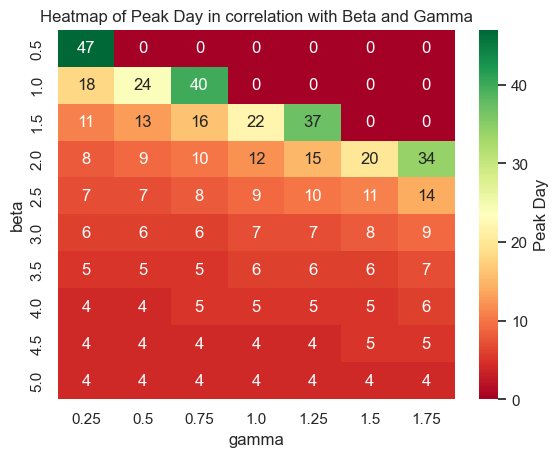

## BIS 634 01 / CB&B 634 01 Assignment 3

## Exercise 1

Use the requests module (or urllib) to use the Entrez API (see slides 5) to identify the PubMed IDs for 1000 Alzheimers papers from 2022 and for 1000 cancer papers from 2022. (9 points)

Note: To search for a disease and a publication year, structure the term like: Alzheimers+AND+2022[pdat] (Here [pdat] indicates that this is a publication year, and the AND (has to be all caps) means both conditions should apply.) 

Use the Entrez API via requests/urllib to pull the metadata for each such paper found above (both cancer and Alzheimers) (and save a JSON file storing each paper's title, abstract, and the query that found it that is of the general form: (12 points) 
{
    "32008517": {
        "ArticleTitle": "Deep Learning for Alzheimer's Disease Classification using Texture Features",
        "AbstractText": "We propose a classification method for Alzheimer's disease (AD)...",
        "query": "Alzheimer"
    }, ...
}
Here 32008517 would be the PubMed ID of one of the 2000 papers, specifically one that came from searching for Alzheimer's papers (it won't be in your data set because it was published in 2019). You should include the full AbstractText; I'm abridging here for clarity.

There are of course many more papers of each category, but is there any overlap in the two sets of papers that you identified? (3 points)

Hint: To do this, you'll probably want to look at one of the XML responses with a text editor so that you understand how it is structured.

Hint: Some papers like 32008517 have multiple AbstractText fields (e.g. when the abstract is structured). Be sure to store all parts. You could do this in many ways, from using a dictionary or a list or simply concatenating with a space in between. Discuss any pros or cons of your choice in your readme (1 point).

Caution: the PubMed API allows a rate of at most one query at a time and no more than 3 per second unless you have an API key. To be safe, use
time.sleep(1)
after each query to the PubMed API. 

Note: This doesn't require 2002 separate queries. You can get the metadata for many articles at a time by using a comma separated list of ids. While GET queries have a total line length limit, you could use a POST query instead and get the information for all the papers in one pass. (We can use POST instead of GET here in part because this is not a RESTful API.)

Note: BioPython provides functions for accessing the PubMed API. Do not use them; use the requests module to do an HTTP or HTTPS request directly on a URL that you specify with the parameters that you specify. Why? Because this approach is general and will work in many contexts whereas BioPython only works for PubMed and only from Python.

NOTE: sometimes papers (e.g. 31842501) have italics in their title or abstract. If so, using .text won't work well; use ET.tostring(item, method="text").decode() instead.

## Response


```python
# import modules 
import requests
import xml.dom.minidom as m
import xml.etree.ElementTree as et
import json
import time
```

#### Creating a function to return the list of a specified diseases using the requests module


```python
def get_id(disease):
    #disease : cancer/alzheimers
    #year : 2022
    #count : 1000 papers per diseases
    #file type : xml
    r = requests.get(f"https://eutils.ncbi.nlm.nih.gov/entrez/eutils/esearch.fcgi?db=pubmed&term={disease}+AND+2022[pdat]&retmax=1000&retmode=xml")
    time.sleep(1)
    doc = m.parseString(r.text)
    PubmedId = doc.getElementsByTagName('Id')
    IdList = []
    for i in range(len(PubmedId)):
        IdList.append(PubmedId[i].firstChild.data)

    return IdList
```


```python
## Checking for the total length of the paper : as specified should be 1000

len(get_id("Alzheimers") + get_id("Cancer"))
```


    2000


```python
## PubMedId for Disease - Alzheimers

get_id("Alzheimers")
```


    ['36323061',
     '36322888',
     '36322800',
     '36322495',
     '36322470',
     '36321981',
     '36321927',
     '36321882',
     '36321654',
     '36321615',
     '36321363',
     '36321205',
     '36321194',
     '36320609',
     '36320346',
     '36319270',
     '36319045',
     '36318754',
     '36318594',
     '36318545',
     '36318372',
     '36317468',
     '36317413',
     '36316970',
     '36316783',
     '36316708',
     '36316501',
     '36316487',
     '36316461',
     '36316282',
     '36316035',
     '36315527',
     '36315115',
     '36314730',
     '36314503',
     '36314232',
     '36314212',
     '36314211',
     '36314210',
     '36314209',
     '36314208',
     '36314207',
     '36314206',
     '36314205',
     '36314204',
     '36314203',
     '36314202',
     '36314201',
     '36314200',
     '36314199',
     '36314055',
     '36313968',
     '36313967',
     '36313955',
     '36313229',
     '36312018',
     '36311713',
     '36311031',
     '36310167',
     '36309938',
     '36309725',
     '36309404',
     '36309183',
     '36309087',
     '36308033',
     '36307888',
     '36307518',
     '36306920',
     '36306735',
     '36306540',
     '36306459',
     '36306458',
     '36305768',
     '36305541',
     '36305459',
     '36305148',
     '36305125',
     '36304998',
     '36304823',
     '36304723',
     '36304124',
     '36303870',
     '36303331',
     '36303296',
     '36302665',
     '36302659',
     '36302488',
     '36302464',
     '36301043',
     '36299613',
     '36299608',
     '36298279',
     '36297317',
     '36297313',
     '36296980',
     '36296969',
     '36296692',
     '36296686',
     '36296677',
     '36296574',
     '36296397',
     '36295605',
     '36295535',
     '36294010',
     '36293946',
     '36293666',
     '36293539',
     '36293528',
     '36293516',
     '36293327',
     '36293221',
     '36293147',
     '36293049',
     '36292947',
     '36292945',
     '36292933',
     '36292931',
     '36292674',
     '36292623',
     '36292114',
     '36291714',
     '36291679',
     '36291666',
     '36291661',
     '36291618',
     '36291595',
     '36291553',
     '36291536',
     '36291224',
     '36291125',
     '36291068',
     '36291020',
     '36291017',
     '36290612',
     '36289878',
     '36289859',
     '36289565',
     '36289390',
     '36289355',
     '36288997',
     '36288945',
     '36288546',
     '36288285',
     '36287605',
     '36287554',
     '36286505',
     '36286438',
     '36286188',
     '36285785',
     '36284665',
     '36284403',
     '36284365',
     '36284363',
     '36284351',
     '36284252',
     '36284251',
     '36284177',
     '36284170',
     '36283631',
     '36282451',
     '36282189',
     '36282001',
     '36281858',
     '36281795',
     '36281688',
     '36281687',
     '36281686',
     '36281685',
     '36281684',
     '36281683',
     '36281682',
     '36281681',
     '36281680',
     '36281679',
     '36281678',
     '36281677',
     '36281676',
     '36281675',
     '36281674',
     '36281673',
     '36281672',
     '36281671',
     '36281670',
     '36281669',
     '36281668',
     '36281667',
     '36281666',
     '36281665',
     '36281664',
     '36281663',
     '36281662',
     '36281661',
     '36281660',
     '36281659',
     '36281658',
     '36281546',
     '36281465',
     '36281127',
     '36281092',
     '36281030',
     '36280690',
     '36280370',
     '36280236',
     '36280008',
     '36279229',
     '36279227',
     '36279224',
     '36279115',
     '36278769',
     '36278470',
     '36278469',
     '36278440',
     '36278375',
     '36278356',
     '36278355',
     '36278354',
     '36278353',
     '36278352',
     '36278351',
     '36278350',
     '36278349',
     '36278348',
     '36278347',
     '36278346',
     '36278345',
     '36278006',
     '36277564',
     '36277478',
     '36277022',
     '36276653',
     '36276649',
     '36276340',
     '36276187',
     '36275801',
     '36275621',
     '36275419',
     '36275418',
     '36275417',
     '36275416',
     '36275415',
     '36275414',
     '36275013',
     '36275006',
     '36274975',
     '36274680',
     '36274509',
     '36274383',
     '36274284',
     '36274138',
     '36274019',
     '36273804',
     '36273719',
     '36273484',
     '36273456',
     '36273347',
     '36273219',
     '36273169',
     '36272585',
     '36272532',
     '36271704',
     '36271678',
     '36271598',
     '36271552',
     '36271414',
     '36271398',
     '36271229',
     '36270437',
     '36270305',
     '36270003',
     '36269859',
     '36269845',
     '36269420',
     '36269086',
     '36268960',
     '36268579',
     '36268432',
     '36267839',
     '36267702',
     '36266688',
     '36266620',
     '36266381',
     '36265910',
     '36265268',
     '36265073',
     '36264923',
     '36264717',
     '36264254',
     '36264226',
     '36264099',
     '36263141',
     '36263032',
     '36262986',
     '36262422',
     '36262371',
     '36261295',
     '36261123',
     '36260879',
     '36260691',
     '36259511',
     '36258952',
     '36257957',
     '36257926',
     '36257905',
     '36257450',
     '36257368',
     '36257314',
     '36257298',
     '36257284',
     '36256604',
     '36256566',
     '36255152',
     '36255105',
     '36254682',
     '36254251',
     '36254161',
     '36253968',
     '36253921',
     '36253823',
     '36253568',
     '36253408',
     '36253382',
     '36252972',
     '36252735',
     '36252395',
     '36252359',
     '36251929',
     '36251323',
     '36251300',
     '36251230',
     '36251053',
     '36251052',
     '36248795',
     '36247753',
     '36247524',
     '36247342',
     '36247338',
     '36246562',
     '36246407',
     '36246183',
     '36245382',
     '36245381',
     '36245380',
     '36245379',
     '36245378',
     '36245377',
     '36245376',
     '36245375',
     '36245374',
     '36245373',
     '36245297',
     '36244629',
     '36244581',
     '36243270',
     '36242532',
     '36242017',
     '36241244',
     '36241022',
     '36240992',
     '36240738',
     '36240668',
     '36240493',
     '36240103',
     '36240083',
     '36239924',
     '36239480',
     '36239360',
     '36239248',
     '36238527',
     '36238130',
     '36238082',
     '36236757',
     '36235786',
     '36235754',
     '36235622',
     '36235616',
     '36235612',
     '36235284',
     '36235127',
     '36234964',
     '36234916',
     '36234790',
     '36233145',
     '36233134',
     '36233130',
     '36233034',
     '36232940',
     '36232867',
     '36232865',
     '36232835',
     '36232612',
     '36232533',
     '36232368',
     '36232336',
     '36231236',
     '36231055',
     '36230957',
     '36230925',
     '36229847',
     '36229643',
     '36229634',
     '36229187',
     '36228869',
     '36228382',
     '36227593',
     '36227154',
     '36226735',
     '36226387',
     '36226340',
     '36226332',
     '36226313',
     '36226047',
     '36226046',
     '36225572',
     '36224605',
     '36224601',
     '36224042',
     '36224040',
     '36223919',
     '36223793',
     '36223681',
     '36223647',
     '36222770',
     '36222321',
     '36222089',
     '36221969',
     '36221381',
     '36221223',
     '36221141',
     '36221099',
     '36221038',
     '36220815',
     '36220604',
     '36220600',
     '36220526',
     '36220370',
     '36219848',
     '36219796',
     '36219787',
     '36219531',
     '36219197',
     '36219188',
     '36219187',
     '36219143',
     '36219139',
     '36219131',
     '36218862',
     '36218307',
     '36218251',
     '36218161',
     '36218120',
     '36218064',
     '36218057',
     '36217353',
     '36217304',
     '36217211',
     '36217192',
     '36217178',
     '36217177',
     '36217158',
     '36217155',
     '36216838',
     '36216800',
     '36216675',
     '36216518',
     '36215698',
     '36215395',
     '36215390',
     '36215071',
     '36214803',
     '36214721',
     '36214709',
     '36214568',
     '36214322',
     '36214002',
     '36214001',
     '36214000',
     '36213999',
     '36213998',
     '36213997',
     '36213996',
     '36213995',
     '36213994',
     '36213993',
     '36213992',
     '36213991',
     '36213537',
     '36213445',
     '36213283',
     '36213133',
     '36212742',
     '36212691',
     '36212652',
     '36211826',
     '36211819',
     '36211392',
     '36211330',
     '36210600',
     '36210219',
     '36209950',
     '36209948',
     '36209940',
     '36209703',
     '36209638',
     '36209495',
     '36209426',
     '36209379',
     '36209301',
     '36209290',
     '36209099',
     '36208870',
     '36208660',
     '36208588',
     '36208572',
     '36208415',
     '36208187',
     '36207740',
     '36207441',
     '36206930',
     '36206691',
     '36206387',
     '36206254',
     '36205142',
     '36205005',
     '36204656',
     '36204558',
     '36204555',
     '36204489',
     '36204386',
     '36204351',
     '36204350',
     '36204349',
     '36204348',
     '36204002',
     '36203977',
     '36203970',
     '36203811',
     '36203805',
     '36203603',
     '36203311',
     '36203194',
     '36203156',
     '36203129',
     '36203054',
     '36201963',
     '36201960',
     '36201876',
     '36201620',
     '36201426',
     '36201209',
     '36200578',
     '36200290',
     '36200281',
     '36200249',
     '36200215',
     '36200201',
     '36200197',
     '36200162',
     '36199177',
     '36199154',
     '36199128',
     '36199126',
     '36199077',
     '36199070',
     '36198316',
     '36198219',
     '36197966',
     '36197132',
     '36197131',
     '36197009',
     '36196979',
     '36196471',
     '36195955',
     '36195949',
     '36195891',
     '36195875',
     '36195745',
     '36195205',
     '36195188',
     '36195161',
     '36195041',
     '36194986',
     '36194560',
     '36193864',
     '36193827',
     '36193798',
     '36193769',
     '36193573',
     '36193329',
     '36193081',
     '36192766',
     '36192375',
     '36192349',
     '36192348',
     '36192177',
     '36191742',
     '36191675',
     '36191631',
     '36191431',
     '36191221',
     '36190718',
     '36190710',
     '36190701',
     '36190693',
     '36190126',
     '36189972',
     '36189728',
     '36189601',
     '36189600',
     '36189599',
     '36189598',
     '36189597',
     '36189596',
     '36189595',
     '36189594',
     '36189593',
     '36189592',
     '36189591',
     '36189590',
     '36189589',
     '36189588',
     '36189587',
     '36189586',
     '36189554',
     '36188718',
     '36188380',
     '36187723',
     '36187613',
     '36187197',
     '36187196',
     '36187195',
     '36187194',
     '36187193',
     '36187087',
     '36187086',
     '36186887',
     '36186730',
     '36186729',
     '36186728',
     '36186727',
     '36186726',
     '36186725',
     '36186724',
     '36186723',
     '36186093',
     '36185994',
     '36185993',
     '36185992',
     '36185672',
     '36185643',
     '36185606',
     '36185489',
     '36185487',
     '36185483',
     '36185480',
     '36184817',
     '36184615',
     '36184585',
     '36184326',
     '36184116',
     '36183950',
     '36183576',
     '36183541',
     '36183420',
     '36183417',
     '36183356',
     '36183195',
     '36183142',
     '36182964',
     '36182936',
     '36182766',
     '36182725',
     '36181989',
     '36181964',
     '36181105',
     '36181104',
     '36181103',
     '36181001',
     '36180965',
     '36180898',
     '36180883',
     '36180874',
     '36180861',
     '36180553',
     '36180246',
     '36180237',
     '36179926',
     '36179555',
     '36179535',
     '36179481',
     '36179370',
     '36179331',
     '36178947',
     '36178738',
     '36178715',
     '36178224',
     '36178120',
     '36177446',
     '36177445',
     '36177153',
     '36177152',
     '36176608',
     '36175853',
     '36175849',
     '36175825',
     '36175824',
     '36175566',
     '36175166',
     '36175137',
     '36175000',
     '36174844',
     '36174284',
     '36174129',
     '36173882',
     '36173739',
     '36173667',
     '36173534',
     '36173083',
     '36171657',
     '36171651',
     '36171642',
     '36171620',
     '36171428',
     '36171258',
     '36170830',
     '36170815',
     '36170544',
     '36170200',
     '36170055',
     '36170028',
     '36169371',
     '36169300',
     '36169224',
     '36168697',
     '36168682',
     '36168670',
     '36168659',
     '36168299',
     '36168207',
     '36167652',
     '36167553',
     '36167544',
     '36167438',
     '36167428',
     '36167285',
     '36166485',
     '36166229',
     '36166186',
     '36166162',
     '36166079',
     '36165334',
     '36165328',
     '36165202',
     '36165002',
     '36164995',
     '36164880',
     '36164564',
     '36162737',
     '36162695',
     '36162631',
     '36162324',
     '36161942',
     '36161898',
     '36161804',
     '36161763',
     '36160711',
     '36160384',
     '36160042',
     '36159838',
     '36159817',
     '36158627',
     '36158564',
     '36156258',
     '36156205',
     '36156112',
     '36155524',
     '36155523',
     '36155522',
     '36155521',
     '36155520',
     '36155519',
     '36155518',
     '36155517',
     '36155516',
     '36155515',
     '36155514',
     '36155513',
     '36155512',
     '36155511',
     '36155510',
     '36155509',
     '36155508',
     '36155507',
     '36155506',
     '36155505',
     '36155504',
     '36155503',
     '36155502',
     '36155409',
     '36155316',
     '36155312',
     '36155067',
     '36154878',
     '36154609',
     '36154464',
     '36154448',
     '36154269',
     '36153969',
     '36153964',
     '36153607',
     '36153580',
     '36153535',
     '36153426',
     '36153390',
     '36152776',
     '36152745',
     '36152726',
     '36152679',
     '36152573',
     '36152312',
     '36152307',
     '36151869',
     '36151568',
     '36151476',
     '36151472',
     '36151233',
     '36151065',
     '36150998',
     '36150075',
     '36150024',
     '36150020',
     '36149663',
     '36149525',
     '36149265',
     '36149090',
     '36149034',
     '36148988',
     '36148658',
     '36148631',
     '36146947',
     '36145723',
     '36145329',
     '36145197',
     '36145084',
     '36144820',
     '36143858',
     '36142879',
     '36142858',
     '36142796',
     '36142780',
     '36142742',
     '36142737',
     '36142676',
     '36142663',
     '36142659',
     '36142637',
     '36142627',
     '36142509',
     '36142507',
     '36142484',
     '36142483',
     '36142465',
     '36142419',
     '36142277',
     '36142187',
     '36142143',
     '36142134',
     '36142042',
     '36141594',
     '36141376',
     '36140776',
     '36140732',
     '36140686',
     '36140138',
     '36139423',
     '36139395',
     '36139364',
     '36139084',
     '36139033',
     '36139003',
     '36138950',
     '36138485',
     '36138153',
     '36138003',
     '36137977',
     '36137949',
     '36137824',
     '36137760',
     '36136290',
     '36136156',
     '36135988',
     '36135933',
     '36135833',
     '36134890',
     '36134730',
     '36134540',
     '36133075',
     '36131689',
     '36131624',
     '36131364',
     '36131327',
     '36131298',
     '36131294',
     '36130946',
     '36130840',
     '36130664',
     '36130492',
     '36130217',
     '36130084',
     '36130073',
     '36129947',
     '36129754',
     '36129673',
     '36129176',
     '36129098',
     '36129041',
     '36128968',
     '36128778',
     '36128654',
     '36127711',
     '36126456',
     '36126422',
     '36125835',
     '36125588',
     '36125124',
     '36124862',
     '36124351',
     '36124291',
     '36123648',
     '36123123',
     '36123122',
     '36122553',
     '36121878',
     '36121669',
     '36121640',
     '36121408',
     '36121183',
     '36121025',
     '36120786',
     '36120785',
     '36120784',
     '36120783',
     '36120782',
     '36120781',
     '36120780',
     '36120779',
     '36120778',
     '36120777',
     '36120776',
     '36120775',
     '36120397',
     '36120328',
     '36119675',
     '36119673',
     '36118969',
     '36118839',
     '36118832',
     '36118710',
     '36118272',
     '36117569',
     '36117568',
     '36117051',
     '36116796',
     '36116712',
     '36116491',
     '36116359',
     '36116296',
     '36115980',
     '36115967',
     '36115552',
     '36115465',
     '36115457',
     '36115352',
     '36115219',
     '36115133',
     '36115098',
     '36114914',
     '36114804',
     '36114798',
     '36114722',
     '36114480',
     '36114257',
     '36114255',
     '36114241',
     '36114240',
     '36114178',
     '36114174',
     '36113738',
     '36113572',
     '36113474',
     '36113413',
     '36113115',
     '36113018',
     '36113012',
     '36112736',
     '36112411',
     '36112408',
     '36112386',
     '36111936',
     '36111818',
     '36111689']


```python
## PubMedId for Disease - Cancer

get_id("Cancer")
```


    ['36323507',
     '36323504',
     '36323475',
     '36323457',
     '36323452',
     '36323443',
     '36323436',
     '36323435',
     '36323434',
     '36323433',
     '36323432',
     '36323431',
     '36323430',
     '36323420',
     '36323419',
     '36323417',
     '36323370',
     '36323360',
     '36323356',
     '36323332',
     '36323327',
     '36323321',
     '36323311',
     '36323309',
     '36323304',
     '36323278',
     '36323268',
     '36323264',
     '36323262',
     '36323258',
     '36323253',
     '36323249',
     '36323248',
     '36323247',
     '36323234',
     '36323232',
     '36323225',
     '36323190',
     '36323185',
     '36323179',
     '36323171',
     '36323147',
     '36323135',
     '36323109',
     '36323093',
     '36323090',
     '36323089',
     '36323072',
     '36323071',
     '36323070',
     '36323057',
     '36323053',
     '36323052',
     '36323051',
     '36323050',
     '36323049',
     '36323048',
     '36323005',
     '36323004',
     '36322991',
     '36322988',
     '36322977',
     '36322963',
     '36322939',
     '36322938',
     '36322935',
     '36322931',
     '36322930',
     '36322929',
     '36322928',
     '36322919',
     '36322906',
     '36322884',
     '36322882',
     '36322880',
     '36322879',
     '36322878',
     '36322873',
     '36322869',
     '36322860',
     '36322852',
     '36322850',
     '36322844',
     '36322839',
     '36322838',
     '36322830',
     '36322827',
     '36322825',
     '36322819',
     '36322818',
     '36322817',
     '36322815',
     '36322795',
     '36322793',
     '36322785',
     '36322781',
     '36322778',
     '36322773',
     '36322759',
     '36322753',
     '36322742',
     '36322706',
     '36322703',
     '36322695',
     '36322694',
     '36322687',
     '36322683',
     '36322662',
     '36322658',
     '36322655',
     '36322632',
     '36322631',
     '36322628',
     '36322626',
     '36322625',
     '36322607',
     '36322580',
     '36322577',
     '36322543',
     '36322511',
     '36322480',
     '36322473',
     '36322465',
     '36322462',
     '36322456',
     '36322450',
     '36322427',
     '36322414',
     '36322412',
     '36322407',
     '36322403',
     '36322399',
     '36322366',
     '36322352',
     '36322340',
     '36322335',
     '36322319',
     '36322316',
     '36322312',
     '36322308',
     '36322290',
     '36322289',
     '36322275',
     '36322273',
     '36322272',
     '36322248',
     '36322247',
     '36322246',
     '36322231',
     '36322228',
     '36322193',
     '36322191',
     '36322168',
     '36322148',
     '36322133',
     '36322107',
     '36322102',
     '36322100',
     '36322097',
     '36322095',
     '36322094',
     '36322089',
     '36322088',
     '36322071',
     '36322063',
     '36322060',
     '36322028',
     '36322019',
     '36322006',
     '36322005',
     '36322002',
     '36321996',
     '36321991',
     '36321986',
     '36321985',
     '36321984',
     '36321983',
     '36321982',
     '36321980',
     '36321979',
     '36321968',
     '36321960',
     '36321958',
     '36321955',
     '36321912',
     '36321879',
     '36321863',
     '36321857',
     '36321843',
     '36321823',
     '36321808',
     '36321803',
     '36321795',
     '36321792',
     '36321791',
     '36321789',
     '36321786',
     '36321785',
     '36321784',
     '36321782',
     '36321778',
     '36321775',
     '36321774',
     '36321769',
     '36321768',
     '36321767',
     '36321760',
     '36321747',
     '36321745',
     '36321722',
     '36321693',
     '36321691',
     '36321689',
     '36321685',
     '36321670',
     '36321663',
     '36321662',
     '36321659',
     '36321646',
     '36321643',
     '36321642',
     '36321627',
     '36321615',
     '36321614',
     '36321611',
     '36321604',
     '36321594',
     '36321583',
     '36321580',
     '36321579',
     '36321574',
     '36321569',
     '36321561',
     '36321559',
     '36321555',
     '36321552',
     '36321551',
     '36321549',
     '36321538',
     '36321537',
     '36321523',
     '36321521',
     '36321513',
     '36321509',
     '36321478',
     '36321470',
     '36321463',
     '36321448',
     '36321444',
     '36321439',
     '36321428',
     '36321416',
     '36321415',
     '36321409',
     '36321407',
     '36321403',
     '36321400',
     '36321395',
     '36321383',
     '36321381',
     '36321379',
     '36321378',
     '36321363',
     '36321342',
     '36321336',
     '36321332',
     '36321310',
     '36321309',
     '36321308',
     '36321307',
     '36321306',
     '36321305',
     '36321303',
     '36321302',
     '36321301',
     '36321299',
     '36321298',
     '36321297',
     '36321294',
     '36321291',
     '36321290',
     '36321287',
     '36321266',
     '36321265',
     '36321264',
     '36321262',
     '36321254',
     '36321246',
     '36321239',
     '36321238',
     '36321237',
     '36321230',
     '36321227',
     '36321226',
     '36321210',
     '36321209',
     '36321193',
     '36321189',
     '36321176',
     '36321161',
     '36321156',
     '36321141',
     '36321136',
     '36321135',
     '36321134',
     '36321133',
     '36321132',
     '36321101',
     '36321100',
     '36321091',
     '36321062',
     '36321023',
     '36321009',
     '36321000',
     '36320996',
     '36320989',
     '36320987',
     '36320968',
     '36320966',
     '36320942',
     '36320934',
     '36320916',
     '36320913',
     '36320893',
     '36320886',
     '36320882',
     '36320862',
     '36320859',
     '36320846',
     '36320813',
     '36320810',
     '36320803',
     '36320771',
     '36320760',
     '36320727',
     '36320712',
     '36320699',
     '36320672',
     '36320671',
     '36320666',
     '36320658',
     '36320657',
     '36320655',
     '36320651',
     '36320648',
     '36320634',
     '36320626',
     '36320614',
     '36320608',
     '36320602',
     '36320579',
     '36320495',
     '36320481',
     '36320480',
     '36320435',
     '36320434',
     '36320432',
     '36320412',
     '36320374',
     '36320367',
     '36320366',
     '36320357',
     '36320337',
     '36320328',
     '36320325',
     '36320322',
     '36320313',
     '36320308',
     '36320284',
     '36320274',
     '36320251',
     '36320189',
     '36320180',
     '36320179',
     '36320176',
     '36320173',
     '36320165',
     '36320128',
     '36320118',
     '36320100',
     '36320099',
     '36320076',
     '36320074',
     '36320072',
     '36320066',
     '36320064',
     '36320063',
     '36320056',
     '36320042',
     '36320041',
     '36320039',
     '36320019',
     '36320018',
     '36320014',
     '36320013',
     '36320009',
     '36320008',
     '36320006',
     '36320002',
     '36319998',
     '36319994',
     '36319992',
     '36319987',
     '36319985',
     '36319978',
     '36319976',
     '36319973',
     '36319968',
     '36319966',
     '36319956',
     '36319940',
     '36319928',
     '36319914',
     '36319907',
     '36319906',
     '36319895',
     '36319889',
     '36319886',
     '36319872',
     '36319871',
     '36319870',
     '36319869',
     '36319868',
     '36319855',
     '36319851',
     '36319850',
     '36319849',
     '36319848',
     '36319847',
     '36319846',
     '36319845',
     '36319837',
     '36319832',
     '36319831',
     '36319827',
     '36319818',
     '36319810',
     '36319809',
     '36319798',
     '36319794',
     '36319792',
     '36319790',
     '36319789',
     '36319786',
     '36319785',
     '36319783',
     '36319753',
     '36319752',
     '36319745',
     '36319719',
     '36319717',
     '36319716',
     '36319713',
     '36319698',
     '36319669',
     '36319660',
     '36319658',
     '36319656',
     '36319643',
     '36319640',
     '36319638',
     '36319634',
     '36319633',
     '36319625',
     '36319622',
     '36319618',
     '36319601',
     '36319597',
     '36319588',
     '36319582',
     '36319580',
     '36319575',
     '36319566',
     '36319560',
     '36319558',
     '36319557',
     '36319556',
     '36319555',
     '36319553',
     '36319552',
     '36319551',
     '36319544',
     '36319537',
     '36319517',
     '36319515',
     '36319510',
     '36319507',
     '36319498',
     '36319486',
     '36319485',
     '36319461',
     '36319460',
     '36319459',
     '36319458',
     '36319457',
     '36319456',
     '36319455',
     '36319454',
     '36319453',
     '36319452',
     '36319451',
     '36319450',
     '36319449',
     '36319448',
     '36319447',
     '36319446',
     '36319445',
     '36319186',
     '27466641',
     '26389505',
     '26389443',
     '26389436',
     '26389361',
     '26389231',
     '26389206',
     '26389181',
     '26389158',
     '36319182',
     '36319153',
     '36319138',
     '36319129',
     '36319128',
     '36319116',
     '36319107',
     '36319079',
     '36319076',
     '36319070',
     '36319066',
     '36319065',
     '36319064',
     '36319063',
     '36319062',
     '36319059',
     '36319046',
     '36319039',
     '36319036',
     '36319029',
     '36319026',
     '36319025',
     '36318924',
     '36318921',
     '36318918',
     '36318896',
     '36318865',
     '36318855',
     '36318825',
     '36318823',
     '36318801',
     '36318800',
     '36318794',
     '36318793',
     '36318766',
     '36318763',
     '36318757',
     '36318746',
     '36318743',
     '36318740',
     '36318738',
     '36318736',
     '36318723',
     '36318706',
     '36318705',
     '36318696',
     '36318692',
     '36318691',
     '36318688',
     '36318684',
     '36318672',
     '36318664',
     '36318662',
     '36318654',
     '36318653',
     '36318652',
     '36318650',
     '36318620',
     '36318612',
     '36318595',
     '36318593',
     '36318567',
     '36318553',
     '36318537',
     '36318530',
     '36318521',
     '36318504',
     '36318503',
     '36318477',
     '36318444',
     '36318440',
     '36318437',
     '36318405',
     '36318399',
     '36318394',
     '36318385',
     '36318382',
     '36318381',
     '36318379',
     '36318377',
     '36318367',
     '36318364',
     '36318362',
     '36318353',
     '36318342',
     '36318341',
     '36318340',
     '36318333',
     '36318332',
     '36318331',
     '36318327',
     '36318314',
     '36318305',
     '36318291',
     '36318282',
     '36318267',
     '36318262',
     '36318256',
     '36318242',
     '36318241',
     '36318237',
     '36318236',
     '36318235',
     '36318223',
     '36318222',
     '36318214',
     '36318208',
     '36318206',
     '36318182',
     '36318178',
     '36318172',
     '36318171',
     '36318169',
     '36318158',
     '36318154',
     '36318150',
     '36318128',
     '36318127',
     '36318118',
     '36318117',
     '36318113',
     '36318111',
     '36318106',
     '36318065',
     '36318058',
     '36318057',
     '36318053',
     '36318037',
     '36318005',
     '36317871',
     '36317870',
     '36317868',
     '36317863',
     '36317852',
     '36317849',
     '36317845',
     '36317842',
     '36317827',
     '36317800',
     '36317799',
     '36317792',
     '36317788',
     '36317775',
     '36317773',
     '36317771',
     '36317761',
     '36317760',
     '36317759',
     '36317758',
     '36317756',
     '36317726',
     '36317715',
     '36317710',
     '36317703',
     '36317681',
     '36317680',
     '36317676',
     '36317675',
     '36317671',
     '36317670',
     '36317667',
     '36317642',
     '36317634',
     '36317632',
     '36317631',
     '36317605',
     '36317599',
     '36317596',
     '36317588',
     '36317575',
     '36317561',
     '36317559',
     '36317555',
     '36317554',
     '36317553',
     '36317545',
     '36317535',
     '36317529',
     '36317527',
     '36317517',
     '36317516',
     '36317515',
     '36317512',
     '36317510',
     '36317509',
     '36317475',
     '36317465',
     '36317463',
     '36317454',
     '36317450',
     '36317444',
     '36317440',
     '36317423',
     '36317422',
     '36317420',
     '36317417',
     '36317416',
     '36317415',
     '36317409',
     '36317406',
     '36317402',
     '36317390',
     '36317389',
     '36317384',
     '36317374',
     '36317369',
     '36317368',
     '36317367',
     '36317360',
     '36317359',
     '36317356',
     '36317339',
     '36317327',
     '36317321',
     '36317277',
     '36317227',
     '36317220',
     '36317219',
     '36317216',
     '36317213',
     '36317210',
     '36317195',
     '36317178',
     '36317177',
     '36317165',
     '36317162',
     '36317157',
     '36317149',
     '36317143',
     '36317142',
     '36317140',
     '36317132',
     '36317125',
     '36317124',
     '36317111',
     '36317106',
     '36317080',
     '36317061',
     '36317011',
     '36317010',
     '36317009',
     '36316987',
     '36316985',
     '36316973',
     '36316969',
     '36316967',
     '36316958',
     '36316956',
     '36316954',
     '36316952',
     '36316948',
     '36316943',
     '36316942',
     '36316941',
     '36316931',
     '36316927',
     '36316922',
     '36316920',
     '36316914',
     '36316910',
     '36316907',
     '36316905',
     '36316903',
     '36316896',
     '36316892',
     '36316891',
     '36316889',
     '36316888',
     '36316887',
     '36316886',
     '36316884',
     '36316880',
     '36316866',
     '36316865',
     '36316864',
     '36316850',
     '36316846',
     '36316842',
     '36316840',
     '36316839',
     '36316838',
     '36316837',
     '36316836',
     '36316822',
     '36316817',
     '36316813',
     '36316812',
     '36316811',
     '36316809',
     '36316795',
     '36316794',
     '36316786',
     '36316785',
     '36316782',
     '36316780',
     '36316776',
     '36316775',
     '36316774',
     '36316773',
     '36316771',
     '36316768',
     '36316766',
     '36316761',
     '36316743',
     '36316734',
     '36316731',
     '36316728',
     '36316726',
     '36316723',
     '36316722',
     '36316715',
     '36316713',
     '36316711',
     '36316707',
     '36316703',
     '36316700',
     '36316696',
     '36316695',
     '36316694',
     '36316690',
     '36316687',
     '36316684',
     '36316680',
     '36316677',
     '36316675',
     '36316673',
     '36316671',
     '36316669',
     '36316666',
     '36316664',
     '36316658',
     '36316649',
     '36316645',
     '36316642',
     '36316630',
     '36316625',
     '36316603',
     '36316602',
     '36316601',
     '36316599',
     '36316594',
     '36316593',
     '36316587',
     '36316584',
     '36316580',
     '36316578',
     '36316576',
     '36316570',
     '36316561',
     '36316560',
     '36316559',
     '36316558',
     '36316541',
     '36316538',
     '36316529',
     '36316527',
     '36316524',
     '36316521',
     '36316517',
     '36316509',
     '36316508',
     '36316507',
     '36316506',
     '36316505',
     '36316485',
     '36316484',
     '36316482',
     '36316479',
     '36316476',
     '36316475',
     '36316474',
     '36316467',
     '36316465',
     '36316463',
     '36316444',
     '36316443',
     '36316442',
     '36316440',
     '36316438',
     '36316431',
     '36316421',
     '36316393',
     '36316391',
     '36316383',
     '36316380',
     '36316378',
     '36316375',
     '36316365',
     '36316364',
     '36316355',
     '36316351',
     '36316347',
     '36316341',
     '36316327',
     '36316326',
     '36316321',
     '36316314',
     '36316313',
     '36316312',
     '36316307',
     '36316305',
     '36316301',
     '36316300',
     '36316298',
     '36316278',
     '36316270',
     '36316255',
     '36316249',
     '36316228',
     '36316219',
     '36316218',
     '36316214',
     '36316213',
     '36316211',
     '36316210',
     '36316208',
     '36316198',
     '36316197',
     '36316196',
     '36316186',
     '36316164',
     '36316151',
     '36311471',
     '36316114',
     '36316113',
     '36316112',
     '36316111',
     '36316110',
     '36316109',
     '36316108',
     '36316107',
     '36316106',
     '36316105',
     '36316104',
     '36316075',
     '36316074',
     '36316073',
     '36316070',
     '36316062',
     '36316061',
     '36316057',
     '36316055',
     '36316054',
     '36316052',
     '36316050',
     '36316045',
     '36316044',
     '36316043',
     '36316042',
     '36316041',
     '36316040',
     '36316039',
     '36316038',
     '36316037',
     '36316036',
     '36316027',
     '36316016',
     '36316010',
     '36315986',
     '36315981',
     '36315960',
     '36315933',
     '36315930',
     '36315929',
     '36315928',
     '36315927',
     '36315923',
     '36315922',
     '36315921',
     '36315919',
     '36315917',
     '36315916',
     '36315915',
     '36315914',
     '36315913',
     '36315912',
     '36315911',
     '36315909',
     '36315865',
     '36315861',
     '36315854',
     '36315833',
     '36315652']


#### Finding overlap between two sets of papers


```python
def overlap_PubmedId(disease1,disease2):
    return set(get_id(disease1))&set(get_id (disease2))
```


```python
overlap_PubmedId("Alzheimers", "Cancer")
```


    {'36314209'}


#### Finding the MetaData of the papers in Alzheimers and Cancer Sets


```python
def metadata(disease):
    PubmedIdList = get_id(disease)
    disease_paper_dict = {}
    for PubmedId in PubmedIdList:
        time.sleep(1)
        r = requests.post(f"https://eutils.ncbi.nlm.nih.gov/entrez/eutils/efetch.fcgi?db=pubmed&retmode=xml&id={int(PubmedId)}")
        doc = m.parseString(r.text)

        ArticleTitle = doc.getElementsByTagName('ArticleTitle')
        Title = ""
        if len(ArticleTitle) > 0:
            for elm in ArticleTitle:
                for textmessage in elm.childNodes:
                    try:
                        Title += textmessage._get_wholeText()
                        Title = et.tostring(Title, method = "text").decode()
                    
                    except AttributeError: 
                        for subnode in textmessage.childNodes:
                            if subnode.nodeType == m.Node.TEXT_NODE:
                                Title += subnode.data
     
        AbstractText = doc.getElementsByTagName('AbstractText')
        Abstract = ""
        if len(AbstractText) > 0:
            for elm in AbstractText:
                for textmessage in elm.childNodes:
                    try:
                        Abstract += textmessage._get_wholeText()
                        Abstract = et.tostring(Abstract, method = "text").decode()
                    except AttributeError: 
                        for subnode in textmessage.childNodes:
                            if subnode.nodeType == m.Node.TEXT_NODE:
                                Abstract += subnode.data

      
        MeshHeading = doc.getElementsByTagName('MeshHeading')
        ArticleMeshTerms = []
        if len(MeshHeading) > 0:
            try:
                for i in MeshHeading:
                    ArticleMeshTerms.append(i.firstChild.childNodes[0].nodeValue)
            except AttributeError: pass
            
        disease_paper_dict[PubmedId] = {
            'ArticleTitle': Title,
            'ArticleAbstract': Abstract,
            'Query': disease,
            'Mesh': ArticleMeshTerms
        }
        
    return  disease_paper_dict
```

#### I looped over the abstract section to get all the elements. I think it is an efficient and less time consuming way to find the and store the data. The data was then was store in a form of string and then to a common dictionary including the other data keys. But while going through the data file, the structured parameters names such as objective, results, method were not stored. It would be difficult to extract information of objective/method/results of all papers separately. 

#### Pulling Metadata for Alzheimers and saving the JSON file


```python
alzheimers_metadata = metadata('Alzheimers')
```


```python
with open("Alzheimer.json", "w") as f:
    json.dump(alzheimers_metadata, f, indent=4)
```

#### Pulling Metadata for Cancer and saving the JSON file


```python
cancer_metadata = metadata('Cancer')
```


```python
with open("Cancer.json", "w") as f:
    json.dump(cancer_metadata, f, indent=4)
```

#### Combing the data in a single json file


```python
combined_data = metadata('Alzheimers')
cancer_data = metadata('Cancer')
combined_data.update(cancer_data)

with open('papers.json','w') as f:
    json.dump(combined_data,f)
```

## Exercise 2

Machine learning and data visualization strategies generally work best on data that is numeric, but exercise 1 gave us text data, and indeed text is common. Fortunately, modern NLP algorithms powered by machine learning trained on massive datasets exist that can take words (e.g. word2vec) or titles and abstracts (e.g. SPECTER) and return a vector of numbers in a way that similar items are given similar vectors. Since we have titles and abstracts, let's use SPECTER.

In particular, for each paper identified from exercise 1, compute the SPECTER embedding (a 768-dimensional vector). Keep track of which papers came from searching for Alzheimers, which came from searching for cancer. (5 points) If you are familiar with SPECTER and wish to do it another way, that's great, if not here's one approach based on https://github.com/allenai/specter:

Install pytorch (a deep learning library) by following the instructions here: https://pytorch.org/get-started/locally/

Install the huggingface transformers module: pip install transformers

(🤗 huggingface provides access to a number of pre-trained NLP language models.)

Have your code load the SPECTER model (the first time you do this, it will take a bit to download the model; it will be stored locally for fast reuse later):
from transformers import AutoTokenizer, AutoModel

# load model and tokenizer
tokenizer = AutoTokenizer.from_pretrained('allenai/specter')
model = AutoModel.from_pretrained('allenai/specter')
Load the papers dictionary (3 points) and then process your dictionary of papers to find the SPECTER embeddings (2 points). One (somewhat slow) way to do this is as follows:
import tqdm

# we can use a persistent dictionary (via shelve) so we can stop and restart if needed
# alternatively, do the same but with embeddings starting as an empty dictionary
embeddings = {}
for pmid, paper in tqdm.tqdm(papers.items()):
    data = [paper["ArticleTitle"] + tokenizer.sep_token + get_abstract(paper)]
    inputs = tokenizer(
        data, padding=True, truncation=True, return_tensors="pt", max_length=512
    )
    result = model(**inputs)
    # take the first token in the batch as the embedding
    embeddings[pmid] = result.last_hidden_state[:, 0, :].detach().numpy()[0]

# turn our dictionary into a list
embeddings = [embeddings[pmid] for pmid in papers.keys()]
At this point, embeddings[i] is the 768-dim vector for the ith paper.

Apply principal component analysis (PCA) to identify the first three principal components. (5 points) I suggest using the sklearn module, e.g.
from sklearn import decomposition
pca = decomposition.PCA(n_components=3)
embeddings_pca = pd.DataFrame(
    pca.fit_transform(embeddings),
    columns=['PC0', 'PC1', 'PC2']
)
embeddings_pca["query"] = [paper["query"] for paper in papers.values()]
Plot 2D scatter plots for PC0 vs PC1, PC0 vs PC2, and PC1 vs PC2; color code these by the search query used (Alzheimers vs cancer). (5 points) Comment on the separation or lack thereof, and any take-aways from that. (5 points)

## Response


```python
#download transformers using conda in terminal
!conda install -c huggingface transformers -y
```

    huggingface/tokenizers: The current process just got forked, after parallelism has already been used. Disabling parallelism to avoid deadlocks...
    To disable this warning, you can either:
    	- Avoid using `tokenizers` before the fork if possible
    	- Explicitly set the environment variable TOKENIZERS_PARALLELISM=(true | false)
    Collecting package metadata (current_repodata.json): done
    Solving environment: done
    
    ## Package Plan ##
    
      environment location: /opt/anaconda3
    
      added / updated specs:
        - transformers
    
    
    The following packages will be downloaded:
    
        package                    |            build
        ---------------------------|-----------------
        huggingface_hub-0.10.1     |             py_0         160 KB  huggingface
        sacremoses-master          |             py_0         404 KB  huggingface
        tokenizers-0.13.0.dev0     |           py39_0         3.3 MB  huggingface
        transformers-4.24.0        |             py_0         2.6 MB  huggingface
        ------------------------------------------------------------
                                               Total:         6.5 MB
    
    The following NEW packages will be INSTALLED:
    
      huggingface_hub    huggingface/noarch::huggingface_hub-0.10.1-py_0 None
      sacremoses         huggingface/noarch::sacremoses-master-py_0 None
      tokenizers         huggingface/osx-64::tokenizers-0.13.0.dev0-py39_0 None
      transformers       huggingface/noarch::transformers-4.24.0-py_0 None
    
    
    
    Downloading and Extracting Packages
    tokenizers-0.13.0.de | 3.3 MB    | ##################################### | 100% 
    transformers-4.24.0  | 2.6 MB    | ##################################### | 100% 
    sacremoses-master    | 404 KB    | ##################################### | 100% 
    huggingface_hub-0.10 | 160 KB    | ##################################### | 100% 
    Preparing transaction: done
    Verifying transaction: done
    Executing transaction: done
    Retrieving notices: ...working... done


```python
pip install transformers
```

    huggingface/tokenizers: The current process just got forked, after parallelism has already been used. Disabling parallelism to avoid deadlocks...
    To disable this warning, you can either:
    	- Avoid using `tokenizers` before the fork if possible
    	- Explicitly set the environment variable TOKENIZERS_PARALLELISM=(true | false)
    Requirement already satisfied: transformers in /opt/anaconda3/lib/python3.9/site-packages (4.23.1)
    Requirement already satisfied: huggingface-hub<1.0,>=0.10.0 in /opt/anaconda3/lib/python3.9/site-packages (from transformers) (0.10.1)
    Requirement already satisfied: regex!=2019.12.17 in /opt/anaconda3/lib/python3.9/site-packages (from transformers) (2022.7.9)
    Requirement already satisfied: requests in /opt/anaconda3/lib/python3.9/site-packages (from transformers) (2.28.1)
    Requirement already satisfied: filelock in /opt/anaconda3/lib/python3.9/site-packages (from transformers) (3.6.0)
    Requirement already satisfied: tokenizers!=0.11.3,<0.14,>=0.11.1 in /opt/anaconda3/lib/python3.9/site-packages (from transformers) (0.13.1)
    Requirement already satisfied: pyyaml>=5.1 in /opt/anaconda3/lib/python3.9/site-packages (from transformers) (6.0)
    Requirement already satisfied: numpy>=1.17 in /opt/anaconda3/lib/python3.9/site-packages (from transformers) (1.21.5)
    Requirement already satisfied: tqdm>=4.27 in /opt/anaconda3/lib/python3.9/site-packages (from transformers) (4.64.1)
    Requirement already satisfied: packaging>=20.0 in /opt/anaconda3/lib/python3.9/site-packages (from transformers) (21.3)
    Requirement already satisfied: typing-extensions>=3.7.4.3 in /opt/anaconda3/lib/python3.9/site-packages (from huggingface-hub<1.0,>=0.10.0->transformers) (4.3.0)
    Requirement already satisfied: pyparsing!=3.0.5,>=2.0.2 in /opt/anaconda3/lib/python3.9/site-packages (from packaging>=20.0->transformers) (3.0.9)
    Requirement already satisfied: charset-normalizer<3,>=2 in /opt/anaconda3/lib/python3.9/site-packages (from requests->transformers) (2.0.4)
    Requirement already satisfied: idna<4,>=2.5 in /opt/anaconda3/lib/python3.9/site-packages (from requests->transformers) (3.3)
    Requirement already satisfied: urllib3<1.27,>=1.21.1 in /opt/anaconda3/lib/python3.9/site-packages (from requests->transformers) (1.26.11)
    Requirement already satisfied: certifi>=2017.4.17 in /opt/anaconda3/lib/python3.9/site-packages (from requests->transformers) (2022.9.24)
    Note: you may need to restart the kernel to use updated packages.


```python
# import AutoTokenizer, AutoModel.
from transformers import AutoTokenizer, AutoModel

# load model and tokenizer
tokenizer = AutoTokenizer.from_pretrained('allenai/specter')
model = AutoModel.from_pretrained('allenai/specter')
```


```python
# importing tools

import json
import numpy as np
import pandas as pd
from sklearn import decomposition
import matplotlib as plt
import seaborn as sns
```


```python
# Loading the Alzheimers paper set file 

with open("Alzheimer.json") as f:
    alzheimers_metadata = json.load(f)

alzheimer_df = pd.DataFrame.from_dict(alzheimers_metadata, orient = 'index') 
alzheimer_df.head()
```


<div>
<style scoped>
    .dataframe tbody tr th:only-of-type {
        vertical-align: middle;
    }

    .dataframe tbody tr th {
        vertical-align: top;
    }

    .dataframe thead th {
        text-align: right;
    }
</style>
<table border="1" class="dataframe">
  <thead>
    <tr style="text-align: right;">
      <th></th>
      <th>ArticleTitle</th>
      <th>ArticleAbstract</th>
      <th>Query</th>
      <th>Mesh</th>
    </tr>
  </thead>
  <tbody>
    <tr>
      <th>36315115</th>
      <td>Association of Stroke and Cerebrovascular Path...</td>
      <td>Scam susceptibility is associated with adverse...</td>
      <td>Alzheimers</td>
      <td>[]</td>
    </tr>
    <tr>
      <th>36314730</th>
      <td>Cerebrospinal fluid neurofilament light and ce...</td>
      <td>Neurodegeneration underpins the pathological p...</td>
      <td>Alzheimers</td>
      <td>[]</td>
    </tr>
    <tr>
      <th>36314503</th>
      <td>Improving community health-care systems' early...</td>
      <td>Preliminary estimates suggest that current glo...</td>
      <td>Alzheimers</td>
      <td>[]</td>
    </tr>
    <tr>
      <th>36314232</th>
      <td>Erratum to: Predictors of Life Expectancy in A...</td>
      <td></td>
      <td>Alzheimers</td>
      <td>[]</td>
    </tr>
    <tr>
      <th>36314212</th>
      <td>The Ethics of Using Caregivers as Cognitive Te...</td>
      <td>O'Caoimh et al. demonstrated that caregivers o...</td>
      <td>Alzheimers</td>
      <td>[]</td>
    </tr>
  </tbody>
</table>
</div>


```python
# Loading the Cancer paper set file 

with open("Cancer.json") as f:
    cancer_metadata = json.load(f)

cancer_df = pd.DataFrame.from_dict(cancer_metadata, orient = 'index') 
cancer_df.head()
```


<div>
<style scoped>
    .dataframe tbody tr th:only-of-type {
        vertical-align: middle;
    }

    .dataframe tbody tr th {
        vertical-align: top;
    }

    .dataframe thead th {
        text-align: right;
    }
</style>
<table border="1" class="dataframe">
  <thead>
    <tr style="text-align: right;">
      <th></th>
      <th>ArticleTitle</th>
      <th>ArticleAbstract</th>
      <th>Query</th>
      <th>Mesh</th>
    </tr>
  </thead>
  <tbody>
    <tr>
      <th>36316114</th>
      <td>Apatinib as a Third-Line Treatment for HER2-Po...</td>
      <td>Treatment options are limited after the failur...</td>
      <td>Cancer</td>
      <td>[]</td>
    </tr>
    <tr>
      <th>36316113</th>
      <td>Safe Discharge Criteria After Curative Gastrec...</td>
      <td>This study aimed to investigate the relationsh...</td>
      <td>Cancer</td>
      <td>[]</td>
    </tr>
    <tr>
      <th>36316112</th>
      <td>Endoscopic Findings and Treatment of Gastric N...</td>
      <td>Gastric neoplasia is a common manifestation of...</td>
      <td>Cancer</td>
      <td>[]</td>
    </tr>
    <tr>
      <th>36316111</th>
      <td>Tumor Location Causes Different Recurrence Pat...</td>
      <td>Tumor recurrence is the principal cause of poo...</td>
      <td>Cancer</td>
      <td>[]</td>
    </tr>
    <tr>
      <th>36316110</th>
      <td>PLK2 Single Nucleotide Variant in Gastric Canc...</td>
      <td>Chromosomal instability is a hallmark of gastr...</td>
      <td>Cancer</td>
      <td>[]</td>
    </tr>
  </tbody>
</table>
</div>


```python
combined_papers = pd.concat([alzheimer_df,cancer_df])
```


```python
combined_papers
```


<div>
<style scoped>
    .dataframe tbody tr th:only-of-type {
        vertical-align: middle;
    }

    .dataframe tbody tr th {
        vertical-align: top;
    }

    .dataframe thead th {
        text-align: right;
    }
</style>
<table border="1" class="dataframe">
  <thead>
    <tr style="text-align: right;">
      <th></th>
      <th>ArticleTitle</th>
      <th>ArticleAbstract</th>
      <th>Query</th>
      <th>Mesh</th>
    </tr>
  </thead>
  <tbody>
    <tr>
      <th>36315115</th>
      <td>Association of Stroke and Cerebrovascular Path...</td>
      <td>Scam susceptibility is associated with adverse...</td>
      <td>Alzheimers</td>
      <td>[]</td>
    </tr>
    <tr>
      <th>36314730</th>
      <td>Cerebrospinal fluid neurofilament light and ce...</td>
      <td>Neurodegeneration underpins the pathological p...</td>
      <td>Alzheimers</td>
      <td>[]</td>
    </tr>
    <tr>
      <th>36314503</th>
      <td>Improving community health-care systems' early...</td>
      <td>Preliminary estimates suggest that current glo...</td>
      <td>Alzheimers</td>
      <td>[]</td>
    </tr>
    <tr>
      <th>36314232</th>
      <td>Erratum to: Predictors of Life Expectancy in A...</td>
      <td></td>
      <td>Alzheimers</td>
      <td>[]</td>
    </tr>
    <tr>
      <th>36314212</th>
      <td>The Ethics of Using Caregivers as Cognitive Te...</td>
      <td>O'Caoimh et al. demonstrated that caregivers o...</td>
      <td>Alzheimers</td>
      <td>[]</td>
    </tr>
    <tr>
      <th>...</th>
      <td>...</td>
      <td>...</td>
      <td>...</td>
      <td>...</td>
    </tr>
    <tr>
      <th>36308179</th>
      <td>Molecular subtypes of invasive breast carcinom...</td>
      <td>Tumor budding (TB), poorly differentiated clus...</td>
      <td>Cancer</td>
      <td>[Humans, Female, Retrospective Studies, Recept...</td>
    </tr>
    <tr>
      <th>36308083</th>
      <td>Efficacy and safety of EUS-guided gallbladder ...</td>
      <td>ERCP is the first line of treatment for malign...</td>
      <td>Cancer</td>
      <td>[]</td>
    </tr>
    <tr>
      <th>36308082</th>
      <td>Forkhead Box S1 inhibits the progression of lu...</td>
      <td>Lung squamous cell carcinoma (SCC) is consider...</td>
      <td>Cancer</td>
      <td>[Mice, Animals, Wnt Signaling Pathway, beta Ca...</td>
    </tr>
    <tr>
      <th>36308081</th>
      <td>ZNF561 antisense RNA 1 contributes to angiogen...</td>
      <td>Hepatocellular carcinoma is a common malignant...</td>
      <td>Cancer</td>
      <td>[Humans, Carcinoma, Hepatocellular, RNA, Antis...</td>
    </tr>
    <tr>
      <th>36308078</th>
      <td>Exosomes derived from bone marrow mesenchymal ...</td>
      <td>Bone marrow mesenchymal stem cells (BM-MSCs), ...</td>
      <td>Cancer</td>
      <td>[Humans, Female, Exosomes, YAP-Signaling Prote...</td>
    </tr>
  </tbody>
</table>
<p>2000 rows × 4 columns</p>
</div>


```python
# Loading the Combined paper set file : includes paper from Alzheimers and Cancer disease 

with open('papers.json') as f:
    combined_data = json.load(f)
```


```python
# Computing the SPECTER embedding 

data = [paper["ArticleTitle"] + tokenizer.sep_token + paper["ArticleAbstract"] for paper in combined_data.values()]
inputs = tokenizer([data[0]], padding=True, truncation=True, return_tensors="pt", max_length=512)
result = model(**inputs)
embeddings_total = result.last_hidden_state[:, 0, :].detach().numpy()

for i in range(1,len(data)):
    inputs = tokenizer([data[i]], padding=True, truncation=True, return_tensors="pt", max_length=512)
    result = model(**inputs)
    embeddings = result.last_hidden_state[:, 0, :].detach().numpy()
    embeddings_total = np.concatenate((embeddings_total, embeddings),axis = 0)
```


```python
# Applying principal component analysis (PCA) to identify the first three principal components

pca = decomposition.PCA(n_components=3)
embeddings_pca = pd.DataFrame(pca.fit_transform(embeddings_total),columns=['PC0', 'PC1', 'PC2'])
embeddings_pca["Query"] = [paper["Query"] for paper in combined_data.values()]
```


```python
embeddings_pca
```


<div>
<style scoped>
    .dataframe tbody tr th:only-of-type {
        vertical-align: middle;
    }

    .dataframe tbody tr th {
        vertical-align: top;
    }

    .dataframe thead th {
        text-align: right;
    }
</style>
<table border="1" class="dataframe">
  <thead>
    <tr style="text-align: right;">
      <th></th>
      <th>PC0</th>
      <th>PC1</th>
      <th>PC2</th>
      <th>Query</th>
    </tr>
  </thead>
  <tbody>
    <tr>
      <th>0</th>
      <td>-4.678195</td>
      <td>3.000064</td>
      <td>3.983280</td>
      <td>Alzheimers</td>
    </tr>
    <tr>
      <th>1</th>
      <td>-5.506620</td>
      <td>1.476830</td>
      <td>3.631659</td>
      <td>Alzheimers</td>
    </tr>
    <tr>
      <th>2</th>
      <td>-7.132979</td>
      <td>3.150683</td>
      <td>3.925214</td>
      <td>Alzheimers</td>
    </tr>
    <tr>
      <th>3</th>
      <td>-5.904363</td>
      <td>2.459445</td>
      <td>2.852544</td>
      <td>Alzheimers</td>
    </tr>
    <tr>
      <th>4</th>
      <td>-5.359968</td>
      <td>-0.412834</td>
      <td>-0.422238</td>
      <td>Alzheimers</td>
    </tr>
    <tr>
      <th>...</th>
      <td>...</td>
      <td>...</td>
      <td>...</td>
      <td>...</td>
    </tr>
    <tr>
      <th>1994</th>
      <td>8.653900</td>
      <td>-2.024786</td>
      <td>-1.850365</td>
      <td>Cancer</td>
    </tr>
    <tr>
      <th>1995</th>
      <td>5.899750</td>
      <td>6.154752</td>
      <td>3.499627</td>
      <td>Cancer</td>
    </tr>
    <tr>
      <th>1996</th>
      <td>3.180859</td>
      <td>0.754004</td>
      <td>-2.725007</td>
      <td>Cancer</td>
    </tr>
    <tr>
      <th>1997</th>
      <td>2.865486</td>
      <td>-0.261790</td>
      <td>-6.288406</td>
      <td>Cancer</td>
    </tr>
    <tr>
      <th>1998</th>
      <td>3.703853</td>
      <td>1.045163</td>
      <td>-2.427681</td>
      <td>Cancer</td>
    </tr>
  </tbody>
</table>
<p>1999 rows × 4 columns</p>
</div>


#### Plotting the 2D scatter plots for PC0 vs PC1, PC0 vs PC2, and PC1 vs PC2; color code these by the search query used (Alzheimers vs cancer.


```python
sns.pairplot(embeddings_pca, hue = 'Query')
plt.show()
```


    

    


### Findings : 

 - Principal Component Analysis (PCA) is a linear methods used for dimensionality reduction.
 - PCA seeks to build a small-dimensional coordinate system using whatever small collection of components (i.e. combinations of variables) best explains the variability of the underlying dataset, and then simply throw out the coordinates which do not have a high impact on variation.
 - Scatter plot for PC0 vs PC1 using PCA method : the variation (separation) is clearly visible. The first principal component is the linear combination of x-variables that has maximum variance (among all linear combinations). It accounts for as much variation in the data as possible. When the two queries datset is projected to a two-dimensional space, can be linearly separable up to some extent.
 - Scatter plot for PC0 vs PC2 using PCA method : Similarly to PC0 vs PC1, PC0 vs PC2 we can notice the separatability from the two diseases datasets.When the two queries datset is projected to a two-dimensional space, can be linearly separable up to some extent.
 - Scatter plot for PC1 vs PC2 using PCA method : Datasets are not linearly separable across PC1 and PC2.
 - Most of the variability in the data is captured by PC0 (Principal Component 0) and the residual variability is captured by PC1 (Principal Component 1), which is orthogonal (independent) to PC0 and PC2 (Principal Component 2), which is orthogonal (independent) to PC1.  PC1 and PC2 tries to capture the abnormal variations in the dataset. PC1 and PC2 have 0 correlation.

## Exercise 3

Consider the simple, non-spatial SIR modelLinks to an external site.:

In this epidemiology model,  is the number of "susceptible" individuals,  is the number of infected individuals,  is the removed population that can no longer become sick,  is the total population (hence ),  is a scale factor measuring how likely an infected person is to make a susceptible person sick,  measures the rate at which infected individuals are removed from that state.

Write a Python function that uses the Explicit Euler method to plot  given  and  (the last time point to compute). (N follows from the formula.) Do not use an integration library; provide your own implementation (5 points).

The New Haven population is approximately . Suppose that on day 0, there was 1 person infected with a new disease in New Haven and everyone else was susceptible (as the disease is new). Suppose further that  and . Plot the time course of the number of infected individuals until that number drops below 1 (at which point, we'll assume the disease has run its course). (5 points)

For those parameter values, when does the number of infected people peak? (2 points) How many people are infected at the peak? (3 points). (Have your code identify these things; don't do it manually.)

Unfortunately, for new diseases, we may not know  or  with much accuracy. Vary these two variables over "nearby" values, and plot on a heat map how the time of the peak of the infection depends on these two variables. (5 points). Do the same for the number of individuals infected at peak. (5 points)

Hint: if you're using plotnine, consider using geom_raster or geom_tileLinks to an external site. to make the heat map. Other approaches are fine too.

## Response


```python
# importing libraries

import numpy as np
import pandas as pd
import matplotlib.pyplot as plt
import seaborn as sns
```


```python
delta_time = 0.1

def ExplicitEuler(s0, i0, r0, beta, gamma, tmax, plot):
    
    t = 0 
    s = s0
    i = i0
    r = r0
    peak_reached = False
    peak_day= 0
    peak_infection=i0
    
    #x and y variables for the plot
    days = [0] 
    infected = [i0] 
    
    while t < tmax:
        susceptible_next = s + (-1*(beta/(s+i+r))*s*i)*delta_time
        infected_next = i + ((beta/(s+i+r))*s*i - (gamma*i))*delta_time
        removed_next = r + gamma*i*delta_time
        
        infected.append(infected_next)
        t = t + delta_time
        days.append(t)
        
        s, i, r = susceptible_next, infected_next, removed_next
        
        if not peak_reached and ((beta/(s+i+r))*s*i - (gamma*i))<0:
            peak_reached = True
            peak_day = round(t)
            peak_infection = round(i)
            
        
        if i<1: 
            break
    if plot:
        plt.figure(figsize=(10,7))
        plt.plot(days, infected)
        plt.xlabel("Days")
        plt.ylabel("Infected People")
        plt.title("SIR Model : Euler Method")
    
    return peak_day, peak_infection
```


```python
peak_day, peak_infection = ExplicitEuler((134000), 1,0, 2, 1, 1000, True)
print(f'The number of infected people peaked on {peak_day}th day.')
print(f'The number of people infected at the peak were {peak_infection}.')
```

    The number of infected people peaked on 12th day.
    The number of people infected at the peak were 21051.


    

    


#### Creating a list to Vary beta and gamma over "nearby" values.


```python
Gamma = []
Beta = []
peak_days = []
peakinfection = []
for gamma in np.arange(0.25, 2.0, 0.25):
    for beta in np.arange(0.5, 5.5, 0.5):
        peak_day, peak_infection = ExplicitEuler((134000), 1, 0, beta, gamma, 100, False)
        Beta.append(beta)
        Gamma.append(gamma)
        peak_days.append(peak_day)
        peakinfection.append(peak_infection)
```


```python
# Creating a dataframe of the above parameters

df = pd.DataFrame({'beta': Beta,'gamma' :Gamma, 'peak_day': peak_days,'peak_infections': peakinfection})
```

#### Plotting HeatMap to show how the time of the peak of the infection depends on variables beta and gamma.


```python
Parameters = df.pivot("beta", "gamma", "peak_day")
ax = plt.axes()
sns.heatmap(Parameters,fmt="",cmap='RdYlGn', annot=True, cbar_kws={'label': 'Peak Day'})
ax.set_title("Heatmap of Peak Day in correlation with Beta and Gamma")
plt.show()
```


    

    


 #### Plotting HeatMap to show how the number of individuals infected at peak. depends on variables beta and gamma


```python
Parameters = df.pivot("beta", "gamma", "peak_infections")
ax = plt.axes()
sns.heatmap(Parameters, cmap="crest", annot=True, annot_kws={"size": 7}, cbar_kws={'label': 'Infection Count'})
ax.set_title("Heatmap of Peak Infections in Correlation with Beta and Gamma")
plt.show()
```


    

    


## Exercise 4

Identify a data set online (5 points) that you find interesting that could potentially be used for the final project; the main requirements is that there needs to be many (hundreds or more) data items with several identifiable variables, at least one of which could be viewed as an output variable that you could predict from the others.

Describe the dataset (5 points) Your answer should address (but not be limited to): how many variables? Are the key variables explicitly specified or are they things you would have to derive (e.g. by inferring from text)? Are any of the variables exactly derivable from other variables? (i.e. are any of them redundant?) Are there any variables that could in principle be statistically predicted from other variables? How many rows/data points are there? Is the data in a standard format? If not, how could you convert it to a standard format?

Describe the terms of use and identify any key restrictions (e.g. do you have to officially apply to get access to the data? Are there certain types of analyses you can't do?) (5 points) 

Remember: if you can't find explicit permission to use a given dataset, assume that you cannot do so.

Do data exploration on the dataset, and present a representative set of figures that gives insight into the data. Comment on the insights gained. (5 points)

Identify any data cleaning needs (this includes checking for missing data) and write code to perform them. If the data does not need to be cleaned, explain how you reached this conclusion. (5 points)

## Response 

### Dataset Identified 

 The Health Information National Trends Survey (HINTS). I chose the HINTS 5, Cycle 3 (2019) dataset, updated April 2021 version. It has Total respondents: 5,438, Complete responses: 5,247, Partial responses: 191. The survey collects nationally representative data routinely about the American public's use of cancer-related information. It is a large dataset with several identifible variables. As per the research question, several variables can be viewed as an output variable that could be predicted from other variable. Dataset Link : https://hints.cancer.gov/data/download-data.aspx (can't be uploaded to GitHub due to large volume of data).

### Dataset Description 


```python
import pandas as pd
import matplotlib.pyplot as plt
import numpy as np
import seaborn as sns
from plotnine import *
import warnings
warnings.filterwarnings("ignore")
```


```python
pd.set_option('display.max_rows', None)
pd.set_option('display.max_columns', None)
pd.set_option('display.width', None)
pd.set_option('display.max_colwidth', -1)
```


```python
pip install pyreadstat
```

    Requirement already satisfied: pyreadstat in /opt/anaconda3/lib/python3.9/site-packages (1.2.0)
    Requirement already satisfied: pandas>=1.2.0 in /opt/anaconda3/lib/python3.9/site-packages (from pyreadstat) (1.4.4)
    Requirement already satisfied: python-dateutil>=2.8.1 in /opt/anaconda3/lib/python3.9/site-packages (from pandas>=1.2.0->pyreadstat) (2.8.2)
    Requirement already satisfied: pytz>=2020.1 in /opt/anaconda3/lib/python3.9/site-packages (from pandas>=1.2.0->pyreadstat) (2022.1)
    Requirement already satisfied: numpy>=1.18.5 in /opt/anaconda3/lib/python3.9/site-packages (from pandas>=1.2.0->pyreadstat) (1.21.5)
    Requirement already satisfied: six>=1.5 in /opt/anaconda3/lib/python3.9/site-packages (from python-dateutil>=2.8.1->pandas>=1.2.0->pyreadstat) (1.16.0)
    Note: you may need to restart the kernel to use updated packages.


```python
HINTS_data = pd.read_spss("/Users/mahimakaur/Desktop/hints5_cycle3_public.sav")
```


```python
HINTS_data.info()
```

    <class 'pandas.core.frame.DataFrame'>
    RangeIndex: 5438 entries, 0 to 5437
    Columns: 730 entries, HHID to IncomeRanges_IMP
    dtypes: category(368), float64(360), object(2)
    memory usage: 17.1+ MB


```python
HINTS_data.head()
```


<div>
<style scoped>
    .dataframe tbody tr th:only-of-type {
        vertical-align: middle;
    }

    .dataframe tbody tr th {
        vertical-align: top;
    }

    .dataframe thead th {
        text-align: right;
    }
</style>
<table border="1" class="dataframe">
  <thead>
    <tr style="text-align: right;">
      <th></th>
      <th>HHID</th>
      <th>PersonID</th>
      <th>Stratum</th>
      <th>APP_REGION</th>
      <th>HIGHSPANLI</th>
      <th>HISPSURNAME</th>
      <th>HISP_HH</th>
      <th>RUC2003</th>
      <th>RUC2013</th>
      <th>PR_RUCA_2010</th>
      <th>SEC_RUCA_2010</th>
      <th>DRA</th>
      <th>Treatment_H5C3</th>
      <th>NCHSURCODE2013</th>
      <th>CENSDIV</th>
      <th>CENSREG</th>
      <th>VAR_STRATUM</th>
      <th>VAR_CLUSTER</th>
      <th>FormType</th>
      <th>Language_Flag</th>
      <th>QDisp</th>
      <th>UpdateDate</th>
      <th>AdultsInHH</th>
      <th>MailHHAdults</th>
      <th>SeekHealthInfo</th>
      <th>WhereSeekHealthInfo</th>
      <th>WhoLookingFor</th>
      <th>LotOfEffort</th>
      <th>Frustrated</th>
      <th>ConfidentGetHealthInf</th>
      <th>TrustDoctor</th>
      <th>TrustFamily</th>
      <th>TrustGov</th>
      <th>TrustCharities</th>
      <th>TrustReligiousOrgs</th>
      <th>StrongNeedHealthInfo</th>
      <th>StrongNeedHealthInfo_OS</th>
      <th>SeekCancerInfo</th>
      <th>UseInternet</th>
      <th>Internet_DialUp</th>
      <th>Internet_BroadBnd</th>
      <th>Internet_Cell</th>
      <th>Internet_WiFi</th>
      <th>InternetCancerInfoSelf</th>
      <th>WhereUseInternet_Home</th>
      <th>WhereUseInternet_Work</th>
      <th>WhereUseInternet_PublicPlace</th>
      <th>WhereUseInternet_MobileDevice</th>
      <th>Electronic_SelfHealthInfo</th>
      <th>Electronic_BuyMedicine</th>
      <th>Electronic_TalkDoctor</th>
      <th>Electronic_TrackedHealthCosts</th>
      <th>Electronic_TestResults</th>
      <th>Electronic_MadeAppts</th>
      <th>Electronic_ECigHarms</th>
      <th>HaveDevice_Tablet</th>
      <th>HaveDevice_SmartPh</th>
      <th>HaveDevice_CellPh</th>
      <th>HaveDevice_None</th>
      <th>HaveDevice_Cat</th>
      <th>TabletHealthWellnessApps</th>
      <th>Tablet_AchieveGoal</th>
      <th>Tablet_MakeDecision</th>
      <th>Tablet_DiscussionsHCP</th>
      <th>WearableDevTrackHealth</th>
      <th>FreqWearDevTrackHealth</th>
      <th>WillingShareData_HCP</th>
      <th>WillingShareData_Fam</th>
      <th>OtherDevTrackHealth2</th>
      <th>SharedHealthDeviceInfo</th>
      <th>IntRsn_VisitedSocNet</th>
      <th>IntRsn_SharedSocNet</th>
      <th>IntRsn_WroteBlog</th>
      <th>IntRsn_SupportGroup</th>
      <th>IntRsn_YouTube</th>
      <th>TextFromDoctor</th>
      <th>RegularProvider</th>
      <th>FreqGoProvider</th>
      <th>QualityCare</th>
      <th>FreqGoUrgentCare</th>
      <th>QualityCareUrgentCare</th>
      <th>ChanceAskQuestions</th>
      <th>FeelingsAddressed</th>
      <th>InvolvedDecisions</th>
      <th>UnderstoodNextSteps</th>
      <th>ExplainedClearly</th>
      <th>SpentEnoughTime</th>
      <th>HelpUncertainty</th>
      <th>HealthIns_InsuranceEmp</th>
      <th>HealthIns_InsurancePriv</th>
      <th>HealthIns_Medicare</th>
      <th>HealthIns_Medicaid</th>
      <th>HealthIns_Tricare</th>
      <th>HealthIns_VA</th>
      <th>HealthIns_IHS</th>
      <th>HealthIns_Other</th>
      <th>HealthIns_Other_OS</th>
      <th>HealthInsurance</th>
      <th>ProviderMaintainEMR2</th>
      <th>OfferedAccessHCP2</th>
      <th>OfferedAccessInsurer2</th>
      <th>AccessOnlineRecord</th>
      <th>NotAccessed_SpeakDirectly</th>
      <th>NotAccessed_NoInternet</th>
      <th>NotAccessed_NoNeed</th>
      <th>NotAccessed_ConcernedPrivacy</th>
      <th>NotAccessed_NoRecord</th>
      <th>NotAccessed_LogInProb</th>
      <th>NotAccessed_Uncomfortable</th>
      <th>NotAccessed_MultipleRec</th>
      <th>RecordsOnline_RefillMeds</th>
      <th>RecordsOnline_ViewResults</th>
      <th>RecordsOnline_RequestCorrection</th>
      <th>RecordsOnline_MessageHCP</th>
      <th>RecordsOnline_DownloadHealth</th>
      <th>RecordsOnline_AddHealthInfo</th>
      <th>RecordsOnline_MakeDecision</th>
      <th>AccessUsingHealthApp</th>
      <th>OnlineRecClinNotes</th>
      <th>ESent_AnotherHCP</th>
      <th>ESent_Family</th>
      <th>ESent_HealthApp</th>
      <th>UnderstandOnlineMedRec</th>
      <th>UsefulOnlineMedRec</th>
      <th>Caregiving_Child</th>
      <th>Caregiving_Spouse</th>
      <th>Caregiving_Parent</th>
      <th>Caregiving_AnotherFam</th>
      <th>Caregiving_Friend</th>
      <th>Caregiving_No</th>
      <th>CaregivingWho_Cat</th>
      <th>Caregiving_Professional</th>
      <th>Caregiving_HoursPerWeek2</th>
      <th>Caregiving_Cancer</th>
      <th>Caregiving_Alzheimers</th>
      <th>Caregiving_OrthoMusc</th>
      <th>Caregiving_MentalHealth</th>
      <th>Caregiving_ChronicCond</th>
      <th>Caregiving_NeuroDev</th>
      <th>Caregiving_AcuteCond</th>
      <th>Caregiving_Aging</th>
      <th>Caregiving_NotSure</th>
      <th>Caregiving_Other</th>
      <th>Caregiving_Other_OS</th>
      <th>CaregivingCond_Cat</th>
      <th>Caregiving_AccessMedRec</th>
      <th>GeneralHealth</th>
      <th>OwnAbilityTakeCareHealth</th>
      <th>AvoidDoc</th>
      <th>Deaf</th>
      <th>TalkHealthFriends</th>
      <th>MedConditions_Diabetes</th>
      <th>MedConditions_HighBP</th>
      <th>MedConditions_HeartCondition</th>
      <th>MedConditions_LungDisease</th>
      <th>MedConditions_Depression</th>
      <th>Height_Feet</th>
      <th>Height_Inches</th>
      <th>Weight</th>
      <th>WeightPerception</th>
      <th>WeightIntention</th>
      <th>LittleInterest</th>
      <th>Hopeless</th>
      <th>Nervous</th>
      <th>Worrying</th>
      <th>ChangeThinking</th>
      <th>ConsiderFuture</th>
      <th>Fruit</th>
      <th>Vegetables</th>
      <th>AverageCaloriesPerDay</th>
      <th>AverageCaloriesPerDay_DK</th>
      <th>NoticeCalorieInfoOnMenu</th>
      <th>UnderstandCalorieInfo</th>
      <th>CalorieInfo_FewerCalories</th>
      <th>CalorieInfo_MoreCalories</th>
      <th>CalorieInfo_FewerItems</th>
      <th>CalorieInfo_SmallerSizes</th>
      <th>CalorieInfo_MoreItems</th>
      <th>CalorieInfo_LargerSizes</th>
      <th>DrinkDaysPerWeek</th>
      <th>DrinksPerDay</th>
      <th>AlcoholConditions_Cancer</th>
      <th>AlcoholConditions_HeartDisease</th>
      <th>AlcoholConditions_Diabetes</th>
      <th>AlcoholConditions_LiverDisease</th>
      <th>HCPAlcoholConsequences</th>
      <th>TimesModerateExercise</th>
      <th>HowLongModerateExerciseMinutes</th>
      <th>TimesStrengthTraining</th>
      <th>AverageTimeSitting</th>
      <th>EnjoyExercise</th>
      <th>RegExercise_Pressure</th>
      <th>RegExercise_Appearance</th>
      <th>RegExercise_Guilt</th>
      <th>RegExercise_Enjoyment</th>
      <th>GovPARec_HCP</th>
      <th>GovPARec_Internet</th>
      <th>GovPARec_TV</th>
      <th>GovPARec_Magazine</th>
      <th>ExRec_IncreasedEx</th>
      <th>ExRec_DecreasedEx</th>
      <th>ExRec_ChangedEx</th>
      <th>ExRec_LookedInfo</th>
      <th>ExRec_NoChange</th>
      <th>ExRec_NotHeard</th>
      <th>ExRec_Cat</th>
      <th>PhysAct_HelpSleep</th>
      <th>PhysAct_ReduceAnxiety</th>
      <th>PhysAct_ReducePain</th>
      <th>AverageSleepNight</th>
      <th>AverageSleepQuality</th>
      <th>MorningNightPerson</th>
      <th>SpendTimeInSunTanning</th>
      <th>EnjoyTimeInSun</th>
      <th>TimesSunburned</th>
      <th>Sunburned_JobOutside</th>
      <th>Sunburned_HomeOutside</th>
      <th>Sunburned_Sunbathing</th>
      <th>Sunburned_Swimming</th>
      <th>Sunburned_Exercise</th>
      <th>Sunburned_SportingEvent</th>
      <th>Sunburned_OutdoorEvent</th>
      <th>Sunburned_DayToDay</th>
      <th>Sunburned_Other</th>
      <th>Sunburned_DK</th>
      <th>SunburnedAct_Cat</th>
      <th>Sunburned_SPF15</th>
      <th>Sunburned_ProtClothing</th>
      <th>Sunburned_Shade</th>
      <th>Sunburned_None</th>
      <th>Sunburned_DontRemember</th>
      <th>SunburnedProt_Cat</th>
      <th>Sunburned_Alcohol</th>
      <th>Smoke100</th>
      <th>SmokeNow</th>
      <th>TriedQuit</th>
      <th>ConsiderQuit</th>
      <th>ElectCigLessHarm</th>
      <th>UsedECigEver</th>
      <th>UseECigNow</th>
      <th>SmokeDayECig</th>
      <th>NicotineWantSmoke</th>
      <th>NicotineCauseCancer</th>
      <th>NicotineAddictionConcern</th>
      <th>LowNicotineHarmful</th>
      <th>LowNicotineAddictive</th>
      <th>SeenFederalCourtTobaccoMessages2</th>
      <th>TobaccoMessages_HESmoking</th>
      <th>TobaccoMessages_HESecondhand</th>
      <th>TobaccoMessages_Addictiveness</th>
      <th>TobaccoMessages_EnhanceDelivery</th>
      <th>TobaccoMessages_LowTarLight</th>
      <th>TobaccoMessages_Cat</th>
      <th>GenderC</th>
      <th>EverHadPSATest</th>
      <th>WhenPapTest</th>
      <th>WhenMammogram</th>
      <th>EverTestedColonCa</th>
      <th>HeardHepC</th>
      <th>HeardHPV</th>
      <th>HPVCauseCancer_Cervical</th>
      <th>HPVCauseCancer_Penile</th>
      <th>HPVCauseCancer_Anal</th>
      <th>HPVCauseCancer_Oral</th>
      <th>HeardHPVVaccine2</th>
      <th>EverHadCancer</th>
      <th>CaBladder</th>
      <th>CaBone</th>
      <th>CaBreast</th>
      <th>CaCervical</th>
      <th>CaColon</th>
      <th>CaEndometrial</th>
      <th>CaHeadNeck</th>
      <th>CaLeukemia</th>
      <th>CaLiver</th>
      <th>CaLung</th>
      <th>CaHodgkins</th>
      <th>CaNonHodgkin</th>
      <th>CaMelanoma</th>
      <th>CaOral</th>
      <th>CaOvarian</th>
      <th>CaPancreatic</th>
      <th>CaPharyngeal</th>
      <th>CaProstate</th>
      <th>CaRectal</th>
      <th>CaRenal</th>
      <th>CaSkin</th>
      <th>CaStomach</th>
      <th>CaOther</th>
      <th>CaOther_OS</th>
      <th>Cancer_Cat</th>
      <th>WhenDiagnosedCancer</th>
      <th>ChanceGetCancerNoDX</th>
      <th>FreqWorryCancerNoDx</th>
      <th>FamilyEverHadCancer</th>
      <th>EverythingCauseCancer</th>
      <th>PreventNotPossible</th>
      <th>TooManyRecommendations</th>
      <th>CancerSign_UnexpBleeding</th>
      <th>CancerSign_BowelBladderChange</th>
      <th>CancerSign_UnexpWeightLoss</th>
      <th>InfluenceCancer_Obesity</th>
      <th>InfluenceCancer_EatingFiber</th>
      <th>InfluenceCancer_ProcessedMeat</th>
      <th>InfluenceCancer_EatingFruitVeg</th>
      <th>Age</th>
      <th>MaritalStatus</th>
      <th>Education</th>
      <th>SpeakEnglish</th>
      <th>NotHisp</th>
      <th>Mexican</th>
      <th>PuertoRican</th>
      <th>Cuban</th>
      <th>OthHisp</th>
      <th>Hisp_Cat</th>
      <th>White</th>
      <th>Black</th>
      <th>AmerInd</th>
      <th>AsInd</th>
      <th>Chinese</th>
      <th>Filipino</th>
      <th>Japanese</th>
      <th>Korean</th>
      <th>Vietnamese</th>
      <th>OthAsian</th>
      <th>Hawaiian</th>
      <th>Guamanian</th>
      <th>Samoan</th>
      <th>OthPacIsl</th>
      <th>Race_Cat2</th>
      <th>SexualOrientation</th>
      <th>SexualOrientation_OS</th>
      <th>TotalHousehold</th>
      <th>R_HHAdults</th>
      <th>HHAdults_Num</th>
      <th>SelfGender</th>
      <th>SelfAge</th>
      <th>SelfMOB</th>
      <th>HHAdultGender2</th>
      <th>HHAdultAge2</th>
      <th>HHAdultMOB2</th>
      <th>HHAdultGender3</th>
      <th>HHAdultAge3</th>
      <th>HHAdultMOB3</th>
      <th>HHAdultGender4</th>
      <th>HHAdultAge4</th>
      <th>HHAdultMOB4</th>
      <th>HHAdultGender5</th>
      <th>HHAdultAge5</th>
      <th>HHAdultMOB5</th>
      <th>HHAdultGender6</th>
      <th>HHAdultAge6</th>
      <th>HHAdultMOB6</th>
      <th>ChildrenInHH</th>
      <th>RentOrOwn</th>
      <th>IncomeRanges</th>
      <th>IncomeFeelings</th>
      <th>Prompt</th>
      <th>MAILNUM</th>
      <th>TG_all_FINWT1</th>
      <th>TG_all_FINWT2</th>
      <th>TG_all_FINWT3</th>
      <th>TG_all_FINWT4</th>
      <th>TG_all_FINWT5</th>
      <th>TG_all_FINWT6</th>
      <th>TG_all_FINWT7</th>
      <th>TG_all_FINWT8</th>
      <th>TG_all_FINWT9</th>
      <th>TG_all_FINWT10</th>
      <th>TG_all_FINWT11</th>
      <th>TG_all_FINWT12</th>
      <th>TG_all_FINWT13</th>
      <th>TG_all_FINWT14</th>
      <th>TG_all_FINWT15</th>
      <th>TG_all_FINWT16</th>
      <th>TG_all_FINWT17</th>
      <th>TG_all_FINWT18</th>
      <th>TG_all_FINWT19</th>
      <th>TG_all_FINWT20</th>
      <th>TG_all_FINWT21</th>
      <th>TG_all_FINWT22</th>
      <th>TG_all_FINWT23</th>
      <th>TG_all_FINWT24</th>
      <th>TG_all_FINWT25</th>
      <th>TG_all_FINWT26</th>
      <th>TG_all_FINWT27</th>
      <th>TG_all_FINWT28</th>
      <th>TG_all_FINWT29</th>
      <th>TG_all_FINWT30</th>
      <th>TG_all_FINWT31</th>
      <th>TG_all_FINWT32</th>
      <th>TG_all_FINWT33</th>
      <th>TG_all_FINWT34</th>
      <th>TG_all_FINWT35</th>
      <th>TG_all_FINWT36</th>
      <th>TG_all_FINWT37</th>
      <th>TG_all_FINWT38</th>
      <th>TG_all_FINWT39</th>
      <th>TG_all_FINWT40</th>
      <th>TG_all_FINWT41</th>
      <th>TG_all_FINWT42</th>
      <th>TG_all_FINWT43</th>
      <th>TG_all_FINWT44</th>
      <th>TG_all_FINWT45</th>
      <th>TG_all_FINWT46</th>
      <th>TG_all_FINWT47</th>
      <th>TG_all_FINWT48</th>
      <th>TG_all_FINWT49</th>
      <th>TG_all_FINWT50</th>
      <th>TG_all_FINWT0</th>
      <th>TG1_FINWT1</th>
      <th>TG1_FINWT2</th>
      <th>TG1_FINWT3</th>
      <th>TG1_FINWT4</th>
      <th>TG1_FINWT5</th>
      <th>TG1_FINWT6</th>
      <th>TG1_FINWT7</th>
      <th>TG1_FINWT8</th>
      <th>TG1_FINWT9</th>
      <th>TG1_FINWT10</th>
      <th>TG1_FINWT11</th>
      <th>TG1_FINWT12</th>
      <th>TG1_FINWT13</th>
      <th>TG1_FINWT14</th>
      <th>TG1_FINWT15</th>
      <th>TG1_FINWT16</th>
      <th>TG1_FINWT17</th>
      <th>TG1_FINWT18</th>
      <th>TG1_FINWT19</th>
      <th>TG1_FINWT20</th>
      <th>TG1_FINWT21</th>
      <th>TG1_FINWT22</th>
      <th>TG1_FINWT23</th>
      <th>TG1_FINWT24</th>
      <th>TG1_FINWT25</th>
      <th>TG1_FINWT26</th>
      <th>TG1_FINWT27</th>
      <th>TG1_FINWT28</th>
      <th>TG1_FINWT29</th>
      <th>TG1_FINWT30</th>
      <th>TG1_FINWT31</th>
      <th>TG1_FINWT32</th>
      <th>TG1_FINWT33</th>
      <th>TG1_FINWT34</th>
      <th>TG1_FINWT35</th>
      <th>TG1_FINWT36</th>
      <th>TG1_FINWT37</th>
      <th>TG1_FINWT38</th>
      <th>TG1_FINWT39</th>
      <th>TG1_FINWT40</th>
      <th>TG1_FINWT41</th>
      <th>TG1_FINWT42</th>
      <th>TG1_FINWT43</th>
      <th>TG1_FINWT44</th>
      <th>TG1_FINWT45</th>
      <th>TG1_FINWT46</th>
      <th>TG1_FINWT47</th>
      <th>TG1_FINWT48</th>
      <th>TG1_FINWT49</th>
      <th>TG1_FINWT50</th>
      <th>TG1_FINWT0</th>
      <th>TG2_FINWT1</th>
      <th>TG2_FINWT2</th>
      <th>TG2_FINWT3</th>
      <th>TG2_FINWT4</th>
      <th>TG2_FINWT5</th>
      <th>TG2_FINWT6</th>
      <th>TG2_FINWT7</th>
      <th>TG2_FINWT8</th>
      <th>TG2_FINWT9</th>
      <th>TG2_FINWT10</th>
      <th>TG2_FINWT11</th>
      <th>TG2_FINWT12</th>
      <th>TG2_FINWT13</th>
      <th>TG2_FINWT14</th>
      <th>TG2_FINWT15</th>
      <th>TG2_FINWT16</th>
      <th>TG2_FINWT17</th>
      <th>TG2_FINWT18</th>
      <th>TG2_FINWT19</th>
      <th>TG2_FINWT20</th>
      <th>TG2_FINWT21</th>
      <th>TG2_FINWT22</th>
      <th>TG2_FINWT23</th>
      <th>TG2_FINWT24</th>
      <th>TG2_FINWT25</th>
      <th>TG2_FINWT26</th>
      <th>TG2_FINWT27</th>
      <th>TG2_FINWT28</th>
      <th>TG2_FINWT29</th>
      <th>TG2_FINWT30</th>
      <th>TG2_FINWT31</th>
      <th>TG2_FINWT32</th>
      <th>TG2_FINWT33</th>
      <th>TG2_FINWT34</th>
      <th>TG2_FINWT35</th>
      <th>TG2_FINWT36</th>
      <th>TG2_FINWT37</th>
      <th>TG2_FINWT38</th>
      <th>TG2_FINWT39</th>
      <th>TG2_FINWT40</th>
      <th>TG2_FINWT41</th>
      <th>TG2_FINWT42</th>
      <th>TG2_FINWT43</th>
      <th>TG2_FINWT44</th>
      <th>TG2_FINWT45</th>
      <th>TG2_FINWT46</th>
      <th>TG2_FINWT47</th>
      <th>TG2_FINWT48</th>
      <th>TG2_FINWT49</th>
      <th>TG2_FINWT50</th>
      <th>TG2_FINWT0</th>
      <th>TG3_FINWT1</th>
      <th>TG3_FINWT2</th>
      <th>TG3_FINWT3</th>
      <th>TG3_FINWT4</th>
      <th>TG3_FINWT5</th>
      <th>TG3_FINWT6</th>
      <th>TG3_FINWT7</th>
      <th>TG3_FINWT8</th>
      <th>TG3_FINWT9</th>
      <th>TG3_FINWT10</th>
      <th>TG3_FINWT11</th>
      <th>TG3_FINWT12</th>
      <th>TG3_FINWT13</th>
      <th>TG3_FINWT14</th>
      <th>TG3_FINWT15</th>
      <th>TG3_FINWT16</th>
      <th>TG3_FINWT17</th>
      <th>TG3_FINWT18</th>
      <th>TG3_FINWT19</th>
      <th>TG3_FINWT20</th>
      <th>TG3_FINWT21</th>
      <th>TG3_FINWT22</th>
      <th>TG3_FINWT23</th>
      <th>TG3_FINWT24</th>
      <th>TG3_FINWT25</th>
      <th>TG3_FINWT26</th>
      <th>TG3_FINWT27</th>
      <th>TG3_FINWT28</th>
      <th>TG3_FINWT29</th>
      <th>TG3_FINWT30</th>
      <th>TG3_FINWT31</th>
      <th>TG3_FINWT32</th>
      <th>TG3_FINWT33</th>
      <th>TG3_FINWT34</th>
      <th>TG3_FINWT35</th>
      <th>TG3_FINWT36</th>
      <th>TG3_FINWT37</th>
      <th>TG3_FINWT38</th>
      <th>TG3_FINWT39</th>
      <th>TG3_FINWT40</th>
      <th>TG3_FINWT41</th>
      <th>TG3_FINWT42</th>
      <th>TG3_FINWT43</th>
      <th>TG3_FINWT44</th>
      <th>TG3_FINWT45</th>
      <th>TG3_FINWT46</th>
      <th>TG3_FINWT47</th>
      <th>TG3_FINWT48</th>
      <th>TG3_FINWT49</th>
      <th>TG3_FINWT50</th>
      <th>TG3_FINWT0</th>
      <th>nwgt1</th>
      <th>nwgt2</th>
      <th>nwgt3</th>
      <th>nwgt4</th>
      <th>nwgt5</th>
      <th>nwgt6</th>
      <th>nwgt7</th>
      <th>nwgt8</th>
      <th>nwgt9</th>
      <th>nwgt10</th>
      <th>nwgt11</th>
      <th>nwgt12</th>
      <th>nwgt13</th>
      <th>nwgt14</th>
      <th>nwgt15</th>
      <th>nwgt16</th>
      <th>nwgt17</th>
      <th>nwgt18</th>
      <th>nwgt19</th>
      <th>nwgt20</th>
      <th>nwgt21</th>
      <th>nwgt22</th>
      <th>nwgt23</th>
      <th>nwgt24</th>
      <th>nwgt25</th>
      <th>nwgt26</th>
      <th>nwgt27</th>
      <th>nwgt28</th>
      <th>nwgt29</th>
      <th>nwgt30</th>
      <th>nwgt31</th>
      <th>nwgt32</th>
      <th>nwgt33</th>
      <th>nwgt34</th>
      <th>nwgt35</th>
      <th>nwgt36</th>
      <th>nwgt37</th>
      <th>nwgt38</th>
      <th>nwgt39</th>
      <th>nwgt40</th>
      <th>nwgt41</th>
      <th>nwgt42</th>
      <th>nwgt43</th>
      <th>nwgt44</th>
      <th>nwgt45</th>
      <th>nwgt46</th>
      <th>nwgt47</th>
      <th>nwgt48</th>
      <th>nwgt49</th>
      <th>nwgt50</th>
      <th>nwgt51</th>
      <th>nwgt52</th>
      <th>nwgt53</th>
      <th>nwgt54</th>
      <th>nwgt55</th>
      <th>nwgt56</th>
      <th>nwgt57</th>
      <th>nwgt58</th>
      <th>nwgt59</th>
      <th>nwgt60</th>
      <th>nwgt61</th>
      <th>nwgt62</th>
      <th>nwgt63</th>
      <th>nwgt64</th>
      <th>nwgt65</th>
      <th>nwgt66</th>
      <th>nwgt67</th>
      <th>nwgt68</th>
      <th>nwgt69</th>
      <th>nwgt70</th>
      <th>nwgt71</th>
      <th>nwgt72</th>
      <th>nwgt73</th>
      <th>nwgt74</th>
      <th>nwgt75</th>
      <th>nwgt76</th>
      <th>nwgt77</th>
      <th>nwgt78</th>
      <th>nwgt79</th>
      <th>nwgt80</th>
      <th>nwgt81</th>
      <th>nwgt82</th>
      <th>nwgt83</th>
      <th>nwgt84</th>
      <th>nwgt85</th>
      <th>nwgt86</th>
      <th>nwgt87</th>
      <th>nwgt88</th>
      <th>nwgt89</th>
      <th>nwgt90</th>
      <th>nwgt91</th>
      <th>nwgt92</th>
      <th>nwgt93</th>
      <th>nwgt94</th>
      <th>nwgt95</th>
      <th>nwgt96</th>
      <th>nwgt97</th>
      <th>nwgt98</th>
      <th>nwgt99</th>
      <th>nwgt100</th>
      <th>nwgt101</th>
      <th>nwgt102</th>
      <th>nwgt103</th>
      <th>nwgt104</th>
      <th>nwgt105</th>
      <th>nwgt106</th>
      <th>nwgt107</th>
      <th>nwgt108</th>
      <th>nwgt109</th>
      <th>nwgt110</th>
      <th>nwgt111</th>
      <th>nwgt112</th>
      <th>nwgt113</th>
      <th>nwgt114</th>
      <th>nwgt115</th>
      <th>nwgt116</th>
      <th>nwgt117</th>
      <th>nwgt118</th>
      <th>nwgt119</th>
      <th>nwgt120</th>
      <th>nwgt121</th>
      <th>nwgt122</th>
      <th>nwgt123</th>
      <th>nwgt124</th>
      <th>nwgt125</th>
      <th>nwgt126</th>
      <th>nwgt127</th>
      <th>nwgt128</th>
      <th>nwgt129</th>
      <th>nwgt130</th>
      <th>nwgt131</th>
      <th>nwgt132</th>
      <th>nwgt133</th>
      <th>nwgt134</th>
      <th>nwgt135</th>
      <th>nwgt136</th>
      <th>nwgt137</th>
      <th>nwgt138</th>
      <th>nwgt139</th>
      <th>nwgt140</th>
      <th>nwgt141</th>
      <th>nwgt142</th>
      <th>nwgt143</th>
      <th>nwgt144</th>
      <th>nwgt145</th>
      <th>nwgt146</th>
      <th>nwgt147</th>
      <th>nwgt148</th>
      <th>nwgt149</th>
      <th>nwgt150</th>
      <th>nwgt0</th>
      <th>AgeGrpA</th>
      <th>AgeGrpB</th>
      <th>EducA</th>
      <th>EducB</th>
      <th>RaceEthn</th>
      <th>RaceEthn5</th>
      <th>HHInc</th>
      <th>BMI</th>
      <th>AgeDX</th>
      <th>TimeSinceDX</th>
      <th>smokeStat</th>
      <th>PHQ4</th>
      <th>WeeklyMinutesModerateExercise</th>
      <th>eCigUse</th>
      <th>AvgDrinksPerWeek</th>
      <th>IncomeRanges_IMP</th>
    </tr>
  </thead>
  <tbody>
    <tr>
      <th>0</th>
      <td>91000002.0</td>
      <td>91000002-02</td>
      <td>High Minority Areas</td>
      <td></td>
      <td>No</td>
      <td>No</td>
      <td>No</td>
      <td>Nonmetro county with urban population of 2,500-19,999, adjac</td>
      <td>Nonmetro - Urban population of 2,500 to 19,999, adjacent to</td>
      <td>Small town core: primary flow within an Urban Cluster of 2,5</td>
      <td>Small town: prim flow w/in Urban Cluster 2,500-9,999(small U</td>
      <td>In the Mississippi Delta region</td>
      <td>Mail only</td>
      <td>Non-metropolitan: noncore</td>
      <td>East South Central</td>
      <td>South</td>
      <td>HINTS Cycle 5_3 high minority stratum</td>
      <td>43.0</td>
      <td>Completed by paper</td>
      <td>English</td>
      <td>Complete</td>
      <td>2019-03-11</td>
      <td>Yes</td>
      <td>2.0</td>
      <td>No</td>
      <td>Inapplicable, coded 2 in SeekHealthInfo</td>
      <td>Inapplicable, coded 2 in SeekHealthInfo</td>
      <td>Inapplicable, coded 2 in SeekHealthInfo</td>
      <td>Inapplicable, coded 2 in SeekHealthInfo</td>
      <td>Somewhat confident</td>
      <td>A lot</td>
      <td>Not At All</td>
      <td>A little</td>
      <td>Not At All</td>
      <td>Not At All</td>
      <td>Doctor or health care provider</td>
      <td>Inapplicable, coded -5 or 1 - 12 in StrongNeedHealthInfo</td>
      <td>No</td>
      <td>No</td>
      <td>Inapplicable, coded 2 in UseInternet</td>
      <td>Inapplicable, coded 2 in UseInternet</td>
      <td>Inapplicable, coded 2 in UseInternet</td>
      <td>Inapplicable, coded 2 in UseInternet</td>
      <td>Inapplicable, coded 2 in UseInternet</td>
      <td>Inapplicable, coded 2 in UseInternet</td>
      <td>Inapplicable, coded 2 in UseInternet</td>
      <td>Inapplicable, coded 2 in UseInternet</td>
      <td>Inapplicable, coded 2 in UseInternet</td>
      <td>No</td>
      <td>No</td>
      <td>No</td>
      <td>No</td>
      <td>No</td>
      <td>No</td>
      <td>No</td>
      <td>Not selected</td>
      <td>Not selected</td>
      <td>Selected</td>
      <td>Not selected</td>
      <td>Basic cell phone only</td>
      <td>Inapplicable, coded 1 in HaveDevice_CellPh or coded 1 in Hav</td>
      <td>Inapplicable, coded 1 in HaveDevice_CellPh or coded 1 in Hav</td>
      <td>Inapplicable, coded 1 in HaveDevice_CellPh or coded 1 in Hav</td>
      <td>Inapplicable, coded 1 in HaveDevice_CellPh or coded 1 in Hav</td>
      <td>No</td>
      <td>Inapplicable, coded 1 in WearableDevTrackHealth</td>
      <td>Inapplicable, coded 1 in WearableDevTrackHealth</td>
      <td>Inapplicable, coded 1 in WearableDevTrackHealth</td>
      <td>No</td>
      <td>No</td>
      <td>No</td>
      <td>No</td>
      <td>No</td>
      <td>No</td>
      <td>No</td>
      <td>No</td>
      <td>Yes</td>
      <td>5-9 times</td>
      <td>Good</td>
      <td>I have not visited an urgent care, walk-in or retail clinic</td>
      <td>Inapplicable, coded 0 in FreqGoUrgentCare</td>
      <td>Missing data (Not Ascertained)</td>
      <td>Missing data (Not Ascertained)</td>
      <td>Missing data (Not Ascertained)</td>
      <td>Missing data (Not Ascertained)</td>
      <td>Missing data (Not Ascertained)</td>
      <td>Missing data (Not Ascertained)</td>
      <td>Missing data (Not Ascertained)</td>
      <td>Missing data (Not Ascertained)</td>
      <td>Missing data (Not Ascertained)</td>
      <td>Missing data (Not Ascertained)</td>
      <td>Missing data (Not Ascertained)</td>
      <td>Missing data (Not Ascertained)</td>
      <td>Missing data (Not Ascertained)</td>
      <td>Missing data (Not Ascertained)</td>
      <td>Missing data (Not Ascertained)</td>
      <td>Missing data (Filter Missing)</td>
      <td>Missing data (Not Ascertained)</td>
      <td>Don't know</td>
      <td>No</td>
      <td>No</td>
      <td>Missing data (Not Ascertained)</td>
      <td>Inapplicable, coded 1-4 in AccessOnlineRecord</td>
      <td>Inapplicable, coded 1-4 in AccessOnlineRecord</td>
      <td>Inapplicable, coded 1-4 in AccessOnlineRecord</td>
      <td>Inapplicable, coded 1-4 in AccessOnlineRecord</td>
      <td>Inapplicable, coded 1-4 in AccessOnlineRecord</td>
      <td>Inapplicable, coded 1-4 in AccessOnlineRecord</td>
      <td>Inapplicable, coded 1-4 in AccessOnlineRecord</td>
      <td>Inapplicable, coded 1-4 in AccessOnlineRecord</td>
      <td>Missing data (Not Ascertained)</td>
      <td>Missing data (Not Ascertained)</td>
      <td>Missing data (Not Ascertained)</td>
      <td>Missing data (Not Ascertained)</td>
      <td>Missing data (Not Ascertained)</td>
      <td>Missing data (Not Ascertained)</td>
      <td>Missing data (Not Ascertained)</td>
      <td>Missing data (Not Ascertained)</td>
      <td>Missing data (Not Ascertained)</td>
      <td>Missing data (Not Ascertained)</td>
      <td>Missing data (Not Ascertained)</td>
      <td>Missing data (Not Ascertained)</td>
      <td>Missing data (Not Ascertained)</td>
      <td>Missing data (Not Ascertained)</td>
      <td>Not selected</td>
      <td>Not selected</td>
      <td>Not selected</td>
      <td>Not selected</td>
      <td>Not selected</td>
      <td>Selected</td>
      <td>No</td>
      <td>Inapplicable, coded 1 Caregiving_No</td>
      <td>Inapplicable, coded 1 in Caregiving_No</td>
      <td>Inapplicable, coded 1 Caregiving_No</td>
      <td>Inapplicable, coded 1 Caregiving_No</td>
      <td>Inapplicable, coded 1 Caregiving_No</td>
      <td>Inapplicable, coded 1 Caregiving_No</td>
      <td>Inapplicable, coded 1 Caregiving_No</td>
      <td>Inapplicable, coded 1 Caregiving_No</td>
      <td>Inapplicable, coded 1 Caregiving_No</td>
      <td>Inapplicable, coded 1 Caregiving_No</td>
      <td>Inapplicable, coded 1 Caregiving_No</td>
      <td>Inapplicable, coded 1 Caregiving_No</td>
      <td>Inapplicable, coded 1 Caregiving_No or coded 2 in Caregiving</td>
      <td>Inapplicable, coded 1 Caregiving_No</td>
      <td>Inapplicable, coded 1 Caregiving_No</td>
      <td>Fair, or</td>
      <td>A little confident</td>
      <td>Not true</td>
      <td>No</td>
      <td>No</td>
      <td>Yes</td>
      <td>Yes</td>
      <td>Yes</td>
      <td>Yes</td>
      <td>Yes</td>
      <td>5.0</td>
      <td>5.0</td>
      <td>158.0</td>
      <td>Slightly overweight,</td>
      <td>You haven't really paid attention to your weight?</td>
      <td>Not at all</td>
      <td>More than half the days</td>
      <td>More than half the days</td>
      <td>Several days</td>
      <td>Somewhat agree</td>
      <td>Somewhat disagree</td>
      <td>1/2 cup or less</td>
      <td>None</td>
      <td>Inapplicable, coded 8 in AverageCaloriesPerDay_DK and correc</td>
      <td>Don't know</td>
      <td>No</td>
      <td>Inapplicable, coded 2 in NoticeCalorieInfoOnMenu</td>
      <td>Inapplicable, coded 2 in NoticeCalorieInfoOnMenu</td>
      <td>Inapplicable, coded 2 in NoticeCalorieInfoOnMenu</td>
      <td>Inapplicable, coded 2 in NoticeCalorieInfoOnMenu</td>
      <td>Inapplicable, coded 2 in NoticeCalorieInfoOnMenu</td>
      <td>Inapplicable, coded 2 in NoticeCalorieInfoOnMenu</td>
      <td>Inapplicable, coded 2 in NoticeCalorieInfoOnMenu</td>
      <td>None</td>
      <td>Inapplicable, coded 0 in DrinkDaysPerWeek</td>
      <td>Missing data (Not Ascertained)</td>
      <td>Missing data (Not Ascertained)</td>
      <td>Missing data (Not Ascertained)</td>
      <td>Yes</td>
      <td>Nothing</td>
      <td>None</td>
      <td>Inapplicable, coded 0 in TimesModerateExercise</td>
      <td>None</td>
      <td>8.0</td>
      <td>Not at all</td>
      <td>Not at all</td>
      <td>Not at all</td>
      <td>Not at all</td>
      <td>Not at all</td>
      <td>No</td>
      <td>No</td>
      <td>No</td>
      <td>No</td>
      <td>Not selected</td>
      <td>Not selected</td>
      <td>Not selected</td>
      <td>Not selected</td>
      <td>Not selected</td>
      <td>Selected</td>
      <td>Had not heard of any government recommendations for physical</td>
      <td>No</td>
      <td>No</td>
      <td>No</td>
      <td>8.0</td>
      <td>Fairly good</td>
      <td>I'm neither a morning-person nor a night-person</td>
      <td>Never</td>
      <td>Not at all</td>
      <td>No sunburns in last 12 months</td>
      <td>Inapplicable, coded 0 in TimesSunburned</td>
      <td>Inapplicable, coded 0 in TimesSunburned</td>
      <td>Inapplicable, coded 0 in TimesSunburned</td>
      <td>Inapplicable, coded 0 in TimesSunburned</td>
      <td>Inapplicable, coded 0 in TimesSunburned</td>
      <td>Inapplicable, coded 0 in TimesSunburned</td>
      <td>Inapplicable, coded 0 in TimesSunburned</td>
      <td>Inapplicable, coded 0 in TimesSunburned</td>
      <td>Inapplicable, coded 0 in TimesSunburned</td>
      <td>Inapplicable, coded 0 in TimesSunburned</td>
      <td>Inapplicable, coded 0 in TimesSunburned</td>
      <td>Inapplicable, coded 0 in TimesSunburned</td>
      <td>Inapplicable, coded 0 in TimesSunburned</td>
      <td>Inapplicable, coded 0 in TimesSunburned</td>
      <td>Inapplicable, coded 0 in TimesSunburned</td>
      <td>Inapplicable, coded 0 in TimesSunburned</td>
      <td>Inapplicable, coded 0 in TimesSunburned</td>
      <td>Inapplicable, coded 0 in TimesSunburned</td>
      <td>No</td>
      <td>Inapplicable, coded 2 in Smoke100</td>
      <td>Inapplicable, coded 2 in Smoke100 or coded 3 in SmokeNow</td>
      <td>Inapplicable, coded 2 in Smoke100 or coded 3 in SmokeNow</td>
      <td>I don't know</td>
      <td>No</td>
      <td>Inapplicable, coded 2 in UsedEcCigEver</td>
      <td>Inapplicable, coded 2 in UsedEcCigEver</td>
      <td>Don't know</td>
      <td>Strongly agree</td>
      <td>Don't know</td>
      <td>Equally harmful to your health as a typical cigarette?</td>
      <td>Equally addictive as a typical cigarette?</td>
      <td>No</td>
      <td>Inapplicable, coded 2 in SeenFederalCourtTobaccoMessages</td>
      <td>Inapplicable, coded 2 in SeenFederalCourtTobaccoMessages</td>
      <td>Inapplicable, coded 2 in SeenFederalCourtTobaccoMessages</td>
      <td>Inapplicable, coded 2 in SeenFederalCourtTobaccoMessages</td>
      <td>Inapplicable, coded 2 in SeenFederalCourtTobaccoMessages</td>
      <td>Inapplicable, coded 2 in SeenFederalCourtTobaccoMessages</td>
      <td>Female</td>
      <td>Question answered in error (Commission Error)</td>
      <td>Missing data (Not Ascertained)</td>
      <td>Missing data (Not Ascertained)</td>
      <td>No</td>
      <td>No</td>
      <td>No</td>
      <td>Inapplicable, coded 2 in HeardHPV</td>
      <td>Inapplicable, coded 2 in HeardHPV</td>
      <td>Inapplicable, coded 2 in HeardHPV</td>
      <td>Inapplicable, coded 2 in HeardHPV</td>
      <td>No</td>
      <td>No</td>
      <td>Inapplicable, coded 2 in EverHadCancer</td>
      <td>Inapplicable, coded 2 in EverHadCancer</td>
      <td>Inapplicable, coded 2 in EverHadCancer</td>
      <td>Inapplicable, coded 2 in EverHadCancer</td>
      <td>Inapplicable, coded 2 in EverHadCancer</td>
      <td>Inapplicable, coded 2 in EverHadCancer</td>
      <td>Inapplicable, coded 2 in EverHadCancer</td>
      <td>Inapplicable, coded 2 in EverHadCancer</td>
      <td>Inapplicable, coded 2 in EverHadCancer</td>
      <td>Inapplicable, coded 2 in EverHadCancer</td>
      <td>Inapplicable, coded 2 in EverHadCancer</td>
      <td>Inapplicable, coded 2 in EverHadCancer</td>
      <td>Inapplicable, coded 2 in EverHadCancer</td>
      <td>Inapplicable, coded 2 in EverHadCancer</td>
      <td>Inapplicable, coded 2 in EverHadCancer</td>
      <td>Inapplicable, coded 2 in EverHadCancer</td>
      <td>Inapplicable, coded 2 in EverHadCancer</td>
      <td>Inapplicable, coded 2 in EverHadCancer</td>
      <td>Inapplicable, coded 2 in EverHadCancer</td>
      <td>Inapplicable, coded 2 in EverHadCancer</td>
      <td>Inapplicable, coded 2 in EverHadCancer</td>
      <td>Inapplicable, coded 2 in EverHadCancer</td>
      <td>Inapplicable, coded 2 in EverHadCancer</td>
      <td>Inapplicable, coded 2 in EverHadCancer or coded 2 in CaOther</td>
      <td>Inapplicable, coded 2 in EverHadCancer</td>
      <td>Inapplicable, coded 2 in EverHadCancer</td>
      <td>Neither unlikely nor likely</td>
      <td>Slightly</td>
      <td>Not sure</td>
      <td>Somewhat agree</td>
      <td>Somewhat agree</td>
      <td>Somewhat agree</td>
      <td>Don't know</td>
      <td>No</td>
      <td>Don't know</td>
      <td>Not at all</td>
      <td>Don't know [SEE SURVEY OVERVIEW DOCUMENT]</td>
      <td>Don't know [SEE SURVEY OVERVIEW DOCUMENT]</td>
      <td>Don't know [SEE SURVEY OVERVIEW DOCUMENT]</td>
      <td>71.0</td>
      <td>Married</td>
      <td>8 through 11 years</td>
      <td>Very well</td>
      <td>Selected</td>
      <td>Not selected</td>
      <td>Not selected</td>
      <td>Not selected</td>
      <td>Not selected</td>
      <td>Not Hispanic</td>
      <td>Selected</td>
      <td>Not Selected</td>
      <td>Not Selected</td>
      <td>Not Selected</td>
      <td>Not Selected</td>
      <td>Not Selected</td>
      <td>Not Selected</td>
      <td>Not Selected</td>
      <td>Not Selected</td>
      <td>Not Selected</td>
      <td>Not Selected</td>
      <td>Not Selected</td>
      <td>Not Selected</td>
      <td>Not Selected</td>
      <td>White</td>
      <td>Heterosexual, or straight</td>
      <td>Inapplicable, coded 1, 2, or 3 in SexualOrientation</td>
      <td>2.0</td>
      <td>2.0</td>
      <td>2.0</td>
      <td>Female</td>
      <td>71.0</td>
      <td>December</td>
      <td>Male</td>
      <td>67.0</td>
      <td>October</td>
      <td>Inapplicable, Fewer than 3 adults in HH</td>
      <td>Inapplicable, Fewer than 3 adults in HH</td>
      <td>Inapplicable, Fewer than 3 adults in HH</td>
      <td>Inapplicable, Fewer than 4 adults in HH</td>
      <td>Inapplicable, Fewer than 4 adults in HH</td>
      <td>Inapplicable, Fewer than 4 adults in HH</td>
      <td>Inapplicable, Fewer than 5 adults in HH</td>
      <td>Inapplicable, Fewer than 5 adults in HH</td>
      <td>Inapplicable, Fewer than 5 adults in HH</td>
      <td>Inapplicable, Fewer than 6 adults in HH or paper complete</td>
      <td>Inapplicable, Fewer than 6 adults in HH or paper complete</td>
      <td>Inapplicable, Fewer than 6 adults in HH or paper complete</td>
      <td>0.0</td>
      <td>Rent</td>
      <td>$15,000 to $19,999</td>
      <td>Finding it difficult on present income</td>
      <td>NaN</td>
      <td>5.0</td>
      <td>14410.476921</td>
      <td>14112.192422</td>
      <td>14372.850009</td>
      <td>14126.110836</td>
      <td>13830.979239</td>
      <td>13855.583340</td>
      <td>13770.031462</td>
      <td>14867.966749</td>
      <td>14120.258626</td>
      <td>14250.474876</td>
      <td>14139.278211</td>
      <td>13918.743148</td>
      <td>14344.583814</td>
      <td>13882.038392</td>
      <td>14217.067409</td>
      <td>13894.496417</td>
      <td>14107.141931</td>
      <td>14114.626341</td>
      <td>14065.500599</td>
      <td>14662.257000</td>
      <td>14175.264183</td>
      <td>14187.917354</td>
      <td>13936.082515</td>
      <td>13939.480215</td>
      <td>13932.375707</td>
      <td>13839.791967</td>
      <td>14195.259735</td>
      <td>13726.530173</td>
      <td>14043.442125</td>
      <td>13844.990410</td>
      <td>14412.122003</td>
      <td>14364.399493</td>
      <td>13991.586996</td>
      <td>14283.013871</td>
      <td>14392.524339</td>
      <td>14243.783921</td>
      <td>14362.405153</td>
      <td>14038.216778</td>
      <td>13916.157766</td>
      <td>13904.004297</td>
      <td>14243.765906</td>
      <td>13897.870723</td>
      <td>0.000000</td>
      <td>13905.545986</td>
      <td>14088.757020</td>
      <td>14225.425426</td>
      <td>14404.701666</td>
      <td>14171.040920</td>
      <td>14181.834465</td>
      <td>14213.730507</td>
      <td>13836.626064</td>
      <td>23019.481135</td>
      <td>22497.382400</td>
      <td>22544.377139</td>
      <td>22497.645014</td>
      <td>21958.208866</td>
      <td>22242.659377</td>
      <td>21829.334038</td>
      <td>24436.293119</td>
      <td>22959.026389</td>
      <td>22882.361092</td>
      <td>23000.304943</td>
      <td>22306.903160</td>
      <td>23248.794616</td>
      <td>22272.056806</td>
      <td>23089.033359</td>
      <td>22518.146723</td>
      <td>22507.540880</td>
      <td>22880.172379</td>
      <td>22837.533741</td>
      <td>22683.377209</td>
      <td>22810.552891</td>
      <td>23345.165499</td>
      <td>22683.554900</td>
      <td>22473.281093</td>
      <td>22584.011409</td>
      <td>21928.855800</td>
      <td>22717.005614</td>
      <td>21855.679007</td>
      <td>22972.053216</td>
      <td>22431.769971</td>
      <td>23100.743943</td>
      <td>23554.308484</td>
      <td>22489.281993</td>
      <td>22814.388890</td>
      <td>23106.101643</td>
      <td>22679.952400</td>
      <td>23145.639225</td>
      <td>22487.859525</td>
      <td>22488.898108</td>
      <td>22238.228422</td>
      <td>23655.304040</td>
      <td>22509.383626</td>
      <td>0.000000</td>
      <td>22494.529322</td>
      <td>22436.816937</td>
      <td>22923.668377</td>
      <td>22705.593059</td>
      <td>22258.016162</td>
      <td>22793.404896</td>
      <td>22369.216994</td>
      <td>22236.736430</td>
      <td>NaN</td>
      <td>NaN</td>
      <td>NaN</td>
      <td>NaN</td>
      <td>NaN</td>
      <td>NaN</td>
      <td>NaN</td>
      <td>NaN</td>
      <td>NaN</td>
      <td>NaN</td>
      <td>NaN</td>
      <td>NaN</td>
      <td>NaN</td>
      <td>NaN</td>
      <td>NaN</td>
      <td>NaN</td>
      <td>NaN</td>
      <td>NaN</td>
      <td>NaN</td>
      <td>NaN</td>
      <td>NaN</td>
      <td>NaN</td>
      <td>NaN</td>
      <td>NaN</td>
      <td>NaN</td>
      <td>NaN</td>
      <td>NaN</td>
      <td>NaN</td>
      <td>NaN</td>
      <td>NaN</td>
      <td>NaN</td>
      <td>NaN</td>
      <td>NaN</td>
      <td>NaN</td>
      <td>NaN</td>
      <td>NaN</td>
      <td>NaN</td>
      <td>NaN</td>
      <td>NaN</td>
      <td>NaN</td>
      <td>NaN</td>
      <td>NaN</td>
      <td>NaN</td>
      <td>NaN</td>
      <td>NaN</td>
      <td>NaN</td>
      <td>NaN</td>
      <td>NaN</td>
      <td>NaN</td>
      <td>NaN</td>
      <td>NaN</td>
      <td>NaN</td>
      <td>NaN</td>
      <td>NaN</td>
      <td>NaN</td>
      <td>NaN</td>
      <td>NaN</td>
      <td>NaN</td>
      <td>NaN</td>
      <td>NaN</td>
      <td>NaN</td>
      <td>NaN</td>
      <td>NaN</td>
      <td>NaN</td>
      <td>NaN</td>
      <td>NaN</td>
      <td>NaN</td>
      <td>NaN</td>
      <td>NaN</td>
      <td>NaN</td>
      <td>NaN</td>
      <td>NaN</td>
      <td>NaN</td>
      <td>NaN</td>
      <td>NaN</td>
      <td>NaN</td>
      <td>NaN</td>
      <td>NaN</td>
      <td>NaN</td>
      <td>NaN</td>
      <td>NaN</td>
      <td>NaN</td>
      <td>NaN</td>
      <td>NaN</td>
      <td>NaN</td>
      <td>NaN</td>
      <td>NaN</td>
      <td>NaN</td>
      <td>NaN</td>
      <td>NaN</td>
      <td>NaN</td>
      <td>NaN</td>
      <td>NaN</td>
      <td>NaN</td>
      <td>NaN</td>
      <td>NaN</td>
      <td>NaN</td>
      <td>NaN</td>
      <td>NaN</td>
      <td>NaN</td>
      <td>NaN</td>
      <td>NaN</td>
      <td>23019.481135</td>
      <td>22497.382400</td>
      <td>22544.377139</td>
      <td>22497.645014</td>
      <td>21958.208866</td>
      <td>22242.659377</td>
      <td>21829.334038</td>
      <td>24436.293119</td>
      <td>22959.026389</td>
      <td>22882.361092</td>
      <td>23000.304943</td>
      <td>22306.903160</td>
      <td>23248.794616</td>
      <td>22272.056806</td>
      <td>23089.033359</td>
      <td>22518.146723</td>
      <td>22507.540880</td>
      <td>22880.172379</td>
      <td>22837.533741</td>
      <td>22683.377209</td>
      <td>22810.552891</td>
      <td>23345.165499</td>
      <td>22683.554900</td>
      <td>22473.281093</td>
      <td>22584.011409</td>
      <td>21928.855800</td>
      <td>22717.005614</td>
      <td>21855.679007</td>
      <td>22972.053216</td>
      <td>22431.769971</td>
      <td>23100.743943</td>
      <td>23554.308484</td>
      <td>22489.281993</td>
      <td>22814.388890</td>
      <td>23106.101643</td>
      <td>22679.952400</td>
      <td>23145.639225</td>
      <td>22487.859525</td>
      <td>22488.898108</td>
      <td>22238.228422</td>
      <td>23655.304040</td>
      <td>22509.383626</td>
      <td>0.000000</td>
      <td>22494.529322</td>
      <td>22436.816937</td>
      <td>22923.668377</td>
      <td>22705.593059</td>
      <td>22258.016162</td>
      <td>22793.404896</td>
      <td>22369.216994</td>
      <td>22236.736430</td>
      <td>22236.736430</td>
      <td>22236.736430</td>
      <td>22236.736430</td>
      <td>22236.736430</td>
      <td>22236.736430</td>
      <td>22236.736430</td>
      <td>22236.736430</td>
      <td>22236.736430</td>
      <td>22236.736430</td>
      <td>22236.736430</td>
      <td>22236.736430</td>
      <td>22236.736430</td>
      <td>22236.736430</td>
      <td>22236.736430</td>
      <td>22236.736430</td>
      <td>22236.736430</td>
      <td>22236.736430</td>
      <td>22236.736430</td>
      <td>22236.736430</td>
      <td>22236.736430</td>
      <td>22236.736430</td>
      <td>22236.736430</td>
      <td>22236.736430</td>
      <td>22236.736430</td>
      <td>22236.736430</td>
      <td>22236.736430</td>
      <td>22236.736430</td>
      <td>22236.736430</td>
      <td>22236.736430</td>
      <td>22236.736430</td>
      <td>22236.736430</td>
      <td>22236.736430</td>
      <td>22236.736430</td>
      <td>22236.736430</td>
      <td>22236.736430</td>
      <td>22236.736430</td>
      <td>22236.736430</td>
      <td>22236.736430</td>
      <td>22236.736430</td>
      <td>22236.736430</td>
      <td>22236.736430</td>
      <td>22236.736430</td>
      <td>22236.736430</td>
      <td>22236.736430</td>
      <td>22236.736430</td>
      <td>22236.736430</td>
      <td>22236.736430</td>
      <td>22236.736430</td>
      <td>22236.736430</td>
      <td>22236.736430</td>
      <td>22236.736430</td>
      <td>22236.736430</td>
      <td>22236.736430</td>
      <td>22236.736430</td>
      <td>22236.736430</td>
      <td>22236.736430</td>
      <td>22236.736430</td>
      <td>22236.736430</td>
      <td>22236.736430</td>
      <td>22236.736430</td>
      <td>22236.736430</td>
      <td>22236.736430</td>
      <td>22236.736430</td>
      <td>22236.736430</td>
      <td>22236.736430</td>
      <td>22236.736430</td>
      <td>22236.736430</td>
      <td>22236.736430</td>
      <td>22236.736430</td>
      <td>22236.736430</td>
      <td>22236.736430</td>
      <td>22236.736430</td>
      <td>22236.736430</td>
      <td>22236.736430</td>
      <td>22236.736430</td>
      <td>22236.736430</td>
      <td>22236.736430</td>
      <td>22236.736430</td>
      <td>22236.736430</td>
      <td>22236.736430</td>
      <td>22236.736430</td>
      <td>22236.736430</td>
      <td>22236.736430</td>
      <td>22236.736430</td>
      <td>22236.736430</td>
      <td>22236.736430</td>
      <td>22236.736430</td>
      <td>22236.736430</td>
      <td>22236.736430</td>
      <td>22236.736430</td>
      <td>22236.736430</td>
      <td>22236.736430</td>
      <td>22236.736430</td>
      <td>22236.736430</td>
      <td>22236.736430</td>
      <td>22236.736430</td>
      <td>22236.736430</td>
      <td>22236.736430</td>
      <td>22236.736430</td>
      <td>22236.736430</td>
      <td>45+</td>
      <td>65-74</td>
      <td>Less than High School</td>
      <td>Less than High School</td>
      <td>Non-Hispanic White</td>
      <td>Non-Hispanic White</td>
      <td>Less than $20,000</td>
      <td>26.3</td>
      <td>Inapplicable, coded 2 in EverHadCancer</td>
      <td>Inapplicable, coded 2 in EverHadCancer</td>
      <td>Never</td>
      <td>5.0</td>
      <td>0.0</td>
      <td>Never</td>
      <td>0.0</td>
      <td>$15,000 to $19,999</td>
    </tr>
    <tr>
      <th>1</th>
      <td>91000006.0</td>
      <td>91000006-02</td>
      <td>High Minority Areas</td>
      <td></td>
      <td>No</td>
      <td>No</td>
      <td>No</td>
      <td>Nonmetro county with urban population of 2,500-19,999, adjac</td>
      <td>Nonmetro - Urban population of 2,500 to 19,999, adjacent to</td>
      <td>Metropolitan area high commuting: primary flow 30% or more t</td>
      <td>Metro area high commuting: primary flow 30%+ to a UA, No add</td>
      <td>In the Mississippi Delta region</td>
      <td>Mail only</td>
      <td>Non-metropolitan: noncore</td>
      <td>East South Central</td>
      <td>South</td>
      <td>HINTS Cycle 5_3 high minority stratum</td>
      <td>42.0</td>
      <td>Completed by paper</td>
      <td>English</td>
      <td>Complete</td>
      <td>2019-03-04</td>
      <td>Yes</td>
      <td>3.0</td>
      <td>Yes</td>
      <td>Internet</td>
      <td>Someone else</td>
      <td>Somewhat disagree</td>
      <td>Strongly disagree</td>
      <td>Somewhat confident</td>
      <td>A lot</td>
      <td>Some</td>
      <td>Some</td>
      <td>Not At All</td>
      <td>Not At All</td>
      <td>Doctor or health care provider</td>
      <td>Inapplicable, coded -5 or 1 - 12 in StrongNeedHealthInfo</td>
      <td>No</td>
      <td>Yes</td>
      <td>Yes</td>
      <td>No</td>
      <td>No</td>
      <td>No</td>
      <td>No</td>
      <td>Sometimes</td>
      <td>Sometimes</td>
      <td>Never</td>
      <td>Never</td>
      <td>No</td>
      <td>No</td>
      <td>No</td>
      <td>No</td>
      <td>No</td>
      <td>No</td>
      <td>No</td>
      <td>Selected</td>
      <td>Selected</td>
      <td>Not selected</td>
      <td>Not selected</td>
      <td>Multiple devices selected</td>
      <td>No</td>
      <td>No</td>
      <td>No</td>
      <td>No</td>
      <td>No</td>
      <td>Inapplicable, coded 1 in WearableDevTrackHealth</td>
      <td>Inapplicable, coded 1 in WearableDevTrackHealth</td>
      <td>Inapplicable, coded 1 in WearableDevTrackHealth</td>
      <td>No</td>
      <td>No</td>
      <td>No</td>
      <td>No</td>
      <td>No</td>
      <td>No</td>
      <td>No</td>
      <td>No</td>
      <td>No</td>
      <td>3 times</td>
      <td>Fair</td>
      <td>I have not visited an urgent care, walk-in or retail clinic</td>
      <td>Inapplicable, coded 0 in FreqGoUrgentCare</td>
      <td>Always</td>
      <td>Always</td>
      <td>Never</td>
      <td>Usually</td>
      <td>Always</td>
      <td>Usually</td>
      <td>Always</td>
      <td>Yes</td>
      <td>No</td>
      <td>No</td>
      <td>No</td>
      <td>No</td>
      <td>No</td>
      <td>No</td>
      <td>No</td>
      <td>Inapplicable, coded 2 in HealthIns_Other</td>
      <td>Yes</td>
      <td>Don't know</td>
      <td>No</td>
      <td>No</td>
      <td>None</td>
      <td>Yes</td>
      <td>Yes</td>
      <td>Yes</td>
      <td>No</td>
      <td>No</td>
      <td>No</td>
      <td>No</td>
      <td>No</td>
      <td>Question answered in error (Commission Error)</td>
      <td>Question answered in error (Commission Error)</td>
      <td>Question answered in error (Commission Error)</td>
      <td>Question answered in error (Commission Error)</td>
      <td>Question answered in error (Commission Error)</td>
      <td>Question answered in error (Commission Error)</td>
      <td>Question answered in error (Commission Error)</td>
      <td>Question answered in error (Commission Error)</td>
      <td>Question answered in error (Commission Error)</td>
      <td>Inapplicable, coded 0 in AccessOnlineRecord</td>
      <td>Inapplicable, coded 0 in AccessOnlineRecord</td>
      <td>Inapplicable, coded 0 in AccessOnlineRecord</td>
      <td>Inapplicable, coded 0 in AccessOnlineRecord</td>
      <td>Inapplicable, coded 0 in AccessOnlineRecord</td>
      <td>Not selected</td>
      <td>Not selected</td>
      <td>Not selected</td>
      <td>Not selected</td>
      <td>Not selected</td>
      <td>Selected</td>
      <td>No</td>
      <td>Inapplicable, coded 1 Caregiving_No</td>
      <td>Inapplicable, coded 1 in Caregiving_No</td>
      <td>Inapplicable, coded 1 Caregiving_No</td>
      <td>Inapplicable, coded 1 Caregiving_No</td>
      <td>Inapplicable, coded 1 Caregiving_No</td>
      <td>Inapplicable, coded 1 Caregiving_No</td>
      <td>Inapplicable, coded 1 Caregiving_No</td>
      <td>Inapplicable, coded 1 Caregiving_No</td>
      <td>Inapplicable, coded 1 Caregiving_No</td>
      <td>Inapplicable, coded 1 Caregiving_No</td>
      <td>Inapplicable, coded 1 Caregiving_No</td>
      <td>Inapplicable, coded 1 Caregiving_No</td>
      <td>Inapplicable, coded 1 Caregiving_No or coded 2 in Caregiving</td>
      <td>Inapplicable, coded 1 Caregiving_No</td>
      <td>Inapplicable, coded 1 Caregiving_No</td>
      <td>Good,</td>
      <td>Somewhat confident</td>
      <td>True</td>
      <td>No</td>
      <td>No</td>
      <td>Yes</td>
      <td>Yes</td>
      <td>No</td>
      <td>No</td>
      <td>No</td>
      <td>5.0</td>
      <td>4.0</td>
      <td>165.0</td>
      <td>Just about the right weight for you?</td>
      <td>You haven't really paid attention to your weight?</td>
      <td>Not at all</td>
      <td>Not at all</td>
      <td>Not at all</td>
      <td>Not at all</td>
      <td>Somewhat agree</td>
      <td>Somewhat agree</td>
      <td>1 to 2 cups</td>
      <td>3 to 4 cups</td>
      <td>Inapplicable, coded 8 in AverageCaloriesPerDay_DK and correc</td>
      <td>Don't know</td>
      <td>No</td>
      <td>Inapplicable, coded 2 in NoticeCalorieInfoOnMenu</td>
      <td>Inapplicable, coded 2 in NoticeCalorieInfoOnMenu</td>
      <td>Inapplicable, coded 2 in NoticeCalorieInfoOnMenu</td>
      <td>Inapplicable, coded 2 in NoticeCalorieInfoOnMenu</td>
      <td>Inapplicable, coded 2 in NoticeCalorieInfoOnMenu</td>
      <td>Inapplicable, coded 2 in NoticeCalorieInfoOnMenu</td>
      <td>Inapplicable, coded 2 in NoticeCalorieInfoOnMenu</td>
      <td>Missing data (Not Ascertained)</td>
      <td>Missing data (Filter Missing)</td>
      <td>Yes</td>
      <td>Yes</td>
      <td>Yes</td>
      <td>Yes</td>
      <td>Nothing</td>
      <td>1 day per week</td>
      <td>30.0</td>
      <td>None</td>
      <td>3.0</td>
      <td>A lot</td>
      <td>Not at all</td>
      <td>Not at all</td>
      <td>Not at all</td>
      <td>A lot</td>
      <td>No</td>
      <td>No</td>
      <td>No</td>
      <td>No</td>
      <td>Not selected</td>
      <td>Not selected</td>
      <td>Not selected</td>
      <td>Not selected</td>
      <td>Selected</td>
      <td>Not selected</td>
      <td>Did not make a change</td>
      <td>Yes</td>
      <td>Yes</td>
      <td>Don't Know</td>
      <td>6.0</td>
      <td>Fairly good</td>
      <td>I'm more of a morning-person than a night-person</td>
      <td>Never</td>
      <td>A lot</td>
      <td>Missing data (Not Ascertained)</td>
      <td>Missing data (Filter Missing)</td>
      <td>Missing data (Filter Missing)</td>
      <td>Missing data (Filter Missing)</td>
      <td>Missing data (Filter Missing)</td>
      <td>Missing data (Filter Missing)</td>
      <td>Missing data (Filter Missing)</td>
      <td>Missing data (Filter Missing)</td>
      <td>Missing data (Filter Missing)</td>
      <td>Missing data (Filter Missing)</td>
      <td>Missing data (Filter Missing)</td>
      <td>Missing data (Filter Missing)</td>
      <td>Missing data (Filter Missing)</td>
      <td>Missing data (Filter Missing)</td>
      <td>Missing data (Filter Missing)</td>
      <td>Missing data (Filter Missing)</td>
      <td>Missing data (Filter Missing)</td>
      <td>Missing data (Filter Missing)</td>
      <td>Missing data (Filter Missing)</td>
      <td>No</td>
      <td>Inapplicable, coded 2 in Smoke100</td>
      <td>Inapplicable, coded 2 in Smoke100 or coded 3 in SmokeNow</td>
      <td>Inapplicable, coded 2 in Smoke100 or coded 3 in SmokeNow</td>
      <td>Just as harmful</td>
      <td>No</td>
      <td>Inapplicable, coded 2 in UsedEcCigEver</td>
      <td>Inapplicable, coded 2 in UsedEcCigEver</td>
      <td>Don't know</td>
      <td>Agree</td>
      <td>Agree</td>
      <td>Equally harmful to your health as a typical cigarette?</td>
      <td>Equally addictive as a typical cigarette?</td>
      <td>No</td>
      <td>Inapplicable, coded 2 in SeenFederalCourtTobaccoMessages</td>
      <td>Inapplicable, coded 2 in SeenFederalCourtTobaccoMessages</td>
      <td>Inapplicable, coded 2 in SeenFederalCourtTobaccoMessages</td>
      <td>Inapplicable, coded 2 in SeenFederalCourtTobaccoMessages</td>
      <td>Inapplicable, coded 2 in SeenFederalCourtTobaccoMessages</td>
      <td>Inapplicable, coded 2 in SeenFederalCourtTobaccoMessages</td>
      <td>Female</td>
      <td>Inapplicable, coded 2 in GenderC</td>
      <td>More than 3, up to 5 years ago</td>
      <td>More than 3, up to 5 years ago</td>
      <td>No</td>
      <td>Yes</td>
      <td>Yes</td>
      <td>Yes</td>
      <td>Not sure</td>
      <td>Not sure</td>
      <td>Not sure</td>
      <td>Yes</td>
      <td>No</td>
      <td>Inapplicable, coded 2 in EverHadCancer</td>
      <td>Inapplicable, coded 2 in EverHadCancer</td>
      <td>Inapplicable, coded 2 in EverHadCancer</td>
      <td>Inapplicable, coded 2 in EverHadCancer</td>
      <td>Inapplicable, coded 2 in EverHadCancer</td>
      <td>Inapplicable, coded 2 in EverHadCancer</td>
      <td>Inapplicable, coded 2 in EverHadCancer</td>
      <td>Inapplicable, coded 2 in EverHadCancer</td>
      <td>Inapplicable, coded 2 in EverHadCancer</td>
      <td>Inapplicable, coded 2 in EverHadCancer</td>
      <td>Inapplicable, coded 2 in EverHadCancer</td>
      <td>Inapplicable, coded 2 in EverHadCancer</td>
      <td>Inapplicable, coded 2 in EverHadCancer</td>
      <td>Inapplicable, coded 2 in EverHadCancer</td>
      <td>Inapplicable, coded 2 in EverHadCancer</td>
      <td>Inapplicable, coded 2 in EverHadCancer</td>
      <td>Inapplicable, coded 2 in EverHadCancer</td>
      <td>Inapplicable, coded 2 in EverHadCancer</td>
      <td>Inapplicable, coded 2 in EverHadCancer</td>
      <td>Inapplicable, coded 2 in EverHadCancer</td>
      <td>Inapplicable, coded 2 in EverHadCancer</td>
      <td>Inapplicable, coded 2 in EverHadCancer</td>
      <td>Inapplicable, coded 2 in EverHadCancer</td>
      <td>Inapplicable, coded 2 in EverHadCancer or coded 2 in CaOther</td>
      <td>Inapplicable, coded 2 in EverHadCancer</td>
      <td>Inapplicable, coded 2 in EverHadCancer</td>
      <td>Neither unlikely nor likely</td>
      <td>Slightly</td>
      <td>Yes</td>
      <td>Strongly agree</td>
      <td>Somewhat disagree</td>
      <td>Somewhat agree</td>
      <td>Don't know</td>
      <td>Don't know</td>
      <td>Don't know</td>
      <td>Don't know [SEE SURVEY OVERVIEW DOCUMENT]</td>
      <td>Don't know [SEE SURVEY OVERVIEW DOCUMENT]</td>
      <td>A little</td>
      <td>A lot</td>
      <td>47.0</td>
      <td>Married</td>
      <td>Some college</td>
      <td>Very well</td>
      <td>Selected</td>
      <td>Not selected</td>
      <td>Not selected</td>
      <td>Not selected</td>
      <td>Not selected</td>
      <td>Not Hispanic</td>
      <td>Not Selected</td>
      <td>Selected</td>
      <td>Not Selected</td>
      <td>Not Selected</td>
      <td>Not Selected</td>
      <td>Not Selected</td>
      <td>Not Selected</td>
      <td>Not Selected</td>
      <td>Not Selected</td>
      <td>Not Selected</td>
      <td>Not Selected</td>
      <td>Not Selected</td>
      <td>Not Selected</td>
      <td>Not Selected</td>
      <td>Black</td>
      <td>Heterosexual, or straight</td>
      <td>Inapplicable, coded 1, 2, or 3 in SexualOrientation</td>
      <td>3.0</td>
      <td>3.0</td>
      <td>3.0</td>
      <td>Female</td>
      <td>47.0</td>
      <td>July</td>
      <td>Male</td>
      <td>48.0</td>
      <td>March</td>
      <td>Male</td>
      <td>28.0</td>
      <td>April</td>
      <td>Inapplicable, Fewer than 4 adults in HH</td>
      <td>Inapplicable, Fewer than 4 adults in HH</td>
      <td>Inapplicable, Fewer than 4 adults in HH</td>
      <td>Inapplicable, Fewer than 5 adults in HH</td>
      <td>Inapplicable, Fewer than 5 adults in HH</td>
      <td>Inapplicable, Fewer than 5 adults in HH</td>
      <td>Inapplicable, Fewer than 6 adults in HH or paper complete</td>
      <td>Inapplicable, Fewer than 6 adults in HH or paper complete</td>
      <td>Inapplicable, Fewer than 6 adults in HH or paper complete</td>
      <td>Missing Data</td>
      <td>Own</td>
      <td>$50,000 to $74,999</td>
      <td>Getting by on present income</td>
      <td>NaN</td>
      <td>5.0</td>
      <td>57207.171445</td>
      <td>60492.170132</td>
      <td>58984.767590</td>
      <td>58793.530519</td>
      <td>57629.662921</td>
      <td>58870.018709</td>
      <td>57603.650666</td>
      <td>60675.984353</td>
      <td>59288.210611</td>
      <td>58468.162971</td>
      <td>58823.932036</td>
      <td>57135.206415</td>
      <td>61114.989070</td>
      <td>58211.114428</td>
      <td>59960.861546</td>
      <td>55959.977809</td>
      <td>60293.513912</td>
      <td>59601.323083</td>
      <td>57769.567101</td>
      <td>60090.071876</td>
      <td>58551.438177</td>
      <td>59512.892079</td>
      <td>58722.837084</td>
      <td>58299.995911</td>
      <td>56805.497104</td>
      <td>58159.239443</td>
      <td>61813.765615</td>
      <td>57328.941177</td>
      <td>57377.513121</td>
      <td>60972.624451</td>
      <td>59197.608642</td>
      <td>61184.981259</td>
      <td>59135.910664</td>
      <td>57923.167527</td>
      <td>59714.214967</td>
      <td>58186.705978</td>
      <td>59627.421276</td>
      <td>60031.929126</td>
      <td>59922.792517</td>
      <td>55692.489441</td>
      <td>58303.636915</td>
      <td>0.000000</td>
      <td>55684.590226</td>
      <td>58168.169845</td>
      <td>57988.670104</td>
      <td>60258.007911</td>
      <td>59519.179762</td>
      <td>58117.105475</td>
      <td>58153.862483</td>
      <td>59160.793831</td>
      <td>57612.840874</td>
      <td>86555.277209</td>
      <td>91953.524829</td>
      <td>89935.584634</td>
      <td>87754.348421</td>
      <td>87556.384093</td>
      <td>90319.848192</td>
      <td>86312.415468</td>
      <td>90280.866798</td>
      <td>88305.501429</td>
      <td>86322.218876</td>
      <td>88686.657110</td>
      <td>85750.485915</td>
      <td>92865.289931</td>
      <td>88431.428027</td>
      <td>91358.844701</td>
      <td>86652.392360</td>
      <td>89127.957720</td>
      <td>90113.525671</td>
      <td>87768.534614</td>
      <td>90193.712126</td>
      <td>89986.340768</td>
      <td>90590.268280</td>
      <td>88913.470867</td>
      <td>87358.846285</td>
      <td>86439.582613</td>
      <td>86900.497329</td>
      <td>98320.154723</td>
      <td>86223.306086</td>
      <td>86985.112477</td>
      <td>93881.952308</td>
      <td>89861.317915</td>
      <td>92313.764252</td>
      <td>89891.881166</td>
      <td>86707.253046</td>
      <td>92081.406869</td>
      <td>88821.838478</td>
      <td>87705.245382</td>
      <td>90661.030203</td>
      <td>92107.255999</td>
      <td>83656.729302</td>
      <td>88676.615136</td>
      <td>0.000000</td>
      <td>85637.533066</td>
      <td>89246.438992</td>
      <td>85336.982813</td>
      <td>90200.887536</td>
      <td>89913.254655</td>
      <td>88257.678021</td>
      <td>87475.965523</td>
      <td>89133.456171</td>
      <td>87198.134378</td>
      <td>NaN</td>
      <td>NaN</td>
      <td>NaN</td>
      <td>NaN</td>
      <td>NaN</td>
      <td>NaN</td>
      <td>NaN</td>
      <td>NaN</td>
      <td>NaN</td>
      <td>NaN</td>
      <td>NaN</td>
      <td>NaN</td>
      <td>NaN</td>
      <td>NaN</td>
      <td>NaN</td>
      <td>NaN</td>
      <td>NaN</td>
      <td>NaN</td>
      <td>NaN</td>
      <td>NaN</td>
      <td>NaN</td>
      <td>NaN</td>
      <td>NaN</td>
      <td>NaN</td>
      <td>NaN</td>
      <td>NaN</td>
      <td>NaN</td>
      <td>NaN</td>
      <td>NaN</td>
      <td>NaN</td>
      <td>NaN</td>
      <td>NaN</td>
      <td>NaN</td>
      <td>NaN</td>
      <td>NaN</td>
      <td>NaN</td>
      <td>NaN</td>
      <td>NaN</td>
      <td>NaN</td>
      <td>NaN</td>
      <td>NaN</td>
      <td>NaN</td>
      <td>NaN</td>
      <td>NaN</td>
      <td>NaN</td>
      <td>NaN</td>
      <td>NaN</td>
      <td>NaN</td>
      <td>NaN</td>
      <td>NaN</td>
      <td>NaN</td>
      <td>NaN</td>
      <td>NaN</td>
      <td>NaN</td>
      <td>NaN</td>
      <td>NaN</td>
      <td>NaN</td>
      <td>NaN</td>
      <td>NaN</td>
      <td>NaN</td>
      <td>NaN</td>
      <td>NaN</td>
      <td>NaN</td>
      <td>NaN</td>
      <td>NaN</td>
      <td>NaN</td>
      <td>NaN</td>
      <td>NaN</td>
      <td>NaN</td>
      <td>NaN</td>
      <td>NaN</td>
      <td>NaN</td>
      <td>NaN</td>
      <td>NaN</td>
      <td>NaN</td>
      <td>NaN</td>
      <td>NaN</td>
      <td>NaN</td>
      <td>NaN</td>
      <td>NaN</td>
      <td>NaN</td>
      <td>NaN</td>
      <td>NaN</td>
      <td>NaN</td>
      <td>NaN</td>
      <td>NaN</td>
      <td>NaN</td>
      <td>NaN</td>
      <td>NaN</td>
      <td>NaN</td>
      <td>NaN</td>
      <td>NaN</td>
      <td>NaN</td>
      <td>NaN</td>
      <td>NaN</td>
      <td>NaN</td>
      <td>NaN</td>
      <td>NaN</td>
      <td>NaN</td>
      <td>NaN</td>
      <td>NaN</td>
      <td>NaN</td>
      <td>86555.277209</td>
      <td>91953.524829</td>
      <td>89935.584634</td>
      <td>87754.348421</td>
      <td>87556.384093</td>
      <td>90319.848192</td>
      <td>86312.415468</td>
      <td>90280.866798</td>
      <td>88305.501429</td>
      <td>86322.218876</td>
      <td>88686.657110</td>
      <td>85750.485915</td>
      <td>92865.289931</td>
      <td>88431.428027</td>
      <td>91358.844701</td>
      <td>86652.392360</td>
      <td>89127.957720</td>
      <td>90113.525671</td>
      <td>87768.534614</td>
      <td>90193.712126</td>
      <td>89986.340768</td>
      <td>90590.268280</td>
      <td>88913.470867</td>
      <td>87358.846285</td>
      <td>86439.582613</td>
      <td>86900.497329</td>
      <td>98320.154723</td>
      <td>86223.306086</td>
      <td>86985.112477</td>
      <td>93881.952308</td>
      <td>89861.317915</td>
      <td>92313.764252</td>
      <td>89891.881166</td>
      <td>86707.253046</td>
      <td>92081.406869</td>
      <td>88821.838478</td>
      <td>87705.245382</td>
      <td>90661.030203</td>
      <td>92107.255999</td>
      <td>83656.729302</td>
      <td>88676.615136</td>
      <td>0.000000</td>
      <td>85637.533066</td>
      <td>89246.438992</td>
      <td>85336.982813</td>
      <td>90200.887536</td>
      <td>89913.254655</td>
      <td>88257.678021</td>
      <td>87475.965523</td>
      <td>89133.456171</td>
      <td>87198.134378</td>
      <td>87198.134378</td>
      <td>87198.134378</td>
      <td>87198.134378</td>
      <td>87198.134378</td>
      <td>87198.134378</td>
      <td>87198.134378</td>
      <td>87198.134378</td>
      <td>87198.134378</td>
      <td>87198.134378</td>
      <td>87198.134378</td>
      <td>87198.134378</td>
      <td>87198.134378</td>
      <td>87198.134378</td>
      <td>87198.134378</td>
      <td>87198.134378</td>
      <td>87198.134378</td>
      <td>87198.134378</td>
      <td>87198.134378</td>
      <td>87198.134378</td>
      <td>87198.134378</td>
      <td>87198.134378</td>
      <td>87198.134378</td>
      <td>87198.134378</td>
      <td>87198.134378</td>
      <td>87198.134378</td>
      <td>87198.134378</td>
      <td>87198.134378</td>
      <td>87198.134378</td>
      <td>87198.134378</td>
      <td>87198.134378</td>
      <td>87198.134378</td>
      <td>87198.134378</td>
      <td>87198.134378</td>
      <td>87198.134378</td>
      <td>87198.134378</td>
      <td>87198.134378</td>
      <td>87198.134378</td>
      <td>87198.134378</td>
      <td>87198.134378</td>
      <td>87198.134378</td>
      <td>87198.134378</td>
      <td>87198.134378</td>
      <td>87198.134378</td>
      <td>87198.134378</td>
      <td>87198.134378</td>
      <td>87198.134378</td>
      <td>87198.134378</td>
      <td>87198.134378</td>
      <td>87198.134378</td>
      <td>87198.134378</td>
      <td>87198.134378</td>
      <td>87198.134378</td>
      <td>87198.134378</td>
      <td>87198.134378</td>
      <td>87198.134378</td>
      <td>87198.134378</td>
      <td>87198.134378</td>
      <td>87198.134378</td>
      <td>87198.134378</td>
      <td>87198.134378</td>
      <td>87198.134378</td>
      <td>87198.134378</td>
      <td>87198.134378</td>
      <td>87198.134378</td>
      <td>87198.134378</td>
      <td>87198.134378</td>
      <td>87198.134378</td>
      <td>87198.134378</td>
      <td>87198.134378</td>
      <td>87198.134378</td>
      <td>87198.134378</td>
      <td>87198.134378</td>
      <td>87198.134378</td>
      <td>87198.134378</td>
      <td>87198.134378</td>
      <td>87198.134378</td>
      <td>87198.134378</td>
      <td>87198.134378</td>
      <td>87198.134378</td>
      <td>87198.134378</td>
      <td>87198.134378</td>
      <td>87198.134378</td>
      <td>87198.134378</td>
      <td>87198.134378</td>
      <td>87198.134378</td>
      <td>87198.134378</td>
      <td>87198.134378</td>
      <td>87198.134378</td>
      <td>87198.134378</td>
      <td>87198.134378</td>
      <td>87198.134378</td>
      <td>87198.134378</td>
      <td>87198.134378</td>
      <td>87198.134378</td>
      <td>87198.134378</td>
      <td>87198.134378</td>
      <td>87198.134378</td>
      <td>87198.134378</td>
      <td>87198.134378</td>
      <td>87198.134378</td>
      <td>45+</td>
      <td>35-49</td>
      <td>Some College</td>
      <td>Some College</td>
      <td>Non-Hispanic Black or African American</td>
      <td>Non-Hispanic Black or African American</td>
      <td>$50,000 to &lt; $75,000</td>
      <td>28.3</td>
      <td>Inapplicable, coded 2 in EverHadCancer</td>
      <td>Inapplicable, coded 2 in EverHadCancer</td>
      <td>Never</td>
      <td>0.0</td>
      <td>30.0</td>
      <td>Never</td>
      <td>Missing Data (Not Ascertained)</td>
      <td>$50,000 to $74,999</td>
    </tr>
    <tr>
      <th>2</th>
      <td>91000007.0</td>
      <td>91000007-03</td>
      <td>High Minority Areas</td>
      <td></td>
      <td>No</td>
      <td>No</td>
      <td>No</td>
      <td>Nonmetro county with urban population of 2,500-19,999, adjac</td>
      <td>Nonmetro - Urban population of 2,500 to 19,999, adjacent to</td>
      <td>Small town high commuting: primary flow 30% or more to a sma</td>
      <td>Small town/high commuting: prim flow 30%+ to small UC, Secon</td>
      <td>In the Mississippi Delta region</td>
      <td>Mail only</td>
      <td>Non-metropolitan: noncore</td>
      <td>East South Central</td>
      <td>South</td>
      <td>HINTS Cycle 5_3 high minority stratum</td>
      <td>46.0</td>
      <td>Completed by paper</td>
      <td>English</td>
      <td>Complete</td>
      <td>2019-04-08</td>
      <td>No</td>
      <td>Inapplicable, coded 2 in AdultsInHH</td>
      <td>Yes</td>
      <td>Internet</td>
      <td>Both myself and someone else</td>
      <td>Strongly disagree</td>
      <td>Strongly disagree</td>
      <td>Very confident</td>
      <td>A lot</td>
      <td>Some</td>
      <td>Some</td>
      <td>A little</td>
      <td>A little</td>
      <td>Family</td>
      <td>Inapplicable, coded -5 or 1 - 12 in StrongNeedHealthInfo</td>
      <td>Yes</td>
      <td>Yes</td>
      <td>No</td>
      <td>No</td>
      <td>Yes</td>
      <td>No</td>
      <td>Yes</td>
      <td>Sometimes</td>
      <td>Missing data (Not Ascertained)</td>
      <td>Missing data (Not Ascertained)</td>
      <td>Sometimes</td>
      <td>Yes</td>
      <td>No</td>
      <td>No</td>
      <td>No</td>
      <td>No</td>
      <td>No</td>
      <td>No</td>
      <td>Not selected</td>
      <td>Selected</td>
      <td>Not selected</td>
      <td>Not selected</td>
      <td>Smartphone</td>
      <td>Yes</td>
      <td>No</td>
      <td>No</td>
      <td>No</td>
      <td>No</td>
      <td>Question answered in error (Commission Error)</td>
      <td>Question answered in error (Commission Error)</td>
      <td>Question answered in error (Commission Error)</td>
      <td>No</td>
      <td>Not Applicable</td>
      <td>No</td>
      <td>No</td>
      <td>No</td>
      <td>No</td>
      <td>No</td>
      <td>No</td>
      <td>No</td>
      <td>5-9 times</td>
      <td>Good</td>
      <td>1 time</td>
      <td>Fair</td>
      <td>Sometimes</td>
      <td>Always</td>
      <td>Always</td>
      <td>Always</td>
      <td>Always</td>
      <td>Always</td>
      <td>Always</td>
      <td>No</td>
      <td>No</td>
      <td>Yes</td>
      <td>No</td>
      <td>No</td>
      <td>No</td>
      <td>No</td>
      <td>No</td>
      <td>Inapplicable, coded 2 in HealthIns_Other</td>
      <td>Yes</td>
      <td>Yes</td>
      <td>No</td>
      <td>No</td>
      <td>Missing data (Not Ascertained)</td>
      <td>Inapplicable, coded 1-4 in AccessOnlineRecord</td>
      <td>Inapplicable, coded 1-4 in AccessOnlineRecord</td>
      <td>Inapplicable, coded 1-4 in AccessOnlineRecord</td>
      <td>Inapplicable, coded 1-4 in AccessOnlineRecord</td>
      <td>Inapplicable, coded 1-4 in AccessOnlineRecord</td>
      <td>Inapplicable, coded 1-4 in AccessOnlineRecord</td>
      <td>Inapplicable, coded 1-4 in AccessOnlineRecord</td>
      <td>Inapplicable, coded 1-4 in AccessOnlineRecord</td>
      <td>Yes</td>
      <td>No</td>
      <td>No</td>
      <td>No</td>
      <td>No</td>
      <td>No</td>
      <td>No</td>
      <td>No</td>
      <td>No</td>
      <td>No</td>
      <td>No</td>
      <td>No</td>
      <td>Missing data (Not Ascertained)</td>
      <td>I do not use my online medical records to monitor my health</td>
      <td>Not selected</td>
      <td>Not selected</td>
      <td>Not selected</td>
      <td>Not selected</td>
      <td>Not selected</td>
      <td>Selected</td>
      <td>No</td>
      <td>Inapplicable, coded 1 Caregiving_No</td>
      <td>Inapplicable, coded 1 in Caregiving_No</td>
      <td>Inapplicable, coded 1 Caregiving_No</td>
      <td>Inapplicable, coded 1 Caregiving_No</td>
      <td>Inapplicable, coded 1 Caregiving_No</td>
      <td>Inapplicable, coded 1 Caregiving_No</td>
      <td>Inapplicable, coded 1 Caregiving_No</td>
      <td>Inapplicable, coded 1 Caregiving_No</td>
      <td>Inapplicable, coded 1 Caregiving_No</td>
      <td>Inapplicable, coded 1 Caregiving_No</td>
      <td>Inapplicable, coded 1 Caregiving_No</td>
      <td>Inapplicable, coded 1 Caregiving_No</td>
      <td>Inapplicable, coded 1 Caregiving_No or coded 2 in Caregiving</td>
      <td>Inapplicable, coded 1 Caregiving_No</td>
      <td>Inapplicable, coded 1 Caregiving_No</td>
      <td>Fair, or</td>
      <td>Somewhat confident</td>
      <td>True</td>
      <td>No</td>
      <td>Yes</td>
      <td>No</td>
      <td>Yes</td>
      <td>No</td>
      <td>No</td>
      <td>Yes</td>
      <td>5.0</td>
      <td>7.0</td>
      <td>237.0</td>
      <td>Overweight,</td>
      <td>Lose weight,</td>
      <td>Several days</td>
      <td>Several days</td>
      <td>Several days</td>
      <td>Nearly every day</td>
      <td>Strongly disagree</td>
      <td>Strongly disagree</td>
      <td>None</td>
      <td>None</td>
      <td>Inapplicable, coded 8 in AverageCaloriesPerDay_DK and correc</td>
      <td>Don't know</td>
      <td>No</td>
      <td>Question answered in error (Commission Error)</td>
      <td>Question answered in error (Commission Error)</td>
      <td>Question answered in error (Commission Error)</td>
      <td>Question answered in error (Commission Error)</td>
      <td>Question answered in error (Commission Error)</td>
      <td>Question answered in error (Commission Error)</td>
      <td>Question answered in error (Commission Error)</td>
      <td>None</td>
      <td>Question answered in error (Commission Error)</td>
      <td>Missing data (Not Ascertained)</td>
      <td>Missing data (Not Ascertained)</td>
      <td>Missing data (Not Ascertained)</td>
      <td>Yes</td>
      <td>Some</td>
      <td>None</td>
      <td>Inapplicable, coded 0 in TimesModerateExercise</td>
      <td>Missing data (Not Ascertained)</td>
      <td>Missing data (Not Ascertained)</td>
      <td>Some</td>
      <td>A little</td>
      <td>A little</td>
      <td>A little</td>
      <td>A little</td>
      <td>No</td>
      <td>Missing data (Not Ascertained)</td>
      <td>Missing data (Not Ascertained)</td>
      <td>Missing data (Not Ascertained)</td>
      <td>Not selected</td>
      <td>Not selected</td>
      <td>Not selected</td>
      <td>Not selected</td>
      <td>Selected</td>
      <td>Not selected</td>
      <td>Did not make a change</td>
      <td>Yes</td>
      <td>Yes</td>
      <td>No</td>
      <td>6.0</td>
      <td>Fairly bad</td>
      <td>I'm definitely a morning-person</td>
      <td>Never</td>
      <td>Not at all</td>
      <td>Missing data (Not Ascertained)</td>
      <td>Missing data (Filter Missing)</td>
      <td>Missing data (Filter Missing)</td>
      <td>Missing data (Filter Missing)</td>
      <td>Missing data (Filter Missing)</td>
      <td>Missing data (Filter Missing)</td>
      <td>Missing data (Filter Missing)</td>
      <td>Missing data (Filter Missing)</td>
      <td>Missing data (Filter Missing)</td>
      <td>Missing data (Filter Missing)</td>
      <td>Missing data (Filter Missing)</td>
      <td>Missing data (Filter Missing)</td>
      <td>Missing data (Filter Missing)</td>
      <td>Missing data (Filter Missing)</td>
      <td>Missing data (Filter Missing)</td>
      <td>Missing data (Filter Missing)</td>
      <td>Missing data (Filter Missing)</td>
      <td>Missing data (Filter Missing)</td>
      <td>Missing data (Filter Missing)</td>
      <td>Yes</td>
      <td>Not at all</td>
      <td>Inapplicable, coded 2 in Smoke100 or coded 3 in SmokeNow</td>
      <td>Inapplicable, coded 2 in Smoke100 or coded 3 in SmokeNow</td>
      <td>I don't know</td>
      <td>No</td>
      <td>Question answered in error (Commission Error)</td>
      <td>Question answered in error (Commission Error)</td>
      <td>Don't know</td>
      <td>Don't know</td>
      <td>Don't know</td>
      <td>Missing Data (Not Ascertained)</td>
      <td>Missing Data (Not Ascertained)</td>
      <td>Yes</td>
      <td>Selected</td>
      <td>Selected</td>
      <td>Not selected</td>
      <td>Not selected</td>
      <td>Not selected</td>
      <td>Multiple Federal Court ordered tobacco messages selected</td>
      <td>Female</td>
      <td>Question answered in error (Commission Error)</td>
      <td>More than 5 years ago</td>
      <td>A year ago or less</td>
      <td>Missing data (Not Ascertained)</td>
      <td>Missing data (Not Ascertained)</td>
      <td>Missing data (Not Ascertained)</td>
      <td>Missing data (Filter Missing)</td>
      <td>Missing data (Filter Missing)</td>
      <td>Missing data (Filter Missing)</td>
      <td>Missing data (Filter Missing)</td>
      <td>Missing data (Not Ascertained)</td>
      <td>Missing data (Not Ascertained)</td>
      <td>Missing data (Filter Missing)</td>
      <td>Missing data (Filter Missing)</td>
      <td>Missing data (Filter Missing)</td>
      <td>Missing data (Filter Missing)</td>
      <td>Missing data (Filter Missing)</td>
      <td>Missing data (Filter Missing)</td>
      <td>Missing data (Filter Missing)</td>
      <td>Missing data (Filter Missing)</td>
      <td>Missing data (Filter Missing)</td>
      <td>Missing data (Filter Missing)</td>
      <td>Missing data (Filter Missing)</td>
      <td>Missing data (Filter Missing)</td>
      <td>Missing data (Filter Missing)</td>
      <td>Missing data (Filter Missing)</td>
      <td>Missing data (Filter Missing)</td>
      <td>Missing data (Filter Missing)</td>
      <td>Missing data (Filter Missing)</td>
      <td>Missing data (Filter Missing)</td>
      <td>Missing data (Filter Missing)</td>
      <td>Missing data (Filter Missing)</td>
      <td>Missing data (Filter Missing)</td>
      <td>Missing data (Filter Missing)</td>
      <td>Missing data (Filter Missing)</td>
      <td>Missing data (Filter Missing)</td>
      <td>Missing data (Filter Missing)</td>
      <td>Missing data (Filter Missing)</td>
      <td>Missing data (Filter Missing)</td>
      <td>Missing data (Filter Missing)</td>
      <td>Missing data (Not Ascertained)</td>
      <td>Missing data (Not Ascertained)</td>
      <td>Missing data (Not Ascertained)</td>
      <td>Missing data (Not Ascertained)</td>
      <td>Missing data (Not Ascertained)</td>
      <td>Missing data (Not Ascertained)</td>
      <td>Missing data (Not Ascertained)</td>
      <td>Missing data (Not Ascertained)</td>
      <td>Missing data (Not Ascertained)</td>
      <td>Missing data (Not Ascertained)</td>
      <td>Missing data (Not Ascertained)</td>
      <td>Missing data (Not Ascertained)</td>
      <td>Missing data (Not Ascertained)</td>
      <td>Missing data (Not Ascertained)</td>
      <td>Missing data (Not Ascertained)</td>
      <td>Missing data (Not Ascertained)</td>
      <td>Missing data (Not Ascertained)</td>
      <td>Missing data (Not Ascertained)</td>
      <td>Missing data (Not Ascertained)</td>
      <td>Missing data (Not Ascertained)</td>
      <td>Missing data (Not Ascertained)</td>
      <td>Missing data (Not Ascertained)</td>
      <td>Missing data (Not Ascertained)</td>
      <td>Missing data (Not Ascertained)</td>
      <td>Missing data (Not Ascertained)</td>
      <td>Missing data (Not Ascertained)</td>
      <td>Missing data (Not Ascertained)</td>
      <td>Missing data (Not Ascertained)</td>
      <td>Missing data (Not Ascertained)</td>
      <td>Missing data (Not Ascertained)</td>
      <td>Missing data (Not Ascertained)</td>
      <td>Missing data (Not Ascertained)</td>
      <td>Missing data (Not Ascertained)</td>
      <td>Missing data (Not Ascertained)</td>
      <td>Missing data (Not Ascertained)</td>
      <td>Missing data (Not Ascertained)</td>
      <td>Missing Data (Not Ascertained)</td>
      <td>Missing data (Filter Missing)</td>
      <td>Missing data (Not Ascertained)</td>
      <td>1.0</td>
      <td>1.0</td>
      <td>Missing Data</td>
      <td>Missing Data</td>
      <td>Missing Data</td>
      <td>Inapplicable, Fewer than 2 adults in HH</td>
      <td>Inapplicable, Fewer than 2 adults in HH</td>
      <td>Inapplicable, Fewer than 2 adults in HH</td>
      <td>Inapplicable, Fewer than 3 adults in HH</td>
      <td>Inapplicable, Fewer than 3 adults in HH</td>
      <td>Inapplicable, Fewer than 3 adults in HH</td>
      <td>Inapplicable, Fewer than 4 adults in HH</td>
      <td>Inapplicable, Fewer than 4 adults in HH</td>
      <td>Inapplicable, Fewer than 4 adults in HH</td>
      <td>Inapplicable, Fewer than 5 adults in HH</td>
      <td>Inapplicable, Fewer than 5 adults in HH</td>
      <td>Inapplicable, Fewer than 5 adults in HH</td>
      <td>Inapplicable, Fewer than 6 adults in HH or paper complete</td>
      <td>Inapplicable, Fewer than 6 adults in HH or paper complete</td>
      <td>Inapplicable, Fewer than 6 adults in HH or paper complete</td>
      <td>Missing Data</td>
      <td>Missing Data</td>
      <td>Missing Data</td>
      <td>Missing Data</td>
      <td>NaN</td>
      <td>7.0</td>
      <td>19069.057148</td>
      <td>20164.056711</td>
      <td>19661.589197</td>
      <td>19597.843506</td>
      <td>19209.887640</td>
      <td>19623.339570</td>
      <td>19201.216889</td>
      <td>20225.328118</td>
      <td>19762.736870</td>
      <td>19489.387657</td>
      <td>19607.977345</td>
      <td>19045.068805</td>
      <td>20371.663023</td>
      <td>19403.704809</td>
      <td>19986.953849</td>
      <td>18653.325936</td>
      <td>20097.837971</td>
      <td>19867.107694</td>
      <td>19256.522367</td>
      <td>20030.023959</td>
      <td>19517.146059</td>
      <td>19837.630693</td>
      <td>19574.279028</td>
      <td>19433.331970</td>
      <td>18935.165701</td>
      <td>19386.413148</td>
      <td>20604.588538</td>
      <td>19109.647059</td>
      <td>19125.837707</td>
      <td>20324.208150</td>
      <td>19732.536214</td>
      <td>20394.993753</td>
      <td>19711.970221</td>
      <td>19307.722509</td>
      <td>19904.738322</td>
      <td>19395.568659</td>
      <td>19875.807092</td>
      <td>20010.643042</td>
      <td>19974.264172</td>
      <td>18564.163147</td>
      <td>19434.545638</td>
      <td>20032.390900</td>
      <td>18561.530075</td>
      <td>19389.389948</td>
      <td>19329.556701</td>
      <td>0.000000</td>
      <td>19839.726587</td>
      <td>19372.368492</td>
      <td>19384.620828</td>
      <td>19720.264610</td>
      <td>19204.280291</td>
      <td>28851.759070</td>
      <td>30651.174943</td>
      <td>29978.528211</td>
      <td>29251.449474</td>
      <td>29185.461364</td>
      <td>30106.616064</td>
      <td>28770.805156</td>
      <td>30093.622266</td>
      <td>29435.167143</td>
      <td>28774.072959</td>
      <td>29562.219037</td>
      <td>28583.495305</td>
      <td>30955.096644</td>
      <td>29477.142676</td>
      <td>30452.948234</td>
      <td>28884.130787</td>
      <td>29709.319240</td>
      <td>30037.841890</td>
      <td>29256.178205</td>
      <td>30064.570709</td>
      <td>29995.446923</td>
      <td>30196.756093</td>
      <td>29637.823622</td>
      <td>29119.615428</td>
      <td>28813.194204</td>
      <td>28966.832443</td>
      <td>32773.384908</td>
      <td>28741.102029</td>
      <td>28995.037492</td>
      <td>31293.984103</td>
      <td>29953.772638</td>
      <td>30771.254751</td>
      <td>29963.960389</td>
      <td>28902.417682</td>
      <td>30693.802290</td>
      <td>29607.279493</td>
      <td>29235.081794</td>
      <td>30220.343401</td>
      <td>30702.418666</td>
      <td>27885.576434</td>
      <td>29558.871712</td>
      <td>30805.439139</td>
      <td>28545.844355</td>
      <td>29748.812997</td>
      <td>28445.660938</td>
      <td>0.000000</td>
      <td>29971.084885</td>
      <td>29419.226007</td>
      <td>29158.655174</td>
      <td>29711.152057</td>
      <td>29066.044793</td>
      <td>NaN</td>
      <td>NaN</td>
      <td>NaN</td>
      <td>NaN</td>
      <td>NaN</td>
      <td>NaN</td>
      <td>NaN</td>
      <td>NaN</td>
      <td>NaN</td>
      <td>NaN</td>
      <td>NaN</td>
      <td>NaN</td>
      <td>NaN</td>
      <td>NaN</td>
      <td>NaN</td>
      <td>NaN</td>
      <td>NaN</td>
      <td>NaN</td>
      <td>NaN</td>
      <td>NaN</td>
      <td>NaN</td>
      <td>NaN</td>
      <td>NaN</td>
      <td>NaN</td>
      <td>NaN</td>
      <td>NaN</td>
      <td>NaN</td>
      <td>NaN</td>
      <td>NaN</td>
      <td>NaN</td>
      <td>NaN</td>
      <td>NaN</td>
      <td>NaN</td>
      <td>NaN</td>
      <td>NaN</td>
      <td>NaN</td>
      <td>NaN</td>
      <td>NaN</td>
      <td>NaN</td>
      <td>NaN</td>
      <td>NaN</td>
      <td>NaN</td>
      <td>NaN</td>
      <td>NaN</td>
      <td>NaN</td>
      <td>NaN</td>
      <td>NaN</td>
      <td>NaN</td>
      <td>NaN</td>
      <td>NaN</td>
      <td>NaN</td>
      <td>NaN</td>
      <td>NaN</td>
      <td>NaN</td>
      <td>NaN</td>
      <td>NaN</td>
      <td>NaN</td>
      <td>NaN</td>
      <td>NaN</td>
      <td>NaN</td>
      <td>NaN</td>
      <td>NaN</td>
      <td>NaN</td>
      <td>NaN</td>
      <td>NaN</td>
      <td>NaN</td>
      <td>NaN</td>
      <td>NaN</td>
      <td>NaN</td>
      <td>NaN</td>
      <td>NaN</td>
      <td>NaN</td>
      <td>NaN</td>
      <td>NaN</td>
      <td>NaN</td>
      <td>NaN</td>
      <td>NaN</td>
      <td>NaN</td>
      <td>NaN</td>
      <td>NaN</td>
      <td>NaN</td>
      <td>NaN</td>
      <td>NaN</td>
      <td>NaN</td>
      <td>NaN</td>
      <td>NaN</td>
      <td>NaN</td>
      <td>NaN</td>
      <td>NaN</td>
      <td>NaN</td>
      <td>NaN</td>
      <td>NaN</td>
      <td>NaN</td>
      <td>NaN</td>
      <td>NaN</td>
      <td>NaN</td>
      <td>NaN</td>
      <td>NaN</td>
      <td>NaN</td>
      <td>NaN</td>
      <td>NaN</td>
      <td>NaN</td>
      <td>28851.759070</td>
      <td>30651.174943</td>
      <td>29978.528211</td>
      <td>29251.449474</td>
      <td>29185.461364</td>
      <td>30106.616064</td>
      <td>28770.805156</td>
      <td>30093.622266</td>
      <td>29435.167143</td>
      <td>28774.072959</td>
      <td>29562.219037</td>
      <td>28583.495305</td>
      <td>30955.096644</td>
      <td>29477.142676</td>
      <td>30452.948234</td>
      <td>28884.130787</td>
      <td>29709.319240</td>
      <td>30037.841890</td>
      <td>29256.178205</td>
      <td>30064.570709</td>
      <td>29995.446923</td>
      <td>30196.756093</td>
      <td>29637.823622</td>
      <td>29119.615428</td>
      <td>28813.194204</td>
      <td>28966.832443</td>
      <td>32773.384908</td>
      <td>28741.102029</td>
      <td>28995.037492</td>
      <td>31293.984103</td>
      <td>29953.772638</td>
      <td>30771.254751</td>
      <td>29963.960389</td>
      <td>28902.417682</td>
      <td>30693.802290</td>
      <td>29607.279493</td>
      <td>29235.081794</td>
      <td>30220.343401</td>
      <td>30702.418666</td>
      <td>27885.576434</td>
      <td>29558.871712</td>
      <td>30805.439139</td>
      <td>28545.844355</td>
      <td>29748.812997</td>
      <td>28445.660938</td>
      <td>0.000000</td>
      <td>29971.084885</td>
      <td>29419.226007</td>
      <td>29158.655174</td>
      <td>29711.152057</td>
      <td>29066.044793</td>
      <td>29066.044793</td>
      <td>29066.044793</td>
      <td>29066.044793</td>
      <td>29066.044793</td>
      <td>29066.044793</td>
      <td>29066.044793</td>
      <td>29066.044793</td>
      <td>29066.044793</td>
      <td>29066.044793</td>
      <td>29066.044793</td>
      <td>29066.044793</td>
      <td>29066.044793</td>
      <td>29066.044793</td>
      <td>29066.044793</td>
      <td>29066.044793</td>
      <td>29066.044793</td>
      <td>29066.044793</td>
      <td>29066.044793</td>
      <td>29066.044793</td>
      <td>29066.044793</td>
      <td>29066.044793</td>
      <td>29066.044793</td>
      <td>29066.044793</td>
      <td>29066.044793</td>
      <td>29066.044793</td>
      <td>29066.044793</td>
      <td>29066.044793</td>
      <td>29066.044793</td>
      <td>29066.044793</td>
      <td>29066.044793</td>
      <td>29066.044793</td>
      <td>29066.044793</td>
      <td>29066.044793</td>
      <td>29066.044793</td>
      <td>29066.044793</td>
      <td>29066.044793</td>
      <td>29066.044793</td>
      <td>29066.044793</td>
      <td>29066.044793</td>
      <td>29066.044793</td>
      <td>29066.044793</td>
      <td>29066.044793</td>
      <td>29066.044793</td>
      <td>29066.044793</td>
      <td>29066.044793</td>
      <td>29066.044793</td>
      <td>29066.044793</td>
      <td>29066.044793</td>
      <td>29066.044793</td>
      <td>29066.044793</td>
      <td>29066.044793</td>
      <td>29066.044793</td>
      <td>29066.044793</td>
      <td>29066.044793</td>
      <td>29066.044793</td>
      <td>29066.044793</td>
      <td>29066.044793</td>
      <td>29066.044793</td>
      <td>29066.044793</td>
      <td>29066.044793</td>
      <td>29066.044793</td>
      <td>29066.044793</td>
      <td>29066.044793</td>
      <td>29066.044793</td>
      <td>29066.044793</td>
      <td>29066.044793</td>
      <td>29066.044793</td>
      <td>29066.044793</td>
      <td>29066.044793</td>
      <td>29066.044793</td>
      <td>29066.044793</td>
      <td>29066.044793</td>
      <td>29066.044793</td>
      <td>29066.044793</td>
      <td>29066.044793</td>
      <td>29066.044793</td>
      <td>29066.044793</td>
      <td>29066.044793</td>
      <td>29066.044793</td>
      <td>29066.044793</td>
      <td>29066.044793</td>
      <td>29066.044793</td>
      <td>29066.044793</td>
      <td>29066.044793</td>
      <td>29066.044793</td>
      <td>29066.044793</td>
      <td>29066.044793</td>
      <td>29066.044793</td>
      <td>29066.044793</td>
      <td>29066.044793</td>
      <td>29066.044793</td>
      <td>29066.044793</td>
      <td>29066.044793</td>
      <td>29066.044793</td>
      <td>29066.044793</td>
      <td>29066.044793</td>
      <td>29066.044793</td>
      <td>29066.044793</td>
      <td>29066.044793</td>
      <td>29066.044793</td>
      <td>Missing Data (Not Ascertained)</td>
      <td>Missing Data (Not Ascertained)</td>
      <td>Missing Data (Not Ascertained)</td>
      <td>Missing Data (Not Ascertained)</td>
      <td>Missing Data (Not Ascertained)</td>
      <td>Missing Data (Not Ascertained)</td>
      <td>Missing Data (Not Ascertained)</td>
      <td>37.1</td>
      <td>Missing Data (Filter Missing)</td>
      <td>Missing Data (Filter Missing), coded -9 in EverHadCancer</td>
      <td>Former</td>
      <td>6.0</td>
      <td>0.0</td>
      <td>Never</td>
      <td>0.0</td>
      <td>$35,000 to $49,999</td>
    </tr>
    <tr>
      <th>3</th>
      <td>91000008.0</td>
      <td>91000008-01</td>
      <td>High Minority Areas</td>
      <td>Southern Appalachia</td>
      <td>No</td>
      <td>No</td>
      <td>No</td>
      <td>County in metro area of fewer than 250,000 population</td>
      <td>Metro - Counties in metro areas of fewer than 250,000 popula</td>
      <td>Metropolitan area core: primary flow within an urbanized are</td>
      <td>Metro area core: primary flow w/in urbanized area (UA), No a</td>
      <td>Not in the Mississippi Delta region</td>
      <td>Mail only</td>
      <td>Metropolitan: small metro</td>
      <td>East South Central</td>
      <td>South</td>
      <td>HINTS Cycle 5_3 high minority stratum</td>
      <td>26.0</td>
      <td>Completed by paper</td>
      <td>English</td>
      <td>Complete</td>
      <td>2019-02-11</td>
      <td>Yes</td>
      <td>2.0</td>
      <td>Yes</td>
      <td>Doctor or health care provider</td>
      <td>Myself</td>
      <td>Somewhat disagree</td>
      <td>Somewhat disagree</td>
      <td>Somewhat confident</td>
      <td>A lot</td>
      <td>Some</td>
      <td>Not At All</td>
      <td>A little</td>
      <td>A little</td>
      <td>Doctor or health care provider</td>
      <td>Inapplicable, coded -5 or 1 - 12 in StrongNeedHealthInfo</td>
      <td>Yes</td>
      <td>Yes</td>
      <td>No</td>
      <td>Yes</td>
      <td>No</td>
      <td>No</td>
      <td>No</td>
      <td>Sometimes</td>
      <td>Never</td>
      <td>Never</td>
      <td>Never</td>
      <td>Yes</td>
      <td>Yes</td>
      <td>No</td>
      <td>No</td>
      <td>No</td>
      <td>No</td>
      <td>No</td>
      <td>Not selected</td>
      <td>Not selected</td>
      <td>Selected</td>
      <td>Not selected</td>
      <td>Basic cell phone only</td>
      <td>Question answered in error (Commission Error)</td>
      <td>Inapplicable, coded 1 in HaveDevice_CellPh or coded 1 in Hav</td>
      <td>Inapplicable, coded 1 in HaveDevice_CellPh or coded 1 in Hav</td>
      <td>Inapplicable, coded 1 in HaveDevice_CellPh or coded 1 in Hav</td>
      <td>No</td>
      <td>Inapplicable, coded 1 in WearableDevTrackHealth</td>
      <td>Inapplicable, coded 1 in WearableDevTrackHealth</td>
      <td>Inapplicable, coded 1 in WearableDevTrackHealth</td>
      <td>Yes</td>
      <td>Yes</td>
      <td>Yes</td>
      <td>No</td>
      <td>No</td>
      <td>No</td>
      <td>No</td>
      <td>No</td>
      <td>Yes</td>
      <td>5-9 times</td>
      <td>Very good</td>
      <td>I have not visited an urgent care, walk-in or retail clinic</td>
      <td>Inapplicable, coded 0 in FreqGoUrgentCare</td>
      <td>Always</td>
      <td>Usually</td>
      <td>Usually</td>
      <td>Always</td>
      <td>Always</td>
      <td>Usually</td>
      <td>Usually</td>
      <td>No</td>
      <td>No</td>
      <td>Yes</td>
      <td>No</td>
      <td>No</td>
      <td>No</td>
      <td>No</td>
      <td>No</td>
      <td>Inapplicable, coded 2 in HealthIns_Other</td>
      <td>Yes</td>
      <td>Yes</td>
      <td>Yes</td>
      <td>Yes</td>
      <td>None</td>
      <td>Yes</td>
      <td>No</td>
      <td>No</td>
      <td>No</td>
      <td>No</td>
      <td>No</td>
      <td>No</td>
      <td>No</td>
      <td>Inapplicable, coded 0 in AccessOnlineRecord</td>
      <td>Inapplicable, coded 0 in AccessOnlineRecord</td>
      <td>Inapplicable, coded 0 in AccessOnlineRecord</td>
      <td>Inapplicable, coded 0 in AccessOnlineRecord</td>
      <td>Inapplicable, coded 0 in AccessOnlineRecord</td>
      <td>Inapplicable, coded 0 in AccessOnlineRecord</td>
      <td>Inapplicable, coded 0 in AccessOnlineRecord</td>
      <td>Inapplicable, coded 0 in AccessOnlineRecord</td>
      <td>Inapplicable, coded 0 in AccessOnlineRecord</td>
      <td>Inapplicable, coded 0 in AccessOnlineRecord</td>
      <td>Inapplicable, coded 0 in AccessOnlineRecord</td>
      <td>Inapplicable, coded 0 in AccessOnlineRecord</td>
      <td>Inapplicable, coded 0 in AccessOnlineRecord</td>
      <td>Inapplicable, coded 0 in AccessOnlineRecord</td>
      <td>Not selected</td>
      <td>Not selected</td>
      <td>Not selected</td>
      <td>Not selected</td>
      <td>Not selected</td>
      <td>Selected</td>
      <td>No</td>
      <td>Inapplicable, coded 1 Caregiving_No</td>
      <td>Inapplicable, coded 1 in Caregiving_No</td>
      <td>Inapplicable, coded 1 Caregiving_No</td>
      <td>Inapplicable, coded 1 Caregiving_No</td>
      <td>Inapplicable, coded 1 Caregiving_No</td>
      <td>Inapplicable, coded 1 Caregiving_No</td>
      <td>Inapplicable, coded 1 Caregiving_No</td>
      <td>Inapplicable, coded 1 Caregiving_No</td>
      <td>Inapplicable, coded 1 Caregiving_No</td>
      <td>Inapplicable, coded 1 Caregiving_No</td>
      <td>Inapplicable, coded 1 Caregiving_No</td>
      <td>Inapplicable, coded 1 Caregiving_No</td>
      <td>Inapplicable, coded 1 Caregiving_No or coded 2 in Caregiving</td>
      <td>Inapplicable, coded 1 Caregiving_No</td>
      <td>Inapplicable, coded 1 Caregiving_No</td>
      <td>Very good,</td>
      <td>Very confident</td>
      <td>Not true</td>
      <td>No</td>
      <td>Yes</td>
      <td>No</td>
      <td>No</td>
      <td>No</td>
      <td>No</td>
      <td>No</td>
      <td>5.0</td>
      <td>5.0</td>
      <td>130.0</td>
      <td>Slightly overweight,</td>
      <td>Lose weight,</td>
      <td>Not at all</td>
      <td>Not at all</td>
      <td>Not at all</td>
      <td>Not at all</td>
      <td>Strongly agree</td>
      <td>Strongly agree</td>
      <td>1/2 cup to 1 cup</td>
      <td>1/2 cup or less</td>
      <td>Inapplicable, coded 8 in AverageCaloriesPerDay_DK and correc</td>
      <td>Don't know</td>
      <td>Yes</td>
      <td>Very easy</td>
      <td>No</td>
      <td>No</td>
      <td>No</td>
      <td>No</td>
      <td>No</td>
      <td>No</td>
      <td>None</td>
      <td>Inapplicable, coded 0 in DrinkDaysPerWeek</td>
      <td>Yes</td>
      <td>Yes</td>
      <td>Yes</td>
      <td>Yes</td>
      <td>Nothing</td>
      <td>3 days per week</td>
      <td>30.0</td>
      <td>None</td>
      <td>6.0</td>
      <td>A lot</td>
      <td>Not at all</td>
      <td>A lot</td>
      <td>Not at all</td>
      <td>A lot</td>
      <td>No</td>
      <td>No</td>
      <td>No</td>
      <td>No</td>
      <td>Not selected</td>
      <td>Not selected</td>
      <td>Not selected</td>
      <td>Not selected</td>
      <td>Selected</td>
      <td>Not selected</td>
      <td>Did not make a change</td>
      <td>Yes</td>
      <td>Yes</td>
      <td>Yes</td>
      <td>8.0</td>
      <td>Very good</td>
      <td>I'm more of a night-person than a morning-person</td>
      <td>Never</td>
      <td>A lot</td>
      <td>No sunburns in last 12 months</td>
      <td>Inapplicable, coded 0 in TimesSunburned</td>
      <td>Inapplicable, coded 0 in TimesSunburned</td>
      <td>Inapplicable, coded 0 in TimesSunburned</td>
      <td>Inapplicable, coded 0 in TimesSunburned</td>
      <td>Inapplicable, coded 0 in TimesSunburned</td>
      <td>Inapplicable, coded 0 in TimesSunburned</td>
      <td>Inapplicable, coded 0 in TimesSunburned</td>
      <td>Inapplicable, coded 0 in TimesSunburned</td>
      <td>Inapplicable, coded 0 in TimesSunburned</td>
      <td>Inapplicable, coded 0 in TimesSunburned</td>
      <td>Inapplicable, coded 0 in TimesSunburned</td>
      <td>Inapplicable, coded 0 in TimesSunburned</td>
      <td>Inapplicable, coded 0 in TimesSunburned</td>
      <td>Inapplicable, coded 0 in TimesSunburned</td>
      <td>Inapplicable, coded 0 in TimesSunburned</td>
      <td>Inapplicable, coded 0 in TimesSunburned</td>
      <td>Inapplicable, coded 0 in TimesSunburned</td>
      <td>Inapplicable, coded 0 in TimesSunburned</td>
      <td>No</td>
      <td>Inapplicable, coded 2 in Smoke100</td>
      <td>Inapplicable, coded 2 in Smoke100 or coded 3 in SmokeNow</td>
      <td>Inapplicable, coded 2 in Smoke100 or coded 3 in SmokeNow</td>
      <td>Just as harmful</td>
      <td>No</td>
      <td>Inapplicable, coded 2 in UsedEcCigEver</td>
      <td>Inapplicable, coded 2 in UsedEcCigEver</td>
      <td>Strongly agree</td>
      <td>Agree</td>
      <td>Strongly agree</td>
      <td>Slightly less harmful to your health than a typical cigarett</td>
      <td>Equally addictive as a typical cigarette?</td>
      <td>No</td>
      <td>Inapplicable, coded 2 in SeenFederalCourtTobaccoMessages</td>
      <td>Inapplicable, coded 2 in SeenFederalCourtTobaccoMessages</td>
      <td>Inapplicable, coded 2 in SeenFederalCourtTobaccoMessages</td>
      <td>Inapplicable, coded 2 in SeenFederalCourtTobaccoMessages</td>
      <td>Inapplicable, coded 2 in SeenFederalCourtTobaccoMessages</td>
      <td>Inapplicable, coded 2 in SeenFederalCourtTobaccoMessages</td>
      <td>Female</td>
      <td>Inapplicable, coded 2 in GenderC</td>
      <td>A year ago or less</td>
      <td>A year ago or less</td>
      <td>Yes</td>
      <td>Yes</td>
      <td>Yes</td>
      <td>Yes</td>
      <td>Yes</td>
      <td>Yes</td>
      <td>Yes</td>
      <td>Yes</td>
      <td>No</td>
      <td>Inapplicable, coded 2 in EverHadCancer</td>
      <td>Inapplicable, coded 2 in EverHadCancer</td>
      <td>Inapplicable, coded 2 in EverHadCancer</td>
      <td>Inapplicable, coded 2 in EverHadCancer</td>
      <td>Inapplicable, coded 2 in EverHadCancer</td>
      <td>Inapplicable, coded 2 in EverHadCancer</td>
      <td>Inapplicable, coded 2 in EverHadCancer</td>
      <td>Inapplicable, coded 2 in EverHadCancer</td>
      <td>Inapplicable, coded 2 in EverHadCancer</td>
      <td>Inapplicable, coded 2 in EverHadCancer</td>
      <td>Inapplicable, coded 2 in EverHadCancer</td>
      <td>Inapplicable, coded 2 in EverHadCancer</td>
      <td>Inapplicable, coded 2 in EverHadCancer</td>
      <td>Inapplicable, coded 2 in EverHadCancer</td>
      <td>Inapplicable, coded 2 in EverHadCancer</td>
      <td>Inapplicable, coded 2 in EverHadCancer</td>
      <td>Inapplicable, coded 2 in EverHadCancer</td>
      <td>Inapplicable, coded 2 in EverHadCancer</td>
      <td>Inapplicable, coded 2 in EverHadCancer</td>
      <td>Inapplicable, coded 2 in EverHadCancer</td>
      <td>Inapplicable, coded 2 in EverHadCancer</td>
      <td>Inapplicable, coded 2 in EverHadCancer</td>
      <td>Inapplicable, coded 2 in EverHadCancer</td>
      <td>Inapplicable, coded 2 in EverHadCancer or coded 2 in CaOther</td>
      <td>Inapplicable, coded 2 in EverHadCancer</td>
      <td>Inapplicable, coded 2 in EverHadCancer</td>
      <td>Likely</td>
      <td>Not at all</td>
      <td>Yes</td>
      <td>Strongly agree</td>
      <td>Somewhat disagree</td>
      <td>Strongly agree</td>
      <td>Yes</td>
      <td>Yes</td>
      <td>Yes</td>
      <td>Not at all</td>
      <td>Not at all</td>
      <td>Not at all</td>
      <td>Not at all</td>
      <td>65.0</td>
      <td>Married</td>
      <td>College graduate</td>
      <td>Very well</td>
      <td>Selected</td>
      <td>Not selected</td>
      <td>Not selected</td>
      <td>Not selected</td>
      <td>Not selected</td>
      <td>Not Hispanic</td>
      <td>Selected</td>
      <td>Not Selected</td>
      <td>Not Selected</td>
      <td>Not Selected</td>
      <td>Not Selected</td>
      <td>Not Selected</td>
      <td>Not Selected</td>
      <td>Not Selected</td>
      <td>Not Selected</td>
      <td>Not Selected</td>
      <td>Not Selected</td>
      <td>Not Selected</td>
      <td>Not Selected</td>
      <td>Not Selected</td>
      <td>White</td>
      <td>Heterosexual, or straight</td>
      <td>Inapplicable, coded 1, 2, or 3 in SexualOrientation</td>
      <td>2.0</td>
      <td>2.0</td>
      <td>2.0</td>
      <td>Female</td>
      <td>65.0</td>
      <td>November</td>
      <td>Male</td>
      <td>67.0</td>
      <td>August</td>
      <td>Inapplicable, Fewer than 3 adults in HH</td>
      <td>Inapplicable, Fewer than 3 adults in HH</td>
      <td>Inapplicable, Fewer than 3 adults in HH</td>
      <td>Inapplicable, Fewer than 4 adults in HH</td>
      <td>Inapplicable, Fewer than 4 adults in HH</td>
      <td>Inapplicable, Fewer than 4 adults in HH</td>
      <td>Inapplicable, Fewer than 5 adults in HH</td>
      <td>Inapplicable, Fewer than 5 adults in HH</td>
      <td>Inapplicable, Fewer than 5 adults in HH</td>
      <td>Inapplicable, Fewer than 6 adults in HH or paper complete</td>
      <td>Inapplicable, Fewer than 6 adults in HH or paper complete</td>
      <td>Inapplicable, Fewer than 6 adults in HH or paper complete</td>
      <td>0.0</td>
      <td>Own</td>
      <td>$20,000 to $34,999</td>
      <td>Living comfortably on present income</td>
      <td>NaN</td>
      <td>1.0</td>
      <td>6488.335556</td>
      <td>6344.133017</td>
      <td>6541.350374</td>
      <td>6542.178235</td>
      <td>6655.657738</td>
      <td>6588.848878</td>
      <td>6546.005599</td>
      <td>6481.001270</td>
      <td>6660.788178</td>
      <td>6658.150765</td>
      <td>6608.000384</td>
      <td>6522.431412</td>
      <td>6690.643746</td>
      <td>6673.005497</td>
      <td>6708.463007</td>
      <td>6385.415577</td>
      <td>6739.667442</td>
      <td>6618.807025</td>
      <td>6461.598849</td>
      <td>6616.609148</td>
      <td>6892.787542</td>
      <td>6540.143116</td>
      <td>6407.963008</td>
      <td>6750.413705</td>
      <td>6613.399022</td>
      <td>0.000000</td>
      <td>6420.755009</td>
      <td>6568.943782</td>
      <td>6642.723010</td>
      <td>6597.006356</td>
      <td>6500.430013</td>
      <td>6416.387507</td>
      <td>6555.418862</td>
      <td>6557.187407</td>
      <td>6725.509801</td>
      <td>6528.666300</td>
      <td>6534.292945</td>
      <td>6363.479680</td>
      <td>6548.807398</td>
      <td>6702.069122</td>
      <td>6512.529496</td>
      <td>6510.887230</td>
      <td>6793.079134</td>
      <td>6752.089415</td>
      <td>6639.340540</td>
      <td>6530.367142</td>
      <td>6521.521253</td>
      <td>6687.402502</td>
      <td>6447.214817</td>
      <td>6665.351626</td>
      <td>6447.971176</td>
      <td>9763.466916</td>
      <td>9405.215022</td>
      <td>9809.822083</td>
      <td>9811.255511</td>
      <td>10242.459935</td>
      <td>9955.545498</td>
      <td>9781.528410</td>
      <td>9773.548201</td>
      <td>10023.891313</td>
      <td>10087.729290</td>
      <td>10070.642688</td>
      <td>9759.817408</td>
      <td>10217.315041</td>
      <td>10132.822390</td>
      <td>10141.128412</td>
      <td>9871.813009</td>
      <td>10141.819735</td>
      <td>10039.440054</td>
      <td>9751.244843</td>
      <td>9412.633745</td>
      <td>10821.153229</td>
      <td>9970.993561</td>
      <td>9766.763763</td>
      <td>10277.594310</td>
      <td>9942.648221</td>
      <td>0.000000</td>
      <td>9765.737919</td>
      <td>10172.315267</td>
      <td>10125.694689</td>
      <td>9845.937706</td>
      <td>9802.237961</td>
      <td>9837.842369</td>
      <td>9860.113400</td>
      <td>10110.268440</td>
      <td>10125.075029</td>
      <td>9857.018778</td>
      <td>10065.753684</td>
      <td>9571.133549</td>
      <td>9970.726294</td>
      <td>10030.181489</td>
      <td>9684.558456</td>
      <td>9988.021253</td>
      <td>10479.888677</td>
      <td>9980.605584</td>
      <td>10096.253866</td>
      <td>9773.579704</td>
      <td>9614.469471</td>
      <td>9898.163675</td>
      <td>9765.990901</td>
      <td>10111.112135</td>
      <td>9747.840158</td>
      <td>NaN</td>
      <td>NaN</td>
      <td>NaN</td>
      <td>NaN</td>
      <td>NaN</td>
      <td>NaN</td>
      <td>NaN</td>
      <td>NaN</td>
      <td>NaN</td>
      <td>NaN</td>
      <td>NaN</td>
      <td>NaN</td>
      <td>NaN</td>
      <td>NaN</td>
      <td>NaN</td>
      <td>NaN</td>
      <td>NaN</td>
      <td>NaN</td>
      <td>NaN</td>
      <td>NaN</td>
      <td>NaN</td>
      <td>NaN</td>
      <td>NaN</td>
      <td>NaN</td>
      <td>NaN</td>
      <td>NaN</td>
      <td>NaN</td>
      <td>NaN</td>
      <td>NaN</td>
      <td>NaN</td>
      <td>NaN</td>
      <td>NaN</td>
      <td>NaN</td>
      <td>NaN</td>
      <td>NaN</td>
      <td>NaN</td>
      <td>NaN</td>
      <td>NaN</td>
      <td>NaN</td>
      <td>NaN</td>
      <td>NaN</td>
      <td>NaN</td>
      <td>NaN</td>
      <td>NaN</td>
      <td>NaN</td>
      <td>NaN</td>
      <td>NaN</td>
      <td>NaN</td>
      <td>NaN</td>
      <td>NaN</td>
      <td>NaN</td>
      <td>NaN</td>
      <td>NaN</td>
      <td>NaN</td>
      <td>NaN</td>
      <td>NaN</td>
      <td>NaN</td>
      <td>NaN</td>
      <td>NaN</td>
      <td>NaN</td>
      <td>NaN</td>
      <td>NaN</td>
      <td>NaN</td>
      <td>NaN</td>
      <td>NaN</td>
      <td>NaN</td>
      <td>NaN</td>
      <td>NaN</td>
      <td>NaN</td>
      <td>NaN</td>
      <td>NaN</td>
      <td>NaN</td>
      <td>NaN</td>
      <td>NaN</td>
      <td>NaN</td>
      <td>NaN</td>
      <td>NaN</td>
      <td>NaN</td>
      <td>NaN</td>
      <td>NaN</td>
      <td>NaN</td>
      <td>NaN</td>
      <td>NaN</td>
      <td>NaN</td>
      <td>NaN</td>
      <td>NaN</td>
      <td>NaN</td>
      <td>NaN</td>
      <td>NaN</td>
      <td>NaN</td>
      <td>NaN</td>
      <td>NaN</td>
      <td>NaN</td>
      <td>NaN</td>
      <td>NaN</td>
      <td>NaN</td>
      <td>NaN</td>
      <td>NaN</td>
      <td>NaN</td>
      <td>NaN</td>
      <td>NaN</td>
      <td>NaN</td>
      <td>9763.466916</td>
      <td>9405.215022</td>
      <td>9809.822083</td>
      <td>9811.255511</td>
      <td>10242.459935</td>
      <td>9955.545498</td>
      <td>9781.528410</td>
      <td>9773.548201</td>
      <td>10023.891313</td>
      <td>10087.729290</td>
      <td>10070.642688</td>
      <td>9759.817408</td>
      <td>10217.315041</td>
      <td>10132.822390</td>
      <td>10141.128412</td>
      <td>9871.813009</td>
      <td>10141.819735</td>
      <td>10039.440054</td>
      <td>9751.244843</td>
      <td>9412.633745</td>
      <td>10821.153229</td>
      <td>9970.993561</td>
      <td>9766.763763</td>
      <td>10277.594310</td>
      <td>9942.648221</td>
      <td>0.000000</td>
      <td>9765.737919</td>
      <td>10172.315267</td>
      <td>10125.694689</td>
      <td>9845.937706</td>
      <td>9802.237961</td>
      <td>9837.842369</td>
      <td>9860.113400</td>
      <td>10110.268440</td>
      <td>10125.075029</td>
      <td>9857.018778</td>
      <td>10065.753684</td>
      <td>9571.133549</td>
      <td>9970.726294</td>
      <td>10030.181489</td>
      <td>9684.558456</td>
      <td>9988.021253</td>
      <td>10479.888677</td>
      <td>9980.605584</td>
      <td>10096.253866</td>
      <td>9773.579704</td>
      <td>9614.469471</td>
      <td>9898.163675</td>
      <td>9765.990901</td>
      <td>10111.112135</td>
      <td>9747.840158</td>
      <td>9747.840158</td>
      <td>9747.840158</td>
      <td>9747.840158</td>
      <td>9747.840158</td>
      <td>9747.840158</td>
      <td>9747.840158</td>
      <td>9747.840158</td>
      <td>9747.840158</td>
      <td>9747.840158</td>
      <td>9747.840158</td>
      <td>9747.840158</td>
      <td>9747.840158</td>
      <td>9747.840158</td>
      <td>9747.840158</td>
      <td>9747.840158</td>
      <td>9747.840158</td>
      <td>9747.840158</td>
      <td>9747.840158</td>
      <td>9747.840158</td>
      <td>9747.840158</td>
      <td>9747.840158</td>
      <td>9747.840158</td>
      <td>9747.840158</td>
      <td>9747.840158</td>
      <td>9747.840158</td>
      <td>9747.840158</td>
      <td>9747.840158</td>
      <td>9747.840158</td>
      <td>9747.840158</td>
      <td>9747.840158</td>
      <td>9747.840158</td>
      <td>9747.840158</td>
      <td>9747.840158</td>
      <td>9747.840158</td>
      <td>9747.840158</td>
      <td>9747.840158</td>
      <td>9747.840158</td>
      <td>9747.840158</td>
      <td>9747.840158</td>
      <td>9747.840158</td>
      <td>9747.840158</td>
      <td>9747.840158</td>
      <td>9747.840158</td>
      <td>9747.840158</td>
      <td>9747.840158</td>
      <td>9747.840158</td>
      <td>9747.840158</td>
      <td>9747.840158</td>
      <td>9747.840158</td>
      <td>9747.840158</td>
      <td>9747.840158</td>
      <td>9747.840158</td>
      <td>9747.840158</td>
      <td>9747.840158</td>
      <td>9747.840158</td>
      <td>9747.840158</td>
      <td>9747.840158</td>
      <td>9747.840158</td>
      <td>9747.840158</td>
      <td>9747.840158</td>
      <td>9747.840158</td>
      <td>9747.840158</td>
      <td>9747.840158</td>
      <td>9747.840158</td>
      <td>9747.840158</td>
      <td>9747.840158</td>
      <td>9747.840158</td>
      <td>9747.840158</td>
      <td>9747.840158</td>
      <td>9747.840158</td>
      <td>9747.840158</td>
      <td>9747.840158</td>
      <td>9747.840158</td>
      <td>9747.840158</td>
      <td>9747.840158</td>
      <td>9747.840158</td>
      <td>9747.840158</td>
      <td>9747.840158</td>
      <td>9747.840158</td>
      <td>9747.840158</td>
      <td>9747.840158</td>
      <td>9747.840158</td>
      <td>9747.840158</td>
      <td>9747.840158</td>
      <td>9747.840158</td>
      <td>9747.840158</td>
      <td>9747.840158</td>
      <td>9747.840158</td>
      <td>9747.840158</td>
      <td>9747.840158</td>
      <td>9747.840158</td>
      <td>9747.840158</td>
      <td>9747.840158</td>
      <td>9747.840158</td>
      <td>9747.840158</td>
      <td>9747.840158</td>
      <td>9747.840158</td>
      <td>9747.840158</td>
      <td>9747.840158</td>
      <td>9747.840158</td>
      <td>45+</td>
      <td>65-74</td>
      <td>College Graduate or More</td>
      <td>Bachelor's Degree</td>
      <td>Non-Hispanic White</td>
      <td>Non-Hispanic White</td>
      <td>$20,000 to &lt; $35,000</td>
      <td>21.6</td>
      <td>Inapplicable, coded 2 in EverHadCancer</td>
      <td>Inapplicable, coded 2 in EverHadCancer</td>
      <td>Never</td>
      <td>0.0</td>
      <td>90.0</td>
      <td>Never</td>
      <td>0.0</td>
      <td>$20,000 to $34,999</td>
    </tr>
    <tr>
      <th>4</th>
      <td>91000012.0</td>
      <td>91000012-01</td>
      <td>High Minority Areas</td>
      <td>Southern Appalachia</td>
      <td>No</td>
      <td>No</td>
      <td>No</td>
      <td>Nonmetro county with urban population of 2,500-19,999, adjac</td>
      <td>Nonmetro - Urban population of 2,500 to 19,999, adjacent to</td>
      <td>Micropolitan area core: primary flow within an Urban Cluster</td>
      <td>Micropol area: prim flow w/in Urban Cluster of 10,000-49,999</td>
      <td>Not in the Mississippi Delta region</td>
      <td>Mail only</td>
      <td>Non-metropolitan: micropolitan</td>
      <td>East South Central</td>
      <td>South</td>
      <td>HINTS Cycle 5_3 high minority stratum</td>
      <td>35.0</td>
      <td>Completed by paper</td>
      <td>English</td>
      <td>Complete</td>
      <td>2019-02-12</td>
      <td>Yes</td>
      <td>2.0</td>
      <td>Yes</td>
      <td>Internet</td>
      <td>Both myself and someone else</td>
      <td>Strongly disagree</td>
      <td>Strongly disagree</td>
      <td>Completely confident</td>
      <td>A lot</td>
      <td>Some</td>
      <td>A lot</td>
      <td>Some</td>
      <td>Some</td>
      <td>Internet</td>
      <td>Inapplicable, coded -5 or 1 - 12 in StrongNeedHealthInfo</td>
      <td>Yes</td>
      <td>Yes</td>
      <td>Missing data (Not Ascertained)</td>
      <td>Missing data (Not Ascertained)</td>
      <td>Missing data (Not Ascertained)</td>
      <td>Missing data (Not Ascertained)</td>
      <td>No</td>
      <td>Sometimes</td>
      <td>Sometimes</td>
      <td>Not applicable</td>
      <td>Daily</td>
      <td>Yes</td>
      <td>No</td>
      <td>No</td>
      <td>No</td>
      <td>Missing data (Not Ascertained)</td>
      <td>No</td>
      <td>No</td>
      <td>Selected</td>
      <td>Selected</td>
      <td>Not selected</td>
      <td>Not selected</td>
      <td>Multiple devices selected</td>
      <td>No</td>
      <td>No</td>
      <td>Yes</td>
      <td>No</td>
      <td>No</td>
      <td>Question answered in error (Commission Error)</td>
      <td>Question answered in error (Commission Error)</td>
      <td>Question answered in error (Commission Error)</td>
      <td>No</td>
      <td>No</td>
      <td>No</td>
      <td>No</td>
      <td>No</td>
      <td>No</td>
      <td>Yes</td>
      <td>Yes</td>
      <td>No</td>
      <td>1 time</td>
      <td>Excellent</td>
      <td>I have not visited an urgent care, walk-in or retail clinic</td>
      <td>Inapplicable, coded 0 in FreqGoUrgentCare</td>
      <td>Always</td>
      <td>Always</td>
      <td>Always</td>
      <td>Always</td>
      <td>Always</td>
      <td>Always</td>
      <td>Always</td>
      <td>No</td>
      <td>No</td>
      <td>No</td>
      <td>No</td>
      <td>No</td>
      <td>No</td>
      <td>No</td>
      <td>No</td>
      <td>Inapplicable, coded 2 in HealthIns_Other</td>
      <td>No</td>
      <td>No</td>
      <td>No</td>
      <td>No</td>
      <td>None</td>
      <td>No</td>
      <td>No</td>
      <td>Yes</td>
      <td>No</td>
      <td>Yes</td>
      <td>No</td>
      <td>Yes</td>
      <td>No</td>
      <td>Question answered in error (Commission Error)</td>
      <td>Question answered in error (Commission Error)</td>
      <td>Question answered in error (Commission Error)</td>
      <td>Question answered in error (Commission Error)</td>
      <td>Question answered in error (Commission Error)</td>
      <td>Question answered in error (Commission Error)</td>
      <td>Question answered in error (Commission Error)</td>
      <td>Question answered in error (Commission Error)</td>
      <td>Question answered in error (Commission Error)</td>
      <td>Inapplicable, coded 0 in AccessOnlineRecord</td>
      <td>Inapplicable, coded 0 in AccessOnlineRecord</td>
      <td>Inapplicable, coded 0 in AccessOnlineRecord</td>
      <td>Inapplicable, coded 0 in AccessOnlineRecord</td>
      <td>Inapplicable, coded 0 in AccessOnlineRecord</td>
      <td>Not selected</td>
      <td>Not selected</td>
      <td>Not selected</td>
      <td>Not selected</td>
      <td>Not selected</td>
      <td>Selected</td>
      <td>No</td>
      <td>Inapplicable, coded 1 Caregiving_No</td>
      <td>Inapplicable, coded 1 in Caregiving_No</td>
      <td>Inapplicable, coded 1 Caregiving_No</td>
      <td>Inapplicable, coded 1 Caregiving_No</td>
      <td>Inapplicable, coded 1 Caregiving_No</td>
      <td>Inapplicable, coded 1 Caregiving_No</td>
      <td>Inapplicable, coded 1 Caregiving_No</td>
      <td>Inapplicable, coded 1 Caregiving_No</td>
      <td>Inapplicable, coded 1 Caregiving_No</td>
      <td>Inapplicable, coded 1 Caregiving_No</td>
      <td>Inapplicable, coded 1 Caregiving_No</td>
      <td>Inapplicable, coded 1 Caregiving_No</td>
      <td>Inapplicable, coded 1 Caregiving_No or coded 2 in Caregiving</td>
      <td>Inapplicable, coded 1 Caregiving_No</td>
      <td>Inapplicable, coded 1 Caregiving_No</td>
      <td>Very good,</td>
      <td>Very confident</td>
      <td>True</td>
      <td>No</td>
      <td>Yes</td>
      <td>No</td>
      <td>No</td>
      <td>No</td>
      <td>No</td>
      <td>Yes</td>
      <td>5.0</td>
      <td>4.0</td>
      <td>168.0</td>
      <td>Slightly overweight,</td>
      <td>Lose weight,</td>
      <td>Not at all</td>
      <td>Not at all</td>
      <td>Several days</td>
      <td>Not at all</td>
      <td>Strongly agree</td>
      <td>Strongly agree</td>
      <td>2 to 3 cups</td>
      <td>2 to 3 cups</td>
      <td>1500.0</td>
      <td>Inapplicable, response recorded in AverageCaloriesPerDay and</td>
      <td>Yes</td>
      <td>Very easy</td>
      <td>No</td>
      <td>No</td>
      <td>Yes</td>
      <td>No</td>
      <td>No</td>
      <td>No</td>
      <td>4.0</td>
      <td>2.0</td>
      <td>Yes</td>
      <td>Yes</td>
      <td>Yes</td>
      <td>Yes</td>
      <td>I have not seen a doctor or health professional in the past</td>
      <td>5 days per week</td>
      <td>20.0</td>
      <td>None</td>
      <td>5.0</td>
      <td>A lot</td>
      <td>Some</td>
      <td>A lot</td>
      <td>A lot</td>
      <td>A lot</td>
      <td>No</td>
      <td>No</td>
      <td>Yes</td>
      <td>No</td>
      <td>Not selected</td>
      <td>Not selected</td>
      <td>Not selected</td>
      <td>Not selected</td>
      <td>Selected</td>
      <td>Not selected</td>
      <td>Did not make a change</td>
      <td>Yes</td>
      <td>Yes</td>
      <td>Yes</td>
      <td>8.0</td>
      <td>Fairly good</td>
      <td>I'm more of a night-person than a morning-person</td>
      <td>Never</td>
      <td>A lot</td>
      <td>1.0</td>
      <td>Not selected</td>
      <td>Selected</td>
      <td>Not selected</td>
      <td>Not selected</td>
      <td>Not selected</td>
      <td>Not selected</td>
      <td>Not selected</td>
      <td>Not selected</td>
      <td>Not selected</td>
      <td>Not selected</td>
      <td>Working outside at your home or a relative/friend's home</td>
      <td>Selected</td>
      <td>Not selected</td>
      <td>Not selected</td>
      <td>Not selected</td>
      <td>Not selected</td>
      <td>Wearing sunscreen with SPF of at least 15</td>
      <td>No</td>
      <td>Yes</td>
      <td>Not at all</td>
      <td>Inapplicable, coded 2 in Smoke100 or coded 3 in SmokeNow</td>
      <td>Inapplicable, coded 2 in Smoke100 or coded 3 in SmokeNow</td>
      <td>Just as harmful</td>
      <td>Yes</td>
      <td>Every day</td>
      <td>20 to 29 days</td>
      <td>Strongly agree</td>
      <td>Don't know</td>
      <td>Strongly agree</td>
      <td>Equally harmful to your health as a typical cigarette?</td>
      <td>Equally addictive as a typical cigarette?</td>
      <td>Yes</td>
      <td>Selected</td>
      <td>Not selected</td>
      <td>Not selected</td>
      <td>Not selected</td>
      <td>Not selected</td>
      <td>Federal Court ordered tobacco messages: health effects of sm</td>
      <td>Female</td>
      <td>Inapplicable, coded 2 in GenderC</td>
      <td>More than 5 years ago</td>
      <td>More than 5 years ago</td>
      <td>Yes</td>
      <td>Yes</td>
      <td>Yes</td>
      <td>Yes</td>
      <td>Yes</td>
      <td>Yes</td>
      <td>Yes</td>
      <td>Yes</td>
      <td>No</td>
      <td>Inapplicable, coded 2 in EverHadCancer</td>
      <td>Inapplicable, coded 2 in EverHadCancer</td>
      <td>Inapplicable, coded 2 in EverHadCancer</td>
      <td>Inapplicable, coded 2 in EverHadCancer</td>
      <td>Inapplicable, coded 2 in EverHadCancer</td>
      <td>Inapplicable, coded 2 in EverHadCancer</td>
      <td>Inapplicable, coded 2 in EverHadCancer</td>
      <td>Inapplicable, coded 2 in EverHadCancer</td>
      <td>Inapplicable, coded 2 in EverHadCancer</td>
      <td>Inapplicable, coded 2 in EverHadCancer</td>
      <td>Inapplicable, coded 2 in EverHadCancer</td>
      <td>Inapplicable, coded 2 in EverHadCancer</td>
      <td>Inapplicable, coded 2 in EverHadCancer</td>
      <td>Inapplicable, coded 2 in EverHadCancer</td>
      <td>Inapplicable, coded 2 in EverHadCancer</td>
      <td>Inapplicable, coded 2 in EverHadCancer</td>
      <td>Inapplicable, coded 2 in EverHadCancer</td>
      <td>Inapplicable, coded 2 in EverHadCancer</td>
      <td>Inapplicable, coded 2 in EverHadCancer</td>
      <td>Inapplicable, coded 2 in EverHadCancer</td>
      <td>Inapplicable, coded 2 in EverHadCancer</td>
      <td>Inapplicable, coded 2 in EverHadCancer</td>
      <td>Inapplicable, coded 2 in EverHadCancer</td>
      <td>Inapplicable, coded 2 in EverHadCancer or coded 2 in CaOther</td>
      <td>Inapplicable, coded 2 in EverHadCancer</td>
      <td>Inapplicable, coded 2 in EverHadCancer</td>
      <td>Neither unlikely nor likely</td>
      <td>Somewhat</td>
      <td>Yes</td>
      <td>Strongly agree</td>
      <td>Strongly disagree</td>
      <td>Strongly disagree</td>
      <td>Yes</td>
      <td>Yes</td>
      <td>Yes</td>
      <td>A lot</td>
      <td>A lot</td>
      <td>A lot</td>
      <td>A lot</td>
      <td>45.0</td>
      <td>Living as married or living with a romantic partner</td>
      <td>Post high school training other than college (vocational or</td>
      <td>Very well</td>
      <td>Selected</td>
      <td>Not selected</td>
      <td>Not selected</td>
      <td>Not selected</td>
      <td>Not selected</td>
      <td>Not Hispanic</td>
      <td>Selected</td>
      <td>Not Selected</td>
      <td>Not Selected</td>
      <td>Not Selected</td>
      <td>Not Selected</td>
      <td>Not Selected</td>
      <td>Not Selected</td>
      <td>Not Selected</td>
      <td>Not Selected</td>
      <td>Not Selected</td>
      <td>Not Selected</td>
      <td>Not Selected</td>
      <td>Not Selected</td>
      <td>Not Selected</td>
      <td>White</td>
      <td>Heterosexual, or straight</td>
      <td>Inapplicable, coded 1, 2, or 3 in SexualOrientation</td>
      <td>2.0</td>
      <td>2.0</td>
      <td>2.0</td>
      <td>Missing Data</td>
      <td>Missing Data</td>
      <td>Missing Data</td>
      <td>Inapplicable, Fewer than 2 adults in HH</td>
      <td>Inapplicable, Fewer than 2 adults in HH</td>
      <td>Inapplicable, Fewer than 2 adults in HH</td>
      <td>Inapplicable, Fewer than 3 adults in HH</td>
      <td>Inapplicable, Fewer than 3 adults in HH</td>
      <td>Inapplicable, Fewer than 3 adults in HH</td>
      <td>Inapplicable, Fewer than 4 adults in HH</td>
      <td>Inapplicable, Fewer than 4 adults in HH</td>
      <td>Inapplicable, Fewer than 4 adults in HH</td>
      <td>Inapplicable, Fewer than 5 adults in HH</td>
      <td>Inapplicable, Fewer than 5 adults in HH</td>
      <td>Inapplicable, Fewer than 5 adults in HH</td>
      <td>Inapplicable, Fewer than 6 adults in HH or paper complete</td>
      <td>Inapplicable, Fewer than 6 adults in HH or paper complete</td>
      <td>Inapplicable, Fewer than 6 adults in HH or paper complete</td>
      <td>0.0</td>
      <td>Rent</td>
      <td>$35,000 to $49,999</td>
      <td>Living comfortably on present income</td>
      <td>NaN</td>
      <td>1.0</td>
      <td>24261.275169</td>
      <td>24341.137517</td>
      <td>24114.550394</td>
      <td>24494.370736</td>
      <td>24834.890021</td>
      <td>24710.772917</td>
      <td>23482.191649</td>
      <td>24879.142824</td>
      <td>24490.515775</td>
      <td>25460.177498</td>
      <td>24389.967390</td>
      <td>24489.712300</td>
      <td>24528.047230</td>
      <td>24520.980529</td>
      <td>25559.969372</td>
      <td>23618.319005</td>
      <td>24412.959136</td>
      <td>24440.517577</td>
      <td>24054.841227</td>
      <td>25909.894449</td>
      <td>25875.845871</td>
      <td>24261.040481</td>
      <td>24350.443092</td>
      <td>24133.968176</td>
      <td>24169.199641</td>
      <td>24915.840239</td>
      <td>25102.429324</td>
      <td>24333.529214</td>
      <td>24000.007866</td>
      <td>23796.237349</td>
      <td>24724.302062</td>
      <td>24477.809213</td>
      <td>24590.620294</td>
      <td>25830.652853</td>
      <td>0.000000</td>
      <td>24671.415217</td>
      <td>23890.917657</td>
      <td>24682.629802</td>
      <td>24804.597865</td>
      <td>23949.598388</td>
      <td>24047.050851</td>
      <td>24467.380909</td>
      <td>24147.980370</td>
      <td>23636.118266</td>
      <td>24847.155667</td>
      <td>24481.714196</td>
      <td>24794.148862</td>
      <td>23534.550710</td>
      <td>25804.404755</td>
      <td>25326.243300</td>
      <td>24055.557042</td>
      <td>47062.410392</td>
      <td>47691.153804</td>
      <td>46724.155252</td>
      <td>47712.454574</td>
      <td>46867.072497</td>
      <td>46008.909365</td>
      <td>46193.619562</td>
      <td>47364.227740</td>
      <td>47017.534661</td>
      <td>49241.922290</td>
      <td>47643.061831</td>
      <td>46942.780696</td>
      <td>47536.124537</td>
      <td>47628.394684</td>
      <td>48507.756635</td>
      <td>45496.648540</td>
      <td>46875.939700</td>
      <td>47965.941904</td>
      <td>46504.291778</td>
      <td>53741.328992</td>
      <td>51528.472056</td>
      <td>46846.758891</td>
      <td>46870.530154</td>
      <td>47232.272020</td>
      <td>46726.500886</td>
      <td>49236.231048</td>
      <td>50152.272665</td>
      <td>48130.596523</td>
      <td>46617.160668</td>
      <td>46160.200017</td>
      <td>47777.758416</td>
      <td>47870.408290</td>
      <td>47400.055810</td>
      <td>49748.642661</td>
      <td>0.000000</td>
      <td>47238.070740</td>
      <td>46119.566529</td>
      <td>47691.295769</td>
      <td>47482.527856</td>
      <td>46609.510833</td>
      <td>46043.260674</td>
      <td>46216.698819</td>
      <td>46390.612025</td>
      <td>45250.703661</td>
      <td>48255.550597</td>
      <td>47766.919681</td>
      <td>46726.937691</td>
      <td>44917.350734</td>
      <td>50830.847347</td>
      <td>48667.408416</td>
      <td>46550.880545</td>
      <td>NaN</td>
      <td>NaN</td>
      <td>NaN</td>
      <td>NaN</td>
      <td>NaN</td>
      <td>NaN</td>
      <td>NaN</td>
      <td>NaN</td>
      <td>NaN</td>
      <td>NaN</td>
      <td>NaN</td>
      <td>NaN</td>
      <td>NaN</td>
      <td>NaN</td>
      <td>NaN</td>
      <td>NaN</td>
      <td>NaN</td>
      <td>NaN</td>
      <td>NaN</td>
      <td>NaN</td>
      <td>NaN</td>
      <td>NaN</td>
      <td>NaN</td>
      <td>NaN</td>
      <td>NaN</td>
      <td>NaN</td>
      <td>NaN</td>
      <td>NaN</td>
      <td>NaN</td>
      <td>NaN</td>
      <td>NaN</td>
      <td>NaN</td>
      <td>NaN</td>
      <td>NaN</td>
      <td>NaN</td>
      <td>NaN</td>
      <td>NaN</td>
      <td>NaN</td>
      <td>NaN</td>
      <td>NaN</td>
      <td>NaN</td>
      <td>NaN</td>
      <td>NaN</td>
      <td>NaN</td>
      <td>NaN</td>
      <td>NaN</td>
      <td>NaN</td>
      <td>NaN</td>
      <td>NaN</td>
      <td>NaN</td>
      <td>NaN</td>
      <td>NaN</td>
      <td>NaN</td>
      <td>NaN</td>
      <td>NaN</td>
      <td>NaN</td>
      <td>NaN</td>
      <td>NaN</td>
      <td>NaN</td>
      <td>NaN</td>
      <td>NaN</td>
      <td>NaN</td>
      <td>NaN</td>
      <td>NaN</td>
      <td>NaN</td>
      <td>NaN</td>
      <td>NaN</td>
      <td>NaN</td>
      <td>NaN</td>
      <td>NaN</td>
      <td>NaN</td>
      <td>NaN</td>
      <td>NaN</td>
      <td>NaN</td>
      <td>NaN</td>
      <td>NaN</td>
      <td>NaN</td>
      <td>NaN</td>
      <td>NaN</td>
      <td>NaN</td>
      <td>NaN</td>
      <td>NaN</td>
      <td>NaN</td>
      <td>NaN</td>
      <td>NaN</td>
      <td>NaN</td>
      <td>NaN</td>
      <td>NaN</td>
      <td>NaN</td>
      <td>NaN</td>
      <td>NaN</td>
      <td>NaN</td>
      <td>NaN</td>
      <td>NaN</td>
      <td>NaN</td>
      <td>NaN</td>
      <td>NaN</td>
      <td>NaN</td>
      <td>NaN</td>
      <td>NaN</td>
      <td>NaN</td>
      <td>NaN</td>
      <td>47062.410392</td>
      <td>47691.153804</td>
      <td>46724.155252</td>
      <td>47712.454574</td>
      <td>46867.072497</td>
      <td>46008.909365</td>
      <td>46193.619562</td>
      <td>47364.227740</td>
      <td>47017.534661</td>
      <td>49241.922290</td>
      <td>47643.061831</td>
      <td>46942.780696</td>
      <td>47536.124537</td>
      <td>47628.394684</td>
      <td>48507.756635</td>
      <td>45496.648540</td>
      <td>46875.939700</td>
      <td>47965.941904</td>
      <td>46504.291778</td>
      <td>53741.328992</td>
      <td>51528.472056</td>
      <td>46846.758891</td>
      <td>46870.530154</td>
      <td>47232.272020</td>
      <td>46726.500886</td>
      <td>49236.231048</td>
      <td>50152.272665</td>
      <td>48130.596523</td>
      <td>46617.160668</td>
      <td>46160.200017</td>
      <td>47777.758416</td>
      <td>47870.408290</td>
      <td>47400.055810</td>
      <td>49748.642661</td>
      <td>0.000000</td>
      <td>47238.070740</td>
      <td>46119.566529</td>
      <td>47691.295769</td>
      <td>47482.527856</td>
      <td>46609.510833</td>
      <td>46043.260674</td>
      <td>46216.698819</td>
      <td>46390.612025</td>
      <td>45250.703661</td>
      <td>48255.550597</td>
      <td>47766.919681</td>
      <td>46726.937691</td>
      <td>44917.350734</td>
      <td>50830.847347</td>
      <td>48667.408416</td>
      <td>46550.880545</td>
      <td>46550.880545</td>
      <td>46550.880545</td>
      <td>46550.880545</td>
      <td>46550.880545</td>
      <td>46550.880545</td>
      <td>46550.880545</td>
      <td>46550.880545</td>
      <td>46550.880545</td>
      <td>46550.880545</td>
      <td>46550.880545</td>
      <td>46550.880545</td>
      <td>46550.880545</td>
      <td>46550.880545</td>
      <td>46550.880545</td>
      <td>46550.880545</td>
      <td>46550.880545</td>
      <td>46550.880545</td>
      <td>46550.880545</td>
      <td>46550.880545</td>
      <td>46550.880545</td>
      <td>46550.880545</td>
      <td>46550.880545</td>
      <td>46550.880545</td>
      <td>46550.880545</td>
      <td>46550.880545</td>
      <td>46550.880545</td>
      <td>46550.880545</td>
      <td>46550.880545</td>
      <td>46550.880545</td>
      <td>46550.880545</td>
      <td>46550.880545</td>
      <td>46550.880545</td>
      <td>46550.880545</td>
      <td>46550.880545</td>
      <td>46550.880545</td>
      <td>46550.880545</td>
      <td>46550.880545</td>
      <td>46550.880545</td>
      <td>46550.880545</td>
      <td>46550.880545</td>
      <td>46550.880545</td>
      <td>46550.880545</td>
      <td>46550.880545</td>
      <td>46550.880545</td>
      <td>46550.880545</td>
      <td>46550.880545</td>
      <td>46550.880545</td>
      <td>46550.880545</td>
      <td>46550.880545</td>
      <td>46550.880545</td>
      <td>46550.880545</td>
      <td>46550.880545</td>
      <td>46550.880545</td>
      <td>46550.880545</td>
      <td>46550.880545</td>
      <td>46550.880545</td>
      <td>46550.880545</td>
      <td>46550.880545</td>
      <td>46550.880545</td>
      <td>46550.880545</td>
      <td>46550.880545</td>
      <td>46550.880545</td>
      <td>46550.880545</td>
      <td>46550.880545</td>
      <td>46550.880545</td>
      <td>46550.880545</td>
      <td>46550.880545</td>
      <td>46550.880545</td>
      <td>46550.880545</td>
      <td>46550.880545</td>
      <td>46550.880545</td>
      <td>46550.880545</td>
      <td>46550.880545</td>
      <td>46550.880545</td>
      <td>46550.880545</td>
      <td>46550.880545</td>
      <td>46550.880545</td>
      <td>46550.880545</td>
      <td>46550.880545</td>
      <td>46550.880545</td>
      <td>46550.880545</td>
      <td>46550.880545</td>
      <td>46550.880545</td>
      <td>46550.880545</td>
      <td>46550.880545</td>
      <td>46550.880545</td>
      <td>46550.880545</td>
      <td>46550.880545</td>
      <td>46550.880545</td>
      <td>46550.880545</td>
      <td>46550.880545</td>
      <td>46550.880545</td>
      <td>46550.880545</td>
      <td>46550.880545</td>
      <td>46550.880545</td>
      <td>46550.880545</td>
      <td>46550.880545</td>
      <td>46550.880545</td>
      <td>46550.880545</td>
      <td>46550.880545</td>
      <td>45+</td>
      <td>35-49</td>
      <td>Some College</td>
      <td>Some College</td>
      <td>Non-Hispanic White</td>
      <td>Non-Hispanic White</td>
      <td>$35,000 to &lt; $50,000</td>
      <td>28.8</td>
      <td>Inapplicable, coded 2 in EverHadCancer</td>
      <td>Inapplicable, coded 2 in EverHadCancer</td>
      <td>Former</td>
      <td>1.0</td>
      <td>100.0</td>
      <td>Current</td>
      <td>8.0</td>
      <td>$35,000 to $49,999</td>
    </tr>
  </tbody>
</table>
</div>


```python
HINTS_data.shape
```


    (5438, 730)


```python
HINTS_data.dtypes
```


    HHID                                float64 
    PersonID                            object  
    Stratum                             category
    APP_REGION                          category
    HIGHSPANLI                          category
    HISPSURNAME                         category
    HISP_HH                             category
    RUC2003                             category
    RUC2013                             category
    PR_RUCA_2010                        category
    SEC_RUCA_2010                       category
    DRA                                 category
    Treatment_H5C3                      category
    NCHSURCODE2013                      category
    CENSDIV                             category
    CENSREG                             category
    VAR_STRATUM                         category
    VAR_CLUSTER                         float64 
    FormType                            category
    Language_Flag                       category
    QDisp                               category
    UpdateDate                          object  
    AdultsInHH                          category
    MailHHAdults                        category
    SeekHealthInfo                      category
    WhereSeekHealthInfo                 category
    WhoLookingFor                       category
    LotOfEffort                         category
    Frustrated                          category
    ConfidentGetHealthInf               category
    TrustDoctor                         category
    TrustFamily                         category
    TrustGov                            category
    TrustCharities                      category
    TrustReligiousOrgs                  category
    StrongNeedHealthInfo                category
    StrongNeedHealthInfo_OS             category
    SeekCancerInfo                      category
    UseInternet                         category
    Internet_DialUp                     category
    Internet_BroadBnd                   category
    Internet_Cell                       category
    Internet_WiFi                       category
    InternetCancerInfoSelf              category
    WhereUseInternet_Home               category
    WhereUseInternet_Work               category
    WhereUseInternet_PublicPlace        category
    WhereUseInternet_MobileDevice       category
    Electronic_SelfHealthInfo           category
    Electronic_BuyMedicine              category
    Electronic_TalkDoctor               category
    Electronic_TrackedHealthCosts       category
    Electronic_TestResults              category
    Electronic_MadeAppts                category
    Electronic_ECigHarms                category
    HaveDevice_Tablet                   category
    HaveDevice_SmartPh                  category
    HaveDevice_CellPh                   category
    HaveDevice_None                     category
    HaveDevice_Cat                      category
    TabletHealthWellnessApps            category
    Tablet_AchieveGoal                  category
    Tablet_MakeDecision                 category
    Tablet_DiscussionsHCP               category
    WearableDevTrackHealth              category
    FreqWearDevTrackHealth              category
    WillingShareData_HCP                category
    WillingShareData_Fam                category
    OtherDevTrackHealth2                category
    SharedHealthDeviceInfo              category
    IntRsn_VisitedSocNet                category
    IntRsn_SharedSocNet                 category
    IntRsn_WroteBlog                    category
    IntRsn_SupportGroup                 category
    IntRsn_YouTube                      category
    TextFromDoctor                      category
    RegularProvider                     category
    FreqGoProvider                      category
    QualityCare                         category
    FreqGoUrgentCare                    category
    QualityCareUrgentCare               category
    ChanceAskQuestions                  category
    FeelingsAddressed                   category
    InvolvedDecisions                   category
    UnderstoodNextSteps                 category
    ExplainedClearly                    category
    SpentEnoughTime                     category
    HelpUncertainty                     category
    HealthIns_InsuranceEmp              category
    HealthIns_InsurancePriv             category
    HealthIns_Medicare                  category
    HealthIns_Medicaid                  category
    HealthIns_Tricare                   category
    HealthIns_VA                        category
    HealthIns_IHS                       category
    HealthIns_Other                     category
    HealthIns_Other_OS                  category
    HealthInsurance                     category
    ProviderMaintainEMR2                category
    OfferedAccessHCP2                   category
    OfferedAccessInsurer2               category
    AccessOnlineRecord                  category
    NotAccessed_SpeakDirectly           category
    NotAccessed_NoInternet              category
    NotAccessed_NoNeed                  category
    NotAccessed_ConcernedPrivacy        category
    NotAccessed_NoRecord                category
    NotAccessed_LogInProb               category
    NotAccessed_Uncomfortable           category
    NotAccessed_MultipleRec             category
    RecordsOnline_RefillMeds            category
    RecordsOnline_ViewResults           category
    RecordsOnline_RequestCorrection     category
    RecordsOnline_MessageHCP            category
    RecordsOnline_DownloadHealth        category
    RecordsOnline_AddHealthInfo         category
    RecordsOnline_MakeDecision          category
    AccessUsingHealthApp                category
    OnlineRecClinNotes                  category
    ESent_AnotherHCP                    category
    ESent_Family                        category
    ESent_HealthApp                     category
    UnderstandOnlineMedRec              category
    UsefulOnlineMedRec                  category
    Caregiving_Child                    category
    Caregiving_Spouse                   category
    Caregiving_Parent                   category
    Caregiving_AnotherFam               category
    Caregiving_Friend                   category
    Caregiving_No                       category
    CaregivingWho_Cat                   category
    Caregiving_Professional             category
    Caregiving_HoursPerWeek2            category
    Caregiving_Cancer                   category
    Caregiving_Alzheimers               category
    Caregiving_OrthoMusc                category
    Caregiving_MentalHealth             category
    Caregiving_ChronicCond              category
    Caregiving_NeuroDev                 category
    Caregiving_AcuteCond                category
    Caregiving_Aging                    category
    Caregiving_NotSure                  category
    Caregiving_Other                    category
    Caregiving_Other_OS                 category
    CaregivingCond_Cat                  category
    Caregiving_AccessMedRec             category
    GeneralHealth                       category
    OwnAbilityTakeCareHealth            category
    AvoidDoc                            category
    Deaf                                category
    TalkHealthFriends                   category
    MedConditions_Diabetes              category
    MedConditions_HighBP                category
    MedConditions_HeartCondition        category
    MedConditions_LungDisease           category
    MedConditions_Depression            category
    Height_Feet                         category
    Height_Inches                       category
    Weight                              category
    WeightPerception                    category
    WeightIntention                     category
    LittleInterest                      category
    Hopeless                            category
    Nervous                             category
    Worrying                            category
    ChangeThinking                      category
    ConsiderFuture                      category
    Fruit                               category
    Vegetables                          category
    AverageCaloriesPerDay               category
    AverageCaloriesPerDay_DK            category
    NoticeCalorieInfoOnMenu             category
    UnderstandCalorieInfo               category
    CalorieInfo_FewerCalories           category
    CalorieInfo_MoreCalories            category
    CalorieInfo_FewerItems              category
    CalorieInfo_SmallerSizes            category
    CalorieInfo_MoreItems               category
    CalorieInfo_LargerSizes             category
    DrinkDaysPerWeek                    category
    DrinksPerDay                        category
    AlcoholConditions_Cancer            category
    AlcoholConditions_HeartDisease      category
    AlcoholConditions_Diabetes          category
    AlcoholConditions_LiverDisease      category
    HCPAlcoholConsequences              category
    TimesModerateExercise               category
    HowLongModerateExerciseMinutes      category
    TimesStrengthTraining               category
    AverageTimeSitting                  category
    EnjoyExercise                       category
    RegExercise_Pressure                category
    RegExercise_Appearance              category
    RegExercise_Guilt                   category
    RegExercise_Enjoyment               category
    GovPARec_HCP                        category
    GovPARec_Internet                   category
    GovPARec_TV                         category
    GovPARec_Magazine                   category
    ExRec_IncreasedEx                   category
    ExRec_DecreasedEx                   category
    ExRec_ChangedEx                     category
    ExRec_LookedInfo                    category
    ExRec_NoChange                      category
    ExRec_NotHeard                      category
    ExRec_Cat                           category
    PhysAct_HelpSleep                   category
    PhysAct_ReduceAnxiety               category
    PhysAct_ReducePain                  category
    AverageSleepNight                   category
    AverageSleepQuality                 category
    MorningNightPerson                  category
    SpendTimeInSunTanning               category
    EnjoyTimeInSun                      category
    TimesSunburned                      category
    Sunburned_JobOutside                category
    Sunburned_HomeOutside               category
    Sunburned_Sunbathing                category
    Sunburned_Swimming                  category
    Sunburned_Exercise                  category
    Sunburned_SportingEvent             category
    Sunburned_OutdoorEvent              category
    Sunburned_DayToDay                  category
    Sunburned_Other                     category
    Sunburned_DK                        category
    SunburnedAct_Cat                    category
    Sunburned_SPF15                     category
    Sunburned_ProtClothing              category
    Sunburned_Shade                     category
    Sunburned_None                      category
    Sunburned_DontRemember              category
    SunburnedProt_Cat                   category
    Sunburned_Alcohol                   category
    Smoke100                            category
    SmokeNow                            category
    TriedQuit                           category
    ConsiderQuit                        category
    ElectCigLessHarm                    category
    UsedECigEver                        category
    UseECigNow                          category
    SmokeDayECig                        category
    NicotineWantSmoke                   category
    NicotineCauseCancer                 category
    NicotineAddictionConcern            category
    LowNicotineHarmful                  category
    LowNicotineAddictive                category
    SeenFederalCourtTobaccoMessages2    category
    TobaccoMessages_HESmoking           category
    TobaccoMessages_HESecondhand        category
    TobaccoMessages_Addictiveness       category
    TobaccoMessages_EnhanceDelivery     category
    TobaccoMessages_LowTarLight         category
    TobaccoMessages_Cat                 category
    GenderC                             category
    EverHadPSATest                      category
    WhenPapTest                         category
    WhenMammogram                       category
    EverTestedColonCa                   category
    HeardHepC                           category
    HeardHPV                            category
    HPVCauseCancer_Cervical             category
    HPVCauseCancer_Penile               category
    HPVCauseCancer_Anal                 category
    HPVCauseCancer_Oral                 category
    HeardHPVVaccine2                    category
    EverHadCancer                       category
    CaBladder                           category
    CaBone                              category
    CaBreast                            category
    CaCervical                          category
    CaColon                             category
    CaEndometrial                       category
    CaHeadNeck                          category
    CaLeukemia                          category
    CaLiver                             category
    CaLung                              category
    CaHodgkins                          category
    CaNonHodgkin                        category
    CaMelanoma                          category
    CaOral                              category
    CaOvarian                           category
    CaPancreatic                        category
    CaPharyngeal                        category
    CaProstate                          category
    CaRectal                            category
    CaRenal                             category
    CaSkin                              category
    CaStomach                           category
    CaOther                             category
    CaOther_OS                          category
    Cancer_Cat                          category
    WhenDiagnosedCancer                 category
    ChanceGetCancerNoDX                 category
    FreqWorryCancerNoDx                 category
    FamilyEverHadCancer                 category
    EverythingCauseCancer               category
    PreventNotPossible                  category
    TooManyRecommendations              category
    CancerSign_UnexpBleeding            category
    CancerSign_BowelBladderChange       category
    CancerSign_UnexpWeightLoss          category
    InfluenceCancer_Obesity             category
    InfluenceCancer_EatingFiber         category
    InfluenceCancer_ProcessedMeat       category
    InfluenceCancer_EatingFruitVeg      category
    Age                                 category
    MaritalStatus                       category
    Education                           category
    SpeakEnglish                        category
    NotHisp                             category
    Mexican                             category
    PuertoRican                         category
    Cuban                               category
    OthHisp                             category
    Hisp_Cat                            category
    White                               category
    Black                               category
    AmerInd                             category
    AsInd                               category
    Chinese                             category
    Filipino                            category
    Japanese                            category
    Korean                              category
    Vietnamese                          category
    OthAsian                            category
    Hawaiian                            category
    Guamanian                           category
    Samoan                              category
    OthPacIsl                           category
    Race_Cat2                           category
    SexualOrientation                   category
    SexualOrientation_OS                category
    TotalHousehold                      category
    R_HHAdults                          float64 
    HHAdults_Num                        float64 
    SelfGender                          category
    SelfAge                             category
    SelfMOB                             category
    HHAdultGender2                      category
    HHAdultAge2                         category
    HHAdultMOB2                         category
    HHAdultGender3                      category
    HHAdultAge3                         category
    HHAdultMOB3                         category
    HHAdultGender4                      category
    HHAdultAge4                         category
    HHAdultMOB4                         category
    HHAdultGender5                      category
    HHAdultAge5                         category
    HHAdultMOB5                         category
    HHAdultGender6                      category
    HHAdultAge6                         category
    HHAdultMOB6                         category
    ChildrenInHH                        category
    RentOrOwn                           category
    IncomeRanges                        category
    IncomeFeelings                      category
    Prompt                              category
    MAILNUM                             float64 
    TG_all_FINWT1                       float64 
    TG_all_FINWT2                       float64 
    TG_all_FINWT3                       float64 
    TG_all_FINWT4                       float64 
    TG_all_FINWT5                       float64 
    TG_all_FINWT6                       float64 
    TG_all_FINWT7                       float64 
    TG_all_FINWT8                       float64 
    TG_all_FINWT9                       float64 
    TG_all_FINWT10                      float64 
    TG_all_FINWT11                      float64 
    TG_all_FINWT12                      float64 
    TG_all_FINWT13                      float64 
    TG_all_FINWT14                      float64 
    TG_all_FINWT15                      float64 
    TG_all_FINWT16                      float64 
    TG_all_FINWT17                      float64 
    TG_all_FINWT18                      float64 
    TG_all_FINWT19                      float64 
    TG_all_FINWT20                      float64 
    TG_all_FINWT21                      float64 
    TG_all_FINWT22                      float64 
    TG_all_FINWT23                      float64 
    TG_all_FINWT24                      float64 
    TG_all_FINWT25                      float64 
    TG_all_FINWT26                      float64 
    TG_all_FINWT27                      float64 
    TG_all_FINWT28                      float64 
    TG_all_FINWT29                      float64 
    TG_all_FINWT30                      float64 
    TG_all_FINWT31                      float64 
    TG_all_FINWT32                      float64 
    TG_all_FINWT33                      float64 
    TG_all_FINWT34                      float64 
    TG_all_FINWT35                      float64 
    TG_all_FINWT36                      float64 
    TG_all_FINWT37                      float64 
    TG_all_FINWT38                      float64 
    TG_all_FINWT39                      float64 
    TG_all_FINWT40                      float64 
    TG_all_FINWT41                      float64 
    TG_all_FINWT42                      float64 
    TG_all_FINWT43                      float64 
    TG_all_FINWT44                      float64 
    TG_all_FINWT45                      float64 
    TG_all_FINWT46                      float64 
    TG_all_FINWT47                      float64 
    TG_all_FINWT48                      float64 
    TG_all_FINWT49                      float64 
    TG_all_FINWT50                      float64 
    TG_all_FINWT0                       float64 
    TG1_FINWT1                          float64 
    TG1_FINWT2                          float64 
    TG1_FINWT3                          float64 
    TG1_FINWT4                          float64 
    TG1_FINWT5                          float64 
    TG1_FINWT6                          float64 
    TG1_FINWT7                          float64 
    TG1_FINWT8                          float64 
    TG1_FINWT9                          float64 
    TG1_FINWT10                         float64 
    TG1_FINWT11                         float64 
    TG1_FINWT12                         float64 
    TG1_FINWT13                         float64 
    TG1_FINWT14                         float64 
    TG1_FINWT15                         float64 
    TG1_FINWT16                         float64 
    TG1_FINWT17                         float64 
    TG1_FINWT18                         float64 
    TG1_FINWT19                         float64 
    TG1_FINWT20                         float64 
    TG1_FINWT21                         float64 
    TG1_FINWT22                         float64 
    TG1_FINWT23                         float64 
    TG1_FINWT24                         float64 
    TG1_FINWT25                         float64 
    TG1_FINWT26                         float64 
    TG1_FINWT27                         float64 
    TG1_FINWT28                         float64 
    TG1_FINWT29                         float64 
    TG1_FINWT30                         float64 
    TG1_FINWT31                         float64 
    TG1_FINWT32                         float64 
    TG1_FINWT33                         float64 
    TG1_FINWT34                         float64 
    TG1_FINWT35                         float64 
    TG1_FINWT36                         float64 
    TG1_FINWT37                         float64 
    TG1_FINWT38                         float64 
    TG1_FINWT39                         float64 
    TG1_FINWT40                         float64 
    TG1_FINWT41                         float64 
    TG1_FINWT42                         float64 
    TG1_FINWT43                         float64 
    TG1_FINWT44                         float64 
    TG1_FINWT45                         float64 
    TG1_FINWT46                         float64 
    TG1_FINWT47                         float64 
    TG1_FINWT48                         float64 
    TG1_FINWT49                         float64 
    TG1_FINWT50                         float64 
    TG1_FINWT0                          float64 
    TG2_FINWT1                          float64 
    TG2_FINWT2                          float64 
    TG2_FINWT3                          float64 
    TG2_FINWT4                          float64 
    TG2_FINWT5                          float64 
    TG2_FINWT6                          float64 
    TG2_FINWT7                          float64 
    TG2_FINWT8                          float64 
    TG2_FINWT9                          float64 
    TG2_FINWT10                         float64 
    TG2_FINWT11                         float64 
    TG2_FINWT12                         float64 
    TG2_FINWT13                         float64 
    TG2_FINWT14                         float64 
    TG2_FINWT15                         float64 
    TG2_FINWT16                         float64 
    TG2_FINWT17                         float64 
    TG2_FINWT18                         float64 
    TG2_FINWT19                         float64 
    TG2_FINWT20                         float64 
    TG2_FINWT21                         float64 
    TG2_FINWT22                         float64 
    TG2_FINWT23                         float64 
    TG2_FINWT24                         float64 
    TG2_FINWT25                         float64 
    TG2_FINWT26                         float64 
    TG2_FINWT27                         float64 
    TG2_FINWT28                         float64 
    TG2_FINWT29                         float64 
    TG2_FINWT30                         float64 
    TG2_FINWT31                         float64 
    TG2_FINWT32                         float64 
    TG2_FINWT33                         float64 
    TG2_FINWT34                         float64 
    TG2_FINWT35                         float64 
    TG2_FINWT36                         float64 
    TG2_FINWT37                         float64 
    TG2_FINWT38                         float64 
    TG2_FINWT39                         float64 
    TG2_FINWT40                         float64 
    TG2_FINWT41                         float64 
    TG2_FINWT42                         float64 
    TG2_FINWT43                         float64 
    TG2_FINWT44                         float64 
    TG2_FINWT45                         float64 
    TG2_FINWT46                         float64 
    TG2_FINWT47                         float64 
    TG2_FINWT48                         float64 
    TG2_FINWT49                         float64 
    TG2_FINWT50                         float64 
    TG2_FINWT0                          float64 
    TG3_FINWT1                          float64 
    TG3_FINWT2                          float64 
    TG3_FINWT3                          float64 
    TG3_FINWT4                          float64 
    TG3_FINWT5                          float64 
    TG3_FINWT6                          float64 
    TG3_FINWT7                          float64 
    TG3_FINWT8                          float64 
    TG3_FINWT9                          float64 
    TG3_FINWT10                         float64 
    TG3_FINWT11                         float64 
    TG3_FINWT12                         float64 
    TG3_FINWT13                         float64 
    TG3_FINWT14                         float64 
    TG3_FINWT15                         float64 
    TG3_FINWT16                         float64 
    TG3_FINWT17                         float64 
    TG3_FINWT18                         float64 
    TG3_FINWT19                         float64 
    TG3_FINWT20                         float64 
    TG3_FINWT21                         float64 
    TG3_FINWT22                         float64 
    TG3_FINWT23                         float64 
    TG3_FINWT24                         float64 
    TG3_FINWT25                         float64 
    TG3_FINWT26                         float64 
    TG3_FINWT27                         float64 
    TG3_FINWT28                         float64 
    TG3_FINWT29                         float64 
    TG3_FINWT30                         float64 
    TG3_FINWT31                         float64 
    TG3_FINWT32                         float64 
    TG3_FINWT33                         float64 
    TG3_FINWT34                         float64 
    TG3_FINWT35                         float64 
    TG3_FINWT36                         float64 
    TG3_FINWT37                         float64 
    TG3_FINWT38                         float64 
    TG3_FINWT39                         float64 
    TG3_FINWT40                         float64 
    TG3_FINWT41                         float64 
    TG3_FINWT42                         float64 
    TG3_FINWT43                         float64 
    TG3_FINWT44                         float64 
    TG3_FINWT45                         float64 
    TG3_FINWT46                         float64 
    TG3_FINWT47                         float64 
    TG3_FINWT48                         float64 
    TG3_FINWT49                         float64 
    TG3_FINWT50                         float64 
    TG3_FINWT0                          float64 
    nwgt1                               float64 
    nwgt2                               float64 
    nwgt3                               float64 
    nwgt4                               float64 
    nwgt5                               float64 
    nwgt6                               float64 
    nwgt7                               float64 
    nwgt8                               float64 
    nwgt9                               float64 
    nwgt10                              float64 
    nwgt11                              float64 
    nwgt12                              float64 
    nwgt13                              float64 
    nwgt14                              float64 
    nwgt15                              float64 
    nwgt16                              float64 
    nwgt17                              float64 
    nwgt18                              float64 
    nwgt19                              float64 
    nwgt20                              float64 
    nwgt21                              float64 
    nwgt22                              float64 
    nwgt23                              float64 
    nwgt24                              float64 
    nwgt25                              float64 
    nwgt26                              float64 
    nwgt27                              float64 
    nwgt28                              float64 
    nwgt29                              float64 
    nwgt30                              float64 
    nwgt31                              float64 
    nwgt32                              float64 
    nwgt33                              float64 
    nwgt34                              float64 
    nwgt35                              float64 
    nwgt36                              float64 
    nwgt37                              float64 
    nwgt38                              float64 
    nwgt39                              float64 
    nwgt40                              float64 
    nwgt41                              float64 
    nwgt42                              float64 
    nwgt43                              float64 
    nwgt44                              float64 
    nwgt45                              float64 
    nwgt46                              float64 
    nwgt47                              float64 
    nwgt48                              float64 
    nwgt49                              float64 
    nwgt50                              float64 
    nwgt51                              float64 
    nwgt52                              float64 
    nwgt53                              float64 
    nwgt54                              float64 
    nwgt55                              float64 
    nwgt56                              float64 
    nwgt57                              float64 
    nwgt58                              float64 
    nwgt59                              float64 
    nwgt60                              float64 
    nwgt61                              float64 
    nwgt62                              float64 
    nwgt63                              float64 
    nwgt64                              float64 
    nwgt65                              float64 
    nwgt66                              float64 
    nwgt67                              float64 
    nwgt68                              float64 
    nwgt69                              float64 
    nwgt70                              float64 
    nwgt71                              float64 
    nwgt72                              float64 
    nwgt73                              float64 
    nwgt74                              float64 
    nwgt75                              float64 
    nwgt76                              float64 
    nwgt77                              float64 
    nwgt78                              float64 
    nwgt79                              float64 
    nwgt80                              float64 
    nwgt81                              float64 
    nwgt82                              float64 
    nwgt83                              float64 
    nwgt84                              float64 
    nwgt85                              float64 
    nwgt86                              float64 
    nwgt87                              float64 
    nwgt88                              float64 
    nwgt89                              float64 
    nwgt90                              float64 
    nwgt91                              float64 
    nwgt92                              float64 
    nwgt93                              float64 
    nwgt94                              float64 
    nwgt95                              float64 
    nwgt96                              float64 
    nwgt97                              float64 
    nwgt98                              float64 
    nwgt99                              float64 
    nwgt100                             float64 
    nwgt101                             float64 
    nwgt102                             float64 
    nwgt103                             float64 
    nwgt104                             float64 
    nwgt105                             float64 
    nwgt106                             float64 
    nwgt107                             float64 
    nwgt108                             float64 
    nwgt109                             float64 
    nwgt110                             float64 
    nwgt111                             float64 
    nwgt112                             float64 
    nwgt113                             float64 
    nwgt114                             float64 
    nwgt115                             float64 
    nwgt116                             float64 
    nwgt117                             float64 
    nwgt118                             float64 
    nwgt119                             float64 
    nwgt120                             float64 
    nwgt121                             float64 
    nwgt122                             float64 
    nwgt123                             float64 
    nwgt124                             float64 
    nwgt125                             float64 
    nwgt126                             float64 
    nwgt127                             float64 
    nwgt128                             float64 
    nwgt129                             float64 
    nwgt130                             float64 
    nwgt131                             float64 
    nwgt132                             float64 
    nwgt133                             float64 
    nwgt134                             float64 
    nwgt135                             float64 
    nwgt136                             float64 
    nwgt137                             float64 
    nwgt138                             float64 
    nwgt139                             float64 
    nwgt140                             float64 
    nwgt141                             float64 
    nwgt142                             float64 
    nwgt143                             float64 
    nwgt144                             float64 
    nwgt145                             float64 
    nwgt146                             float64 
    nwgt147                             float64 
    nwgt148                             float64 
    nwgt149                             float64 
    nwgt150                             float64 
    nwgt0                               float64 
    AgeGrpA                             category
    AgeGrpB                             category
    EducA                               category
    EducB                               category
    RaceEthn                            category
    RaceEthn5                           category
    HHInc                               category
    BMI                                 category
    AgeDX                               category
    TimeSinceDX                         category
    smokeStat                           category
    PHQ4                                category
    WeeklyMinutesModerateExercise       category
    eCigUse                             category
    AvgDrinksPerWeek                    category
    IncomeRanges_IMP                    category
    dtype: object


```python
HINTS_data.count()
```


    HHID                                5438
    PersonID                            5438
    Stratum                             5438
    APP_REGION                          5438
    HIGHSPANLI                          5438
    HISPSURNAME                         5438
    HISP_HH                             5438
    RUC2003                             5438
    RUC2013                             5438
    PR_RUCA_2010                        5438
    SEC_RUCA_2010                       5438
    DRA                                 5438
    Treatment_H5C3                      5438
    NCHSURCODE2013                      5438
    CENSDIV                             5438
    CENSREG                             5438
    VAR_STRATUM                         5438
    VAR_CLUSTER                         5438
    FormType                            5438
    Language_Flag                       5438
    QDisp                               5438
    UpdateDate                          5438
    AdultsInHH                          5438
    MailHHAdults                        5438
    SeekHealthInfo                      5438
    WhereSeekHealthInfo                 5438
    WhoLookingFor                       5438
    LotOfEffort                         5438
    Frustrated                          5438
    ConfidentGetHealthInf               5438
    TrustDoctor                         5438
    TrustFamily                         5438
    TrustGov                            5438
    TrustCharities                      5438
    TrustReligiousOrgs                  5438
    StrongNeedHealthInfo                5438
    StrongNeedHealthInfo_OS             5438
    SeekCancerInfo                      5438
    UseInternet                         5438
    Internet_DialUp                     5438
    Internet_BroadBnd                   5438
    Internet_Cell                       5438
    Internet_WiFi                       5438
    InternetCancerInfoSelf              5438
    WhereUseInternet_Home               5438
    WhereUseInternet_Work               5438
    WhereUseInternet_PublicPlace        5438
    WhereUseInternet_MobileDevice       5438
    Electronic_SelfHealthInfo           5438
    Electronic_BuyMedicine              5438
    Electronic_TalkDoctor               5438
    Electronic_TrackedHealthCosts       5438
    Electronic_TestResults              5438
    Electronic_MadeAppts                5438
    Electronic_ECigHarms                5438
    HaveDevice_Tablet                   5438
    HaveDevice_SmartPh                  5438
    HaveDevice_CellPh                   5438
    HaveDevice_None                     5438
    HaveDevice_Cat                      5438
    TabletHealthWellnessApps            5438
    Tablet_AchieveGoal                  5438
    Tablet_MakeDecision                 5438
    Tablet_DiscussionsHCP               5438
    WearableDevTrackHealth              5438
    FreqWearDevTrackHealth              5438
    WillingShareData_HCP                5438
    WillingShareData_Fam                5438
    OtherDevTrackHealth2                5438
    SharedHealthDeviceInfo              5438
    IntRsn_VisitedSocNet                5438
    IntRsn_SharedSocNet                 5438
    IntRsn_WroteBlog                    5438
    IntRsn_SupportGroup                 5438
    IntRsn_YouTube                      5438
    TextFromDoctor                      5438
    RegularProvider                     5438
    FreqGoProvider                      5438
    QualityCare                         5438
    FreqGoUrgentCare                    5438
    QualityCareUrgentCare               5438
    ChanceAskQuestions                  5438
    FeelingsAddressed                   5438
    InvolvedDecisions                   5438
    UnderstoodNextSteps                 5438
    ExplainedClearly                    5438
    SpentEnoughTime                     5438
    HelpUncertainty                     5438
    HealthIns_InsuranceEmp              5438
    HealthIns_InsurancePriv             5438
    HealthIns_Medicare                  5438
    HealthIns_Medicaid                  5438
    HealthIns_Tricare                   5438
    HealthIns_VA                        5438
    HealthIns_IHS                       5438
    HealthIns_Other                     5438
    HealthIns_Other_OS                  5438
    HealthInsurance                     5438
    ProviderMaintainEMR2                5438
    OfferedAccessHCP2                   5438
    OfferedAccessInsurer2               5438
    AccessOnlineRecord                  5438
    NotAccessed_SpeakDirectly           5438
    NotAccessed_NoInternet              5438
    NotAccessed_NoNeed                  5438
    NotAccessed_ConcernedPrivacy        5438
    NotAccessed_NoRecord                5438
    NotAccessed_LogInProb               5438
    NotAccessed_Uncomfortable           5438
    NotAccessed_MultipleRec             5438
    RecordsOnline_RefillMeds            5438
    RecordsOnline_ViewResults           5438
    RecordsOnline_RequestCorrection     5438
    RecordsOnline_MessageHCP            5438
    RecordsOnline_DownloadHealth        5438
    RecordsOnline_AddHealthInfo         5438
    RecordsOnline_MakeDecision          5438
    AccessUsingHealthApp                5438
    OnlineRecClinNotes                  5438
    ESent_AnotherHCP                    5438
    ESent_Family                        5438
    ESent_HealthApp                     5438
    UnderstandOnlineMedRec              5438
    UsefulOnlineMedRec                  5438
    Caregiving_Child                    5438
    Caregiving_Spouse                   5438
    Caregiving_Parent                   5438
    Caregiving_AnotherFam               5438
    Caregiving_Friend                   5438
    Caregiving_No                       5438
    CaregivingWho_Cat                   5438
    Caregiving_Professional             5438
    Caregiving_HoursPerWeek2            5438
    Caregiving_Cancer                   5438
    Caregiving_Alzheimers               5438
    Caregiving_OrthoMusc                5438
    Caregiving_MentalHealth             5438
    Caregiving_ChronicCond              5438
    Caregiving_NeuroDev                 5438
    Caregiving_AcuteCond                5438
    Caregiving_Aging                    5438
    Caregiving_NotSure                  5438
    Caregiving_Other                    5438
    Caregiving_Other_OS                 5438
    CaregivingCond_Cat                  5438
    Caregiving_AccessMedRec             5438
    GeneralHealth                       5438
    OwnAbilityTakeCareHealth            5438
    AvoidDoc                            5438
    Deaf                                5438
    TalkHealthFriends                   5438
    MedConditions_Diabetes              5438
    MedConditions_HighBP                5438
    MedConditions_HeartCondition        5438
    MedConditions_LungDisease           5438
    MedConditions_Depression            5438
    Height_Feet                         5438
    Height_Inches                       5438
    Weight                              5438
    WeightPerception                    5438
    WeightIntention                     5438
    LittleInterest                      5438
    Hopeless                            5438
    Nervous                             5438
    Worrying                            5438
    ChangeThinking                      5438
    ConsiderFuture                      5438
    Fruit                               5438
    Vegetables                          5438
    AverageCaloriesPerDay               5438
    AverageCaloriesPerDay_DK            5438
    NoticeCalorieInfoOnMenu             5438
    UnderstandCalorieInfo               5438
    CalorieInfo_FewerCalories           5438
    CalorieInfo_MoreCalories            5438
    CalorieInfo_FewerItems              5438
    CalorieInfo_SmallerSizes            5438
    CalorieInfo_MoreItems               5438
    CalorieInfo_LargerSizes             5438
    DrinkDaysPerWeek                    5438
    DrinksPerDay                        5438
    AlcoholConditions_Cancer            5438
    AlcoholConditions_HeartDisease      5438
    AlcoholConditions_Diabetes          5438
    AlcoholConditions_LiverDisease      5438
    HCPAlcoholConsequences              5438
    TimesModerateExercise               5438
    HowLongModerateExerciseMinutes      5438
    TimesStrengthTraining               5438
    AverageTimeSitting                  5438
    EnjoyExercise                       5438
    RegExercise_Pressure                5438
    RegExercise_Appearance              5438
    RegExercise_Guilt                   5438
    RegExercise_Enjoyment               5438
    GovPARec_HCP                        5438
    GovPARec_Internet                   5438
    GovPARec_TV                         5438
    GovPARec_Magazine                   5438
    ExRec_IncreasedEx                   5438
    ExRec_DecreasedEx                   5438
    ExRec_ChangedEx                     5438
    ExRec_LookedInfo                    5438
    ExRec_NoChange                      5438
    ExRec_NotHeard                      5438
    ExRec_Cat                           5438
    PhysAct_HelpSleep                   5438
    PhysAct_ReduceAnxiety               5438
    PhysAct_ReducePain                  5438
    AverageSleepNight                   5438
    AverageSleepQuality                 5438
    MorningNightPerson                  5438
    SpendTimeInSunTanning               5438
    EnjoyTimeInSun                      5438
    TimesSunburned                      5438
    Sunburned_JobOutside                5438
    Sunburned_HomeOutside               5438
    Sunburned_Sunbathing                5438
    Sunburned_Swimming                  5438
    Sunburned_Exercise                  5438
    Sunburned_SportingEvent             5438
    Sunburned_OutdoorEvent              5438
    Sunburned_DayToDay                  5438
    Sunburned_Other                     5438
    Sunburned_DK                        5438
    SunburnedAct_Cat                    5438
    Sunburned_SPF15                     5438
    Sunburned_ProtClothing              5438
    Sunburned_Shade                     5438
    Sunburned_None                      5438
    Sunburned_DontRemember              5438
    SunburnedProt_Cat                   5438
    Sunburned_Alcohol                   5438
    Smoke100                            5438
    SmokeNow                            5438
    TriedQuit                           5438
    ConsiderQuit                        5438
    ElectCigLessHarm                    5438
    UsedECigEver                        5438
    UseECigNow                          5438
    SmokeDayECig                        5438
    NicotineWantSmoke                   5438
    NicotineCauseCancer                 5438
    NicotineAddictionConcern            5438
    LowNicotineHarmful                  5438
    LowNicotineAddictive                5438
    SeenFederalCourtTobaccoMessages2    5438
    TobaccoMessages_HESmoking           5438
    TobaccoMessages_HESecondhand        5438
    TobaccoMessages_Addictiveness       5438
    TobaccoMessages_EnhanceDelivery     5438
    TobaccoMessages_LowTarLight         5438
    TobaccoMessages_Cat                 5438
    GenderC                             5438
    EverHadPSATest                      5438
    WhenPapTest                         5438
    WhenMammogram                       5438
    EverTestedColonCa                   5438
    HeardHepC                           5438
    HeardHPV                            5438
    HPVCauseCancer_Cervical             5438
    HPVCauseCancer_Penile               5438
    HPVCauseCancer_Anal                 5438
    HPVCauseCancer_Oral                 5438
    HeardHPVVaccine2                    5438
    EverHadCancer                       5438
    CaBladder                           5438
    CaBone                              5438
    CaBreast                            5438
    CaCervical                          5438
    CaColon                             5438
    CaEndometrial                       5438
    CaHeadNeck                          5438
    CaLeukemia                          5438
    CaLiver                             5438
    CaLung                              5438
    CaHodgkins                          5438
    CaNonHodgkin                        5438
    CaMelanoma                          5438
    CaOral                              5438
    CaOvarian                           5438
    CaPancreatic                        5438
    CaPharyngeal                        5438
    CaProstate                          5438
    CaRectal                            5438
    CaRenal                             5438
    CaSkin                              5438
    CaStomach                           5438
    CaOther                             5438
    CaOther_OS                          5438
    Cancer_Cat                          5438
    WhenDiagnosedCancer                 5438
    ChanceGetCancerNoDX                 5438
    FreqWorryCancerNoDx                 5438
    FamilyEverHadCancer                 5438
    EverythingCauseCancer               5438
    PreventNotPossible                  5438
    TooManyRecommendations              5438
    CancerSign_UnexpBleeding            5438
    CancerSign_BowelBladderChange       5438
    CancerSign_UnexpWeightLoss          5438
    InfluenceCancer_Obesity             5438
    InfluenceCancer_EatingFiber         5438
    InfluenceCancer_ProcessedMeat       5438
    InfluenceCancer_EatingFruitVeg      5438
    Age                                 5438
    MaritalStatus                       5438
    Education                           5438
    SpeakEnglish                        5438
    NotHisp                             5438
    Mexican                             5438
    PuertoRican                         5438
    Cuban                               5438
    OthHisp                             5438
    Hisp_Cat                            5438
    White                               5438
    Black                               5438
    AmerInd                             5438
    AsInd                               5438
    Chinese                             5438
    Filipino                            5438
    Japanese                            5438
    Korean                              5438
    Vietnamese                          5438
    OthAsian                            5438
    Hawaiian                            5438
    Guamanian                           5438
    Samoan                              5438
    OthPacIsl                           5438
    Race_Cat2                           5438
    SexualOrientation                   5438
    SexualOrientation_OS                5438
    TotalHousehold                      5438
    R_HHAdults                          5438
    HHAdults_Num                        5438
    SelfGender                          5438
    SelfAge                             5438
    SelfMOB                             5438
    HHAdultGender2                      5438
    HHAdultAge2                         5438
    HHAdultMOB2                         5438
    HHAdultGender3                      5438
    HHAdultAge3                         5438
    HHAdultMOB3                         5438
    HHAdultGender4                      5438
    HHAdultAge4                         5438
    HHAdultMOB4                         5438
    HHAdultGender5                      5438
    HHAdultAge5                         5438
    HHAdultMOB5                         5438
    HHAdultGender6                      5438
    HHAdultAge6                         5438
    HHAdultMOB6                         5438
    ChildrenInHH                        5438
    RentOrOwn                           5438
    IncomeRanges                        5438
    IncomeFeelings                      5438
    Prompt                              2066
    MAILNUM                             5438
    TG_all_FINWT1                       5438
    TG_all_FINWT2                       5438
    TG_all_FINWT3                       5438
    TG_all_FINWT4                       5438
    TG_all_FINWT5                       5438
    TG_all_FINWT6                       5438
    TG_all_FINWT7                       5438
    TG_all_FINWT8                       5438
    TG_all_FINWT9                       5438
    TG_all_FINWT10                      5438
    TG_all_FINWT11                      5438
    TG_all_FINWT12                      5438
    TG_all_FINWT13                      5438
    TG_all_FINWT14                      5438
    TG_all_FINWT15                      5438
    TG_all_FINWT16                      5438
    TG_all_FINWT17                      5438
    TG_all_FINWT18                      5438
    TG_all_FINWT19                      5438
    TG_all_FINWT20                      5438
    TG_all_FINWT21                      5438
    TG_all_FINWT22                      5438
    TG_all_FINWT23                      5438
    TG_all_FINWT24                      5438
    TG_all_FINWT25                      5438
    TG_all_FINWT26                      5438
    TG_all_FINWT27                      5438
    TG_all_FINWT28                      5438
    TG_all_FINWT29                      5438
    TG_all_FINWT30                      5438
    TG_all_FINWT31                      5438
    TG_all_FINWT32                      5438
    TG_all_FINWT33                      5438
    TG_all_FINWT34                      5438
    TG_all_FINWT35                      5438
    TG_all_FINWT36                      5438
    TG_all_FINWT37                      5438
    TG_all_FINWT38                      5438
    TG_all_FINWT39                      5438
    TG_all_FINWT40                      5438
    TG_all_FINWT41                      5438
    TG_all_FINWT42                      5438
    TG_all_FINWT43                      5438
    TG_all_FINWT44                      5438
    TG_all_FINWT45                      5438
    TG_all_FINWT46                      5438
    TG_all_FINWT47                      5438
    TG_all_FINWT48                      5438
    TG_all_FINWT49                      5438
    TG_all_FINWT50                      5438
    TG_all_FINWT0                       5438
    TG1_FINWT1                          3372
    TG1_FINWT2                          3372
    TG1_FINWT3                          3372
    TG1_FINWT4                          3372
    TG1_FINWT5                          3372
    TG1_FINWT6                          3372
    TG1_FINWT7                          3372
    TG1_FINWT8                          3372
    TG1_FINWT9                          3372
    TG1_FINWT10                         3372
    TG1_FINWT11                         3372
    TG1_FINWT12                         3372
    TG1_FINWT13                         3372
    TG1_FINWT14                         3372
    TG1_FINWT15                         3372
    TG1_FINWT16                         3372
    TG1_FINWT17                         3372
    TG1_FINWT18                         3372
    TG1_FINWT19                         3372
    TG1_FINWT20                         3372
    TG1_FINWT21                         3372
    TG1_FINWT22                         3372
    TG1_FINWT23                         3372
    TG1_FINWT24                         3372
    TG1_FINWT25                         3372
    TG1_FINWT26                         3372
    TG1_FINWT27                         3372
    TG1_FINWT28                         3372
    TG1_FINWT29                         3372
    TG1_FINWT30                         3372
    TG1_FINWT31                         3372
    TG1_FINWT32                         3372
    TG1_FINWT33                         3372
    TG1_FINWT34                         3372
    TG1_FINWT35                         3372
    TG1_FINWT36                         3372
    TG1_FINWT37                         3372
    TG1_FINWT38                         3372
    TG1_FINWT39                         3372
    TG1_FINWT40                         3372
    TG1_FINWT41                         3372
    TG1_FINWT42                         3372
    TG1_FINWT43                         3372
    TG1_FINWT44                         3372
    TG1_FINWT45                         3372
    TG1_FINWT46                         3372
    TG1_FINWT47                         3372
    TG1_FINWT48                         3372
    TG1_FINWT49                         3372
    TG1_FINWT50                         3372
    TG1_FINWT0                          3372
    TG2_FINWT1                          986 
    TG2_FINWT2                          986 
    TG2_FINWT3                          986 
    TG2_FINWT4                          986 
    TG2_FINWT5                          986 
    TG2_FINWT6                          986 
    TG2_FINWT7                          986 
    TG2_FINWT8                          986 
    TG2_FINWT9                          986 
    TG2_FINWT10                         986 
    TG2_FINWT11                         986 
    TG2_FINWT12                         986 
    TG2_FINWT13                         986 
    TG2_FINWT14                         986 
    TG2_FINWT15                         986 
    TG2_FINWT16                         986 
    TG2_FINWT17                         986 
    TG2_FINWT18                         986 
    TG2_FINWT19                         986 
    TG2_FINWT20                         986 
    TG2_FINWT21                         986 
    TG2_FINWT22                         986 
    TG2_FINWT23                         986 
    TG2_FINWT24                         986 
    TG2_FINWT25                         986 
    TG2_FINWT26                         986 
    TG2_FINWT27                         986 
    TG2_FINWT28                         986 
    TG2_FINWT29                         986 
    TG2_FINWT30                         986 
    TG2_FINWT31                         986 
    TG2_FINWT32                         986 
    TG2_FINWT33                         986 
    TG2_FINWT34                         986 
    TG2_FINWT35                         986 
    TG2_FINWT36                         986 
    TG2_FINWT37                         986 
    TG2_FINWT38                         986 
    TG2_FINWT39                         986 
    TG2_FINWT40                         986 
    TG2_FINWT41                         986 
    TG2_FINWT42                         986 
    TG2_FINWT43                         986 
    TG2_FINWT44                         986 
    TG2_FINWT45                         986 
    TG2_FINWT46                         986 
    TG2_FINWT47                         986 
    TG2_FINWT48                         986 
    TG2_FINWT49                         986 
    TG2_FINWT50                         986 
    TG2_FINWT0                          986 
    TG3_FINWT1                          1080
    TG3_FINWT2                          1080
    TG3_FINWT3                          1080
    TG3_FINWT4                          1080
    TG3_FINWT5                          1080
    TG3_FINWT6                          1080
    TG3_FINWT7                          1080
    TG3_FINWT8                          1080
    TG3_FINWT9                          1080
    TG3_FINWT10                         1080
    TG3_FINWT11                         1080
    TG3_FINWT12                         1080
    TG3_FINWT13                         1080
    TG3_FINWT14                         1080
    TG3_FINWT15                         1080
    TG3_FINWT16                         1080
    TG3_FINWT17                         1080
    TG3_FINWT18                         1080
    TG3_FINWT19                         1080
    TG3_FINWT20                         1080
    TG3_FINWT21                         1080
    TG3_FINWT22                         1080
    TG3_FINWT23                         1080
    TG3_FINWT24                         1080
    TG3_FINWT25                         1080
    TG3_FINWT26                         1080
    TG3_FINWT27                         1080
    TG3_FINWT28                         1080
    TG3_FINWT29                         1080
    TG3_FINWT30                         1080
    TG3_FINWT31                         1080
    TG3_FINWT32                         1080
    TG3_FINWT33                         1080
    TG3_FINWT34                         1080
    TG3_FINWT35                         1080
    TG3_FINWT36                         1080
    TG3_FINWT37                         1080
    TG3_FINWT38                         1080
    TG3_FINWT39                         1080
    TG3_FINWT40                         1080
    TG3_FINWT41                         1080
    TG3_FINWT42                         1080
    TG3_FINWT43                         1080
    TG3_FINWT44                         1080
    TG3_FINWT45                         1080
    TG3_FINWT46                         1080
    TG3_FINWT47                         1080
    TG3_FINWT48                         1080
    TG3_FINWT49                         1080
    TG3_FINWT50                         1080
    TG3_FINWT0                          1080
    nwgt1                               5438
    nwgt2                               5438
    nwgt3                               5438
    nwgt4                               5438
    nwgt5                               5438
    nwgt6                               5438
    nwgt7                               5438
    nwgt8                               5438
    nwgt9                               5438
    nwgt10                              5438
    nwgt11                              5438
    nwgt12                              5438
    nwgt13                              5438
    nwgt14                              5438
    nwgt15                              5438
    nwgt16                              5438
    nwgt17                              5438
    nwgt18                              5438
    nwgt19                              5438
    nwgt20                              5438
    nwgt21                              5438
    nwgt22                              5438
    nwgt23                              5438
    nwgt24                              5438
    nwgt25                              5438
    nwgt26                              5438
    nwgt27                              5438
    nwgt28                              5438
    nwgt29                              5438
    nwgt30                              5438
    nwgt31                              5438
    nwgt32                              5438
    nwgt33                              5438
    nwgt34                              5438
    nwgt35                              5438
    nwgt36                              5438
    nwgt37                              5438
    nwgt38                              5438
    nwgt39                              5438
    nwgt40                              5438
    nwgt41                              5438
    nwgt42                              5438
    nwgt43                              5438
    nwgt44                              5438
    nwgt45                              5438
    nwgt46                              5438
    nwgt47                              5438
    nwgt48                              5438
    nwgt49                              5438
    nwgt50                              5438
    nwgt51                              5438
    nwgt52                              5438
    nwgt53                              5438
    nwgt54                              5438
    nwgt55                              5438
    nwgt56                              5438
    nwgt57                              5438
    nwgt58                              5438
    nwgt59                              5438
    nwgt60                              5438
    nwgt61                              5438
    nwgt62                              5438
    nwgt63                              5438
    nwgt64                              5438
    nwgt65                              5438
    nwgt66                              5438
    nwgt67                              5438
    nwgt68                              5438
    nwgt69                              5438
    nwgt70                              5438
    nwgt71                              5438
    nwgt72                              5438
    nwgt73                              5438
    nwgt74                              5438
    nwgt75                              5438
    nwgt76                              5438
    nwgt77                              5438
    nwgt78                              5438
    nwgt79                              5438
    nwgt80                              5438
    nwgt81                              5438
    nwgt82                              5438
    nwgt83                              5438
    nwgt84                              5438
    nwgt85                              5438
    nwgt86                              5438
    nwgt87                              5438
    nwgt88                              5438
    nwgt89                              5438
    nwgt90                              5438
    nwgt91                              5438
    nwgt92                              5438
    nwgt93                              5438
    nwgt94                              5438
    nwgt95                              5438
    nwgt96                              5438
    nwgt97                              5438
    nwgt98                              5438
    nwgt99                              5438
    nwgt100                             5438
    nwgt101                             5438
    nwgt102                             5438
    nwgt103                             5438
    nwgt104                             5438
    nwgt105                             5438
    nwgt106                             5438
    nwgt107                             5438
    nwgt108                             5438
    nwgt109                             5438
    nwgt110                             5438
    nwgt111                             5438
    nwgt112                             5438
    nwgt113                             5438
    nwgt114                             5438
    nwgt115                             5438
    nwgt116                             5438
    nwgt117                             5438
    nwgt118                             5438
    nwgt119                             5438
    nwgt120                             5438
    nwgt121                             5438
    nwgt122                             5438
    nwgt123                             5438
    nwgt124                             5438
    nwgt125                             5438
    nwgt126                             5438
    nwgt127                             5438
    nwgt128                             5438
    nwgt129                             5438
    nwgt130                             5438
    nwgt131                             5438
    nwgt132                             5438
    nwgt133                             5438
    nwgt134                             5438
    nwgt135                             5438
    nwgt136                             5438
    nwgt137                             5438
    nwgt138                             5438
    nwgt139                             5438
    nwgt140                             5438
    nwgt141                             5438
    nwgt142                             5438
    nwgt143                             5438
    nwgt144                             5438
    nwgt145                             5438
    nwgt146                             5438
    nwgt147                             5438
    nwgt148                             5438
    nwgt149                             5438
    nwgt150                             5438
    nwgt0                               5438
    AgeGrpA                             5438
    AgeGrpB                             5438
    EducA                               5438
    EducB                               5438
    RaceEthn                            5438
    RaceEthn5                           5438
    HHInc                               5438
    BMI                                 5438
    AgeDX                               5438
    TimeSinceDX                         5438
    smokeStat                           5438
    PHQ4                                5438
    WeeklyMinutesModerateExercise       5438
    eCigUse                             5438
    AvgDrinksPerWeek                    5438
    IncomeRanges_IMP                    5438
    dtype: int64


```python
HINTS_data.describe(include = 'all')
```


<div>
<style scoped>
    .dataframe tbody tr th:only-of-type {
        vertical-align: middle;
    }

    .dataframe tbody tr th {
        vertical-align: top;
    }

    .dataframe thead th {
        text-align: right;
    }
</style>
<table border="1" class="dataframe">
  <thead>
    <tr style="text-align: right;">
      <th></th>
      <th>HHID</th>
      <th>PersonID</th>
      <th>Stratum</th>
      <th>APP_REGION</th>
      <th>HIGHSPANLI</th>
      <th>HISPSURNAME</th>
      <th>HISP_HH</th>
      <th>RUC2003</th>
      <th>RUC2013</th>
      <th>PR_RUCA_2010</th>
      <th>SEC_RUCA_2010</th>
      <th>DRA</th>
      <th>Treatment_H5C3</th>
      <th>NCHSURCODE2013</th>
      <th>CENSDIV</th>
      <th>CENSREG</th>
      <th>VAR_STRATUM</th>
      <th>VAR_CLUSTER</th>
      <th>FormType</th>
      <th>Language_Flag</th>
      <th>QDisp</th>
      <th>UpdateDate</th>
      <th>AdultsInHH</th>
      <th>MailHHAdults</th>
      <th>SeekHealthInfo</th>
      <th>WhereSeekHealthInfo</th>
      <th>WhoLookingFor</th>
      <th>LotOfEffort</th>
      <th>Frustrated</th>
      <th>ConfidentGetHealthInf</th>
      <th>TrustDoctor</th>
      <th>TrustFamily</th>
      <th>TrustGov</th>
      <th>TrustCharities</th>
      <th>TrustReligiousOrgs</th>
      <th>StrongNeedHealthInfo</th>
      <th>StrongNeedHealthInfo_OS</th>
      <th>SeekCancerInfo</th>
      <th>UseInternet</th>
      <th>Internet_DialUp</th>
      <th>Internet_BroadBnd</th>
      <th>Internet_Cell</th>
      <th>Internet_WiFi</th>
      <th>InternetCancerInfoSelf</th>
      <th>WhereUseInternet_Home</th>
      <th>WhereUseInternet_Work</th>
      <th>WhereUseInternet_PublicPlace</th>
      <th>WhereUseInternet_MobileDevice</th>
      <th>Electronic_SelfHealthInfo</th>
      <th>Electronic_BuyMedicine</th>
      <th>Electronic_TalkDoctor</th>
      <th>Electronic_TrackedHealthCosts</th>
      <th>Electronic_TestResults</th>
      <th>Electronic_MadeAppts</th>
      <th>Electronic_ECigHarms</th>
      <th>HaveDevice_Tablet</th>
      <th>HaveDevice_SmartPh</th>
      <th>HaveDevice_CellPh</th>
      <th>HaveDevice_None</th>
      <th>HaveDevice_Cat</th>
      <th>TabletHealthWellnessApps</th>
      <th>Tablet_AchieveGoal</th>
      <th>Tablet_MakeDecision</th>
      <th>Tablet_DiscussionsHCP</th>
      <th>WearableDevTrackHealth</th>
      <th>FreqWearDevTrackHealth</th>
      <th>WillingShareData_HCP</th>
      <th>WillingShareData_Fam</th>
      <th>OtherDevTrackHealth2</th>
      <th>SharedHealthDeviceInfo</th>
      <th>IntRsn_VisitedSocNet</th>
      <th>IntRsn_SharedSocNet</th>
      <th>IntRsn_WroteBlog</th>
      <th>IntRsn_SupportGroup</th>
      <th>IntRsn_YouTube</th>
      <th>TextFromDoctor</th>
      <th>RegularProvider</th>
      <th>FreqGoProvider</th>
      <th>QualityCare</th>
      <th>FreqGoUrgentCare</th>
      <th>QualityCareUrgentCare</th>
      <th>ChanceAskQuestions</th>
      <th>FeelingsAddressed</th>
      <th>InvolvedDecisions</th>
      <th>UnderstoodNextSteps</th>
      <th>ExplainedClearly</th>
      <th>SpentEnoughTime</th>
      <th>HelpUncertainty</th>
      <th>HealthIns_InsuranceEmp</th>
      <th>HealthIns_InsurancePriv</th>
      <th>HealthIns_Medicare</th>
      <th>HealthIns_Medicaid</th>
      <th>HealthIns_Tricare</th>
      <th>HealthIns_VA</th>
      <th>HealthIns_IHS</th>
      <th>HealthIns_Other</th>
      <th>HealthIns_Other_OS</th>
      <th>HealthInsurance</th>
      <th>ProviderMaintainEMR2</th>
      <th>OfferedAccessHCP2</th>
      <th>OfferedAccessInsurer2</th>
      <th>AccessOnlineRecord</th>
      <th>NotAccessed_SpeakDirectly</th>
      <th>NotAccessed_NoInternet</th>
      <th>NotAccessed_NoNeed</th>
      <th>NotAccessed_ConcernedPrivacy</th>
      <th>NotAccessed_NoRecord</th>
      <th>NotAccessed_LogInProb</th>
      <th>NotAccessed_Uncomfortable</th>
      <th>NotAccessed_MultipleRec</th>
      <th>RecordsOnline_RefillMeds</th>
      <th>RecordsOnline_ViewResults</th>
      <th>RecordsOnline_RequestCorrection</th>
      <th>RecordsOnline_MessageHCP</th>
      <th>RecordsOnline_DownloadHealth</th>
      <th>RecordsOnline_AddHealthInfo</th>
      <th>RecordsOnline_MakeDecision</th>
      <th>AccessUsingHealthApp</th>
      <th>OnlineRecClinNotes</th>
      <th>ESent_AnotherHCP</th>
      <th>ESent_Family</th>
      <th>ESent_HealthApp</th>
      <th>UnderstandOnlineMedRec</th>
      <th>UsefulOnlineMedRec</th>
      <th>Caregiving_Child</th>
      <th>Caregiving_Spouse</th>
      <th>Caregiving_Parent</th>
      <th>Caregiving_AnotherFam</th>
      <th>Caregiving_Friend</th>
      <th>Caregiving_No</th>
      <th>CaregivingWho_Cat</th>
      <th>Caregiving_Professional</th>
      <th>Caregiving_HoursPerWeek2</th>
      <th>Caregiving_Cancer</th>
      <th>Caregiving_Alzheimers</th>
      <th>Caregiving_OrthoMusc</th>
      <th>Caregiving_MentalHealth</th>
      <th>Caregiving_ChronicCond</th>
      <th>Caregiving_NeuroDev</th>
      <th>Caregiving_AcuteCond</th>
      <th>Caregiving_Aging</th>
      <th>Caregiving_NotSure</th>
      <th>Caregiving_Other</th>
      <th>Caregiving_Other_OS</th>
      <th>CaregivingCond_Cat</th>
      <th>Caregiving_AccessMedRec</th>
      <th>GeneralHealth</th>
      <th>OwnAbilityTakeCareHealth</th>
      <th>AvoidDoc</th>
      <th>Deaf</th>
      <th>TalkHealthFriends</th>
      <th>MedConditions_Diabetes</th>
      <th>MedConditions_HighBP</th>
      <th>MedConditions_HeartCondition</th>
      <th>MedConditions_LungDisease</th>
      <th>MedConditions_Depression</th>
      <th>Height_Feet</th>
      <th>Height_Inches</th>
      <th>Weight</th>
      <th>WeightPerception</th>
      <th>WeightIntention</th>
      <th>LittleInterest</th>
      <th>Hopeless</th>
      <th>Nervous</th>
      <th>Worrying</th>
      <th>ChangeThinking</th>
      <th>ConsiderFuture</th>
      <th>Fruit</th>
      <th>Vegetables</th>
      <th>AverageCaloriesPerDay</th>
      <th>AverageCaloriesPerDay_DK</th>
      <th>NoticeCalorieInfoOnMenu</th>
      <th>UnderstandCalorieInfo</th>
      <th>CalorieInfo_FewerCalories</th>
      <th>CalorieInfo_MoreCalories</th>
      <th>CalorieInfo_FewerItems</th>
      <th>CalorieInfo_SmallerSizes</th>
      <th>CalorieInfo_MoreItems</th>
      <th>CalorieInfo_LargerSizes</th>
      <th>DrinkDaysPerWeek</th>
      <th>DrinksPerDay</th>
      <th>AlcoholConditions_Cancer</th>
      <th>AlcoholConditions_HeartDisease</th>
      <th>AlcoholConditions_Diabetes</th>
      <th>AlcoholConditions_LiverDisease</th>
      <th>HCPAlcoholConsequences</th>
      <th>TimesModerateExercise</th>
      <th>HowLongModerateExerciseMinutes</th>
      <th>TimesStrengthTraining</th>
      <th>AverageTimeSitting</th>
      <th>EnjoyExercise</th>
      <th>RegExercise_Pressure</th>
      <th>RegExercise_Appearance</th>
      <th>RegExercise_Guilt</th>
      <th>RegExercise_Enjoyment</th>
      <th>GovPARec_HCP</th>
      <th>GovPARec_Internet</th>
      <th>GovPARec_TV</th>
      <th>GovPARec_Magazine</th>
      <th>ExRec_IncreasedEx</th>
      <th>ExRec_DecreasedEx</th>
      <th>ExRec_ChangedEx</th>
      <th>ExRec_LookedInfo</th>
      <th>ExRec_NoChange</th>
      <th>ExRec_NotHeard</th>
      <th>ExRec_Cat</th>
      <th>PhysAct_HelpSleep</th>
      <th>PhysAct_ReduceAnxiety</th>
      <th>PhysAct_ReducePain</th>
      <th>AverageSleepNight</th>
      <th>AverageSleepQuality</th>
      <th>MorningNightPerson</th>
      <th>SpendTimeInSunTanning</th>
      <th>EnjoyTimeInSun</th>
      <th>TimesSunburned</th>
      <th>Sunburned_JobOutside</th>
      <th>Sunburned_HomeOutside</th>
      <th>Sunburned_Sunbathing</th>
      <th>Sunburned_Swimming</th>
      <th>Sunburned_Exercise</th>
      <th>Sunburned_SportingEvent</th>
      <th>Sunburned_OutdoorEvent</th>
      <th>Sunburned_DayToDay</th>
      <th>Sunburned_Other</th>
      <th>Sunburned_DK</th>
      <th>SunburnedAct_Cat</th>
      <th>Sunburned_SPF15</th>
      <th>Sunburned_ProtClothing</th>
      <th>Sunburned_Shade</th>
      <th>Sunburned_None</th>
      <th>Sunburned_DontRemember</th>
      <th>SunburnedProt_Cat</th>
      <th>Sunburned_Alcohol</th>
      <th>Smoke100</th>
      <th>SmokeNow</th>
      <th>TriedQuit</th>
      <th>ConsiderQuit</th>
      <th>ElectCigLessHarm</th>
      <th>UsedECigEver</th>
      <th>UseECigNow</th>
      <th>SmokeDayECig</th>
      <th>NicotineWantSmoke</th>
      <th>NicotineCauseCancer</th>
      <th>NicotineAddictionConcern</th>
      <th>LowNicotineHarmful</th>
      <th>LowNicotineAddictive</th>
      <th>SeenFederalCourtTobaccoMessages2</th>
      <th>TobaccoMessages_HESmoking</th>
      <th>TobaccoMessages_HESecondhand</th>
      <th>TobaccoMessages_Addictiveness</th>
      <th>TobaccoMessages_EnhanceDelivery</th>
      <th>TobaccoMessages_LowTarLight</th>
      <th>TobaccoMessages_Cat</th>
      <th>GenderC</th>
      <th>EverHadPSATest</th>
      <th>WhenPapTest</th>
      <th>WhenMammogram</th>
      <th>EverTestedColonCa</th>
      <th>HeardHepC</th>
      <th>HeardHPV</th>
      <th>HPVCauseCancer_Cervical</th>
      <th>HPVCauseCancer_Penile</th>
      <th>HPVCauseCancer_Anal</th>
      <th>HPVCauseCancer_Oral</th>
      <th>HeardHPVVaccine2</th>
      <th>EverHadCancer</th>
      <th>CaBladder</th>
      <th>CaBone</th>
      <th>CaBreast</th>
      <th>CaCervical</th>
      <th>CaColon</th>
      <th>CaEndometrial</th>
      <th>CaHeadNeck</th>
      <th>CaLeukemia</th>
      <th>CaLiver</th>
      <th>CaLung</th>
      <th>CaHodgkins</th>
      <th>CaNonHodgkin</th>
      <th>CaMelanoma</th>
      <th>CaOral</th>
      <th>CaOvarian</th>
      <th>CaPancreatic</th>
      <th>CaPharyngeal</th>
      <th>CaProstate</th>
      <th>CaRectal</th>
      <th>CaRenal</th>
      <th>CaSkin</th>
      <th>CaStomach</th>
      <th>CaOther</th>
      <th>CaOther_OS</th>
      <th>Cancer_Cat</th>
      <th>WhenDiagnosedCancer</th>
      <th>ChanceGetCancerNoDX</th>
      <th>FreqWorryCancerNoDx</th>
      <th>FamilyEverHadCancer</th>
      <th>EverythingCauseCancer</th>
      <th>PreventNotPossible</th>
      <th>TooManyRecommendations</th>
      <th>CancerSign_UnexpBleeding</th>
      <th>CancerSign_BowelBladderChange</th>
      <th>CancerSign_UnexpWeightLoss</th>
      <th>InfluenceCancer_Obesity</th>
      <th>InfluenceCancer_EatingFiber</th>
      <th>InfluenceCancer_ProcessedMeat</th>
      <th>InfluenceCancer_EatingFruitVeg</th>
      <th>Age</th>
      <th>MaritalStatus</th>
      <th>Education</th>
      <th>SpeakEnglish</th>
      <th>NotHisp</th>
      <th>Mexican</th>
      <th>PuertoRican</th>
      <th>Cuban</th>
      <th>OthHisp</th>
      <th>Hisp_Cat</th>
      <th>White</th>
      <th>Black</th>
      <th>AmerInd</th>
      <th>AsInd</th>
      <th>Chinese</th>
      <th>Filipino</th>
      <th>Japanese</th>
      <th>Korean</th>
      <th>Vietnamese</th>
      <th>OthAsian</th>
      <th>Hawaiian</th>
      <th>Guamanian</th>
      <th>Samoan</th>
      <th>OthPacIsl</th>
      <th>Race_Cat2</th>
      <th>SexualOrientation</th>
      <th>SexualOrientation_OS</th>
      <th>TotalHousehold</th>
      <th>R_HHAdults</th>
      <th>HHAdults_Num</th>
      <th>SelfGender</th>
      <th>SelfAge</th>
      <th>SelfMOB</th>
      <th>HHAdultGender2</th>
      <th>HHAdultAge2</th>
      <th>HHAdultMOB2</th>
      <th>HHAdultGender3</th>
      <th>HHAdultAge3</th>
      <th>HHAdultMOB3</th>
      <th>HHAdultGender4</th>
      <th>HHAdultAge4</th>
      <th>HHAdultMOB4</th>
      <th>HHAdultGender5</th>
      <th>HHAdultAge5</th>
      <th>HHAdultMOB5</th>
      <th>HHAdultGender6</th>
      <th>HHAdultAge6</th>
      <th>HHAdultMOB6</th>
      <th>ChildrenInHH</th>
      <th>RentOrOwn</th>
      <th>IncomeRanges</th>
      <th>IncomeFeelings</th>
      <th>Prompt</th>
      <th>MAILNUM</th>
      <th>TG_all_FINWT1</th>
      <th>TG_all_FINWT2</th>
      <th>TG_all_FINWT3</th>
      <th>TG_all_FINWT4</th>
      <th>TG_all_FINWT5</th>
      <th>TG_all_FINWT6</th>
      <th>TG_all_FINWT7</th>
      <th>TG_all_FINWT8</th>
      <th>TG_all_FINWT9</th>
      <th>TG_all_FINWT10</th>
      <th>TG_all_FINWT11</th>
      <th>TG_all_FINWT12</th>
      <th>TG_all_FINWT13</th>
      <th>TG_all_FINWT14</th>
      <th>TG_all_FINWT15</th>
      <th>TG_all_FINWT16</th>
      <th>TG_all_FINWT17</th>
      <th>TG_all_FINWT18</th>
      <th>TG_all_FINWT19</th>
      <th>TG_all_FINWT20</th>
      <th>TG_all_FINWT21</th>
      <th>TG_all_FINWT22</th>
      <th>TG_all_FINWT23</th>
      <th>TG_all_FINWT24</th>
      <th>TG_all_FINWT25</th>
      <th>TG_all_FINWT26</th>
      <th>TG_all_FINWT27</th>
      <th>TG_all_FINWT28</th>
      <th>TG_all_FINWT29</th>
      <th>TG_all_FINWT30</th>
      <th>TG_all_FINWT31</th>
      <th>TG_all_FINWT32</th>
      <th>TG_all_FINWT33</th>
      <th>TG_all_FINWT34</th>
      <th>TG_all_FINWT35</th>
      <th>TG_all_FINWT36</th>
      <th>TG_all_FINWT37</th>
      <th>TG_all_FINWT38</th>
      <th>TG_all_FINWT39</th>
      <th>TG_all_FINWT40</th>
      <th>TG_all_FINWT41</th>
      <th>TG_all_FINWT42</th>
      <th>TG_all_FINWT43</th>
      <th>TG_all_FINWT44</th>
      <th>TG_all_FINWT45</th>
      <th>TG_all_FINWT46</th>
      <th>TG_all_FINWT47</th>
      <th>TG_all_FINWT48</th>
      <th>TG_all_FINWT49</th>
      <th>TG_all_FINWT50</th>
      <th>TG_all_FINWT0</th>
      <th>TG1_FINWT1</th>
      <th>TG1_FINWT2</th>
      <th>TG1_FINWT3</th>
      <th>TG1_FINWT4</th>
      <th>TG1_FINWT5</th>
      <th>TG1_FINWT6</th>
      <th>TG1_FINWT7</th>
      <th>TG1_FINWT8</th>
      <th>TG1_FINWT9</th>
      <th>TG1_FINWT10</th>
      <th>TG1_FINWT11</th>
      <th>TG1_FINWT12</th>
      <th>TG1_FINWT13</th>
      <th>TG1_FINWT14</th>
      <th>TG1_FINWT15</th>
      <th>TG1_FINWT16</th>
      <th>TG1_FINWT17</th>
      <th>TG1_FINWT18</th>
      <th>TG1_FINWT19</th>
      <th>TG1_FINWT20</th>
      <th>TG1_FINWT21</th>
      <th>TG1_FINWT22</th>
      <th>TG1_FINWT23</th>
      <th>TG1_FINWT24</th>
      <th>TG1_FINWT25</th>
      <th>TG1_FINWT26</th>
      <th>TG1_FINWT27</th>
      <th>TG1_FINWT28</th>
      <th>TG1_FINWT29</th>
      <th>TG1_FINWT30</th>
      <th>TG1_FINWT31</th>
      <th>TG1_FINWT32</th>
      <th>TG1_FINWT33</th>
      <th>TG1_FINWT34</th>
      <th>TG1_FINWT35</th>
      <th>TG1_FINWT36</th>
      <th>TG1_FINWT37</th>
      <th>TG1_FINWT38</th>
      <th>TG1_FINWT39</th>
      <th>TG1_FINWT40</th>
      <th>TG1_FINWT41</th>
      <th>TG1_FINWT42</th>
      <th>TG1_FINWT43</th>
      <th>TG1_FINWT44</th>
      <th>TG1_FINWT45</th>
      <th>TG1_FINWT46</th>
      <th>TG1_FINWT47</th>
      <th>TG1_FINWT48</th>
      <th>TG1_FINWT49</th>
      <th>TG1_FINWT50</th>
      <th>TG1_FINWT0</th>
      <th>TG2_FINWT1</th>
      <th>TG2_FINWT2</th>
      <th>TG2_FINWT3</th>
      <th>TG2_FINWT4</th>
      <th>TG2_FINWT5</th>
      <th>TG2_FINWT6</th>
      <th>TG2_FINWT7</th>
      <th>TG2_FINWT8</th>
      <th>TG2_FINWT9</th>
      <th>TG2_FINWT10</th>
      <th>TG2_FINWT11</th>
      <th>TG2_FINWT12</th>
      <th>TG2_FINWT13</th>
      <th>TG2_FINWT14</th>
      <th>TG2_FINWT15</th>
      <th>TG2_FINWT16</th>
      <th>TG2_FINWT17</th>
      <th>TG2_FINWT18</th>
      <th>TG2_FINWT19</th>
      <th>TG2_FINWT20</th>
      <th>TG2_FINWT21</th>
      <th>TG2_FINWT22</th>
      <th>TG2_FINWT23</th>
      <th>TG2_FINWT24</th>
      <th>TG2_FINWT25</th>
      <th>TG2_FINWT26</th>
      <th>TG2_FINWT27</th>
      <th>TG2_FINWT28</th>
      <th>TG2_FINWT29</th>
      <th>TG2_FINWT30</th>
      <th>TG2_FINWT31</th>
      <th>TG2_FINWT32</th>
      <th>TG2_FINWT33</th>
      <th>TG2_FINWT34</th>
      <th>TG2_FINWT35</th>
      <th>TG2_FINWT36</th>
      <th>TG2_FINWT37</th>
      <th>TG2_FINWT38</th>
      <th>TG2_FINWT39</th>
      <th>TG2_FINWT40</th>
      <th>TG2_FINWT41</th>
      <th>TG2_FINWT42</th>
      <th>TG2_FINWT43</th>
      <th>TG2_FINWT44</th>
      <th>TG2_FINWT45</th>
      <th>TG2_FINWT46</th>
      <th>TG2_FINWT47</th>
      <th>TG2_FINWT48</th>
      <th>TG2_FINWT49</th>
      <th>TG2_FINWT50</th>
      <th>TG2_FINWT0</th>
      <th>TG3_FINWT1</th>
      <th>TG3_FINWT2</th>
      <th>TG3_FINWT3</th>
      <th>TG3_FINWT4</th>
      <th>TG3_FINWT5</th>
      <th>TG3_FINWT6</th>
      <th>TG3_FINWT7</th>
      <th>TG3_FINWT8</th>
      <th>TG3_FINWT9</th>
      <th>TG3_FINWT10</th>
      <th>TG3_FINWT11</th>
      <th>TG3_FINWT12</th>
      <th>TG3_FINWT13</th>
      <th>TG3_FINWT14</th>
      <th>TG3_FINWT15</th>
      <th>TG3_FINWT16</th>
      <th>TG3_FINWT17</th>
      <th>TG3_FINWT18</th>
      <th>TG3_FINWT19</th>
      <th>TG3_FINWT20</th>
      <th>TG3_FINWT21</th>
      <th>TG3_FINWT22</th>
      <th>TG3_FINWT23</th>
      <th>TG3_FINWT24</th>
      <th>TG3_FINWT25</th>
      <th>TG3_FINWT26</th>
      <th>TG3_FINWT27</th>
      <th>TG3_FINWT28</th>
      <th>TG3_FINWT29</th>
      <th>TG3_FINWT30</th>
      <th>TG3_FINWT31</th>
      <th>TG3_FINWT32</th>
      <th>TG3_FINWT33</th>
      <th>TG3_FINWT34</th>
      <th>TG3_FINWT35</th>
      <th>TG3_FINWT36</th>
      <th>TG3_FINWT37</th>
      <th>TG3_FINWT38</th>
      <th>TG3_FINWT39</th>
      <th>TG3_FINWT40</th>
      <th>TG3_FINWT41</th>
      <th>TG3_FINWT42</th>
      <th>TG3_FINWT43</th>
      <th>TG3_FINWT44</th>
      <th>TG3_FINWT45</th>
      <th>TG3_FINWT46</th>
      <th>TG3_FINWT47</th>
      <th>TG3_FINWT48</th>
      <th>TG3_FINWT49</th>
      <th>TG3_FINWT50</th>
      <th>TG3_FINWT0</th>
      <th>nwgt1</th>
      <th>nwgt2</th>
      <th>nwgt3</th>
      <th>nwgt4</th>
      <th>nwgt5</th>
      <th>nwgt6</th>
      <th>nwgt7</th>
      <th>nwgt8</th>
      <th>nwgt9</th>
      <th>nwgt10</th>
      <th>nwgt11</th>
      <th>nwgt12</th>
      <th>nwgt13</th>
      <th>nwgt14</th>
      <th>nwgt15</th>
      <th>nwgt16</th>
      <th>nwgt17</th>
      <th>nwgt18</th>
      <th>nwgt19</th>
      <th>nwgt20</th>
      <th>nwgt21</th>
      <th>nwgt22</th>
      <th>nwgt23</th>
      <th>nwgt24</th>
      <th>nwgt25</th>
      <th>nwgt26</th>
      <th>nwgt27</th>
      <th>nwgt28</th>
      <th>nwgt29</th>
      <th>nwgt30</th>
      <th>nwgt31</th>
      <th>nwgt32</th>
      <th>nwgt33</th>
      <th>nwgt34</th>
      <th>nwgt35</th>
      <th>nwgt36</th>
      <th>nwgt37</th>
      <th>nwgt38</th>
      <th>nwgt39</th>
      <th>nwgt40</th>
      <th>nwgt41</th>
      <th>nwgt42</th>
      <th>nwgt43</th>
      <th>nwgt44</th>
      <th>nwgt45</th>
      <th>nwgt46</th>
      <th>nwgt47</th>
      <th>nwgt48</th>
      <th>nwgt49</th>
      <th>nwgt50</th>
      <th>nwgt51</th>
      <th>nwgt52</th>
      <th>nwgt53</th>
      <th>nwgt54</th>
      <th>nwgt55</th>
      <th>nwgt56</th>
      <th>nwgt57</th>
      <th>nwgt58</th>
      <th>nwgt59</th>
      <th>nwgt60</th>
      <th>nwgt61</th>
      <th>nwgt62</th>
      <th>nwgt63</th>
      <th>nwgt64</th>
      <th>nwgt65</th>
      <th>nwgt66</th>
      <th>nwgt67</th>
      <th>nwgt68</th>
      <th>nwgt69</th>
      <th>nwgt70</th>
      <th>nwgt71</th>
      <th>nwgt72</th>
      <th>nwgt73</th>
      <th>nwgt74</th>
      <th>nwgt75</th>
      <th>nwgt76</th>
      <th>nwgt77</th>
      <th>nwgt78</th>
      <th>nwgt79</th>
      <th>nwgt80</th>
      <th>nwgt81</th>
      <th>nwgt82</th>
      <th>nwgt83</th>
      <th>nwgt84</th>
      <th>nwgt85</th>
      <th>nwgt86</th>
      <th>nwgt87</th>
      <th>nwgt88</th>
      <th>nwgt89</th>
      <th>nwgt90</th>
      <th>nwgt91</th>
      <th>nwgt92</th>
      <th>nwgt93</th>
      <th>nwgt94</th>
      <th>nwgt95</th>
      <th>nwgt96</th>
      <th>nwgt97</th>
      <th>nwgt98</th>
      <th>nwgt99</th>
      <th>nwgt100</th>
      <th>nwgt101</th>
      <th>nwgt102</th>
      <th>nwgt103</th>
      <th>nwgt104</th>
      <th>nwgt105</th>
      <th>nwgt106</th>
      <th>nwgt107</th>
      <th>nwgt108</th>
      <th>nwgt109</th>
      <th>nwgt110</th>
      <th>nwgt111</th>
      <th>nwgt112</th>
      <th>nwgt113</th>
      <th>nwgt114</th>
      <th>nwgt115</th>
      <th>nwgt116</th>
      <th>nwgt117</th>
      <th>nwgt118</th>
      <th>nwgt119</th>
      <th>nwgt120</th>
      <th>nwgt121</th>
      <th>nwgt122</th>
      <th>nwgt123</th>
      <th>nwgt124</th>
      <th>nwgt125</th>
      <th>nwgt126</th>
      <th>nwgt127</th>
      <th>nwgt128</th>
      <th>nwgt129</th>
      <th>nwgt130</th>
      <th>nwgt131</th>
      <th>nwgt132</th>
      <th>nwgt133</th>
      <th>nwgt134</th>
      <th>nwgt135</th>
      <th>nwgt136</th>
      <th>nwgt137</th>
      <th>nwgt138</th>
      <th>nwgt139</th>
      <th>nwgt140</th>
      <th>nwgt141</th>
      <th>nwgt142</th>
      <th>nwgt143</th>
      <th>nwgt144</th>
      <th>nwgt145</th>
      <th>nwgt146</th>
      <th>nwgt147</th>
      <th>nwgt148</th>
      <th>nwgt149</th>
      <th>nwgt150</th>
      <th>nwgt0</th>
      <th>AgeGrpA</th>
      <th>AgeGrpB</th>
      <th>EducA</th>
      <th>EducB</th>
      <th>RaceEthn</th>
      <th>RaceEthn5</th>
      <th>HHInc</th>
      <th>BMI</th>
      <th>AgeDX</th>
      <th>TimeSinceDX</th>
      <th>smokeStat</th>
      <th>PHQ4</th>
      <th>WeeklyMinutesModerateExercise</th>
      <th>eCigUse</th>
      <th>AvgDrinksPerWeek</th>
      <th>IncomeRanges_IMP</th>
    </tr>
  </thead>
  <tbody>
    <tr>
      <th>count</th>
      <td>5.438000e+03</td>
      <td>5438</td>
      <td>5438</td>
      <td>5438</td>
      <td>5438</td>
      <td>5438</td>
      <td>5438</td>
      <td>5438</td>
      <td>5438</td>
      <td>5438</td>
      <td>5438</td>
      <td>5438</td>
      <td>5438</td>
      <td>5438</td>
      <td>5438</td>
      <td>5438</td>
      <td>5438</td>
      <td>5438.000000</td>
      <td>5438</td>
      <td>5438</td>
      <td>5438</td>
      <td>5438</td>
      <td>5438</td>
      <td>5438.0</td>
      <td>5438</td>
      <td>5438</td>
      <td>5438</td>
      <td>5438</td>
      <td>5438</td>
      <td>5438</td>
      <td>5438</td>
      <td>5438</td>
      <td>5438</td>
      <td>5438</td>
      <td>5438</td>
      <td>5438</td>
      <td>5438</td>
      <td>5438</td>
      <td>5438</td>
      <td>5438</td>
      <td>5438</td>
      <td>5438</td>
      <td>5438</td>
      <td>5438</td>
      <td>5438</td>
      <td>5438</td>
      <td>5438</td>
      <td>5438</td>
      <td>5438</td>
      <td>5438</td>
      <td>5438</td>
      <td>5438</td>
      <td>5438</td>
      <td>5438</td>
      <td>5438</td>
      <td>5438</td>
      <td>5438</td>
      <td>5438</td>
      <td>5438</td>
      <td>5438</td>
      <td>5438</td>
      <td>5438</td>
      <td>5438</td>
      <td>5438</td>
      <td>5438</td>
      <td>5438</td>
      <td>5438</td>
      <td>5438</td>
      <td>5438</td>
      <td>5438</td>
      <td>5438</td>
      <td>5438</td>
      <td>5438</td>
      <td>5438</td>
      <td>5438</td>
      <td>5438</td>
      <td>5438</td>
      <td>5438</td>
      <td>5438</td>
      <td>5438</td>
      <td>5438</td>
      <td>5438</td>
      <td>5438</td>
      <td>5438</td>
      <td>5438</td>
      <td>5438</td>
      <td>5438</td>
      <td>5438</td>
      <td>5438</td>
      <td>5438</td>
      <td>5438</td>
      <td>5438</td>
      <td>5438</td>
      <td>5438</td>
      <td>5438</td>
      <td>5438</td>
      <td>5438</td>
      <td>5438</td>
      <td>5438</td>
      <td>5438</td>
      <td>5438</td>
      <td>5438</td>
      <td>5438</td>
      <td>5438</td>
      <td>5438</td>
      <td>5438</td>
      <td>5438</td>
      <td>5438</td>
      <td>5438</td>
      <td>5438</td>
      <td>5438</td>
      <td>5438</td>
      <td>5438</td>
      <td>5438</td>
      <td>5438</td>
      <td>5438</td>
      <td>5438</td>
      <td>5438</td>
      <td>5438</td>
      <td>5438</td>
      <td>5438</td>
      <td>5438</td>
      <td>5438</td>
      <td>5438</td>
      <td>5438</td>
      <td>5438</td>
      <td>5438</td>
      <td>5438</td>
      <td>5438</td>
      <td>5438</td>
      <td>5438</td>
      <td>5438</td>
      <td>5438</td>
      <td>5438</td>
      <td>5438</td>
      <td>5438</td>
      <td>5438</td>
      <td>5438</td>
      <td>5438</td>
      <td>5438</td>
      <td>5438</td>
      <td>5438</td>
      <td>5438</td>
      <td>5438</td>
      <td>5438</td>
      <td>5438</td>
      <td>5438</td>
      <td>5438</td>
      <td>5438</td>
      <td>5438</td>
      <td>5438</td>
      <td>5438</td>
      <td>5438</td>
      <td>5438</td>
      <td>5438</td>
      <td>5438</td>
      <td>5438.0</td>
      <td>5438.0</td>
      <td>5438.0</td>
      <td>5438</td>
      <td>5438</td>
      <td>5438</td>
      <td>5438</td>
      <td>5438</td>
      <td>5438</td>
      <td>5438</td>
      <td>5438</td>
      <td>5438</td>
      <td>5438</td>
      <td>5438</td>
      <td>5438</td>
      <td>5438</td>
      <td>5438</td>
      <td>5438</td>
      <td>5438</td>
      <td>5438</td>
      <td>5438</td>
      <td>5438</td>
      <td>5438</td>
      <td>5438</td>
      <td>5438</td>
      <td>5438</td>
      <td>5438</td>
      <td>5438</td>
      <td>5438</td>
      <td>5438</td>
      <td>5438</td>
      <td>5438</td>
      <td>5438</td>
      <td>5438.0</td>
      <td>5438</td>
      <td>5438</td>
      <td>5438</td>
      <td>5438</td>
      <td>5438</td>
      <td>5438</td>
      <td>5438</td>
      <td>5438</td>
      <td>5438</td>
      <td>5438</td>
      <td>5438</td>
      <td>5438</td>
      <td>5438</td>
      <td>5438</td>
      <td>5438</td>
      <td>5438</td>
      <td>5438</td>
      <td>5438</td>
      <td>5438</td>
      <td>5438.0</td>
      <td>5438</td>
      <td>5438</td>
      <td>5438</td>
      <td>5438</td>
      <td>5438</td>
      <td>5438</td>
      <td>5438</td>
      <td>5438</td>
      <td>5438</td>
      <td>5438</td>
      <td>5438</td>
      <td>5438</td>
      <td>5438</td>
      <td>5438</td>
      <td>5438</td>
      <td>5438</td>
      <td>5438</td>
      <td>5438</td>
      <td>5438</td>
      <td>5438</td>
      <td>5438</td>
      <td>5438</td>
      <td>5438</td>
      <td>5438</td>
      <td>5438</td>
      <td>5438</td>
      <td>5438</td>
      <td>5438</td>
      <td>5438</td>
      <td>5438</td>
      <td>5438</td>
      <td>5438</td>
      <td>5438</td>
      <td>5438</td>
      <td>5438</td>
      <td>5438</td>
      <td>5438</td>
      <td>5438</td>
      <td>5438</td>
      <td>5438</td>
      <td>5438</td>
      <td>5438</td>
      <td>5438</td>
      <td>5438</td>
      <td>5438</td>
      <td>5438</td>
      <td>5438</td>
      <td>5438</td>
      <td>5438</td>
      <td>5438</td>
      <td>5438</td>
      <td>5438</td>
      <td>5438</td>
      <td>5438</td>
      <td>5438</td>
      <td>5438</td>
      <td>5438</td>
      <td>5438</td>
      <td>5438</td>
      <td>5438</td>
      <td>5438</td>
      <td>5438</td>
      <td>5438</td>
      <td>5438</td>
      <td>5438</td>
      <td>5438</td>
      <td>5438</td>
      <td>5438</td>
      <td>5438</td>
      <td>5438</td>
      <td>5438</td>
      <td>5438</td>
      <td>5438</td>
      <td>5438</td>
      <td>5438</td>
      <td>5438</td>
      <td>5438</td>
      <td>5438</td>
      <td>5438</td>
      <td>5438</td>
      <td>5438</td>
      <td>5438</td>
      <td>5438</td>
      <td>5438</td>
      <td>5438</td>
      <td>5438</td>
      <td>5438</td>
      <td>5438</td>
      <td>5438</td>
      <td>5438</td>
      <td>5438</td>
      <td>5438</td>
      <td>5438</td>
      <td>5438</td>
      <td>5438</td>
      <td>5438</td>
      <td>5438</td>
      <td>5438</td>
      <td>5438</td>
      <td>5438</td>
      <td>5438</td>
      <td>5438</td>
      <td>5438</td>
      <td>5438</td>
      <td>5438</td>
      <td>5438</td>
      <td>5438</td>
      <td>5438</td>
      <td>5438</td>
      <td>5438</td>
      <td>5438</td>
      <td>5438</td>
      <td>5438</td>
      <td>5438</td>
      <td>5438</td>
      <td>5438</td>
      <td>5438</td>
      <td>5438</td>
      <td>5438</td>
      <td>5438</td>
      <td>5438</td>
      <td>5438</td>
      <td>5438.0</td>
      <td>5438.000000</td>
      <td>5438.000000</td>
      <td>5438</td>
      <td>5438</td>
      <td>5438</td>
      <td>5438</td>
      <td>5438</td>
      <td>5438</td>
      <td>5438</td>
      <td>5438</td>
      <td>5438</td>
      <td>5438</td>
      <td>5438</td>
      <td>5438</td>
      <td>5438</td>
      <td>5438</td>
      <td>5438</td>
      <td>5438</td>
      <td>5438</td>
      <td>5438</td>
      <td>5438.0</td>
      <td>5438</td>
      <td>5438</td>
      <td>5438</td>
      <td>2066</td>
      <td>5438.000000</td>
      <td>5.438000e+03</td>
      <td>5.438000e+03</td>
      <td>5.438000e+03</td>
      <td>5.438000e+03</td>
      <td>5.438000e+03</td>
      <td>5.438000e+03</td>
      <td>5.438000e+03</td>
      <td>5.438000e+03</td>
      <td>5.438000e+03</td>
      <td>5.438000e+03</td>
      <td>5.438000e+03</td>
      <td>5.438000e+03</td>
      <td>5.438000e+03</td>
      <td>5.438000e+03</td>
      <td>5.438000e+03</td>
      <td>5.438000e+03</td>
      <td>5.438000e+03</td>
      <td>5.438000e+03</td>
      <td>5.438000e+03</td>
      <td>5.438000e+03</td>
      <td>5.438000e+03</td>
      <td>5.438000e+03</td>
      <td>5.438000e+03</td>
      <td>5.438000e+03</td>
      <td>5.438000e+03</td>
      <td>5.438000e+03</td>
      <td>5.438000e+03</td>
      <td>5.438000e+03</td>
      <td>5.438000e+03</td>
      <td>5.438000e+03</td>
      <td>5.438000e+03</td>
      <td>5.438000e+03</td>
      <td>5.438000e+03</td>
      <td>5.438000e+03</td>
      <td>5.438000e+03</td>
      <td>5.438000e+03</td>
      <td>5.438000e+03</td>
      <td>5.438000e+03</td>
      <td>5.438000e+03</td>
      <td>5.438000e+03</td>
      <td>5.438000e+03</td>
      <td>5.438000e+03</td>
      <td>5.438000e+03</td>
      <td>5.438000e+03</td>
      <td>5.438000e+03</td>
      <td>5438.000000</td>
      <td>5.438000e+03</td>
      <td>5.438000e+03</td>
      <td>5.438000e+03</td>
      <td>5.438000e+03</td>
      <td>5.438000e+03</td>
      <td>3.372000e+03</td>
      <td>3.372000e+03</td>
      <td>3.372000e+03</td>
      <td>3.372000e+03</td>
      <td>3.372000e+03</td>
      <td>3.372000e+03</td>
      <td>3.372000e+03</td>
      <td>3.372000e+03</td>
      <td>3.372000e+03</td>
      <td>3.372000e+03</td>
      <td>3.372000e+03</td>
      <td>3.372000e+03</td>
      <td>3.372000e+03</td>
      <td>3.372000e+03</td>
      <td>3.372000e+03</td>
      <td>3.372000e+03</td>
      <td>3.372000e+03</td>
      <td>3.372000e+03</td>
      <td>3.372000e+03</td>
      <td>3.372000e+03</td>
      <td>3.372000e+03</td>
      <td>3.372000e+03</td>
      <td>3.372000e+03</td>
      <td>3.372000e+03</td>
      <td>3.372000e+03</td>
      <td>3.372000e+03</td>
      <td>3.372000e+03</td>
      <td>3.372000e+03</td>
      <td>3.372000e+03</td>
      <td>3.372000e+03</td>
      <td>3.372000e+03</td>
      <td>3.372000e+03</td>
      <td>3.372000e+03</td>
      <td>3.372000e+03</td>
      <td>3.372000e+03</td>
      <td>3.372000e+03</td>
      <td>3.372000e+03</td>
      <td>3.372000e+03</td>
      <td>3.372000e+03</td>
      <td>3.372000e+03</td>
      <td>3.372000e+03</td>
      <td>3.372000e+03</td>
      <td>3.372000e+03</td>
      <td>3.372000e+03</td>
      <td>3.372000e+03</td>
      <td>3.372000e+03</td>
      <td>3.372000e+03</td>
      <td>3.372000e+03</td>
      <td>3.372000e+03</td>
      <td>3.372000e+03</td>
      <td>3.372000e+03</td>
      <td>9.860000e+02</td>
      <td>9.860000e+02</td>
      <td>9.860000e+02</td>
      <td>9.860000e+02</td>
      <td>9.860000e+02</td>
      <td>9.860000e+02</td>
      <td>9.860000e+02</td>
      <td>9.860000e+02</td>
      <td>9.860000e+02</td>
      <td>9.860000e+02</td>
      <td>9.860000e+02</td>
      <td>9.860000e+02</td>
      <td>9.860000e+02</td>
      <td>9.860000e+02</td>
      <td>9.860000e+02</td>
      <td>9.860000e+02</td>
      <td>9.860000e+02</td>
      <td>9.860000e+02</td>
      <td>9.860000e+02</td>
      <td>9.860000e+02</td>
      <td>9.860000e+02</td>
      <td>9.860000e+02</td>
      <td>9.860000e+02</td>
      <td>9.860000e+02</td>
      <td>9.860000e+02</td>
      <td>9.860000e+02</td>
      <td>9.860000e+02</td>
      <td>9.860000e+02</td>
      <td>9.860000e+02</td>
      <td>9.860000e+02</td>
      <td>9.860000e+02</td>
      <td>9.860000e+02</td>
      <td>9.860000e+02</td>
      <td>9.860000e+02</td>
      <td>9.860000e+02</td>
      <td>9.860000e+02</td>
      <td>9.860000e+02</td>
      <td>9.860000e+02</td>
      <td>9.860000e+02</td>
      <td>9.860000e+02</td>
      <td>9.860000e+02</td>
      <td>9.860000e+02</td>
      <td>9.860000e+02</td>
      <td>9.860000e+02</td>
      <td>9.860000e+02</td>
      <td>9.860000e+02</td>
      <td>9.860000e+02</td>
      <td>9.860000e+02</td>
      <td>9.860000e+02</td>
      <td>9.860000e+02</td>
      <td>9.860000e+02</td>
      <td>1.080000e+03</td>
      <td>1.080000e+03</td>
      <td>1.080000e+03</td>
      <td>1.080000e+03</td>
      <td>1.080000e+03</td>
      <td>1.080000e+03</td>
      <td>1.080000e+03</td>
      <td>1.080000e+03</td>
      <td>1.080000e+03</td>
      <td>1.080000e+03</td>
      <td>1.080000e+03</td>
      <td>1.080000e+03</td>
      <td>1.080000e+03</td>
      <td>1.080000e+03</td>
      <td>1.080000e+03</td>
      <td>1.080000e+03</td>
      <td>1.080000e+03</td>
      <td>1.080000e+03</td>
      <td>1.080000e+03</td>
      <td>1.080000e+03</td>
      <td>1.080000e+03</td>
      <td>1.080000e+03</td>
      <td>1.080000e+03</td>
      <td>1.080000e+03</td>
      <td>1.080000e+03</td>
      <td>1.080000e+03</td>
      <td>1.080000e+03</td>
      <td>1.080000e+03</td>
      <td>1.080000e+03</td>
      <td>1.080000e+03</td>
      <td>1.080000e+03</td>
      <td>1.080000e+03</td>
      <td>1.080000e+03</td>
      <td>1.080000e+03</td>
      <td>1.080000e+03</td>
      <td>1.080000e+03</td>
      <td>1.080000e+03</td>
      <td>1.080000e+03</td>
      <td>1.080000e+03</td>
      <td>1.080000e+03</td>
      <td>1.080000e+03</td>
      <td>1.080000e+03</td>
      <td>1.080000e+03</td>
      <td>1.080000e+03</td>
      <td>1.080000e+03</td>
      <td>1.080000e+03</td>
      <td>1.080000e+03</td>
      <td>1.080000e+03</td>
      <td>1.080000e+03</td>
      <td>1.080000e+03</td>
      <td>1.080000e+03</td>
      <td>5.438000e+03</td>
      <td>5.438000e+03</td>
      <td>5.438000e+03</td>
      <td>5.438000e+03</td>
      <td>5.438000e+03</td>
      <td>5.438000e+03</td>
      <td>5.438000e+03</td>
      <td>5.438000e+03</td>
      <td>5.438000e+03</td>
      <td>5.438000e+03</td>
      <td>5.438000e+03</td>
      <td>5.438000e+03</td>
      <td>5.438000e+03</td>
      <td>5.438000e+03</td>
      <td>5.438000e+03</td>
      <td>5.438000e+03</td>
      <td>5.438000e+03</td>
      <td>5.438000e+03</td>
      <td>5.438000e+03</td>
      <td>5.438000e+03</td>
      <td>5.438000e+03</td>
      <td>5.438000e+03</td>
      <td>5.438000e+03</td>
      <td>5.438000e+03</td>
      <td>5.438000e+03</td>
      <td>5.438000e+03</td>
      <td>5.438000e+03</td>
      <td>5.438000e+03</td>
      <td>5.438000e+03</td>
      <td>5.438000e+03</td>
      <td>5.438000e+03</td>
      <td>5.438000e+03</td>
      <td>5.438000e+03</td>
      <td>5.438000e+03</td>
      <td>5.438000e+03</td>
      <td>5.438000e+03</td>
      <td>5.438000e+03</td>
      <td>5.438000e+03</td>
      <td>5.438000e+03</td>
      <td>5.438000e+03</td>
      <td>5.438000e+03</td>
      <td>5.438000e+03</td>
      <td>5.438000e+03</td>
      <td>5.438000e+03</td>
      <td>5.438000e+03</td>
      <td>5.438000e+03</td>
      <td>5.438000e+03</td>
      <td>5.438000e+03</td>
      <td>5.438000e+03</td>
      <td>5.438000e+03</td>
      <td>5.438000e+03</td>
      <td>5.438000e+03</td>
      <td>5.438000e+03</td>
      <td>5.438000e+03</td>
      <td>5.438000e+03</td>
      <td>5.438000e+03</td>
      <td>5.438000e+03</td>
      <td>5.438000e+03</td>
      <td>5.438000e+03</td>
      <td>5.438000e+03</td>
      <td>5.438000e+03</td>
      <td>5.438000e+03</td>
      <td>5.438000e+03</td>
      <td>5.438000e+03</td>
      <td>5.438000e+03</td>
      <td>5.438000e+03</td>
      <td>5.438000e+03</td>
      <td>5.438000e+03</td>
      <td>5.438000e+03</td>
      <td>5.438000e+03</td>
      <td>5.438000e+03</td>
      <td>5.438000e+03</td>
      <td>5.438000e+03</td>
      <td>5.438000e+03</td>
      <td>5.438000e+03</td>
      <td>5.438000e+03</td>
      <td>5.438000e+03</td>
      <td>5.438000e+03</td>
      <td>5.438000e+03</td>
      <td>5.438000e+03</td>
      <td>5.438000e+03</td>
      <td>5.438000e+03</td>
      <td>5.438000e+03</td>
      <td>5.438000e+03</td>
      <td>5.438000e+03</td>
      <td>5.438000e+03</td>
      <td>5.438000e+03</td>
      <td>5.438000e+03</td>
      <td>5.438000e+03</td>
      <td>5.438000e+03</td>
      <td>5.438000e+03</td>
      <td>5.438000e+03</td>
      <td>5.438000e+03</td>
      <td>5.438000e+03</td>
      <td>5.438000e+03</td>
      <td>5.438000e+03</td>
      <td>5.438000e+03</td>
      <td>5.438000e+03</td>
      <td>5.438000e+03</td>
      <td>5.438000e+03</td>
      <td>5.438000e+03</td>
      <td>5.438000e+03</td>
      <td>5.438000e+03</td>
      <td>5.438000e+03</td>
      <td>5.438000e+03</td>
      <td>5.438000e+03</td>
      <td>5.438000e+03</td>
      <td>5.438000e+03</td>
      <td>5.438000e+03</td>
      <td>5.438000e+03</td>
      <td>5.438000e+03</td>
      <td>5.438000e+03</td>
      <td>5.438000e+03</td>
      <td>5.438000e+03</td>
      <td>5.438000e+03</td>
      <td>5.438000e+03</td>
      <td>5.438000e+03</td>
      <td>5.438000e+03</td>
      <td>5.438000e+03</td>
      <td>5.438000e+03</td>
      <td>5.438000e+03</td>
      <td>5.438000e+03</td>
      <td>5.438000e+03</td>
      <td>5.438000e+03</td>
      <td>5.438000e+03</td>
      <td>5.438000e+03</td>
      <td>5.438000e+03</td>
      <td>5.438000e+03</td>
      <td>5.438000e+03</td>
      <td>5.438000e+03</td>
      <td>5.438000e+03</td>
      <td>5.438000e+03</td>
      <td>5.438000e+03</td>
      <td>5.438000e+03</td>
      <td>5.438000e+03</td>
      <td>5.438000e+03</td>
      <td>5.438000e+03</td>
      <td>5.438000e+03</td>
      <td>5.438000e+03</td>
      <td>5.438000e+03</td>
      <td>5.438000e+03</td>
      <td>5.438000e+03</td>
      <td>5.438000e+03</td>
      <td>5.438000e+03</td>
      <td>5.438000e+03</td>
      <td>5.438000e+03</td>
      <td>5.438000e+03</td>
      <td>5.438000e+03</td>
      <td>5.438000e+03</td>
      <td>5.438000e+03</td>
      <td>5.438000e+03</td>
      <td>5438</td>
      <td>5438</td>
      <td>5438</td>
      <td>5438</td>
      <td>5438</td>
      <td>5438</td>
      <td>5438</td>
      <td>5438</td>
      <td>5438</td>
      <td>5438</td>
      <td>5438</td>
      <td>5438.0</td>
      <td>5438.0</td>
      <td>5438</td>
      <td>5438.0</td>
      <td>5438</td>
    </tr>
    <tr>
      <th>unique</th>
      <td>NaN</td>
      <td>5438</td>
      <td>2</td>
      <td>4</td>
      <td>2</td>
      <td>2</td>
      <td>2</td>
      <td>9</td>
      <td>8</td>
      <td>11</td>
      <td>16</td>
      <td>2</td>
      <td>3</td>
      <td>6</td>
      <td>9</td>
      <td>4</td>
      <td>6</td>
      <td>NaN</td>
      <td>2</td>
      <td>2</td>
      <td>2</td>
      <td>94</td>
      <td>2</td>
      <td>19.0</td>
      <td>3</td>
      <td>17</td>
      <td>7</td>
      <td>9</td>
      <td>9</td>
      <td>7</td>
      <td>6</td>
      <td>6</td>
      <td>6</td>
      <td>5</td>
      <td>6</td>
      <td>15</td>
      <td>45</td>
      <td>3</td>
      <td>3</td>
      <td>6</td>
      <td>6</td>
      <td>6</td>
      <td>6</td>
      <td>6</td>
      <td>9</td>
      <td>9</td>
      <td>9</td>
      <td>9</td>
      <td>3</td>
      <td>3</td>
      <td>3</td>
      <td>3</td>
      <td>3</td>
      <td>3</td>
      <td>3</td>
      <td>4</td>
      <td>4</td>
      <td>4</td>
      <td>4</td>
      <td>7</td>
      <td>9</td>
      <td>7</td>
      <td>7</td>
      <td>7</td>
      <td>4</td>
      <td>11</td>
      <td>7</td>
      <td>7</td>
      <td>4</td>
      <td>6</td>
      <td>4</td>
      <td>4</td>
      <td>4</td>
      <td>4</td>
      <td>4</td>
      <td>6</td>
      <td>4</td>
      <td>9</td>
      <td>10</td>
      <td>7</td>
      <td>10</td>
      <td>9</td>
      <td>8</td>
      <td>9</td>
      <td>8</td>
      <td>9</td>
      <td>8</td>
      <td>8</td>
      <td>4</td>
      <td>4</td>
      <td>4</td>
      <td>4</td>
      <td>4</td>
      <td>4</td>
      <td>4</td>
      <td>4</td>
      <td>223</td>
      <td>3</td>
      <td>6</td>
      <td>6</td>
      <td>6</td>
      <td>7</td>
      <td>6</td>
      <td>6</td>
      <td>6</td>
      <td>6</td>
      <td>6</td>
      <td>6</td>
      <td>6</td>
      <td>6</td>
      <td>6</td>
      <td>6</td>
      <td>6</td>
      <td>6</td>
      <td>6</td>
      <td>6</td>
      <td>6</td>
      <td>8</td>
      <td>8</td>
      <td>6</td>
      <td>6</td>
      <td>6</td>
      <td>9</td>
      <td>10</td>
      <td>4</td>
      <td>4</td>
      <td>4</td>
      <td>4</td>
      <td>4</td>
      <td>4</td>
      <td>9</td>
      <td>7</td>
      <td>76</td>
      <td>7</td>
      <td>7</td>
      <td>7</td>
      <td>7</td>
      <td>7</td>
      <td>7</td>
      <td>7</td>
      <td>7</td>
      <td>7</td>
      <td>7</td>
      <td>90</td>
      <td>16</td>
      <td>10</td>
      <td>8</td>
      <td>8</td>
      <td>4</td>
      <td>4</td>
      <td>4</td>
      <td>4</td>
      <td>4</td>
      <td>4</td>
      <td>4</td>
      <td>4</td>
      <td>6.0</td>
      <td>12.0</td>
      <td>244.0</td>
      <td>8</td>
      <td>7</td>
      <td>7</td>
      <td>7</td>
      <td>7</td>
      <td>7</td>
      <td>7</td>
      <td>7</td>
      <td>10</td>
      <td>10</td>
      <td>90</td>
      <td>4</td>
      <td>4</td>
      <td>10</td>
      <td>7</td>
      <td>7</td>
      <td>7</td>
      <td>7</td>
      <td>7</td>
      <td>7</td>
      <td>11</td>
      <td>25</td>
      <td>6</td>
      <td>6</td>
      <td>6</td>
      <td>6</td>
      <td>8</td>
      <td>10</td>
      <td>81</td>
      <td>11</td>
      <td>24.0</td>
      <td>7</td>
      <td>7</td>
      <td>7</td>
      <td>7</td>
      <td>7</td>
      <td>4</td>
      <td>4</td>
      <td>4</td>
      <td>4</td>
      <td>4</td>
      <td>4</td>
      <td>4</td>
      <td>4</td>
      <td>4</td>
      <td>4</td>
      <td>9</td>
      <td>6</td>
      <td>6</td>
      <td>6</td>
      <td>21.0</td>
      <td>7</td>
      <td>8</td>
      <td>8</td>
      <td>7</td>
      <td>28</td>
      <td>7</td>
      <td>7</td>
      <td>7</td>
      <td>7</td>
      <td>7</td>
      <td>7</td>
      <td>7</td>
      <td>7</td>
      <td>7</td>
      <td>7</td>
      <td>15</td>
      <td>7</td>
      <td>7</td>
      <td>7</td>
      <td>7</td>
      <td>7</td>
      <td>11</td>
      <td>7</td>
      <td>4</td>
      <td>8</td>
      <td>7</td>
      <td>7</td>
      <td>9</td>
      <td>4</td>
      <td>8</td>
      <td>12</td>
      <td>8</td>
      <td>8</td>
      <td>8</td>
      <td>8</td>
      <td>8</td>
      <td>4</td>
      <td>7</td>
      <td>7</td>
      <td>7</td>
      <td>7</td>
      <td>7</td>
      <td>11</td>
      <td>4</td>
      <td>7</td>
      <td>12</td>
      <td>12</td>
      <td>4</td>
      <td>4</td>
      <td>4</td>
      <td>9</td>
      <td>9</td>
      <td>9</td>
      <td>9</td>
      <td>4</td>
      <td>4</td>
      <td>6</td>
      <td>7</td>
      <td>7</td>
      <td>7</td>
      <td>6</td>
      <td>6</td>
      <td>6</td>
      <td>7</td>
      <td>6</td>
      <td>7</td>
      <td>7</td>
      <td>6</td>
      <td>7</td>
      <td>7</td>
      <td>7</td>
      <td>6</td>
      <td>6</td>
      <td>7</td>
      <td>6</td>
      <td>6</td>
      <td>7</td>
      <td>6</td>
      <td>7</td>
      <td>26</td>
      <td>28</td>
      <td>84</td>
      <td>11</td>
      <td>11</td>
      <td>6</td>
      <td>7</td>
      <td>7</td>
      <td>7</td>
      <td>6</td>
      <td>6</td>
      <td>6</td>
      <td>7</td>
      <td>7</td>
      <td>7</td>
      <td>7</td>
      <td>82</td>
      <td>9</td>
      <td>9</td>
      <td>7</td>
      <td>4</td>
      <td>4</td>
      <td>4</td>
      <td>4</td>
      <td>4</td>
      <td>8</td>
      <td>4</td>
      <td>4</td>
      <td>4</td>
      <td>4</td>
      <td>4</td>
      <td>4</td>
      <td>4</td>
      <td>4</td>
      <td>4</td>
      <td>4</td>
      <td>4</td>
      <td>4</td>
      <td>4</td>
      <td>4</td>
      <td>16</td>
      <td>7</td>
      <td>52</td>
      <td>18.0</td>
      <td>NaN</td>
      <td>NaN</td>
      <td>4</td>
      <td>83</td>
      <td>15</td>
      <td>5</td>
      <td>85</td>
      <td>15</td>
      <td>5</td>
      <td>79</td>
      <td>14</td>
      <td>4</td>
      <td>63</td>
      <td>14</td>
      <td>4</td>
      <td>43</td>
      <td>14</td>
      <td>3</td>
      <td>6</td>
      <td>7</td>
      <td>12.0</td>
      <td>6</td>
      <td>11</td>
      <td>7</td>
      <td>2</td>
      <td>NaN</td>
      <td>NaN</td>
      <td>NaN</td>
      <td>NaN</td>
      <td>NaN</td>
      <td>NaN</td>
      <td>NaN</td>
      <td>NaN</td>
      <td>NaN</td>
      <td>NaN</td>
      <td>NaN</td>
      <td>NaN</td>
      <td>NaN</td>
      <td>NaN</td>
      <td>NaN</td>
      <td>NaN</td>
      <td>NaN</td>
      <td>NaN</td>
      <td>NaN</td>
      <td>NaN</td>
      <td>NaN</td>
      <td>NaN</td>
      <td>NaN</td>
      <td>NaN</td>
      <td>NaN</td>
      <td>NaN</td>
      <td>NaN</td>
      <td>NaN</td>
      <td>NaN</td>
      <td>NaN</td>
      <td>NaN</td>
      <td>NaN</td>
      <td>NaN</td>
      <td>NaN</td>
      <td>NaN</td>
      <td>NaN</td>
      <td>NaN</td>
      <td>NaN</td>
      <td>NaN</td>
      <td>NaN</td>
      <td>NaN</td>
      <td>NaN</td>
      <td>NaN</td>
      <td>NaN</td>
      <td>NaN</td>
      <td>NaN</td>
      <td>NaN</td>
      <td>NaN</td>
      <td>NaN</td>
      <td>NaN</td>
      <td>NaN</td>
      <td>NaN</td>
      <td>NaN</td>
      <td>NaN</td>
      <td>NaN</td>
      <td>NaN</td>
      <td>NaN</td>
      <td>NaN</td>
      <td>NaN</td>
      <td>NaN</td>
      <td>NaN</td>
      <td>NaN</td>
      <td>NaN</td>
      <td>NaN</td>
      <td>NaN</td>
      <td>NaN</td>
      <td>NaN</td>
      <td>NaN</td>
      <td>NaN</td>
      <td>NaN</td>
      <td>NaN</td>
      <td>NaN</td>
      <td>NaN</td>
      <td>NaN</td>
      <td>NaN</td>
      <td>NaN</td>
      <td>NaN</td>
      <td>NaN</td>
      <td>NaN</td>
      <td>NaN</td>
      <td>NaN</td>
      <td>NaN</td>
      <td>NaN</td>
      <td>NaN</td>
      <td>NaN</td>
      <td>NaN</td>
      <td>NaN</td>
      <td>NaN</td>
      <td>NaN</td>
      <td>NaN</td>
      <td>NaN</td>
      <td>NaN</td>
      <td>NaN</td>
      <td>NaN</td>
      <td>NaN</td>
      <td>NaN</td>
      <td>NaN</td>
      <td>NaN</td>
      <td>NaN</td>
      <td>NaN</td>
      <td>NaN</td>
      <td>NaN</td>
      <td>NaN</td>
      <td>NaN</td>
      <td>NaN</td>
      <td>NaN</td>
      <td>NaN</td>
      <td>NaN</td>
      <td>NaN</td>
      <td>NaN</td>
      <td>NaN</td>
      <td>NaN</td>
      <td>NaN</td>
      <td>NaN</td>
      <td>NaN</td>
      <td>NaN</td>
      <td>NaN</td>
      <td>NaN</td>
      <td>NaN</td>
      <td>NaN</td>
      <td>NaN</td>
      <td>NaN</td>
      <td>NaN</td>
      <td>NaN</td>
      <td>NaN</td>
      <td>NaN</td>
      <td>NaN</td>
      <td>NaN</td>
      <td>NaN</td>
      <td>NaN</td>
      <td>NaN</td>
      <td>NaN</td>
      <td>NaN</td>
      <td>NaN</td>
      <td>NaN</td>
      <td>NaN</td>
      <td>NaN</td>
      <td>NaN</td>
      <td>NaN</td>
      <td>NaN</td>
      <td>NaN</td>
      <td>NaN</td>
      <td>NaN</td>
      <td>NaN</td>
      <td>NaN</td>
      <td>NaN</td>
      <td>NaN</td>
      <td>NaN</td>
      <td>NaN</td>
      <td>NaN</td>
      <td>NaN</td>
      <td>NaN</td>
      <td>NaN</td>
      <td>NaN</td>
      <td>NaN</td>
      <td>NaN</td>
      <td>NaN</td>
      <td>NaN</td>
      <td>NaN</td>
      <td>NaN</td>
      <td>NaN</td>
      <td>NaN</td>
      <td>NaN</td>
      <td>NaN</td>
      <td>NaN</td>
      <td>NaN</td>
      <td>NaN</td>
      <td>NaN</td>
      <td>NaN</td>
      <td>NaN</td>
      <td>NaN</td>
      <td>NaN</td>
      <td>NaN</td>
      <td>NaN</td>
      <td>NaN</td>
      <td>NaN</td>
      <td>NaN</td>
      <td>NaN</td>
      <td>NaN</td>
      <td>NaN</td>
      <td>NaN</td>
      <td>NaN</td>
      <td>NaN</td>
      <td>NaN</td>
      <td>NaN</td>
      <td>NaN</td>
      <td>NaN</td>
      <td>NaN</td>
      <td>NaN</td>
      <td>NaN</td>
      <td>NaN</td>
      <td>NaN</td>
      <td>NaN</td>
      <td>NaN</td>
      <td>NaN</td>
      <td>NaN</td>
      <td>NaN</td>
      <td>NaN</td>
      <td>NaN</td>
      <td>NaN</td>
      <td>NaN</td>
      <td>NaN</td>
      <td>NaN</td>
      <td>NaN</td>
      <td>NaN</td>
      <td>NaN</td>
      <td>NaN</td>
      <td>NaN</td>
      <td>NaN</td>
      <td>NaN</td>
      <td>NaN</td>
      <td>NaN</td>
      <td>NaN</td>
      <td>NaN</td>
      <td>NaN</td>
      <td>NaN</td>
      <td>NaN</td>
      <td>NaN</td>
      <td>NaN</td>
      <td>NaN</td>
      <td>NaN</td>
      <td>NaN</td>
      <td>NaN</td>
      <td>NaN</td>
      <td>NaN</td>
      <td>NaN</td>
      <td>NaN</td>
      <td>NaN</td>
      <td>NaN</td>
      <td>NaN</td>
      <td>NaN</td>
      <td>NaN</td>
      <td>NaN</td>
      <td>NaN</td>
      <td>NaN</td>
      <td>NaN</td>
      <td>NaN</td>
      <td>NaN</td>
      <td>NaN</td>
      <td>NaN</td>
      <td>NaN</td>
      <td>NaN</td>
      <td>NaN</td>
      <td>NaN</td>
      <td>NaN</td>
      <td>NaN</td>
      <td>NaN</td>
      <td>NaN</td>
      <td>NaN</td>
      <td>NaN</td>
      <td>NaN</td>
      <td>NaN</td>
      <td>NaN</td>
      <td>NaN</td>
      <td>NaN</td>
      <td>NaN</td>
      <td>NaN</td>
      <td>NaN</td>
      <td>NaN</td>
      <td>NaN</td>
      <td>NaN</td>
      <td>NaN</td>
      <td>NaN</td>
      <td>NaN</td>
      <td>NaN</td>
      <td>NaN</td>
      <td>NaN</td>
      <td>NaN</td>
      <td>NaN</td>
      <td>NaN</td>
      <td>NaN</td>
      <td>NaN</td>
      <td>NaN</td>
      <td>NaN</td>
      <td>NaN</td>
      <td>NaN</td>
      <td>NaN</td>
      <td>NaN</td>
      <td>NaN</td>
      <td>NaN</td>
      <td>NaN</td>
      <td>NaN</td>
      <td>NaN</td>
      <td>NaN</td>
      <td>NaN</td>
      <td>NaN</td>
      <td>NaN</td>
      <td>NaN</td>
      <td>NaN</td>
      <td>NaN</td>
      <td>NaN</td>
      <td>NaN</td>
      <td>NaN</td>
      <td>NaN</td>
      <td>NaN</td>
      <td>NaN</td>
      <td>NaN</td>
      <td>NaN</td>
      <td>NaN</td>
      <td>NaN</td>
      <td>NaN</td>
      <td>NaN</td>
      <td>NaN</td>
      <td>NaN</td>
      <td>NaN</td>
      <td>NaN</td>
      <td>NaN</td>
      <td>NaN</td>
      <td>NaN</td>
      <td>NaN</td>
      <td>NaN</td>
      <td>NaN</td>
      <td>NaN</td>
      <td>NaN</td>
      <td>NaN</td>
      <td>NaN</td>
      <td>NaN</td>
      <td>NaN</td>
      <td>NaN</td>
      <td>NaN</td>
      <td>NaN</td>
      <td>NaN</td>
      <td>NaN</td>
      <td>NaN</td>
      <td>NaN</td>
      <td>NaN</td>
      <td>NaN</td>
      <td>NaN</td>
      <td>NaN</td>
      <td>NaN</td>
      <td>NaN</td>
      <td>NaN</td>
      <td>NaN</td>
      <td>NaN</td>
      <td>NaN</td>
      <td>NaN</td>
      <td>NaN</td>
      <td>NaN</td>
      <td>NaN</td>
      <td>NaN</td>
      <td>NaN</td>
      <td>NaN</td>
      <td>NaN</td>
      <td>NaN</td>
      <td>NaN</td>
      <td>NaN</td>
      <td>NaN</td>
      <td>NaN</td>
      <td>NaN</td>
      <td>NaN</td>
      <td>NaN</td>
      <td>NaN</td>
      <td>NaN</td>
      <td>NaN</td>
      <td>NaN</td>
      <td>NaN</td>
      <td>6</td>
      <td>7</td>
      <td>6</td>
      <td>7</td>
      <td>9</td>
      <td>7</td>
      <td>7</td>
      <td>364</td>
      <td>84</td>
      <td>9</td>
      <td>6</td>
      <td>16.0</td>
      <td>135.0</td>
      <td>6</td>
      <td>43.0</td>
      <td>11</td>
    </tr>
    <tr>
      <th>top</th>
      <td>NaN</td>
      <td>91000002-02</td>
      <td>High Minority Areas</td>
      <td></td>
      <td>No</td>
      <td>No</td>
      <td>No</td>
      <td>County in metro area with 1 million population or more</td>
      <td>Metro - Counties in metro areas of 1 million population or m</td>
      <td>Metropolitan area core: primary flow within an urbanized are</td>
      <td>Metro area core: primary flow w/in urbanized area (UA), No a</td>
      <td>Not in the Mississippi Delta region</td>
      <td>Mail only</td>
      <td>Metropolitan: large metro</td>
      <td>South Atlantic</td>
      <td>South</td>
      <td>HINTS Cycle 5_3 high minority stratum</td>
      <td>NaN</td>
      <td>Completed by paper</td>
      <td>English</td>
      <td>Complete</td>
      <td>2019-02-11</td>
      <td>Yes</td>
      <td>2.0</td>
      <td>Yes</td>
      <td>Internet</td>
      <td>Myself</td>
      <td>Somewhat disagree</td>
      <td>Strongly disagree</td>
      <td>Very confident</td>
      <td>A lot</td>
      <td>Some</td>
      <td>Some</td>
      <td>A little</td>
      <td>Not At All</td>
      <td>Doctor or health care provider</td>
      <td>Inapplicable, coded -5 or 1 - 12 in StrongNeedHealthInfo</td>
      <td>Yes</td>
      <td>Yes</td>
      <td>No</td>
      <td>No</td>
      <td>Yes</td>
      <td>Yes</td>
      <td>No</td>
      <td>Daily</td>
      <td>Daily</td>
      <td>Never</td>
      <td>Daily</td>
      <td>Yes</td>
      <td>No</td>
      <td>No</td>
      <td>No</td>
      <td>No</td>
      <td>No</td>
      <td>No</td>
      <td>Selected</td>
      <td>Selected</td>
      <td>Not selected</td>
      <td>Not selected</td>
      <td>Multiple devices selected</td>
      <td>Yes</td>
      <td>No</td>
      <td>No</td>
      <td>No</td>
      <td>No</td>
      <td>Inapplicable, coded 1 in WearableDevTrackHealth</td>
      <td>Inapplicable, coded 1 in WearableDevTrackHealth</td>
      <td>Inapplicable, coded 1 in WearableDevTrackHealth</td>
      <td>No</td>
      <td>No</td>
      <td>Yes</td>
      <td>No</td>
      <td>No</td>
      <td>No</td>
      <td>No</td>
      <td>No</td>
      <td>Yes</td>
      <td>2 times</td>
      <td>Very good</td>
      <td>I have not visited an urgent care, walk-in or retail clinic</td>
      <td>Inapplicable, coded 0 in FreqGoUrgentCare</td>
      <td>Always</td>
      <td>Always</td>
      <td>Always</td>
      <td>Always</td>
      <td>Always</td>
      <td>Always</td>
      <td>Always</td>
      <td>Yes</td>
      <td>No</td>
      <td>No</td>
      <td>No</td>
      <td>No</td>
      <td>No</td>
      <td>No</td>
      <td>No</td>
      <td>Inapplicable, coded 2 in HealthIns_Other</td>
      <td>Yes</td>
      <td>Yes</td>
      <td>Yes</td>
      <td>No</td>
      <td>None</td>
      <td>Yes</td>
      <td>No</td>
      <td>Inapplicable, coded 1-4 in AccessOnlineRecord</td>
      <td>No</td>
      <td>Inapplicable, coded 1-4 in AccessOnlineRecord</td>
      <td>No</td>
      <td>Inapplicable, coded 1-4 in AccessOnlineRecord</td>
      <td>No</td>
      <td>Inapplicable, coded 0 in AccessOnlineRecord</td>
      <td>Inapplicable, coded 0 in AccessOnlineRecord</td>
      <td>Inapplicable, coded 0 in AccessOnlineRecord</td>
      <td>Inapplicable, coded 0 in AccessOnlineRecord</td>
      <td>Inapplicable, coded 0 in AccessOnlineRecord</td>
      <td>Inapplicable, coded 0 in AccessOnlineRecord</td>
      <td>Inapplicable, coded 0 in AccessOnlineRecord</td>
      <td>Inapplicable, coded 0 in AccessOnlineRecord</td>
      <td>Inapplicable, coded 0 in AccessOnlineRecord</td>
      <td>Inapplicable, coded 0 in AccessOnlineRecord</td>
      <td>Inapplicable, coded 0 in AccessOnlineRecord</td>
      <td>No</td>
      <td>Inapplicable, coded 0 in AccessOnlineRecord</td>
      <td>Inapplicable, coded 0 in AccessOnlineRecord</td>
      <td>Not selected</td>
      <td>Not selected</td>
      <td>Not selected</td>
      <td>Not selected</td>
      <td>Not selected</td>
      <td>Selected</td>
      <td>No</td>
      <td>Inapplicable, coded 1 Caregiving_No</td>
      <td>Inapplicable, coded 1 in Caregiving_No</td>
      <td>Inapplicable, coded 1 Caregiving_No</td>
      <td>Inapplicable, coded 1 Caregiving_No</td>
      <td>Inapplicable, coded 1 Caregiving_No</td>
      <td>Inapplicable, coded 1 Caregiving_No</td>
      <td>Inapplicable, coded 1 Caregiving_No</td>
      <td>Inapplicable, coded 1 Caregiving_No</td>
      <td>Inapplicable, coded 1 Caregiving_No</td>
      <td>Inapplicable, coded 1 Caregiving_No</td>
      <td>Inapplicable, coded 1 Caregiving_No</td>
      <td>Inapplicable, coded 1 Caregiving_No</td>
      <td>Inapplicable, coded 1 Caregiving_No or coded 2 in Caregiving</td>
      <td>Inapplicable, coded 1 Caregiving_No</td>
      <td>Inapplicable, coded 1 Caregiving_No</td>
      <td>Good,</td>
      <td>Very confident</td>
      <td>Not true</td>
      <td>No</td>
      <td>Yes</td>
      <td>No</td>
      <td>No</td>
      <td>No</td>
      <td>No</td>
      <td>No</td>
      <td>5.0</td>
      <td>0.0</td>
      <td>150.0</td>
      <td>Slightly overweight,</td>
      <td>Lose weight,</td>
      <td>Not at all</td>
      <td>Not at all</td>
      <td>Not at all</td>
      <td>Not at all</td>
      <td>Somewhat agree</td>
      <td>Somewhat agree</td>
      <td>1 to 2 cups</td>
      <td>1 to 2 cups</td>
      <td>Inapplicable, coded 8 in AverageCaloriesPerDay_DK and correc</td>
      <td>Inapplicable, response recorded in AverageCaloriesPerDay and</td>
      <td>No</td>
      <td>Inapplicable, coded 2 in NoticeCalorieInfoOnMenu</td>
      <td>Inapplicable, coded 2 in NoticeCalorieInfoOnMenu</td>
      <td>Inapplicable, coded 2 in NoticeCalorieInfoOnMenu</td>
      <td>Inapplicable, coded 2 in NoticeCalorieInfoOnMenu</td>
      <td>Inapplicable, coded 2 in NoticeCalorieInfoOnMenu</td>
      <td>Inapplicable, coded 2 in NoticeCalorieInfoOnMenu</td>
      <td>Inapplicable, coded 2 in NoticeCalorieInfoOnMenu</td>
      <td>None</td>
      <td>Inapplicable, coded 0 in DrinkDaysPerWeek</td>
      <td>Don't Know</td>
      <td>Yes</td>
      <td>Yes</td>
      <td>Yes</td>
      <td>Nothing</td>
      <td>None</td>
      <td>Inapplicable, coded 0 in TimesModerateExercise</td>
      <td>None</td>
      <td>8.0</td>
      <td>Some</td>
      <td>Not at all</td>
      <td>Some</td>
      <td>Not at all</td>
      <td>Some</td>
      <td>No</td>
      <td>No</td>
      <td>No</td>
      <td>No</td>
      <td>Not selected</td>
      <td>Not selected</td>
      <td>Not selected</td>
      <td>Not selected</td>
      <td>Not selected</td>
      <td>Not selected</td>
      <td>Did not make a change</td>
      <td>Yes</td>
      <td>Yes</td>
      <td>Yes</td>
      <td>7.0</td>
      <td>Fairly good</td>
      <td>I'm definitely a morning-person</td>
      <td>Never</td>
      <td>Some</td>
      <td>No sunburns in last 12 months</td>
      <td>Inapplicable, coded 0 in TimesSunburned</td>
      <td>Inapplicable, coded 0 in TimesSunburned</td>
      <td>Inapplicable, coded 0 in TimesSunburned</td>
      <td>Inapplicable, coded 0 in TimesSunburned</td>
      <td>Inapplicable, coded 0 in TimesSunburned</td>
      <td>Inapplicable, coded 0 in TimesSunburned</td>
      <td>Inapplicable, coded 0 in TimesSunburned</td>
      <td>Inapplicable, coded 0 in TimesSunburned</td>
      <td>Inapplicable, coded 0 in TimesSunburned</td>
      <td>Inapplicable, coded 0 in TimesSunburned</td>
      <td>Inapplicable, coded 0 in TimesSunburned</td>
      <td>Inapplicable, coded 0 in TimesSunburned</td>
      <td>Inapplicable, coded 0 in TimesSunburned</td>
      <td>Inapplicable, coded 0 in TimesSunburned</td>
      <td>Inapplicable, coded 0 in TimesSunburned</td>
      <td>Inapplicable, coded 0 in TimesSunburned</td>
      <td>Inapplicable, coded 0 in TimesSunburned</td>
      <td>Inapplicable, coded 0 in TimesSunburned</td>
      <td>No</td>
      <td>Inapplicable, coded 2 in Smoke100</td>
      <td>Inapplicable, coded 2 in Smoke100 or coded 3 in SmokeNow</td>
      <td>Inapplicable, coded 2 in Smoke100 or coded 3 in SmokeNow</td>
      <td>I don't know</td>
      <td>No</td>
      <td>Inapplicable, coded 2 in UsedEcCigEver</td>
      <td>Inapplicable, coded 2 in UsedEcCigEver</td>
      <td>Strongly agree</td>
      <td>Strongly agree</td>
      <td>Strongly agree</td>
      <td>Equally harmful to your health as a typical cigarette?</td>
      <td>Equally addictive as a typical cigarette?</td>
      <td>No</td>
      <td>Inapplicable, coded 2 in SeenFederalCourtTobaccoMessages</td>
      <td>Inapplicable, coded 2 in SeenFederalCourtTobaccoMessages</td>
      <td>Inapplicable, coded 2 in SeenFederalCourtTobaccoMessages</td>
      <td>Inapplicable, coded 2 in SeenFederalCourtTobaccoMessages</td>
      <td>Inapplicable, coded 2 in SeenFederalCourtTobaccoMessages</td>
      <td>Inapplicable, coded 2 in SeenFederalCourtTobaccoMessages</td>
      <td>Female</td>
      <td>Inapplicable, coded 2 in GenderC</td>
      <td>Inapplicable, coded 1 in GenderC</td>
      <td>Inapplicable, coded 1 in GenderC</td>
      <td>Yes</td>
      <td>Yes</td>
      <td>Yes</td>
      <td>Yes</td>
      <td>Not sure</td>
      <td>Not sure</td>
      <td>Not sure</td>
      <td>Yes</td>
      <td>No</td>
      <td>Inapplicable, coded 2 in EverHadCancer</td>
      <td>Inapplicable, coded 2 in EverHadCancer</td>
      <td>Inapplicable, coded 2 in EverHadCancer</td>
      <td>Inapplicable, coded 2 in EverHadCancer</td>
      <td>Inapplicable, coded 2 in EverHadCancer</td>
      <td>Inapplicable, coded 2 in EverHadCancer</td>
      <td>Inapplicable, coded 2 in EverHadCancer</td>
      <td>Inapplicable, coded 2 in EverHadCancer</td>
      <td>Inapplicable, coded 2 in EverHadCancer</td>
      <td>Inapplicable, coded 2 in EverHadCancer</td>
      <td>Inapplicable, coded 2 in EverHadCancer</td>
      <td>Inapplicable, coded 2 in EverHadCancer</td>
      <td>Inapplicable, coded 2 in EverHadCancer</td>
      <td>Inapplicable, coded 2 in EverHadCancer</td>
      <td>Inapplicable, coded 2 in EverHadCancer</td>
      <td>Inapplicable, coded 2 in EverHadCancer</td>
      <td>Inapplicable, coded 2 in EverHadCancer</td>
      <td>Inapplicable, coded 2 in EverHadCancer</td>
      <td>Inapplicable, coded 2 in EverHadCancer</td>
      <td>Inapplicable, coded 2 in EverHadCancer</td>
      <td>Inapplicable, coded 2 in EverHadCancer</td>
      <td>Inapplicable, coded 2 in EverHadCancer</td>
      <td>Inapplicable, coded 2 in EverHadCancer</td>
      <td>Inapplicable, coded 2 in EverHadCancer or coded 2 in CaOther</td>
      <td>Inapplicable, coded 2 in EverHadCancer</td>
      <td>Inapplicable, coded 2 in EverHadCancer</td>
      <td>Neither unlikely nor likely</td>
      <td>Slightly</td>
      <td>Yes</td>
      <td>Somewhat agree</td>
      <td>Somewhat disagree</td>
      <td>Somewhat agree</td>
      <td>Yes</td>
      <td>Yes</td>
      <td>Yes</td>
      <td>A lot</td>
      <td>A little</td>
      <td>A lot</td>
      <td>Not at all</td>
      <td>Missing data (Not Ascertained)</td>
      <td>Married</td>
      <td>College graduate</td>
      <td>Very well</td>
      <td>Selected</td>
      <td>Not selected</td>
      <td>Not selected</td>
      <td>Not selected</td>
      <td>Not selected</td>
      <td>Not Hispanic</td>
      <td>Selected</td>
      <td>Not Selected</td>
      <td>Not Selected</td>
      <td>Not Selected</td>
      <td>Not Selected</td>
      <td>Not Selected</td>
      <td>Not Selected</td>
      <td>Not Selected</td>
      <td>Not Selected</td>
      <td>Not Selected</td>
      <td>Not Selected</td>
      <td>Not Selected</td>
      <td>Not Selected</td>
      <td>Not Selected</td>
      <td>White</td>
      <td>Heterosexual, or straight</td>
      <td>Inapplicable, coded 1, 2, or 3 in SexualOrientation</td>
      <td>2.0</td>
      <td>NaN</td>
      <td>NaN</td>
      <td>Female</td>
      <td>Missing Data</td>
      <td>Missing Data</td>
      <td>Inapplicable, Fewer than 2 adults in HH</td>
      <td>Inapplicable, Fewer than 2 adults in HH</td>
      <td>Inapplicable, Fewer than 2 adults in HH</td>
      <td>Inapplicable, Fewer than 3 adults in HH</td>
      <td>Inapplicable, Fewer than 3 adults in HH</td>
      <td>Inapplicable, Fewer than 3 adults in HH</td>
      <td>Inapplicable, Fewer than 4 adults in HH</td>
      <td>Inapplicable, Fewer than 4 adults in HH</td>
      <td>Inapplicable, Fewer than 4 adults in HH</td>
      <td>Inapplicable, Fewer than 5 adults in HH</td>
      <td>Inapplicable, Fewer than 5 adults in HH</td>
      <td>Inapplicable, Fewer than 5 adults in HH</td>
      <td>Inapplicable, Fewer than 6 adults in HH or paper complete</td>
      <td>Inapplicable, Fewer than 6 adults in HH or paper complete</td>
      <td>Inapplicable, Fewer than 6 adults in HH or paper complete</td>
      <td>0.0</td>
      <td>Own</td>
      <td>$100,000 to $199,999</td>
      <td>Living comfortably on present income</td>
      <td>No</td>
      <td>NaN</td>
      <td>NaN</td>
      <td>NaN</td>
      <td>NaN</td>
      <td>NaN</td>
      <td>NaN</td>
      <td>NaN</td>
      <td>NaN</td>
      <td>NaN</td>
      <td>NaN</td>
      <td>NaN</td>
      <td>NaN</td>
      <td>NaN</td>
      <td>NaN</td>
      <td>NaN</td>
      <td>NaN</td>
      <td>NaN</td>
      <td>NaN</td>
      <td>NaN</td>
      <td>NaN</td>
      <td>NaN</td>
      <td>NaN</td>
      <td>NaN</td>
      <td>NaN</td>
      <td>NaN</td>
      <td>NaN</td>
      <td>NaN</td>
      <td>NaN</td>
      <td>NaN</td>
      <td>NaN</td>
      <td>NaN</td>
      <td>NaN</td>
      <td>NaN</td>
      <td>NaN</td>
      <td>NaN</td>
      <td>NaN</td>
      <td>NaN</td>
      <td>NaN</td>
      <td>NaN</td>
      <td>NaN</td>
      <td>NaN</td>
      <td>NaN</td>
      <td>NaN</td>
      <td>NaN</td>
      <td>NaN</td>
      <td>NaN</td>
      <td>NaN</td>
      <td>NaN</td>
      <td>NaN</td>
      <td>NaN</td>
      <td>NaN</td>
      <td>NaN</td>
      <td>NaN</td>
      <td>NaN</td>
      <td>NaN</td>
      <td>NaN</td>
      <td>NaN</td>
      <td>NaN</td>
      <td>NaN</td>
      <td>NaN</td>
      <td>NaN</td>
      <td>NaN</td>
      <td>NaN</td>
      <td>NaN</td>
      <td>NaN</td>
      <td>NaN</td>
      <td>NaN</td>
      <td>NaN</td>
      <td>NaN</td>
      <td>NaN</td>
      <td>NaN</td>
      <td>NaN</td>
      <td>NaN</td>
      <td>NaN</td>
      <td>NaN</td>
      <td>NaN</td>
      <td>NaN</td>
      <td>NaN</td>
      <td>NaN</td>
      <td>NaN</td>
      <td>NaN</td>
      <td>NaN</td>
      <td>NaN</td>
      <td>NaN</td>
      <td>NaN</td>
      <td>NaN</td>
      <td>NaN</td>
      <td>NaN</td>
      <td>NaN</td>
      <td>NaN</td>
      <td>NaN</td>
      <td>NaN</td>
      <td>NaN</td>
      <td>NaN</td>
      <td>NaN</td>
      <td>NaN</td>
      <td>NaN</td>
      <td>NaN</td>
      <td>NaN</td>
      <td>NaN</td>
      <td>NaN</td>
      <td>NaN</td>
      <td>NaN</td>
      <td>NaN</td>
      <td>NaN</td>
      <td>NaN</td>
      <td>NaN</td>
      <td>NaN</td>
      <td>NaN</td>
      <td>NaN</td>
      <td>NaN</td>
      <td>NaN</td>
      <td>NaN</td>
      <td>NaN</td>
      <td>NaN</td>
      <td>NaN</td>
      <td>NaN</td>
      <td>NaN</td>
      <td>NaN</td>
      <td>NaN</td>
      <td>NaN</td>
      <td>NaN</td>
      <td>NaN</td>
      <td>NaN</td>
      <td>NaN</td>
      <td>NaN</td>
      <td>NaN</td>
      <td>NaN</td>
      <td>NaN</td>
      <td>NaN</td>
      <td>NaN</td>
      <td>NaN</td>
      <td>NaN</td>
      <td>NaN</td>
      <td>NaN</td>
      <td>NaN</td>
      <td>NaN</td>
      <td>NaN</td>
      <td>NaN</td>
      <td>NaN</td>
      <td>NaN</td>
      <td>NaN</td>
      <td>NaN</td>
      <td>NaN</td>
      <td>NaN</td>
      <td>NaN</td>
      <td>NaN</td>
      <td>NaN</td>
      <td>NaN</td>
      <td>NaN</td>
      <td>NaN</td>
      <td>NaN</td>
      <td>NaN</td>
      <td>NaN</td>
      <td>NaN</td>
      <td>NaN</td>
      <td>NaN</td>
      <td>NaN</td>
      <td>NaN</td>
      <td>NaN</td>
      <td>NaN</td>
      <td>NaN</td>
      <td>NaN</td>
      <td>NaN</td>
      <td>NaN</td>
      <td>NaN</td>
      <td>NaN</td>
      <td>NaN</td>
      <td>NaN</td>
      <td>NaN</td>
      <td>NaN</td>
      <td>NaN</td>
      <td>NaN</td>
      <td>NaN</td>
      <td>NaN</td>
      <td>NaN</td>
      <td>NaN</td>
      <td>NaN</td>
      <td>NaN</td>
      <td>NaN</td>
      <td>NaN</td>
      <td>NaN</td>
      <td>NaN</td>
      <td>NaN</td>
      <td>NaN</td>
      <td>NaN</td>
      <td>NaN</td>
      <td>NaN</td>
      <td>NaN</td>
      <td>NaN</td>
      <td>NaN</td>
      <td>NaN</td>
      <td>NaN</td>
      <td>NaN</td>
      <td>NaN</td>
      <td>NaN</td>
      <td>NaN</td>
      <td>NaN</td>
      <td>NaN</td>
      <td>NaN</td>
      <td>NaN</td>
      <td>NaN</td>
      <td>NaN</td>
      <td>NaN</td>
      <td>NaN</td>
      <td>NaN</td>
      <td>NaN</td>
      <td>NaN</td>
      <td>NaN</td>
      <td>NaN</td>
      <td>NaN</td>
      <td>NaN</td>
      <td>NaN</td>
      <td>NaN</td>
      <td>NaN</td>
      <td>NaN</td>
      <td>NaN</td>
      <td>NaN</td>
      <td>NaN</td>
      <td>NaN</td>
      <td>NaN</td>
      <td>NaN</td>
      <td>NaN</td>
      <td>NaN</td>
      <td>NaN</td>
      <td>NaN</td>
      <td>NaN</td>
      <td>NaN</td>
      <td>NaN</td>
      <td>NaN</td>
      <td>NaN</td>
      <td>NaN</td>
      <td>NaN</td>
      <td>NaN</td>
      <td>NaN</td>
      <td>NaN</td>
      <td>NaN</td>
      <td>NaN</td>
      <td>NaN</td>
      <td>NaN</td>
      <td>NaN</td>
      <td>NaN</td>
      <td>NaN</td>
      <td>NaN</td>
      <td>NaN</td>
      <td>NaN</td>
      <td>NaN</td>
      <td>NaN</td>
      <td>NaN</td>
      <td>NaN</td>
      <td>NaN</td>
      <td>NaN</td>
      <td>NaN</td>
      <td>NaN</td>
      <td>NaN</td>
      <td>NaN</td>
      <td>NaN</td>
      <td>NaN</td>
      <td>NaN</td>
      <td>NaN</td>
      <td>NaN</td>
      <td>NaN</td>
      <td>NaN</td>
      <td>NaN</td>
      <td>NaN</td>
      <td>NaN</td>
      <td>NaN</td>
      <td>NaN</td>
      <td>NaN</td>
      <td>NaN</td>
      <td>NaN</td>
      <td>NaN</td>
      <td>NaN</td>
      <td>NaN</td>
      <td>NaN</td>
      <td>NaN</td>
      <td>NaN</td>
      <td>NaN</td>
      <td>NaN</td>
      <td>NaN</td>
      <td>NaN</td>
      <td>NaN</td>
      <td>NaN</td>
      <td>NaN</td>
      <td>NaN</td>
      <td>NaN</td>
      <td>NaN</td>
      <td>NaN</td>
      <td>NaN</td>
      <td>NaN</td>
      <td>NaN</td>
      <td>NaN</td>
      <td>NaN</td>
      <td>NaN</td>
      <td>NaN</td>
      <td>NaN</td>
      <td>NaN</td>
      <td>NaN</td>
      <td>NaN</td>
      <td>NaN</td>
      <td>NaN</td>
      <td>NaN</td>
      <td>NaN</td>
      <td>NaN</td>
      <td>NaN</td>
      <td>NaN</td>
      <td>NaN</td>
      <td>NaN</td>
      <td>NaN</td>
      <td>NaN</td>
      <td>NaN</td>
      <td>NaN</td>
      <td>NaN</td>
      <td>NaN</td>
      <td>NaN</td>
      <td>NaN</td>
      <td>NaN</td>
      <td>NaN</td>
      <td>NaN</td>
      <td>NaN</td>
      <td>NaN</td>
      <td>NaN</td>
      <td>NaN</td>
      <td>NaN</td>
      <td>NaN</td>
      <td>NaN</td>
      <td>NaN</td>
      <td>NaN</td>
      <td>NaN</td>
      <td>NaN</td>
      <td>NaN</td>
      <td>NaN</td>
      <td>NaN</td>
      <td>NaN</td>
      <td>NaN</td>
      <td>NaN</td>
      <td>NaN</td>
      <td>NaN</td>
      <td>NaN</td>
      <td>NaN</td>
      <td>NaN</td>
      <td>NaN</td>
      <td>NaN</td>
      <td>NaN</td>
      <td>NaN</td>
      <td>NaN</td>
      <td>NaN</td>
      <td>NaN</td>
      <td>NaN</td>
      <td>NaN</td>
      <td>NaN</td>
      <td>NaN</td>
      <td>NaN</td>
      <td>NaN</td>
      <td>NaN</td>
      <td>NaN</td>
      <td>45+</td>
      <td>50-64</td>
      <td>College Graduate or More</td>
      <td>Some College</td>
      <td>Non-Hispanic White</td>
      <td>Non-Hispanic White</td>
      <td>$75,000 or More</td>
      <td>Missing Data (Not Ascertained)</td>
      <td>Inapplicable, coded 2 in EverHadCancer</td>
      <td>Inapplicable, coded 2 in EverHadCancer</td>
      <td>Never</td>
      <td>0.0</td>
      <td>0.0</td>
      <td>Never</td>
      <td>0.0</td>
      <td>$100,000 to $199,999</td>
    </tr>
    <tr>
      <th>freq</th>
      <td>NaN</td>
      <td>1</td>
      <td>3360</td>
      <td>5116</td>
      <td>4943</td>
      <td>4844</td>
      <td>4512</td>
      <td>3195</td>
      <td>3254</td>
      <td>4364</td>
      <td>3802</td>
      <td>5234</td>
      <td>3372</td>
      <td>2007</td>
      <td>1272</td>
      <td>2349</td>
      <td>2058</td>
      <td>NaN</td>
      <td>4573</td>
      <td>5420</td>
      <td>5247</td>
      <td>690</td>
      <td>3468</td>
      <td>2308.0</td>
      <td>4305</td>
      <td>2697</td>
      <td>2562</td>
      <td>1346</td>
      <td>1640</td>
      <td>1993</td>
      <td>3725</td>
      <td>2560</td>
      <td>2393</td>
      <td>1960</td>
      <td>2086</td>
      <td>2506</td>
      <td>5290</td>
      <td>3032</td>
      <td>4322</td>
      <td>4141</td>
      <td>2234</td>
      <td>2742</td>
      <td>3490</td>
      <td>3348</td>
      <td>2254</td>
      <td>1471</td>
      <td>2472</td>
      <td>2806</td>
      <td>3792</td>
      <td>3738</td>
      <td>3055</td>
      <td>3471</td>
      <td>3121</td>
      <td>2971</td>
      <td>4880</td>
      <td>2996</td>
      <td>4172</td>
      <td>4719</td>
      <td>5034</td>
      <td>2708</td>
      <td>2344</td>
      <td>2612</td>
      <td>2625</td>
      <td>2716</td>
      <td>4080</td>
      <td>3599</td>
      <td>3594</td>
      <td>3643</td>
      <td>3774</td>
      <td>3767</td>
      <td>3484</td>
      <td>4707</td>
      <td>5147</td>
      <td>4973</td>
      <td>3587</td>
      <td>3223</td>
      <td>3724</td>
      <td>1000</td>
      <td>1988</td>
      <td>3638</td>
      <td>3483</td>
      <td>2611</td>
      <td>2002</td>
      <td>2320</td>
      <td>2574</td>
      <td>2665</td>
      <td>2027</td>
      <td>1869</td>
      <td>2740</td>
      <td>4410</td>
      <td>3303</td>
      <td>4451</td>
      <td>4945</td>
      <td>4976</td>
      <td>5195</td>
      <td>4481</td>
      <td>4455</td>
      <td>5054</td>
      <td>4293</td>
      <td>3040</td>
      <td>2201</td>
      <td>3185</td>
      <td>2051</td>
      <td>2132</td>
      <td>2041</td>
      <td>2111</td>
      <td>2047</td>
      <td>2147</td>
      <td>2044</td>
      <td>2446</td>
      <td>1947</td>
      <td>1994</td>
      <td>2016</td>
      <td>2002</td>
      <td>1995</td>
      <td>1995</td>
      <td>2000</td>
      <td>1936</td>
      <td>1961</td>
      <td>1957</td>
      <td>1986</td>
      <td>2012</td>
      <td>2538</td>
      <td>2127</td>
      <td>4928</td>
      <td>5039</td>
      <td>4973</td>
      <td>5132</td>
      <td>5176</td>
      <td>4413</td>
      <td>4413</td>
      <td>4197</td>
      <td>4365</td>
      <td>4405</td>
      <td>4407</td>
      <td>4405</td>
      <td>4402</td>
      <td>4395</td>
      <td>4411</td>
      <td>4410</td>
      <td>4406</td>
      <td>4378</td>
      <td>4410</td>
      <td>5040</td>
      <td>4345</td>
      <td>4299</td>
      <td>1929</td>
      <td>2448</td>
      <td>4013</td>
      <td>4880</td>
      <td>4331</td>
      <td>4147</td>
      <td>2917</td>
      <td>4795</td>
      <td>4697</td>
      <td>4168</td>
      <td>4439.0</td>
      <td>605.0</td>
      <td>222.0</td>
      <td>2153</td>
      <td>2606</td>
      <td>3565</td>
      <td>3799</td>
      <td>3405</td>
      <td>3756</td>
      <td>2728</td>
      <td>2680</td>
      <td>1527</td>
      <td>1712</td>
      <td>2542</td>
      <td>2706</td>
      <td>2920</td>
      <td>2698</td>
      <td>2659</td>
      <td>2702</td>
      <td>2696</td>
      <td>2690</td>
      <td>2708</td>
      <td>2709</td>
      <td>2435</td>
      <td>2264</td>
      <td>2022</td>
      <td>2856</td>
      <td>2804</td>
      <td>4788</td>
      <td>2865</td>
      <td>1437</td>
      <td>1375</td>
      <td>2945</td>
      <td>726.0</td>
      <td>2007</td>
      <td>3293</td>
      <td>1559</td>
      <td>1776</td>
      <td>1644</td>
      <td>4004</td>
      <td>3939</td>
      <td>3497</td>
      <td>4265</td>
      <td>4706</td>
      <td>5184</td>
      <td>4894</td>
      <td>4837</td>
      <td>2745</td>
      <td>3356</td>
      <td>2389</td>
      <td>4404</td>
      <td>4229</td>
      <td>2916</td>
      <td>1550.0</td>
      <td>3100</td>
      <td>1544</td>
      <td>2248</td>
      <td>1885</td>
      <td>3366</td>
      <td>3357</td>
      <td>3316</td>
      <td>3358</td>
      <td>3352</td>
      <td>3349</td>
      <td>3353</td>
      <td>3347</td>
      <td>3335</td>
      <td>3335</td>
      <td>3302</td>
      <td>3366</td>
      <td>3285</td>
      <td>3322</td>
      <td>3323</td>
      <td>3287</td>
      <td>3310</td>
      <td>3365</td>
      <td>3133</td>
      <td>3294</td>
      <td>2943</td>
      <td>4467</td>
      <td>4548</td>
      <td>2009</td>
      <td>4641</td>
      <td>4192</td>
      <td>4126</td>
      <td>3032</td>
      <td>1894</td>
      <td>1480</td>
      <td>3283</td>
      <td>3285</td>
      <td>2865</td>
      <td>2846</td>
      <td>2851</td>
      <td>2854</td>
      <td>2858</td>
      <td>2852</td>
      <td>2823</td>
      <td>3073</td>
      <td>2848</td>
      <td>1985</td>
      <td>2070</td>
      <td>3269</td>
      <td>4533</td>
      <td>3683</td>
      <td>2660</td>
      <td>1948</td>
      <td>2069</td>
      <td>1959</td>
      <td>3351</td>
      <td>4470</td>
      <td>4470</td>
      <td>4469</td>
      <td>4469</td>
      <td>4469</td>
      <td>4470</td>
      <td>4470</td>
      <td>4470</td>
      <td>4469</td>
      <td>4470</td>
      <td>4469</td>
      <td>4467</td>
      <td>4470</td>
      <td>4469</td>
      <td>4469</td>
      <td>4469</td>
      <td>4470</td>
      <td>4470</td>
      <td>4469</td>
      <td>4470</td>
      <td>4470</td>
      <td>4468</td>
      <td>4470</td>
      <td>4467</td>
      <td>5244</td>
      <td>4459</td>
      <td>4449</td>
      <td>2074</td>
      <td>1306</td>
      <td>3758</td>
      <td>2407</td>
      <td>1974</td>
      <td>2545</td>
      <td>3988</td>
      <td>3834</td>
      <td>4141</td>
      <td>1738</td>
      <td>1551</td>
      <td>2358</td>
      <td>2003</td>
      <td>151</td>
      <td>2588</td>
      <td>1402</td>
      <td>4572</td>
      <td>4166</td>
      <td>4505</td>
      <td>4811</td>
      <td>4858</td>
      <td>4641</td>
      <td>4166</td>
      <td>3824</td>
      <td>4083</td>
      <td>4847</td>
      <td>4923</td>
      <td>4913</td>
      <td>4914</td>
      <td>4957</td>
      <td>4960</td>
      <td>4957</td>
      <td>4949</td>
      <td>4977</td>
      <td>4981</td>
      <td>4981</td>
      <td>4954</td>
      <td>3682</td>
      <td>4789</td>
      <td>4974</td>
      <td>2017.0</td>
      <td>NaN</td>
      <td>NaN</td>
      <td>2824</td>
      <td>455</td>
      <td>713</td>
      <td>1990</td>
      <td>1990</td>
      <td>1990</td>
      <td>4377</td>
      <td>4377</td>
      <td>4377</td>
      <td>4960</td>
      <td>4960</td>
      <td>4960</td>
      <td>5265</td>
      <td>5265</td>
      <td>5265</td>
      <td>5432</td>
      <td>5432</td>
      <td>5432</td>
      <td>3839.0</td>
      <td>3523</td>
      <td>890</td>
      <td>2057</td>
      <td>1054</td>
      <td>NaN</td>
      <td>NaN</td>
      <td>NaN</td>
      <td>NaN</td>
      <td>NaN</td>
      <td>NaN</td>
      <td>NaN</td>
      <td>NaN</td>
      <td>NaN</td>
      <td>NaN</td>
      <td>NaN</td>
      <td>NaN</td>
      <td>NaN</td>
      <td>NaN</td>
      <td>NaN</td>
      <td>NaN</td>
      <td>NaN</td>
      <td>NaN</td>
      <td>NaN</td>
      <td>NaN</td>
      <td>NaN</td>
      <td>NaN</td>
      <td>NaN</td>
      <td>NaN</td>
      <td>NaN</td>
      <td>NaN</td>
      <td>NaN</td>
      <td>NaN</td>
      <td>NaN</td>
      <td>NaN</td>
      <td>NaN</td>
      <td>NaN</td>
      <td>NaN</td>
      <td>NaN</td>
      <td>NaN</td>
      <td>NaN</td>
      <td>NaN</td>
      <td>NaN</td>
      <td>NaN</td>
      <td>NaN</td>
      <td>NaN</td>
      <td>NaN</td>
      <td>NaN</td>
      <td>NaN</td>
      <td>NaN</td>
      <td>NaN</td>
      <td>NaN</td>
      <td>NaN</td>
      <td>NaN</td>
      <td>NaN</td>
      <td>NaN</td>
      <td>NaN</td>
      <td>NaN</td>
      <td>NaN</td>
      <td>NaN</td>
      <td>NaN</td>
      <td>NaN</td>
      <td>NaN</td>
      <td>NaN</td>
      <td>NaN</td>
      <td>NaN</td>
      <td>NaN</td>
      <td>NaN</td>
      <td>NaN</td>
      <td>NaN</td>
      <td>NaN</td>
      <td>NaN</td>
      <td>NaN</td>
      <td>NaN</td>
      <td>NaN</td>
      <td>NaN</td>
      <td>NaN</td>
      <td>NaN</td>
      <td>NaN</td>
      <td>NaN</td>
      <td>NaN</td>
      <td>NaN</td>
      <td>NaN</td>
      <td>NaN</td>
      <td>NaN</td>
      <td>NaN</td>
      <td>NaN</td>
      <td>NaN</td>
      <td>NaN</td>
      <td>NaN</td>
      <td>NaN</td>
      <td>NaN</td>
      <td>NaN</td>
      <td>NaN</td>
      <td>NaN</td>
      <td>NaN</td>
      <td>NaN</td>
      <td>NaN</td>
      <td>NaN</td>
      <td>NaN</td>
      <td>NaN</td>
      <td>NaN</td>
      <td>NaN</td>
      <td>NaN</td>
      <td>NaN</td>
      <td>NaN</td>
      <td>NaN</td>
      <td>NaN</td>
      <td>NaN</td>
      <td>NaN</td>
      <td>NaN</td>
      <td>NaN</td>
      <td>NaN</td>
      <td>NaN</td>
      <td>NaN</td>
      <td>NaN</td>
      <td>NaN</td>
      <td>NaN</td>
      <td>NaN</td>
      <td>NaN</td>
      <td>NaN</td>
      <td>NaN</td>
      <td>NaN</td>
      <td>NaN</td>
      <td>NaN</td>
      <td>NaN</td>
      <td>NaN</td>
      <td>NaN</td>
      <td>NaN</td>
      <td>NaN</td>
      <td>NaN</td>
      <td>NaN</td>
      <td>NaN</td>
      <td>NaN</td>
      <td>NaN</td>
      <td>NaN</td>
      <td>NaN</td>
      <td>NaN</td>
      <td>NaN</td>
      <td>NaN</td>
      <td>NaN</td>
      <td>NaN</td>
      <td>NaN</td>
      <td>NaN</td>
      <td>NaN</td>
      <td>NaN</td>
      <td>NaN</td>
      <td>NaN</td>
      <td>NaN</td>
      <td>NaN</td>
      <td>NaN</td>
      <td>NaN</td>
      <td>NaN</td>
      <td>NaN</td>
      <td>NaN</td>
      <td>NaN</td>
      <td>NaN</td>
      <td>NaN</td>
      <td>NaN</td>
      <td>NaN</td>
      <td>NaN</td>
      <td>NaN</td>
      <td>NaN</td>
      <td>NaN</td>
      <td>NaN</td>
      <td>NaN</td>
      <td>NaN</td>
      <td>NaN</td>
      <td>NaN</td>
      <td>NaN</td>
      <td>NaN</td>
      <td>NaN</td>
      <td>NaN</td>
      <td>NaN</td>
      <td>NaN</td>
      <td>NaN</td>
      <td>NaN</td>
      <td>NaN</td>
      <td>NaN</td>
      <td>NaN</td>
      <td>NaN</td>
      <td>NaN</td>
      <td>NaN</td>
      <td>NaN</td>
      <td>NaN</td>
      <td>NaN</td>
      <td>NaN</td>
      <td>NaN</td>
      <td>NaN</td>
      <td>NaN</td>
      <td>NaN</td>
      <td>NaN</td>
      <td>NaN</td>
      <td>NaN</td>
      <td>NaN</td>
      <td>NaN</td>
      <td>NaN</td>
      <td>NaN</td>
      <td>NaN</td>
      <td>NaN</td>
      <td>NaN</td>
      <td>NaN</td>
      <td>NaN</td>
      <td>NaN</td>
      <td>NaN</td>
      <td>NaN</td>
      <td>NaN</td>
      <td>NaN</td>
      <td>NaN</td>
      <td>NaN</td>
      <td>NaN</td>
      <td>NaN</td>
      <td>NaN</td>
      <td>NaN</td>
      <td>NaN</td>
      <td>NaN</td>
      <td>NaN</td>
      <td>NaN</td>
      <td>NaN</td>
      <td>NaN</td>
      <td>NaN</td>
      <td>NaN</td>
      <td>NaN</td>
      <td>NaN</td>
      <td>NaN</td>
      <td>NaN</td>
      <td>NaN</td>
      <td>NaN</td>
      <td>NaN</td>
      <td>NaN</td>
      <td>NaN</td>
      <td>NaN</td>
      <td>NaN</td>
      <td>NaN</td>
      <td>NaN</td>
      <td>NaN</td>
      <td>NaN</td>
      <td>NaN</td>
      <td>NaN</td>
      <td>NaN</td>
      <td>NaN</td>
      <td>NaN</td>
      <td>NaN</td>
      <td>NaN</td>
      <td>NaN</td>
      <td>NaN</td>
      <td>NaN</td>
      <td>NaN</td>
      <td>NaN</td>
      <td>NaN</td>
      <td>NaN</td>
      <td>NaN</td>
      <td>NaN</td>
      <td>NaN</td>
      <td>NaN</td>
      <td>NaN</td>
      <td>NaN</td>
      <td>NaN</td>
      <td>NaN</td>
      <td>NaN</td>
      <td>NaN</td>
      <td>NaN</td>
      <td>NaN</td>
      <td>NaN</td>
      <td>NaN</td>
      <td>NaN</td>
      <td>NaN</td>
      <td>NaN</td>
      <td>NaN</td>
      <td>NaN</td>
      <td>NaN</td>
      <td>NaN</td>
      <td>NaN</td>
      <td>NaN</td>
      <td>NaN</td>
      <td>NaN</td>
      <td>NaN</td>
      <td>NaN</td>
      <td>NaN</td>
      <td>NaN</td>
      <td>NaN</td>
      <td>NaN</td>
      <td>NaN</td>
      <td>NaN</td>
      <td>NaN</td>
      <td>NaN</td>
      <td>NaN</td>
      <td>NaN</td>
      <td>NaN</td>
      <td>NaN</td>
      <td>NaN</td>
      <td>NaN</td>
      <td>NaN</td>
      <td>NaN</td>
      <td>NaN</td>
      <td>NaN</td>
      <td>NaN</td>
      <td>NaN</td>
      <td>NaN</td>
      <td>NaN</td>
      <td>NaN</td>
      <td>NaN</td>
      <td>NaN</td>
      <td>NaN</td>
      <td>NaN</td>
      <td>NaN</td>
      <td>NaN</td>
      <td>NaN</td>
      <td>NaN</td>
      <td>NaN</td>
      <td>NaN</td>
      <td>NaN</td>
      <td>NaN</td>
      <td>NaN</td>
      <td>NaN</td>
      <td>NaN</td>
      <td>NaN</td>
      <td>NaN</td>
      <td>NaN</td>
      <td>NaN</td>
      <td>NaN</td>
      <td>NaN</td>
      <td>NaN</td>
      <td>NaN</td>
      <td>NaN</td>
      <td>NaN</td>
      <td>NaN</td>
      <td>NaN</td>
      <td>NaN</td>
      <td>NaN</td>
      <td>NaN</td>
      <td>NaN</td>
      <td>NaN</td>
      <td>NaN</td>
      <td>NaN</td>
      <td>NaN</td>
      <td>NaN</td>
      <td>NaN</td>
      <td>NaN</td>
      <td>NaN</td>
      <td>NaN</td>
      <td>NaN</td>
      <td>NaN</td>
      <td>NaN</td>
      <td>NaN</td>
      <td>NaN</td>
      <td>NaN</td>
      <td>NaN</td>
      <td>NaN</td>
      <td>NaN</td>
      <td>NaN</td>
      <td>NaN</td>
      <td>NaN</td>
      <td>NaN</td>
      <td>NaN</td>
      <td>NaN</td>
      <td>NaN</td>
      <td>NaN</td>
      <td>NaN</td>
      <td>NaN</td>
      <td>NaN</td>
      <td>3965</td>
      <td>1668</td>
      <td>2410</td>
      <td>1591</td>
      <td>3054</td>
      <td>3054</td>
      <td>1802</td>
      <td>156</td>
      <td>4449</td>
      <td>4449</td>
      <td>3294</td>
      <td>2641.0</td>
      <td>1446.0</td>
      <td>4641</td>
      <td>2473.0</td>
      <td>967</td>
    </tr>
    <tr>
      <th>mean</th>
      <td>9.159088e+07</td>
      <td>NaN</td>
      <td>NaN</td>
      <td>NaN</td>
      <td>NaN</td>
      <td>NaN</td>
      <td>NaN</td>
      <td>NaN</td>
      <td>NaN</td>
      <td>NaN</td>
      <td>NaN</td>
      <td>NaN</td>
      <td>NaN</td>
      <td>NaN</td>
      <td>NaN</td>
      <td>NaN</td>
      <td>NaN</td>
      <td>25.380287</td>
      <td>NaN</td>
      <td>NaN</td>
      <td>NaN</td>
      <td>NaN</td>
      <td>NaN</td>
      <td>NaN</td>
      <td>NaN</td>
      <td>NaN</td>
      <td>NaN</td>
      <td>NaN</td>
      <td>NaN</td>
      <td>NaN</td>
      <td>NaN</td>
      <td>NaN</td>
      <td>NaN</td>
      <td>NaN</td>
      <td>NaN</td>
      <td>NaN</td>
      <td>NaN</td>
      <td>NaN</td>
      <td>NaN</td>
      <td>NaN</td>
      <td>NaN</td>
      <td>NaN</td>
      <td>NaN</td>
      <td>NaN</td>
      <td>NaN</td>
      <td>NaN</td>
      <td>NaN</td>
      <td>NaN</td>
      <td>NaN</td>
      <td>NaN</td>
      <td>NaN</td>
      <td>NaN</td>
      <td>NaN</td>
      <td>NaN</td>
      <td>NaN</td>
      <td>NaN</td>
      <td>NaN</td>
      <td>NaN</td>
      <td>NaN</td>
      <td>NaN</td>
      <td>NaN</td>
      <td>NaN</td>
      <td>NaN</td>
      <td>NaN</td>
      <td>NaN</td>
      <td>NaN</td>
      <td>NaN</td>
      <td>NaN</td>
      <td>NaN</td>
      <td>NaN</td>
      <td>NaN</td>
      <td>NaN</td>
      <td>NaN</td>
      <td>NaN</td>
      <td>NaN</td>
      <td>NaN</td>
      <td>NaN</td>
      <td>NaN</td>
      <td>NaN</td>
      <td>NaN</td>
      <td>NaN</td>
      <td>NaN</td>
      <td>NaN</td>
      <td>NaN</td>
      <td>NaN</td>
      <td>NaN</td>
      <td>NaN</td>
      <td>NaN</td>
      <td>NaN</td>
      <td>NaN</td>
      <td>NaN</td>
      <td>NaN</td>
      <td>NaN</td>
      <td>NaN</td>
      <td>NaN</td>
      <td>NaN</td>
      <td>NaN</td>
      <td>NaN</td>
      <td>NaN</td>
      <td>NaN</td>
      <td>NaN</td>
      <td>NaN</td>
      <td>NaN</td>
      <td>NaN</td>
      <td>NaN</td>
      <td>NaN</td>
      <td>NaN</td>
      <td>NaN</td>
      <td>NaN</td>
      <td>NaN</td>
      <td>NaN</td>
      <td>NaN</td>
      <td>NaN</td>
      <td>NaN</td>
      <td>NaN</td>
      <td>NaN</td>
      <td>NaN</td>
      <td>NaN</td>
      <td>NaN</td>
      <td>NaN</td>
      <td>NaN</td>
      <td>NaN</td>
      <td>NaN</td>
      <td>NaN</td>
      <td>NaN</td>
      <td>NaN</td>
      <td>NaN</td>
      <td>NaN</td>
      <td>NaN</td>
      <td>NaN</td>
      <td>NaN</td>
      <td>NaN</td>
      <td>NaN</td>
      <td>NaN</td>
      <td>NaN</td>
      <td>NaN</td>
      <td>NaN</td>
      <td>NaN</td>
      <td>NaN</td>
      <td>NaN</td>
      <td>NaN</td>
      <td>NaN</td>
      <td>NaN</td>
      <td>NaN</td>
      <td>NaN</td>
      <td>NaN</td>
      <td>NaN</td>
      <td>NaN</td>
      <td>NaN</td>
      <td>NaN</td>
      <td>NaN</td>
      <td>NaN</td>
      <td>NaN</td>
      <td>NaN</td>
      <td>NaN</td>
      <td>NaN</td>
      <td>NaN</td>
      <td>NaN</td>
      <td>NaN</td>
      <td>NaN</td>
      <td>NaN</td>
      <td>NaN</td>
      <td>NaN</td>
      <td>NaN</td>
      <td>NaN</td>
      <td>NaN</td>
      <td>NaN</td>
      <td>NaN</td>
      <td>NaN</td>
      <td>NaN</td>
      <td>NaN</td>
      <td>NaN</td>
      <td>NaN</td>
      <td>NaN</td>
      <td>NaN</td>
      <td>NaN</td>
      <td>NaN</td>
      <td>NaN</td>
      <td>NaN</td>
      <td>NaN</td>
      <td>NaN</td>
      <td>NaN</td>
      <td>NaN</td>
      <td>NaN</td>
      <td>NaN</td>
      <td>NaN</td>
      <td>NaN</td>
      <td>NaN</td>
      <td>NaN</td>
      <td>NaN</td>
      <td>NaN</td>
      <td>NaN</td>
      <td>NaN</td>
      <td>NaN</td>
      <td>NaN</td>
      <td>NaN</td>
      <td>NaN</td>
      <td>NaN</td>
      <td>NaN</td>
      <td>NaN</td>
      <td>NaN</td>
      <td>NaN</td>
      <td>NaN</td>
      <td>NaN</td>
      <td>NaN</td>
      <td>NaN</td>
      <td>NaN</td>
      <td>NaN</td>
      <td>NaN</td>
      <td>NaN</td>
      <td>NaN</td>
      <td>NaN</td>
      <td>NaN</td>
      <td>NaN</td>
      <td>NaN</td>
      <td>NaN</td>
      <td>NaN</td>
      <td>NaN</td>
      <td>NaN</td>
      <td>NaN</td>
      <td>NaN</td>
      <td>NaN</td>
      <td>NaN</td>
      <td>NaN</td>
      <td>NaN</td>
      <td>NaN</td>
      <td>NaN</td>
      <td>NaN</td>
      <td>NaN</td>
      <td>NaN</td>
      <td>NaN</td>
      <td>NaN</td>
      <td>NaN</td>
      <td>NaN</td>
      <td>NaN</td>
      <td>NaN</td>
      <td>NaN</td>
      <td>NaN</td>
      <td>NaN</td>
      <td>NaN</td>
      <td>NaN</td>
      <td>NaN</td>
      <td>NaN</td>
      <td>NaN</td>
      <td>NaN</td>
      <td>NaN</td>
      <td>NaN</td>
      <td>NaN</td>
      <td>NaN</td>
      <td>NaN</td>
      <td>NaN</td>
      <td>NaN</td>
      <td>NaN</td>
      <td>NaN</td>
      <td>NaN</td>
      <td>NaN</td>
      <td>NaN</td>
      <td>NaN</td>
      <td>NaN</td>
      <td>NaN</td>
      <td>NaN</td>
      <td>NaN</td>
      <td>NaN</td>
      <td>NaN</td>
      <td>NaN</td>
      <td>NaN</td>
      <td>NaN</td>
      <td>NaN</td>
      <td>NaN</td>
      <td>NaN</td>
      <td>NaN</td>
      <td>NaN</td>
      <td>NaN</td>
      <td>NaN</td>
      <td>NaN</td>
      <td>NaN</td>
      <td>NaN</td>
      <td>NaN</td>
      <td>NaN</td>
      <td>NaN</td>
      <td>NaN</td>
      <td>NaN</td>
      <td>NaN</td>
      <td>NaN</td>
      <td>NaN</td>
      <td>NaN</td>
      <td>NaN</td>
      <td>NaN</td>
      <td>NaN</td>
      <td>NaN</td>
      <td>NaN</td>
      <td>NaN</td>
      <td>NaN</td>
      <td>NaN</td>
      <td>NaN</td>
      <td>NaN</td>
      <td>NaN</td>
      <td>NaN</td>
      <td>NaN</td>
      <td>NaN</td>
      <td>NaN</td>
      <td>NaN</td>
      <td>NaN</td>
      <td>NaN</td>
      <td>NaN</td>
      <td>NaN</td>
      <td>NaN</td>
      <td>NaN</td>
      <td>NaN</td>
      <td>NaN</td>
      <td>NaN</td>
      <td>NaN</td>
      <td>NaN</td>
      <td>NaN</td>
      <td>NaN</td>
      <td>NaN</td>
      <td>NaN</td>
      <td>NaN</td>
      <td>NaN</td>
      <td>NaN</td>
      <td>NaN</td>
      <td>NaN</td>
      <td>NaN</td>
      <td>NaN</td>
      <td>NaN</td>
      <td>NaN</td>
      <td>NaN</td>
      <td>NaN</td>
      <td>NaN</td>
      <td>NaN</td>
      <td>NaN</td>
      <td>NaN</td>
      <td>NaN</td>
      <td>1.899963</td>
      <td>1.930305</td>
      <td>NaN</td>
      <td>NaN</td>
      <td>NaN</td>
      <td>NaN</td>
      <td>NaN</td>
      <td>NaN</td>
      <td>NaN</td>
      <td>NaN</td>
      <td>NaN</td>
      <td>NaN</td>
      <td>NaN</td>
      <td>NaN</td>
      <td>NaN</td>
      <td>NaN</td>
      <td>NaN</td>
      <td>NaN</td>
      <td>NaN</td>
      <td>NaN</td>
      <td>NaN</td>
      <td>NaN</td>
      <td>NaN</td>
      <td>NaN</td>
      <td>NaN</td>
      <td>2.111254</td>
      <td>4.635353e+04</td>
      <td>4.635353e+04</td>
      <td>4.635353e+04</td>
      <td>4.635353e+04</td>
      <td>4.635353e+04</td>
      <td>4.635353e+04</td>
      <td>4.635353e+04</td>
      <td>4.635353e+04</td>
      <td>4.635353e+04</td>
      <td>4.635353e+04</td>
      <td>4.635353e+04</td>
      <td>4.635353e+04</td>
      <td>4.635353e+04</td>
      <td>4.635353e+04</td>
      <td>4.635353e+04</td>
      <td>4.635353e+04</td>
      <td>4.635353e+04</td>
      <td>4.635353e+04</td>
      <td>4.635353e+04</td>
      <td>4.635353e+04</td>
      <td>4.635353e+04</td>
      <td>4.635353e+04</td>
      <td>4.635353e+04</td>
      <td>4.635353e+04</td>
      <td>4.635353e+04</td>
      <td>4.635353e+04</td>
      <td>4.635353e+04</td>
      <td>4.635353e+04</td>
      <td>4.635353e+04</td>
      <td>4.635353e+04</td>
      <td>4.635353e+04</td>
      <td>4.635353e+04</td>
      <td>4.635353e+04</td>
      <td>4.635353e+04</td>
      <td>4.635353e+04</td>
      <td>4.635353e+04</td>
      <td>4.635353e+04</td>
      <td>4.635353e+04</td>
      <td>4.635353e+04</td>
      <td>4.635353e+04</td>
      <td>4.635353e+04</td>
      <td>4.635353e+04</td>
      <td>4.635353e+04</td>
      <td>4.635353e+04</td>
      <td>4.635353e+04</td>
      <td>46353.529790</td>
      <td>4.635353e+04</td>
      <td>4.635353e+04</td>
      <td>4.635353e+04</td>
      <td>4.635353e+04</td>
      <td>4.635353e+04</td>
      <td>7.475400e+04</td>
      <td>7.475400e+04</td>
      <td>7.475400e+04</td>
      <td>7.475400e+04</td>
      <td>7.475400e+04</td>
      <td>7.475400e+04</td>
      <td>7.475400e+04</td>
      <td>7.475400e+04</td>
      <td>7.475400e+04</td>
      <td>7.475400e+04</td>
      <td>7.475400e+04</td>
      <td>7.475400e+04</td>
      <td>7.475400e+04</td>
      <td>7.475400e+04</td>
      <td>7.475400e+04</td>
      <td>7.475400e+04</td>
      <td>7.475400e+04</td>
      <td>7.475400e+04</td>
      <td>7.475400e+04</td>
      <td>7.475400e+04</td>
      <td>7.475400e+04</td>
      <td>7.475400e+04</td>
      <td>7.475400e+04</td>
      <td>7.475400e+04</td>
      <td>7.475400e+04</td>
      <td>7.475400e+04</td>
      <td>7.475400e+04</td>
      <td>7.475400e+04</td>
      <td>7.475400e+04</td>
      <td>7.475400e+04</td>
      <td>7.475400e+04</td>
      <td>7.475400e+04</td>
      <td>7.475400e+04</td>
      <td>7.475400e+04</td>
      <td>7.475400e+04</td>
      <td>7.475400e+04</td>
      <td>7.475400e+04</td>
      <td>7.475400e+04</td>
      <td>7.475400e+04</td>
      <td>7.475400e+04</td>
      <td>7.475400e+04</td>
      <td>7.475400e+04</td>
      <td>7.475400e+04</td>
      <td>7.475400e+04</td>
      <td>7.475400e+04</td>
      <td>7.475400e+04</td>
      <td>7.475400e+04</td>
      <td>7.475400e+04</td>
      <td>7.475400e+04</td>
      <td>7.475400e+04</td>
      <td>7.475400e+04</td>
      <td>2.556496e+05</td>
      <td>2.556496e+05</td>
      <td>2.556496e+05</td>
      <td>2.556496e+05</td>
      <td>2.556496e+05</td>
      <td>2.556496e+05</td>
      <td>2.556496e+05</td>
      <td>2.556496e+05</td>
      <td>2.556496e+05</td>
      <td>2.556496e+05</td>
      <td>2.556496e+05</td>
      <td>2.556496e+05</td>
      <td>2.556496e+05</td>
      <td>2.556496e+05</td>
      <td>2.556496e+05</td>
      <td>2.556496e+05</td>
      <td>2.556496e+05</td>
      <td>2.556496e+05</td>
      <td>2.556496e+05</td>
      <td>2.556496e+05</td>
      <td>2.556496e+05</td>
      <td>2.556496e+05</td>
      <td>2.556496e+05</td>
      <td>2.556496e+05</td>
      <td>2.556496e+05</td>
      <td>2.556496e+05</td>
      <td>2.556496e+05</td>
      <td>2.556496e+05</td>
      <td>2.556496e+05</td>
      <td>2.556496e+05</td>
      <td>2.556496e+05</td>
      <td>2.556496e+05</td>
      <td>2.556496e+05</td>
      <td>2.556496e+05</td>
      <td>2.556496e+05</td>
      <td>2.556496e+05</td>
      <td>2.556496e+05</td>
      <td>2.556496e+05</td>
      <td>2.556496e+05</td>
      <td>2.556496e+05</td>
      <td>2.556496e+05</td>
      <td>2.556496e+05</td>
      <td>2.556496e+05</td>
      <td>2.556496e+05</td>
      <td>2.556496e+05</td>
      <td>2.556496e+05</td>
      <td>2.556496e+05</td>
      <td>2.556496e+05</td>
      <td>2.556496e+05</td>
      <td>2.556496e+05</td>
      <td>2.556496e+05</td>
      <td>2.333986e+05</td>
      <td>2.333986e+05</td>
      <td>2.333986e+05</td>
      <td>2.333986e+05</td>
      <td>2.333986e+05</td>
      <td>2.333986e+05</td>
      <td>2.333986e+05</td>
      <td>2.333986e+05</td>
      <td>2.333986e+05</td>
      <td>2.333986e+05</td>
      <td>2.333986e+05</td>
      <td>2.333986e+05</td>
      <td>2.333986e+05</td>
      <td>2.333986e+05</td>
      <td>2.333986e+05</td>
      <td>2.333986e+05</td>
      <td>2.333986e+05</td>
      <td>2.333986e+05</td>
      <td>2.333986e+05</td>
      <td>2.333986e+05</td>
      <td>2.333986e+05</td>
      <td>2.333986e+05</td>
      <td>2.333986e+05</td>
      <td>2.333986e+05</td>
      <td>2.333986e+05</td>
      <td>2.333986e+05</td>
      <td>2.333986e+05</td>
      <td>2.333986e+05</td>
      <td>2.333986e+05</td>
      <td>2.333986e+05</td>
      <td>2.333986e+05</td>
      <td>2.333986e+05</td>
      <td>2.333986e+05</td>
      <td>2.333986e+05</td>
      <td>2.333986e+05</td>
      <td>2.333986e+05</td>
      <td>2.333986e+05</td>
      <td>2.333986e+05</td>
      <td>2.333986e+05</td>
      <td>2.333986e+05</td>
      <td>2.333986e+05</td>
      <td>2.333986e+05</td>
      <td>2.333986e+05</td>
      <td>2.333986e+05</td>
      <td>2.333986e+05</td>
      <td>2.333986e+05</td>
      <td>2.333986e+05</td>
      <td>2.333986e+05</td>
      <td>2.333986e+05</td>
      <td>2.333986e+05</td>
      <td>2.333986e+05</td>
      <td>1.390606e+05</td>
      <td>1.390606e+05</td>
      <td>1.390606e+05</td>
      <td>1.390606e+05</td>
      <td>1.390606e+05</td>
      <td>1.390606e+05</td>
      <td>1.390606e+05</td>
      <td>1.390606e+05</td>
      <td>1.390606e+05</td>
      <td>1.390606e+05</td>
      <td>1.390606e+05</td>
      <td>1.390606e+05</td>
      <td>1.390606e+05</td>
      <td>1.390606e+05</td>
      <td>1.390606e+05</td>
      <td>1.390606e+05</td>
      <td>1.390606e+05</td>
      <td>1.390606e+05</td>
      <td>1.390606e+05</td>
      <td>1.390606e+05</td>
      <td>1.390606e+05</td>
      <td>1.390606e+05</td>
      <td>1.390606e+05</td>
      <td>1.390606e+05</td>
      <td>1.390606e+05</td>
      <td>1.390606e+05</td>
      <td>1.390606e+05</td>
      <td>1.390606e+05</td>
      <td>1.390606e+05</td>
      <td>1.390606e+05</td>
      <td>1.390606e+05</td>
      <td>1.390606e+05</td>
      <td>1.390606e+05</td>
      <td>1.390606e+05</td>
      <td>1.390606e+05</td>
      <td>1.390606e+05</td>
      <td>1.390606e+05</td>
      <td>1.390606e+05</td>
      <td>1.390606e+05</td>
      <td>1.390606e+05</td>
      <td>1.390606e+05</td>
      <td>1.390606e+05</td>
      <td>1.390606e+05</td>
      <td>1.390606e+05</td>
      <td>1.390606e+05</td>
      <td>1.390606e+05</td>
      <td>1.390606e+05</td>
      <td>1.390606e+05</td>
      <td>1.390606e+05</td>
      <td>1.390606e+05</td>
      <td>1.390606e+05</td>
      <td>1.390606e+05</td>
      <td>1.390606e+05</td>
      <td>1.390606e+05</td>
      <td>1.390606e+05</td>
      <td>1.390606e+05</td>
      <td>1.390606e+05</td>
      <td>1.390606e+05</td>
      <td>1.390606e+05</td>
      <td>1.390606e+05</td>
      <td>1.390606e+05</td>
      <td>1.390606e+05</td>
      <td>1.390606e+05</td>
      <td>1.390606e+05</td>
      <td>1.390606e+05</td>
      <td>1.390606e+05</td>
      <td>1.390606e+05</td>
      <td>1.390606e+05</td>
      <td>1.390606e+05</td>
      <td>1.390606e+05</td>
      <td>1.390606e+05</td>
      <td>1.390606e+05</td>
      <td>1.390606e+05</td>
      <td>1.390606e+05</td>
      <td>1.390606e+05</td>
      <td>1.390606e+05</td>
      <td>1.390606e+05</td>
      <td>1.390606e+05</td>
      <td>1.390606e+05</td>
      <td>1.390606e+05</td>
      <td>1.390606e+05</td>
      <td>1.390606e+05</td>
      <td>1.390606e+05</td>
      <td>1.390606e+05</td>
      <td>1.390606e+05</td>
      <td>1.390606e+05</td>
      <td>1.390606e+05</td>
      <td>1.390606e+05</td>
      <td>1.390606e+05</td>
      <td>1.390606e+05</td>
      <td>1.390606e+05</td>
      <td>1.390606e+05</td>
      <td>1.390606e+05</td>
      <td>1.390606e+05</td>
      <td>1.390606e+05</td>
      <td>1.390606e+05</td>
      <td>1.390606e+05</td>
      <td>1.390606e+05</td>
      <td>1.390606e+05</td>
      <td>1.390606e+05</td>
      <td>1.390606e+05</td>
      <td>1.390606e+05</td>
      <td>1.390606e+05</td>
      <td>1.390606e+05</td>
      <td>1.390606e+05</td>
      <td>1.390606e+05</td>
      <td>1.390606e+05</td>
      <td>1.390606e+05</td>
      <td>1.390606e+05</td>
      <td>1.390606e+05</td>
      <td>1.390606e+05</td>
      <td>1.390606e+05</td>
      <td>1.390606e+05</td>
      <td>1.390606e+05</td>
      <td>1.390606e+05</td>
      <td>1.390606e+05</td>
      <td>1.390606e+05</td>
      <td>1.390606e+05</td>
      <td>1.390606e+05</td>
      <td>1.390606e+05</td>
      <td>1.390606e+05</td>
      <td>1.390606e+05</td>
      <td>1.390606e+05</td>
      <td>1.390606e+05</td>
      <td>1.390606e+05</td>
      <td>1.390606e+05</td>
      <td>1.390606e+05</td>
      <td>1.390606e+05</td>
      <td>1.390606e+05</td>
      <td>1.390606e+05</td>
      <td>1.390606e+05</td>
      <td>1.390606e+05</td>
      <td>1.390606e+05</td>
      <td>1.390606e+05</td>
      <td>1.390606e+05</td>
      <td>1.390606e+05</td>
      <td>1.390606e+05</td>
      <td>1.390606e+05</td>
      <td>1.390606e+05</td>
      <td>1.390606e+05</td>
      <td>1.390606e+05</td>
      <td>1.390606e+05</td>
      <td>1.390606e+05</td>
      <td>1.390606e+05</td>
      <td>1.390606e+05</td>
      <td>1.390606e+05</td>
      <td>1.390606e+05</td>
      <td>1.390606e+05</td>
      <td>1.390606e+05</td>
      <td>1.390606e+05</td>
      <td>1.390606e+05</td>
      <td>NaN</td>
      <td>NaN</td>
      <td>NaN</td>
      <td>NaN</td>
      <td>NaN</td>
      <td>NaN</td>
      <td>NaN</td>
      <td>NaN</td>
      <td>NaN</td>
      <td>NaN</td>
      <td>NaN</td>
      <td>NaN</td>
      <td>NaN</td>
      <td>NaN</td>
      <td>NaN</td>
      <td>NaN</td>
    </tr>
    <tr>
      <th>std</th>
      <td>8.063104e+05</td>
      <td>NaN</td>
      <td>NaN</td>
      <td>NaN</td>
      <td>NaN</td>
      <td>NaN</td>
      <td>NaN</td>
      <td>NaN</td>
      <td>NaN</td>
      <td>NaN</td>
      <td>NaN</td>
      <td>NaN</td>
      <td>NaN</td>
      <td>NaN</td>
      <td>NaN</td>
      <td>NaN</td>
      <td>NaN</td>
      <td>14.421488</td>
      <td>NaN</td>
      <td>NaN</td>
      <td>NaN</td>
      <td>NaN</td>
      <td>NaN</td>
      <td>NaN</td>
      <td>NaN</td>
      <td>NaN</td>
      <td>NaN</td>
      <td>NaN</td>
      <td>NaN</td>
      <td>NaN</td>
      <td>NaN</td>
      <td>NaN</td>
      <td>NaN</td>
      <td>NaN</td>
      <td>NaN</td>
      <td>NaN</td>
      <td>NaN</td>
      <td>NaN</td>
      <td>NaN</td>
      <td>NaN</td>
      <td>NaN</td>
      <td>NaN</td>
      <td>NaN</td>
      <td>NaN</td>
      <td>NaN</td>
      <td>NaN</td>
      <td>NaN</td>
      <td>NaN</td>
      <td>NaN</td>
      <td>NaN</td>
      <td>NaN</td>
      <td>NaN</td>
      <td>NaN</td>
      <td>NaN</td>
      <td>NaN</td>
      <td>NaN</td>
      <td>NaN</td>
      <td>NaN</td>
      <td>NaN</td>
      <td>NaN</td>
      <td>NaN</td>
      <td>NaN</td>
      <td>NaN</td>
      <td>NaN</td>
      <td>NaN</td>
      <td>NaN</td>
      <td>NaN</td>
      <td>NaN</td>
      <td>NaN</td>
      <td>NaN</td>
      <td>NaN</td>
      <td>NaN</td>
      <td>NaN</td>
      <td>NaN</td>
      <td>NaN</td>
      <td>NaN</td>
      <td>NaN</td>
      <td>NaN</td>
      <td>NaN</td>
      <td>NaN</td>
      <td>NaN</td>
      <td>NaN</td>
      <td>NaN</td>
      <td>NaN</td>
      <td>NaN</td>
      <td>NaN</td>
      <td>NaN</td>
      <td>NaN</td>
      <td>NaN</td>
      <td>NaN</td>
      <td>NaN</td>
      <td>NaN</td>
      <td>NaN</td>
      <td>NaN</td>
      <td>NaN</td>
      <td>NaN</td>
      <td>NaN</td>
      <td>NaN</td>
      <td>NaN</td>
      <td>NaN</td>
      <td>NaN</td>
      <td>NaN</td>
      <td>NaN</td>
      <td>NaN</td>
      <td>NaN</td>
      <td>NaN</td>
      <td>NaN</td>
      <td>NaN</td>
      <td>NaN</td>
      <td>NaN</td>
      <td>NaN</td>
      <td>NaN</td>
      <td>NaN</td>
      <td>NaN</td>
      <td>NaN</td>
      <td>NaN</td>
      <td>NaN</td>
      <td>NaN</td>
      <td>NaN</td>
      <td>NaN</td>
      <td>NaN</td>
      <td>NaN</td>
      <td>NaN</td>
      <td>NaN</td>
      <td>NaN</td>
      <td>NaN</td>
      <td>NaN</td>
      <td>NaN</td>
      <td>NaN</td>
      <td>NaN</td>
      <td>NaN</td>
      <td>NaN</td>
      <td>NaN</td>
      <td>NaN</td>
      <td>NaN</td>
      <td>NaN</td>
      <td>NaN</td>
      <td>NaN</td>
      <td>NaN</td>
      <td>NaN</td>
      <td>NaN</td>
      <td>NaN</td>
      <td>NaN</td>
      <td>NaN</td>
      <td>NaN</td>
      <td>NaN</td>
      <td>NaN</td>
      <td>NaN</td>
      <td>NaN</td>
      <td>NaN</td>
      <td>NaN</td>
      <td>NaN</td>
      <td>NaN</td>
      <td>NaN</td>
      <td>NaN</td>
      <td>NaN</td>
      <td>NaN</td>
      <td>NaN</td>
      <td>NaN</td>
      <td>NaN</td>
      <td>NaN</td>
      <td>NaN</td>
      <td>NaN</td>
      <td>NaN</td>
      <td>NaN</td>
      <td>NaN</td>
      <td>NaN</td>
      <td>NaN</td>
      <td>NaN</td>
      <td>NaN</td>
      <td>NaN</td>
      <td>NaN</td>
      <td>NaN</td>
      <td>NaN</td>
      <td>NaN</td>
      <td>NaN</td>
      <td>NaN</td>
      <td>NaN</td>
      <td>NaN</td>
      <td>NaN</td>
      <td>NaN</td>
      <td>NaN</td>
      <td>NaN</td>
      <td>NaN</td>
      <td>NaN</td>
      <td>NaN</td>
      <td>NaN</td>
      <td>NaN</td>
      <td>NaN</td>
      <td>NaN</td>
      <td>NaN</td>
      <td>NaN</td>
      <td>NaN</td>
      <td>NaN</td>
      <td>NaN</td>
      <td>NaN</td>
      <td>NaN</td>
      <td>NaN</td>
      <td>NaN</td>
      <td>NaN</td>
      <td>NaN</td>
      <td>NaN</td>
      <td>NaN</td>
      <td>NaN</td>
      <td>NaN</td>
      <td>NaN</td>
      <td>NaN</td>
      <td>NaN</td>
      <td>NaN</td>
      <td>NaN</td>
      <td>NaN</td>
      <td>NaN</td>
      <td>NaN</td>
      <td>NaN</td>
      <td>NaN</td>
      <td>NaN</td>
      <td>NaN</td>
      <td>NaN</td>
      <td>NaN</td>
      <td>NaN</td>
      <td>NaN</td>
      <td>NaN</td>
      <td>NaN</td>
      <td>NaN</td>
      <td>NaN</td>
      <td>NaN</td>
      <td>NaN</td>
      <td>NaN</td>
      <td>NaN</td>
      <td>NaN</td>
      <td>NaN</td>
      <td>NaN</td>
      <td>NaN</td>
      <td>NaN</td>
      <td>NaN</td>
      <td>NaN</td>
      <td>NaN</td>
      <td>NaN</td>
      <td>NaN</td>
      <td>NaN</td>
      <td>NaN</td>
      <td>NaN</td>
      <td>NaN</td>
      <td>NaN</td>
      <td>NaN</td>
      <td>NaN</td>
      <td>NaN</td>
      <td>NaN</td>
      <td>NaN</td>
      <td>NaN</td>
      <td>NaN</td>
      <td>NaN</td>
      <td>NaN</td>
      <td>NaN</td>
      <td>NaN</td>
      <td>NaN</td>
      <td>NaN</td>
      <td>NaN</td>
      <td>NaN</td>
      <td>NaN</td>
      <td>NaN</td>
      <td>NaN</td>
      <td>NaN</td>
      <td>NaN</td>
      <td>NaN</td>
      <td>NaN</td>
      <td>NaN</td>
      <td>NaN</td>
      <td>NaN</td>
      <td>NaN</td>
      <td>NaN</td>
      <td>NaN</td>
      <td>NaN</td>
      <td>NaN</td>
      <td>NaN</td>
      <td>NaN</td>
      <td>NaN</td>
      <td>NaN</td>
      <td>NaN</td>
      <td>NaN</td>
      <td>NaN</td>
      <td>NaN</td>
      <td>NaN</td>
      <td>NaN</td>
      <td>NaN</td>
      <td>NaN</td>
      <td>NaN</td>
      <td>NaN</td>
      <td>NaN</td>
      <td>NaN</td>
      <td>NaN</td>
      <td>NaN</td>
      <td>NaN</td>
      <td>NaN</td>
      <td>NaN</td>
      <td>NaN</td>
      <td>NaN</td>
      <td>NaN</td>
      <td>NaN</td>
      <td>NaN</td>
      <td>NaN</td>
      <td>NaN</td>
      <td>NaN</td>
      <td>NaN</td>
      <td>NaN</td>
      <td>NaN</td>
      <td>NaN</td>
      <td>NaN</td>
      <td>NaN</td>
      <td>NaN</td>
      <td>NaN</td>
      <td>NaN</td>
      <td>NaN</td>
      <td>NaN</td>
      <td>NaN</td>
      <td>NaN</td>
      <td>NaN</td>
      <td>NaN</td>
      <td>NaN</td>
      <td>NaN</td>
      <td>NaN</td>
      <td>NaN</td>
      <td>NaN</td>
      <td>NaN</td>
      <td>NaN</td>
      <td>NaN</td>
      <td>NaN</td>
      <td>NaN</td>
      <td>NaN</td>
      <td>NaN</td>
      <td>NaN</td>
      <td>NaN</td>
      <td>NaN</td>
      <td>1.124867</td>
      <td>0.967809</td>
      <td>NaN</td>
      <td>NaN</td>
      <td>NaN</td>
      <td>NaN</td>
      <td>NaN</td>
      <td>NaN</td>
      <td>NaN</td>
      <td>NaN</td>
      <td>NaN</td>
      <td>NaN</td>
      <td>NaN</td>
      <td>NaN</td>
      <td>NaN</td>
      <td>NaN</td>
      <td>NaN</td>
      <td>NaN</td>
      <td>NaN</td>
      <td>NaN</td>
      <td>NaN</td>
      <td>NaN</td>
      <td>NaN</td>
      <td>NaN</td>
      <td>NaN</td>
      <td>2.491837</td>
      <td>6.647684e+04</td>
      <td>6.667243e+04</td>
      <td>6.664234e+04</td>
      <td>6.644170e+04</td>
      <td>6.638208e+04</td>
      <td>6.644163e+04</td>
      <td>6.718623e+04</td>
      <td>6.670422e+04</td>
      <td>6.639019e+04</td>
      <td>6.675398e+04</td>
      <td>6.668676e+04</td>
      <td>6.655052e+04</td>
      <td>6.655885e+04</td>
      <td>6.649761e+04</td>
      <td>6.656743e+04</td>
      <td>6.682119e+04</td>
      <td>6.623596e+04</td>
      <td>6.623655e+04</td>
      <td>6.642703e+04</td>
      <td>6.674928e+04</td>
      <td>6.623649e+04</td>
      <td>6.656809e+04</td>
      <td>6.703231e+04</td>
      <td>6.664644e+04</td>
      <td>6.731430e+04</td>
      <td>6.718130e+04</td>
      <td>6.685647e+04</td>
      <td>6.635552e+04</td>
      <td>6.677420e+04</td>
      <td>6.660281e+04</td>
      <td>6.654953e+04</td>
      <td>6.658806e+04</td>
      <td>6.636169e+04</td>
      <td>6.656374e+04</td>
      <td>6.679064e+04</td>
      <td>6.687402e+04</td>
      <td>6.643206e+04</td>
      <td>6.665553e+04</td>
      <td>6.689128e+04</td>
      <td>6.742401e+04</td>
      <td>6.680659e+04</td>
      <td>6.692125e+04</td>
      <td>6.639921e+04</td>
      <td>6.656465e+04</td>
      <td>6.704512e+04</td>
      <td>65834.025988</td>
      <td>6.649245e+04</td>
      <td>6.676790e+04</td>
      <td>6.665745e+04</td>
      <td>6.690557e+04</td>
      <td>6.565554e+04</td>
      <td>1.104322e+05</td>
      <td>1.101946e+05</td>
      <td>1.106355e+05</td>
      <td>1.104396e+05</td>
      <td>1.110045e+05</td>
      <td>1.100316e+05</td>
      <td>1.118507e+05</td>
      <td>1.108744e+05</td>
      <td>1.106293e+05</td>
      <td>1.110660e+05</td>
      <td>1.101032e+05</td>
      <td>1.108578e+05</td>
      <td>1.112976e+05</td>
      <td>1.109473e+05</td>
      <td>1.106124e+05</td>
      <td>1.112007e+05</td>
      <td>1.105061e+05</td>
      <td>1.105250e+05</td>
      <td>1.108467e+05</td>
      <td>1.109063e+05</td>
      <td>1.109415e+05</td>
      <td>1.109481e+05</td>
      <td>1.121249e+05</td>
      <td>1.111301e+05</td>
      <td>1.113211e+05</td>
      <td>1.109869e+05</td>
      <td>1.110995e+05</td>
      <td>1.108133e+05</td>
      <td>1.103685e+05</td>
      <td>1.108754e+05</td>
      <td>1.108001e+05</td>
      <td>1.104165e+05</td>
      <td>1.106592e+05</td>
      <td>1.116511e+05</td>
      <td>1.102624e+05</td>
      <td>1.113351e+05</td>
      <td>1.106988e+05</td>
      <td>1.112180e+05</td>
      <td>1.106924e+05</td>
      <td>1.116020e+05</td>
      <td>1.112598e+05</td>
      <td>1.112989e+05</td>
      <td>1.100456e+05</td>
      <td>1.104811e+05</td>
      <td>1.117497e+05</td>
      <td>1.093709e+05</td>
      <td>1.108364e+05</td>
      <td>1.124795e+05</td>
      <td>1.111218e+05</td>
      <td>1.115513e+05</td>
      <td>1.092933e+05</td>
      <td>3.594074e+05</td>
      <td>3.588158e+05</td>
      <td>3.595043e+05</td>
      <td>3.610480e+05</td>
      <td>3.585539e+05</td>
      <td>3.571556e+05</td>
      <td>3.643863e+05</td>
      <td>3.602867e+05</td>
      <td>3.595237e+05</td>
      <td>3.594285e+05</td>
      <td>3.647362e+05</td>
      <td>3.587081e+05</td>
      <td>3.614680e+05</td>
      <td>3.607285e+05</td>
      <td>3.599600e+05</td>
      <td>3.632346e+05</td>
      <td>3.568703e+05</td>
      <td>3.582215e+05</td>
      <td>3.581999e+05</td>
      <td>3.670807e+05</td>
      <td>3.571163e+05</td>
      <td>3.593551e+05</td>
      <td>3.577755e+05</td>
      <td>3.593459e+05</td>
      <td>3.627923e+05</td>
      <td>3.618292e+05</td>
      <td>3.628077e+05</td>
      <td>3.575833e+05</td>
      <td>3.597714e+05</td>
      <td>3.617232e+05</td>
      <td>3.660786e+05</td>
      <td>3.660780e+05</td>
      <td>3.627307e+05</td>
      <td>3.533641e+05</td>
      <td>3.580497e+05</td>
      <td>3.637723e+05</td>
      <td>3.603535e+05</td>
      <td>3.607464e+05</td>
      <td>3.629182e+05</td>
      <td>3.590863e+05</td>
      <td>3.618176e+05</td>
      <td>3.644004e+05</td>
      <td>3.621013e+05</td>
      <td>3.624226e+05</td>
      <td>3.588910e+05</td>
      <td>3.635265e+05</td>
      <td>3.628575e+05</td>
      <td>3.619210e+05</td>
      <td>3.595824e+05</td>
      <td>3.630513e+05</td>
      <td>3.554876e+05</td>
      <td>2.969446e+05</td>
      <td>3.028775e+05</td>
      <td>2.949839e+05</td>
      <td>2.922294e+05</td>
      <td>2.929296e+05</td>
      <td>2.966317e+05</td>
      <td>2.961814e+05</td>
      <td>2.979771e+05</td>
      <td>2.920514e+05</td>
      <td>3.000032e+05</td>
      <td>2.974349e+05</td>
      <td>2.930088e+05</td>
      <td>2.907301e+05</td>
      <td>2.933380e+05</td>
      <td>2.966512e+05</td>
      <td>2.940933e+05</td>
      <td>2.955353e+05</td>
      <td>2.956786e+05</td>
      <td>2.956718e+05</td>
      <td>2.948762e+05</td>
      <td>2.929699e+05</td>
      <td>2.955205e+05</td>
      <td>2.950211e+05</td>
      <td>2.943721e+05</td>
      <td>3.038295e+05</td>
      <td>3.052472e+05</td>
      <td>2.976635e+05</td>
      <td>2.943153e+05</td>
      <td>2.973529e+05</td>
      <td>2.922960e+05</td>
      <td>2.960613e+05</td>
      <td>2.937178e+05</td>
      <td>2.923460e+05</td>
      <td>2.935812e+05</td>
      <td>3.012093e+05</td>
      <td>2.932250e+05</td>
      <td>2.936784e+05</td>
      <td>2.928222e+05</td>
      <td>2.992875e+05</td>
      <td>2.982705e+05</td>
      <td>2.975689e+05</td>
      <td>2.941071e+05</td>
      <td>2.941920e+05</td>
      <td>2.953743e+05</td>
      <td>2.973634e+05</td>
      <td>2.947625e+05</td>
      <td>2.926457e+05</td>
      <td>2.929130e+05</td>
      <td>2.946568e+05</td>
      <td>2.945075e+05</td>
      <td>2.907478e+05</td>
      <td>2.324420e+05</td>
      <td>2.323721e+05</td>
      <td>2.325019e+05</td>
      <td>2.324442e+05</td>
      <td>2.326110e+05</td>
      <td>2.323242e+05</td>
      <td>2.328622e+05</td>
      <td>2.325725e+05</td>
      <td>2.325001e+05</td>
      <td>2.326292e+05</td>
      <td>2.323452e+05</td>
      <td>2.325676e+05</td>
      <td>2.326978e+05</td>
      <td>2.325941e+05</td>
      <td>2.324951e+05</td>
      <td>2.326691e+05</td>
      <td>2.324638e+05</td>
      <td>2.324694e+05</td>
      <td>2.325643e+05</td>
      <td>2.325819e+05</td>
      <td>2.325923e+05</td>
      <td>2.325943e+05</td>
      <td>2.329439e+05</td>
      <td>2.326482e+05</td>
      <td>2.327048e+05</td>
      <td>2.326058e+05</td>
      <td>2.326391e+05</td>
      <td>2.325545e+05</td>
      <td>2.324233e+05</td>
      <td>2.325728e+05</td>
      <td>2.325506e+05</td>
      <td>2.324374e+05</td>
      <td>2.325089e+05</td>
      <td>2.328028e+05</td>
      <td>2.323920e+05</td>
      <td>2.327089e+05</td>
      <td>2.325206e+05</td>
      <td>2.326742e+05</td>
      <td>2.325187e+05</td>
      <td>2.327882e+05</td>
      <td>2.326866e+05</td>
      <td>2.326982e+05</td>
      <td>2.323283e+05</td>
      <td>2.324564e+05</td>
      <td>2.328321e+05</td>
      <td>2.321307e+05</td>
      <td>2.325613e+05</td>
      <td>2.330499e+05</td>
      <td>2.326457e+05</td>
      <td>2.327731e+05</td>
      <td>2.331991e+05</td>
      <td>2.330340e+05</td>
      <td>2.332261e+05</td>
      <td>2.336578e+05</td>
      <td>2.329609e+05</td>
      <td>2.325715e+05</td>
      <td>2.345947e+05</td>
      <td>2.334448e+05</td>
      <td>2.332316e+05</td>
      <td>2.332050e+05</td>
      <td>2.346932e+05</td>
      <td>2.330040e+05</td>
      <td>2.337754e+05</td>
      <td>2.335683e+05</td>
      <td>2.333534e+05</td>
      <td>2.342709e+05</td>
      <td>2.324921e+05</td>
      <td>2.328683e+05</td>
      <td>2.328623e+05</td>
      <td>2.353545e+05</td>
      <td>2.325605e+05</td>
      <td>2.331845e+05</td>
      <td>2.327440e+05</td>
      <td>2.331819e+05</td>
      <td>2.341467e+05</td>
      <td>2.338766e+05</td>
      <td>2.341510e+05</td>
      <td>2.326905e+05</td>
      <td>2.333008e+05</td>
      <td>2.338469e+05</td>
      <td>2.350716e+05</td>
      <td>2.350714e+05</td>
      <td>2.341295e+05</td>
      <td>2.315199e+05</td>
      <td>2.328204e+05</td>
      <td>2.344220e+05</td>
      <td>2.334635e+05</td>
      <td>2.335734e+05</td>
      <td>2.341821e+05</td>
      <td>2.331095e+05</td>
      <td>2.338733e+05</td>
      <td>2.345987e+05</td>
      <td>2.339529e+05</td>
      <td>2.340430e+05</td>
      <td>2.330550e+05</td>
      <td>2.343529e+05</td>
      <td>2.341650e+05</td>
      <td>2.339023e+05</td>
      <td>2.332480e+05</td>
      <td>2.342194e+05</td>
      <td>2.336598e+05</td>
      <td>2.351662e+05</td>
      <td>2.331664e+05</td>
      <td>2.324770e+05</td>
      <td>2.326518e+05</td>
      <td>2.335809e+05</td>
      <td>2.334674e+05</td>
      <td>2.339205e+05</td>
      <td>2.324326e+05</td>
      <td>2.344338e+05</td>
      <td>2.337835e+05</td>
      <td>2.326716e+05</td>
      <td>2.321036e+05</td>
      <td>2.327539e+05</td>
      <td>2.335858e+05</td>
      <td>2.329430e+05</td>
      <td>2.333049e+05</td>
      <td>2.333409e+05</td>
      <td>2.333392e+05</td>
      <td>2.331393e+05</td>
      <td>2.326619e+05</td>
      <td>2.333012e+05</td>
      <td>2.331757e+05</td>
      <td>2.330129e+05</td>
      <td>2.354097e+05</td>
      <td>2.357734e+05</td>
      <td>2.338412e+05</td>
      <td>2.329986e+05</td>
      <td>2.337628e+05</td>
      <td>2.324936e+05</td>
      <td>2.334372e+05</td>
      <td>2.328490e+05</td>
      <td>2.325061e+05</td>
      <td>2.328148e+05</td>
      <td>2.347406e+05</td>
      <td>2.327257e+05</td>
      <td>2.328391e+05</td>
      <td>2.326250e+05</td>
      <td>2.342522e+05</td>
      <td>2.339947e+05</td>
      <td>2.338173e+05</td>
      <td>2.329464e+05</td>
      <td>2.329677e+05</td>
      <td>2.332644e+05</td>
      <td>2.337654e+05</td>
      <td>2.331108e+05</td>
      <td>2.325809e+05</td>
      <td>2.326477e+05</td>
      <td>2.330843e+05</td>
      <td>2.330468e+05</td>
      <td>2.321080e+05</td>
      <td>NaN</td>
      <td>NaN</td>
      <td>NaN</td>
      <td>NaN</td>
      <td>NaN</td>
      <td>NaN</td>
      <td>NaN</td>
      <td>NaN</td>
      <td>NaN</td>
      <td>NaN</td>
      <td>NaN</td>
      <td>NaN</td>
      <td>NaN</td>
      <td>NaN</td>
      <td>NaN</td>
      <td>NaN</td>
    </tr>
    <tr>
      <th>min</th>
      <td>9.100000e+07</td>
      <td>NaN</td>
      <td>NaN</td>
      <td>NaN</td>
      <td>NaN</td>
      <td>NaN</td>
      <td>NaN</td>
      <td>NaN</td>
      <td>NaN</td>
      <td>NaN</td>
      <td>NaN</td>
      <td>NaN</td>
      <td>NaN</td>
      <td>NaN</td>
      <td>NaN</td>
      <td>NaN</td>
      <td>NaN</td>
      <td>1.000000</td>
      <td>NaN</td>
      <td>NaN</td>
      <td>NaN</td>
      <td>NaN</td>
      <td>NaN</td>
      <td>NaN</td>
      <td>NaN</td>
      <td>NaN</td>
      <td>NaN</td>
      <td>NaN</td>
      <td>NaN</td>
      <td>NaN</td>
      <td>NaN</td>
      <td>NaN</td>
      <td>NaN</td>
      <td>NaN</td>
      <td>NaN</td>
      <td>NaN</td>
      <td>NaN</td>
      <td>NaN</td>
      <td>NaN</td>
      <td>NaN</td>
      <td>NaN</td>
      <td>NaN</td>
      <td>NaN</td>
      <td>NaN</td>
      <td>NaN</td>
      <td>NaN</td>
      <td>NaN</td>
      <td>NaN</td>
      <td>NaN</td>
      <td>NaN</td>
      <td>NaN</td>
      <td>NaN</td>
      <td>NaN</td>
      <td>NaN</td>
      <td>NaN</td>
      <td>NaN</td>
      <td>NaN</td>
      <td>NaN</td>
      <td>NaN</td>
      <td>NaN</td>
      <td>NaN</td>
      <td>NaN</td>
      <td>NaN</td>
      <td>NaN</td>
      <td>NaN</td>
      <td>NaN</td>
      <td>NaN</td>
      <td>NaN</td>
      <td>NaN</td>
      <td>NaN</td>
      <td>NaN</td>
      <td>NaN</td>
      <td>NaN</td>
      <td>NaN</td>
      <td>NaN</td>
      <td>NaN</td>
      <td>NaN</td>
      <td>NaN</td>
      <td>NaN</td>
      <td>NaN</td>
      <td>NaN</td>
      <td>NaN</td>
      <td>NaN</td>
      <td>NaN</td>
      <td>NaN</td>
      <td>NaN</td>
      <td>NaN</td>
      <td>NaN</td>
      <td>NaN</td>
      <td>NaN</td>
      <td>NaN</td>
      <td>NaN</td>
      <td>NaN</td>
      <td>NaN</td>
      <td>NaN</td>
      <td>NaN</td>
      <td>NaN</td>
      <td>NaN</td>
      <td>NaN</td>
      <td>NaN</td>
      <td>NaN</td>
      <td>NaN</td>
      <td>NaN</td>
      <td>NaN</td>
      <td>NaN</td>
      <td>NaN</td>
      <td>NaN</td>
      <td>NaN</td>
      <td>NaN</td>
      <td>NaN</td>
      <td>NaN</td>
      <td>NaN</td>
      <td>NaN</td>
      <td>NaN</td>
      <td>NaN</td>
      <td>NaN</td>
      <td>NaN</td>
      <td>NaN</td>
      <td>NaN</td>
      <td>NaN</td>
      <td>NaN</td>
      <td>NaN</td>
      <td>NaN</td>
      <td>NaN</td>
      <td>NaN</td>
      <td>NaN</td>
      <td>NaN</td>
      <td>NaN</td>
      <td>NaN</td>
      <td>NaN</td>
      <td>NaN</td>
      <td>NaN</td>
      <td>NaN</td>
      <td>NaN</td>
      <td>NaN</td>
      <td>NaN</td>
      <td>NaN</td>
      <td>NaN</td>
      <td>NaN</td>
      <td>NaN</td>
      <td>NaN</td>
      <td>NaN</td>
      <td>NaN</td>
      <td>NaN</td>
      <td>NaN</td>
      <td>NaN</td>
      <td>NaN</td>
      <td>NaN</td>
      <td>NaN</td>
      <td>NaN</td>
      <td>NaN</td>
      <td>NaN</td>
      <td>NaN</td>
      <td>NaN</td>
      <td>NaN</td>
      <td>NaN</td>
      <td>NaN</td>
      <td>NaN</td>
      <td>NaN</td>
      <td>NaN</td>
      <td>NaN</td>
      <td>NaN</td>
      <td>NaN</td>
      <td>NaN</td>
      <td>NaN</td>
      <td>NaN</td>
      <td>NaN</td>
      <td>NaN</td>
      <td>NaN</td>
      <td>NaN</td>
      <td>NaN</td>
      <td>NaN</td>
      <td>NaN</td>
      <td>NaN</td>
      <td>NaN</td>
      <td>NaN</td>
      <td>NaN</td>
      <td>NaN</td>
      <td>NaN</td>
      <td>NaN</td>
      <td>NaN</td>
      <td>NaN</td>
      <td>NaN</td>
      <td>NaN</td>
      <td>NaN</td>
      <td>NaN</td>
      <td>NaN</td>
      <td>NaN</td>
      <td>NaN</td>
      <td>NaN</td>
      <td>NaN</td>
      <td>NaN</td>
      <td>NaN</td>
      <td>NaN</td>
      <td>NaN</td>
      <td>NaN</td>
      <td>NaN</td>
      <td>NaN</td>
      <td>NaN</td>
      <td>NaN</td>
      <td>NaN</td>
      <td>NaN</td>
      <td>NaN</td>
      <td>NaN</td>
      <td>NaN</td>
      <td>NaN</td>
      <td>NaN</td>
      <td>NaN</td>
      <td>NaN</td>
      <td>NaN</td>
      <td>NaN</td>
      <td>NaN</td>
      <td>NaN</td>
      <td>NaN</td>
      <td>NaN</td>
      <td>NaN</td>
      <td>NaN</td>
      <td>NaN</td>
      <td>NaN</td>
      <td>NaN</td>
      <td>NaN</td>
      <td>NaN</td>
      <td>NaN</td>
      <td>NaN</td>
      <td>NaN</td>
      <td>NaN</td>
      <td>NaN</td>
      <td>NaN</td>
      <td>NaN</td>
      <td>NaN</td>
      <td>NaN</td>
      <td>NaN</td>
      <td>NaN</td>
      <td>NaN</td>
      <td>NaN</td>
      <td>NaN</td>
      <td>NaN</td>
      <td>NaN</td>
      <td>NaN</td>
      <td>NaN</td>
      <td>NaN</td>
      <td>NaN</td>
      <td>NaN</td>
      <td>NaN</td>
      <td>NaN</td>
      <td>NaN</td>
      <td>NaN</td>
      <td>NaN</td>
      <td>NaN</td>
      <td>NaN</td>
      <td>NaN</td>
      <td>NaN</td>
      <td>NaN</td>
      <td>NaN</td>
      <td>NaN</td>
      <td>NaN</td>
      <td>NaN</td>
      <td>NaN</td>
      <td>NaN</td>
      <td>NaN</td>
      <td>NaN</td>
      <td>NaN</td>
      <td>NaN</td>
      <td>NaN</td>
      <td>NaN</td>
      <td>NaN</td>
      <td>NaN</td>
      <td>NaN</td>
      <td>NaN</td>
      <td>NaN</td>
      <td>NaN</td>
      <td>NaN</td>
      <td>NaN</td>
      <td>NaN</td>
      <td>NaN</td>
      <td>NaN</td>
      <td>NaN</td>
      <td>NaN</td>
      <td>NaN</td>
      <td>NaN</td>
      <td>NaN</td>
      <td>NaN</td>
      <td>NaN</td>
      <td>NaN</td>
      <td>NaN</td>
      <td>NaN</td>
      <td>NaN</td>
      <td>NaN</td>
      <td>NaN</td>
      <td>NaN</td>
      <td>NaN</td>
      <td>NaN</td>
      <td>NaN</td>
      <td>NaN</td>
      <td>NaN</td>
      <td>NaN</td>
      <td>NaN</td>
      <td>NaN</td>
      <td>NaN</td>
      <td>NaN</td>
      <td>NaN</td>
      <td>NaN</td>
      <td>NaN</td>
      <td>NaN</td>
      <td>NaN</td>
      <td>NaN</td>
      <td>NaN</td>
      <td>NaN</td>
      <td>NaN</td>
      <td>NaN</td>
      <td>NaN</td>
      <td>NaN</td>
      <td>NaN</td>
      <td>NaN</td>
      <td>NaN</td>
      <td>NaN</td>
      <td>NaN</td>
      <td>NaN</td>
      <td>NaN</td>
      <td>NaN</td>
      <td>NaN</td>
      <td>NaN</td>
      <td>NaN</td>
      <td>NaN</td>
      <td>NaN</td>
      <td>NaN</td>
      <td>NaN</td>
      <td>NaN</td>
      <td>NaN</td>
      <td>NaN</td>
      <td>NaN</td>
      <td>NaN</td>
      <td>NaN</td>
      <td>-9.000000</td>
      <td>1.000000</td>
      <td>NaN</td>
      <td>NaN</td>
      <td>NaN</td>
      <td>NaN</td>
      <td>NaN</td>
      <td>NaN</td>
      <td>NaN</td>
      <td>NaN</td>
      <td>NaN</td>
      <td>NaN</td>
      <td>NaN</td>
      <td>NaN</td>
      <td>NaN</td>
      <td>NaN</td>
      <td>NaN</td>
      <td>NaN</td>
      <td>NaN</td>
      <td>NaN</td>
      <td>NaN</td>
      <td>NaN</td>
      <td>NaN</td>
      <td>NaN</td>
      <td>NaN</td>
      <td>-1.000000</td>
      <td>0.000000e+00</td>
      <td>0.000000e+00</td>
      <td>0.000000e+00</td>
      <td>0.000000e+00</td>
      <td>0.000000e+00</td>
      <td>0.000000e+00</td>
      <td>0.000000e+00</td>
      <td>0.000000e+00</td>
      <td>0.000000e+00</td>
      <td>0.000000e+00</td>
      <td>0.000000e+00</td>
      <td>0.000000e+00</td>
      <td>0.000000e+00</td>
      <td>0.000000e+00</td>
      <td>0.000000e+00</td>
      <td>0.000000e+00</td>
      <td>0.000000e+00</td>
      <td>0.000000e+00</td>
      <td>0.000000e+00</td>
      <td>0.000000e+00</td>
      <td>0.000000e+00</td>
      <td>0.000000e+00</td>
      <td>0.000000e+00</td>
      <td>0.000000e+00</td>
      <td>0.000000e+00</td>
      <td>0.000000e+00</td>
      <td>0.000000e+00</td>
      <td>0.000000e+00</td>
      <td>0.000000e+00</td>
      <td>0.000000e+00</td>
      <td>0.000000e+00</td>
      <td>0.000000e+00</td>
      <td>0.000000e+00</td>
      <td>0.000000e+00</td>
      <td>0.000000e+00</td>
      <td>0.000000e+00</td>
      <td>0.000000e+00</td>
      <td>0.000000e+00</td>
      <td>0.000000e+00</td>
      <td>0.000000e+00</td>
      <td>0.000000e+00</td>
      <td>0.000000e+00</td>
      <td>0.000000e+00</td>
      <td>0.000000e+00</td>
      <td>0.000000e+00</td>
      <td>0.000000</td>
      <td>0.000000e+00</td>
      <td>0.000000e+00</td>
      <td>0.000000e+00</td>
      <td>0.000000e+00</td>
      <td>9.933407e+02</td>
      <td>0.000000e+00</td>
      <td>0.000000e+00</td>
      <td>0.000000e+00</td>
      <td>0.000000e+00</td>
      <td>0.000000e+00</td>
      <td>0.000000e+00</td>
      <td>0.000000e+00</td>
      <td>0.000000e+00</td>
      <td>0.000000e+00</td>
      <td>0.000000e+00</td>
      <td>0.000000e+00</td>
      <td>0.000000e+00</td>
      <td>0.000000e+00</td>
      <td>0.000000e+00</td>
      <td>0.000000e+00</td>
      <td>0.000000e+00</td>
      <td>0.000000e+00</td>
      <td>0.000000e+00</td>
      <td>0.000000e+00</td>
      <td>0.000000e+00</td>
      <td>0.000000e+00</td>
      <td>0.000000e+00</td>
      <td>0.000000e+00</td>
      <td>0.000000e+00</td>
      <td>0.000000e+00</td>
      <td>0.000000e+00</td>
      <td>0.000000e+00</td>
      <td>0.000000e+00</td>
      <td>0.000000e+00</td>
      <td>0.000000e+00</td>
      <td>0.000000e+00</td>
      <td>0.000000e+00</td>
      <td>0.000000e+00</td>
      <td>0.000000e+00</td>
      <td>0.000000e+00</td>
      <td>0.000000e+00</td>
      <td>0.000000e+00</td>
      <td>0.000000e+00</td>
      <td>0.000000e+00</td>
      <td>0.000000e+00</td>
      <td>0.000000e+00</td>
      <td>0.000000e+00</td>
      <td>0.000000e+00</td>
      <td>0.000000e+00</td>
      <td>0.000000e+00</td>
      <td>0.000000e+00</td>
      <td>0.000000e+00</td>
      <td>0.000000e+00</td>
      <td>0.000000e+00</td>
      <td>0.000000e+00</td>
      <td>1.909995e+03</td>
      <td>0.000000e+00</td>
      <td>0.000000e+00</td>
      <td>0.000000e+00</td>
      <td>0.000000e+00</td>
      <td>0.000000e+00</td>
      <td>0.000000e+00</td>
      <td>0.000000e+00</td>
      <td>0.000000e+00</td>
      <td>0.000000e+00</td>
      <td>0.000000e+00</td>
      <td>0.000000e+00</td>
      <td>0.000000e+00</td>
      <td>0.000000e+00</td>
      <td>0.000000e+00</td>
      <td>0.000000e+00</td>
      <td>0.000000e+00</td>
      <td>0.000000e+00</td>
      <td>0.000000e+00</td>
      <td>0.000000e+00</td>
      <td>0.000000e+00</td>
      <td>0.000000e+00</td>
      <td>0.000000e+00</td>
      <td>0.000000e+00</td>
      <td>0.000000e+00</td>
      <td>0.000000e+00</td>
      <td>0.000000e+00</td>
      <td>0.000000e+00</td>
      <td>0.000000e+00</td>
      <td>0.000000e+00</td>
      <td>0.000000e+00</td>
      <td>0.000000e+00</td>
      <td>0.000000e+00</td>
      <td>0.000000e+00</td>
      <td>0.000000e+00</td>
      <td>0.000000e+00</td>
      <td>0.000000e+00</td>
      <td>0.000000e+00</td>
      <td>0.000000e+00</td>
      <td>0.000000e+00</td>
      <td>0.000000e+00</td>
      <td>0.000000e+00</td>
      <td>0.000000e+00</td>
      <td>0.000000e+00</td>
      <td>0.000000e+00</td>
      <td>0.000000e+00</td>
      <td>0.000000e+00</td>
      <td>0.000000e+00</td>
      <td>0.000000e+00</td>
      <td>0.000000e+00</td>
      <td>0.000000e+00</td>
      <td>7.321137e+03</td>
      <td>0.000000e+00</td>
      <td>0.000000e+00</td>
      <td>0.000000e+00</td>
      <td>0.000000e+00</td>
      <td>0.000000e+00</td>
      <td>0.000000e+00</td>
      <td>0.000000e+00</td>
      <td>0.000000e+00</td>
      <td>0.000000e+00</td>
      <td>0.000000e+00</td>
      <td>0.000000e+00</td>
      <td>0.000000e+00</td>
      <td>0.000000e+00</td>
      <td>0.000000e+00</td>
      <td>0.000000e+00</td>
      <td>0.000000e+00</td>
      <td>0.000000e+00</td>
      <td>0.000000e+00</td>
      <td>0.000000e+00</td>
      <td>0.000000e+00</td>
      <td>0.000000e+00</td>
      <td>0.000000e+00</td>
      <td>0.000000e+00</td>
      <td>0.000000e+00</td>
      <td>0.000000e+00</td>
      <td>0.000000e+00</td>
      <td>0.000000e+00</td>
      <td>0.000000e+00</td>
      <td>0.000000e+00</td>
      <td>0.000000e+00</td>
      <td>0.000000e+00</td>
      <td>0.000000e+00</td>
      <td>0.000000e+00</td>
      <td>0.000000e+00</td>
      <td>0.000000e+00</td>
      <td>0.000000e+00</td>
      <td>0.000000e+00</td>
      <td>0.000000e+00</td>
      <td>0.000000e+00</td>
      <td>0.000000e+00</td>
      <td>0.000000e+00</td>
      <td>0.000000e+00</td>
      <td>0.000000e+00</td>
      <td>0.000000e+00</td>
      <td>0.000000e+00</td>
      <td>0.000000e+00</td>
      <td>0.000000e+00</td>
      <td>0.000000e+00</td>
      <td>0.000000e+00</td>
      <td>0.000000e+00</td>
      <td>5.898216e+03</td>
      <td>0.000000e+00</td>
      <td>0.000000e+00</td>
      <td>0.000000e+00</td>
      <td>0.000000e+00</td>
      <td>0.000000e+00</td>
      <td>0.000000e+00</td>
      <td>0.000000e+00</td>
      <td>0.000000e+00</td>
      <td>0.000000e+00</td>
      <td>0.000000e+00</td>
      <td>0.000000e+00</td>
      <td>0.000000e+00</td>
      <td>0.000000e+00</td>
      <td>0.000000e+00</td>
      <td>0.000000e+00</td>
      <td>0.000000e+00</td>
      <td>0.000000e+00</td>
      <td>0.000000e+00</td>
      <td>0.000000e+00</td>
      <td>0.000000e+00</td>
      <td>0.000000e+00</td>
      <td>0.000000e+00</td>
      <td>0.000000e+00</td>
      <td>0.000000e+00</td>
      <td>0.000000e+00</td>
      <td>0.000000e+00</td>
      <td>0.000000e+00</td>
      <td>0.000000e+00</td>
      <td>0.000000e+00</td>
      <td>0.000000e+00</td>
      <td>0.000000e+00</td>
      <td>0.000000e+00</td>
      <td>0.000000e+00</td>
      <td>0.000000e+00</td>
      <td>0.000000e+00</td>
      <td>0.000000e+00</td>
      <td>0.000000e+00</td>
      <td>0.000000e+00</td>
      <td>0.000000e+00</td>
      <td>0.000000e+00</td>
      <td>0.000000e+00</td>
      <td>0.000000e+00</td>
      <td>0.000000e+00</td>
      <td>0.000000e+00</td>
      <td>0.000000e+00</td>
      <td>0.000000e+00</td>
      <td>0.000000e+00</td>
      <td>0.000000e+00</td>
      <td>0.000000e+00</td>
      <td>0.000000e+00</td>
      <td>0.000000e+00</td>
      <td>0.000000e+00</td>
      <td>0.000000e+00</td>
      <td>0.000000e+00</td>
      <td>0.000000e+00</td>
      <td>0.000000e+00</td>
      <td>0.000000e+00</td>
      <td>0.000000e+00</td>
      <td>0.000000e+00</td>
      <td>0.000000e+00</td>
      <td>0.000000e+00</td>
      <td>0.000000e+00</td>
      <td>0.000000e+00</td>
      <td>0.000000e+00</td>
      <td>0.000000e+00</td>
      <td>0.000000e+00</td>
      <td>0.000000e+00</td>
      <td>0.000000e+00</td>
      <td>0.000000e+00</td>
      <td>0.000000e+00</td>
      <td>0.000000e+00</td>
      <td>0.000000e+00</td>
      <td>0.000000e+00</td>
      <td>0.000000e+00</td>
      <td>0.000000e+00</td>
      <td>0.000000e+00</td>
      <td>0.000000e+00</td>
      <td>0.000000e+00</td>
      <td>0.000000e+00</td>
      <td>0.000000e+00</td>
      <td>0.000000e+00</td>
      <td>0.000000e+00</td>
      <td>0.000000e+00</td>
      <td>0.000000e+00</td>
      <td>0.000000e+00</td>
      <td>0.000000e+00</td>
      <td>0.000000e+00</td>
      <td>0.000000e+00</td>
      <td>0.000000e+00</td>
      <td>0.000000e+00</td>
      <td>0.000000e+00</td>
      <td>0.000000e+00</td>
      <td>0.000000e+00</td>
      <td>0.000000e+00</td>
      <td>0.000000e+00</td>
      <td>0.000000e+00</td>
      <td>0.000000e+00</td>
      <td>0.000000e+00</td>
      <td>0.000000e+00</td>
      <td>0.000000e+00</td>
      <td>0.000000e+00</td>
      <td>0.000000e+00</td>
      <td>0.000000e+00</td>
      <td>0.000000e+00</td>
      <td>0.000000e+00</td>
      <td>0.000000e+00</td>
      <td>0.000000e+00</td>
      <td>0.000000e+00</td>
      <td>0.000000e+00</td>
      <td>0.000000e+00</td>
      <td>0.000000e+00</td>
      <td>0.000000e+00</td>
      <td>0.000000e+00</td>
      <td>0.000000e+00</td>
      <td>0.000000e+00</td>
      <td>0.000000e+00</td>
      <td>0.000000e+00</td>
      <td>0.000000e+00</td>
      <td>0.000000e+00</td>
      <td>0.000000e+00</td>
      <td>0.000000e+00</td>
      <td>0.000000e+00</td>
      <td>0.000000e+00</td>
      <td>0.000000e+00</td>
      <td>0.000000e+00</td>
      <td>0.000000e+00</td>
      <td>0.000000e+00</td>
      <td>0.000000e+00</td>
      <td>0.000000e+00</td>
      <td>0.000000e+00</td>
      <td>0.000000e+00</td>
      <td>0.000000e+00</td>
      <td>0.000000e+00</td>
      <td>0.000000e+00</td>
      <td>0.000000e+00</td>
      <td>0.000000e+00</td>
      <td>0.000000e+00</td>
      <td>0.000000e+00</td>
      <td>0.000000e+00</td>
      <td>0.000000e+00</td>
      <td>0.000000e+00</td>
      <td>0.000000e+00</td>
      <td>0.000000e+00</td>
      <td>0.000000e+00</td>
      <td>0.000000e+00</td>
      <td>0.000000e+00</td>
      <td>0.000000e+00</td>
      <td>0.000000e+00</td>
      <td>0.000000e+00</td>
      <td>0.000000e+00</td>
      <td>1.909995e+03</td>
      <td>NaN</td>
      <td>NaN</td>
      <td>NaN</td>
      <td>NaN</td>
      <td>NaN</td>
      <td>NaN</td>
      <td>NaN</td>
      <td>NaN</td>
      <td>NaN</td>
      <td>NaN</td>
      <td>NaN</td>
      <td>NaN</td>
      <td>NaN</td>
      <td>NaN</td>
      <td>NaN</td>
      <td>NaN</td>
    </tr>
    <tr>
      <th>25%</th>
      <td>9.100681e+07</td>
      <td>NaN</td>
      <td>NaN</td>
      <td>NaN</td>
      <td>NaN</td>
      <td>NaN</td>
      <td>NaN</td>
      <td>NaN</td>
      <td>NaN</td>
      <td>NaN</td>
      <td>NaN</td>
      <td>NaN</td>
      <td>NaN</td>
      <td>NaN</td>
      <td>NaN</td>
      <td>NaN</td>
      <td>NaN</td>
      <td>13.000000</td>
      <td>NaN</td>
      <td>NaN</td>
      <td>NaN</td>
      <td>NaN</td>
      <td>NaN</td>
      <td>NaN</td>
      <td>NaN</td>
      <td>NaN</td>
      <td>NaN</td>
      <td>NaN</td>
      <td>NaN</td>
      <td>NaN</td>
      <td>NaN</td>
      <td>NaN</td>
      <td>NaN</td>
      <td>NaN</td>
      <td>NaN</td>
      <td>NaN</td>
      <td>NaN</td>
      <td>NaN</td>
      <td>NaN</td>
      <td>NaN</td>
      <td>NaN</td>
      <td>NaN</td>
      <td>NaN</td>
      <td>NaN</td>
      <td>NaN</td>
      <td>NaN</td>
      <td>NaN</td>
      <td>NaN</td>
      <td>NaN</td>
      <td>NaN</td>
      <td>NaN</td>
      <td>NaN</td>
      <td>NaN</td>
      <td>NaN</td>
      <td>NaN</td>
      <td>NaN</td>
      <td>NaN</td>
      <td>NaN</td>
      <td>NaN</td>
      <td>NaN</td>
      <td>NaN</td>
      <td>NaN</td>
      <td>NaN</td>
      <td>NaN</td>
      <td>NaN</td>
      <td>NaN</td>
      <td>NaN</td>
      <td>NaN</td>
      <td>NaN</td>
      <td>NaN</td>
      <td>NaN</td>
      <td>NaN</td>
      <td>NaN</td>
      <td>NaN</td>
      <td>NaN</td>
      <td>NaN</td>
      <td>NaN</td>
      <td>NaN</td>
      <td>NaN</td>
      <td>NaN</td>
      <td>NaN</td>
      <td>NaN</td>
      <td>NaN</td>
      <td>NaN</td>
      <td>NaN</td>
      <td>NaN</td>
      <td>NaN</td>
      <td>NaN</td>
      <td>NaN</td>
      <td>NaN</td>
      <td>NaN</td>
      <td>NaN</td>
      <td>NaN</td>
      <td>NaN</td>
      <td>NaN</td>
      <td>NaN</td>
      <td>NaN</td>
      <td>NaN</td>
      <td>NaN</td>
      <td>NaN</td>
      <td>NaN</td>
      <td>NaN</td>
      <td>NaN</td>
      <td>NaN</td>
      <td>NaN</td>
      <td>NaN</td>
      <td>NaN</td>
      <td>NaN</td>
      <td>NaN</td>
      <td>NaN</td>
      <td>NaN</td>
      <td>NaN</td>
      <td>NaN</td>
      <td>NaN</td>
      <td>NaN</td>
      <td>NaN</td>
      <td>NaN</td>
      <td>NaN</td>
      <td>NaN</td>
      <td>NaN</td>
      <td>NaN</td>
      <td>NaN</td>
      <td>NaN</td>
      <td>NaN</td>
      <td>NaN</td>
      <td>NaN</td>
      <td>NaN</td>
      <td>NaN</td>
      <td>NaN</td>
      <td>NaN</td>
      <td>NaN</td>
      <td>NaN</td>
      <td>NaN</td>
      <td>NaN</td>
      <td>NaN</td>
      <td>NaN</td>
      <td>NaN</td>
      <td>NaN</td>
      <td>NaN</td>
      <td>NaN</td>
      <td>NaN</td>
      <td>NaN</td>
      <td>NaN</td>
      <td>NaN</td>
      <td>NaN</td>
      <td>NaN</td>
      <td>NaN</td>
      <td>NaN</td>
      <td>NaN</td>
      <td>NaN</td>
      <td>NaN</td>
      <td>NaN</td>
      <td>NaN</td>
      <td>NaN</td>
      <td>NaN</td>
      <td>NaN</td>
      <td>NaN</td>
      <td>NaN</td>
      <td>NaN</td>
      <td>NaN</td>
      <td>NaN</td>
      <td>NaN</td>
      <td>NaN</td>
      <td>NaN</td>
      <td>NaN</td>
      <td>NaN</td>
      <td>NaN</td>
      <td>NaN</td>
      <td>NaN</td>
      <td>NaN</td>
      <td>NaN</td>
      <td>NaN</td>
      <td>NaN</td>
      <td>NaN</td>
      <td>NaN</td>
      <td>NaN</td>
      <td>NaN</td>
      <td>NaN</td>
      <td>NaN</td>
      <td>NaN</td>
      <td>NaN</td>
      <td>NaN</td>
      <td>NaN</td>
      <td>NaN</td>
      <td>NaN</td>
      <td>NaN</td>
      <td>NaN</td>
      <td>NaN</td>
      <td>NaN</td>
      <td>NaN</td>
      <td>NaN</td>
      <td>NaN</td>
      <td>NaN</td>
      <td>NaN</td>
      <td>NaN</td>
      <td>NaN</td>
      <td>NaN</td>
      <td>NaN</td>
      <td>NaN</td>
      <td>NaN</td>
      <td>NaN</td>
      <td>NaN</td>
      <td>NaN</td>
      <td>NaN</td>
      <td>NaN</td>
      <td>NaN</td>
      <td>NaN</td>
      <td>NaN</td>
      <td>NaN</td>
      <td>NaN</td>
      <td>NaN</td>
      <td>NaN</td>
      <td>NaN</td>
      <td>NaN</td>
      <td>NaN</td>
      <td>NaN</td>
      <td>NaN</td>
      <td>NaN</td>
      <td>NaN</td>
      <td>NaN</td>
      <td>NaN</td>
      <td>NaN</td>
      <td>NaN</td>
      <td>NaN</td>
      <td>NaN</td>
      <td>NaN</td>
      <td>NaN</td>
      <td>NaN</td>
      <td>NaN</td>
      <td>NaN</td>
      <td>NaN</td>
      <td>NaN</td>
      <td>NaN</td>
      <td>NaN</td>
      <td>NaN</td>
      <td>NaN</td>
      <td>NaN</td>
      <td>NaN</td>
      <td>NaN</td>
      <td>NaN</td>
      <td>NaN</td>
      <td>NaN</td>
      <td>NaN</td>
      <td>NaN</td>
      <td>NaN</td>
      <td>NaN</td>
      <td>NaN</td>
      <td>NaN</td>
      <td>NaN</td>
      <td>NaN</td>
      <td>NaN</td>
      <td>NaN</td>
      <td>NaN</td>
      <td>NaN</td>
      <td>NaN</td>
      <td>NaN</td>
      <td>NaN</td>
      <td>NaN</td>
      <td>NaN</td>
      <td>NaN</td>
      <td>NaN</td>
      <td>NaN</td>
      <td>NaN</td>
      <td>NaN</td>
      <td>NaN</td>
      <td>NaN</td>
      <td>NaN</td>
      <td>NaN</td>
      <td>NaN</td>
      <td>NaN</td>
      <td>NaN</td>
      <td>NaN</td>
      <td>NaN</td>
      <td>NaN</td>
      <td>NaN</td>
      <td>NaN</td>
      <td>NaN</td>
      <td>NaN</td>
      <td>NaN</td>
      <td>NaN</td>
      <td>NaN</td>
      <td>NaN</td>
      <td>NaN</td>
      <td>NaN</td>
      <td>NaN</td>
      <td>NaN</td>
      <td>NaN</td>
      <td>NaN</td>
      <td>NaN</td>
      <td>NaN</td>
      <td>NaN</td>
      <td>NaN</td>
      <td>NaN</td>
      <td>NaN</td>
      <td>NaN</td>
      <td>NaN</td>
      <td>NaN</td>
      <td>NaN</td>
      <td>NaN</td>
      <td>NaN</td>
      <td>NaN</td>
      <td>NaN</td>
      <td>NaN</td>
      <td>NaN</td>
      <td>NaN</td>
      <td>NaN</td>
      <td>NaN</td>
      <td>NaN</td>
      <td>NaN</td>
      <td>NaN</td>
      <td>NaN</td>
      <td>NaN</td>
      <td>NaN</td>
      <td>NaN</td>
      <td>NaN</td>
      <td>NaN</td>
      <td>NaN</td>
      <td>NaN</td>
      <td>NaN</td>
      <td>NaN</td>
      <td>NaN</td>
      <td>NaN</td>
      <td>NaN</td>
      <td>NaN</td>
      <td>NaN</td>
      <td>NaN</td>
      <td>NaN</td>
      <td>NaN</td>
      <td>NaN</td>
      <td>NaN</td>
      <td>NaN</td>
      <td>NaN</td>
      <td>NaN</td>
      <td>1.000000</td>
      <td>1.000000</td>
      <td>NaN</td>
      <td>NaN</td>
      <td>NaN</td>
      <td>NaN</td>
      <td>NaN</td>
      <td>NaN</td>
      <td>NaN</td>
      <td>NaN</td>
      <td>NaN</td>
      <td>NaN</td>
      <td>NaN</td>
      <td>NaN</td>
      <td>NaN</td>
      <td>NaN</td>
      <td>NaN</td>
      <td>NaN</td>
      <td>NaN</td>
      <td>NaN</td>
      <td>NaN</td>
      <td>NaN</td>
      <td>NaN</td>
      <td>NaN</td>
      <td>NaN</td>
      <td>1.000000</td>
      <td>1.214734e+04</td>
      <td>1.220998e+04</td>
      <td>1.217458e+04</td>
      <td>1.225923e+04</td>
      <td>1.230298e+04</td>
      <td>1.209344e+04</td>
      <td>1.213805e+04</td>
      <td>1.212584e+04</td>
      <td>1.221013e+04</td>
      <td>1.213561e+04</td>
      <td>1.218355e+04</td>
      <td>1.215996e+04</td>
      <td>1.213422e+04</td>
      <td>1.219677e+04</td>
      <td>1.223564e+04</td>
      <td>1.217900e+04</td>
      <td>1.235527e+04</td>
      <td>1.220776e+04</td>
      <td>1.236202e+04</td>
      <td>1.221744e+04</td>
      <td>1.233369e+04</td>
      <td>1.209567e+04</td>
      <td>1.222449e+04</td>
      <td>1.230002e+04</td>
      <td>1.218739e+04</td>
      <td>1.222423e+04</td>
      <td>1.217933e+04</td>
      <td>1.224743e+04</td>
      <td>1.213519e+04</td>
      <td>1.222094e+04</td>
      <td>1.220674e+04</td>
      <td>1.208744e+04</td>
      <td>1.222795e+04</td>
      <td>1.222869e+04</td>
      <td>1.218056e+04</td>
      <td>1.225539e+04</td>
      <td>1.213436e+04</td>
      <td>1.202590e+04</td>
      <td>1.223731e+04</td>
      <td>1.211257e+04</td>
      <td>1.214631e+04</td>
      <td>1.223326e+04</td>
      <td>1.221023e+04</td>
      <td>1.223490e+04</td>
      <td>1.207553e+04</td>
      <td>12295.096451</td>
      <td>1.226079e+04</td>
      <td>1.216660e+04</td>
      <td>1.219879e+04</td>
      <td>1.211234e+04</td>
      <td>1.268758e+04</td>
      <td>1.905131e+04</td>
      <td>1.928344e+04</td>
      <td>1.920978e+04</td>
      <td>1.920964e+04</td>
      <td>1.916424e+04</td>
      <td>1.868299e+04</td>
      <td>1.888219e+04</td>
      <td>1.920726e+04</td>
      <td>1.914194e+04</td>
      <td>1.898370e+04</td>
      <td>1.936900e+04</td>
      <td>1.905836e+04</td>
      <td>1.905860e+04</td>
      <td>1.883789e+04</td>
      <td>1.921997e+04</td>
      <td>1.897964e+04</td>
      <td>1.913947e+04</td>
      <td>1.915985e+04</td>
      <td>1.923582e+04</td>
      <td>1.905526e+04</td>
      <td>1.897130e+04</td>
      <td>1.906254e+04</td>
      <td>1.897382e+04</td>
      <td>1.902550e+04</td>
      <td>1.901981e+04</td>
      <td>1.893461e+04</td>
      <td>1.912465e+04</td>
      <td>1.925526e+04</td>
      <td>1.908081e+04</td>
      <td>1.904923e+04</td>
      <td>1.918537e+04</td>
      <td>1.912027e+04</td>
      <td>1.879239e+04</td>
      <td>1.896788e+04</td>
      <td>1.899759e+04</td>
      <td>1.912598e+04</td>
      <td>1.897035e+04</td>
      <td>1.892511e+04</td>
      <td>1.937368e+04</td>
      <td>1.887196e+04</td>
      <td>1.910397e+04</td>
      <td>1.934763e+04</td>
      <td>1.933808e+04</td>
      <td>1.926850e+04</td>
      <td>1.904717e+04</td>
      <td>1.926984e+04</td>
      <td>1.915603e+04</td>
      <td>1.894653e+04</td>
      <td>1.912989e+04</td>
      <td>1.880436e+04</td>
      <td>2.001662e+04</td>
      <td>6.209917e+04</td>
      <td>6.207590e+04</td>
      <td>6.217595e+04</td>
      <td>6.275898e+04</td>
      <td>6.329867e+04</td>
      <td>6.080862e+04</td>
      <td>6.122213e+04</td>
      <td>6.351195e+04</td>
      <td>6.167057e+04</td>
      <td>6.147929e+04</td>
      <td>6.140536e+04</td>
      <td>6.193726e+04</td>
      <td>6.219445e+04</td>
      <td>6.262793e+04</td>
      <td>6.159224e+04</td>
      <td>5.918702e+04</td>
      <td>6.373964e+04</td>
      <td>6.330084e+04</td>
      <td>6.360593e+04</td>
      <td>6.348587e+04</td>
      <td>6.187617e+04</td>
      <td>6.268388e+04</td>
      <td>6.390262e+04</td>
      <td>6.420319e+04</td>
      <td>6.358209e+04</td>
      <td>6.263671e+04</td>
      <td>6.240733e+04</td>
      <td>6.132853e+04</td>
      <td>6.169197e+04</td>
      <td>6.038909e+04</td>
      <td>6.197799e+04</td>
      <td>6.118009e+04</td>
      <td>6.331643e+04</td>
      <td>6.200626e+04</td>
      <td>6.249715e+04</td>
      <td>6.223374e+04</td>
      <td>6.300376e+04</td>
      <td>6.218721e+04</td>
      <td>6.256939e+04</td>
      <td>6.225165e+04</td>
      <td>6.357432e+04</td>
      <td>6.143731e+04</td>
      <td>6.147788e+04</td>
      <td>6.206079e+04</td>
      <td>6.317336e+04</td>
      <td>6.262641e+04</td>
      <td>6.181211e+04</td>
      <td>6.183203e+04</td>
      <td>6.269225e+04</td>
      <td>6.291895e+04</td>
      <td>6.245108e+04</td>
      <td>6.123393e+04</td>
      <td>6.097346e+04</td>
      <td>6.164804e+04</td>
      <td>6.063918e+04</td>
      <td>6.180262e+04</td>
      <td>5.991991e+04</td>
      <td>6.103753e+04</td>
      <td>6.211119e+04</td>
      <td>6.173388e+04</td>
      <td>6.130733e+04</td>
      <td>6.055277e+04</td>
      <td>6.132372e+04</td>
      <td>6.159459e+04</td>
      <td>6.120362e+04</td>
      <td>6.133047e+04</td>
      <td>6.194773e+04</td>
      <td>6.088075e+04</td>
      <td>6.167115e+04</td>
      <td>6.138582e+04</td>
      <td>6.131986e+04</td>
      <td>6.134409e+04</td>
      <td>6.036455e+04</td>
      <td>6.257173e+04</td>
      <td>6.166574e+04</td>
      <td>5.892791e+04</td>
      <td>5.972694e+04</td>
      <td>6.161756e+04</td>
      <td>6.111176e+04</td>
      <td>6.050134e+04</td>
      <td>6.191209e+04</td>
      <td>6.126334e+04</td>
      <td>6.080593e+04</td>
      <td>6.194107e+04</td>
      <td>6.202826e+04</td>
      <td>5.993666e+04</td>
      <td>6.106533e+04</td>
      <td>6.123351e+04</td>
      <td>6.057013e+04</td>
      <td>6.033280e+04</td>
      <td>5.935992e+04</td>
      <td>6.010340e+04</td>
      <td>6.126836e+04</td>
      <td>6.152679e+04</td>
      <td>6.045313e+04</td>
      <td>6.085330e+04</td>
      <td>6.148857e+04</td>
      <td>6.129649e+04</td>
      <td>6.249852e+04</td>
      <td>6.111344e+04</td>
      <td>6.218452e+04</td>
      <td>6.238705e+04</td>
      <td>2.747067e+04</td>
      <td>2.751810e+04</td>
      <td>2.774510e+04</td>
      <td>2.766987e+04</td>
      <td>2.748708e+04</td>
      <td>2.770970e+04</td>
      <td>2.757407e+04</td>
      <td>2.749487e+04</td>
      <td>2.760747e+04</td>
      <td>2.762298e+04</td>
      <td>2.751735e+04</td>
      <td>2.765619e+04</td>
      <td>2.747026e+04</td>
      <td>2.764158e+04</td>
      <td>2.778685e+04</td>
      <td>2.736441e+04</td>
      <td>2.776849e+04</td>
      <td>2.766283e+04</td>
      <td>2.771452e+04</td>
      <td>2.763730e+04</td>
      <td>2.714695e+04</td>
      <td>2.756558e+04</td>
      <td>2.743933e+04</td>
      <td>2.750900e+04</td>
      <td>2.747176e+04</td>
      <td>2.744236e+04</td>
      <td>2.765174e+04</td>
      <td>2.769432e+04</td>
      <td>2.769682e+04</td>
      <td>2.773936e+04</td>
      <td>2.747412e+04</td>
      <td>2.771237e+04</td>
      <td>2.775026e+04</td>
      <td>2.748076e+04</td>
      <td>2.750357e+04</td>
      <td>2.752671e+04</td>
      <td>2.732611e+04</td>
      <td>2.746964e+04</td>
      <td>2.789502e+04</td>
      <td>2.734969e+04</td>
      <td>2.767759e+04</td>
      <td>2.768511e+04</td>
      <td>2.763755e+04</td>
      <td>2.762353e+04</td>
      <td>2.744426e+04</td>
      <td>2.763582e+04</td>
      <td>2.756564e+04</td>
      <td>2.737093e+04</td>
      <td>2.746059e+04</td>
      <td>2.729340e+04</td>
      <td>2.756930e+04</td>
      <td>2.761922e+04</td>
      <td>2.757659e+04</td>
      <td>2.748961e+04</td>
      <td>2.758254e+04</td>
      <td>2.758254e+04</td>
      <td>2.755366e+04</td>
      <td>2.756930e+04</td>
      <td>2.757659e+04</td>
      <td>2.757659e+04</td>
      <td>2.760037e+04</td>
      <td>2.756930e+04</td>
      <td>2.761922e+04</td>
      <td>2.760037e+04</td>
      <td>2.752773e+04</td>
      <td>2.736274e+04</td>
      <td>2.757659e+04</td>
      <td>2.756930e+04</td>
      <td>2.757659e+04</td>
      <td>2.758254e+04</td>
      <td>2.767576e+04</td>
      <td>2.760037e+04</td>
      <td>2.756930e+04</td>
      <td>2.760037e+04</td>
      <td>2.748961e+04</td>
      <td>2.756930e+04</td>
      <td>2.755366e+04</td>
      <td>2.758254e+04</td>
      <td>2.747098e+04</td>
      <td>2.755366e+04</td>
      <td>2.755366e+04</td>
      <td>2.755008e+04</td>
      <td>2.756930e+04</td>
      <td>2.747706e+04</td>
      <td>2.767672e+04</td>
      <td>2.746907e+04</td>
      <td>2.755366e+04</td>
      <td>2.755366e+04</td>
      <td>2.739982e+04</td>
      <td>2.757516e+04</td>
      <td>2.746907e+04</td>
      <td>2.757516e+04</td>
      <td>2.758254e+04</td>
      <td>2.748961e+04</td>
      <td>2.757516e+04</td>
      <td>2.757516e+04</td>
      <td>2.757659e+04</td>
      <td>2.755366e+04</td>
      <td>2.759042e+04</td>
      <td>2.760451e+04</td>
      <td>2.757516e+04</td>
      <td>2.749050e+04</td>
      <td>2.756930e+04</td>
      <td>2.758254e+04</td>
      <td>2.760896e+04</td>
      <td>2.734022e+04</td>
      <td>2.757810e+04</td>
      <td>2.756930e+04</td>
      <td>2.760037e+04</td>
      <td>2.755366e+04</td>
      <td>2.737458e+04</td>
      <td>2.764499e+04</td>
      <td>2.757516e+04</td>
      <td>2.757659e+04</td>
      <td>2.760896e+04</td>
      <td>2.764499e+04</td>
      <td>2.749686e+04</td>
      <td>2.757516e+04</td>
      <td>2.748337e+04</td>
      <td>2.757659e+04</td>
      <td>2.760037e+04</td>
      <td>2.734958e+04</td>
      <td>2.758254e+04</td>
      <td>2.758254e+04</td>
      <td>2.717252e+04</td>
      <td>2.734958e+04</td>
      <td>2.757516e+04</td>
      <td>2.752269e+04</td>
      <td>2.756930e+04</td>
      <td>2.757659e+04</td>
      <td>2.758254e+04</td>
      <td>2.760037e+04</td>
      <td>2.758254e+04</td>
      <td>2.760037e+04</td>
      <td>2.747886e+04</td>
      <td>2.767672e+04</td>
      <td>2.755366e+04</td>
      <td>2.757659e+04</td>
      <td>2.756930e+04</td>
      <td>2.726623e+04</td>
      <td>2.741804e+04</td>
      <td>2.757516e+04</td>
      <td>2.737963e+04</td>
      <td>2.742383e+04</td>
      <td>2.757516e+04</td>
      <td>2.760896e+04</td>
      <td>2.764499e+04</td>
      <td>2.760037e+04</td>
      <td>2.757659e+04</td>
      <td>2.758254e+04</td>
      <td>2.787790e+04</td>
      <td>NaN</td>
      <td>NaN</td>
      <td>NaN</td>
      <td>NaN</td>
      <td>NaN</td>
      <td>NaN</td>
      <td>NaN</td>
      <td>NaN</td>
      <td>NaN</td>
      <td>NaN</td>
      <td>NaN</td>
      <td>NaN</td>
      <td>NaN</td>
      <td>NaN</td>
      <td>NaN</td>
      <td>NaN</td>
    </tr>
    <tr>
      <th>50%</th>
      <td>9.101265e+07</td>
      <td>NaN</td>
      <td>NaN</td>
      <td>NaN</td>
      <td>NaN</td>
      <td>NaN</td>
      <td>NaN</td>
      <td>NaN</td>
      <td>NaN</td>
      <td>NaN</td>
      <td>NaN</td>
      <td>NaN</td>
      <td>NaN</td>
      <td>NaN</td>
      <td>NaN</td>
      <td>NaN</td>
      <td>NaN</td>
      <td>25.000000</td>
      <td>NaN</td>
      <td>NaN</td>
      <td>NaN</td>
      <td>NaN</td>
      <td>NaN</td>
      <td>NaN</td>
      <td>NaN</td>
      <td>NaN</td>
      <td>NaN</td>
      <td>NaN</td>
      <td>NaN</td>
      <td>NaN</td>
      <td>NaN</td>
      <td>NaN</td>
      <td>NaN</td>
      <td>NaN</td>
      <td>NaN</td>
      <td>NaN</td>
      <td>NaN</td>
      <td>NaN</td>
      <td>NaN</td>
      <td>NaN</td>
      <td>NaN</td>
      <td>NaN</td>
      <td>NaN</td>
      <td>NaN</td>
      <td>NaN</td>
      <td>NaN</td>
      <td>NaN</td>
      <td>NaN</td>
      <td>NaN</td>
      <td>NaN</td>
      <td>NaN</td>
      <td>NaN</td>
      <td>NaN</td>
      <td>NaN</td>
      <td>NaN</td>
      <td>NaN</td>
      <td>NaN</td>
      <td>NaN</td>
      <td>NaN</td>
      <td>NaN</td>
      <td>NaN</td>
      <td>NaN</td>
      <td>NaN</td>
      <td>NaN</td>
      <td>NaN</td>
      <td>NaN</td>
      <td>NaN</td>
      <td>NaN</td>
      <td>NaN</td>
      <td>NaN</td>
      <td>NaN</td>
      <td>NaN</td>
      <td>NaN</td>
      <td>NaN</td>
      <td>NaN</td>
      <td>NaN</td>
      <td>NaN</td>
      <td>NaN</td>
      <td>NaN</td>
      <td>NaN</td>
      <td>NaN</td>
      <td>NaN</td>
      <td>NaN</td>
      <td>NaN</td>
      <td>NaN</td>
      <td>NaN</td>
      <td>NaN</td>
      <td>NaN</td>
      <td>NaN</td>
      <td>NaN</td>
      <td>NaN</td>
      <td>NaN</td>
      <td>NaN</td>
      <td>NaN</td>
      <td>NaN</td>
      <td>NaN</td>
      <td>NaN</td>
      <td>NaN</td>
      <td>NaN</td>
      <td>NaN</td>
      <td>NaN</td>
      <td>NaN</td>
      <td>NaN</td>
      <td>NaN</td>
      <td>NaN</td>
      <td>NaN</td>
      <td>NaN</td>
      <td>NaN</td>
      <td>NaN</td>
      <td>NaN</td>
      <td>NaN</td>
      <td>NaN</td>
      <td>NaN</td>
      <td>NaN</td>
      <td>NaN</td>
      <td>NaN</td>
      <td>NaN</td>
      <td>NaN</td>
      <td>NaN</td>
      <td>NaN</td>
      <td>NaN</td>
      <td>NaN</td>
      <td>NaN</td>
      <td>NaN</td>
      <td>NaN</td>
      <td>NaN</td>
      <td>NaN</td>
      <td>NaN</td>
      <td>NaN</td>
      <td>NaN</td>
      <td>NaN</td>
      <td>NaN</td>
      <td>NaN</td>
      <td>NaN</td>
      <td>NaN</td>
      <td>NaN</td>
      <td>NaN</td>
      <td>NaN</td>
      <td>NaN</td>
      <td>NaN</td>
      <td>NaN</td>
      <td>NaN</td>
      <td>NaN</td>
      <td>NaN</td>
      <td>NaN</td>
      <td>NaN</td>
      <td>NaN</td>
      <td>NaN</td>
      <td>NaN</td>
      <td>NaN</td>
      <td>NaN</td>
      <td>NaN</td>
      <td>NaN</td>
      <td>NaN</td>
      <td>NaN</td>
      <td>NaN</td>
      <td>NaN</td>
      <td>NaN</td>
      <td>NaN</td>
      <td>NaN</td>
      <td>NaN</td>
      <td>NaN</td>
      <td>NaN</td>
      <td>NaN</td>
      <td>NaN</td>
      <td>NaN</td>
      <td>NaN</td>
      <td>NaN</td>
      <td>NaN</td>
      <td>NaN</td>
      <td>NaN</td>
      <td>NaN</td>
      <td>NaN</td>
      <td>NaN</td>
      <td>NaN</td>
      <td>NaN</td>
      <td>NaN</td>
      <td>NaN</td>
      <td>NaN</td>
      <td>NaN</td>
      <td>NaN</td>
      <td>NaN</td>
      <td>NaN</td>
      <td>NaN</td>
      <td>NaN</td>
      <td>NaN</td>
      <td>NaN</td>
      <td>NaN</td>
      <td>NaN</td>
      <td>NaN</td>
      <td>NaN</td>
      <td>NaN</td>
      <td>NaN</td>
      <td>NaN</td>
      <td>NaN</td>
      <td>NaN</td>
      <td>NaN</td>
      <td>NaN</td>
      <td>NaN</td>
      <td>NaN</td>
      <td>NaN</td>
      <td>NaN</td>
      <td>NaN</td>
      <td>NaN</td>
      <td>NaN</td>
      <td>NaN</td>
      <td>NaN</td>
      <td>NaN</td>
      <td>NaN</td>
      <td>NaN</td>
      <td>NaN</td>
      <td>NaN</td>
      <td>NaN</td>
      <td>NaN</td>
      <td>NaN</td>
      <td>NaN</td>
      <td>NaN</td>
      <td>NaN</td>
      <td>NaN</td>
      <td>NaN</td>
      <td>NaN</td>
      <td>NaN</td>
      <td>NaN</td>
      <td>NaN</td>
      <td>NaN</td>
      <td>NaN</td>
      <td>NaN</td>
      <td>NaN</td>
      <td>NaN</td>
      <td>NaN</td>
      <td>NaN</td>
      <td>NaN</td>
      <td>NaN</td>
      <td>NaN</td>
      <td>NaN</td>
      <td>NaN</td>
      <td>NaN</td>
      <td>NaN</td>
      <td>NaN</td>
      <td>NaN</td>
      <td>NaN</td>
      <td>NaN</td>
      <td>NaN</td>
      <td>NaN</td>
      <td>NaN</td>
      <td>NaN</td>
      <td>NaN</td>
      <td>NaN</td>
      <td>NaN</td>
      <td>NaN</td>
      <td>NaN</td>
      <td>NaN</td>
      <td>NaN</td>
      <td>NaN</td>
      <td>NaN</td>
      <td>NaN</td>
      <td>NaN</td>
      <td>NaN</td>
      <td>NaN</td>
      <td>NaN</td>
      <td>NaN</td>
      <td>NaN</td>
      <td>NaN</td>
      <td>NaN</td>
      <td>NaN</td>
      <td>NaN</td>
      <td>NaN</td>
      <td>NaN</td>
      <td>NaN</td>
      <td>NaN</td>
      <td>NaN</td>
      <td>NaN</td>
      <td>NaN</td>
      <td>NaN</td>
      <td>NaN</td>
      <td>NaN</td>
      <td>NaN</td>
      <td>NaN</td>
      <td>NaN</td>
      <td>NaN</td>
      <td>NaN</td>
      <td>NaN</td>
      <td>NaN</td>
      <td>NaN</td>
      <td>NaN</td>
      <td>NaN</td>
      <td>NaN</td>
      <td>NaN</td>
      <td>NaN</td>
      <td>NaN</td>
      <td>NaN</td>
      <td>NaN</td>
      <td>NaN</td>
      <td>NaN</td>
      <td>NaN</td>
      <td>NaN</td>
      <td>NaN</td>
      <td>NaN</td>
      <td>NaN</td>
      <td>NaN</td>
      <td>NaN</td>
      <td>NaN</td>
      <td>NaN</td>
      <td>NaN</td>
      <td>NaN</td>
      <td>NaN</td>
      <td>NaN</td>
      <td>NaN</td>
      <td>NaN</td>
      <td>NaN</td>
      <td>NaN</td>
      <td>NaN</td>
      <td>NaN</td>
      <td>NaN</td>
      <td>NaN</td>
      <td>NaN</td>
      <td>NaN</td>
      <td>NaN</td>
      <td>NaN</td>
      <td>NaN</td>
      <td>NaN</td>
      <td>NaN</td>
      <td>NaN</td>
      <td>NaN</td>
      <td>NaN</td>
      <td>NaN</td>
      <td>NaN</td>
      <td>NaN</td>
      <td>NaN</td>
      <td>NaN</td>
      <td>NaN</td>
      <td>NaN</td>
      <td>NaN</td>
      <td>2.000000</td>
      <td>2.000000</td>
      <td>NaN</td>
      <td>NaN</td>
      <td>NaN</td>
      <td>NaN</td>
      <td>NaN</td>
      <td>NaN</td>
      <td>NaN</td>
      <td>NaN</td>
      <td>NaN</td>
      <td>NaN</td>
      <td>NaN</td>
      <td>NaN</td>
      <td>NaN</td>
      <td>NaN</td>
      <td>NaN</td>
      <td>NaN</td>
      <td>NaN</td>
      <td>NaN</td>
      <td>NaN</td>
      <td>NaN</td>
      <td>NaN</td>
      <td>NaN</td>
      <td>NaN</td>
      <td>1.000000</td>
      <td>2.643111e+04</td>
      <td>2.640092e+04</td>
      <td>2.629233e+04</td>
      <td>2.638509e+04</td>
      <td>2.654046e+04</td>
      <td>2.638727e+04</td>
      <td>2.620238e+04</td>
      <td>2.632883e+04</td>
      <td>2.632492e+04</td>
      <td>2.628462e+04</td>
      <td>2.626346e+04</td>
      <td>2.644504e+04</td>
      <td>2.634298e+04</td>
      <td>2.623624e+04</td>
      <td>2.629248e+04</td>
      <td>2.612068e+04</td>
      <td>2.635549e+04</td>
      <td>2.626621e+04</td>
      <td>2.628869e+04</td>
      <td>2.634668e+04</td>
      <td>2.636700e+04</td>
      <td>2.616119e+04</td>
      <td>2.641898e+04</td>
      <td>2.621682e+04</td>
      <td>2.642171e+04</td>
      <td>2.616608e+04</td>
      <td>2.643248e+04</td>
      <td>2.624125e+04</td>
      <td>2.633279e+04</td>
      <td>2.631834e+04</td>
      <td>2.624405e+04</td>
      <td>2.632300e+04</td>
      <td>2.648094e+04</td>
      <td>2.622951e+04</td>
      <td>2.618355e+04</td>
      <td>2.625850e+04</td>
      <td>2.649839e+04</td>
      <td>2.621457e+04</td>
      <td>2.625056e+04</td>
      <td>2.622881e+04</td>
      <td>2.642219e+04</td>
      <td>2.649664e+04</td>
      <td>2.624557e+04</td>
      <td>2.629724e+04</td>
      <td>2.612506e+04</td>
      <td>26371.919281</td>
      <td>2.629502e+04</td>
      <td>2.629341e+04</td>
      <td>2.644757e+04</td>
      <td>2.616745e+04</td>
      <td>2.666714e+04</td>
      <td>4.067210e+04</td>
      <td>4.070795e+04</td>
      <td>4.056800e+04</td>
      <td>4.078268e+04</td>
      <td>4.042950e+04</td>
      <td>4.084769e+04</td>
      <td>4.038206e+04</td>
      <td>4.044105e+04</td>
      <td>4.054737e+04</td>
      <td>4.060787e+04</td>
      <td>4.085841e+04</td>
      <td>4.058159e+04</td>
      <td>4.067342e+04</td>
      <td>4.053723e+04</td>
      <td>4.031869e+04</td>
      <td>4.041414e+04</td>
      <td>4.077657e+04</td>
      <td>4.039554e+04</td>
      <td>4.050332e+04</td>
      <td>4.030846e+04</td>
      <td>4.031370e+04</td>
      <td>4.059235e+04</td>
      <td>4.025716e+04</td>
      <td>4.049283e+04</td>
      <td>4.054816e+04</td>
      <td>4.032497e+04</td>
      <td>4.052520e+04</td>
      <td>4.083770e+04</td>
      <td>4.074293e+04</td>
      <td>4.055798e+04</td>
      <td>4.044729e+04</td>
      <td>4.033981e+04</td>
      <td>4.081662e+04</td>
      <td>4.072416e+04</td>
      <td>4.039411e+04</td>
      <td>4.022188e+04</td>
      <td>4.044144e+04</td>
      <td>4.038592e+04</td>
      <td>4.030005e+04</td>
      <td>3.981215e+04</td>
      <td>4.065001e+04</td>
      <td>4.055085e+04</td>
      <td>4.053302e+04</td>
      <td>4.085372e+04</td>
      <td>4.012861e+04</td>
      <td>4.036521e+04</td>
      <td>4.060439e+04</td>
      <td>4.018409e+04</td>
      <td>4.028443e+04</td>
      <td>4.010697e+04</td>
      <td>4.086511e+04</td>
      <td>1.357464e+05</td>
      <td>1.364162e+05</td>
      <td>1.374488e+05</td>
      <td>1.354196e+05</td>
      <td>1.388506e+05</td>
      <td>1.357625e+05</td>
      <td>1.371367e+05</td>
      <td>1.361648e+05</td>
      <td>1.358247e+05</td>
      <td>1.343431e+05</td>
      <td>1.366240e+05</td>
      <td>1.379364e+05</td>
      <td>1.381517e+05</td>
      <td>1.355125e+05</td>
      <td>1.310440e+05</td>
      <td>1.352336e+05</td>
      <td>1.353583e+05</td>
      <td>1.367903e+05</td>
      <td>1.361844e+05</td>
      <td>1.352945e+05</td>
      <td>1.371535e+05</td>
      <td>1.396203e+05</td>
      <td>1.345653e+05</td>
      <td>1.346778e+05</td>
      <td>1.379322e+05</td>
      <td>1.338073e+05</td>
      <td>1.375724e+05</td>
      <td>1.378221e+05</td>
      <td>1.363127e+05</td>
      <td>1.361067e+05</td>
      <td>1.356674e+05</td>
      <td>1.336822e+05</td>
      <td>1.342115e+05</td>
      <td>1.347036e+05</td>
      <td>1.368788e+05</td>
      <td>1.346311e+05</td>
      <td>1.351919e+05</td>
      <td>1.356332e+05</td>
      <td>1.400119e+05</td>
      <td>1.354011e+05</td>
      <td>1.368122e+05</td>
      <td>1.339860e+05</td>
      <td>1.374697e+05</td>
      <td>1.323314e+05</td>
      <td>1.346616e+05</td>
      <td>1.363278e+05</td>
      <td>1.377689e+05</td>
      <td>1.347910e+05</td>
      <td>1.367287e+05</td>
      <td>1.346515e+05</td>
      <td>1.385272e+05</td>
      <td>1.429667e+05</td>
      <td>1.422847e+05</td>
      <td>1.439759e+05</td>
      <td>1.438872e+05</td>
      <td>1.437019e+05</td>
      <td>1.455677e+05</td>
      <td>1.447492e+05</td>
      <td>1.444677e+05</td>
      <td>1.454177e+05</td>
      <td>1.421700e+05</td>
      <td>1.404645e+05</td>
      <td>1.444843e+05</td>
      <td>1.448192e+05</td>
      <td>1.449653e+05</td>
      <td>1.447901e+05</td>
      <td>1.429083e+05</td>
      <td>1.454080e+05</td>
      <td>1.432136e+05</td>
      <td>1.418180e+05</td>
      <td>1.435748e+05</td>
      <td>1.464864e+05</td>
      <td>1.429971e+05</td>
      <td>1.453882e+05</td>
      <td>1.422391e+05</td>
      <td>1.413072e+05</td>
      <td>1.415774e+05</td>
      <td>1.444361e+05</td>
      <td>1.457328e+05</td>
      <td>1.384456e+05</td>
      <td>1.459891e+05</td>
      <td>1.454673e+05</td>
      <td>1.445253e+05</td>
      <td>1.452909e+05</td>
      <td>1.439183e+05</td>
      <td>1.398437e+05</td>
      <td>1.444906e+05</td>
      <td>1.453811e+05</td>
      <td>1.441059e+05</td>
      <td>1.424179e+05</td>
      <td>1.432093e+05</td>
      <td>1.433431e+05</td>
      <td>1.429123e+05</td>
      <td>1.458660e+05</td>
      <td>1.424359e+05</td>
      <td>1.439650e+05</td>
      <td>1.437939e+05</td>
      <td>1.443621e+05</td>
      <td>1.429556e+05</td>
      <td>1.443468e+05</td>
      <td>1.444931e+05</td>
      <td>1.459401e+05</td>
      <td>6.266253e+04</td>
      <td>6.331349e+04</td>
      <td>6.305612e+04</td>
      <td>6.331397e+04</td>
      <td>6.260623e+04</td>
      <td>6.358734e+04</td>
      <td>6.241907e+04</td>
      <td>6.325363e+04</td>
      <td>6.284025e+04</td>
      <td>6.305688e+04</td>
      <td>6.267881e+04</td>
      <td>6.286718e+04</td>
      <td>6.302418e+04</td>
      <td>6.296375e+04</td>
      <td>6.260087e+04</td>
      <td>6.260915e+04</td>
      <td>6.282394e+04</td>
      <td>6.256540e+04</td>
      <td>6.271712e+04</td>
      <td>6.308925e+04</td>
      <td>6.248052e+04</td>
      <td>6.249945e+04</td>
      <td>6.269261e+04</td>
      <td>6.302436e+04</td>
      <td>6.263466e+04</td>
      <td>6.267405e+04</td>
      <td>6.326125e+04</td>
      <td>6.310435e+04</td>
      <td>6.294973e+04</td>
      <td>6.306035e+04</td>
      <td>6.303844e+04</td>
      <td>6.292771e+04</td>
      <td>6.295205e+04</td>
      <td>6.237249e+04</td>
      <td>6.279737e+04</td>
      <td>6.297836e+04</td>
      <td>6.312430e+04</td>
      <td>6.277923e+04</td>
      <td>6.304990e+04</td>
      <td>6.260478e+04</td>
      <td>6.238705e+04</td>
      <td>6.283083e+04</td>
      <td>6.321917e+04</td>
      <td>6.280819e+04</td>
      <td>6.253182e+04</td>
      <td>6.315528e+04</td>
      <td>6.295806e+04</td>
      <td>6.259421e+04</td>
      <td>6.283569e+04</td>
      <td>6.315633e+04</td>
      <td>6.281125e+04</td>
      <td>6.291263e+04</td>
      <td>6.306055e+04</td>
      <td>6.313890e+04</td>
      <td>6.336076e+04</td>
      <td>6.246043e+04</td>
      <td>6.281125e+04</td>
      <td>6.338506e+04</td>
      <td>6.296270e+04</td>
      <td>6.301391e+04</td>
      <td>6.256678e+04</td>
      <td>6.325987e+04</td>
      <td>6.295875e+04</td>
      <td>6.325987e+04</td>
      <td>6.291263e+04</td>
      <td>6.208726e+04</td>
      <td>6.338911e+04</td>
      <td>6.336076e+04</td>
      <td>6.344228e+04</td>
      <td>6.348587e+04</td>
      <td>6.317649e+04</td>
      <td>6.308041e+04</td>
      <td>6.338911e+04</td>
      <td>6.348198e+04</td>
      <td>6.345193e+04</td>
      <td>6.308041e+04</td>
      <td>6.317042e+04</td>
      <td>6.281125e+04</td>
      <td>6.277057e+04</td>
      <td>6.260119e+04</td>
      <td>6.308041e+04</td>
      <td>6.265827e+04</td>
      <td>6.331643e+04</td>
      <td>6.309847e+04</td>
      <td>6.308041e+04</td>
      <td>6.283010e+04</td>
      <td>6.311455e+04</td>
      <td>6.281125e+04</td>
      <td>6.313624e+04</td>
      <td>6.308041e+04</td>
      <td>6.347212e+04</td>
      <td>6.242318e+04</td>
      <td>6.260119e+04</td>
      <td>6.302418e+04</td>
      <td>6.317336e+04</td>
      <td>6.275801e+04</td>
      <td>6.302418e+04</td>
      <td>6.260119e+04</td>
      <td>6.285565e+04</td>
      <td>6.318411e+04</td>
      <td>6.281125e+04</td>
      <td>6.250711e+04</td>
      <td>6.260119e+04</td>
      <td>6.260119e+04</td>
      <td>6.282664e+04</td>
      <td>6.246043e+04</td>
      <td>6.260119e+04</td>
      <td>6.309571e+04</td>
      <td>6.291662e+04</td>
      <td>6.285496e+04</td>
      <td>6.251310e+04</td>
      <td>6.317084e+04</td>
      <td>6.298109e+04</td>
      <td>6.276789e+04</td>
      <td>6.282021e+04</td>
      <td>6.332176e+04</td>
      <td>6.317662e+04</td>
      <td>6.260119e+04</td>
      <td>6.290374e+04</td>
      <td>6.245519e+04</td>
      <td>6.260824e+04</td>
      <td>6.245930e+04</td>
      <td>6.281125e+04</td>
      <td>6.287751e+04</td>
      <td>6.189856e+04</td>
      <td>6.223931e+04</td>
      <td>6.281125e+04</td>
      <td>6.271481e+04</td>
      <td>6.246043e+04</td>
      <td>6.322781e+04</td>
      <td>6.263948e+04</td>
      <td>6.271481e+04</td>
      <td>6.296817e+04</td>
      <td>6.326125e+04</td>
      <td>6.230014e+04</td>
      <td>6.253913e+04</td>
      <td>6.299880e+04</td>
      <td>6.245930e+04</td>
      <td>6.251310e+04</td>
      <td>6.245108e+04</td>
      <td>6.281125e+04</td>
      <td>6.279081e+04</td>
      <td>6.284415e+04</td>
      <td>6.257094e+04</td>
      <td>6.301129e+04</td>
      <td>6.264927e+04</td>
      <td>6.245930e+04</td>
      <td>6.338911e+04</td>
      <td>6.263887e+04</td>
      <td>6.333641e+04</td>
      <td>6.320715e+04</td>
      <td>NaN</td>
      <td>NaN</td>
      <td>NaN</td>
      <td>NaN</td>
      <td>NaN</td>
      <td>NaN</td>
      <td>NaN</td>
      <td>NaN</td>
      <td>NaN</td>
      <td>NaN</td>
      <td>NaN</td>
      <td>NaN</td>
      <td>NaN</td>
      <td>NaN</td>
      <td>NaN</td>
      <td>NaN</td>
    </tr>
    <tr>
      <th>75%</th>
      <td>9.201817e+07</td>
      <td>NaN</td>
      <td>NaN</td>
      <td>NaN</td>
      <td>NaN</td>
      <td>NaN</td>
      <td>NaN</td>
      <td>NaN</td>
      <td>NaN</td>
      <td>NaN</td>
      <td>NaN</td>
      <td>NaN</td>
      <td>NaN</td>
      <td>NaN</td>
      <td>NaN</td>
      <td>NaN</td>
      <td>NaN</td>
      <td>38.000000</td>
      <td>NaN</td>
      <td>NaN</td>
      <td>NaN</td>
      <td>NaN</td>
      <td>NaN</td>
      <td>NaN</td>
      <td>NaN</td>
      <td>NaN</td>
      <td>NaN</td>
      <td>NaN</td>
      <td>NaN</td>
      <td>NaN</td>
      <td>NaN</td>
      <td>NaN</td>
      <td>NaN</td>
      <td>NaN</td>
      <td>NaN</td>
      <td>NaN</td>
      <td>NaN</td>
      <td>NaN</td>
      <td>NaN</td>
      <td>NaN</td>
      <td>NaN</td>
      <td>NaN</td>
      <td>NaN</td>
      <td>NaN</td>
      <td>NaN</td>
      <td>NaN</td>
      <td>NaN</td>
      <td>NaN</td>
      <td>NaN</td>
      <td>NaN</td>
      <td>NaN</td>
      <td>NaN</td>
      <td>NaN</td>
      <td>NaN</td>
      <td>NaN</td>
      <td>NaN</td>
      <td>NaN</td>
      <td>NaN</td>
      <td>NaN</td>
      <td>NaN</td>
      <td>NaN</td>
      <td>NaN</td>
      <td>NaN</td>
      <td>NaN</td>
      <td>NaN</td>
      <td>NaN</td>
      <td>NaN</td>
      <td>NaN</td>
      <td>NaN</td>
      <td>NaN</td>
      <td>NaN</td>
      <td>NaN</td>
      <td>NaN</td>
      <td>NaN</td>
      <td>NaN</td>
      <td>NaN</td>
      <td>NaN</td>
      <td>NaN</td>
      <td>NaN</td>
      <td>NaN</td>
      <td>NaN</td>
      <td>NaN</td>
      <td>NaN</td>
      <td>NaN</td>
      <td>NaN</td>
      <td>NaN</td>
      <td>NaN</td>
      <td>NaN</td>
      <td>NaN</td>
      <td>NaN</td>
      <td>NaN</td>
      <td>NaN</td>
      <td>NaN</td>
      <td>NaN</td>
      <td>NaN</td>
      <td>NaN</td>
      <td>NaN</td>
      <td>NaN</td>
      <td>NaN</td>
      <td>NaN</td>
      <td>NaN</td>
      <td>NaN</td>
      <td>NaN</td>
      <td>NaN</td>
      <td>NaN</td>
      <td>NaN</td>
      <td>NaN</td>
      <td>NaN</td>
      <td>NaN</td>
      <td>NaN</td>
      <td>NaN</td>
      <td>NaN</td>
      <td>NaN</td>
      <td>NaN</td>
      <td>NaN</td>
      <td>NaN</td>
      <td>NaN</td>
      <td>NaN</td>
      <td>NaN</td>
      <td>NaN</td>
      <td>NaN</td>
      <td>NaN</td>
      <td>NaN</td>
      <td>NaN</td>
      <td>NaN</td>
      <td>NaN</td>
      <td>NaN</td>
      <td>NaN</td>
      <td>NaN</td>
      <td>NaN</td>
      <td>NaN</td>
      <td>NaN</td>
      <td>NaN</td>
      <td>NaN</td>
      <td>NaN</td>
      <td>NaN</td>
      <td>NaN</td>
      <td>NaN</td>
      <td>NaN</td>
      <td>NaN</td>
      <td>NaN</td>
      <td>NaN</td>
      <td>NaN</td>
      <td>NaN</td>
      <td>NaN</td>
      <td>NaN</td>
      <td>NaN</td>
      <td>NaN</td>
      <td>NaN</td>
      <td>NaN</td>
      <td>NaN</td>
      <td>NaN</td>
      <td>NaN</td>
      <td>NaN</td>
      <td>NaN</td>
      <td>NaN</td>
      <td>NaN</td>
      <td>NaN</td>
      <td>NaN</td>
      <td>NaN</td>
      <td>NaN</td>
      <td>NaN</td>
      <td>NaN</td>
      <td>NaN</td>
      <td>NaN</td>
      <td>NaN</td>
      <td>NaN</td>
      <td>NaN</td>
      <td>NaN</td>
      <td>NaN</td>
      <td>NaN</td>
      <td>NaN</td>
      <td>NaN</td>
      <td>NaN</td>
      <td>NaN</td>
      <td>NaN</td>
      <td>NaN</td>
      <td>NaN</td>
      <td>NaN</td>
      <td>NaN</td>
      <td>NaN</td>
      <td>NaN</td>
      <td>NaN</td>
      <td>NaN</td>
      <td>NaN</td>
      <td>NaN</td>
      <td>NaN</td>
      <td>NaN</td>
      <td>NaN</td>
      <td>NaN</td>
      <td>NaN</td>
      <td>NaN</td>
      <td>NaN</td>
      <td>NaN</td>
      <td>NaN</td>
      <td>NaN</td>
      <td>NaN</td>
      <td>NaN</td>
      <td>NaN</td>
      <td>NaN</td>
      <td>NaN</td>
      <td>NaN</td>
      <td>NaN</td>
      <td>NaN</td>
      <td>NaN</td>
      <td>NaN</td>
      <td>NaN</td>
      <td>NaN</td>
      <td>NaN</td>
      <td>NaN</td>
      <td>NaN</td>
      <td>NaN</td>
      <td>NaN</td>
      <td>NaN</td>
      <td>NaN</td>
      <td>NaN</td>
      <td>NaN</td>
      <td>NaN</td>
      <td>NaN</td>
      <td>NaN</td>
      <td>NaN</td>
      <td>NaN</td>
      <td>NaN</td>
      <td>NaN</td>
      <td>NaN</td>
      <td>NaN</td>
      <td>NaN</td>
      <td>NaN</td>
      <td>NaN</td>
      <td>NaN</td>
      <td>NaN</td>
      <td>NaN</td>
      <td>NaN</td>
      <td>NaN</td>
      <td>NaN</td>
      <td>NaN</td>
      <td>NaN</td>
      <td>NaN</td>
      <td>NaN</td>
      <td>NaN</td>
      <td>NaN</td>
      <td>NaN</td>
      <td>NaN</td>
      <td>NaN</td>
      <td>NaN</td>
      <td>NaN</td>
      <td>NaN</td>
      <td>NaN</td>
      <td>NaN</td>
      <td>NaN</td>
      <td>NaN</td>
      <td>NaN</td>
      <td>NaN</td>
      <td>NaN</td>
      <td>NaN</td>
      <td>NaN</td>
      <td>NaN</td>
      <td>NaN</td>
      <td>NaN</td>
      <td>NaN</td>
      <td>NaN</td>
      <td>NaN</td>
      <td>NaN</td>
      <td>NaN</td>
      <td>NaN</td>
      <td>NaN</td>
      <td>NaN</td>
      <td>NaN</td>
      <td>NaN</td>
      <td>NaN</td>
      <td>NaN</td>
      <td>NaN</td>
      <td>NaN</td>
      <td>NaN</td>
      <td>NaN</td>
      <td>NaN</td>
      <td>NaN</td>
      <td>NaN</td>
      <td>NaN</td>
      <td>NaN</td>
      <td>NaN</td>
      <td>NaN</td>
      <td>NaN</td>
      <td>NaN</td>
      <td>NaN</td>
      <td>NaN</td>
      <td>NaN</td>
      <td>NaN</td>
      <td>NaN</td>
      <td>NaN</td>
      <td>NaN</td>
      <td>NaN</td>
      <td>NaN</td>
      <td>NaN</td>
      <td>NaN</td>
      <td>NaN</td>
      <td>NaN</td>
      <td>NaN</td>
      <td>NaN</td>
      <td>NaN</td>
      <td>NaN</td>
      <td>NaN</td>
      <td>NaN</td>
      <td>NaN</td>
      <td>NaN</td>
      <td>NaN</td>
      <td>NaN</td>
      <td>NaN</td>
      <td>NaN</td>
      <td>NaN</td>
      <td>NaN</td>
      <td>NaN</td>
      <td>NaN</td>
      <td>NaN</td>
      <td>NaN</td>
      <td>NaN</td>
      <td>NaN</td>
      <td>NaN</td>
      <td>NaN</td>
      <td>NaN</td>
      <td>NaN</td>
      <td>NaN</td>
      <td>NaN</td>
      <td>NaN</td>
      <td>NaN</td>
      <td>NaN</td>
      <td>NaN</td>
      <td>NaN</td>
      <td>NaN</td>
      <td>NaN</td>
      <td>NaN</td>
      <td>NaN</td>
      <td>NaN</td>
      <td>2.000000</td>
      <td>2.000000</td>
      <td>NaN</td>
      <td>NaN</td>
      <td>NaN</td>
      <td>NaN</td>
      <td>NaN</td>
      <td>NaN</td>
      <td>NaN</td>
      <td>NaN</td>
      <td>NaN</td>
      <td>NaN</td>
      <td>NaN</td>
      <td>NaN</td>
      <td>NaN</td>
      <td>NaN</td>
      <td>NaN</td>
      <td>NaN</td>
      <td>NaN</td>
      <td>NaN</td>
      <td>NaN</td>
      <td>NaN</td>
      <td>NaN</td>
      <td>NaN</td>
      <td>NaN</td>
      <td>5.000000</td>
      <td>5.709441e+04</td>
      <td>5.671476e+04</td>
      <td>5.677358e+04</td>
      <td>5.641366e+04</td>
      <td>5.676795e+04</td>
      <td>5.677550e+04</td>
      <td>5.660571e+04</td>
      <td>5.670601e+04</td>
      <td>5.703682e+04</td>
      <td>5.664886e+04</td>
      <td>5.650104e+04</td>
      <td>5.710564e+04</td>
      <td>5.666843e+04</td>
      <td>5.654733e+04</td>
      <td>5.702586e+04</td>
      <td>5.653425e+04</td>
      <td>5.649153e+04</td>
      <td>5.652397e+04</td>
      <td>5.709738e+04</td>
      <td>5.659616e+04</td>
      <td>5.636105e+04</td>
      <td>5.686800e+04</td>
      <td>5.665581e+04</td>
      <td>5.661365e+04</td>
      <td>5.662411e+04</td>
      <td>5.659837e+04</td>
      <td>5.676671e+04</td>
      <td>5.717922e+04</td>
      <td>5.674881e+04</td>
      <td>5.652856e+04</td>
      <td>5.672624e+04</td>
      <td>5.663520e+04</td>
      <td>5.647939e+04</td>
      <td>5.668134e+04</td>
      <td>5.680542e+04</td>
      <td>5.694430e+04</td>
      <td>5.710038e+04</td>
      <td>5.675045e+04</td>
      <td>5.679351e+04</td>
      <td>5.649501e+04</td>
      <td>5.660045e+04</td>
      <td>5.641806e+04</td>
      <td>5.645358e+04</td>
      <td>5.633705e+04</td>
      <td>5.622061e+04</td>
      <td>56446.093952</td>
      <td>5.644045e+04</td>
      <td>5.647135e+04</td>
      <td>5.656074e+04</td>
      <td>5.696385e+04</td>
      <td>5.640476e+04</td>
      <td>8.844282e+04</td>
      <td>8.901575e+04</td>
      <td>8.870602e+04</td>
      <td>8.981661e+04</td>
      <td>8.786630e+04</td>
      <td>8.901180e+04</td>
      <td>8.746065e+04</td>
      <td>8.920526e+04</td>
      <td>8.884463e+04</td>
      <td>8.771203e+04</td>
      <td>8.775301e+04</td>
      <td>8.903655e+04</td>
      <td>8.865161e+04</td>
      <td>8.794768e+04</td>
      <td>8.822131e+04</td>
      <td>8.847560e+04</td>
      <td>8.779909e+04</td>
      <td>8.933896e+04</td>
      <td>8.856648e+04</td>
      <td>8.884619e+04</td>
      <td>8.911868e+04</td>
      <td>8.868990e+04</td>
      <td>8.757513e+04</td>
      <td>8.865013e+04</td>
      <td>8.816682e+04</td>
      <td>8.941875e+04</td>
      <td>8.853109e+04</td>
      <td>8.871628e+04</td>
      <td>8.886571e+04</td>
      <td>8.834427e+04</td>
      <td>8.846371e+04</td>
      <td>8.838139e+04</td>
      <td>8.896623e+04</td>
      <td>8.763438e+04</td>
      <td>8.889113e+04</td>
      <td>8.875921e+04</td>
      <td>8.859180e+04</td>
      <td>8.867865e+04</td>
      <td>8.835617e+04</td>
      <td>8.897790e+04</td>
      <td>8.822392e+04</td>
      <td>8.763981e+04</td>
      <td>8.905773e+04</td>
      <td>8.797605e+04</td>
      <td>8.762252e+04</td>
      <td>8.858297e+04</td>
      <td>8.945909e+04</td>
      <td>8.772411e+04</td>
      <td>8.842106e+04</td>
      <td>8.830653e+04</td>
      <td>8.894248e+04</td>
      <td>3.155489e+05</td>
      <td>3.158238e+05</td>
      <td>3.100783e+05</td>
      <td>3.136290e+05</td>
      <td>3.170003e+05</td>
      <td>3.101584e+05</td>
      <td>3.075136e+05</td>
      <td>3.122808e+05</td>
      <td>3.205286e+05</td>
      <td>3.149821e+05</td>
      <td>3.117974e+05</td>
      <td>3.134865e+05</td>
      <td>3.119431e+05</td>
      <td>3.090948e+05</td>
      <td>3.186407e+05</td>
      <td>3.030897e+05</td>
      <td>3.181752e+05</td>
      <td>3.123062e+05</td>
      <td>3.146231e+05</td>
      <td>3.089599e+05</td>
      <td>3.166946e+05</td>
      <td>3.082352e+05</td>
      <td>3.091539e+05</td>
      <td>3.193665e+05</td>
      <td>3.148590e+05</td>
      <td>3.179398e+05</td>
      <td>3.074158e+05</td>
      <td>3.139732e+05</td>
      <td>3.131712e+05</td>
      <td>3.180917e+05</td>
      <td>3.099308e+05</td>
      <td>3.130428e+05</td>
      <td>3.154641e+05</td>
      <td>3.113268e+05</td>
      <td>3.153030e+05</td>
      <td>3.194265e+05</td>
      <td>3.119710e+05</td>
      <td>3.155089e+05</td>
      <td>3.173903e+05</td>
      <td>3.114677e+05</td>
      <td>3.142883e+05</td>
      <td>3.098215e+05</td>
      <td>3.160067e+05</td>
      <td>3.135542e+05</td>
      <td>3.169252e+05</td>
      <td>3.154665e+05</td>
      <td>3.168475e+05</td>
      <td>3.130743e+05</td>
      <td>3.107796e+05</td>
      <td>3.142030e+05</td>
      <td>3.106941e+05</td>
      <td>2.850908e+05</td>
      <td>2.813519e+05</td>
      <td>2.869542e+05</td>
      <td>2.872675e+05</td>
      <td>2.834060e+05</td>
      <td>2.865274e+05</td>
      <td>2.846835e+05</td>
      <td>2.838585e+05</td>
      <td>2.837254e+05</td>
      <td>2.807153e+05</td>
      <td>2.820904e+05</td>
      <td>2.812263e+05</td>
      <td>2.868417e+05</td>
      <td>2.808187e+05</td>
      <td>2.822632e+05</td>
      <td>2.813516e+05</td>
      <td>2.863292e+05</td>
      <td>2.831177e+05</td>
      <td>2.810648e+05</td>
      <td>2.835695e+05</td>
      <td>2.817957e+05</td>
      <td>2.850861e+05</td>
      <td>2.793506e+05</td>
      <td>2.843873e+05</td>
      <td>2.817809e+05</td>
      <td>2.796988e+05</td>
      <td>2.815527e+05</td>
      <td>2.809530e+05</td>
      <td>2.873208e+05</td>
      <td>2.862635e+05</td>
      <td>2.878214e+05</td>
      <td>2.868311e+05</td>
      <td>2.826886e+05</td>
      <td>2.832123e+05</td>
      <td>2.780417e+05</td>
      <td>2.819674e+05</td>
      <td>2.823910e+05</td>
      <td>2.822352e+05</td>
      <td>2.776285e+05</td>
      <td>2.828969e+05</td>
      <td>2.840850e+05</td>
      <td>2.810323e+05</td>
      <td>2.830306e+05</td>
      <td>2.850852e+05</td>
      <td>2.772486e+05</td>
      <td>2.830086e+05</td>
      <td>2.873025e+05</td>
      <td>2.808285e+05</td>
      <td>2.801155e+05</td>
      <td>2.791047e+05</td>
      <td>2.808030e+05</td>
      <td>1.522999e+05</td>
      <td>1.522999e+05</td>
      <td>1.522514e+05</td>
      <td>1.524841e+05</td>
      <td>1.524249e+05</td>
      <td>1.522826e+05</td>
      <td>1.520693e+05</td>
      <td>1.520779e+05</td>
      <td>1.523667e+05</td>
      <td>1.522826e+05</td>
      <td>1.522826e+05</td>
      <td>1.522674e+05</td>
      <td>1.524249e+05</td>
      <td>1.524647e+05</td>
      <td>1.522514e+05</td>
      <td>1.524249e+05</td>
      <td>1.522112e+05</td>
      <td>1.522826e+05</td>
      <td>1.524249e+05</td>
      <td>1.524647e+05</td>
      <td>1.526677e+05</td>
      <td>1.522584e+05</td>
      <td>1.520011e+05</td>
      <td>1.524647e+05</td>
      <td>1.521543e+05</td>
      <td>1.524249e+05</td>
      <td>1.519667e+05</td>
      <td>1.524406e+05</td>
      <td>1.522999e+05</td>
      <td>1.520260e+05</td>
      <td>1.524201e+05</td>
      <td>1.521543e+05</td>
      <td>1.522826e+05</td>
      <td>1.522999e+05</td>
      <td>1.524647e+05</td>
      <td>1.517320e+05</td>
      <td>1.524841e+05</td>
      <td>1.522999e+05</td>
      <td>1.524647e+05</td>
      <td>1.524841e+05</td>
      <td>1.522999e+05</td>
      <td>1.524249e+05</td>
      <td>1.522826e+05</td>
      <td>1.522826e+05</td>
      <td>1.522514e+05</td>
      <td>1.511692e+05</td>
      <td>1.521543e+05</td>
      <td>1.524841e+05</td>
      <td>1.522745e+05</td>
      <td>1.522826e+05</td>
      <td>1.520189e+05</td>
      <td>1.516947e+05</td>
      <td>1.519482e+05</td>
      <td>1.516947e+05</td>
      <td>1.517326e+05</td>
      <td>1.505420e+05</td>
      <td>1.516095e+05</td>
      <td>1.516947e+05</td>
      <td>1.520832e+05</td>
      <td>1.516947e+05</td>
      <td>1.513657e+05</td>
      <td>1.521235e+05</td>
      <td>1.521235e+05</td>
      <td>1.517003e+05</td>
      <td>1.517326e+05</td>
      <td>1.515744e+05</td>
      <td>1.522691e+05</td>
      <td>1.516947e+05</td>
      <td>1.522442e+05</td>
      <td>1.511642e+05</td>
      <td>1.523136e+05</td>
      <td>1.519629e+05</td>
      <td>1.515744e+05</td>
      <td>1.516947e+05</td>
      <td>1.521759e+05</td>
      <td>1.517326e+05</td>
      <td>1.515744e+05</td>
      <td>1.516947e+05</td>
      <td>1.522691e+05</td>
      <td>1.517326e+05</td>
      <td>1.514762e+05</td>
      <td>1.508989e+05</td>
      <td>1.521460e+05</td>
      <td>1.517326e+05</td>
      <td>1.523136e+05</td>
      <td>1.515744e+05</td>
      <td>1.515957e+05</td>
      <td>1.516947e+05</td>
      <td>1.521584e+05</td>
      <td>1.523136e+05</td>
      <td>1.516947e+05</td>
      <td>1.516947e+05</td>
      <td>1.524841e+05</td>
      <td>1.521235e+05</td>
      <td>1.517717e+05</td>
      <td>1.519482e+05</td>
      <td>1.519482e+05</td>
      <td>1.508212e+05</td>
      <td>1.517083e+05</td>
      <td>1.515744e+05</td>
      <td>1.508311e+05</td>
      <td>1.505904e+05</td>
      <td>1.516127e+05</td>
      <td>1.520571e+05</td>
      <td>1.516947e+05</td>
      <td>1.522463e+05</td>
      <td>1.517326e+05</td>
      <td>1.513323e+05</td>
      <td>1.517877e+05</td>
      <td>1.514334e+05</td>
      <td>1.504708e+05</td>
      <td>1.522058e+05</td>
      <td>1.516231e+05</td>
      <td>1.522463e+05</td>
      <td>1.514327e+05</td>
      <td>1.516231e+05</td>
      <td>1.517326e+05</td>
      <td>1.516947e+05</td>
      <td>1.517024e+05</td>
      <td>1.515719e+05</td>
      <td>1.517326e+05</td>
      <td>1.522463e+05</td>
      <td>1.516947e+05</td>
      <td>1.516144e+05</td>
      <td>1.499877e+05</td>
      <td>1.511459e+05</td>
      <td>1.519023e+05</td>
      <td>1.512892e+05</td>
      <td>1.504630e+05</td>
      <td>1.519298e+05</td>
      <td>1.513750e+05</td>
      <td>1.516947e+05</td>
      <td>1.516947e+05</td>
      <td>1.513741e+05</td>
      <td>1.501862e+05</td>
      <td>1.516231e+05</td>
      <td>1.524395e+05</td>
      <td>1.519955e+05</td>
      <td>1.517326e+05</td>
      <td>1.516947e+05</td>
      <td>1.512617e+05</td>
      <td>1.516947e+05</td>
      <td>1.516947e+05</td>
      <td>1.507427e+05</td>
      <td>1.516947e+05</td>
      <td>1.517326e+05</td>
      <td>1.512339e+05</td>
      <td>1.507205e+05</td>
      <td>1.514273e+05</td>
      <td>1.519976e+05</td>
      <td>1.521083e+05</td>
      <td>NaN</td>
      <td>NaN</td>
      <td>NaN</td>
      <td>NaN</td>
      <td>NaN</td>
      <td>NaN</td>
      <td>NaN</td>
      <td>NaN</td>
      <td>NaN</td>
      <td>NaN</td>
      <td>NaN</td>
      <td>NaN</td>
      <td>NaN</td>
      <td>NaN</td>
      <td>NaN</td>
      <td>NaN</td>
    </tr>
    <tr>
      <th>max</th>
      <td>9.302343e+07</td>
      <td>NaN</td>
      <td>NaN</td>
      <td>NaN</td>
      <td>NaN</td>
      <td>NaN</td>
      <td>NaN</td>
      <td>NaN</td>
      <td>NaN</td>
      <td>NaN</td>
      <td>NaN</td>
      <td>NaN</td>
      <td>NaN</td>
      <td>NaN</td>
      <td>NaN</td>
      <td>NaN</td>
      <td>NaN</td>
      <td>50.000000</td>
      <td>NaN</td>
      <td>NaN</td>
      <td>NaN</td>
      <td>NaN</td>
      <td>NaN</td>
      <td>NaN</td>
      <td>NaN</td>
      <td>NaN</td>
      <td>NaN</td>
      <td>NaN</td>
      <td>NaN</td>
      <td>NaN</td>
      <td>NaN</td>
      <td>NaN</td>
      <td>NaN</td>
      <td>NaN</td>
      <td>NaN</td>
      <td>NaN</td>
      <td>NaN</td>
      <td>NaN</td>
      <td>NaN</td>
      <td>NaN</td>
      <td>NaN</td>
      <td>NaN</td>
      <td>NaN</td>
      <td>NaN</td>
      <td>NaN</td>
      <td>NaN</td>
      <td>NaN</td>
      <td>NaN</td>
      <td>NaN</td>
      <td>NaN</td>
      <td>NaN</td>
      <td>NaN</td>
      <td>NaN</td>
      <td>NaN</td>
      <td>NaN</td>
      <td>NaN</td>
      <td>NaN</td>
      <td>NaN</td>
      <td>NaN</td>
      <td>NaN</td>
      <td>NaN</td>
      <td>NaN</td>
      <td>NaN</td>
      <td>NaN</td>
      <td>NaN</td>
      <td>NaN</td>
      <td>NaN</td>
      <td>NaN</td>
      <td>NaN</td>
      <td>NaN</td>
      <td>NaN</td>
      <td>NaN</td>
      <td>NaN</td>
      <td>NaN</td>
      <td>NaN</td>
      <td>NaN</td>
      <td>NaN</td>
      <td>NaN</td>
      <td>NaN</td>
      <td>NaN</td>
      <td>NaN</td>
      <td>NaN</td>
      <td>NaN</td>
      <td>NaN</td>
      <td>NaN</td>
      <td>NaN</td>
      <td>NaN</td>
      <td>NaN</td>
      <td>NaN</td>
      <td>NaN</td>
      <td>NaN</td>
      <td>NaN</td>
      <td>NaN</td>
      <td>NaN</td>
      <td>NaN</td>
      <td>NaN</td>
      <td>NaN</td>
      <td>NaN</td>
      <td>NaN</td>
      <td>NaN</td>
      <td>NaN</td>
      <td>NaN</td>
      <td>NaN</td>
      <td>NaN</td>
      <td>NaN</td>
      <td>NaN</td>
      <td>NaN</td>
      <td>NaN</td>
      <td>NaN</td>
      <td>NaN</td>
      <td>NaN</td>
      <td>NaN</td>
      <td>NaN</td>
      <td>NaN</td>
      <td>NaN</td>
      <td>NaN</td>
      <td>NaN</td>
      <td>NaN</td>
      <td>NaN</td>
      <td>NaN</td>
      <td>NaN</td>
      <td>NaN</td>
      <td>NaN</td>
      <td>NaN</td>
      <td>NaN</td>
      <td>NaN</td>
      <td>NaN</td>
      <td>NaN</td>
      <td>NaN</td>
      <td>NaN</td>
      <td>NaN</td>
      <td>NaN</td>
      <td>NaN</td>
      <td>NaN</td>
      <td>NaN</td>
      <td>NaN</td>
      <td>NaN</td>
      <td>NaN</td>
      <td>NaN</td>
      <td>NaN</td>
      <td>NaN</td>
      <td>NaN</td>
      <td>NaN</td>
      <td>NaN</td>
      <td>NaN</td>
      <td>NaN</td>
      <td>NaN</td>
      <td>NaN</td>
      <td>NaN</td>
      <td>NaN</td>
      <td>NaN</td>
      <td>NaN</td>
      <td>NaN</td>
      <td>NaN</td>
      <td>NaN</td>
      <td>NaN</td>
      <td>NaN</td>
      <td>NaN</td>
      <td>NaN</td>
      <td>NaN</td>
      <td>NaN</td>
      <td>NaN</td>
      <td>NaN</td>
      <td>NaN</td>
      <td>NaN</td>
      <td>NaN</td>
      <td>NaN</td>
      <td>NaN</td>
      <td>NaN</td>
      <td>NaN</td>
      <td>NaN</td>
      <td>NaN</td>
      <td>NaN</td>
      <td>NaN</td>
      <td>NaN</td>
      <td>NaN</td>
      <td>NaN</td>
      <td>NaN</td>
      <td>NaN</td>
      <td>NaN</td>
      <td>NaN</td>
      <td>NaN</td>
      <td>NaN</td>
      <td>NaN</td>
      <td>NaN</td>
      <td>NaN</td>
      <td>NaN</td>
      <td>NaN</td>
      <td>NaN</td>
      <td>NaN</td>
      <td>NaN</td>
      <td>NaN</td>
      <td>NaN</td>
      <td>NaN</td>
      <td>NaN</td>
      <td>NaN</td>
      <td>NaN</td>
      <td>NaN</td>
      <td>NaN</td>
      <td>NaN</td>
      <td>NaN</td>
      <td>NaN</td>
      <td>NaN</td>
      <td>NaN</td>
      <td>NaN</td>
      <td>NaN</td>
      <td>NaN</td>
      <td>NaN</td>
      <td>NaN</td>
      <td>NaN</td>
      <td>NaN</td>
      <td>NaN</td>
      <td>NaN</td>
      <td>NaN</td>
      <td>NaN</td>
      <td>NaN</td>
      <td>NaN</td>
      <td>NaN</td>
      <td>NaN</td>
      <td>NaN</td>
      <td>NaN</td>
      <td>NaN</td>
      <td>NaN</td>
      <td>NaN</td>
      <td>NaN</td>
      <td>NaN</td>
      <td>NaN</td>
      <td>NaN</td>
      <td>NaN</td>
      <td>NaN</td>
      <td>NaN</td>
      <td>NaN</td>
      <td>NaN</td>
      <td>NaN</td>
      <td>NaN</td>
      <td>NaN</td>
      <td>NaN</td>
      <td>NaN</td>
      <td>NaN</td>
      <td>NaN</td>
      <td>NaN</td>
      <td>NaN</td>
      <td>NaN</td>
      <td>NaN</td>
      <td>NaN</td>
      <td>NaN</td>
      <td>NaN</td>
      <td>NaN</td>
      <td>NaN</td>
      <td>NaN</td>
      <td>NaN</td>
      <td>NaN</td>
      <td>NaN</td>
      <td>NaN</td>
      <td>NaN</td>
      <td>NaN</td>
      <td>NaN</td>
      <td>NaN</td>
      <td>NaN</td>
      <td>NaN</td>
      <td>NaN</td>
      <td>NaN</td>
      <td>NaN</td>
      <td>NaN</td>
      <td>NaN</td>
      <td>NaN</td>
      <td>NaN</td>
      <td>NaN</td>
      <td>NaN</td>
      <td>NaN</td>
      <td>NaN</td>
      <td>NaN</td>
      <td>NaN</td>
      <td>NaN</td>
      <td>NaN</td>
      <td>NaN</td>
      <td>NaN</td>
      <td>NaN</td>
      <td>NaN</td>
      <td>NaN</td>
      <td>NaN</td>
      <td>NaN</td>
      <td>NaN</td>
      <td>NaN</td>
      <td>NaN</td>
      <td>NaN</td>
      <td>NaN</td>
      <td>NaN</td>
      <td>NaN</td>
      <td>NaN</td>
      <td>NaN</td>
      <td>NaN</td>
      <td>NaN</td>
      <td>NaN</td>
      <td>NaN</td>
      <td>NaN</td>
      <td>NaN</td>
      <td>NaN</td>
      <td>NaN</td>
      <td>NaN</td>
      <td>NaN</td>
      <td>NaN</td>
      <td>NaN</td>
      <td>NaN</td>
      <td>NaN</td>
      <td>NaN</td>
      <td>NaN</td>
      <td>NaN</td>
      <td>NaN</td>
      <td>NaN</td>
      <td>NaN</td>
      <td>NaN</td>
      <td>NaN</td>
      <td>NaN</td>
      <td>NaN</td>
      <td>NaN</td>
      <td>NaN</td>
      <td>NaN</td>
      <td>NaN</td>
      <td>NaN</td>
      <td>NaN</td>
      <td>NaN</td>
      <td>NaN</td>
      <td>NaN</td>
      <td>NaN</td>
      <td>NaN</td>
      <td>NaN</td>
      <td>NaN</td>
      <td>NaN</td>
      <td>NaN</td>
      <td>NaN</td>
      <td>NaN</td>
      <td>NaN</td>
      <td>23.000000</td>
      <td>23.000000</td>
      <td>NaN</td>
      <td>NaN</td>
      <td>NaN</td>
      <td>NaN</td>
      <td>NaN</td>
      <td>NaN</td>
      <td>NaN</td>
      <td>NaN</td>
      <td>NaN</td>
      <td>NaN</td>
      <td>NaN</td>
      <td>NaN</td>
      <td>NaN</td>
      <td>NaN</td>
      <td>NaN</td>
      <td>NaN</td>
      <td>NaN</td>
      <td>NaN</td>
      <td>NaN</td>
      <td>NaN</td>
      <td>NaN</td>
      <td>NaN</td>
      <td>NaN</td>
      <td>9.000000</td>
      <td>1.152269e+06</td>
      <td>1.201081e+06</td>
      <td>1.183693e+06</td>
      <td>1.163378e+06</td>
      <td>1.148698e+06</td>
      <td>1.197629e+06</td>
      <td>1.193242e+06</td>
      <td>1.140537e+06</td>
      <td>1.118448e+06</td>
      <td>1.161143e+06</td>
      <td>1.155873e+06</td>
      <td>1.201566e+06</td>
      <td>1.214562e+06</td>
      <td>1.196156e+06</td>
      <td>1.157140e+06</td>
      <td>1.181633e+06</td>
      <td>1.137526e+06</td>
      <td>1.142451e+06</td>
      <td>1.189602e+06</td>
      <td>1.164080e+06</td>
      <td>1.200817e+06</td>
      <td>1.171408e+06</td>
      <td>1.179758e+06</td>
      <td>1.175733e+06</td>
      <td>1.180282e+06</td>
      <td>1.188864e+06</td>
      <td>1.205806e+06</td>
      <td>1.179584e+06</td>
      <td>1.213792e+06</td>
      <td>1.181218e+06</td>
      <td>1.178793e+06</td>
      <td>1.158865e+06</td>
      <td>1.153869e+06</td>
      <td>1.158525e+06</td>
      <td>1.167600e+06</td>
      <td>1.193438e+06</td>
      <td>1.161488e+06</td>
      <td>1.129439e+06</td>
      <td>1.179126e+06</td>
      <td>1.162225e+06</td>
      <td>1.170403e+06</td>
      <td>1.216688e+06</td>
      <td>1.171109e+06</td>
      <td>1.165138e+06</td>
      <td>1.157430e+06</td>
      <td>923268.186827</td>
      <td>1.152613e+06</td>
      <td>1.224221e+06</td>
      <td>1.174406e+06</td>
      <td>1.168876e+06</td>
      <td>1.151690e+06</td>
      <td>1.772626e+06</td>
      <td>1.773086e+06</td>
      <td>1.777882e+06</td>
      <td>1.765095e+06</td>
      <td>1.753825e+06</td>
      <td>1.810515e+06</td>
      <td>1.834223e+06</td>
      <td>1.744917e+06</td>
      <td>1.711713e+06</td>
      <td>1.745291e+06</td>
      <td>1.739700e+06</td>
      <td>1.860235e+06</td>
      <td>1.903006e+06</td>
      <td>1.812522e+06</td>
      <td>1.758513e+06</td>
      <td>1.827184e+06</td>
      <td>1.750569e+06</td>
      <td>1.742688e+06</td>
      <td>1.832448e+06</td>
      <td>1.792889e+06</td>
      <td>1.892530e+06</td>
      <td>1.789521e+06</td>
      <td>1.812577e+06</td>
      <td>1.809624e+06</td>
      <td>1.823119e+06</td>
      <td>1.778559e+06</td>
      <td>1.829523e+06</td>
      <td>1.807004e+06</td>
      <td>1.767776e+06</td>
      <td>1.822346e+06</td>
      <td>1.822505e+06</td>
      <td>1.763986e+06</td>
      <td>1.773869e+06</td>
      <td>1.784438e+06</td>
      <td>1.752366e+06</td>
      <td>1.805348e+06</td>
      <td>1.781788e+06</td>
      <td>1.728168e+06</td>
      <td>1.785121e+06</td>
      <td>1.818054e+06</td>
      <td>1.823210e+06</td>
      <td>1.899657e+06</td>
      <td>1.782188e+06</td>
      <td>1.778425e+06</td>
      <td>1.784488e+06</td>
      <td>1.486169e+06</td>
      <td>1.780715e+06</td>
      <td>1.938908e+06</td>
      <td>1.775888e+06</td>
      <td>1.806137e+06</td>
      <td>1.763330e+06</td>
      <td>4.086438e+06</td>
      <td>4.213526e+06</td>
      <td>4.191769e+06</td>
      <td>4.184047e+06</td>
      <td>4.188825e+06</td>
      <td>4.153977e+06</td>
      <td>4.709693e+06</td>
      <td>4.116176e+06</td>
      <td>4.171875e+06</td>
      <td>4.268663e+06</td>
      <td>4.375812e+06</td>
      <td>4.170543e+06</td>
      <td>4.489306e+06</td>
      <td>4.195040e+06</td>
      <td>4.159509e+06</td>
      <td>3.273822e+06</td>
      <td>4.000930e+06</td>
      <td>4.137994e+06</td>
      <td>4.102313e+06</td>
      <td>4.670370e+06</td>
      <td>4.239657e+06</td>
      <td>4.171513e+06</td>
      <td>4.121287e+06</td>
      <td>4.278972e+06</td>
      <td>4.156547e+06</td>
      <td>4.166224e+06</td>
      <td>4.338037e+06</td>
      <td>4.194795e+06</td>
      <td>4.124849e+06</td>
      <td>4.204618e+06</td>
      <td>4.305264e+06</td>
      <td>4.655424e+06</td>
      <td>4.189336e+06</td>
      <td>4.174080e+06</td>
      <td>4.293306e+06</td>
      <td>3.959158e+06</td>
      <td>4.185417e+06</td>
      <td>4.240723e+06</td>
      <td>4.366542e+06</td>
      <td>4.166873e+06</td>
      <td>4.472608e+06</td>
      <td>4.065666e+06</td>
      <td>4.281519e+06</td>
      <td>4.192750e+06</td>
      <td>4.155062e+06</td>
      <td>4.591517e+06</td>
      <td>4.185534e+06</td>
      <td>4.166114e+06</td>
      <td>4.209958e+06</td>
      <td>4.289200e+06</td>
      <td>4.184774e+06</td>
      <td>3.594127e+06</td>
      <td>4.261966e+06</td>
      <td>3.726246e+06</td>
      <td>3.374245e+06</td>
      <td>3.465862e+06</td>
      <td>3.625787e+06</td>
      <td>3.547245e+06</td>
      <td>3.602950e+06</td>
      <td>3.407326e+06</td>
      <td>3.814226e+06</td>
      <td>3.550394e+06</td>
      <td>3.450305e+06</td>
      <td>3.466094e+06</td>
      <td>3.403205e+06</td>
      <td>3.676354e+06</td>
      <td>3.539950e+06</td>
      <td>3.393035e+06</td>
      <td>3.457294e+06</td>
      <td>3.450555e+06</td>
      <td>3.453992e+06</td>
      <td>3.448499e+06</td>
      <td>3.390351e+06</td>
      <td>3.521405e+06</td>
      <td>3.375721e+06</td>
      <td>3.584178e+06</td>
      <td>3.880434e+06</td>
      <td>3.605051e+06</td>
      <td>3.521866e+06</td>
      <td>3.297796e+06</td>
      <td>3.416571e+06</td>
      <td>3.635292e+06</td>
      <td>3.461969e+06</td>
      <td>3.461864e+06</td>
      <td>3.496909e+06</td>
      <td>3.691156e+06</td>
      <td>3.453010e+06</td>
      <td>3.528692e+06</td>
      <td>3.448973e+06</td>
      <td>3.537469e+06</td>
      <td>3.507316e+06</td>
      <td>3.439411e+06</td>
      <td>3.476152e+06</td>
      <td>3.552853e+06</td>
      <td>3.557995e+06</td>
      <td>3.492596e+06</td>
      <td>3.485916e+06</td>
      <td>3.473614e+06</td>
      <td>3.432581e+06</td>
      <td>3.519144e+06</td>
      <td>3.566228e+06</td>
      <td>3.477828e+06</td>
      <td>4.184774e+06</td>
      <td>4.184774e+06</td>
      <td>4.184774e+06</td>
      <td>4.184774e+06</td>
      <td>4.184774e+06</td>
      <td>4.184774e+06</td>
      <td>4.184774e+06</td>
      <td>4.184774e+06</td>
      <td>4.184774e+06</td>
      <td>4.184774e+06</td>
      <td>4.184774e+06</td>
      <td>4.184774e+06</td>
      <td>4.184774e+06</td>
      <td>4.184774e+06</td>
      <td>4.184774e+06</td>
      <td>4.184774e+06</td>
      <td>4.184774e+06</td>
      <td>4.184774e+06</td>
      <td>4.184774e+06</td>
      <td>4.184774e+06</td>
      <td>4.184774e+06</td>
      <td>4.184774e+06</td>
      <td>4.184774e+06</td>
      <td>4.184774e+06</td>
      <td>4.184774e+06</td>
      <td>4.184774e+06</td>
      <td>4.184774e+06</td>
      <td>4.184774e+06</td>
      <td>4.184774e+06</td>
      <td>4.184774e+06</td>
      <td>4.184774e+06</td>
      <td>4.184774e+06</td>
      <td>4.184774e+06</td>
      <td>4.184774e+06</td>
      <td>4.184774e+06</td>
      <td>4.184774e+06</td>
      <td>4.184774e+06</td>
      <td>4.184774e+06</td>
      <td>4.184774e+06</td>
      <td>4.184774e+06</td>
      <td>4.184774e+06</td>
      <td>4.184774e+06</td>
      <td>4.184774e+06</td>
      <td>4.184774e+06</td>
      <td>4.184774e+06</td>
      <td>4.184774e+06</td>
      <td>4.184774e+06</td>
      <td>4.184774e+06</td>
      <td>4.184774e+06</td>
      <td>4.184774e+06</td>
      <td>4.086438e+06</td>
      <td>4.213526e+06</td>
      <td>4.191769e+06</td>
      <td>4.184047e+06</td>
      <td>4.188825e+06</td>
      <td>4.153977e+06</td>
      <td>4.709693e+06</td>
      <td>4.116176e+06</td>
      <td>4.171875e+06</td>
      <td>4.268663e+06</td>
      <td>4.375812e+06</td>
      <td>4.170543e+06</td>
      <td>4.489306e+06</td>
      <td>4.195040e+06</td>
      <td>4.159509e+06</td>
      <td>3.477828e+06</td>
      <td>4.000930e+06</td>
      <td>4.137994e+06</td>
      <td>4.102313e+06</td>
      <td>4.670370e+06</td>
      <td>4.239657e+06</td>
      <td>4.171513e+06</td>
      <td>4.121287e+06</td>
      <td>4.278972e+06</td>
      <td>4.156547e+06</td>
      <td>4.166224e+06</td>
      <td>4.338037e+06</td>
      <td>4.194795e+06</td>
      <td>4.124849e+06</td>
      <td>4.204618e+06</td>
      <td>4.305264e+06</td>
      <td>4.655424e+06</td>
      <td>4.189336e+06</td>
      <td>4.174080e+06</td>
      <td>4.293306e+06</td>
      <td>3.959158e+06</td>
      <td>4.185417e+06</td>
      <td>4.240723e+06</td>
      <td>4.366542e+06</td>
      <td>4.166873e+06</td>
      <td>4.472608e+06</td>
      <td>4.065666e+06</td>
      <td>4.281519e+06</td>
      <td>4.192750e+06</td>
      <td>4.155062e+06</td>
      <td>4.591517e+06</td>
      <td>4.185534e+06</td>
      <td>4.166114e+06</td>
      <td>4.209958e+06</td>
      <td>4.289200e+06</td>
      <td>4.184774e+06</td>
      <td>4.261966e+06</td>
      <td>4.184774e+06</td>
      <td>4.184774e+06</td>
      <td>4.184774e+06</td>
      <td>4.184774e+06</td>
      <td>4.184774e+06</td>
      <td>4.184774e+06</td>
      <td>4.184774e+06</td>
      <td>4.184774e+06</td>
      <td>4.184774e+06</td>
      <td>4.184774e+06</td>
      <td>4.184774e+06</td>
      <td>4.184774e+06</td>
      <td>4.184774e+06</td>
      <td>4.184774e+06</td>
      <td>4.184774e+06</td>
      <td>4.184774e+06</td>
      <td>4.184774e+06</td>
      <td>4.184774e+06</td>
      <td>4.184774e+06</td>
      <td>4.184774e+06</td>
      <td>4.184774e+06</td>
      <td>4.184774e+06</td>
      <td>4.184774e+06</td>
      <td>4.184774e+06</td>
      <td>4.184774e+06</td>
      <td>4.184774e+06</td>
      <td>4.184774e+06</td>
      <td>4.184774e+06</td>
      <td>4.184774e+06</td>
      <td>4.184774e+06</td>
      <td>4.184774e+06</td>
      <td>4.184774e+06</td>
      <td>4.184774e+06</td>
      <td>4.184774e+06</td>
      <td>4.184774e+06</td>
      <td>4.184774e+06</td>
      <td>4.184774e+06</td>
      <td>4.184774e+06</td>
      <td>4.184774e+06</td>
      <td>4.184774e+06</td>
      <td>4.184774e+06</td>
      <td>4.184774e+06</td>
      <td>4.184774e+06</td>
      <td>4.184774e+06</td>
      <td>4.184774e+06</td>
      <td>4.184774e+06</td>
      <td>4.184774e+06</td>
      <td>4.184774e+06</td>
      <td>4.184774e+06</td>
      <td>NaN</td>
      <td>NaN</td>
      <td>NaN</td>
      <td>NaN</td>
      <td>NaN</td>
      <td>NaN</td>
      <td>NaN</td>
      <td>NaN</td>
      <td>NaN</td>
      <td>NaN</td>
      <td>NaN</td>
      <td>NaN</td>
      <td>NaN</td>
      <td>NaN</td>
      <td>NaN</td>
      <td>NaN</td>
    </tr>
  </tbody>
</table>
</div>


#### Converting the dataset into a standard format (SPSS to CSV)


```python
import pyreadstat
```


```python
df, metadata = pyreadstat.read_sav("/Users/mahimakaur/Desktop/hints5_cycle3_public.sav")
csv_file = df.to_csv("/Users/mahimakaur/Desktop/hints5_cycle3_public.csv")
```

#### Dataset Description 

 - HINTS measures how people access and use health information; how people use information technology to manage health and health information; and the degree to which people are engaged in healthy behaviors. Finally, several items in HINTS have a specific focus on cancer prevention and control. <br>
 - The dataset has 5438 rows and 730 columns(variables).<br>
 - The data types include : category(368), float64(360), object(2). <br>
 - The key variables are key variables explicitly specified. I did not find any varibale can be eactly derivable from other varibale. Each question in the survey interview is a unique question. <br>
 - There are no redundant data variables. Nationally representative HINTS data are free to download and analyze.<br>
 - The dataset contains variables that could in principle be statistically predicted from other variables.It depends on the research question. For example : a) multivariable logistic regression models can be fitted to estimate predictors of achieving health goals with the help of smartphone or tablet and sending or receiving an SMS text message to or from a health care provider. b) ordinal logistic regression models can be used identify predictors of high trust in doctors and the internet separately for cancer-seeking information. c) Additionally, subgroup-specific analyses of HINTS data can be used to inform tailored cancer control planning efforts (e.g., by gender, race/ethnicity, socioeconomic status, cancer history).The dataset can be used to determine which individual health behaviors (e.g., fruit consumption, physical activity, and sleep) are associated with psychological health among cancer survivors and 2) determine if the number of health behaviors engaged in is associated with better psychological health among cancer survivors. <br>
 - HINTS data are available in SAS, SPSS, and STATA formats. It is not available in standard formats like csv, json, xml. I converted the spss file to csv using the above mentioned code. <br> 

### Terms of Use and Identification of Key Restrictions

The dataset is freely available to use. If one requires access to detailed geographic information or variables that have been suppressed in the public use datasets, then one needs to  visit the Request Restricted HINTS Datasets page to request restricted-use HINTS data. The individual can either fill out and submit the interactive form below or fill out the Restricted Data Request Form and email it to NCIHINTS@mail.nih.gov for review. The survey has comprehensive documentation(survey instrument,data files, codebooks, design documents, methodology, and more) for public use.In order to help cultivate a community of HINTS users, the organization has asked to let them know about published HINTS-related articles so that these can be posted on the HINTS Web site.

In my opinion geospatial analyses cannot be done on publically available dataset.Because HINTS is a cross-sectional survey, it is not possible to infer causal relationships between constructs or items in the survey. Additionally, while researchers can examine trends over time at the national level for outcomes included in multiple iterations of the survey, one cannot assess change over time at the individual level.

Since, we can perform logistic and linear regressions, k-means, and examine trends over time it can be a potentiate dataset for the final project. Additionally, Because of common sampling procedures used across the repeated, cross-sectional HINTS surveys, each HINTS iteration can be considered as an independent sample of the non-institutionalized US adult population 18 and older. Thus, iterations can be merged together to look at patterns over time and yield larger sample size. 

### Exploratory Data Analysis

#### Exploring information about the marital status


```python
#MaritalStatus: O2. What is your marital status?
#Variable Name: MaritalStatus

HINTS_MaritalStatus = HINTS_data['MaritalStatus'].value_counts(normalize=True) * 100
print(HINTS_MaritalStatus)
```

    Married                                                47.591026
    Single, never been married                             16.219198
    Divorced                                               15.318132
    Widowed                                                10.904744
    Living as married or living with a romantic partner    4.762780 
    Missing data (Not Ascertained)                         2.206694 
    Separated                                              2.059581 
    Missing data (Web partial - Question Never Seen)       0.790732 
    Multiple responses selected in error                   0.147113 
    Name: MaritalStatus, dtype: float64


```python
plt.figure(figsize = (20,7))
sns.countplot(HINTS_data['MaritalStatus'])
plt.title("Barplot of Martial Status", fontsize = 10)
plt.xlabel("Status", fontsize = 10)
plt.xticks(rotation=90) 
plt.ylabel("Count", fontsize = 10)
```


    Text(0, 0.5, 'Count')


    

    


#### Exploring Information about the education status 


```python
#Education: O3. What is the highest grade or level of schooling you completed?
#Variable Name: Education

HINTS_Education = HINTS_data['Education'].value_counts(normalize=True) * 100
print(HINTS_Education)
```

    College graduate                                               25.781537
    Some college                                                   22.048547
    Postgraduate                                                   18.536227
    12 years or completed high school                              17.396102
    Post high school training other than college (vocational or    7.208533 
    8 through 11 years                                             4.670835 
    Missing data (Not Ascertained)                                 2.096359 
    Less than 8 years                                              1.471129 
    Missing data (Web partial - Question Never Seen)               0.790732 
    Name: Education, dtype: float64


```python
plt.figure(figsize = (20,7))
sns.countplot(HINTS_data['Education'])
plt.title("Barplot of Education Level", fontsize = 10)
plt.xlabel("Education Level", fontsize = 10)
plt.xticks(rotation=90) 
plt.ylabel("Count", fontsize = 10)
```


    Text(0, 0.5, 'Count')


    

    


#### Exploring the dataset to get insights about the diagnosis of cancer


```python
#EverHadCancer: M1. Have you ever been diagnosed as having cancer?
##Variable Name: EverHadCancer

HINTS_Cancerdiagnosis = HINTS_data['EverHadCancer'].value_counts(normalize=True) * 100
print(HINTS_Cancerdiagnosis)
```

    No                                                  82.199338
    Yes                                                 15.741081
    Missing data (Not Ascertained)                      1.324016 
    Missing data (Web partial - Question Never Seen)    0.735565 
    Name: EverHadCancer, dtype: float64


#### Exploring the dataset to get insights about the diagnosis of hypertension 


```python
#MedConditions_HighBP: 
##F6b. Has a doctor or other health professional ever told you that you had high blood pressure or hypertension?
#Variable Name: MedConditions_HighBP

HINTS_HighBP = HINTS_data['MedConditions_HighBP'].value_counts(normalize=True) * 100
print(HINTS_HighBP)
```

    No                                                  53.641045
    Yes                                                 43.949982
    Missing data (Not Ascertained)                      2.225083 
    Missing data (Web partial - Question Never Seen)    0.183891 
    Name: MedConditions_HighBP, dtype: float64


#### Exploring the dataset to get insights about the fruits intake of the participants 


```python
## Fruit: G1. About how many cups of fruit (including 100% pure fruit juice) do you eat or drink each day?
##Variable Name: Fruit

HINTS_Fruits = HINTS_data['Fruit'].value_counts(normalize=True) * 100
print(HINTS_Fruits)
```

    1 to 2 cups                                         28.080177
    1/2 cup to 1 cup                                    25.248253
    1/2 cup or less                                     17.910997
    None                                                11.162192
    2 to 3 cups                                         10.003678
    3 to 4 cups                                         3.218095 
    4 or more cups                                      2.114748 
    Missing data (Not Ascertained)                      1.581464 
    Multiple responses selected in error                0.404561 
    Missing data (Web partial - Question Never Seen)    0.275837 
    Name: Fruit, dtype: float64


```python
plt.figure(figsize = (20,7))
sns.countplot(HINTS_data['Fruit'])
plt.title("Barplot of Fruit Intake", fontsize = 10)
plt.xlabel("Fruit Intake in Cups", fontsize = 10)
plt.xticks(rotation=90) 
plt.ylabel("Count", fontsize = 10)
```


    Text(0, 0.5, 'Count')


    

    


#### Visualization Between Diagnosis of BP and Fruit Intake 


```python
## Slicing the Dataset as per the requirement

BP = HINTS_data[['MedConditions_HighBP', 'Fruit']]
BP1 = BP[BP["MedConditions_HighBP"].isin(['Yes', 'No'])]
BP2 = BP1[BP1["Fruit"].isin(['None', '1/2 cup or less', 
                             '1/2 cup to 1 cup ', '1 to 2 cups', '2 to 3 cups', '3 to 4 cups', '4 or more cups'])]
```


```python
## Creating a ggplot 

ggplot(BP2, aes(x='Fruit',fill = 'MedConditions_HighBP')) + \
    geom_bar(stat = 'count') + \
    ggtitle("Bar Plot Between Blood Pressure Diagnosis and Fruit Intake") + \
    theme(figure_size=(20, 9)) 
```


    

    


    <ggplot: (8777682958695)>


#### Exploring the dataset to get insights about the smoking patterns 


```python
#Smoke100: K1. Have you smoked at least 100 cigarettes in your entire life?
#Variable Name: Smoke100

HINTS_Smoke = HINTS_data['Smoke100'].value_counts(normalize=True) * 100
print(HINTS_Smoke)
```

    No                                                  60.573740
    Yes                                                 37.734461
    Missing data (Not Ascertained)                      1.121736 
    Missing data (Web partial - Question Never Seen)    0.570063 
    Name: Smoke100, dtype: float64


#### Insights Regarding the Dataset using EDA

 - Half of the participants were married.
 - Around 66% of the participants had education more than 12 years or completed high school.
 - 82% of the participants were never diagnosed with any kind of cancer. The data regarding the diagnosis of cancer is unbalanced. 
 - About 43% of the participants were told that they have high BP/hypertension. This subset of the population can be considered to have high BP. Since the data isnt skewed for this parameter we can assess predictors or classify the behaviours of those who have high BP v/s who doesnt have high BP using other parameters such as physical activity, diet and online information seeking.
 - The federal guidelines recommend that adults eat at least 1½ to 2 cups per day. Interestingly 69% of the sample was meeting this recommendation.
 - From the barplot of blood pressure diagnosis and fruit intake we can see that the intake of fruits were more who did not get diagnosed with high BP. Further analysis can be done to find the correlations. The same can be done with those who were diagnosed with cancer or not. 
 - 37% of the participants have at least smoked 100 cigarettes in your entire life.

#### Missing Data Findings 

 - The organization states that the dataset was updated in March 2021 after it was discovered that 35 variables were affected by coding errors associated with missing values for data from participants who completed the survey online as part of the push-to-web pilot study. For some of the open-ended questions in the survey, invalid skips (-9) were coded to 0 instead of -9, and other related, derived variables required minor revisions to missing value assignments.


```python
# Looking for null value in the data
HINTS_data.isnull().sum()
```


    HHID                                0   
    PersonID                            0   
    Stratum                             0   
    APP_REGION                          0   
    HIGHSPANLI                          0   
    HISPSURNAME                         0   
    HISP_HH                             0   
    RUC2003                             0   
    RUC2013                             0   
    PR_RUCA_2010                        0   
    SEC_RUCA_2010                       0   
    DRA                                 0   
    Treatment_H5C3                      0   
    NCHSURCODE2013                      0   
    CENSDIV                             0   
    CENSREG                             0   
    VAR_STRATUM                         0   
    VAR_CLUSTER                         0   
    FormType                            0   
    Language_Flag                       0   
    QDisp                               0   
    UpdateDate                          0   
    AdultsInHH                          0   
    MailHHAdults                        0   
    SeekHealthInfo                      0   
    WhereSeekHealthInfo                 0   
    WhoLookingFor                       0   
    LotOfEffort                         0   
    Frustrated                          0   
    ConfidentGetHealthInf               0   
    TrustDoctor                         0   
    TrustFamily                         0   
    TrustGov                            0   
    TrustCharities                      0   
    TrustReligiousOrgs                  0   
    StrongNeedHealthInfo                0   
    StrongNeedHealthInfo_OS             0   
    SeekCancerInfo                      0   
    UseInternet                         0   
    Internet_DialUp                     0   
    Internet_BroadBnd                   0   
    Internet_Cell                       0   
    Internet_WiFi                       0   
    InternetCancerInfoSelf              0   
    WhereUseInternet_Home               0   
    WhereUseInternet_Work               0   
    WhereUseInternet_PublicPlace        0   
    WhereUseInternet_MobileDevice       0   
    Electronic_SelfHealthInfo           0   
    Electronic_BuyMedicine              0   
    Electronic_TalkDoctor               0   
    Electronic_TrackedHealthCosts       0   
    Electronic_TestResults              0   
    Electronic_MadeAppts                0   
    Electronic_ECigHarms                0   
    HaveDevice_Tablet                   0   
    HaveDevice_SmartPh                  0   
    HaveDevice_CellPh                   0   
    HaveDevice_None                     0   
    HaveDevice_Cat                      0   
    TabletHealthWellnessApps            0   
    Tablet_AchieveGoal                  0   
    Tablet_MakeDecision                 0   
    Tablet_DiscussionsHCP               0   
    WearableDevTrackHealth              0   
    FreqWearDevTrackHealth              0   
    WillingShareData_HCP                0   
    WillingShareData_Fam                0   
    OtherDevTrackHealth2                0   
    SharedHealthDeviceInfo              0   
    IntRsn_VisitedSocNet                0   
    IntRsn_SharedSocNet                 0   
    IntRsn_WroteBlog                    0   
    IntRsn_SupportGroup                 0   
    IntRsn_YouTube                      0   
    TextFromDoctor                      0   
    RegularProvider                     0   
    FreqGoProvider                      0   
    QualityCare                         0   
    FreqGoUrgentCare                    0   
    QualityCareUrgentCare               0   
    ChanceAskQuestions                  0   
    FeelingsAddressed                   0   
    InvolvedDecisions                   0   
    UnderstoodNextSteps                 0   
    ExplainedClearly                    0   
    SpentEnoughTime                     0   
    HelpUncertainty                     0   
    HealthIns_InsuranceEmp              0   
    HealthIns_InsurancePriv             0   
    HealthIns_Medicare                  0   
    HealthIns_Medicaid                  0   
    HealthIns_Tricare                   0   
    HealthIns_VA                        0   
    HealthIns_IHS                       0   
    HealthIns_Other                     0   
    HealthIns_Other_OS                  0   
    HealthInsurance                     0   
    ProviderMaintainEMR2                0   
    OfferedAccessHCP2                   0   
    OfferedAccessInsurer2               0   
    AccessOnlineRecord                  0   
    NotAccessed_SpeakDirectly           0   
    NotAccessed_NoInternet              0   
    NotAccessed_NoNeed                  0   
    NotAccessed_ConcernedPrivacy        0   
    NotAccessed_NoRecord                0   
    NotAccessed_LogInProb               0   
    NotAccessed_Uncomfortable           0   
    NotAccessed_MultipleRec             0   
    RecordsOnline_RefillMeds            0   
    RecordsOnline_ViewResults           0   
    RecordsOnline_RequestCorrection     0   
    RecordsOnline_MessageHCP            0   
    RecordsOnline_DownloadHealth        0   
    RecordsOnline_AddHealthInfo         0   
    RecordsOnline_MakeDecision          0   
    AccessUsingHealthApp                0   
    OnlineRecClinNotes                  0   
    ESent_AnotherHCP                    0   
    ESent_Family                        0   
    ESent_HealthApp                     0   
    UnderstandOnlineMedRec              0   
    UsefulOnlineMedRec                  0   
    Caregiving_Child                    0   
    Caregiving_Spouse                   0   
    Caregiving_Parent                   0   
    Caregiving_AnotherFam               0   
    Caregiving_Friend                   0   
    Caregiving_No                       0   
    CaregivingWho_Cat                   0   
    Caregiving_Professional             0   
    Caregiving_HoursPerWeek2            0   
    Caregiving_Cancer                   0   
    Caregiving_Alzheimers               0   
    Caregiving_OrthoMusc                0   
    Caregiving_MentalHealth             0   
    Caregiving_ChronicCond              0   
    Caregiving_NeuroDev                 0   
    Caregiving_AcuteCond                0   
    Caregiving_Aging                    0   
    Caregiving_NotSure                  0   
    Caregiving_Other                    0   
    Caregiving_Other_OS                 0   
    CaregivingCond_Cat                  0   
    Caregiving_AccessMedRec             0   
    GeneralHealth                       0   
    OwnAbilityTakeCareHealth            0   
    AvoidDoc                            0   
    Deaf                                0   
    TalkHealthFriends                   0   
    MedConditions_Diabetes              0   
    MedConditions_HighBP                0   
    MedConditions_HeartCondition        0   
    MedConditions_LungDisease           0   
    MedConditions_Depression            0   
    Height_Feet                         0   
    Height_Inches                       0   
    Weight                              0   
    WeightPerception                    0   
    WeightIntention                     0   
    LittleInterest                      0   
    Hopeless                            0   
    Nervous                             0   
    Worrying                            0   
    ChangeThinking                      0   
    ConsiderFuture                      0   
    Fruit                               0   
    Vegetables                          0   
    AverageCaloriesPerDay               0   
    AverageCaloriesPerDay_DK            0   
    NoticeCalorieInfoOnMenu             0   
    UnderstandCalorieInfo               0   
    CalorieInfo_FewerCalories           0   
    CalorieInfo_MoreCalories            0   
    CalorieInfo_FewerItems              0   
    CalorieInfo_SmallerSizes            0   
    CalorieInfo_MoreItems               0   
    CalorieInfo_LargerSizes             0   
    DrinkDaysPerWeek                    0   
    DrinksPerDay                        0   
    AlcoholConditions_Cancer            0   
    AlcoholConditions_HeartDisease      0   
    AlcoholConditions_Diabetes          0   
    AlcoholConditions_LiverDisease      0   
    HCPAlcoholConsequences              0   
    TimesModerateExercise               0   
    HowLongModerateExerciseMinutes      0   
    TimesStrengthTraining               0   
    AverageTimeSitting                  0   
    EnjoyExercise                       0   
    RegExercise_Pressure                0   
    RegExercise_Appearance              0   
    RegExercise_Guilt                   0   
    RegExercise_Enjoyment               0   
    GovPARec_HCP                        0   
    GovPARec_Internet                   0   
    GovPARec_TV                         0   
    GovPARec_Magazine                   0   
    ExRec_IncreasedEx                   0   
    ExRec_DecreasedEx                   0   
    ExRec_ChangedEx                     0   
    ExRec_LookedInfo                    0   
    ExRec_NoChange                      0   
    ExRec_NotHeard                      0   
    ExRec_Cat                           0   
    PhysAct_HelpSleep                   0   
    PhysAct_ReduceAnxiety               0   
    PhysAct_ReducePain                  0   
    AverageSleepNight                   0   
    AverageSleepQuality                 0   
    MorningNightPerson                  0   
    SpendTimeInSunTanning               0   
    EnjoyTimeInSun                      0   
    TimesSunburned                      0   
    Sunburned_JobOutside                0   
    Sunburned_HomeOutside               0   
    Sunburned_Sunbathing                0   
    Sunburned_Swimming                  0   
    Sunburned_Exercise                  0   
    Sunburned_SportingEvent             0   
    Sunburned_OutdoorEvent              0   
    Sunburned_DayToDay                  0   
    Sunburned_Other                     0   
    Sunburned_DK                        0   
    SunburnedAct_Cat                    0   
    Sunburned_SPF15                     0   
    Sunburned_ProtClothing              0   
    Sunburned_Shade                     0   
    Sunburned_None                      0   
    Sunburned_DontRemember              0   
    SunburnedProt_Cat                   0   
    Sunburned_Alcohol                   0   
    Smoke100                            0   
    SmokeNow                            0   
    TriedQuit                           0   
    ConsiderQuit                        0   
    ElectCigLessHarm                    0   
    UsedECigEver                        0   
    UseECigNow                          0   
    SmokeDayECig                        0   
    NicotineWantSmoke                   0   
    NicotineCauseCancer                 0   
    NicotineAddictionConcern            0   
    LowNicotineHarmful                  0   
    LowNicotineAddictive                0   
    SeenFederalCourtTobaccoMessages2    0   
    TobaccoMessages_HESmoking           0   
    TobaccoMessages_HESecondhand        0   
    TobaccoMessages_Addictiveness       0   
    TobaccoMessages_EnhanceDelivery     0   
    TobaccoMessages_LowTarLight         0   
    TobaccoMessages_Cat                 0   
    GenderC                             0   
    EverHadPSATest                      0   
    WhenPapTest                         0   
    WhenMammogram                       0   
    EverTestedColonCa                   0   
    HeardHepC                           0   
    HeardHPV                            0   
    HPVCauseCancer_Cervical             0   
    HPVCauseCancer_Penile               0   
    HPVCauseCancer_Anal                 0   
    HPVCauseCancer_Oral                 0   
    HeardHPVVaccine2                    0   
    EverHadCancer                       0   
    CaBladder                           0   
    CaBone                              0   
    CaBreast                            0   
    CaCervical                          0   
    CaColon                             0   
    CaEndometrial                       0   
    CaHeadNeck                          0   
    CaLeukemia                          0   
    CaLiver                             0   
    CaLung                              0   
    CaHodgkins                          0   
    CaNonHodgkin                        0   
    CaMelanoma                          0   
    CaOral                              0   
    CaOvarian                           0   
    CaPancreatic                        0   
    CaPharyngeal                        0   
    CaProstate                          0   
    CaRectal                            0   
    CaRenal                             0   
    CaSkin                              0   
    CaStomach                           0   
    CaOther                             0   
    CaOther_OS                          0   
    Cancer_Cat                          0   
    WhenDiagnosedCancer                 0   
    ChanceGetCancerNoDX                 0   
    FreqWorryCancerNoDx                 0   
    FamilyEverHadCancer                 0   
    EverythingCauseCancer               0   
    PreventNotPossible                  0   
    TooManyRecommendations              0   
    CancerSign_UnexpBleeding            0   
    CancerSign_BowelBladderChange       0   
    CancerSign_UnexpWeightLoss          0   
    InfluenceCancer_Obesity             0   
    InfluenceCancer_EatingFiber         0   
    InfluenceCancer_ProcessedMeat       0   
    InfluenceCancer_EatingFruitVeg      0   
    Age                                 0   
    MaritalStatus                       0   
    Education                           0   
    SpeakEnglish                        0   
    NotHisp                             0   
    Mexican                             0   
    PuertoRican                         0   
    Cuban                               0   
    OthHisp                             0   
    Hisp_Cat                            0   
    White                               0   
    Black                               0   
    AmerInd                             0   
    AsInd                               0   
    Chinese                             0   
    Filipino                            0   
    Japanese                            0   
    Korean                              0   
    Vietnamese                          0   
    OthAsian                            0   
    Hawaiian                            0   
    Guamanian                           0   
    Samoan                              0   
    OthPacIsl                           0   
    Race_Cat2                           0   
    SexualOrientation                   0   
    SexualOrientation_OS                0   
    TotalHousehold                      0   
    R_HHAdults                          0   
    HHAdults_Num                        0   
    SelfGender                          0   
    SelfAge                             0   
    SelfMOB                             0   
    HHAdultGender2                      0   
    HHAdultAge2                         0   
    HHAdultMOB2                         0   
    HHAdultGender3                      0   
    HHAdultAge3                         0   
    HHAdultMOB3                         0   
    HHAdultGender4                      0   
    HHAdultAge4                         0   
    HHAdultMOB4                         0   
    HHAdultGender5                      0   
    HHAdultAge5                         0   
    HHAdultMOB5                         0   
    HHAdultGender6                      0   
    HHAdultAge6                         0   
    HHAdultMOB6                         0   
    ChildrenInHH                        0   
    RentOrOwn                           0   
    IncomeRanges                        0   
    IncomeFeelings                      0   
    Prompt                              3372
    MAILNUM                             0   
    TG_all_FINWT1                       0   
    TG_all_FINWT2                       0   
    TG_all_FINWT3                       0   
    TG_all_FINWT4                       0   
    TG_all_FINWT5                       0   
    TG_all_FINWT6                       0   
    TG_all_FINWT7                       0   
    TG_all_FINWT8                       0   
    TG_all_FINWT9                       0   
    TG_all_FINWT10                      0   
    TG_all_FINWT11                      0   
    TG_all_FINWT12                      0   
    TG_all_FINWT13                      0   
    TG_all_FINWT14                      0   
    TG_all_FINWT15                      0   
    TG_all_FINWT16                      0   
    TG_all_FINWT17                      0   
    TG_all_FINWT18                      0   
    TG_all_FINWT19                      0   
    TG_all_FINWT20                      0   
    TG_all_FINWT21                      0   
    TG_all_FINWT22                      0   
    TG_all_FINWT23                      0   
    TG_all_FINWT24                      0   
    TG_all_FINWT25                      0   
    TG_all_FINWT26                      0   
    TG_all_FINWT27                      0   
    TG_all_FINWT28                      0   
    TG_all_FINWT29                      0   
    TG_all_FINWT30                      0   
    TG_all_FINWT31                      0   
    TG_all_FINWT32                      0   
    TG_all_FINWT33                      0   
    TG_all_FINWT34                      0   
    TG_all_FINWT35                      0   
    TG_all_FINWT36                      0   
    TG_all_FINWT37                      0   
    TG_all_FINWT38                      0   
    TG_all_FINWT39                      0   
    TG_all_FINWT40                      0   
    TG_all_FINWT41                      0   
    TG_all_FINWT42                      0   
    TG_all_FINWT43                      0   
    TG_all_FINWT44                      0   
    TG_all_FINWT45                      0   
    TG_all_FINWT46                      0   
    TG_all_FINWT47                      0   
    TG_all_FINWT48                      0   
    TG_all_FINWT49                      0   
    TG_all_FINWT50                      0   
    TG_all_FINWT0                       0   
    TG1_FINWT1                          2066
    TG1_FINWT2                          2066
    TG1_FINWT3                          2066
    TG1_FINWT4                          2066
    TG1_FINWT5                          2066
    TG1_FINWT6                          2066
    TG1_FINWT7                          2066
    TG1_FINWT8                          2066
    TG1_FINWT9                          2066
    TG1_FINWT10                         2066
    TG1_FINWT11                         2066
    TG1_FINWT12                         2066
    TG1_FINWT13                         2066
    TG1_FINWT14                         2066
    TG1_FINWT15                         2066
    TG1_FINWT16                         2066
    TG1_FINWT17                         2066
    TG1_FINWT18                         2066
    TG1_FINWT19                         2066
    TG1_FINWT20                         2066
    TG1_FINWT21                         2066
    TG1_FINWT22                         2066
    TG1_FINWT23                         2066
    TG1_FINWT24                         2066
    TG1_FINWT25                         2066
    TG1_FINWT26                         2066
    TG1_FINWT27                         2066
    TG1_FINWT28                         2066
    TG1_FINWT29                         2066
    TG1_FINWT30                         2066
    TG1_FINWT31                         2066
    TG1_FINWT32                         2066
    TG1_FINWT33                         2066
    TG1_FINWT34                         2066
    TG1_FINWT35                         2066
    TG1_FINWT36                         2066
    TG1_FINWT37                         2066
    TG1_FINWT38                         2066
    TG1_FINWT39                         2066
    TG1_FINWT40                         2066
    TG1_FINWT41                         2066
    TG1_FINWT42                         2066
    TG1_FINWT43                         2066
    TG1_FINWT44                         2066
    TG1_FINWT45                         2066
    TG1_FINWT46                         2066
    TG1_FINWT47                         2066
    TG1_FINWT48                         2066
    TG1_FINWT49                         2066
    TG1_FINWT50                         2066
    TG1_FINWT0                          2066
    TG2_FINWT1                          4452
    TG2_FINWT2                          4452
    TG2_FINWT3                          4452
    TG2_FINWT4                          4452
    TG2_FINWT5                          4452
    TG2_FINWT6                          4452
    TG2_FINWT7                          4452
    TG2_FINWT8                          4452
    TG2_FINWT9                          4452
    TG2_FINWT10                         4452
    TG2_FINWT11                         4452
    TG2_FINWT12                         4452
    TG2_FINWT13                         4452
    TG2_FINWT14                         4452
    TG2_FINWT15                         4452
    TG2_FINWT16                         4452
    TG2_FINWT17                         4452
    TG2_FINWT18                         4452
    TG2_FINWT19                         4452
    TG2_FINWT20                         4452
    TG2_FINWT21                         4452
    TG2_FINWT22                         4452
    TG2_FINWT23                         4452
    TG2_FINWT24                         4452
    TG2_FINWT25                         4452
    TG2_FINWT26                         4452
    TG2_FINWT27                         4452
    TG2_FINWT28                         4452
    TG2_FINWT29                         4452
    TG2_FINWT30                         4452
    TG2_FINWT31                         4452
    TG2_FINWT32                         4452
    TG2_FINWT33                         4452
    TG2_FINWT34                         4452
    TG2_FINWT35                         4452
    TG2_FINWT36                         4452
    TG2_FINWT37                         4452
    TG2_FINWT38                         4452
    TG2_FINWT39                         4452
    TG2_FINWT40                         4452
    TG2_FINWT41                         4452
    TG2_FINWT42                         4452
    TG2_FINWT43                         4452
    TG2_FINWT44                         4452
    TG2_FINWT45                         4452
    TG2_FINWT46                         4452
    TG2_FINWT47                         4452
    TG2_FINWT48                         4452
    TG2_FINWT49                         4452
    TG2_FINWT50                         4452
    TG2_FINWT0                          4452
    TG3_FINWT1                          4358
    TG3_FINWT2                          4358
    TG3_FINWT3                          4358
    TG3_FINWT4                          4358
    TG3_FINWT5                          4358
    TG3_FINWT6                          4358
    TG3_FINWT7                          4358
    TG3_FINWT8                          4358
    TG3_FINWT9                          4358
    TG3_FINWT10                         4358
    TG3_FINWT11                         4358
    TG3_FINWT12                         4358
    TG3_FINWT13                         4358
    TG3_FINWT14                         4358
    TG3_FINWT15                         4358
    TG3_FINWT16                         4358
    TG3_FINWT17                         4358
    TG3_FINWT18                         4358
    TG3_FINWT19                         4358
    TG3_FINWT20                         4358
    TG3_FINWT21                         4358
    TG3_FINWT22                         4358
    TG3_FINWT23                         4358
    TG3_FINWT24                         4358
    TG3_FINWT25                         4358
    TG3_FINWT26                         4358
    TG3_FINWT27                         4358
    TG3_FINWT28                         4358
    TG3_FINWT29                         4358
    TG3_FINWT30                         4358
    TG3_FINWT31                         4358
    TG3_FINWT32                         4358
    TG3_FINWT33                         4358
    TG3_FINWT34                         4358
    TG3_FINWT35                         4358
    TG3_FINWT36                         4358
    TG3_FINWT37                         4358
    TG3_FINWT38                         4358
    TG3_FINWT39                         4358
    TG3_FINWT40                         4358
    TG3_FINWT41                         4358
    TG3_FINWT42                         4358
    TG3_FINWT43                         4358
    TG3_FINWT44                         4358
    TG3_FINWT45                         4358
    TG3_FINWT46                         4358
    TG3_FINWT47                         4358
    TG3_FINWT48                         4358
    TG3_FINWT49                         4358
    TG3_FINWT50                         4358
    TG3_FINWT0                          4358
    nwgt1                               0   
    nwgt2                               0   
    nwgt3                               0   
    nwgt4                               0   
    nwgt5                               0   
    nwgt6                               0   
    nwgt7                               0   
    nwgt8                               0   
    nwgt9                               0   
    nwgt10                              0   
    nwgt11                              0   
    nwgt12                              0   
    nwgt13                              0   
    nwgt14                              0   
    nwgt15                              0   
    nwgt16                              0   
    nwgt17                              0   
    nwgt18                              0   
    nwgt19                              0   
    nwgt20                              0   
    nwgt21                              0   
    nwgt22                              0   
    nwgt23                              0   
    nwgt24                              0   
    nwgt25                              0   
    nwgt26                              0   
    nwgt27                              0   
    nwgt28                              0   
    nwgt29                              0   
    nwgt30                              0   
    nwgt31                              0   
    nwgt32                              0   
    nwgt33                              0   
    nwgt34                              0   
    nwgt35                              0   
    nwgt36                              0   
    nwgt37                              0   
    nwgt38                              0   
    nwgt39                              0   
    nwgt40                              0   
    nwgt41                              0   
    nwgt42                              0   
    nwgt43                              0   
    nwgt44                              0   
    nwgt45                              0   
    nwgt46                              0   
    nwgt47                              0   
    nwgt48                              0   
    nwgt49                              0   
    nwgt50                              0   
    nwgt51                              0   
    nwgt52                              0   
    nwgt53                              0   
    nwgt54                              0   
    nwgt55                              0   
    nwgt56                              0   
    nwgt57                              0   
    nwgt58                              0   
    nwgt59                              0   
    nwgt60                              0   
    nwgt61                              0   
    nwgt62                              0   
    nwgt63                              0   
    nwgt64                              0   
    nwgt65                              0   
    nwgt66                              0   
    nwgt67                              0   
    nwgt68                              0   
    nwgt69                              0   
    nwgt70                              0   
    nwgt71                              0   
    nwgt72                              0   
    nwgt73                              0   
    nwgt74                              0   
    nwgt75                              0   
    nwgt76                              0   
    nwgt77                              0   
    nwgt78                              0   
    nwgt79                              0   
    nwgt80                              0   
    nwgt81                              0   
    nwgt82                              0   
    nwgt83                              0   
    nwgt84                              0   
    nwgt85                              0   
    nwgt86                              0   
    nwgt87                              0   
    nwgt88                              0   
    nwgt89                              0   
    nwgt90                              0   
    nwgt91                              0   
    nwgt92                              0   
    nwgt93                              0   
    nwgt94                              0   
    nwgt95                              0   
    nwgt96                              0   
    nwgt97                              0   
    nwgt98                              0   
    nwgt99                              0   
    nwgt100                             0   
    nwgt101                             0   
    nwgt102                             0   
    nwgt103                             0   
    nwgt104                             0   
    nwgt105                             0   
    nwgt106                             0   
    nwgt107                             0   
    nwgt108                             0   
    nwgt109                             0   
    nwgt110                             0   
    nwgt111                             0   
    nwgt112                             0   
    nwgt113                             0   
    nwgt114                             0   
    nwgt115                             0   
    nwgt116                             0   
    nwgt117                             0   
    nwgt118                             0   
    nwgt119                             0   
    nwgt120                             0   
    nwgt121                             0   
    nwgt122                             0   
    nwgt123                             0   
    nwgt124                             0   
    nwgt125                             0   
    nwgt126                             0   
    nwgt127                             0   
    nwgt128                             0   
    nwgt129                             0   
    nwgt130                             0   
    nwgt131                             0   
    nwgt132                             0   
    nwgt133                             0   
    nwgt134                             0   
    nwgt135                             0   
    nwgt136                             0   
    nwgt137                             0   
    nwgt138                             0   
    nwgt139                             0   
    nwgt140                             0   
    nwgt141                             0   
    nwgt142                             0   
    nwgt143                             0   
    nwgt144                             0   
    nwgt145                             0   
    nwgt146                             0   
    nwgt147                             0   
    nwgt148                             0   
    nwgt149                             0   
    nwgt150                             0   
    nwgt0                               0   
    AgeGrpA                             0   
    AgeGrpB                             0   
    EducA                               0   
    EducB                               0   
    RaceEthn                            0   
    RaceEthn5                           0   
    HHInc                               0   
    BMI                                 0   
    AgeDX                               0   
    TimeSinceDX                         0   
    smokeStat                           0   
    PHQ4                                0   
    WeeklyMinutesModerateExercise       0   
    eCigUse                             0   
    AvgDrinksPerWeek                    0   
    IncomeRanges_IMP                    0   
    dtype: int64


#### Data Cleaning Needs Insights

 - The missing data such as TG1_FINWT1 is the sampling weights of only the paper based records. This is a parameter not asked in the questionnaire, so therefore for now I believe it is not necessary to focus on it. the data set has been cleaned and pre-processed by the organization. All other important parameters does not contain any null value. In the dataset the missing values/ uncertainities and errors are coded for example as we saw in the maritalstatus. We can drop the rows of the missing/uncertains values if the missing values are completely at random if we do an advanced data analysis. 
 - Since most of the variables which have missing values are categorical, we can’t use mean or median but we can impute the Most Frequent Value to fill in the missing variables. 
