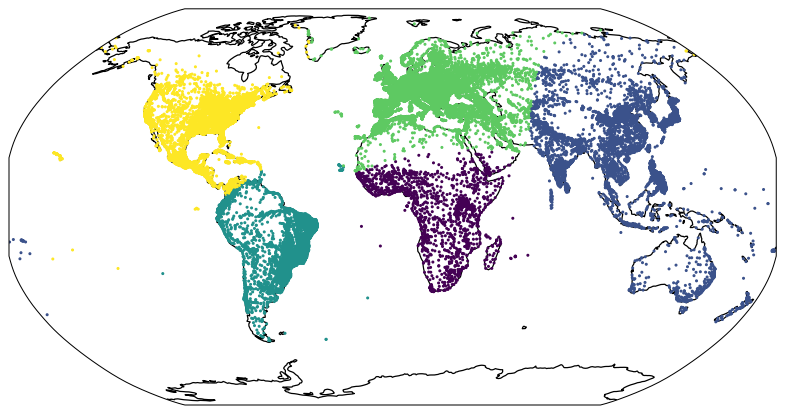
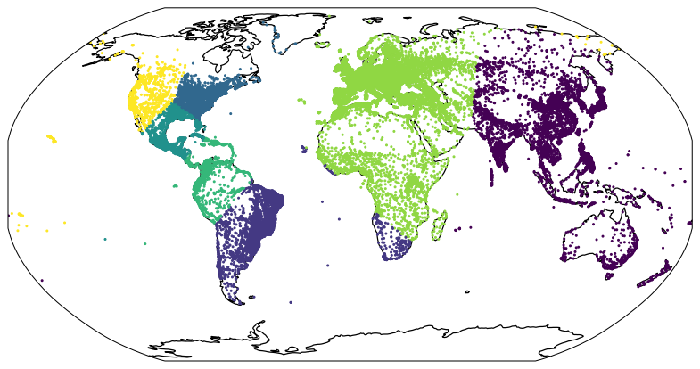
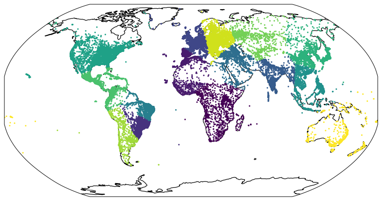
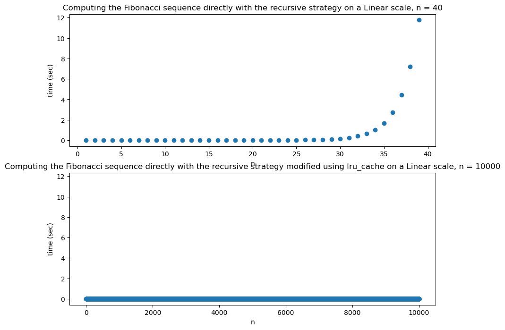
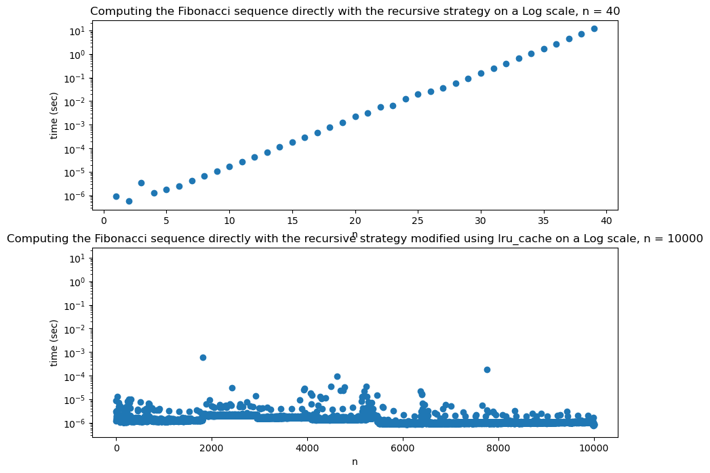
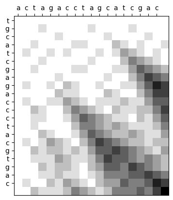
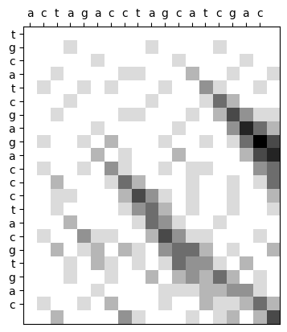
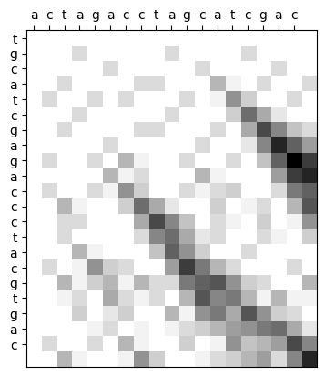

## BIS 634 01 / CB&B 634 01 Assignment 4

## Submitted By : Mahima Kaur 

## Exercise1

Suppose we have a neural network for predicting the time between hospital readmissions for a certain subset of patients. Such a network would depends on many parameters, but for simplicity, let's assume there's only two parameters: a and b. Each parameter lies between 0 and 1 and represents the weights of two "synapses" in our model.

Using the API at e.g.

http://ramcdougal.com/cgi-bin/error_function.py?a=0.4&b=0.2 (Links to an external site.)

one can find the prediction errors in arbitrary units of running our model with specified parameters (here a=0.4 and b=0.2, but you can change that).

Implement a two-dimensional version of the gradient descent algorithm to find optimal choices of a and b. (7 points) (Optimal here means values that minimize the error.) See slides 12 for a 1-dimensional implementation of the algorithm. Explain how you estimate the gradient given that you cannot directly compute the derivative (3 points), identify any numerical choices -- including but not limited to stopping criteria -- you made (3 points), and justify why you think they were reasonable choices (3 points).

It so happens that this error function has a local minimum and a global minimum. Find both locations (i.e. a, b values) querying the API as needed (5 points) and identify which corresponds to which (2 point). Briefly discuss how you would have tested for local vs global minima if you had not known how many minima there were. (2 points)

Important: a key part of this problem is the implementation of the algorithm; do not use a Python library for gradient descent or copy gradient descent code from a website.

(Disclaimer: the API function is not actually testing a neural network.)

(Hint: remember the gradient is just a vector of 1D derivatives.)

Note: Please be kind to my server. Do not systematically sweep through the parameter space. Using gradient descent will only require a moderate number of queries.

Note: Explicitly specify a User-Agent header or you'll get a 406 error; i.e. do something like:
>>> import requests
>>> a = 0.4
>>> b = 0.2
>>> float(requests.get(f"http://ramcdougal.com/cgi-bin/error_function.py?a={a}&b={b}", headers={"User-Agent": "MyScript"}).text)
1.294915
## Response


```python
## Importing relevant libraries 

import requests
import numpy as np
import pandas as pd
from numpy.linalg import norm
```

#### Using the APIs to find the prediction errors in arbitrary units


```python
def f(a,b):

    parameters = {
        'a':a,
        'b':b
    }
    headers = {
        "User-Agent": "MyScript"
    }
    url = "http://ramcdougal.com/cgi-bin/error_function.py"
    result = requests.get(url,params = parameters,headers=headers)
    return float(result.text)
```


```python
f(0.4, 0.2)
```


    1.294915


#### Function for derivative of f(a,b) with respect to a


```python
def derivativeA(a, b, h):
    return (f(a + h,b) - f(a,b))/h
```

#### Function for derivative of f(a,b) with respect to b


```python
def DerivativeB(a, b, h):
    return (f(a,b + h) - f(a,b))/h
```

#### 2D Vector containing the derivative of both A and B


```python
def finalderivative(a, b, h):
    return np.array([derivativeA(a, b, h), DerivativeB(a, b, h)]) 
```

#### Two-dimensional version of the gradient descent algorithm to find optimal choices of a and b.


```python
def gradient_descent(init_step, alpha, h = 1e-4, tolerance = 1e-8):
    previous_step_size = init_step - 10 * tolerance
    step = init_step
     
    #values for the gradient descent algorithm 
    step_a = []
    step_b = []
    end_result = []
    n_iter = 0
    max_iter = 1000
    while norm(step - previous_step_size) > tolerance and n_iter < max_iter :
        previous_step_size = step
        step = step - alpha * finalderivative(step[0], step[1], h)
        step_a.append(step[0])
        step_b.append(step[1])
        end_result.append(f(step[0], step[1]))
        n_iter+=1
        
    print (f"The minimum value {end_result[-1]} occurs at :")
    print (f"a = {step_a[-1]}, b = {step_b[-1]}.")
```

#### Examples


```python
gradient_descent(np.array([0.001, 0.999]), 0.1)
```

    The minimum value 1.100000005 occurs at :
    a = 0.21595000000038012, b = 0.6889500399996086.


```python
gradient_descent(np.array([0.999, 0.001]), 0.1)
```

    The minimum value 1.000000015 occurs at :
    a = 0.7119500099997124, b = 0.1689500000000278.


```python
gradient_descent(np.array([0.09, 0.05]), 0.1)
```

    The minimum value 1.100000005 occurs at :
    a = 0.21595000000015233, b = 0.6889499600005788.


```python
gradient_descent(np.array([0.05, 0.09]), 0.1)
```

    The minimum value 1.100000005 occurs at :
    a = 0.2159499999995262, b = 0.6889499599998726.


#### Gradient Descent is an optimization algorithm to find the minimum of a function. We start with a random point on the function and move in the negative direction of the gradient of the function to reach the local/global minima.

#### Qa. Explain how you estimate the gradient given that you cannot directly compute the derivative? 
Ans.  I used the definition of derivative f'(x) = f(x + h) - f(x)/h and partial derivative function to estimate the gradient function. The parameter value (h) was set to be small. 

Reference: https://www.khanacademy.org/math/multivariable-calculus/multivariable-derivatives/partial-derivative-and-gradient-articles/a/the-gradient and the cheatsheet provided. 


#### Qb. Identify any numerical choices -- including but not limited to stopping criteria -- you made (3 points), and justify why you think they were reasonable choices (3 points).

Ans. Learning Rate: It determines how fast or slow we will move towards the optimal weights. If the learning rate is very large we will skip the optimal solution. If it is too small we will need too many iterations to converge to the best values.The obvious way to find a desirable or optimal learning rate is through trial and error. For the gradient descent the default learning rate is 0.01 or 0.1. Therefore, I have used 0.01 as the alpha. 

Stopping Criteria: I have set the max iteration to 1000. It makes the algorithm to stop iterating and return the result before max_iter is reached if the vector update in the current iteration is less than or equal to tolerance. 


#### Qc. Identify which corresponds to which (2 point). Briefly discuss how you would have tested for local vs global minima if you had not known how many minima there were. (2 points)

Ans. In a gradient descent model the smallest value is global minimum while other points are local minimum. Trying different combinations of the value while keeping the other parameters same would help in identifying the local vs global minima. Aso, gradient descent is able to find local minima most of the time and not global minima because the gradient does not point in the direction of the steepest descent. Current techniques to find global minima either require extremely high iteration counts or a large number of random restarts for good performance.The global minima is 1.000000015 which occurs at : a = 0.7119500099997124, b = 0.1689500000000278 while the local minima is 1.100000005 which occurs at : a = 0.21595000000038012, b = 0.6889500399996086 or at a = 0.2159499999995262, b = 0.6889499599998726.

## Exercise2

In this exercise, we'll look at the distribution of cities across the planet. The same approach would work for disease outbreaks. Begin by downloading the basic (free) data set from https://simplemaps.com/data/world-cities (Links to an external site.) (click the white download button); this data is licensed CC BY 4.0. We will ignore everything except the locations of the cities, which are identified by 'lng' (longitude) and 'lat' (latitude).

Note: distance between two points on Earth is not proportional to the square root of the sum of the squares of the differences in coordinates because (1) latitude and longitude have different ranges, and (2) the Earth is round. Instead of using Euclidean distance, use the Haversine formula; a Python implementation can be found in the accepted answer to:

https://stackoverflow.com/questions/4913349/haversine-formula-in-python-bearing-and-distance-between-two-gps-points

(Feel free to reuse this Python Haversine function verbatim.)

(If you need exact distances across a planetary scale, you would want to use a metric that takes into account the ellipsoid nature of the planet, but treating it as a sphere suffices for our purposes.)

As briefly introduced in slides13, k-means is an algorithm for automatically identifying clusters in data. Lloyd's algorithm (there are others) for k-means is simple: for a given k, pick k points at pseudo-random from your data set (this is called the Forgy method for initialization, there are other other strategies). These will be "seeds" for forming k clusters. Assign each data point to a cluster based on whichever seed point is closest. Iterate, using the centroid of each cluster as the seeds for the next round of point assignments. Repeat until convergence. (Feel free to Google or ask questions if you need clarification on the algorithm.)

Modify the k-means code (or write your own) from slides8 to use the Haversine metric and work with our dataset (5 points). Note: since this algorithm uses (pseudo)randomness, you'll have to run it multiple times to get a sense of expected runtime. Visualize your results with a color-coded scatter plot (5 points); be sure to use an appropriate map projection (i.e. do not simply make x=longitude and y=latitude; 5 points). Use this algorithm to cluster the cities data for k=5, 7, and 15. Run it several times to get a sense of the variation of clusters for each k (share your plots) (5 points); comment briefly on the diversity of results for each k. (5 points)

As a comparison, here is a result I got running with k = 5:

Feel free to do the map projections in any way that is correct, but one option is to use cartopy (instructions here.). Here's an example of plotting the locations of three universities:
import cartopy.crs as ccrs
import matplotlib.pyplot as plt
fig = plt.figure()
ax = fig.add_subplot(1, 1, 1, projection=ccrs.Robinson())
yale = [41.3083, -72.9279]
oxford = [51.7520, -1.2577]
melbourne = [-37.8136, 144.9631]
lats = [school[0] for school in [yale, oxford, melbourne]]
lngs = [school[1] for school in [yale, oxford, melbourne]]
ax.coastlines()
ax.plot(lngs, lats, "o", color="red", transform=ccrs.PlateCarree())
ax.set_extent([-180, 180, -90, 90], crs=ccrs.PlateCarree())
plt.show()
Extra credit (5 points): speedup your code using the multiprocessing module and demonstrate the speedup and discuss how it scales.

## Response 


```python
# importing libraries 
import pandas as pd 
import random
import numpy as np
from time import perf_counter
import matplotlib.pyplot as plt
import random
import warnings
warnings.filterwarnings("ignore")
```


```python
import cartopy.crs as ccrs
```


```python
##Loading the dataset 
data = pd.read_csv("/Users/mahimakaur/Desktop/worldcities.csv")
```


```python
# reference: https://stackoverflow.com/questions/4913349/haversine-formula-in-python-bearing-and-distance-between-two-gps-points
# Haversine formula
from math import radians, cos, sin, asin, sqrt

def haversine(lng1, lat1, lng2, lat2):
    """
    Calculate the great circle distance in kilometers between two points 
    on the earth (specified in decimal degrees)
    """
    # convert decimal degrees to radians 
    lng1, lat1, lng2, lat2 = map(radians, [lng1, lat1, lng2, lat2])

    # haversine formula 
    dlng = lng2 - lng1 
    dlat = lat2 - lat1 
    a = sin(dlat/2)**2 + cos(lat1) * cos(lat2) * sin(dlng/2)**2
    c = 2 * asin(sqrt(a)) 
    r = 6371 # Radius of earth in kilometers. Use 3956 for miles. Determines return value units.
    return c * r
```


```python
def assign_cluster_ids(pts,centers):
    pts = list(pts)
    cluster_ids = []
    for pt in pts:
            min_cluster = -1
            min_dist = float('inf')
            for i, center in enumerate(centers):
                dist = haversine(pt[0],pt[1],center[0],center[1])
                if dist < min_dist:
                    min_cluster = i
                    min_dist = dist
            cluster_ids.append(min_cluster)
    return cluster_ids
```

#### Creating a funtion to find kmeans


```python
def kmeans(df,k = 5):
    data = df.copy()
    pts = [np.array(pt) for pt in zip(data['lng'],data['lat'])]
    centers = random.sample(pts, k)
    old_cluster_ids, cluster_ids = None, [] 
    while cluster_ids != old_cluster_ids:
        old_cluster_ids = list(cluster_ids)
        cluster_ids = []
        for pt in pts:
            min_cluster = -1
            min_dist = float('inf')
            for i, center in enumerate(centers):
                dist = haversine(pt[0],pt[1],center[0],center[1])
                if dist < min_dist:
                    min_cluster = i
                    min_dist = dist
            cluster_ids.append(min_cluster)
        data['cluster'] = cluster_ids
        cluster_pts = [[pt for pt, cluster in zip(pts, cluster_ids) if cluster == match]
        for match in range(k)]
        centers = [sum(pts)/len(pts) for pts in cluster_pts]
    return data
```

#### A funtion to create the map plot


```python
def plot_figure(data):
    fig = plt.figure(figsize=(11, 11), dpi=90)
    ax = fig.add_subplot(1, 1, 1, projection=ccrs.Robinson())
    ax.coastlines()
    ax.scatter(data['lng'], data['lat'], s = 2,c = list(data['cluster']), transform=ccrs.PlateCarree())
    ax.set_extent([-180, 180, -90, 90], crs=ccrs.PlateCarree())
```

#### A function to check the runtime for k means clustering


```python
def runtime(k):
    time = []
    time_start = perf_counter()
    df = kmeans(data,k)
    time_end = perf_counter()
    time.append(time_end - time_start)
    print (f"The runtime when k = {k} is {time[0]} second.")
```

#### Map Plot and Runtime for k = 5, 7 and 15


```python
kmeansdata_5 = kmeans(data,5)
```


```python
kmeansdata_7 = kmeans(data,7)
```


```python
kmeansdata_15 = kmeans(data,15)
```


```python
plot_figure(kmeansdata_5)
```


    

    


```python
plot_figure(kmeansdata_7)
```


    

    


```python
plot_figure(kmeansdata_15)
```


    

    


```python
runtime(5)
```

    The runtime when k = 5 is 7.6024640000000545 second.


```python
runtime(7)
```

    The runtime when k = 7 is 8.207865458000015 second.


```python
runtime(15)
```

    The runtime when k = 15 is 25.544607874999997 second.


```python
plot_figure(kmeansdata_5)
```


    

    


```python
plot_figure(kmeansdata_7)
```


    

    


```python
plot_figure(kmeansdata_15)
```


    

    


```python
runtime(5)
```

    The runtime when k = 5 is 4.809692083000073 second.


```python
runtime(7)
```

    The runtime when k = 7 is 8.561810665999928 second.


```python
runtime(15)
```

    The runtime when k = 15 is 19.55858304200001 second.


```python
plot_figure(kmeansdata_5)
```


    

    


```python
plot_figure(kmeansdata_7)
```


    

    


```python
plot_figure(kmeansdata_15)
```


    

    


```python
runtime(5)
```

    The runtime when k = 5 is 3.554565792000176 second.


```python
runtime(7)
```

    The runtime when k = 7 is 5.1829874580000705 second.


```python
runtime(15)
```

    The runtime when k = 15 is 45.04033758399987 second.


#### Q. Comment briefly on the diversity of results for each k.

Runtime : Runtime tends to change in a wide range. For k = 5 , it took between 3.5 to 7 seconds to run. For k = 7, it took between 5 to 8 seconds. For k = 15, it took between 19 to 45 seconds. With k = 15 having the higher runtime. 

Clusters are varied and different for k = 5,7 and 15.
When k = 5 : The two adjacent continents (e.g. Asia and Australia, North America and South America, Europe and Africa)
always combine together. Somehwhate same pattern was seen when k = 7.  The smaller the k the clusters formed are larger, one of the cluster covered almost two continents. There is no obvious pattern seen when k = 15 when compared with plots from k = 5 and k = 7 and the clusters are diverse when k = 15. There is most variation in the clusters when k = 15. I guess more clusters are formed when k is larger. Example : South America was one cluster when k = 5 , two clusters when k = 7 and four clusters when k = 15. 

## Exercise3

In class, we discussed two different strategies for computing the Fibonacci sequence: directly with the recursive strategy, and recursive but modified using lru_cache. Implement both (yes, I know, I gave you implementations on the slides, but try to do this exercise from scratch as much as possible) (5 points), time them as functions of n (5 points), and display this in the way you think is best (5 points). Discuss your choices (e.g. why those n and why you're displaying it that way; 5 points) and your results (5 points).

## Response 


```python
from functools import lru_cache
import time 
import pandas as pd
import tqdm
import matplotlib.pyplot as plt
import warnings
warnings.filterwarnings("ignore")
```

#### Computing Fibonacci Sequence through Recursive Strategy


```python
def fibo(n):
    if(n==1 or n== 2):
        return(1)
    return fibo(n-1) + fibo(n-2)
```

#### Computing Fibonacci Sequence using lru_cache and recursive strategy


```python
@lru_cache
def fibo_lru(n):
    if(n==1 or n== 2):
        return 1
    return fibo_lru(n-1) + fibo_lru(n-2)
```


```python
def timing_perf_counter(f, val_max):
    times = {}
    for i in range(1, val_max):
        start = time.perf_counter()
        val = f(i)
        stop = time.perf_counter()
        times[i]= stop - start
    return times
```


```python
fibo_time = timing_perf_counter(fibo, 40)
```


```python
fibo_vals  = sorted(fibo_time.items())
x,y = zip(*fibo_vals)
```


```python
fibo_lru_time = timing_perf_counter(fibo_lru,10000)
```


```python
fibo_lru_vals = sorted(fibo_lru_time.items())
z,c = zip(*fibo_lru_vals)
```


```python
fig,axs = plt.subplots(2,1, figsize = (10,8), sharey = True)

plt.subplot(2,1,1)
plt.scatter(x, y)
plt.yscale('linear')
plt.xscale('linear') 
plt.title('Computing the Fibonacci sequence directly with the recursive strategy on a Linear scale, n = 40')
plt.ylabel('time (sec)')
plt.xlabel("n")
                       
plt.subplot(2,1,2)
plt.scatter(z, c)
plt.yscale('linear')
plt.xscale('linear')
plt.title('Computing the Fibonacci sequence directly with the recursive strategy modified using lru_cache on a Linear scale, n = 10000')
plt.ylabel('time (sec)')
plt.xlabel("n")
                       
plt.show()
```


    

    


```python
fig,axs = plt.subplots(2,1, figsize = (10,8), sharey = True)

plt.subplot(2,1,1)
plt.scatter(x, y)
plt.yscale('log')  
plt.title('Computing the Fibonacci sequence directly with the recursive strategy on a Log scale, n = 40')
plt.ylabel('time (sec)')
plt.xlabel("n")
                       
plt.subplot(2,1,2)
plt.scatter(z, c)
plt.yscale('log')
plt.xscale('linear')
plt.title('Computing the Fibonacci sequence directly with the recursive strategy modified using lru_cache on a Log scale, n = 10000')
plt.ylabel('time (sec)')
plt.xlabel("n")
                       
plt.show()
```


    

    


#### The time complexity for a a recursive fibonacci sequence is in order of 1.6^n (as in the class slides). In the recursive finonacci sequence we calculate the same thing repeatedly and we may express time taken at N as T(n) = T(n-1) + T(n-2) + O(1). Using lru_cache we can cache values and then we calculate them once after which point the method looks up the value in the stored cache. It is type of memoization technique. Memoization involves caching the outcomes of a method call so that the subsequent calls with identical inputs don’t require recalculating the results from scratch.This results in almost negilgible time for even very large values of n (in case of 10000). In comparison the regular fibonacci function takes a lot longer to calculate for n = 50 than it does for n = 40. It took a long time to get the runtime for n > 40 through the Fibonacci naive implementation.  I plotted a linear scale scatter plot and a log-log scatter plot.The regular method quickly starts to grow i.e takes more time beyond 40. Even on a log-log graph the time complexity for lru_cache looks exponential on a log-log graph which validates the time complexity of 1.6^n. we can see from the graph that the time it takes is close to 0. As a result, we can conclude that lru_cache()  is more effiecient for large numbers.

## Exercise4

Implement a function that takes two strings and returns an optimal local alignment (6 points) and score (6 points) using the Smith-Waterman algorithm; insert "-" as needed to indicate a gap (this is part of the alignment points). Your function should also take and correctly use three keyword arguments with defaults as follows: match=1, gap_penalty=1, mismatch_penalty=1 (6 points). Here, that is a penalty of one will be applied to match scores for each missing or changed letter.
For example:

seq1, seq2, score = align('tgcatcgagaccctacgtgac', 'actagacctagcatcgac')

# there are several possible results, but one is:
# seq1 = agacccta-cgt-gac
# seq2 = aga-cctagcatcgac
# score = 8 (true for all results)

seq1, seq2, score = align('tgcatcgagaccctacgtgac', 'actagacctagcatcgac', gap_penalty=2)
# there is only one possibility: seq1 = seq2 = gcatcga, score=7

Test it, and explain how your tests show that your function works. Be sure to test other values of match, gap_penalty, and mismatch_penalty (7 points).

## Response 


```python
## Importing libraries 

import itertools
import numpy as np
import matplotlib.pyplot as plt
```

The basic steps for the Smith-Waterman algorithm include:

1. Initialization of a matrix.
2. Matrix Filling with the appropriate scores.
3. Trace back the sequences for a suitable alignment.

The algorithm has three parameters : match, gap_penalty and mismatch_penalty

#### Creating a function to initalize the scoring matrix


```python
def scoring_matrix(seq1, seq2, match, mismatch, gap_penalty):
    sequence = np.zeros((len(seq1) + 1, len(seq2) + 1), dtype = int)

    max_score = 0
    max_position = 0
    for i, j in itertools.product(range(1, sequence.shape[0]), range(1, sequence.shape[1])):

        if seq1[i - 1] == seq2[j - 1]:
            match_score = sequence[i - 1, j - 1] + match
       
        else:
            match_score = sequence[i - 1, j - 1] - mismatch
        
        delete = sequence[i - 1, j] - gap_penalty
        insert = sequence[i, j - 1] - gap_penalty
       
        score = max(match_score, delete, insert, 0)
        sequence[i, j] = score
       
        if score > max_score:
            max_score = score
            max_position = (i, j)
    print (sequence)
    return sequence, max_position
```

#### Creating a function to decide the next move when traceback and A function traceback() to get the optimal alignment of seq1 with seq2


```python
def nextmove(sequence, x, y):
    diagonal = sequence[x-1][y-1]
    up = sequence[x-1][y]
    left = sequence[x][y-1]
    if diagonal >= up and diagonal >= left:
        if diagonal != 0:
            return 1
        else: return 0
    elif up > diagonal and up >= left:
        if up != 0:
            return 2
        else: return 0
    elif left > diagonal and left > up:
        if left != 0:
            return 3
        else: return 0
    else:
        print("error")
        
        
def traceback(seq1, seq2, sequence, start_position):
    aligned_seq1 = []
    aligned_seq2 = []
    x, y = start_position
    move = nextmove(sequence, x, y)
    while move != 0:
        if move == 1:
            aligned_seq1.append(seq1[x-1])
            aligned_seq2.append(seq2[y-1])
            x = x - 1
            y = y - 1
        elif move == 2:
            aligned_seq1.append(seq1[x-1])
            aligned_seq2.append('-')
            x = x - 1
        else:
            aligned_seq1.append('-')
            aligned_seq2.append(seq2[y-1])
            y = y - 1

        move = nextmove(sequence, x, y)
    
    aligned_seq1.append(seq1[x - 1])
    aligned_seq2.append(seq2[y - 1])

    return ''.join(reversed(aligned_seq1)), ''.join(reversed(aligned_seq2))
```

#### Creating a function for smith_waterman algorithm 


```python
def smith_waterman(seq1, seq2, match, mismatch, gap_penalty):
    sequence, start_position = scoring_matrix(seq1, seq2, match, mismatch, gap_penalty)
    seq1_aligned, seq2_aligned = traceback(seq1, seq2, sequence, start_position)
    final_score = sequence[start_position[0]][start_position[1]]
    
    plt.xticks(range(len(seq2)), labels=seq2)
    plt.yticks(range(len(seq1)), labels=seq1)
    plt.imshow(sequence, interpolation='nearest',cmap='binary')
    plt.gca().xaxis.tick_top()
    plt.show()
    
    print ("aligned seq1 = ", seq1_aligned)
    print ("aligned seq2 = ", seq2_aligned)
    print ("Best Alignment Score is" , final_score)
```

#### Testing the above function where : seq1 = 'tgcatcgagaccctacgtgac' and seq2 = 'actagacctagcatcgac' 


```python
smith_waterman('tgcatcgagaccctacgtgac', 'actagacctagcatcgac', 1, 1, 1)
```

    [[0 0 0 0 0 0 0 0 0 0 0 0 0 0 0 0 0 0 0]
     [0 0 0 1 0 0 0 0 0 1 0 0 0 0 1 0 0 0 0]
     [0 0 0 0 0 1 0 0 0 0 0 1 0 0 0 0 1 0 0]
     [0 0 1 0 0 0 0 1 1 0 0 0 2 1 0 1 0 0 1]
     [0 1 0 0 1 0 1 0 0 0 1 0 1 3 2 1 0 1 0]
     [0 0 0 1 0 0 0 0 0 1 0 0 0 2 4 3 2 1 0]
     [0 0 1 0 0 0 0 1 1 0 0 0 1 1 3 5 4 3 2]
     [0 0 0 0 0 1 0 0 0 0 0 1 0 0 2 4 6 5 4]
     [0 1 0 0 1 0 2 1 0 0 1 0 0 1 1 3 5 7 6]
     [0 0 0 0 0 2 1 1 0 0 0 2 1 0 0 2 4 6 6]
     [0 1 0 0 1 1 3 2 1 0 1 1 1 2 1 1 3 5 5]
     [0 0 2 1 0 0 2 4 3 2 1 0 2 1 1 2 2 4 6]
     [0 0 1 1 0 0 1 3 5 4 3 2 1 1 0 2 1 3 5]
     [0 0 1 0 0 0 0 2 4 4 3 2 3 2 1 1 1 2 4]
     [0 0 0 2 1 0 0 1 3 5 4 3 2 2 3 2 1 1 3]
     [0 1 0 1 3 2 1 0 2 4 6 5 4 3 2 2 1 2 2]
     [0 0 2 1 2 2 1 2 1 3 5 5 6 5 4 3 2 1 3]
     [0 0 1 1 1 3 2 1 1 2 4 6 5 5 4 3 4 3 2]
     [0 0 0 2 1 2 2 1 0 2 3 5 5 4 6 5 4 3 2]
     [0 0 0 1 1 2 1 1 0 1 2 4 4 4 5 5 6 5 4]
     [0 1 0 0 2 1 3 2 1 0 2 3 3 5 4 4 5 7 6]
     [0 0 2 1 1 1 2 4 3 2 1 2 4 4 4 5 4 6 8]]


    

    


    aligned seq1 =  agacccta-cgt-gac
    aligned seq2 =  agacc-tagcatcgac
    Best Alignment Score is 8


#### Testing the above function where : seq1 = 'tgcatcgagaccctacgtgac' and seq2 = 'actagacctagcatcgac' and gap_penalty = 2


```python
smith_waterman('tgcatcgagaccctacgtgac', 'actagacctagcatcgac', 1, 1, 2)
```

    [[0 0 0 0 0 0 0 0 0 0 0 0 0 0 0 0 0 0 0]
     [0 0 0 1 0 0 0 0 0 1 0 0 0 0 1 0 0 0 0]
     [0 0 0 0 0 1 0 0 0 0 0 1 0 0 0 0 1 0 0]
     [0 0 1 0 0 0 0 1 1 0 0 0 2 0 0 1 0 0 1]
     [0 1 0 0 1 0 1 0 0 0 1 0 0 3 1 0 0 1 0]
     [0 0 0 1 0 0 0 0 0 1 0 0 0 1 4 2 0 0 0]
     [0 0 1 0 0 0 0 1 1 0 0 0 1 0 2 5 3 1 1]
     [0 0 0 0 0 1 0 0 0 0 0 1 0 0 0 3 6 4 2]
     [0 1 0 0 1 0 2 0 0 0 1 0 0 1 0 1 4 7 5]
     [0 0 0 0 0 2 0 1 0 0 0 2 0 0 0 0 2 5 6]
     [0 1 0 0 1 0 3 1 0 0 1 0 1 1 0 0 0 3 4]
     [0 0 2 0 0 0 1 4 2 0 0 0 1 0 0 1 0 1 4]
     [0 0 1 1 0 0 0 2 5 3 1 0 1 0 0 1 0 0 2]
     [0 0 1 0 0 0 0 1 3 4 2 0 1 0 0 1 0 0 1]
     [0 0 0 2 0 0 0 0 1 4 3 1 0 0 1 0 0 0 0]
     [0 1 0 0 3 1 1 0 0 2 5 3 1 1 0 0 0 1 0]
     [0 0 2 0 1 2 0 2 1 0 3 4 4 2 0 1 0 0 2]
     [0 0 0 1 0 2 1 0 1 0 1 4 3 3 1 0 2 0 0]
     [0 0 0 1 0 0 1 0 0 2 0 2 3 2 4 2 0 1 0]
     [0 0 0 0 0 1 0 0 0 0 1 1 1 2 2 3 3 1 0]
     [0 1 0 0 1 0 2 0 0 0 1 0 0 2 1 1 2 4 2]
     [0 0 2 0 0 0 0 3 1 0 0 0 1 0 1 2 0 2 5]]


    

    


    aligned seq1 =  gcatcga
    aligned seq2 =  gcatcga
    Best Alignment Score is 7


#### Testing the above function where : seq1 = 'tgcatcgagaccctacgtgac' and seq2 = 'actagacctagcatcgac' , and and match, gap_penalty, and mismatch_penalty = (3,3,3)


```python
smith_waterman('tgcatcgagaccctacgtgac', 'actagacctagcatcgac', 3, 3, 3)
```

    [[ 0  0  0  0  0  0  0  0  0  0  0  0  0  0  0  0  0  0  0]
     [ 0  0  0  3  0  0  0  0  0  3  0  0  0  0  3  0  0  0  0]
     [ 0  0  0  0  0  3  0  0  0  0  0  3  0  0  0  0  3  0  0]
     [ 0  0  3  0  0  0  0  3  3  0  0  0  6  3  0  3  0  0  3]
     [ 0  3  0  0  3  0  3  0  0  0  3  0  3  9  6  3  0  3  0]
     [ 0  0  0  3  0  0  0  0  0  3  0  0  0  6 12  9  6  3  0]
     [ 0  0  3  0  0  0  0  3  3  0  0  0  3  3  9 15 12  9  6]
     [ 0  0  0  0  0  3  0  0  0  0  0  3  0  0  6 12 18 15 12]
     [ 0  3  0  0  3  0  6  3  0  0  3  0  0  3  3  9 15 21 18]
     [ 0  0  0  0  0  6  3  3  0  0  0  6  3  0  0  6 12 18 18]
     [ 0  3  0  0  3  3  9  6  3  0  3  3  3  6  3  3  9 15 15]
     [ 0  0  6  3  0  0  6 12  9  6  3  0  6  3  3  6  6 12 18]
     [ 0  0  3  3  0  0  3  9 15 12  9  6  3  3  0  6  3  9 15]
     [ 0  0  3  0  0  0  0  6 12 12  9  6  9  6  3  3  3  6 12]
     [ 0  0  0  6  3  0  0  3  9 15 12  9  6  6  9  6  3  3  9]
     [ 0  3  0  3  9  6  3  0  6 12 18 15 12  9  6  6  3  6  6]
     [ 0  0  6  3  6  6  3  6  3  9 15 15 18 15 12  9  6  3  9]
     [ 0  0  3  3  3  9  6  3  3  6 12 18 15 15 12  9 12  9  6]
     [ 0  0  0  6  3  6  6  3  0  6  9 15 15 12 18 15 12  9  6]
     [ 0  0  0  3  3  6  3  3  0  3  6 12 12 12 15 15 18 15 12]
     [ 0  3  0  0  6  3  9  6  3  0  6  9  9 15 12 12 15 21 18]
     [ 0  0  6  3  3  3  6 12  9  6  3  6 12 12 12 15 12 18 24]]


    

    


    aligned seq1 =  agacccta-cgt-gac
    aligned seq2 =  agacc-tagcatcgac
    Best Alignment Score is 24


#### Testing the above function where : seq1 = 'tgcatcgagaccctacgtgac' and seq2 = 'actagacctagcatcgac' , and and match, gap_penalty, and mismatch_penalty = (3,3,5)


```python
smith_waterman('tgcatcgagaccctacgtgac', 'actagacctagcatcgac', 3, 3, 5)
```

    [[ 0  0  0  0  0  0  0  0  0  0  0  0  0  0  0  0  0  0  0]
     [ 0  0  0  3  0  0  0  0  0  3  0  0  0  0  3  0  0  0  0]
     [ 0  0  0  0  0  3  0  0  0  0  0  3  0  0  0  0  3  0  0]
     [ 0  0  3  0  0  0  0  3  3  0  0  0  6  1  0  3  0  0  3]
     [ 0  3  0  0  3  0  3  0  0  0  3  0  1  9  4  0  0  3  0]
     [ 0  0  0  3  0  0  0  0  0  3  0  0  0  4 12  7  2  0  0]
     [ 0  0  3  0  0  0  0  3  3  0  0  0  3  0  7 15 10  5  3]
     [ 0  0  0  0  0  3  0  0  0  0  0  3  0  0  2 10 18 13  8]
     [ 0  3  0  0  3  0  6  1  0  0  3  0  0  3  0  5 13 21 16]
     [ 0  0  0  0  0  6  1  3  0  0  0  6  1  0  0  0  8 16 18]
     [ 0  3  0  0  3  1  9  4  0  0  3  1  3  4  0  0  3 11 13]
     [ 0  0  6  1  0  0  4 12  7  2  0  0  4  0  1  3  0  6 14]
     [ 0  0  3  3  0  0  0  7 15 10  5  0  3  1  0  4  0  1  9]
     [ 0  0  3  0  0  0  0  3 10 12  7  2  3  0  0  3  1  0  4]
     [ 0  0  0  6  1  0  0  0  5 13  9  4  0  0  3  0  0  0  0]
     [ 0  3  0  1  9  4  3  0  0  8 16 11  6  3  0  0  0  3  0]
     [ 0  0  6  1  4  6  1  6  3  3 11 13 14  9  4  3  0  0  6]
     [ 0  0  1  3  0  7  3  1  3  0  6 14 10 11  6  1  6  1  1]
     [ 0  0  0  4  0  2  4  0  0  6  1  9 11  7 14  9  4  3  0]
     [ 0  0  0  0  1  3  0  1  0  1  3  4  6  8  9 11 12  7  2]
     [ 0  3  0  0  3  0  6  1  0  0  4  0  1  9  5  6  8 15 10]
     [ 0  0  6  1  0  0  1  9  4  0  0  1  3  4  6  8  3 10 18]]


    

    


    aligned seq1 =  gcatcga
    aligned seq2 =  gcatcga
    Best Alignment Score is 21


#### Explaination : Smith–Waterman algorithm aligns two sequences by matches/mismatches (also known as substitutions), insertions, and deletions. Both insertions and deletions are the operations that introduce gaps, which are represented by dashes. The algorithm has four major steps : Determining the substitution matrix and the gap penalty scheme, Initializing the scoring matrix, Scoring and Traceback. In the algorithm the two sequences are arranged in a matrix form with A+1columns and B+1rows and the values in the first row and first column are set to zero. The second and crucial step of the algorithm is filling the entire matrix, so it is more important to know the neighbor values (diagonal, upper and left) of the current cell to fill each and every cell. The second and crucial step of the algorithm is filling the entire matrix. The final step for the appropriate alignment is trace backing, prior to that one needs to find out the maximum score obtained in the entire matrix for the local alignment of the sequences. From the scoring matrix, the S-W algorithm finds the highest score and traces back the path of the previous highest scores. This in essence determines the places in the query sequence in which to place dashes (insertions or deletions). The calculated path can then report to the user the sequence in the database that best matches the query string. The two alignments can be given with a score, for matching as +1 , mismatch as -1 and gap penalty as -1(the values can be varied), sum up all the individual scores and the alignment which has maximum score after this can be taken as the best alignment. 

Reference : https://vlab.amrita.edu/?sub=3&brch=274&sim=1433&cnt=1
