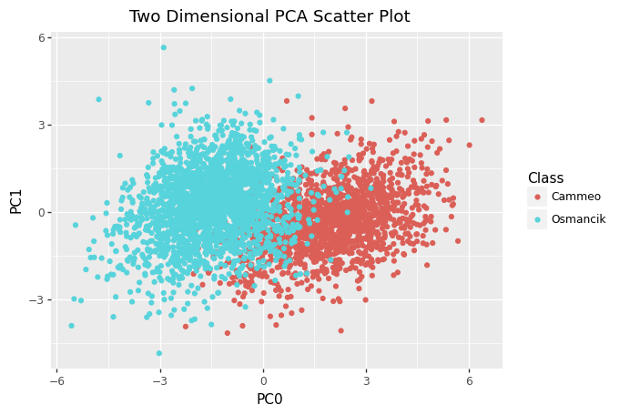
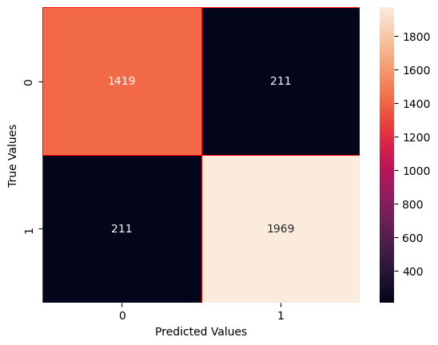
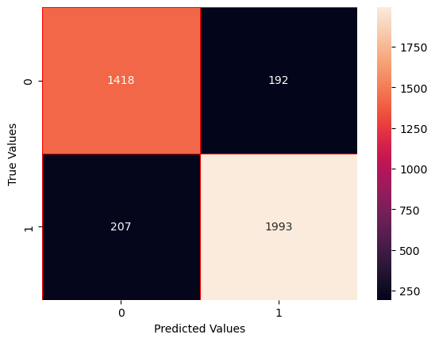
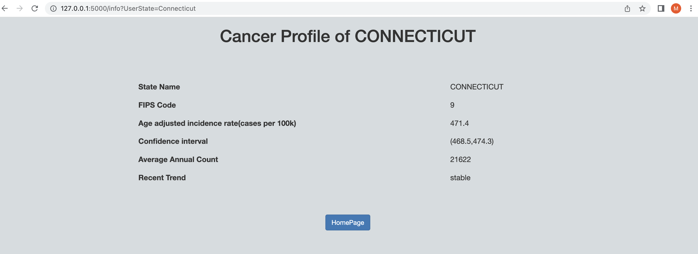

## BIS 634 01 / CB&B 634 01 Assignment 3

### Submitted By : Mahima Kaur 

## Exercise 1

Implement a two-dimensional k-nearest neighbors classifier (in particular, do not use sklearn for k-nearest neighbors here): given a list of (x, y; class) data, store this data in a quad-tree (14 points). Given a new (x, y) point and a value of k (the number of nearest neighbors to examine), it should be able to identify the most common class within those k nearest neighbors (14 points). You may assume distance will be measured using the traditional euclidean distance.

Cinar and Koklu (2019) used various machine learning strategies to predict the type of rice based on image analysis. In this exercise, we'll do something similar.

Begin by going to the journal page and downloading the rice dataset (there's a dataset button on the right). Note that you can load data directly from the excel file via:
data = pd.read_excel('Rice_Osmancik_Cammeo_Dataset.xlsx')
Normalize the seven quantitative columns to a mean of 0 and standard deviation 1. (3 points)

Reduce the data to two dimensions using PCA. You can do this with e.g.:
from sklearn import decomposition
pca = decomposition.PCA(n_components=2)
data_reduced = pca.fit_transform(data[my_cols])
pc0 = data_reduced[:, 0]
pc1 = data_reduced[:, 1]
That is, pc0 can be thought of as a vector of x-values, pc1 as a vector of y-values, and data["CLASS"] as a vector of the corresponding types of rice.

Plot this on a scatterplot, color-coding by type of rice. (3 points)

Comment on what the graph suggests about the effeciveness of using k-nearest neighbors on this 2-dimensional reduction of the data to predict the type of rice. (4 points)

Using a reasonable train-test split with your k-nearest neighbors implementation, give the confusion matrix for predicting the type of rice with k=1. (4 points) Repeat for k=5. (4 points)

Provide a brief interpretation of what the confusion matrix results mean. (4 points)

Recall: All normalization must be based on the training set mean and standard deviation, not on data including the test set. Once the pca reduction has been trained, you can apply it to test data via, e.g.
test_data_reduced = pca.transform(test_data[my_cols])
(Note: we use .fit_transform with the training data and .transform with the test data.)

Hints:

 - The quad tree can construct itself from all the data by dividing into children if there's enough points for that to be reasonable, each one of which constructs itself recursively. Only the leaf nodes need to keep track of the points; the parent trees can just ask for all_points recursively.It's theoretically possible that you could have repeated x,y points... don't get stuck in an infinite loop
- If you're looking for the k nearest neighbors, to get your initial circle, stop descending if the child tree you'd go into doesn't have k points. (Alternatively, move up a level if you don't have enough points; you can do this easily if each tree knows its _parent.)
 - I have a method contains(self, x, y) which determines if the box of my tree's bounds (xlo, ylo, xhi, yhi) contains the given (x,y) point... this is used by a _within_distance(self, x, y, d) that returns true or false depending on if the point is within a distance d of the box. This is used by a recursive leaves_within_distance function that finds all of the leaves (i.e. the ones with no children) within a given distance of a point.
 - Once I had found the distances within my tree, to find the indices of the smallest k distances, I used the code: min_i = np.argpartition(distances, k)[:k]
 - When I did this, I tested it by making a function that directly checked all points to find the k-nearest points (you can do this in about 4 lines of code) and used that to have a known truth to help debug/validate the quad-tree-based solution.

## Response


```python
import pandas as pd
import numpy as np
import seaborn as sns
import plotnine as p9
import matplotlib.pyplot as plt
from sklearn import decomposition
import warnings
warnings.filterwarnings("ignore")
from sklearn.model_selection import KFold, train_test_split
from sklearn.preprocessing import StandardScaler
from sklearn.neighbors import KNeighborsClassifier
from sklearn.metrics import classification_report, confusion_matrix, accuracy_score
```


```python
dataset = pd.read_excel('/Users/mahimakaur/desktop/Rice_Cammeo_Osmancik.xlsx')
```


```python
dataset.head()
```


<div>
<style scoped>
    .dataframe tbody tr th:only-of-type {
        vertical-align: middle;
    }

    .dataframe tbody tr th {
        vertical-align: top;
    }

    .dataframe thead th {
        text-align: right;
    }
</style>
<table border="1" class="dataframe">
  <thead>
    <tr style="text-align: right;">
      <th></th>
      <th>Area</th>
      <th>Perimeter</th>
      <th>Major_Axis_Length</th>
      <th>Minor_Axis_Length</th>
      <th>Eccentricity</th>
      <th>Convex_Area</th>
      <th>Extent</th>
      <th>Class</th>
    </tr>
  </thead>
  <tbody>
    <tr>
      <th>0</th>
      <td>15231</td>
      <td>525.578979</td>
      <td>229.749878</td>
      <td>85.093788</td>
      <td>0.928882</td>
      <td>15617</td>
      <td>0.572896</td>
      <td>Cammeo</td>
    </tr>
    <tr>
      <th>1</th>
      <td>14656</td>
      <td>494.311005</td>
      <td>206.020065</td>
      <td>91.730972</td>
      <td>0.895405</td>
      <td>15072</td>
      <td>0.615436</td>
      <td>Cammeo</td>
    </tr>
    <tr>
      <th>2</th>
      <td>14634</td>
      <td>501.122009</td>
      <td>214.106781</td>
      <td>87.768288</td>
      <td>0.912118</td>
      <td>14954</td>
      <td>0.693259</td>
      <td>Cammeo</td>
    </tr>
    <tr>
      <th>3</th>
      <td>13176</td>
      <td>458.342987</td>
      <td>193.337387</td>
      <td>87.448395</td>
      <td>0.891861</td>
      <td>13368</td>
      <td>0.640669</td>
      <td>Cammeo</td>
    </tr>
    <tr>
      <th>4</th>
      <td>14688</td>
      <td>507.166992</td>
      <td>211.743378</td>
      <td>89.312454</td>
      <td>0.906691</td>
      <td>15262</td>
      <td>0.646024</td>
      <td>Cammeo</td>
    </tr>
  </tbody>
</table>
</div>


```python
data.info()
```

    <class 'pandas.core.frame.DataFrame'>
    RangeIndex: 3810 entries, 0 to 3809
    Data columns (total 7 columns):
     #   Column             Non-Null Count  Dtype  
    ---  ------             --------------  -----  
     0   Area               3810 non-null   int64  
     1   Perimeter          3810 non-null   float64
     2   Major_Axis_Length  3810 non-null   float64
     3   Minor_Axis_Length  3810 non-null   float64
     4   Eccentricity       3810 non-null   float64
     5   Convex_Area        3810 non-null   int64  
     6   Extent             3810 non-null   float64
    dtypes: float64(5), int64(2)
    memory usage: 208.5 KB


```python
##Creating a dataset without the last column

data = dataset.iloc[:,0:7]
```


```python
##creating a dataset for the class column 

y = np.array(dataset.iloc[:,-1])
```


```python
## Standardizing the dataset 

std_data = (data - data.mean())/data.std()
```


```python
std_data.describe()
```


<div>
<style scoped>
    .dataframe tbody tr th:only-of-type {
        vertical-align: middle;
    }

    .dataframe tbody tr th {
        vertical-align: top;
    }

    .dataframe thead th {
        text-align: right;
    }
</style>
<table border="1" class="dataframe">
  <thead>
    <tr style="text-align: right;">
      <th></th>
      <th>Area</th>
      <th>Perimeter</th>
      <th>Major_Axis_Length</th>
      <th>Minor_Axis_Length</th>
      <th>Eccentricity</th>
      <th>Convex_Area</th>
      <th>Extent</th>
    </tr>
  </thead>
  <tbody>
    <tr>
      <th>count</th>
      <td>3.810000e+03</td>
      <td>3.810000e+03</td>
      <td>3.810000e+03</td>
      <td>3.810000e+03</td>
      <td>3.810000e+03</td>
      <td>3.810000e+03</td>
      <td>3.810000e+03</td>
    </tr>
    <tr>
      <th>mean</th>
      <td>-2.124285e-16</td>
      <td>-5.739940e-16</td>
      <td>-1.181324e-16</td>
      <td>-2.456478e-16</td>
      <td>9.097418e-16</td>
      <td>2.152259e-16</td>
      <td>-4.754435e-16</td>
    </tr>
    <tr>
      <th>std</th>
      <td>1.000000e+00</td>
      <td>1.000000e+00</td>
      <td>1.000000e+00</td>
      <td>1.000000e+00</td>
      <td>1.000000e+00</td>
      <td>1.000000e+00</td>
      <td>1.000000e+00</td>
    </tr>
    <tr>
      <th>min</th>
      <td>-2.953604e+00</td>
      <td>-2.672668e+00</td>
      <td>-2.493699e+00</td>
      <td>-4.674031e+00</td>
      <td>-5.266589e+00</td>
      <td>-2.942926e+00</td>
      <td>-2.130034e+00</td>
    </tr>
    <tr>
      <th>25%</th>
      <td>-7.488177e-01</td>
      <td>-7.892340e-01</td>
      <td>-8.265593e-01</td>
      <td>-6.251605e-01</td>
      <td>-6.950351e-01</td>
      <td>-7.463521e-01</td>
      <td>-8.165818e-01</td>
    </tr>
    <tr>
      <th>50%</th>
      <td>-1.421335e-01</td>
      <td>-1.513238e-01</td>
      <td>-1.699936e-01</td>
      <td>2.109949e-02</td>
      <td>1.046992e-01</td>
      <td>-1.384360e-01</td>
      <td>-2.145634e-01</td>
    </tr>
    <tr>
      <th>75%</th>
      <td>7.401849e-01</td>
      <td>8.271624e-01</td>
      <td>8.467241e-01</td>
      <td>6.684203e-01</td>
      <td>7.550077e-01</td>
      <td>7.493101e-01</td>
      <td>8.367238e-01</td>
    </tr>
    <tr>
      <th>max</th>
      <td>3.605050e+00</td>
      <td>2.646475e+00</td>
      <td>2.878973e+00</td>
      <td>3.704952e+00</td>
      <td>2.936761e+00</td>
      <td>3.458976e+00</td>
      <td>2.577922e+00</td>
    </tr>
  </tbody>
</table>
</div>


```python
## Reducing the data to two dimensions using PCA

PCA = decomposition.PCA(n_components=2)
data_reduced = PCA.fit_transform(std_data)
PC0 = data_reduced[:, 0]
PC1 = data_reduced[:, 1]
```


```python
data_reduced
```


    array([[ 3.81212784, -2.16504685],
           [ 2.47683257,  0.04529019],
           [ 2.63820924, -0.62153372],
           ...,
           [-0.43662669,  0.10358082],
           [-3.58746234, -0.37565233],
           [-2.55575212,  3.36079599]])


```python
pc0 = PC0.tolist()
pc1 = PC1.tolist()
pca = pd.DataFrame({'PC0': pc0,'PC1': pc1,'Class': dataset['Class']})
```


```python
print (
    p9.ggplot(data = pca, mapping = p9.aes(x='PC0', y='PC1'))
 + p9.geom_point(p9.aes(x = 'PC0', y = 'PC1', color = 'Class'))
 + p9.labs(title = "Two Dimensional PCA Scatter Plot")
)
```


    

    


    


#### Comment on what the graph suggests about the effeciveness of using k-nearest neighbors on this 2-dimensional reduction of the data to predict the type of rice. 

We can somewhat see two clusters in the graphs, but there is no clear demarcation of the two clusters. The k-nearest neighbors might not an effective method to classify the data points. The region from -2 to 1 on the x-axis shows some overlap between the points of class "Cammeo" or "Osmancik" which can lead to inaccurate prediction of the type of rice.  

### Implementation of the KNN algorithm and Quad Tree

Citations :
- https://katherinepully.com/quadtree-python/
- https://www.geeksforgeeks.org/quad-tree/

Contructing a quadtree from a two-dimensional area using the following steps:

1.Divide the current two dimensional space into four boxes.<br>
2.If a box contains one or more points in it, create a child object, storing in it the two dimensional space of the box. <br>
3.If a box does not contain any points, do not create a child for it. <br>
4.Recurse for each of the children.


```python
indices = [i for i in range(len(PC0))]
data_knn = np.array([PC0,PC1,indices])
```


```python
data_knn
```


    array([[ 3.81212784e+00,  2.47683257e+00,  2.63820924e+00, ...,
            -4.36626685e-01, -3.58746234e+00, -2.55575212e+00],
           [-2.16504685e+00,  4.52901938e-02, -6.21533719e-01, ...,
             1.03580824e-01, -3.75652326e-01,  3.36079599e+00],
           [ 0.00000000e+00,  1.00000000e+00,  2.00000000e+00, ...,
             3.80700000e+03,  3.80800000e+03,  3.80900000e+03]])


```python

class QTree:

    def __init__(self,bounding_box,data,height = 0,max_leaf_data = 3):
      
    
        self.xlo = min(bounding_box[0][0],bounding_box[1][0],bounding_box[2][0],bounding_box[3][0])
        self.xhi = max(bounding_box[0][0],bounding_box[1][0],bounding_box[2][0],bounding_box[3][0])
        self.ylo = min(bounding_box[0][1],bounding_box[1][1],bounding_box[2][1],bounding_box[3][1])
        self.yhi = max(bounding_box[0][1],bounding_box[1][1],bounding_box[2][1],bounding_box[3][1])
        self.leafNode = False
        self.height = height
        self.points = []
        self.add(data)
        self.numPoints = len(self.points[0])
        
        if(self.numPoints<= max_leaf_data):
            self.leafNode = True
            return
        

        self.x_median = np.median(self.points[0])
        self.y_median = np.median(self.points[1])

        
        bounding_box_ul = [bounding_box[0],(self.xlo,self.y_median),(self.x_median,self.yhi),(self.x_median,self.y_median)]
        bounding_box_lr = [(self.x_median,self.y_median),(self.x_median,self.ylo),(self.xhi,self.y_median),bounding_box[3]]
        bounding_box_ll = [(self.xlo,self.y_median),bounding_box[1],(self.x_median,self.y_median),(self.x_median,self.ylo)]
        bounding_box_ur = [(self.x_median,self.yhi),(self.x_median,self.y_median),bounding_box[2],(self.xhi,self.y_median)]
        self.URChild = QTree(bounding_box_ur,self.points,height = self.height + 1,max_leaf_data = max_leaf_data)
        self.LRChild = QTree(bounding_box_lr,self.points,height = self.height + 1,max_leaf_data = max_leaf_data)
        self.ULChild = QTree(bounding_box_ul,self.points,height = self.height + 1,max_leaf_data = max_leaf_data)
        self.LLChild = QTree(bounding_box_ll,self.points,height = self.height + 1,max_leaf_data = max_leaf_data)
        self.children = [self.ULChild,self.LLChild,self.URChild,self.LRChild]

        if(self.leafNode == False):
            del self.points

    def contains(self,x,y):    
        if((self.xlo <= x) and (x < self.xhi) and (self.ylo <= y) and (y < self.yhi)):
            return True
        return False

    def add(self,data):
        points_x = []
        points_y = []
        points_indices = []
        for i in range(0,len(data[0])):
            
            if(self.contains(data[0][i],data[1][i])):
                points_x.append(data[0][i])
                points_y.append(data[1][i])
                points_indices.append(data[2][i])
        
        self.points = np.array([points_x,points_y,points_indices],dtype = float)
    
    def getPoints(self):
        if(self.leafNode):
            return self.points
        
        return np.concatenate((self.ULChild.getPoints(),self.LLChild.getPoints(),
                               self.URChild.getPoints(),self.LRChild.getPoints()),axis = 1)
    
    def Distance(self,x,y,xp,yp):
        return np.linalg.norm((x-xp,y-yp))
    
    def getHeight(self):
        if(self.leafNode):
            return self.height
        return max(self.ULChild.getHeight(),self.LLChild.getHeight(),self.URChild.getHeight(),
                   self.LRChild.getHeight())
        
        
    def BBox(self,d,x,y):
        if(self.contains(x,y)):
            return True
        if(x<=self.xlo):
            if(y<=self.ylo):
                d_first = self.Distance(x,y,self.xlo,self.ylo)
                if(d_first<=d):
                    return True
            elif(y>=self.yhi):
                d_first = self.Distance(x,y,self.xlo,self.yhi)
                if(d_first<=d):
                    return True
            else:
                d_first = self.Distance(x,y,self.xlo,y)
                if(d_first<=d):
                    return True

        elif(x>self.xhi):
            if(y<=self.ylo):
                d_first = self.Distance(x,y,self.xhi,self.ylo)
                if(d_first<=d):
                    return True
            elif(y>=self.yhi):
                d_first = self.Distance(x,y,self.xhi,self.yhi)
                if(d_first<=d):
                    return True
            else:
                d_first = self.Distance(x,y,self.xhi,y)
                if(d_first<=d):
                    return True

        else:
            if(y<=self.ylo):
                d_first = self.Distance(x,y,x,self.ylo)
                if(d_first<=d):
                    return True
            elif(y>=self.ylo):
                d_first = self.Distance(x,y,x,self.yhi)
                if(d_first<=d):
                    return True

        return False
    

    def within_distance(self,d,x,y):
        if(self.leafNode):
            if(self.BBox(d,x,y)):
                return self.points
            else:
                return np.array([[],[],[]])
        return np.concatenate((self.ULChild.within_distance(d,x,y),
                               self.LLChild.within_distance(d,x,y),self.URChild.within_distance(d,x,y),
                               self.LRChild.within_distance(d,x,y)),axis = 1)
    
    def get_data_in_range(self,k,x,y):
        if(self.leafNode):
            return self
       
        
        for child in self.children:
            if(child.contains(x,y)):
                if(child.numPoints>=k):
                    return child.get_data_in_range(k,x,y)
                else:
                    return self

```


```python
def getQuadTree(data_knn,max_leaf_data = 3):
    xlo = min(data_knn[0]) - 2
    xhi= max(data_knn[0]) + 2
    ylo = min(data_knn[1]) - 2
    yhi = max(data_knn[1]) + 2
    bounding_box = [(xlo,yhi),(xlo,ylo),(xhi,yhi),(xhi,ylo)]
    q1 = QTree(bounding_box,data_knn,height = 0,max_leaf_data=max_leaf_data)
    return q1
```

### Implementing k nearest neighbors using QuadTree

- Step 1 : Determine parameter k = number of nearest neighbors
- Step 2 : Calculate the distance between the query-instance and all the training samples (The most commonly used method to calculate distance is Euclidean)
- Step 3 : Sort the distance and determine the nearest neighbors based on the kth minimum distance 
- Step 4 : Gather the category Y of the nearest neighbors
- Step 5 : Use majority voting of the category of the nearest neighnors as the prediction value.


Reference : 
- https://serokell.io/blog/knn-algorithm-in-ml
- https://people.revoledu.com/kardi/tutorial/KNN/KNN_Numerical-example.html
-https://www.tutorialspoint.com/machine_learning_with_python/machine_learning_with_python_knn_algorithm_finding_nearest_neighbors.htm

numpy.argpartition() function is used to create a indirect partitioned copy of input array with its elements rearranged in such a way that the value of the element in k-th position is in the position it would be in a sorted array. All elements smaller than the k-th element are moved before this element and all equal or greater are moved behind it (https://www.geeksforgeeks.org/numpy-argpartition-in-python/)


```python
def knn_quad(k,x,y,quadtree):
    BoundingBox = quadtree.get_data_in_range(k,x,y)
    points =  BoundingBox.getPoints()
    Euclideandistance = []
   
    for i in range(len(points[0])):
        dist = BoundingBox.Distance(x,y,points[0][i],points[1][i])
        Euclideandistance.append(dist)
    k_smallest_indices = np.argpartition(Euclideandistance, k-1)[:k]
   
  
    kth_dist = Euclideandistance[k_smallest_indices[-1]]
    points2 = quadtree.within_distance(kth_dist,x,y)
    Euclideandistance2 = []
    
    for j in range(len(points2[0])):
        dist = BoundingBox.Distance(x,y,points2[0][j],points2[1][j])
        Euclideandistance2.append(dist)
    k_smallest_indices_2 = np.argpartition(Euclideandistance2, k-1)[:k]
    value = [points2[:,i] for i in k_smallest_indices_2]
    return value
```


```python
def get_Indices(arr_points):
    indices_arr = []
    for i in range(len(arr_points)):
        indices_arr.append(int(arr_points[i][2]))
    return np.array(indices_arr,dtype = int)
```


```python
def knn_points(k,known_neighbors,x,y):
    test_neighbors = np.array([[x,y]])
    Euclideandistance = []

    for i in range(len(known_neighbors[0])):
        neighbors = known_neighbors[:,i]
      
        Euclideandistance.append(np.linalg.norm(test_neighbors - neighbors))
    
    
    k_smallest_indices = np.argpartition(Euclideandistance, k)[:k]
    return k_smallest_indices,Euclideandistance
```

#### Creating a function to get majority vote as For classification: A class label assigned to the majority of K Nearest Neighbors from the training dataset is considered as a predicted class for the new data point. 

Reference : https://www.analyticsvidhya.com/blog/2021/04/simple-understanding-and-implementation-of-knn-algorithm/


```python
def majority_vote(y):
    values,counts = np.unique(y,return_counts=True)
    indices = np.argmax(counts)
    return values[indices]
```

### Reasonable train-test split 

If the dataset is relatively small (n < 10,000), 70:30 would be a suitable choice.

However, for smaller datasets (n < 1,000), each observation is extremely valuable, and we can’t spare any for validation. In this case, k-fold cross-validation is a better choice than the holdout method. This method is computationally expensive. Yet it offers an effective model evaluation over a small dataset by training multiple models.

Reference : https://www.baeldung.com/cs/train-test-datasets-ratio


### Confusion Matrix when k = 1 or k = 5 using k-fold cross-validation

Cross Validation is the procedure which has a single parameter called k that refers to the number of groups that a given data sample is to be split into. The value for k is chosen such that each train/test group of data samples is large enough to be statistically representative of the broader dataset. The choice of k is usually 5 or 10, but there is no formal rule. Cross-validation gives the model an opportunity to test on multiple splits so we can get a better idea on how the model will perform on unseen data.


Cross Validation Citation : https://towardsdatascience.com/cross-validation-using-knn-6babb6e619c8

#### Confusion Matrix when k = 1 using k-fold cross-validation


```python
pca = decomposition.PCA(n_components=2)
kfold = KFold(10,shuffle = True,random_state = 1)
scaler = StandardScaler()
counter = 0

Value_Pred = []
Value_True = []
First_Value = []

for train,test in (kfold.split(data_knn[2])):
    X_train_raw = dataset.iloc[train,0:7]
    X_test_raw = dataset.iloc[test,0:7]
    scaler.fit(X_train_raw)
    X_train_std = scaler.transform(X_train_raw)
    X_test_std = scaler.transform(X_test_raw)
    train_data_reduced = pca.fit_transform(X_train_std)
    test_data_reduced = pca.transform(X_test_std)
    train_data = np.array([train_data_reduced[:,0],train_data_reduced[:,1],train])
    test_data = np.array([test_data_reduced[:,0],test_data_reduced[:,1],test])
    
    quad_train = getQuadTree(train_data)
    
    for i in test:
        
        value_1 = knn_quad(1,test_data[0,test_data[2] == i],test_data[1,test_data[2] == i],quad_train)
        First_Value.append(value_1)
        k_smallest_indices = get_Indices(value_1)
        y_points = y[k_smallest_indices]
        value_pred = majority_vote(y_points)
        value_true = y[i]
        Value_Pred.append(value_pred)
        Value_True.append(value_true)
        
    
    counter+=1
    
print("The confusion matrix when k =1 is:")
cm = confusion_matrix(Value_True,Value_Pred)
sns.heatmap(cm,annot=True, linewidths= 0.5, linecolor="red", fmt=".0f")  
plt.xlabel("Predicted Values")
plt.ylabel("True Values")
plt.show()
print("Classification Report:")
print(classification_report(Value_True,Value_Pred))
print("Accuracy Score:")
print(accuracy_score(Value_True,Value_Pred))
```

    The confusion matrix when k =1 is:


    

    


    Classification Report:
                  precision    recall  f1-score   support
    
          Cammeo       0.87      0.87      0.87      1630
        Osmancik       0.90      0.90      0.90      2180
    
        accuracy                           0.89      3810
       macro avg       0.89      0.89      0.89      3810
    weighted avg       0.89      0.89      0.89      3810
    
    Accuracy Score:
    0.8892388451443569


#### Confusion Matrix when k = 5 using k-fold cross-validation


```python
pca = decomposition.PCA(n_components=2)
kfold = KFold(10,shuffle = True,random_state = 1)
scaler = StandardScaler()
counter = 0

Value_Pred = []
Value_True = []
First_Value = []

for train_index,test_index in (kfold.split(data_knn[2])):
    X_train_raw = dataset.iloc[train_index,0:7]
    X_test_raw = dataset.iloc[test_index,0:7]
    scaler.fit(X_train_raw)
    X_train_std = scaler.transform(X_train_raw)
    X_test_std = scaler.transform(X_test_raw)
    train_data_reduced = pca.fit_transform(X_train_std)
    test_data_reduced = pca.transform(X_test_std)
    train_data = np.array([train_data_reduced[:,0],train_data_reduced[:,1],train])
    test_data = np.array([test_data_reduced[:,0],test_data_reduced[:,1],test])
    
    quad_train = getQuadTree(train_data)
    
    for i in test:
        
        value_5 = knn_quad(5,test_data[0,test_data[2] == i],test_data[1,test_data[2] == i],quad_train)
        First_Value.append(value_5)
        k_smallest_indices = get_Indices(value_5)
        y_points = y[k_smallest_indices]
        value_pred = majority_vote(y_points)
        value_true = y[i]
        Value_Pred.append(value_pred)
        Value_True.append(value_true)
        
    
    counter+=1
    
print("The confusion matrix when k = 5 is:")
cm = confusion_matrix(Value_True,Value_Pred)
sns.heatmap(cm,annot=True, linewidths= 0.5, linecolor="red", fmt=".0f")  
plt.xlabel("Predicted Values")
plt.ylabel("True Values")
plt.show()
print("Classification Report:")
print(classification_report(Value_True,Value_Pred))
print("Accuracy Score:")
print(accuracy_score(Value_True,Value_Pred))
```

    The confusion matrix when k = 5 is:


    

    


    Classification Report:
                  precision    recall  f1-score   support
    
          Cammeo       0.87      0.88      0.88      1610
        Osmancik       0.91      0.91      0.91      2200
    
        accuracy                           0.90      3810
       macro avg       0.89      0.89      0.89      3810
    weighted avg       0.90      0.90      0.90      3810
    
    Accuracy Score:
    0.8952755905511811


#### Brief interpretation of what the confusion matrix results mean.

Confusion Matrix is a method of summarizing a classification algorithm’s performance. It is simply a summarized table of the number of correct and incorrect predictions. Calculating a confusion matrix can give us a better idea about the miss-classified classes. It is a square matrix where the column reflects actual values and the row represents the model’s predicted value or vice versa. rows show actual values and columns indicate predicted values. 

- TP = A true positive is an outcome where the model correctly predicts the positive class.
- FP = The model predicted True and it is false.
- TN = The model predicted false and it is false.
- FN = The model predicted false and it is true.

When k = 1, the confusion matrix is (1419 211 211 1969). We can see that 1630 out of 1419 true classes were classified correctly i.e the model classified the type of rice as the data itself (TP). At the same time, 211 of them were placed incorrectly (FP), and 2180 out of 1969 false classes were classified correctly (TN), while 211 of them were misclassified (FN). The accuracy score of the model is 88.9%. 

When k = 5, the confusion matrix is (1418 192 207 1993). We can see that 1610 out of 1418 true classes were classified correctly i.e the model classified the type of rice as the data itself (TP). At the same time, 192 of them were placed incorrectly (FP), and 2200 out of 1993 false classes were classified correctly (TN), while 207 of them were misclassified (FN). The accuracy score of the model is 89.5%. 

Insights :
- As k increases the the accuracy of the model increases. 
- The precision of clasiifying Rice Type : Osmancik is more than Cammeo in both the models. 

#### Confusion matrix for predicting the type of rice with k=1 using train-test split - Using pre-existing library


```python
X = dataset.iloc[:,0:7]
```


```python
y = dataset['Class']
```


```python
scaler = StandardScaler()
scaler.fit(X_train)
X_train1 = scaler.transform(X_train)
X_test1 = scaler.transform(X_test)
```


```python
PCA = decomposition.PCA(n_components=2)
```


```python
X_train = PCA.fit_transform(X_train1)
```


```python
X_test = PCA.transform(X_test1)
```


```python
X_train, X_test, y_train, y_test = train_test_split(X, y, test_size = 0.20)
```


```python
classifier = KNeighborsClassifier(n_neighbors = 1)
classifier.fit(X_train, y_train)
```


    KNeighborsClassifier(n_neighbors=1)


```python
y_pred = classifier.predict(X_test)
```


```python
result = confusion_matrix(y_test, y_pred)
print("Confusion Matrix:")
print(result)
result1 = classification_report(y_test, y_pred)
print("Classification Report:",)
print (result1)
result2 = accuracy_score(y_test,y_pred)
print("Accuracy:",result2)
```

    Confusion Matrix:
    [[ 658  123]
     [ 113 1011]]
    Classification Report:
                  precision    recall  f1-score   support
    
          Cammeo       0.85      0.84      0.85       781
        Osmancik       0.89      0.90      0.90      1124
    
        accuracy                           0.88      1905
       macro avg       0.87      0.87      0.87      1905
    weighted avg       0.88      0.88      0.88      1905
    
    Accuracy: 0.8761154855643044


#### Confusion matrix for predicting the type of rice with k=5 using train-test split.


```python
X = dataset.iloc[:,0:7]
```


```python
y = np.array(dataset.iloc[:,-1])
```


```python
X_train, X_test, y_train, y_test = train_test_split(X, y, test_size = 0.20)
```


```python
scaler = StandardScaler()
scaler.fit(X_train)
X_train = scaler.transform(X_train)
X_test = scaler.transform(X_test)
```


```python
classifier = KNeighborsClassifier(n_neighbors = 5)
classifier.fit(X_train, y_train)
```


    KNeighborsClassifier()


```python
y_pred = classifier.predict(X_test)
```


```python
result = confusion_matrix(y_test, y_pred)
print("Confusion Matrix:")
print(result)
result1 = classification_report(y_test, y_pred)
print("Classification Report:",)
print (result1)
result2 = accuracy_score(y_test,y_pred)
print("Accuracy:",result2)
```

    Confusion Matrix:
    [[588  61]
     [ 68 807]]
    Classification Report:
                  precision    recall  f1-score   support
    
          Cammeo       0.90      0.91      0.90       649
        Osmancik       0.93      0.92      0.93       875
    
        accuracy                           0.92      1524
       macro avg       0.91      0.91      0.91      1524
    weighted avg       0.92      0.92      0.92      1524
    
    Accuracy: 0.9153543307086615


## Exercise 2

Describe your plan for your final project. I won't hold you to this, but it's good to have a plan. What's your data? (4 points) What analyses do you want to run and why are they interesting? (4 points) Which ones will be interactive, where the user can provide a parameter? (4 points; there must be at least one). What graphs will you make? (4 points) Describe how you want your website to work. (4 points) What do you see as your biggest challenge to completing this, and how do you expect to overcome this challenge? (5 points)

## Response 

Q1.What's your data?

I have decided to work on Diabetes Health Indictor BRFSS2015 dataset. It is a clean dataset of 253,680 survey responses to the CDC's BRFSS2015. This dataset has 21 feature variables.It is a subset of the original data. It was cleaned and consolidated dataset created from the BRFSS 2015 dataset already on Kaggle.The dataset was released by the CDC. The original dataset is provided by CDC from Kaggle public data repositories, named Behavioral Risk Factor Surveillance System The metadata of the dataset is available and licensed on Kaggle. Alex Teboul created the subset of the data and made it available on Kaggle for public use. The Dataset had 70692 rows and 22 columns.The variables include Diabetes status, HighBP, HighChol, CholCheck, BMI, Smoking status, Stroke Status, HeartDiseaseorAttack, PhysActivity, Fruits intake, Veggies intake,HvyAlcoholConsump, AnyHealthcare, NoDocbcCost, General health, Mental Health, Physical Activity, Difficulty in Walking, Gender, Income, Education Level and Age.     

Q2. What analyses do you want to run and why are they interesting? 

I plan to do descriptive and predictive analysis. Through the descriptve analysis we will able to find the which age group, gender, eductaion level etc is more prone to be diabetic. It is interesting to see such analysis as they will give an insight to develop targetted and evidence based intervention to lower the prevalence of diabetes. Additionally, I will do correlation analysis between diabetes and other variables in the dataset. I also aim to find the risk factors most predictive of diabetes  which will help to classify the people whether they will have diabetes or not. I am planning to perfrom logostic regression, decision tree and random forest algorithm. In the end, I will see which algorithm had the highest accuracy to classify the patients. This is quite interesting to see as it can help individuals modify the variable leading to an increase in the risk of being diabetic. 

Q3. Which ones will be interactive, where the user can provide a parameter?

The random forest algorithm will be interactive. The Web application build using flask would help the users the give the parameters and based on those attributes the model will predict whether the person can be diabetetic or not. Additionally, I plan to make some graphs intercative in the sense that it will show the text when clicked on certain points. 

Q4. What graphs will you make?

I plan to make the following graphs : <br>
a. Frequency distribution graphs of all the 22 variables.<br>
b. Stratified graphs of diabetic and non-dabetic individuals v/s all the other variables. <br>
c. Correlation Matrix. <br>
d. Confusion Matrix of the algorithms. <br>

Q5. Describe how you want your website to work.

Firstly the website will display some insights and prevalence of diabetes and other risk factors in US. There would be different tabs for each parameter such as Home, about the dataset,summary, descriptive analysis, and Predictive analysis. The Web application build using flask would help the users the give the parameters and based on those attributes the model will predict whether the person can be diabetetic or not. 

Q6. What do you see as your biggest challenge to completing this, and how do you expect to overcome this challenge?

The first challenge which I faced was to find a good dataset. Secondly, it was challenging to to come to a conlusion about the type of analysis to be done on the dataset and whether to remove any outliers from the dataset. Thirdly, it is my first project in which I would be deploying and building a Web application using flask.Even though it is a challenge right now, I think it would be a great skill to learn and I am excited about it!

I explored a lot of dataset to find the one which is interesting to me. I decided not to remove any outliers from the data as I find those points would be helpful in determining the predictors of diabetes.For the third challenge, I believe that the resources shared,hands-on experience in class regarding flask and the assignment question would be helpful to overcome the challenge. 

## Exercise 3

Go to https://statecancerprofiles.cancer.gov/incidencerates/index.php from the National Cancer Institute, search across the entire "area" of the United States at the "area type" resolution of By State, for all cancer sites, all races, all sexes, and all ages. Export the data (this will give you a CSV file).

Perform any necessary data cleaning (e.g. you'll probably want to get rid of the numbers in e.g. "Connecticut(7)" which refer to data source information as well as remove lines that aren't part of the table). Include the cleaned CSV file in your homework submission, and make sure your readme includes a citation of where the original data came from and how you changed the csv file. (5 points)

Using Flask, implement a server that provides three routes (5 points each):

@app.route("/")
the index/homepage written in HTML which prompts the user to enter a state and provides a button, which passes this information to /info
@app.route("/state/<string:name>")
an API that returns JSON-encoded data containing the name of the state and the age-adjusted incidence rate (cases per 100k)
NOTE: in this case, the name of the state is part of the URL itself; it is not passed in as a GET or POST argument 
@app.route("/info", methods=["GET"])
a web page that takes the name of the state as a GET argument and (1) if the state name is valid, displays the same information as the API above, but does so by putting it in an HTML page, or (2) displays an error if the state name is invalid (discuss what counts as valid and invalid in your readme; e.g. does capitalization matter?)
either way, include a link back to the homepage /
You've now completed most of this course, so you're now qualified to choose the next step. Take this exercise one step beyond that which is described above in a way that you think is appropriate, and discuss your extension in your readme. (e.g. you might show maps, or provide more data, or use CSS/JS to make the page prettier or more interactive, or use a database, or...) (5 points).

We will introduce Flask briefly at the beginning of the November 29th lecture. You might also want to check out CS50's lecture on Flask for more in-depth introduction: https://cs50.yale.edu/2022/fall/weeks/9/

If you wish, you may start with the code at https://github.com/ramcdougal/flask-example/ 

Since you're using GET, you'll want to use request.args.get("name") and not request.form.

## Response

Citation :
- National Cancer Institute. State Cancer Profile (2022). https://statecancerprofiles.cancer.gov/incidencerates/index.php. Accessed on 3rd December 2022. 
- Incidence data are provided by the National Program of Cancer RegistriesExternal Web Site Policy Cancer Surveillance System (NPCR-CSS), Centers for Disease Control and Prevention and by the National Cancer Institute's Surveillance, Epidemiology, and End Results (SEER)
- Population counts for denominators are based on Census populations as modified by NCI.
- Rates are calculated using SEER


```python
import pandas as pd
```


```python
##loading the raw dataset to do the cleaning

data = pd.read_csv("/Users/mahimakaur/Desktop/incd.csv", skiprows = 8)
```


```python
data
```


<div>
<style scoped>
    .dataframe tbody tr th:only-of-type {
        vertical-align: middle;
    }

    .dataframe tbody tr th {
        vertical-align: top;
    }

    .dataframe thead th {
        text-align: right;
    }
</style>
<table border="1" class="dataframe">
  <thead>
    <tr style="text-align: right;">
      <th></th>
      <th>State</th>
      <th>FIPS</th>
      <th>Age-Adjusted Incidence Rate([rate note]) - cases per 100,000</th>
      <th>Lower 95% Confidence Interval</th>
      <th>Upper 95% Confidence Interval</th>
      <th>CI*Rank([rank note])</th>
      <th>Lower CI (CI*Rank)</th>
      <th>Upper CI (CI*Rank)</th>
      <th>Average Annual Count</th>
      <th>Recent Trend</th>
      <th>Recent 5-Year Trend ([trend note]) in Incidence Rates</th>
      <th>Lower 95% Confidence Interval.1</th>
      <th>Upper 95% Confidence Interval.1</th>
    </tr>
  </thead>
  <tbody>
    <tr>
      <th>0</th>
      <td>US (SEER+NPCR)(1)</td>
      <td>0.0</td>
      <td>449.4</td>
      <td>449.1</td>
      <td>449.7</td>
      <td>N/A</td>
      <td>N/A</td>
      <td>N/A</td>
      <td>1728431</td>
      <td>stable</td>
      <td>-0.9</td>
      <td>-2.0</td>
      <td>0.2</td>
    </tr>
    <tr>
      <th>1</th>
      <td>Kentucky(7)</td>
      <td>21000.0</td>
      <td>516</td>
      <td>513.2</td>
      <td>518.8</td>
      <td>1</td>
      <td>1</td>
      <td>1</td>
      <td>27998</td>
      <td>falling</td>
      <td>-0.9</td>
      <td>-1.8</td>
      <td>-0.1</td>
    </tr>
    <tr>
      <th>2</th>
      <td>Iowa(7)</td>
      <td>19000.0</td>
      <td>490.7</td>
      <td>487.5</td>
      <td>494</td>
      <td>2</td>
      <td>2</td>
      <td>5</td>
      <td>19110</td>
      <td>rising</td>
      <td>0.8</td>
      <td>0.4</td>
      <td>1.2</td>
    </tr>
    <tr>
      <th>3</th>
      <td>New Jersey(7)</td>
      <td>34000.0</td>
      <td>488.9</td>
      <td>487</td>
      <td>490.8</td>
      <td>3</td>
      <td>2</td>
      <td>5</td>
      <td>53473</td>
      <td>falling</td>
      <td>-0.6</td>
      <td>-0.7</td>
      <td>-0.5</td>
    </tr>
    <tr>
      <th>4</th>
      <td>West Virginia(6)</td>
      <td>54000.0</td>
      <td>487.4</td>
      <td>483.3</td>
      <td>491.4</td>
      <td>4</td>
      <td>2</td>
      <td>8</td>
      <td>12216</td>
      <td>falling</td>
      <td>-0.2</td>
      <td>-0.4</td>
      <td>-0.1</td>
    </tr>
    <tr>
      <th>...</th>
      <td>...</td>
      <td>...</td>
      <td>...</td>
      <td>...</td>
      <td>...</td>
      <td>...</td>
      <td>...</td>
      <td>...</td>
      <td>...</td>
      <td>...</td>
      <td>...</td>
      <td>...</td>
      <td>...</td>
    </tr>
    <tr>
      <th>69</th>
      <td>8 Source: Incidence data provided by the SEER ...</td>
      <td>NaN</td>
      <td>NaN</td>
      <td>NaN</td>
      <td>NaN</td>
      <td>NaN</td>
      <td>NaN</td>
      <td>NaN</td>
      <td>NaN</td>
      <td>NaN</td>
      <td>NaN</td>
      <td>NaN</td>
      <td>NaN</td>
    </tr>
    <tr>
      <th>70</th>
      <td>Interpret Rankings provides insight into inter...</td>
      <td>NaN</td>
      <td>NaN</td>
      <td>NaN</td>
      <td>NaN</td>
      <td>NaN</td>
      <td>NaN</td>
      <td>NaN</td>
      <td>NaN</td>
      <td>NaN</td>
      <td>NaN</td>
      <td>NaN</td>
      <td>NaN</td>
    </tr>
    <tr>
      <th>71</th>
      <td>Data not available [http://statecancerprofiles...</td>
      <td>NaN</td>
      <td>NaN</td>
      <td>NaN</td>
      <td>NaN</td>
      <td>NaN</td>
      <td>NaN</td>
      <td>NaN</td>
      <td>NaN</td>
      <td>NaN</td>
      <td>NaN</td>
      <td>NaN</td>
      <td>NaN</td>
    </tr>
    <tr>
      <th>72</th>
      <td>Data for the United States does not include da...</td>
      <td>NaN</td>
      <td>NaN</td>
      <td>NaN</td>
      <td>NaN</td>
      <td>NaN</td>
      <td>NaN</td>
      <td>NaN</td>
      <td>NaN</td>
      <td>NaN</td>
      <td>NaN</td>
      <td>NaN</td>
      <td>NaN</td>
    </tr>
    <tr>
      <th>73</th>
      <td>Data for the United States does not include Pu...</td>
      <td>NaN</td>
      <td>NaN</td>
      <td>NaN</td>
      <td>NaN</td>
      <td>NaN</td>
      <td>NaN</td>
      <td>NaN</td>
      <td>NaN</td>
      <td>NaN</td>
      <td>NaN</td>
      <td>NaN</td>
      <td>NaN</td>
    </tr>
  </tbody>
</table>
<p>74 rows × 13 columns</p>
</div>


```python
data.head(5)
```


<div>
<style scoped>
    .dataframe tbody tr th:only-of-type {
        vertical-align: middle;
    }

    .dataframe tbody tr th {
        vertical-align: top;
    }

    .dataframe thead th {
        text-align: right;
    }
</style>
<table border="1" class="dataframe">
  <thead>
    <tr style="text-align: right;">
      <th></th>
      <th>State</th>
      <th>FIPS</th>
      <th>Age-Adjusted Incidence Rate([rate note]) - cases per 100,000</th>
      <th>Lower 95% Confidence Interval</th>
      <th>Upper 95% Confidence Interval</th>
      <th>CI*Rank([rank note])</th>
      <th>Lower CI (CI*Rank)</th>
      <th>Upper CI (CI*Rank)</th>
      <th>Average Annual Count</th>
      <th>Recent Trend</th>
      <th>Recent 5-Year Trend ([trend note]) in Incidence Rates</th>
      <th>Lower 95% Confidence Interval.1</th>
      <th>Upper 95% Confidence Interval.1</th>
    </tr>
  </thead>
  <tbody>
    <tr>
      <th>0</th>
      <td>US (SEER+NPCR)(1)</td>
      <td>0.0</td>
      <td>449.4</td>
      <td>449.1</td>
      <td>449.7</td>
      <td>N/A</td>
      <td>N/A</td>
      <td>N/A</td>
      <td>1728431</td>
      <td>stable</td>
      <td>-0.9</td>
      <td>-2.0</td>
      <td>0.2</td>
    </tr>
    <tr>
      <th>1</th>
      <td>Kentucky(7)</td>
      <td>21000.0</td>
      <td>516</td>
      <td>513.2</td>
      <td>518.8</td>
      <td>1</td>
      <td>1</td>
      <td>1</td>
      <td>27998</td>
      <td>falling</td>
      <td>-0.9</td>
      <td>-1.8</td>
      <td>-0.1</td>
    </tr>
    <tr>
      <th>2</th>
      <td>Iowa(7)</td>
      <td>19000.0</td>
      <td>490.7</td>
      <td>487.5</td>
      <td>494</td>
      <td>2</td>
      <td>2</td>
      <td>5</td>
      <td>19110</td>
      <td>rising</td>
      <td>0.8</td>
      <td>0.4</td>
      <td>1.2</td>
    </tr>
    <tr>
      <th>3</th>
      <td>New Jersey(7)</td>
      <td>34000.0</td>
      <td>488.9</td>
      <td>487</td>
      <td>490.8</td>
      <td>3</td>
      <td>2</td>
      <td>5</td>
      <td>53473</td>
      <td>falling</td>
      <td>-0.6</td>
      <td>-0.7</td>
      <td>-0.5</td>
    </tr>
    <tr>
      <th>4</th>
      <td>West Virginia(6)</td>
      <td>54000.0</td>
      <td>487.4</td>
      <td>483.3</td>
      <td>491.4</td>
      <td>4</td>
      <td>2</td>
      <td>8</td>
      <td>12216</td>
      <td>falling</td>
      <td>-0.2</td>
      <td>-0.4</td>
      <td>-0.1</td>
    </tr>
  </tbody>
</table>
</div>


```python
data.tail(25)
```


<div>
<style scoped>
    .dataframe tbody tr th:only-of-type {
        vertical-align: middle;
    }

    .dataframe tbody tr th {
        vertical-align: top;
    }

    .dataframe thead th {
        text-align: right;
    }
</style>
<table border="1" class="dataframe">
  <thead>
    <tr style="text-align: right;">
      <th></th>
      <th>State</th>
      <th>FIPS</th>
      <th>Age-Adjusted Incidence Rate([rate note]) - cases per 100,000</th>
      <th>Lower 95% Confidence Interval</th>
      <th>Upper 95% Confidence Interval</th>
      <th>CI*Rank([rank note])</th>
      <th>Lower CI (CI*Rank)</th>
      <th>Upper CI (CI*Rank)</th>
      <th>Average Annual Count</th>
      <th>Recent Trend</th>
      <th>Recent 5-Year Trend ([trend note]) in Incidence Rates</th>
      <th>Lower 95% Confidence Interval.1</th>
      <th>Upper 95% Confidence Interval.1</th>
    </tr>
  </thead>
  <tbody>
    <tr>
      <th>49</th>
      <td>Arizona(6)</td>
      <td>4000.0</td>
      <td>382.4</td>
      <td>380.6</td>
      <td>384.3</td>
      <td>49</td>
      <td>49</td>
      <td>49</td>
      <td>33179</td>
      <td>falling</td>
      <td>-2.2</td>
      <td>-3.9</td>
      <td>-0.6</td>
    </tr>
    <tr>
      <th>50</th>
      <td>New Mexico(7)</td>
      <td>35000.0</td>
      <td>374</td>
      <td>370.6</td>
      <td>377.5</td>
      <td>50</td>
      <td>50</td>
      <td>50</td>
      <td>9627</td>
      <td>falling</td>
      <td>-1.1</td>
      <td>-1.3</td>
      <td>-0.9</td>
    </tr>
    <tr>
      <th>51</th>
      <td>Puerto Rico(6)</td>
      <td>72001.0</td>
      <td>368.2</td>
      <td>365.4</td>
      <td>370.9</td>
      <td>N/A</td>
      <td>N/A</td>
      <td>N/A</td>
      <td>14806</td>
      <td>stable</td>
      <td>-0.1</td>
      <td>-1.3</td>
      <td>1.2</td>
    </tr>
    <tr>
      <th>52</th>
      <td>Nevada(6)</td>
      <td>32000.0</td>
      <td>data not available</td>
      <td>data not available</td>
      <td>data not available</td>
      <td>N/A</td>
      <td>N/A</td>
      <td>N/A</td>
      <td>data not available</td>
      <td>data not available</td>
      <td>data not available</td>
      <td>data not available</td>
      <td>data not available</td>
    </tr>
    <tr>
      <th>53</th>
      <td>Created by statecancerprofiles.cancer.gov on 1...</td>
      <td>NaN</td>
      <td>NaN</td>
      <td>NaN</td>
      <td>NaN</td>
      <td>NaN</td>
      <td>NaN</td>
      <td>NaN</td>
      <td>NaN</td>
      <td>NaN</td>
      <td>NaN</td>
      <td>NaN</td>
      <td>NaN</td>
    </tr>
    <tr>
      <th>54</th>
      <td>State Cancer Registries may provide more curre...</td>
      <td>NaN</td>
      <td>NaN</td>
      <td>NaN</td>
      <td>NaN</td>
      <td>NaN</td>
      <td>NaN</td>
      <td>NaN</td>
      <td>NaN</td>
      <td>NaN</td>
      <td>NaN</td>
      <td>NaN</td>
      <td>NaN</td>
    </tr>
    <tr>
      <th>55</th>
      <td>Trend</td>
      <td>NaN</td>
      <td>NaN</td>
      <td>NaN</td>
      <td>NaN</td>
      <td>NaN</td>
      <td>NaN</td>
      <td>NaN</td>
      <td>NaN</td>
      <td>NaN</td>
      <td>NaN</td>
      <td>NaN</td>
      <td>NaN</td>
    </tr>
    <tr>
      <th>56</th>
      <td>Rising when 95% confidence interval of aver...</td>
      <td>NaN</td>
      <td>NaN</td>
      <td>NaN</td>
      <td>NaN</td>
      <td>NaN</td>
      <td>NaN</td>
      <td>NaN</td>
      <td>NaN</td>
      <td>NaN</td>
      <td>NaN</td>
      <td>NaN</td>
      <td>NaN</td>
    </tr>
    <tr>
      <th>57</th>
      <td>Stable when 95% confidence interval of aver...</td>
      <td>NaN</td>
      <td>NaN</td>
      <td>NaN</td>
      <td>NaN</td>
      <td>NaN</td>
      <td>NaN</td>
      <td>NaN</td>
      <td>NaN</td>
      <td>NaN</td>
      <td>NaN</td>
      <td>NaN</td>
      <td>NaN</td>
    </tr>
    <tr>
      <th>58</th>
      <td>Falling when 95% confidence interval of ave...</td>
      <td>NaN</td>
      <td>NaN</td>
      <td>NaN</td>
      <td>NaN</td>
      <td>NaN</td>
      <td>NaN</td>
      <td>NaN</td>
      <td>NaN</td>
      <td>NaN</td>
      <td>NaN</td>
      <td>NaN</td>
      <td>NaN</td>
    </tr>
    <tr>
      <th>59</th>
      <td>[rate note] Incidence rates (cases per 100,000...</td>
      <td>NaN</td>
      <td>NaN</td>
      <td>NaN</td>
      <td>NaN</td>
      <td>NaN</td>
      <td>NaN</td>
      <td>NaN</td>
      <td>NaN</td>
      <td>NaN</td>
      <td>NaN</td>
      <td>NaN</td>
      <td>NaN</td>
    </tr>
    <tr>
      <th>60</th>
      <td>[trend note] Incidence data come from differen...</td>
      <td>NaN</td>
      <td>NaN</td>
      <td>NaN</td>
      <td>NaN</td>
      <td>NaN</td>
      <td>NaN</td>
      <td>NaN</td>
      <td>NaN</td>
      <td>NaN</td>
      <td>NaN</td>
      <td>NaN</td>
      <td>NaN</td>
    </tr>
    <tr>
      <th>61</th>
      <td>Rates and trends are computed using different ...</td>
      <td>NaN</td>
      <td>NaN</td>
      <td>NaN</td>
      <td>NaN</td>
      <td>NaN</td>
      <td>NaN</td>
      <td>NaN</td>
      <td>NaN</td>
      <td>NaN</td>
      <td>NaN</td>
      <td>NaN</td>
      <td>NaN</td>
    </tr>
    <tr>
      <th>62</th>
      <td>^ All Stages refers to any stage in the Survei...</td>
      <td>NaN</td>
      <td>NaN</td>
      <td>NaN</td>
      <td>NaN</td>
      <td>NaN</td>
      <td>NaN</td>
      <td>NaN</td>
      <td>NaN</td>
      <td>NaN</td>
      <td>NaN</td>
      <td>NaN</td>
      <td>NaN</td>
    </tr>
    <tr>
      <th>63</th>
      <td>[rank note]Results presented with the CI*Rank ...</td>
      <td>NaN</td>
      <td>NaN</td>
      <td>NaN</td>
      <td>NaN</td>
      <td>NaN</td>
      <td>NaN</td>
      <td>NaN</td>
      <td>NaN</td>
      <td>NaN</td>
      <td>NaN</td>
      <td>NaN</td>
      <td>NaN</td>
    </tr>
    <tr>
      <th>64</th>
      <td>* Data has been suppressed to ensure confident...</td>
      <td>NaN</td>
      <td>NaN</td>
      <td>NaN</td>
      <td>NaN</td>
      <td>NaN</td>
      <td>NaN</td>
      <td>NaN</td>
      <td>NaN</td>
      <td>NaN</td>
      <td>NaN</td>
      <td>NaN</td>
      <td>NaN</td>
    </tr>
    <tr>
      <th>65</th>
      <td>Data not available [http://statecancerprofiles...</td>
      <td>NaN</td>
      <td>NaN</td>
      <td>NaN</td>
      <td>NaN</td>
      <td>NaN</td>
      <td>NaN</td>
      <td>NaN</td>
      <td>NaN</td>
      <td>NaN</td>
      <td>NaN</td>
      <td>NaN</td>
      <td>NaN</td>
    </tr>
    <tr>
      <th>66</th>
      <td>1 Source: National Program of Cancer Registrie...</td>
      <td>NaN</td>
      <td>NaN</td>
      <td>NaN</td>
      <td>NaN</td>
      <td>NaN</td>
      <td>NaN</td>
      <td>NaN</td>
      <td>NaN</td>
      <td>NaN</td>
      <td>NaN</td>
      <td>NaN</td>
      <td>NaN</td>
    </tr>
    <tr>
      <th>67</th>
      <td>6 Source: National Program of Cancer Registrie...</td>
      <td>NaN</td>
      <td>NaN</td>
      <td>NaN</td>
      <td>NaN</td>
      <td>NaN</td>
      <td>NaN</td>
      <td>NaN</td>
      <td>NaN</td>
      <td>NaN</td>
      <td>NaN</td>
      <td>NaN</td>
      <td>NaN</td>
    </tr>
    <tr>
      <th>68</th>
      <td>7 Source: SEER November 2021 submission.</td>
      <td>NaN</td>
      <td>NaN</td>
      <td>NaN</td>
      <td>NaN</td>
      <td>NaN</td>
      <td>NaN</td>
      <td>NaN</td>
      <td>NaN</td>
      <td>NaN</td>
      <td>NaN</td>
      <td>NaN</td>
      <td>NaN</td>
    </tr>
    <tr>
      <th>69</th>
      <td>8 Source: Incidence data provided by the SEER ...</td>
      <td>NaN</td>
      <td>NaN</td>
      <td>NaN</td>
      <td>NaN</td>
      <td>NaN</td>
      <td>NaN</td>
      <td>NaN</td>
      <td>NaN</td>
      <td>NaN</td>
      <td>NaN</td>
      <td>NaN</td>
      <td>NaN</td>
    </tr>
    <tr>
      <th>70</th>
      <td>Interpret Rankings provides insight into inter...</td>
      <td>NaN</td>
      <td>NaN</td>
      <td>NaN</td>
      <td>NaN</td>
      <td>NaN</td>
      <td>NaN</td>
      <td>NaN</td>
      <td>NaN</td>
      <td>NaN</td>
      <td>NaN</td>
      <td>NaN</td>
      <td>NaN</td>
    </tr>
    <tr>
      <th>71</th>
      <td>Data not available [http://statecancerprofiles...</td>
      <td>NaN</td>
      <td>NaN</td>
      <td>NaN</td>
      <td>NaN</td>
      <td>NaN</td>
      <td>NaN</td>
      <td>NaN</td>
      <td>NaN</td>
      <td>NaN</td>
      <td>NaN</td>
      <td>NaN</td>
      <td>NaN</td>
    </tr>
    <tr>
      <th>72</th>
      <td>Data for the United States does not include da...</td>
      <td>NaN</td>
      <td>NaN</td>
      <td>NaN</td>
      <td>NaN</td>
      <td>NaN</td>
      <td>NaN</td>
      <td>NaN</td>
      <td>NaN</td>
      <td>NaN</td>
      <td>NaN</td>
      <td>NaN</td>
      <td>NaN</td>
    </tr>
    <tr>
      <th>73</th>
      <td>Data for the United States does not include Pu...</td>
      <td>NaN</td>
      <td>NaN</td>
      <td>NaN</td>
      <td>NaN</td>
      <td>NaN</td>
      <td>NaN</td>
      <td>NaN</td>
      <td>NaN</td>
      <td>NaN</td>
      <td>NaN</td>
      <td>NaN</td>
      <td>NaN</td>
    </tr>
  </tbody>
</table>
</div>


```python
## Dropping the row from 53 to 73 as it contains no relevant data

data = data.drop(data.index[53:74])
```


```python
data
```


<div>
<style scoped>
    .dataframe tbody tr th:only-of-type {
        vertical-align: middle;
    }

    .dataframe tbody tr th {
        vertical-align: top;
    }

    .dataframe thead th {
        text-align: right;
    }
</style>
<table border="1" class="dataframe">
  <thead>
    <tr style="text-align: right;">
      <th></th>
      <th>State</th>
      <th>FIPS</th>
      <th>Age-Adjusted Incidence Rate([rate note]) - cases per 100,000</th>
      <th>Lower 95% Confidence Interval</th>
      <th>Upper 95% Confidence Interval</th>
      <th>CI*Rank([rank note])</th>
      <th>Lower CI (CI*Rank)</th>
      <th>Upper CI (CI*Rank)</th>
      <th>Average Annual Count</th>
      <th>Recent Trend</th>
      <th>Recent 5-Year Trend ([trend note]) in Incidence Rates</th>
      <th>Lower 95% Confidence Interval.1</th>
      <th>Upper 95% Confidence Interval.1</th>
    </tr>
  </thead>
  <tbody>
    <tr>
      <th>0</th>
      <td>US (SEER+NPCR)(1)</td>
      <td>0.0</td>
      <td>449.4</td>
      <td>449.1</td>
      <td>449.7</td>
      <td>N/A</td>
      <td>N/A</td>
      <td>N/A</td>
      <td>1728431</td>
      <td>stable</td>
      <td>-0.9</td>
      <td>-2.0</td>
      <td>0.2</td>
    </tr>
    <tr>
      <th>1</th>
      <td>Kentucky(7)</td>
      <td>21000.0</td>
      <td>516</td>
      <td>513.2</td>
      <td>518.8</td>
      <td>1</td>
      <td>1</td>
      <td>1</td>
      <td>27998</td>
      <td>falling</td>
      <td>-0.9</td>
      <td>-1.8</td>
      <td>-0.1</td>
    </tr>
    <tr>
      <th>2</th>
      <td>Iowa(7)</td>
      <td>19000.0</td>
      <td>490.7</td>
      <td>487.5</td>
      <td>494</td>
      <td>2</td>
      <td>2</td>
      <td>5</td>
      <td>19110</td>
      <td>rising</td>
      <td>0.8</td>
      <td>0.4</td>
      <td>1.2</td>
    </tr>
    <tr>
      <th>3</th>
      <td>New Jersey(7)</td>
      <td>34000.0</td>
      <td>488.9</td>
      <td>487</td>
      <td>490.8</td>
      <td>3</td>
      <td>2</td>
      <td>5</td>
      <td>53473</td>
      <td>falling</td>
      <td>-0.6</td>
      <td>-0.7</td>
      <td>-0.5</td>
    </tr>
    <tr>
      <th>4</th>
      <td>West Virginia(6)</td>
      <td>54000.0</td>
      <td>487.4</td>
      <td>483.3</td>
      <td>491.4</td>
      <td>4</td>
      <td>2</td>
      <td>8</td>
      <td>12216</td>
      <td>falling</td>
      <td>-0.2</td>
      <td>-0.4</td>
      <td>-0.1</td>
    </tr>
    <tr>
      <th>5</th>
      <td>New York(7)</td>
      <td>36000.0</td>
      <td>484.8</td>
      <td>483.6</td>
      <td>486.1</td>
      <td>5</td>
      <td>4</td>
      <td>8</td>
      <td>116044</td>
      <td>falling</td>
      <td>-0.6</td>
      <td>-0.8</td>
      <td>-0.4</td>
    </tr>
    <tr>
      <th>6</th>
      <td>Louisiana(7)</td>
      <td>22000.0</td>
      <td>484.3</td>
      <td>481.7</td>
      <td>487</td>
      <td>6</td>
      <td>3</td>
      <td>9</td>
      <td>26426</td>
      <td>stable</td>
      <td>0.5</td>
      <td>-0.3</td>
      <td>1.3</td>
    </tr>
    <tr>
      <th>7</th>
      <td>Arkansas(6)</td>
      <td>5000.0</td>
      <td>483.6</td>
      <td>480.4</td>
      <td>486.9</td>
      <td>7</td>
      <td>3</td>
      <td>9</td>
      <td>17906</td>
      <td>stable</td>
      <td>0.4</td>
      <td>-0.5</td>
      <td>1.4</td>
    </tr>
    <tr>
      <th>8</th>
      <td>New Hampshire(6)</td>
      <td>33000.0</td>
      <td>482.9</td>
      <td>478.2</td>
      <td>487.7</td>
      <td>8</td>
      <td>2</td>
      <td>11</td>
      <td>8695</td>
      <td>falling</td>
      <td>-0.7</td>
      <td>-0.9</td>
      <td>-0.6</td>
    </tr>
    <tr>
      <th>9</th>
      <td>Pennsylvania(6)</td>
      <td>42000.0</td>
      <td>476.8</td>
      <td>475.3</td>
      <td>478.3</td>
      <td>9</td>
      <td>9</td>
      <td>13</td>
      <td>80256</td>
      <td>falling</td>
      <td>-1.6</td>
      <td>-3.2</td>
      <td>-0.1</td>
    </tr>
    <tr>
      <th>10</th>
      <td>Maine(6)</td>
      <td>23000.0</td>
      <td>476.7</td>
      <td>472.2</td>
      <td>481.3</td>
      <td>10</td>
      <td>7</td>
      <td>18</td>
      <td>9189</td>
      <td>stable</td>
      <td>-0.2</td>
      <td>-0.6</td>
      <td>0.1</td>
    </tr>
    <tr>
      <th>11</th>
      <td>Rhode Island(6)</td>
      <td>44000.0</td>
      <td>476.2</td>
      <td>470.8</td>
      <td>481.6</td>
      <td>11</td>
      <td>7</td>
      <td>20</td>
      <td>6407</td>
      <td>falling</td>
      <td>-0.8</td>
      <td>-1.0</td>
      <td>-0.6</td>
    </tr>
    <tr>
      <th>12</th>
      <td>Mississippi(6)</td>
      <td>28000.0</td>
      <td>476</td>
      <td>472.7</td>
      <td>479.3</td>
      <td>12</td>
      <td>8</td>
      <td>16</td>
      <td>16924</td>
      <td>*</td>
      <td>*</td>
      <td>*</td>
      <td>*</td>
    </tr>
    <tr>
      <th>13</th>
      <td>Delaware(6)</td>
      <td>10000.0</td>
      <td>474.7</td>
      <td>469.1</td>
      <td>480.3</td>
      <td>13</td>
      <td>7</td>
      <td>21</td>
      <td>6008</td>
      <td>falling</td>
      <td>-1.3</td>
      <td>-1.6</td>
      <td>-0.9</td>
    </tr>
    <tr>
      <th>14</th>
      <td>Minnesota(6)</td>
      <td>27000.0</td>
      <td>471.5</td>
      <td>469.2</td>
      <td>474</td>
      <td>14</td>
      <td>11</td>
      <td>21</td>
      <td>31253</td>
      <td>stable</td>
      <td>-0.2</td>
      <td>-0.5</td>
      <td>0.0</td>
    </tr>
    <tr>
      <th>15</th>
      <td>Ohio(6)</td>
      <td>39000.0</td>
      <td>471.5</td>
      <td>469.8</td>
      <td>473.1</td>
      <td>15</td>
      <td>12</td>
      <td>20</td>
      <td>68972</td>
      <td>stable</td>
      <td>0.3</td>
      <td>-0.2</td>
      <td>0.8</td>
    </tr>
    <tr>
      <th>16</th>
      <td>Connecticut(7)</td>
      <td>9000.0</td>
      <td>471.4</td>
      <td>468.5</td>
      <td>474.3</td>
      <td>16</td>
      <td>11</td>
      <td>21</td>
      <td>21622</td>
      <td>stable</td>
      <td>-0.5</td>
      <td>-1.0</td>
      <td>0.0</td>
    </tr>
    <tr>
      <th>17</th>
      <td>Wisconsin(6)</td>
      <td>55000.0</td>
      <td>470.8</td>
      <td>468.5</td>
      <td>473.1</td>
      <td>17</td>
      <td>12</td>
      <td>21</td>
      <td>34173</td>
      <td>falling</td>
      <td>-0.2</td>
      <td>-0.3</td>
      <td>-0.1</td>
    </tr>
    <tr>
      <th>18</th>
      <td>North Carolina(6)</td>
      <td>37000.0</td>
      <td>469.9</td>
      <td>468.2</td>
      <td>471.7</td>
      <td>18</td>
      <td>13</td>
      <td>21</td>
      <td>58411</td>
      <td>falling</td>
      <td>-0.6</td>
      <td>-0.7</td>
      <td>-0.4</td>
    </tr>
    <tr>
      <th>19</th>
      <td>Nebraska(6)</td>
      <td>31000.0</td>
      <td>469.7</td>
      <td>465.6</td>
      <td>473.8</td>
      <td>19</td>
      <td>11</td>
      <td>23</td>
      <td>10457</td>
      <td>stable</td>
      <td>0.5</td>
      <td>-0.7</td>
      <td>1.7</td>
    </tr>
    <tr>
      <th>20</th>
      <td>Georgia(7)</td>
      <td>13000.0</td>
      <td>468.6</td>
      <td>466.8</td>
      <td>470.4</td>
      <td>20</td>
      <td>15</td>
      <td>22</td>
      <td>53463</td>
      <td>falling</td>
      <td>-0.2</td>
      <td>-0.3</td>
      <td>-0.1</td>
    </tr>
    <tr>
      <th>21</th>
      <td>Tennessee(6)</td>
      <td>47000.0</td>
      <td>466.5</td>
      <td>464.4</td>
      <td>468.7</td>
      <td>21</td>
      <td>18</td>
      <td>23</td>
      <td>38326</td>
      <td>falling</td>
      <td>-0.5</td>
      <td>-0.8</td>
      <td>-0.3</td>
    </tr>
    <tr>
      <th>22</th>
      <td>Montana(6)</td>
      <td>30000.0</td>
      <td>466.3</td>
      <td>461</td>
      <td>471.7</td>
      <td>22</td>
      <td>13</td>
      <td>26</td>
      <td>6455</td>
      <td>falling</td>
      <td>-0.5</td>
      <td>-0.7</td>
      <td>-0.2</td>
    </tr>
    <tr>
      <th>23</th>
      <td>Illinois(7)</td>
      <td>17000.0</td>
      <td>465.2</td>
      <td>463.6</td>
      <td>466.8</td>
      <td>23</td>
      <td>20</td>
      <td>24</td>
      <td>70185</td>
      <td>falling</td>
      <td>-0.8</td>
      <td>-1.1</td>
      <td>-0.5</td>
    </tr>
    <tr>
      <th>24</th>
      <td>Florida(6)</td>
      <td>12000.0</td>
      <td>460.5</td>
      <td>459.4</td>
      <td>461.6</td>
      <td>24</td>
      <td>23</td>
      <td>27</td>
      <td>134730</td>
      <td>falling</td>
      <td>-1.9</td>
      <td>-3.5</td>
      <td>-0.3</td>
    </tr>
    <tr>
      <th>25</th>
      <td>Kansas(6)</td>
      <td>20000.0</td>
      <td>459.4</td>
      <td>456.1</td>
      <td>462.7</td>
      <td>25</td>
      <td>23</td>
      <td>30</td>
      <td>15621</td>
      <td>falling</td>
      <td>-0.6</td>
      <td>-0.8</td>
      <td>-0.4</td>
    </tr>
    <tr>
      <th>26</th>
      <td>Vermont(6)</td>
      <td>50000.0</td>
      <td>457</td>
      <td>450.3</td>
      <td>463.8</td>
      <td>26</td>
      <td>21</td>
      <td>35</td>
      <td>3903</td>
      <td>falling</td>
      <td>-0.8</td>
      <td>-1.0</td>
      <td>-0.5</td>
    </tr>
    <tr>
      <th>27</th>
      <td>Indiana(6)</td>
      <td>18000.0</td>
      <td>456.8</td>
      <td>454.6</td>
      <td>458.9</td>
      <td>27</td>
      <td>25</td>
      <td>31</td>
      <td>35999</td>
      <td>falling</td>
      <td>-3.2</td>
      <td>-4.6</td>
      <td>-1.7</td>
    </tr>
    <tr>
      <th>28</th>
      <td>Massachusetts(7)</td>
      <td>25000.0</td>
      <td>454.8</td>
      <td>452.7</td>
      <td>456.8</td>
      <td>28</td>
      <td>26</td>
      <td>33</td>
      <td>38547</td>
      <td>stable</td>
      <td>-2.0</td>
      <td>-4.1</td>
      <td>0.1</td>
    </tr>
    <tr>
      <th>29</th>
      <td>North Dakota(6)</td>
      <td>38000.0</td>
      <td>454.4</td>
      <td>447.8</td>
      <td>461.1</td>
      <td>29</td>
      <td>23</td>
      <td>36</td>
      <td>3894</td>
      <td>falling</td>
      <td>-0.3</td>
      <td>-0.5</td>
      <td>-0.1</td>
    </tr>
    <tr>
      <th>30</th>
      <td>Maryland(6)</td>
      <td>24000.0</td>
      <td>454.1</td>
      <td>451.9</td>
      <td>456.4</td>
      <td>30</td>
      <td>26</td>
      <td>34</td>
      <td>32515</td>
      <td>falling</td>
      <td>-0.5</td>
      <td>-0.7</td>
      <td>-0.3</td>
    </tr>
    <tr>
      <th>31</th>
      <td>Missouri(6)</td>
      <td>29000.0</td>
      <td>453.2</td>
      <td>451</td>
      <td>455.4</td>
      <td>31</td>
      <td>27</td>
      <td>34</td>
      <td>34317</td>
      <td>falling</td>
      <td>-0.7</td>
      <td>-0.9</td>
      <td>-0.5</td>
    </tr>
    <tr>
      <th>32</th>
      <td>South Dakota(6)</td>
      <td>46000.0</td>
      <td>452.3</td>
      <td>446.4</td>
      <td>458.3</td>
      <td>32</td>
      <td>24</td>
      <td>37</td>
      <td>4749</td>
      <td>falling</td>
      <td>-0.5</td>
      <td>-0.8</td>
      <td>-0.2</td>
    </tr>
    <tr>
      <th>33</th>
      <td>Alabama(6)</td>
      <td>1000.0</td>
      <td>451.7</td>
      <td>449.3</td>
      <td>454.2</td>
      <td>33</td>
      <td>28</td>
      <td>35</td>
      <td>27407</td>
      <td>falling</td>
      <td>-0.7</td>
      <td>-1.0</td>
      <td>-0.3</td>
    </tr>
    <tr>
      <th>34</th>
      <td>Oklahoma(6)</td>
      <td>40000.0</td>
      <td>450.8</td>
      <td>448</td>
      <td>453.6</td>
      <td>34</td>
      <td>28</td>
      <td>36</td>
      <td>20705</td>
      <td>stable</td>
      <td>-0.2</td>
      <td>-0.6</td>
      <td>0.2</td>
    </tr>
    <tr>
      <th>35</th>
      <td>Idaho(7)</td>
      <td>16000.0</td>
      <td>448.5</td>
      <td>444.2</td>
      <td>452.8</td>
      <td>35</td>
      <td>28</td>
      <td>37</td>
      <td>8879</td>
      <td>stable</td>
      <td>-0.6</td>
      <td>-1.7</td>
      <td>0.6</td>
    </tr>
    <tr>
      <th>36</th>
      <td>Michigan(6)</td>
      <td>26000.0</td>
      <td>446.7</td>
      <td>445</td>
      <td>448.4</td>
      <td>36</td>
      <td>34</td>
      <td>37</td>
      <td>56208</td>
      <td>falling</td>
      <td>-1.1</td>
      <td>-1.3</td>
      <td>-0.9</td>
    </tr>
    <tr>
      <th>37</th>
      <td>South Carolina(6)</td>
      <td>45000.0</td>
      <td>443.8</td>
      <td>441.4</td>
      <td>446.2</td>
      <td>37</td>
      <td>35</td>
      <td>38</td>
      <td>28333</td>
      <td>falling</td>
      <td>-2.3</td>
      <td>-3.4</td>
      <td>-1.1</td>
    </tr>
    <tr>
      <th>38</th>
      <td>Washington(1)</td>
      <td>53000.0</td>
      <td>441.3</td>
      <td>439.2</td>
      <td>443.3</td>
      <td>38</td>
      <td>37</td>
      <td>38</td>
      <td>37988</td>
      <td>falling</td>
      <td>-1.0</td>
      <td>-1.2</td>
      <td>-0.9</td>
    </tr>
    <tr>
      <th>39</th>
      <td>Oregon(6)</td>
      <td>41000.0</td>
      <td>428.4</td>
      <td>425.8</td>
      <td>431</td>
      <td>39</td>
      <td>39</td>
      <td>40</td>
      <td>22327</td>
      <td>falling</td>
      <td>-0.9</td>
      <td>-1.1</td>
      <td>-0.7</td>
    </tr>
    <tr>
      <th>40</th>
      <td>Alaska(6)</td>
      <td>2900.0</td>
      <td>417</td>
      <td>410</td>
      <td>424.1</td>
      <td>40</td>
      <td>40</td>
      <td>46</td>
      <td>3022</td>
      <td>falling</td>
      <td>-1.4</td>
      <td>-1.6</td>
      <td>-1.2</td>
    </tr>
    <tr>
      <th>41</th>
      <td>District of Columbia(6)</td>
      <td>11001.0</td>
      <td>416.9</td>
      <td>410</td>
      <td>424</td>
      <td>41</td>
      <td>40</td>
      <td>45</td>
      <td>2855</td>
      <td>stable</td>
      <td>-0.5</td>
      <td>-4.4</td>
      <td>3.6</td>
    </tr>
    <tr>
      <th>42</th>
      <td>Hawaii(7)</td>
      <td>15000.0</td>
      <td>416.8</td>
      <td>412.5</td>
      <td>421.2</td>
      <td>42</td>
      <td>40</td>
      <td>44</td>
      <td>7537</td>
      <td>falling</td>
      <td>-0.5</td>
      <td>-0.8</td>
      <td>-0.2</td>
    </tr>
    <tr>
      <th>43</th>
      <td>Texas(7)</td>
      <td>48000.0</td>
      <td>415.3</td>
      <td>414.3</td>
      <td>416.4</td>
      <td>43</td>
      <td>40</td>
      <td>43</td>
      <td>118438</td>
      <td>stable</td>
      <td>-0.1</td>
      <td>-0.5</td>
      <td>0.4</td>
    </tr>
    <tr>
      <th>44</th>
      <td>Virginia(6)</td>
      <td>51000.0</td>
      <td>409.4</td>
      <td>407.6</td>
      <td>411.2</td>
      <td>44</td>
      <td>43</td>
      <td>46</td>
      <td>40801</td>
      <td>falling</td>
      <td>-0.9</td>
      <td>-1.3</td>
      <td>-0.6</td>
    </tr>
    <tr>
      <th>45</th>
      <td>Utah(7)</td>
      <td>49000.0</td>
      <td>407.2</td>
      <td>403.8</td>
      <td>410.6</td>
      <td>45</td>
      <td>43</td>
      <td>47</td>
      <td>11212</td>
      <td>falling</td>
      <td>-0.4</td>
      <td>-0.5</td>
      <td>-0.2</td>
    </tr>
    <tr>
      <th>46</th>
      <td>Wyoming(6)</td>
      <td>56000.0</td>
      <td>405.7</td>
      <td>398.9</td>
      <td>412.7</td>
      <td>46</td>
      <td>42</td>
      <td>48</td>
      <td>2846</td>
      <td>falling</td>
      <td>-0.8</td>
      <td>-1.1</td>
      <td>-0.5</td>
    </tr>
    <tr>
      <th>47</th>
      <td>California(7)</td>
      <td>6000.0</td>
      <td>402.4</td>
      <td>401.6</td>
      <td>403.3</td>
      <td>47</td>
      <td>46</td>
      <td>47</td>
      <td>174350</td>
      <td>falling</td>
      <td>-0.8</td>
      <td>-1.3</td>
      <td>-0.3</td>
    </tr>
    <tr>
      <th>48</th>
      <td>Colorado(6)</td>
      <td>8000.0</td>
      <td>396.4</td>
      <td>394.1</td>
      <td>398.6</td>
      <td>48</td>
      <td>47</td>
      <td>48</td>
      <td>24436</td>
      <td>stable</td>
      <td>-0.6</td>
      <td>-1.2</td>
      <td>0.0</td>
    </tr>
    <tr>
      <th>49</th>
      <td>Arizona(6)</td>
      <td>4000.0</td>
      <td>382.4</td>
      <td>380.6</td>
      <td>384.3</td>
      <td>49</td>
      <td>49</td>
      <td>49</td>
      <td>33179</td>
      <td>falling</td>
      <td>-2.2</td>
      <td>-3.9</td>
      <td>-0.6</td>
    </tr>
    <tr>
      <th>50</th>
      <td>New Mexico(7)</td>
      <td>35000.0</td>
      <td>374</td>
      <td>370.6</td>
      <td>377.5</td>
      <td>50</td>
      <td>50</td>
      <td>50</td>
      <td>9627</td>
      <td>falling</td>
      <td>-1.1</td>
      <td>-1.3</td>
      <td>-0.9</td>
    </tr>
    <tr>
      <th>51</th>
      <td>Puerto Rico(6)</td>
      <td>72001.0</td>
      <td>368.2</td>
      <td>365.4</td>
      <td>370.9</td>
      <td>N/A</td>
      <td>N/A</td>
      <td>N/A</td>
      <td>14806</td>
      <td>stable</td>
      <td>-0.1</td>
      <td>-1.3</td>
      <td>1.2</td>
    </tr>
    <tr>
      <th>52</th>
      <td>Nevada(6)</td>
      <td>32000.0</td>
      <td>data not available</td>
      <td>data not available</td>
      <td>data not available</td>
      <td>N/A</td>
      <td>N/A</td>
      <td>N/A</td>
      <td>data not available</td>
      <td>data not available</td>
      <td>data not available</td>
      <td>data not available</td>
      <td>data not available</td>
    </tr>
  </tbody>
</table>
</div>


```python
## to remove the numbers from the states 

data['State'] = data['State'].str.replace("\(\d\)","",regex = True)
```


```python
data = data.rename(columns = {" FIPS": "FIPS"})
```


```python
## Standarizing the FIPS Codes 

data['FIPS'] = (data['FIPS']/1000).map("{:,.0f}".format)
```


```python
# Replace the (*) from Mississippi as Data Suppressed (as mentioned on the website)

data.iloc[:,-4:] = data.iloc[:,-4:].replace("*", "Data Suppressed")
```


```python
data
```


<div>
<style scoped>
    .dataframe tbody tr th:only-of-type {
        vertical-align: middle;
    }

    .dataframe tbody tr th {
        vertical-align: top;
    }

    .dataframe thead th {
        text-align: right;
    }
</style>
<table border="1" class="dataframe">
  <thead>
    <tr style="text-align: right;">
      <th></th>
      <th>State</th>
      <th>FIPS</th>
      <th>Age-Adjusted Incidence Rate([rate note]) - cases per 100,000</th>
      <th>Lower 95% Confidence Interval</th>
      <th>Upper 95% Confidence Interval</th>
      <th>CI*Rank([rank note])</th>
      <th>Lower CI (CI*Rank)</th>
      <th>Upper CI (CI*Rank)</th>
      <th>Average Annual Count</th>
      <th>Recent Trend</th>
      <th>Recent 5-Year Trend ([trend note]) in Incidence Rates</th>
      <th>Lower 95% Confidence Interval.1</th>
      <th>Upper 95% Confidence Interval.1</th>
    </tr>
  </thead>
  <tbody>
    <tr>
      <th>0</th>
      <td>US (SEER+NPCR)</td>
      <td>0</td>
      <td>449.4</td>
      <td>449.1</td>
      <td>449.7</td>
      <td>N/A</td>
      <td>N/A</td>
      <td>N/A</td>
      <td>1728431</td>
      <td>stable</td>
      <td>-0.9</td>
      <td>-2.0</td>
      <td>0.2</td>
    </tr>
    <tr>
      <th>1</th>
      <td>Kentucky</td>
      <td>21</td>
      <td>516</td>
      <td>513.2</td>
      <td>518.8</td>
      <td>1</td>
      <td>1</td>
      <td>1</td>
      <td>27998</td>
      <td>falling</td>
      <td>-0.9</td>
      <td>-1.8</td>
      <td>-0.1</td>
    </tr>
    <tr>
      <th>2</th>
      <td>Iowa</td>
      <td>19</td>
      <td>490.7</td>
      <td>487.5</td>
      <td>494</td>
      <td>2</td>
      <td>2</td>
      <td>5</td>
      <td>19110</td>
      <td>rising</td>
      <td>0.8</td>
      <td>0.4</td>
      <td>1.2</td>
    </tr>
    <tr>
      <th>3</th>
      <td>New Jersey</td>
      <td>34</td>
      <td>488.9</td>
      <td>487</td>
      <td>490.8</td>
      <td>3</td>
      <td>2</td>
      <td>5</td>
      <td>53473</td>
      <td>falling</td>
      <td>-0.6</td>
      <td>-0.7</td>
      <td>-0.5</td>
    </tr>
    <tr>
      <th>4</th>
      <td>West Virginia</td>
      <td>54</td>
      <td>487.4</td>
      <td>483.3</td>
      <td>491.4</td>
      <td>4</td>
      <td>2</td>
      <td>8</td>
      <td>12216</td>
      <td>falling</td>
      <td>-0.2</td>
      <td>-0.4</td>
      <td>-0.1</td>
    </tr>
    <tr>
      <th>5</th>
      <td>New York</td>
      <td>36</td>
      <td>484.8</td>
      <td>483.6</td>
      <td>486.1</td>
      <td>5</td>
      <td>4</td>
      <td>8</td>
      <td>116044</td>
      <td>falling</td>
      <td>-0.6</td>
      <td>-0.8</td>
      <td>-0.4</td>
    </tr>
    <tr>
      <th>6</th>
      <td>Louisiana</td>
      <td>22</td>
      <td>484.3</td>
      <td>481.7</td>
      <td>487</td>
      <td>6</td>
      <td>3</td>
      <td>9</td>
      <td>26426</td>
      <td>stable</td>
      <td>0.5</td>
      <td>-0.3</td>
      <td>1.3</td>
    </tr>
    <tr>
      <th>7</th>
      <td>Arkansas</td>
      <td>5</td>
      <td>483.6</td>
      <td>480.4</td>
      <td>486.9</td>
      <td>7</td>
      <td>3</td>
      <td>9</td>
      <td>17906</td>
      <td>stable</td>
      <td>0.4</td>
      <td>-0.5</td>
      <td>1.4</td>
    </tr>
    <tr>
      <th>8</th>
      <td>New Hampshire</td>
      <td>33</td>
      <td>482.9</td>
      <td>478.2</td>
      <td>487.7</td>
      <td>8</td>
      <td>2</td>
      <td>11</td>
      <td>8695</td>
      <td>falling</td>
      <td>-0.7</td>
      <td>-0.9</td>
      <td>-0.6</td>
    </tr>
    <tr>
      <th>9</th>
      <td>Pennsylvania</td>
      <td>42</td>
      <td>476.8</td>
      <td>475.3</td>
      <td>478.3</td>
      <td>9</td>
      <td>9</td>
      <td>13</td>
      <td>80256</td>
      <td>falling</td>
      <td>-1.6</td>
      <td>-3.2</td>
      <td>-0.1</td>
    </tr>
    <tr>
      <th>10</th>
      <td>Maine</td>
      <td>23</td>
      <td>476.7</td>
      <td>472.2</td>
      <td>481.3</td>
      <td>10</td>
      <td>7</td>
      <td>18</td>
      <td>9189</td>
      <td>stable</td>
      <td>-0.2</td>
      <td>-0.6</td>
      <td>0.1</td>
    </tr>
    <tr>
      <th>11</th>
      <td>Rhode Island</td>
      <td>44</td>
      <td>476.2</td>
      <td>470.8</td>
      <td>481.6</td>
      <td>11</td>
      <td>7</td>
      <td>20</td>
      <td>6407</td>
      <td>falling</td>
      <td>-0.8</td>
      <td>-1.0</td>
      <td>-0.6</td>
    </tr>
    <tr>
      <th>12</th>
      <td>Mississippi</td>
      <td>28</td>
      <td>476</td>
      <td>472.7</td>
      <td>479.3</td>
      <td>12</td>
      <td>8</td>
      <td>16</td>
      <td>16924</td>
      <td>Data Suppressed</td>
      <td>Data Suppressed</td>
      <td>Data Suppressed</td>
      <td>Data Suppressed</td>
    </tr>
    <tr>
      <th>13</th>
      <td>Delaware</td>
      <td>10</td>
      <td>474.7</td>
      <td>469.1</td>
      <td>480.3</td>
      <td>13</td>
      <td>7</td>
      <td>21</td>
      <td>6008</td>
      <td>falling</td>
      <td>-1.3</td>
      <td>-1.6</td>
      <td>-0.9</td>
    </tr>
    <tr>
      <th>14</th>
      <td>Minnesota</td>
      <td>27</td>
      <td>471.5</td>
      <td>469.2</td>
      <td>474</td>
      <td>14</td>
      <td>11</td>
      <td>21</td>
      <td>31253</td>
      <td>stable</td>
      <td>-0.2</td>
      <td>-0.5</td>
      <td>0.0</td>
    </tr>
    <tr>
      <th>15</th>
      <td>Ohio</td>
      <td>39</td>
      <td>471.5</td>
      <td>469.8</td>
      <td>473.1</td>
      <td>15</td>
      <td>12</td>
      <td>20</td>
      <td>68972</td>
      <td>stable</td>
      <td>0.3</td>
      <td>-0.2</td>
      <td>0.8</td>
    </tr>
    <tr>
      <th>16</th>
      <td>Connecticut</td>
      <td>9</td>
      <td>471.4</td>
      <td>468.5</td>
      <td>474.3</td>
      <td>16</td>
      <td>11</td>
      <td>21</td>
      <td>21622</td>
      <td>stable</td>
      <td>-0.5</td>
      <td>-1.0</td>
      <td>0.0</td>
    </tr>
    <tr>
      <th>17</th>
      <td>Wisconsin</td>
      <td>55</td>
      <td>470.8</td>
      <td>468.5</td>
      <td>473.1</td>
      <td>17</td>
      <td>12</td>
      <td>21</td>
      <td>34173</td>
      <td>falling</td>
      <td>-0.2</td>
      <td>-0.3</td>
      <td>-0.1</td>
    </tr>
    <tr>
      <th>18</th>
      <td>North Carolina</td>
      <td>37</td>
      <td>469.9</td>
      <td>468.2</td>
      <td>471.7</td>
      <td>18</td>
      <td>13</td>
      <td>21</td>
      <td>58411</td>
      <td>falling</td>
      <td>-0.6</td>
      <td>-0.7</td>
      <td>-0.4</td>
    </tr>
    <tr>
      <th>19</th>
      <td>Nebraska</td>
      <td>31</td>
      <td>469.7</td>
      <td>465.6</td>
      <td>473.8</td>
      <td>19</td>
      <td>11</td>
      <td>23</td>
      <td>10457</td>
      <td>stable</td>
      <td>0.5</td>
      <td>-0.7</td>
      <td>1.7</td>
    </tr>
    <tr>
      <th>20</th>
      <td>Georgia</td>
      <td>13</td>
      <td>468.6</td>
      <td>466.8</td>
      <td>470.4</td>
      <td>20</td>
      <td>15</td>
      <td>22</td>
      <td>53463</td>
      <td>falling</td>
      <td>-0.2</td>
      <td>-0.3</td>
      <td>-0.1</td>
    </tr>
    <tr>
      <th>21</th>
      <td>Tennessee</td>
      <td>47</td>
      <td>466.5</td>
      <td>464.4</td>
      <td>468.7</td>
      <td>21</td>
      <td>18</td>
      <td>23</td>
      <td>38326</td>
      <td>falling</td>
      <td>-0.5</td>
      <td>-0.8</td>
      <td>-0.3</td>
    </tr>
    <tr>
      <th>22</th>
      <td>Montana</td>
      <td>30</td>
      <td>466.3</td>
      <td>461</td>
      <td>471.7</td>
      <td>22</td>
      <td>13</td>
      <td>26</td>
      <td>6455</td>
      <td>falling</td>
      <td>-0.5</td>
      <td>-0.7</td>
      <td>-0.2</td>
    </tr>
    <tr>
      <th>23</th>
      <td>Illinois</td>
      <td>17</td>
      <td>465.2</td>
      <td>463.6</td>
      <td>466.8</td>
      <td>23</td>
      <td>20</td>
      <td>24</td>
      <td>70185</td>
      <td>falling</td>
      <td>-0.8</td>
      <td>-1.1</td>
      <td>-0.5</td>
    </tr>
    <tr>
      <th>24</th>
      <td>Florida</td>
      <td>12</td>
      <td>460.5</td>
      <td>459.4</td>
      <td>461.6</td>
      <td>24</td>
      <td>23</td>
      <td>27</td>
      <td>134730</td>
      <td>falling</td>
      <td>-1.9</td>
      <td>-3.5</td>
      <td>-0.3</td>
    </tr>
    <tr>
      <th>25</th>
      <td>Kansas</td>
      <td>20</td>
      <td>459.4</td>
      <td>456.1</td>
      <td>462.7</td>
      <td>25</td>
      <td>23</td>
      <td>30</td>
      <td>15621</td>
      <td>falling</td>
      <td>-0.6</td>
      <td>-0.8</td>
      <td>-0.4</td>
    </tr>
    <tr>
      <th>26</th>
      <td>Vermont</td>
      <td>50</td>
      <td>457</td>
      <td>450.3</td>
      <td>463.8</td>
      <td>26</td>
      <td>21</td>
      <td>35</td>
      <td>3903</td>
      <td>falling</td>
      <td>-0.8</td>
      <td>-1.0</td>
      <td>-0.5</td>
    </tr>
    <tr>
      <th>27</th>
      <td>Indiana</td>
      <td>18</td>
      <td>456.8</td>
      <td>454.6</td>
      <td>458.9</td>
      <td>27</td>
      <td>25</td>
      <td>31</td>
      <td>35999</td>
      <td>falling</td>
      <td>-3.2</td>
      <td>-4.6</td>
      <td>-1.7</td>
    </tr>
    <tr>
      <th>28</th>
      <td>Massachusetts</td>
      <td>25</td>
      <td>454.8</td>
      <td>452.7</td>
      <td>456.8</td>
      <td>28</td>
      <td>26</td>
      <td>33</td>
      <td>38547</td>
      <td>stable</td>
      <td>-2.0</td>
      <td>-4.1</td>
      <td>0.1</td>
    </tr>
    <tr>
      <th>29</th>
      <td>North Dakota</td>
      <td>38</td>
      <td>454.4</td>
      <td>447.8</td>
      <td>461.1</td>
      <td>29</td>
      <td>23</td>
      <td>36</td>
      <td>3894</td>
      <td>falling</td>
      <td>-0.3</td>
      <td>-0.5</td>
      <td>-0.1</td>
    </tr>
    <tr>
      <th>30</th>
      <td>Maryland</td>
      <td>24</td>
      <td>454.1</td>
      <td>451.9</td>
      <td>456.4</td>
      <td>30</td>
      <td>26</td>
      <td>34</td>
      <td>32515</td>
      <td>falling</td>
      <td>-0.5</td>
      <td>-0.7</td>
      <td>-0.3</td>
    </tr>
    <tr>
      <th>31</th>
      <td>Missouri</td>
      <td>29</td>
      <td>453.2</td>
      <td>451</td>
      <td>455.4</td>
      <td>31</td>
      <td>27</td>
      <td>34</td>
      <td>34317</td>
      <td>falling</td>
      <td>-0.7</td>
      <td>-0.9</td>
      <td>-0.5</td>
    </tr>
    <tr>
      <th>32</th>
      <td>South Dakota</td>
      <td>46</td>
      <td>452.3</td>
      <td>446.4</td>
      <td>458.3</td>
      <td>32</td>
      <td>24</td>
      <td>37</td>
      <td>4749</td>
      <td>falling</td>
      <td>-0.5</td>
      <td>-0.8</td>
      <td>-0.2</td>
    </tr>
    <tr>
      <th>33</th>
      <td>Alabama</td>
      <td>1</td>
      <td>451.7</td>
      <td>449.3</td>
      <td>454.2</td>
      <td>33</td>
      <td>28</td>
      <td>35</td>
      <td>27407</td>
      <td>falling</td>
      <td>-0.7</td>
      <td>-1.0</td>
      <td>-0.3</td>
    </tr>
    <tr>
      <th>34</th>
      <td>Oklahoma</td>
      <td>40</td>
      <td>450.8</td>
      <td>448</td>
      <td>453.6</td>
      <td>34</td>
      <td>28</td>
      <td>36</td>
      <td>20705</td>
      <td>stable</td>
      <td>-0.2</td>
      <td>-0.6</td>
      <td>0.2</td>
    </tr>
    <tr>
      <th>35</th>
      <td>Idaho</td>
      <td>16</td>
      <td>448.5</td>
      <td>444.2</td>
      <td>452.8</td>
      <td>35</td>
      <td>28</td>
      <td>37</td>
      <td>8879</td>
      <td>stable</td>
      <td>-0.6</td>
      <td>-1.7</td>
      <td>0.6</td>
    </tr>
    <tr>
      <th>36</th>
      <td>Michigan</td>
      <td>26</td>
      <td>446.7</td>
      <td>445</td>
      <td>448.4</td>
      <td>36</td>
      <td>34</td>
      <td>37</td>
      <td>56208</td>
      <td>falling</td>
      <td>-1.1</td>
      <td>-1.3</td>
      <td>-0.9</td>
    </tr>
    <tr>
      <th>37</th>
      <td>South Carolina</td>
      <td>45</td>
      <td>443.8</td>
      <td>441.4</td>
      <td>446.2</td>
      <td>37</td>
      <td>35</td>
      <td>38</td>
      <td>28333</td>
      <td>falling</td>
      <td>-2.3</td>
      <td>-3.4</td>
      <td>-1.1</td>
    </tr>
    <tr>
      <th>38</th>
      <td>Washington</td>
      <td>53</td>
      <td>441.3</td>
      <td>439.2</td>
      <td>443.3</td>
      <td>38</td>
      <td>37</td>
      <td>38</td>
      <td>37988</td>
      <td>falling</td>
      <td>-1.0</td>
      <td>-1.2</td>
      <td>-0.9</td>
    </tr>
    <tr>
      <th>39</th>
      <td>Oregon</td>
      <td>41</td>
      <td>428.4</td>
      <td>425.8</td>
      <td>431</td>
      <td>39</td>
      <td>39</td>
      <td>40</td>
      <td>22327</td>
      <td>falling</td>
      <td>-0.9</td>
      <td>-1.1</td>
      <td>-0.7</td>
    </tr>
    <tr>
      <th>40</th>
      <td>Alaska</td>
      <td>3</td>
      <td>417</td>
      <td>410</td>
      <td>424.1</td>
      <td>40</td>
      <td>40</td>
      <td>46</td>
      <td>3022</td>
      <td>falling</td>
      <td>-1.4</td>
      <td>-1.6</td>
      <td>-1.2</td>
    </tr>
    <tr>
      <th>41</th>
      <td>District of Columbia</td>
      <td>11</td>
      <td>416.9</td>
      <td>410</td>
      <td>424</td>
      <td>41</td>
      <td>40</td>
      <td>45</td>
      <td>2855</td>
      <td>stable</td>
      <td>-0.5</td>
      <td>-4.4</td>
      <td>3.6</td>
    </tr>
    <tr>
      <th>42</th>
      <td>Hawaii</td>
      <td>15</td>
      <td>416.8</td>
      <td>412.5</td>
      <td>421.2</td>
      <td>42</td>
      <td>40</td>
      <td>44</td>
      <td>7537</td>
      <td>falling</td>
      <td>-0.5</td>
      <td>-0.8</td>
      <td>-0.2</td>
    </tr>
    <tr>
      <th>43</th>
      <td>Texas</td>
      <td>48</td>
      <td>415.3</td>
      <td>414.3</td>
      <td>416.4</td>
      <td>43</td>
      <td>40</td>
      <td>43</td>
      <td>118438</td>
      <td>stable</td>
      <td>-0.1</td>
      <td>-0.5</td>
      <td>0.4</td>
    </tr>
    <tr>
      <th>44</th>
      <td>Virginia</td>
      <td>51</td>
      <td>409.4</td>
      <td>407.6</td>
      <td>411.2</td>
      <td>44</td>
      <td>43</td>
      <td>46</td>
      <td>40801</td>
      <td>falling</td>
      <td>-0.9</td>
      <td>-1.3</td>
      <td>-0.6</td>
    </tr>
    <tr>
      <th>45</th>
      <td>Utah</td>
      <td>49</td>
      <td>407.2</td>
      <td>403.8</td>
      <td>410.6</td>
      <td>45</td>
      <td>43</td>
      <td>47</td>
      <td>11212</td>
      <td>falling</td>
      <td>-0.4</td>
      <td>-0.5</td>
      <td>-0.2</td>
    </tr>
    <tr>
      <th>46</th>
      <td>Wyoming</td>
      <td>56</td>
      <td>405.7</td>
      <td>398.9</td>
      <td>412.7</td>
      <td>46</td>
      <td>42</td>
      <td>48</td>
      <td>2846</td>
      <td>falling</td>
      <td>-0.8</td>
      <td>-1.1</td>
      <td>-0.5</td>
    </tr>
    <tr>
      <th>47</th>
      <td>California</td>
      <td>6</td>
      <td>402.4</td>
      <td>401.6</td>
      <td>403.3</td>
      <td>47</td>
      <td>46</td>
      <td>47</td>
      <td>174350</td>
      <td>falling</td>
      <td>-0.8</td>
      <td>-1.3</td>
      <td>-0.3</td>
    </tr>
    <tr>
      <th>48</th>
      <td>Colorado</td>
      <td>8</td>
      <td>396.4</td>
      <td>394.1</td>
      <td>398.6</td>
      <td>48</td>
      <td>47</td>
      <td>48</td>
      <td>24436</td>
      <td>stable</td>
      <td>-0.6</td>
      <td>-1.2</td>
      <td>0.0</td>
    </tr>
    <tr>
      <th>49</th>
      <td>Arizona</td>
      <td>4</td>
      <td>382.4</td>
      <td>380.6</td>
      <td>384.3</td>
      <td>49</td>
      <td>49</td>
      <td>49</td>
      <td>33179</td>
      <td>falling</td>
      <td>-2.2</td>
      <td>-3.9</td>
      <td>-0.6</td>
    </tr>
    <tr>
      <th>50</th>
      <td>New Mexico</td>
      <td>35</td>
      <td>374</td>
      <td>370.6</td>
      <td>377.5</td>
      <td>50</td>
      <td>50</td>
      <td>50</td>
      <td>9627</td>
      <td>falling</td>
      <td>-1.1</td>
      <td>-1.3</td>
      <td>-0.9</td>
    </tr>
    <tr>
      <th>51</th>
      <td>Puerto Rico</td>
      <td>72</td>
      <td>368.2</td>
      <td>365.4</td>
      <td>370.9</td>
      <td>N/A</td>
      <td>N/A</td>
      <td>N/A</td>
      <td>14806</td>
      <td>stable</td>
      <td>-0.1</td>
      <td>-1.3</td>
      <td>1.2</td>
    </tr>
    <tr>
      <th>52</th>
      <td>Nevada</td>
      <td>32</td>
      <td>data not available</td>
      <td>data not available</td>
      <td>data not available</td>
      <td>N/A</td>
      <td>N/A</td>
      <td>N/A</td>
      <td>data not available</td>
      <td>data not available</td>
      <td>data not available</td>
      <td>data not available</td>
      <td>data not available</td>
    </tr>
  </tbody>
</table>
</div>


```python
## We can also drop the row for the state Nevada since no data is available

data = data.drop(data.index[52])
```


```python
data
```


<div>
<style scoped>
    .dataframe tbody tr th:only-of-type {
        vertical-align: middle;
    }

    .dataframe tbody tr th {
        vertical-align: top;
    }

    .dataframe thead th {
        text-align: right;
    }
</style>
<table border="1" class="dataframe">
  <thead>
    <tr style="text-align: right;">
      <th></th>
      <th>State</th>
      <th>FIPS</th>
      <th>Age-Adjusted Incidence Rate([rate note]) - cases per 100,000</th>
      <th>Lower 95% Confidence Interval</th>
      <th>Upper 95% Confidence Interval</th>
      <th>CI*Rank([rank note])</th>
      <th>Lower CI (CI*Rank)</th>
      <th>Upper CI (CI*Rank)</th>
      <th>Average Annual Count</th>
      <th>Recent Trend</th>
      <th>Recent 5-Year Trend ([trend note]) in Incidence Rates</th>
      <th>Lower 95% Confidence Interval.1</th>
      <th>Upper 95% Confidence Interval.1</th>
    </tr>
  </thead>
  <tbody>
    <tr>
      <th>0</th>
      <td>US (SEER+NPCR)</td>
      <td>0</td>
      <td>449.4</td>
      <td>449.1</td>
      <td>449.7</td>
      <td>N/A</td>
      <td>N/A</td>
      <td>N/A</td>
      <td>1728431</td>
      <td>stable</td>
      <td>-0.9</td>
      <td>-2.0</td>
      <td>0.2</td>
    </tr>
    <tr>
      <th>1</th>
      <td>Kentucky</td>
      <td>21</td>
      <td>516</td>
      <td>513.2</td>
      <td>518.8</td>
      <td>1</td>
      <td>1</td>
      <td>1</td>
      <td>27998</td>
      <td>falling</td>
      <td>-0.9</td>
      <td>-1.8</td>
      <td>-0.1</td>
    </tr>
    <tr>
      <th>2</th>
      <td>Iowa</td>
      <td>19</td>
      <td>490.7</td>
      <td>487.5</td>
      <td>494</td>
      <td>2</td>
      <td>2</td>
      <td>5</td>
      <td>19110</td>
      <td>rising</td>
      <td>0.8</td>
      <td>0.4</td>
      <td>1.2</td>
    </tr>
    <tr>
      <th>3</th>
      <td>New Jersey</td>
      <td>34</td>
      <td>488.9</td>
      <td>487</td>
      <td>490.8</td>
      <td>3</td>
      <td>2</td>
      <td>5</td>
      <td>53473</td>
      <td>falling</td>
      <td>-0.6</td>
      <td>-0.7</td>
      <td>-0.5</td>
    </tr>
    <tr>
      <th>4</th>
      <td>West Virginia</td>
      <td>54</td>
      <td>487.4</td>
      <td>483.3</td>
      <td>491.4</td>
      <td>4</td>
      <td>2</td>
      <td>8</td>
      <td>12216</td>
      <td>falling</td>
      <td>-0.2</td>
      <td>-0.4</td>
      <td>-0.1</td>
    </tr>
    <tr>
      <th>5</th>
      <td>New York</td>
      <td>36</td>
      <td>484.8</td>
      <td>483.6</td>
      <td>486.1</td>
      <td>5</td>
      <td>4</td>
      <td>8</td>
      <td>116044</td>
      <td>falling</td>
      <td>-0.6</td>
      <td>-0.8</td>
      <td>-0.4</td>
    </tr>
    <tr>
      <th>6</th>
      <td>Louisiana</td>
      <td>22</td>
      <td>484.3</td>
      <td>481.7</td>
      <td>487</td>
      <td>6</td>
      <td>3</td>
      <td>9</td>
      <td>26426</td>
      <td>stable</td>
      <td>0.5</td>
      <td>-0.3</td>
      <td>1.3</td>
    </tr>
    <tr>
      <th>7</th>
      <td>Arkansas</td>
      <td>5</td>
      <td>483.6</td>
      <td>480.4</td>
      <td>486.9</td>
      <td>7</td>
      <td>3</td>
      <td>9</td>
      <td>17906</td>
      <td>stable</td>
      <td>0.4</td>
      <td>-0.5</td>
      <td>1.4</td>
    </tr>
    <tr>
      <th>8</th>
      <td>New Hampshire</td>
      <td>33</td>
      <td>482.9</td>
      <td>478.2</td>
      <td>487.7</td>
      <td>8</td>
      <td>2</td>
      <td>11</td>
      <td>8695</td>
      <td>falling</td>
      <td>-0.7</td>
      <td>-0.9</td>
      <td>-0.6</td>
    </tr>
    <tr>
      <th>9</th>
      <td>Pennsylvania</td>
      <td>42</td>
      <td>476.8</td>
      <td>475.3</td>
      <td>478.3</td>
      <td>9</td>
      <td>9</td>
      <td>13</td>
      <td>80256</td>
      <td>falling</td>
      <td>-1.6</td>
      <td>-3.2</td>
      <td>-0.1</td>
    </tr>
    <tr>
      <th>10</th>
      <td>Maine</td>
      <td>23</td>
      <td>476.7</td>
      <td>472.2</td>
      <td>481.3</td>
      <td>10</td>
      <td>7</td>
      <td>18</td>
      <td>9189</td>
      <td>stable</td>
      <td>-0.2</td>
      <td>-0.6</td>
      <td>0.1</td>
    </tr>
    <tr>
      <th>11</th>
      <td>Rhode Island</td>
      <td>44</td>
      <td>476.2</td>
      <td>470.8</td>
      <td>481.6</td>
      <td>11</td>
      <td>7</td>
      <td>20</td>
      <td>6407</td>
      <td>falling</td>
      <td>-0.8</td>
      <td>-1.0</td>
      <td>-0.6</td>
    </tr>
    <tr>
      <th>12</th>
      <td>Mississippi</td>
      <td>28</td>
      <td>476</td>
      <td>472.7</td>
      <td>479.3</td>
      <td>12</td>
      <td>8</td>
      <td>16</td>
      <td>16924</td>
      <td>Data Suppressed</td>
      <td>Data Suppressed</td>
      <td>Data Suppressed</td>
      <td>Data Suppressed</td>
    </tr>
    <tr>
      <th>13</th>
      <td>Delaware</td>
      <td>10</td>
      <td>474.7</td>
      <td>469.1</td>
      <td>480.3</td>
      <td>13</td>
      <td>7</td>
      <td>21</td>
      <td>6008</td>
      <td>falling</td>
      <td>-1.3</td>
      <td>-1.6</td>
      <td>-0.9</td>
    </tr>
    <tr>
      <th>14</th>
      <td>Minnesota</td>
      <td>27</td>
      <td>471.5</td>
      <td>469.2</td>
      <td>474</td>
      <td>14</td>
      <td>11</td>
      <td>21</td>
      <td>31253</td>
      <td>stable</td>
      <td>-0.2</td>
      <td>-0.5</td>
      <td>0.0</td>
    </tr>
    <tr>
      <th>15</th>
      <td>Ohio</td>
      <td>39</td>
      <td>471.5</td>
      <td>469.8</td>
      <td>473.1</td>
      <td>15</td>
      <td>12</td>
      <td>20</td>
      <td>68972</td>
      <td>stable</td>
      <td>0.3</td>
      <td>-0.2</td>
      <td>0.8</td>
    </tr>
    <tr>
      <th>16</th>
      <td>Connecticut</td>
      <td>9</td>
      <td>471.4</td>
      <td>468.5</td>
      <td>474.3</td>
      <td>16</td>
      <td>11</td>
      <td>21</td>
      <td>21622</td>
      <td>stable</td>
      <td>-0.5</td>
      <td>-1.0</td>
      <td>0.0</td>
    </tr>
    <tr>
      <th>17</th>
      <td>Wisconsin</td>
      <td>55</td>
      <td>470.8</td>
      <td>468.5</td>
      <td>473.1</td>
      <td>17</td>
      <td>12</td>
      <td>21</td>
      <td>34173</td>
      <td>falling</td>
      <td>-0.2</td>
      <td>-0.3</td>
      <td>-0.1</td>
    </tr>
    <tr>
      <th>18</th>
      <td>North Carolina</td>
      <td>37</td>
      <td>469.9</td>
      <td>468.2</td>
      <td>471.7</td>
      <td>18</td>
      <td>13</td>
      <td>21</td>
      <td>58411</td>
      <td>falling</td>
      <td>-0.6</td>
      <td>-0.7</td>
      <td>-0.4</td>
    </tr>
    <tr>
      <th>19</th>
      <td>Nebraska</td>
      <td>31</td>
      <td>469.7</td>
      <td>465.6</td>
      <td>473.8</td>
      <td>19</td>
      <td>11</td>
      <td>23</td>
      <td>10457</td>
      <td>stable</td>
      <td>0.5</td>
      <td>-0.7</td>
      <td>1.7</td>
    </tr>
    <tr>
      <th>20</th>
      <td>Georgia</td>
      <td>13</td>
      <td>468.6</td>
      <td>466.8</td>
      <td>470.4</td>
      <td>20</td>
      <td>15</td>
      <td>22</td>
      <td>53463</td>
      <td>falling</td>
      <td>-0.2</td>
      <td>-0.3</td>
      <td>-0.1</td>
    </tr>
    <tr>
      <th>21</th>
      <td>Tennessee</td>
      <td>47</td>
      <td>466.5</td>
      <td>464.4</td>
      <td>468.7</td>
      <td>21</td>
      <td>18</td>
      <td>23</td>
      <td>38326</td>
      <td>falling</td>
      <td>-0.5</td>
      <td>-0.8</td>
      <td>-0.3</td>
    </tr>
    <tr>
      <th>22</th>
      <td>Montana</td>
      <td>30</td>
      <td>466.3</td>
      <td>461</td>
      <td>471.7</td>
      <td>22</td>
      <td>13</td>
      <td>26</td>
      <td>6455</td>
      <td>falling</td>
      <td>-0.5</td>
      <td>-0.7</td>
      <td>-0.2</td>
    </tr>
    <tr>
      <th>23</th>
      <td>Illinois</td>
      <td>17</td>
      <td>465.2</td>
      <td>463.6</td>
      <td>466.8</td>
      <td>23</td>
      <td>20</td>
      <td>24</td>
      <td>70185</td>
      <td>falling</td>
      <td>-0.8</td>
      <td>-1.1</td>
      <td>-0.5</td>
    </tr>
    <tr>
      <th>24</th>
      <td>Florida</td>
      <td>12</td>
      <td>460.5</td>
      <td>459.4</td>
      <td>461.6</td>
      <td>24</td>
      <td>23</td>
      <td>27</td>
      <td>134730</td>
      <td>falling</td>
      <td>-1.9</td>
      <td>-3.5</td>
      <td>-0.3</td>
    </tr>
    <tr>
      <th>25</th>
      <td>Kansas</td>
      <td>20</td>
      <td>459.4</td>
      <td>456.1</td>
      <td>462.7</td>
      <td>25</td>
      <td>23</td>
      <td>30</td>
      <td>15621</td>
      <td>falling</td>
      <td>-0.6</td>
      <td>-0.8</td>
      <td>-0.4</td>
    </tr>
    <tr>
      <th>26</th>
      <td>Vermont</td>
      <td>50</td>
      <td>457</td>
      <td>450.3</td>
      <td>463.8</td>
      <td>26</td>
      <td>21</td>
      <td>35</td>
      <td>3903</td>
      <td>falling</td>
      <td>-0.8</td>
      <td>-1.0</td>
      <td>-0.5</td>
    </tr>
    <tr>
      <th>27</th>
      <td>Indiana</td>
      <td>18</td>
      <td>456.8</td>
      <td>454.6</td>
      <td>458.9</td>
      <td>27</td>
      <td>25</td>
      <td>31</td>
      <td>35999</td>
      <td>falling</td>
      <td>-3.2</td>
      <td>-4.6</td>
      <td>-1.7</td>
    </tr>
    <tr>
      <th>28</th>
      <td>Massachusetts</td>
      <td>25</td>
      <td>454.8</td>
      <td>452.7</td>
      <td>456.8</td>
      <td>28</td>
      <td>26</td>
      <td>33</td>
      <td>38547</td>
      <td>stable</td>
      <td>-2.0</td>
      <td>-4.1</td>
      <td>0.1</td>
    </tr>
    <tr>
      <th>29</th>
      <td>North Dakota</td>
      <td>38</td>
      <td>454.4</td>
      <td>447.8</td>
      <td>461.1</td>
      <td>29</td>
      <td>23</td>
      <td>36</td>
      <td>3894</td>
      <td>falling</td>
      <td>-0.3</td>
      <td>-0.5</td>
      <td>-0.1</td>
    </tr>
    <tr>
      <th>30</th>
      <td>Maryland</td>
      <td>24</td>
      <td>454.1</td>
      <td>451.9</td>
      <td>456.4</td>
      <td>30</td>
      <td>26</td>
      <td>34</td>
      <td>32515</td>
      <td>falling</td>
      <td>-0.5</td>
      <td>-0.7</td>
      <td>-0.3</td>
    </tr>
    <tr>
      <th>31</th>
      <td>Missouri</td>
      <td>29</td>
      <td>453.2</td>
      <td>451</td>
      <td>455.4</td>
      <td>31</td>
      <td>27</td>
      <td>34</td>
      <td>34317</td>
      <td>falling</td>
      <td>-0.7</td>
      <td>-0.9</td>
      <td>-0.5</td>
    </tr>
    <tr>
      <th>32</th>
      <td>South Dakota</td>
      <td>46</td>
      <td>452.3</td>
      <td>446.4</td>
      <td>458.3</td>
      <td>32</td>
      <td>24</td>
      <td>37</td>
      <td>4749</td>
      <td>falling</td>
      <td>-0.5</td>
      <td>-0.8</td>
      <td>-0.2</td>
    </tr>
    <tr>
      <th>33</th>
      <td>Alabama</td>
      <td>1</td>
      <td>451.7</td>
      <td>449.3</td>
      <td>454.2</td>
      <td>33</td>
      <td>28</td>
      <td>35</td>
      <td>27407</td>
      <td>falling</td>
      <td>-0.7</td>
      <td>-1.0</td>
      <td>-0.3</td>
    </tr>
    <tr>
      <th>34</th>
      <td>Oklahoma</td>
      <td>40</td>
      <td>450.8</td>
      <td>448</td>
      <td>453.6</td>
      <td>34</td>
      <td>28</td>
      <td>36</td>
      <td>20705</td>
      <td>stable</td>
      <td>-0.2</td>
      <td>-0.6</td>
      <td>0.2</td>
    </tr>
    <tr>
      <th>35</th>
      <td>Idaho</td>
      <td>16</td>
      <td>448.5</td>
      <td>444.2</td>
      <td>452.8</td>
      <td>35</td>
      <td>28</td>
      <td>37</td>
      <td>8879</td>
      <td>stable</td>
      <td>-0.6</td>
      <td>-1.7</td>
      <td>0.6</td>
    </tr>
    <tr>
      <th>36</th>
      <td>Michigan</td>
      <td>26</td>
      <td>446.7</td>
      <td>445</td>
      <td>448.4</td>
      <td>36</td>
      <td>34</td>
      <td>37</td>
      <td>56208</td>
      <td>falling</td>
      <td>-1.1</td>
      <td>-1.3</td>
      <td>-0.9</td>
    </tr>
    <tr>
      <th>37</th>
      <td>South Carolina</td>
      <td>45</td>
      <td>443.8</td>
      <td>441.4</td>
      <td>446.2</td>
      <td>37</td>
      <td>35</td>
      <td>38</td>
      <td>28333</td>
      <td>falling</td>
      <td>-2.3</td>
      <td>-3.4</td>
      <td>-1.1</td>
    </tr>
    <tr>
      <th>38</th>
      <td>Washington</td>
      <td>53</td>
      <td>441.3</td>
      <td>439.2</td>
      <td>443.3</td>
      <td>38</td>
      <td>37</td>
      <td>38</td>
      <td>37988</td>
      <td>falling</td>
      <td>-1.0</td>
      <td>-1.2</td>
      <td>-0.9</td>
    </tr>
    <tr>
      <th>39</th>
      <td>Oregon</td>
      <td>41</td>
      <td>428.4</td>
      <td>425.8</td>
      <td>431</td>
      <td>39</td>
      <td>39</td>
      <td>40</td>
      <td>22327</td>
      <td>falling</td>
      <td>-0.9</td>
      <td>-1.1</td>
      <td>-0.7</td>
    </tr>
    <tr>
      <th>40</th>
      <td>Alaska</td>
      <td>3</td>
      <td>417</td>
      <td>410</td>
      <td>424.1</td>
      <td>40</td>
      <td>40</td>
      <td>46</td>
      <td>3022</td>
      <td>falling</td>
      <td>-1.4</td>
      <td>-1.6</td>
      <td>-1.2</td>
    </tr>
    <tr>
      <th>41</th>
      <td>District of Columbia</td>
      <td>11</td>
      <td>416.9</td>
      <td>410</td>
      <td>424</td>
      <td>41</td>
      <td>40</td>
      <td>45</td>
      <td>2855</td>
      <td>stable</td>
      <td>-0.5</td>
      <td>-4.4</td>
      <td>3.6</td>
    </tr>
    <tr>
      <th>42</th>
      <td>Hawaii</td>
      <td>15</td>
      <td>416.8</td>
      <td>412.5</td>
      <td>421.2</td>
      <td>42</td>
      <td>40</td>
      <td>44</td>
      <td>7537</td>
      <td>falling</td>
      <td>-0.5</td>
      <td>-0.8</td>
      <td>-0.2</td>
    </tr>
    <tr>
      <th>43</th>
      <td>Texas</td>
      <td>48</td>
      <td>415.3</td>
      <td>414.3</td>
      <td>416.4</td>
      <td>43</td>
      <td>40</td>
      <td>43</td>
      <td>118438</td>
      <td>stable</td>
      <td>-0.1</td>
      <td>-0.5</td>
      <td>0.4</td>
    </tr>
    <tr>
      <th>44</th>
      <td>Virginia</td>
      <td>51</td>
      <td>409.4</td>
      <td>407.6</td>
      <td>411.2</td>
      <td>44</td>
      <td>43</td>
      <td>46</td>
      <td>40801</td>
      <td>falling</td>
      <td>-0.9</td>
      <td>-1.3</td>
      <td>-0.6</td>
    </tr>
    <tr>
      <th>45</th>
      <td>Utah</td>
      <td>49</td>
      <td>407.2</td>
      <td>403.8</td>
      <td>410.6</td>
      <td>45</td>
      <td>43</td>
      <td>47</td>
      <td>11212</td>
      <td>falling</td>
      <td>-0.4</td>
      <td>-0.5</td>
      <td>-0.2</td>
    </tr>
    <tr>
      <th>46</th>
      <td>Wyoming</td>
      <td>56</td>
      <td>405.7</td>
      <td>398.9</td>
      <td>412.7</td>
      <td>46</td>
      <td>42</td>
      <td>48</td>
      <td>2846</td>
      <td>falling</td>
      <td>-0.8</td>
      <td>-1.1</td>
      <td>-0.5</td>
    </tr>
    <tr>
      <th>47</th>
      <td>California</td>
      <td>6</td>
      <td>402.4</td>
      <td>401.6</td>
      <td>403.3</td>
      <td>47</td>
      <td>46</td>
      <td>47</td>
      <td>174350</td>
      <td>falling</td>
      <td>-0.8</td>
      <td>-1.3</td>
      <td>-0.3</td>
    </tr>
    <tr>
      <th>48</th>
      <td>Colorado</td>
      <td>8</td>
      <td>396.4</td>
      <td>394.1</td>
      <td>398.6</td>
      <td>48</td>
      <td>47</td>
      <td>48</td>
      <td>24436</td>
      <td>stable</td>
      <td>-0.6</td>
      <td>-1.2</td>
      <td>0.0</td>
    </tr>
    <tr>
      <th>49</th>
      <td>Arizona</td>
      <td>4</td>
      <td>382.4</td>
      <td>380.6</td>
      <td>384.3</td>
      <td>49</td>
      <td>49</td>
      <td>49</td>
      <td>33179</td>
      <td>falling</td>
      <td>-2.2</td>
      <td>-3.9</td>
      <td>-0.6</td>
    </tr>
    <tr>
      <th>50</th>
      <td>New Mexico</td>
      <td>35</td>
      <td>374</td>
      <td>370.6</td>
      <td>377.5</td>
      <td>50</td>
      <td>50</td>
      <td>50</td>
      <td>9627</td>
      <td>falling</td>
      <td>-1.1</td>
      <td>-1.3</td>
      <td>-0.9</td>
    </tr>
    <tr>
      <th>51</th>
      <td>Puerto Rico</td>
      <td>72</td>
      <td>368.2</td>
      <td>365.4</td>
      <td>370.9</td>
      <td>N/A</td>
      <td>N/A</td>
      <td>N/A</td>
      <td>14806</td>
      <td>stable</td>
      <td>-0.1</td>
      <td>-1.3</td>
      <td>1.2</td>
    </tr>
  </tbody>
</table>
</div>


```python
## saving the cleaned dataset 

data.to_csv('cleaned_cancer_data.csv', index= True)
```

## Flask Implementation

Note : The code is uploaded to the github as exercise3.py
import pandas as pd
import jsondata = pd.read_csv("cleaned_cancer_data.csv")age_adjusted_IR = data['Age-Adjusted Incidence Rate([rate note]) - cases per 100,000'].tolist()
state_name1 = data['State'].tolist()
state_name = []
for state in state_name1:
    state_name.append(state.lower())from flask import Flask, render_template, request, url_for
app = Flask(__name__)

@app.route("/")
def homepage():
    return render_template("index.html")

@app.route("/state/<string:name>")
def get_info():
    dics = {}
    for item in state_name:
        dics[item] = age_adjusted_IR[state_name.index(item)]
    json_object = json.dumps(dics)
    return json_object

@app.route("/info", methods=["GET"])
def info():
    UserState = request.args.get("UserState")
    result = ""
    IR = 0
    FIPS = 0
    CI = ""
    AAC = 0
    rec_trend = ""
    if UserState.lower().strip() in str(data['State']).lower():
        i=0
        for item in data['State']: 
            print(item)
            if UserState.lower().strip() == item.lower():
                FIPS = data.iloc[i,2]
                print(FIPS)
                IR = data.iloc[i,3]
                print(IR)
                CI = "(" + str(data.iloc[i,4]) + "," + str(data.iloc[i,5]) + ")"
                AAC = int(data.iloc[i,6])
                rec_trend = data.iloc[i,7]
            i+=1
        result += f"The state name is {UserState}, the age-adjusted incidence rate(cases per 100k) is {IR}.\n" 
        print(result)
        return render_template("info.html", analysis = result, FIPS = FIPS, IR = IR, CI = CI, AAC = AAC, rec_trend = rec_trend, usertext = UserState)
    else:
        result += f"Error: the state name {UserState} is invalid.\n"
        return render_template("error.html", analysis = result, usertext = UserState)

if __name__ == "__main__":
    app.run(debug = True)

```python
from PIL import Image
```


```python
try: 
    HomePage = Image.open("/Users/mahimakaur/Desktop/Computional Methods for Health Informatics/StateName.png") 
except IOError:
    pass
```


```python
HomePage
```


    

    


```python
try: 
    ErrorPage = Image.open("/Users/mahimakaur/Desktop/Computional Methods for Health Informatics/ErrorPage.png") 
except IOError:
    pass
```


```python
ErrorPage
```


    

    


```python
try: 
    StateData = Image.open("/Users/mahimakaur/Desktop/Computional Methods for Health Informatics/StateData.png") 
except IOError:
    pass
```


```python
StateData
```


    

    


### Answers 

a. To get the cleaned dataset, I dropped the first 8 rows and the last 24 rows that do not contain relevant data. Then I removed the number and brackets in the each column State. I replaced (*) in Mississippi to Data Suppressed for clearly interpretation of data in the table. I also standardized the FIPS Codes. The cleaned dataset was saved into csv file cleaned_cancer_data.csv (data.to_csv('cleaned_cancer_data.csv', index= True))


b. I had changed the state names into lowercase. Therefore, when someone searches for a particular state, the capitalization won't impact the results. However, if the user puts an incorrect name or state not in the US or misspells the name the website will show can error. The user can go back from the error page by clicking the HomePage button (as shown in the ErrorPage image). 


Advanced interactions: 

- On the homepage I have included a type of dropdown list of the US names i.e when the user starts to enter the state name, suggestions of the state will pop up. It was included to reduce any spelling errors from the user side and enhance the user experience. The same is shown in the image above eg. the user entered 'c' so all the US state name with 'c' will come and the user can select the state of interest.  

- On the information page I have included more data. It also displays FIPS code, age adjusted incidence rate(cases per 100k), confidence interval, average annual count and recent trend in a tabular format. I removed the borders from the table and we can see the parameter highlighted as and when the user selected the particular parameter. This page also has the HomePage button. 
